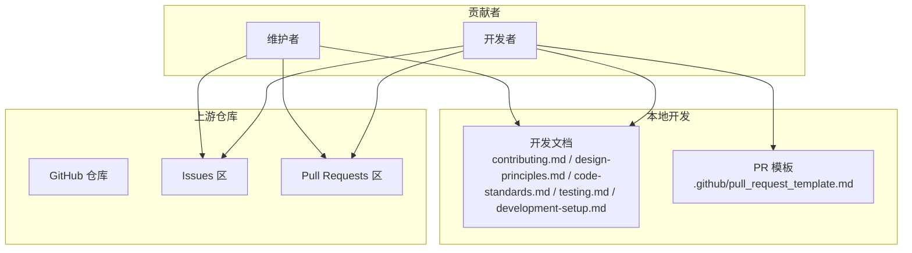
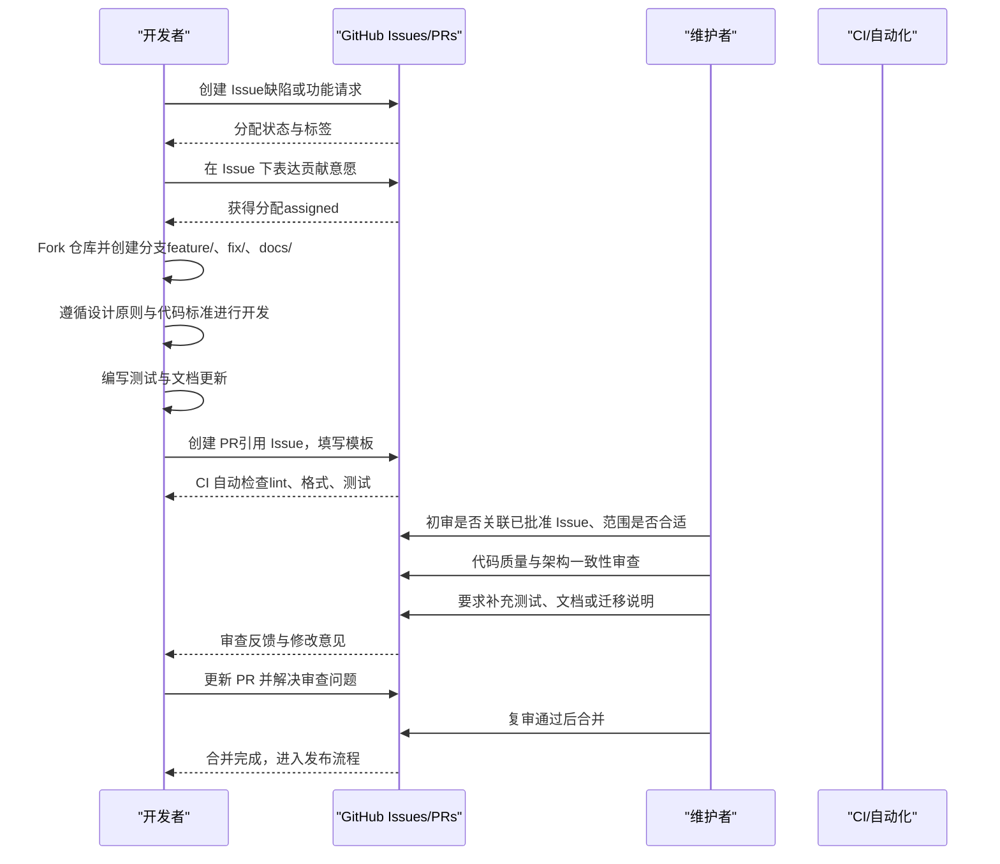
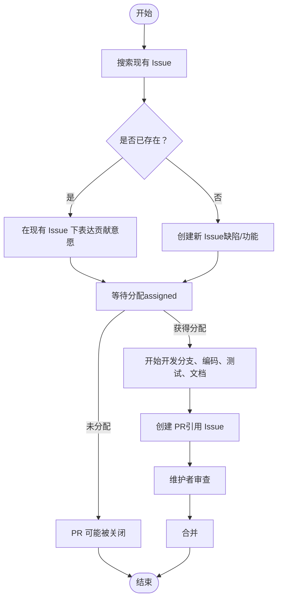
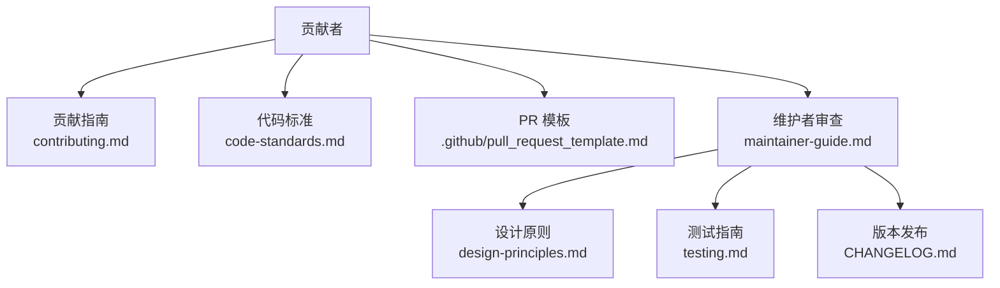

# 贡献指南

<cite>
**本文档引用的文件**
- [CONTRIBUTING.md](file://CONTRIBUTING.md)
- [MAINTAINER_GUIDE.md](file://MAINTAINER_GUIDE.md)
- [.github/pull_request_template.md](file://.github/pull_request_template.md)
- [docs/7-DEVELOPMENT/contributing.md](file://docs/7-DEVELOPMENT/contributing.md)
- [docs/7-DEVELOPMENT/design-principles.md](file://docs/7-DEVELOPMENT/design-principles.md)
- [docs/7-DEVELOPMENT/code-standards.md](file://docs/7-DEVELOPMENT/code-standards.md)
- [docs/7-DEVELOPMENT/testing.md](file://docs/7-DEVELOPMENT/testing.md)
- [docs/7-DEVELOPMENT/development-setup.md](file://docs/7-DEVELOPMENT/development-setup.md)
- [docs/7-DEVELOPMENT/maintainer-guide.md](file://docs/7-DEVELOPMENT/maintainer-guide.md)
- [README.md](file://README.md)
- [CHANGELOG.md](file://CHANGELOG.md)
</cite>

## 目录
1. [简介](#简介)
2. [项目结构](#项目结构)
3. [核心组件](#核心组件)
4. [架构总览](#架构总览)
5. [详细组件分析](#详细组件分析)
6. [依赖关系分析](#依赖关系分析)
7. [性能考虑](#性能考虑)
8. [故障排除指南](#故障排除指南)
9. [结论](#结论)
10. [附录](#附录)

## 简介
本指南面向所有希望为 Open Notebook 做出贡献的开发者，系统化地阐述贡献工作流程与协作规范。内容涵盖从问题报告到功能实现的完整流程、分支策略、提交信息规范、Pull Request 模板使用方法、代码审查流程、合并要求、版本发布流程，以及新贡献者的入门路径、常见贡献类型的操作步骤、社区行为准则与沟通渠道、问题标签系统、贡献统计与认可机制、维护者职责等。

## 项目结构
Open Notebook 是一个前后端分离的现代化研究助手平台，采用 Python FastAPI 后端、Next.js/React 前端、SurrealDB 数据存储，并通过 Docker 进行部署。贡献工作围绕以下文档与工具展开：
- 贡献总纲：CONTRIBUTING.md、docs/7-DEVELOPMENT/contributing.md
- 设计原则：docs/7-DEVELOPMENT/design-principles.md
- 代码标准：docs/7-DEVELOPMENT/code-standards.md
- 测试指南：docs/7-DEVELOPMENT/testing.md
- 开发环境：docs/7-DEVELOPMENT/development-setup.md
- 维护者指南：docs/7-DEVELOPMENT/maintainer-guide.md
- PR 模板：.github/pull_request_template.md
- 变更日志：CHANGELOG.md

**图表来源**
- [CONTRIBUTING.md](file://CONTRIBUTING.md#L1-L30)
- [docs/7-DEVELOPMENT/contributing.md](file://docs/7-DEVELOPMENT/contributing.md#L1-L202)
- [docs/7-DEVELOPMENT/design-principles.md](file://docs/7-DEVELOPMENT/design-principles.md#L1-L352)
- [docs/7-DEVELOPMENT/code-standards.md](file://docs/7-DEVELOPMENT/code-standards.md#L1-L376)
- [docs/7-DEVELOPMENT/testing.md](file://docs/7-DEVELOPMENT/testing.md#L1-L424)
- [docs/7-DEVELOPMENT/development-setup.md](file://docs/7-DEVELOPMENT/development-setup.md#L1-L417)
- [.github/pull_request_template.md](file://.github/pull_request_template.md#L1-L108)

**章节来源**
- [CONTRIBUTING.md](file://CONTRIBUTING.md#L1-L30)
- [README.md](file://README.md#L1-L358)

## 核心组件
- 贡献工作流：以 issue-first 为核心，先创建问题、获得分配后再开始编码，避免重复劳动与方向偏差。
- 分支策略：采用特性分支工作流，区分 feature/、fix/、docs/ 等命名空间。
- 提交信息规范：遵循祈使句、限制首行长度、参考问题与 PR 的约定式格式。
- PR 模板：强制填写变更类型、测试验证、设计对齐、清单检查、数据库变更、破坏性变更等字段。
- 代码审查：维护者负责初审、架构一致性、质量标准、测试覆盖、文档更新与迁移路径。
- 版本发布：基于语义化版本与变更日志，记录重大变更、安全增强、功能新增与修复。

**章节来源**
- [docs/7-DEVELOPMENT/contributing.md](file://docs/7-DEVELOPMENT/contributing.md#L5-L202)
- [.github/pull_request_template.md](file://.github/pull_request_template.md#L1-L108)
- [docs/7-DEVELOPMENT/design-principles.md](file://docs/7-DEVELOPMENT/design-principles.md#L1-L352)
- [docs/7-DEVELOPMENT/code-standards.md](file://docs/7-DEVELOPMENT/code-standards.md#L1-L376)
- [docs/7-DEVELOPMENT/testing.md](file://docs/7-DEVELOPMENT/testing.md#L1-L424)
- [docs/7-DEVELOPMENT/development-setup.md](file://docs/7-DEVELOPMENT/development-setup.md#L1-L417)
- [docs/7-DEVELOPMENT/maintainer-guide.md](file://docs/7-DEVELOPMENT/maintainer-guide.md#L1-L409)
- [CHANGELOG.md](file://CHANGELOG.md#L1-L197)

## 架构总览
下图展示了贡献者从问题到合并的端到端流程，包括 issue-first、PR 模板、审查与合并要求：

**图表来源**
- [docs/7-DEVELOPMENT/contributing.md](file://docs/7-DEVELOPMENT/contributing.md#L5-L202)
- [.github/pull_request_template.md](file://.github/pull_request_template.md#L1-L108)
- [docs/7-DEVELOPMENT/maintainer-guide.md](file://docs/7-DEVELOPMENT/maintainer-guide.md#L113-L170)

## 详细组件分析

### Issue-First 工作流程
- 核心原则：先创建 Issue，获得分配后再编码；未分配的 PR 可能被关闭，以避免浪费贡献者时间。
- 流程步骤：
  1) 搜索现有 Issue，避免重复；
  2) 使用模板创建缺陷或功能请求；
  3) 在 Issue 中表达贡献意愿；
  4) 获得分配后开始开发；
  5) 仅在 Issue 被分配时创建 PR。

**图表来源**
- [docs/7-DEVELOPMENT/contributing.md](file://docs/7-DEVELOPMENT/contributing.md#L5-L202)

**章节来源**
- [docs/7-DEVELOPMENT/contributing.md](file://docs/7-DEVELOPMENT/contributing.md#L5-L202)

### 分支策略与提交信息规范
- 分支命名：
  - 特性：feature/description
  - 修复：fix/description
  - 文档：docs/description
- 提交信息规范：
  - 使用祈使句
  - 首行不超过 72 字符
  - 在第二行及以后自由引用问题与 PR
- PR 标题建议采用约定式格式（如 feat:、fix:、docs: 等），便于变更日志生成。

**章节来源**
- [docs/7-DEVELOPMENT/contributing.md](file://docs/7-DEVELOPMENT/contributing.md#L90-L131)

### Pull Request 模板使用方法
- 必填字段：
  - 描述变更内容与动机
  - 关联 Issue 编号（Fixes #xxx）
  - 变更类型（缺陷修复、新功能、破坏性变更、文档更新、重构、性能改进、测试覆盖改进）
  - 测试验证（本地测试、开发环境、新增单元测试、现有测试通过、手动测试）
  - 设计对齐（选择符合的设计原则）
  - 清单检查（代码质量、测试、文档、数据库变更、破坏性变更）
- 预提交核验：阅读贡献指南、设计原则、确保已分配的 Issue、标题符合约定式格式。

**章节来源**
- [.github/pull_request_template.md](file://.github/pull_request_template.md#L1-L108)

### 代码审查流程与合并要求
- 初审要点：
  - 是否有关联的已批准 Issue 且已分配
  - PR 描述是否清晰说明变更与动机
  - 是否按模板勾选必要项
  - 是否有测试与截图（UI 变更）
- 架构与质量审查：
  - 是否符合设计原则
  - 是否遵循代码标准（类型提示、文档字符串、错误处理）
  - 是否具备适当的测试覆盖与边界用例
  - 是否更新了相关文档与 API 文档
  - 如涉及数据库，是否提供迁移脚本
- 破坏性变更：需提供迁移路径与明确文档
- 合并时机：审查通过后由维护者合并，保持与主分支同步

**章节来源**
- [docs/7-DEVELOPMENT/maintainer-guide.md](file://docs/7-DEVELOPMENT/maintainer-guide.md#L113-L170)
- [docs/7-DEVELOPMENT/code-standards.md](file://docs/7-DEVELOPMENT/code-standards.md#L358-L376)
- [docs/7-DEVELOPMENT/testing.md](file://docs/7-DEVELOPMENT/testing.md#L360-L424)

### 版本发布流程
- 版本管理：遵循语义化版本（SemVer），变更记录在 CHANGELOG.md 中
- 发布节奏：根据重大功能、安全增强、修复与文档更新进行版本迭代
- 发布前检查：确保 PR 符合设计原则、测试覆盖、文档更新与迁移脚本（如适用）

**章节来源**
- [CHANGELOG.md](file://CHANGELOG.md#L1-L197)

### 新贡献者入门指南
- 环境准备：安装 Python 3.11+、uv、SurrealDB、可选 Docker、Node.js 18+、Git
- 克隆与初始化：添加上游远程、安装依赖、复制并编辑 .env 示例
- 启动服务：启动 SurrealDB、运行数据库迁移、启动 API 与前端（可选）
- 验证：检查健康端点、API 文档、数据库迁移日志、前端加载情况
- 建议：设置预提交钩子、使用提供的 Make 命令与测试命令

**章节来源**
- [docs/7-DEVELOPMENT/development-setup.md](file://docs/7-DEVELOPMENT/development-setup.md#L1-L417)

### 常见贡献类型与操作步骤
- 缺陷修复（Bug Fix）
  - 步骤：搜索现有 Issue → 创建缺陷 Issue → 表达贡献意愿 → 获得分配 → 创建 fix/ 分支 → 编码修复 → 写测试 → 更新文档 → 提交 PR
- 功能开发（New Feature）
  - 步骤：搜索现有 Issue → 创建功能请求 Issue → 表达贡献意愿 → 获得分配 → 设计方案（对齐设计原则）→ 创建 feature/ 分支 → 实现与测试 → 更新文档 → 提交 PR
- 文档改进（Documentation）
  - 步骤：创建 docs/ 分支 → 修改相关文档 → 本地验证链接与示例 → 提交 PR
- 代码重构（Refactoring）
  - 步骤：在 Issue 中讨论重构目标与影响 → 获得分配 → 小步重构 → 保持测试通过 → 提交 PR
- 性能优化（Performance Improvement）
  - 步骤：定位瓶颈（基准测试）→ 设计优化方案 → 实施并验证 → 记录性能指标 → 提交 PR

**章节来源**
- [docs/7-DEVELOPMENT/contributing.md](file://docs/7-DEVELOPMENT/contributing.md#L26-L80)
- [docs/7-DEVELOPMENT/design-principles.md](file://docs/7-DEVELOPMENT/design-principles.md#L253-L284)

### 社区行为准则与沟通渠道
- 行为准则：尊重、建设性与协作，遵守项目愿景与设计原则
- 沟通渠道：
  - Discord：实时帮助与想法分享
  - GitHub Discussions：长文提问与讨论
  - GitHub Issues：缺陷报告与功能请求
- 问题标签系统（供维护者使用）：
  - 优先级：critical、high、medium、low
  - 状态：needs-triage、needs-info、needs-discussion、ready、in-progress、blocked
  - 类型：bug、enhancement、documentation、question、refactor
  - 难度：good first issue、help wanted、advanced

**章节来源**
- [docs/7-DEVELOPMENT/contributing.md](file://docs/7-DEVELOPMENT/contributing.md#L22-L24)
- [docs/7-DEVELOPMENT/maintainer-guide.md](file://docs/7-DEVELOPMENT/maintainer-guide.md#L85-L112)
- [README.md](file://README.md#L298-L317)

### 贡献统计、认可机制与维护者职责
- 贡献统计与认可：
  - GitHub 版本发布中的贡献者致谢
  - 社区内 Discord 认可
  - 项目分析中的贡献统计数据
  - 积极贡献者可考虑维护者职责
- 维护者职责：
  - Issue 初审与标签管理
  - PR 初审与架构一致性把关
  - 代码质量与测试覆盖审查
  - 文档更新与破坏性变更的迁移路径
  - 及时响应与沟通模板使用

**章节来源**
- [docs/7-DEVELOPMENT/contributing.md](file://docs/7-DEVELOPMENT/contributing.md#L188-L196)
- [docs/7-DEVELOPMENT/maintainer-guide.md](file://docs/7-DEVELOPMENT/maintainer-guide.md#L1-L409)

## 依赖关系分析
贡献流程的关键依赖关系如下：
- 贡献者依赖设计原则与代码标准指导开发方向与质量
- PR 模板约束变更范围与审查清单
- 维护者负责审查与决策，保障项目愿景与长期可维护性
- CI/自动化在 PR 提交后执行 lint、格式与测试检查

**图表来源**
- [docs/7-DEVELOPMENT/contributing.md](file://docs/7-DEVELOPMENT/contributing.md#L1-L202)
- [docs/7-DEVELOPMENT/code-standards.md](file://docs/7-DEVELOPMENT/code-standards.md#L1-L376)
- [.github/pull_request_template.md](file://.github/pull_request_template.md#L1-L108)
- [docs/7-DEVELOPMENT/maintainer-guide.md](file://docs/7-DEVELOPMENT/maintainer-guide.md#L1-L409)
- [docs/7-DEVELOPMENT/design-principles.md](file://docs/7-DEVELOPMENT/design-principles.md#L1-L352)
- [docs/7-DEVELOPMENT/testing.md](file://docs/7-DEVELOPMENT/testing.md#L1-L424)
- [CHANGELOG.md](file://CHANGELOG.md#L1-L197)

**章节来源**
- [docs/7-DEVELOPMENT/contributing.md](file://docs/7-DEVELOPMENT/contributing.md#L1-L202)
- [docs/7-DEVELOPMENT/maintainer-guide.md](file://docs/7-DEVELOPMENT/maintainer-guide.md#L1-L409)

## 性能考虑
- 异步优先：长耗时操作应异步处理，避免阻塞 UI 或 API
- 缓存与索引：合理使用数据库索引与缓存策略，减少查询延迟
- 测试驱动：通过测试发现性能瓶颈，避免过早优化
- 重构与演进：遵循设计原则，逐步优化而非一次性大改

[本节为通用指导，无需特定文件来源]

## 故障排除指南
- 数据库连接失败：确认 SurrealDB 已启动、URL 与凭据正确、日志显示迁移成功
- 端口占用：查找占用进程并更换端口或终止冲突进程
- 模块导入错误：重新安装依赖或使用 uv 同步
- 迁移失败：检查数据库可写性、凭据匹配与迁移日志
- 迁移未应用：重启 API 触发迁移、确认迁移文件存在且可读
- 本地 Ollama：按示例配置 Base URL 并在 UI 中注册模型

**章节来源**
- [docs/7-DEVELOPMENT/development-setup.md](file://docs/7-DEVELOPMENT/development-setup.md#L302-L362)

## 结论
Open Notebook 的贡献体系以 issue-first 为核心，结合设计原则、代码标准、测试指南与 PR 模板，形成从问题识别到功能交付的闭环。维护者通过标签与审查流程保障项目愿景与长期可维护性，社区通过多渠道沟通与认可机制促进协作与成长。遵循本文档的流程与规范，将有助于高效、高质量地推进贡献。

[本节为总结性内容，无需特定文件来源]

## 附录
- 快速链接：
  - 贡献指南：docs/7-DEVELOPMENT/contributing.md
  - 设计原则：docs/7-DEVELOPMENT/design-principles.md
  - 代码标准：docs/7-DEVELOPMENT/code-standards.md
  - 测试指南：docs/7-DEVELOPMENT/testing.md
  - 开发环境：docs/7-DEVELOPMENT/development-setup.md
  - 维护者指南：docs/7-DEVELOPMENT/maintainer-guide.md
  - PR 模板：.github/pull_request_template.md
  - 变更日志：CHANGELOG.md

[本节为导航性内容，无需特定文件来源]