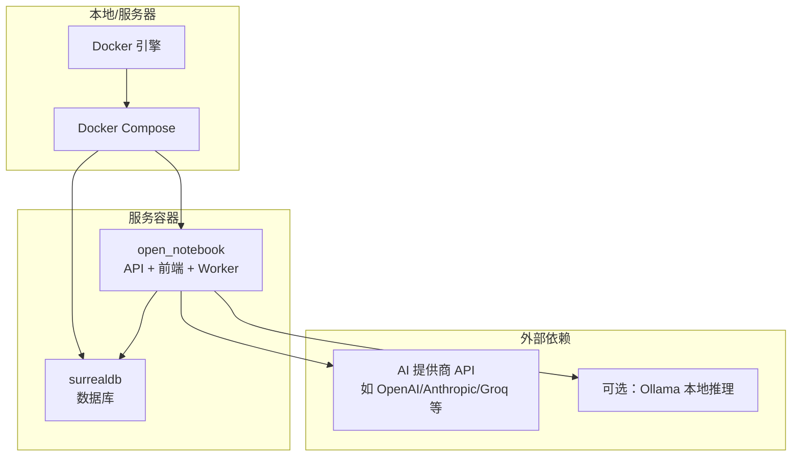
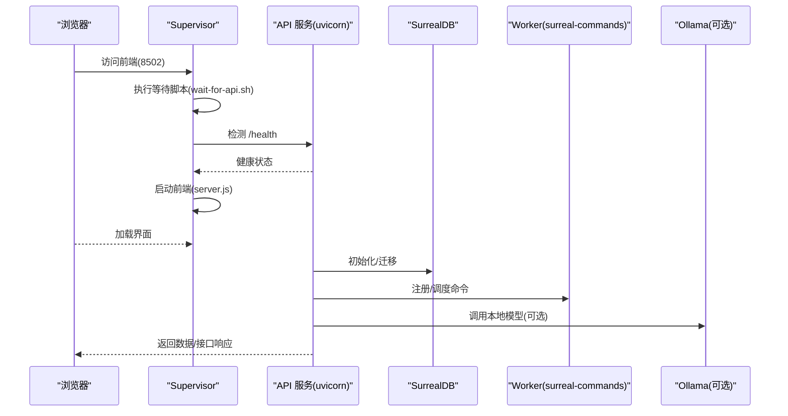
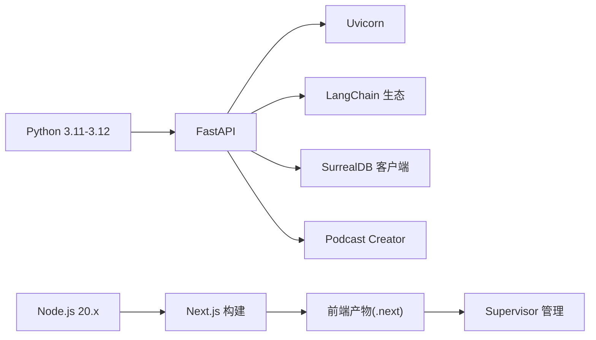

# 快速开始

<cite>
**本文引用的文件**
- [README.md](file://README.md)
- [docker-compose.yml](file://docker-compose.yml)
- [.env.example](file://.env.example)
- [Dockerfile](file://Dockerfile)
- [pyproject.toml](file://pyproject.toml)
- [docs/1-INSTALLATION/index.md](file://docs/1-INSTALLATION/index.md)
- [docs/1-INSTALLATION/docker-compose.md](file://docs/1-INSTALLATION/docker-compose.md)
- [docs/1-INSTALLATION/single-container.md](file://docs/1-INSTALLATION/single-container.md)
- [docs/1-INSTALLATION/from-source.md](file://docs/1-INSTALLATION/from-source.md)
- [examples/docker-compose-ollama.yml](file://examples/docker-compose-ollama.yml)
- [docs/5-CONFIGURATION/environment-reference.md](file://docs/5-CONFIGURATION/environment-reference.md)
- [docs/6-TROUBLESHOOTING/quick-fixes.md](file://docs/6-TROUBLESHOOTING/quick-fixes.md)
- [scripts/wait-for-api.sh](file://scripts/wait-for-api.sh)
- [supervisord.conf](file://supervisord.conf)
</cite>

## 目录
1. [简介](#简介)
2. [项目结构](#项目结构)
3. [核心组件](#核心组件)
4. [架构总览](#架构总览)
5. [详细组件分析](#详细组件分析)
6. [依赖关系分析](#依赖关系分析)
7. [性能与资源建议](#性能与资源建议)
8. [安装与配置步骤（从零到运行）](#安装与配置步骤从零到运行)
9. [常见问题排查](#常见问题排查)
10. [结论](#结论)
11. [附录：环境变量参考](#附录环境变量参考)

## 简介
本指南面向首次接触 Open Notebook 的用户，提供“从零到运行”的完整安装与配置流程。你将学会：
- 前置条件与系统要求
- 多种安装方式的对比与选择建议（Docker Compose、单容器、从源码）
- Docker 部署的关键步骤与环境变量设置
- AI 提供商配置与模型注册
- 安装成功后的验证清单
- 常见安装问题的快速修复

## 项目结构
Open Notebook 采用前后端分离的多语言技术栈，后端基于 Python/FastAPI，前端基于 Next.js/React，数据库使用 SurrealDB，容器编排通过 Docker Compose 实现。

图表来源
- [docker-compose.yml](file://docker-compose.yml#L1-L37)
- [Dockerfile](file://Dockerfile#L1-L114)
- [examples/docker-compose-ollama.yml](file://examples/docker-compose-ollama.yml#L1-L64)

章节来源
- [README.md](file://README.md#L97-L170)
- [docs/1-INSTALLATION/index.md](file://docs/1-INSTALLATION/index.md#L1-L154)

## 核心组件
- 数据库：SurrealDB（容器化运行，持久化存储）
- 后端 API：FastAPI 应用（uvicorn 运行），提供 REST 接口与业务逻辑
- 前端：Next.js 构建产物（静态 + 服务端启动脚本），通过 Supervisor 管理
- Worker：SurrealCommands 工作进程，处理异步任务（迁移、命令执行等）
- 可选本地推理：Ollama（通过环境变量连接）

章节来源
- [docker-compose.yml](file://docker-compose.yml#L1-L37)
- [Dockerfile](file://Dockerfile#L75-L114)
- [supervisord.conf](file://supervisord.conf#L1-L41)

## 架构总览
下图展示了容器内组件之间的交互关系与启动顺序保障机制。

图表来源
- [supervisord.conf](file://supervisord.conf#L28-L41)
- [scripts/wait-for-api.sh](file://scripts/wait-for-api.sh#L1-L23)
- [docker-compose.yml](file://docker-compose.yml#L15-L37)

## 详细组件分析

### 组件一：Docker Compose 编排
- 服务拆分清晰：数据库与应用分离，便于扩展与维护
- 默认暴露端口：8502（Web UI）、5055（REST API）
- 数据持久化：分别挂载数据库与笔记数据目录
- 环境变量：加密密钥、数据库连接、命名空间与数据库名

章节来源
- [docker-compose.yml](file://docker-compose.yml#L1-L37)
- [docs/1-INSTALLATION/docker-compose.md](file://docs/1-INSTALLATION/docker-compose.md#L1-L140)

### 组件二：单容器部署（简化版）
- 适用场景：共享主机、平台限制为单容器
- 特点：打包更简单，但灵活性较低
- 环境变量：与多容器一致，需设置加密密钥与数据库连接

章节来源
- [docs/1-INSTALLATION/single-container.md](file://docs/1-INSTALLATION/single-container.md#L1-L136)

### 组件三：从源码本地开发
- 适合开发者：需要调试、修改或贡献代码
- 步骤：克隆仓库、安装依赖、启动数据库、分别运行 API 与前端
- 端口：API 5055、前端 3000、数据库 8000

章节来源
- [docs/1-INSTALLATION/from-source.md](file://docs/1-INSTALLATION/from-source.md#L1-L181)

### 组件四：Supervisor 与启动顺序保障
- 作用：统一管理 API、Worker、前端进程；前端启动前等待 API 健康
- 关键点：通过等待脚本与超时策略避免“无法连接 API”错误

章节来源
- [supervisord.conf](file://supervisord.conf#L1-L41)
- [scripts/wait-for-api.sh](file://scripts/wait-for-api.sh#L1-L23)

## 依赖关系分析
- 运行时依赖：Python 3.11~3.12、Node.js 20.x、Docker
- 后端依赖：FastAPI、Uvicorn、LangChain 生态、SurrealDB 客户端、Podcast Creator 等
- 前端依赖：Next.js、Tailwind、TypeScript（构建产物由 Dockerfile 内部构建）

图表来源
- [pyproject.toml](file://pyproject.toml#L14-L42)
- [Dockerfile](file://Dockerfile#L1-L114)

章节来源
- [pyproject.toml](file://pyproject.toml#L1-L99)
- [Dockerfile](file://Dockerfile#L1-L114)

## 性能与资源建议
- 最低配置：4GB 内存、2GB 存储（含应用与文档）
- 推荐配置：8GB+ 内存、10GB+ 文档与模型空间、多核 CPU、可选 GPU（加速本地模型）
- 本地推理（Ollama）：根据硬件性能调整模型大小与并发

章节来源
- [docs/1-INSTALLATION/index.md](file://docs/1-INSTALLATION/index.md#L38-L51)

## 安装与配置步骤（从零到运行）

### 一、前置条件与系统要求
- Docker Desktop（Docker Compose 路线）
- 或 Node.js 18+（从源码路线）
- 至少 4GB 内存，稳定网络（可离线使用本地模型）
- 准备至少一个 AI 提供商的 API 密钥（OpenAI/Anthropic/Google/Groq 等），或准备 Ollama 本地模型

章节来源
- [docs/1-INSTALLATION/index.md](file://docs/1-INSTALLATION/index.md#L38-L98)
- [README.md](file://README.md#L99-L101)

### 二、选择安装方式（对比与建议）
- Docker Compose（推荐给大多数用户）
  - 优点：功能完整、服务解耦、易扩展、跨平台
  - 时间：约 5 分钟
- 单容器（简化部署）
  - 优点：配置最少、资源占用更低
  - 适用：PikaPods、Railway 等平台或共享主机
  - 时间：约 3 分钟
- 从源码（开发者）
  - 优点：完全可控、便于调试与贡献
  - 时间：约 10 分钟

章节来源
- [docs/1-INSTALLATION/index.md](file://docs/1-INSTALLATION/index.md#L5-L34)

### 三、Docker Compose 快速安装（推荐）
1) 获取 docker-compose.yml
- 方式 A：直接下载官方文件
- 方式 B：复制仓库中的官方示例
- 方式 C：手动创建文件（内容见下方“章节来源”）

2) 修改加密密钥
- 将 OPEN_NOTEBOOK_ENCRYPTION_KEY 替换为你的强口令（至少 16 位）

3) 启动服务
- 在包含 docker-compose.yml 的目录执行：docker compose up -d
- 等待 15-20 秒，访问 http://localhost:8502

4) 验证安装
- API 健康检查：curl http://localhost:5055/health
- 浏览器打开前端地址：http://localhost:8502

5) 配置 AI 提供商
- 进入 设置 → API 密钥 → 添加凭据 → 保存并测试连接 → 发现模型 → 注册模型

6) 创建第一个笔记本
- 点击 新建笔记本，填写名称与描述即可

章节来源
- [docs/1-INSTALLATION/docker-compose.md](file://docs/1-INSTALLATION/docker-compose.md#L13-L140)
- [docker-compose.yml](file://docker-compose.yml#L1-L37)
- [README.md](file://README.md#L103-L163)

### 四、单容器安装（简化）
- 使用镜像：lfnovo/open_notebook:v1-latest-single
- 端口映射：8502（UI）、5055（API）
- 环境变量：OPEN_NOTEBOOK_ENCRYPTION_KEY、SURREAL_*、API_URL（可选）
- 云平台一键部署：PikaPods、Railway、Render、DigitalOcean App Platform、Heroku、Coolify 等均有示例

章节来源
- [docs/1-INSTALLATION/single-container.md](file://docs/1-INSTALLATION/single-container.md#L1-L136)

### 五、从源码安装（开发者）
- 克隆仓库、安装 Python 与 Node.js、安装依赖（uv）
- 启动数据库（Docker 或本地）
- 设置 .env（复制 .env.example 并填入 OPEN_NOTEBOOK_ENCRYPTION_KEY）
- 分别启动 API（5055）与前端（3000）
- 在浏览器中完成 AI 提供商配置

章节来源
- [docs/1-INSTALLATION/from-source.md](file://docs/1-INSTALLATION/from-source.md#L1-L181)
- [.env.example](file://.env.example#L1-L60)

### 六、可选：启用本地 AI（Ollama）
- 在 docker-compose.yml 中添加 ollama 服务，并设置 OLLAMA_BASE_URL
- 下载模型后在 UI 中添加 Ollama 凭据并注册模型
- 或直接使用 examples/docker-compose-ollama.yml

章节来源
- [examples/docker-compose-ollama.yml](file://examples/docker-compose-ollama.yml#L1-L64)
- [docs/1-INSTALLATION/docker-compose.md](file://docs/1-INSTALLATION/docker-compose.md#L145-L186)

### 七、环境变量设置要点
- 必填项：OPEN_NOTEBOOK_ENCRYPTION_KEY（用于加密数据库中的凭据）
- 数据库：SURREAL_URL、SURREAL_USER、SURREAL_PASSWORD、SURREAL_NAMESPACE、SURREAL_DATABASE
- 可选：API_URL（反向代理或自定义域名时设置）、HTTP_PROXY/HTTPS_PROXY/NO_PROXY（企业网络）
- 高级：并发、超时、调试追踪等（见“附录：环境变量参考”）

章节来源
- [.env.example](file://.env.example#L1-L60)
- [docs/5-CONFIGURATION/environment-reference.md](file://docs/5-CONFIGURATION/environment-reference.md#L1-L275)

## 常见问题排查
以下为高频问题的“1 分钟解决法”：

- 无法连接到服务器
  - 检查 API 是否运行、端口 5055 是否可达、重启服务后重试
- 无效 API 密钥或模型未显示
  - 在 UI 中添加/测试凭据，重新发现并注册模型
- 端口被占用
  - 更改映射端口或释放占用端口
- 文件格式不支持或过大
  - 支持 PDF/DOCX/PPTX/XLSX/音频/视频/网页链接；避免纯图片无 OCR、单句来源
- 聊天响应慢
  - 切换更快模型、减少上下文、降低并发
- 搜索无结果
  - 尝试不同搜索类型（关键词/向量/概念），简化查询，确认来源已处理
- 播客生成失败
  - 增加内容长度与多样性，检查 TTS 配额与网络
- 服务无法启动或 Docker 报错
  - 查看日志、重建镜像、检查磁盘空间与内存分配
- 数据库连接过多
  - 降低并发参数 SURREAL_COMMANDS_MAX_TASKS
- 启动慢/下载超时（国内网络）
  - 增大超时或使用国内镜像源

章节来源
- [docs/6-TROUBLESHOOTING/quick-fixes.md](file://docs/6-TROUBLESHOOTING/quick-fixes.md#L1-L373)

## 结论
通过本指南，你可以以最短时间完成 Open Notebook 的安装与配置，并成功运行第一个笔记本。建议优先选择 Docker Compose，既保证功能完整性又便于后续扩展；若追求极致简洁或受限于平台，可选用单容器方案；开发者请使用“从源码”方式以便调试与贡献。

## 附录：环境变量参考
- API 配置：API_URL、INTERNAL_API_URL、API_CLIENT_TIMEOUT、OPEN_NOTEBOOK_PASSWORD、OPEN_NOTEBOOK_ENCRYPTION_KEY、HOSTNAME
- 数据库：SURREAL_URL、SURREAL_USER、SURREAL_PASSWORD、SURREAL_NAMESPACE、SURREAL_DATABASE
- 数据库重试与并发：SURREAL_COMMANDS_RETRY_ENABLED、SURREAL_COMMANDS_RETRY_MAX_ATTEMPTS、SURREAL_COMMANDS_RETRY_WAIT_STRATEGY、SURREAL_COMMANDS_RETRY_WAIT_MIN、SURREAL_COMMANDS_RETRY_WAIT_MAX、SURREAL_COMMANDS_MAX_TASKS
- LLM 超时与证书：ESPERANTO_LLM_TIMEOUT、ESPERANTO_SSL_VERIFY、ESPERANTO_SSL_CA_BUNDLE
- TTS 批处理：TTS_BATCH_SIZE
- 内容抽取：FIRECRAWL_API_KEY、JINA_API_KEY
- 网络代理：HTTP_PROXY、HTTPS_PROXY、NO_PROXY
- 调试与监控：LANGCHAIN_TRACING_V2、LANGCHAIN_ENDPOINT、LANGCHAIN_API_KEY、LANGCHAIN_PROJECT

章节来源
- [docs/5-CONFIGURATION/environment-reference.md](file://docs/5-CONFIGURATION/environment-reference.md#L1-L275)