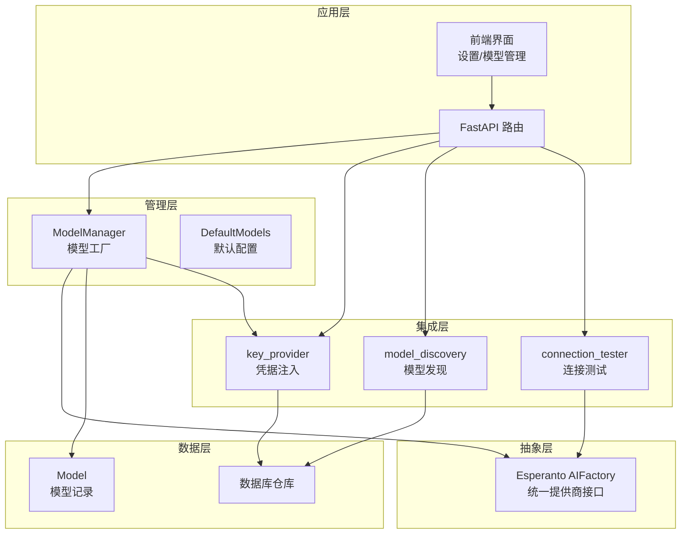
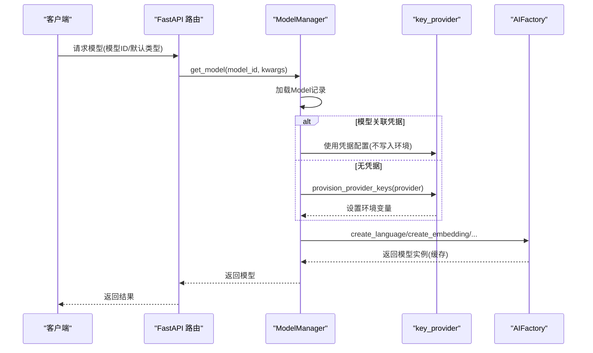
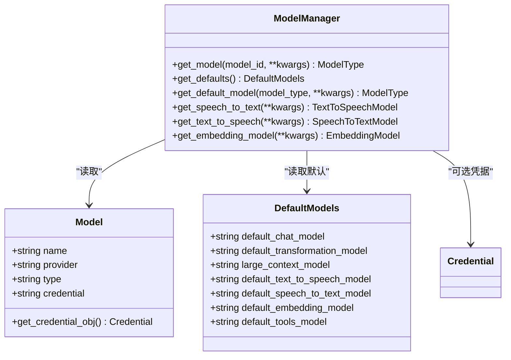
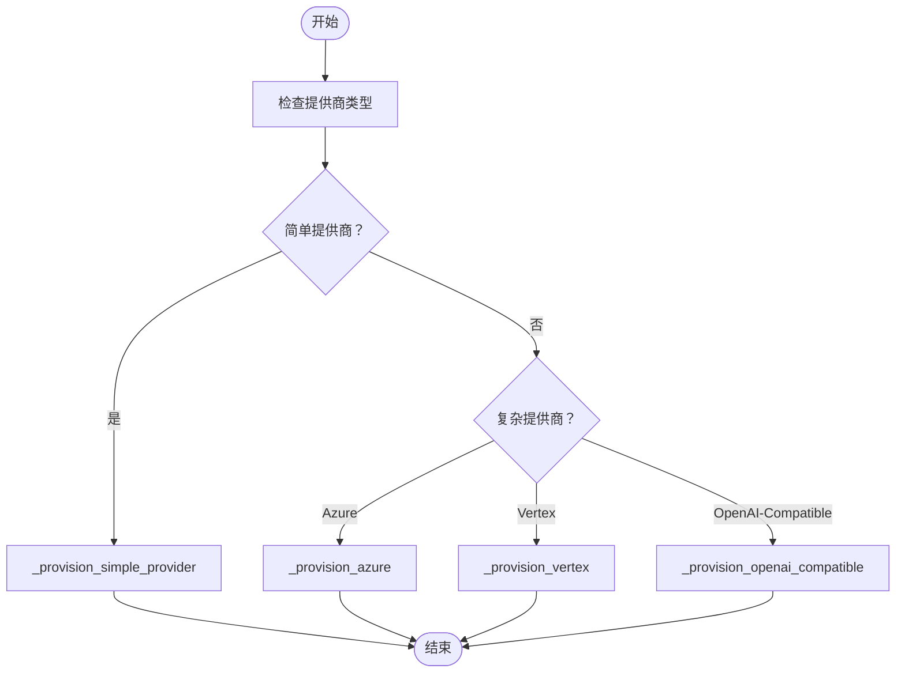
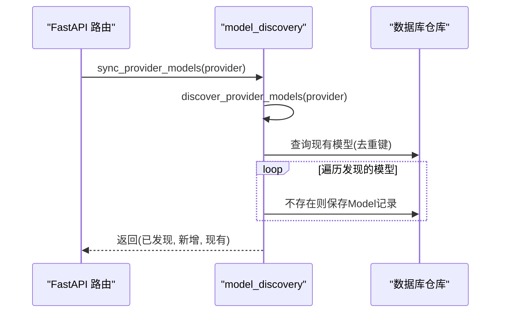
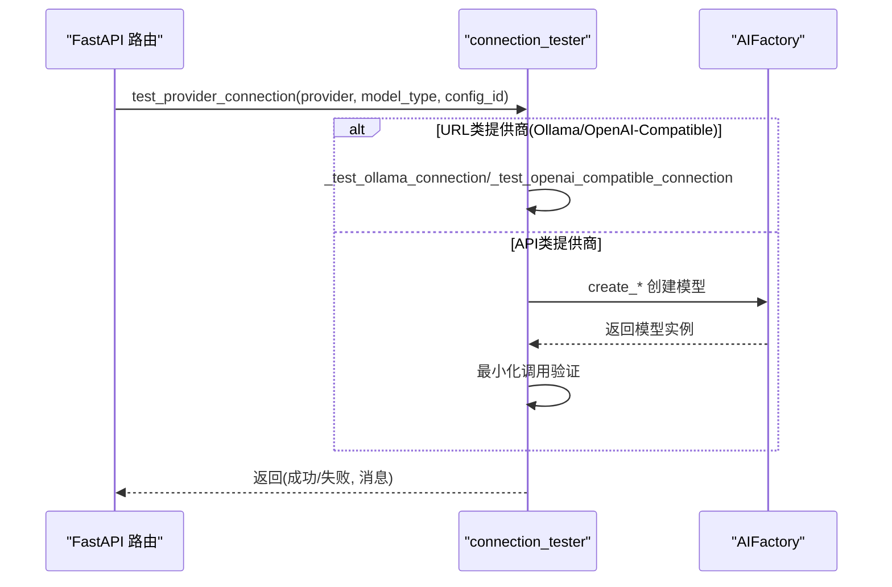
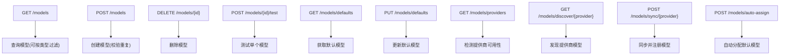
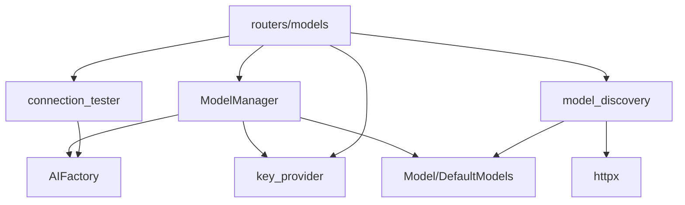

# AI模型集成

<cite>
**本文档引用的文件**
- [open_notebook/ai/models.py](file://open_notebook/ai/models.py)
- [open_notebook/ai/model_discovery.py](file://open_notebook/ai/model_discovery.py)
- [open_notebook/ai/connection_tester.py](file://open_notebook/ai/connection_tester.py)
- [open_notebook/ai/key_provider.py](file://open_notebook/ai/key_provider.py)
- [open_notebook/ai/provision.py](file://open_notebook/ai/provision.py)
- [open_notebook/domain/provider_config.py](file://open_notebook/domain/provider_config.py)
- [open_notebook/domain/credential.py](file://open_notebook/domain/credential.py)
- [api/routers/models.py](file://api/routers/models.py)
- [api/models_service.py](file://api/models_service.py)
- [docs/5-CONFIGURATION/ai-providers.md](file://docs/5-CONFIGURATION/ai-providers.md)
- [docs/5-CONFIGURATION/ollama.md](file://docs/5-CONFIGURATION/ollama.md)
- [docs/5-CONFIGURATION/openai-compatible.md](file://docs/5-CONFIGURATION/openai-compatible.md)
- [docs/4-AI-PROVIDERS/index.md](file://docs/4-AI-PROVIDERS/index.md)
</cite>

## 目录
1. [简介](#简介)
2. [项目结构](#项目结构)
3. [核心组件](#核心组件)
4. [架构总览](#架构总览)
5. [详细组件分析](#详细组件分析)
6. [依赖关系分析](#依赖关系分析)
7. [性能考虑](#性能考虑)
8. [故障排除指南](#故障排除指南)
9. [结论](#结论)
10. [附录](#附录)

## 简介
本指南面向需要在系统中集成新AI提供商或自定义模型配置的开发者与运维人员。内容覆盖模型发现机制、连接测试流程、不同提供商（OpenAI、Anthropic、Ollama等）的集成方法、模型参数配置、请求格式适配与响应处理、本地模型部署与推理优化、性能监控与错误处理策略，以及多模型切换与A/B测试的实现思路。

## 项目结构
系统采用“数据库模型 + 工厂管理 + 提供商抽象”的分层设计：
- 数据层：Model、DefaultModels 记录模型元数据与默认配置
- 管理层：ModelManager 负责按需实例化模型，支持凭据链接与环境变量回退
- 抽象层：Esperanto AIFactory 统一不同提供商的调用接口
- 集成层：key_provider、model_discovery、connection_tester 提供密钥注入、模型发现与连通性测试
- 接口层：FastAPI 路由提供模型查询、同步、自动分配与测试能力

图表来源
- [open_notebook/ai/models.py](file://open_notebook/ai/models.py#L97-L267)
- [open_notebook/ai/key_provider.py](file://open_notebook/ai/key_provider.py#L236-L271)
- [open_notebook/ai/model_discovery.py](file://open_notebook/ai/model_discovery.py#L608-L725)
- [open_notebook/ai/connection_tester.py](file://open_notebook/ai/connection_tester.py#L170-L300)
- [api/routers/models.py](file://api/routers/models.py#L165-L287)

章节来源
- [open_notebook/ai/models.py](file://open_notebook/ai/models.py#L1-L267)
- [open_notebook/ai/key_provider.py](file://open_notebook/ai/key_provider.py#L1-L298)
- [open_notebook/ai/model_discovery.py](file://open_notebook/ai/model_discovery.py#L1-L757)
- [open_notebook/ai/connection_tester.py](file://open_notebook/ai/connection_tester.py#L1-L439)
- [api/routers/models.py](file://api/routers/models.py#L1-L771)

## 核心组件
- 模型元数据与默认配置
  - Model：存储模型名称、提供商、类型（语言/嵌入/语音转文本/文本转语音）、可选凭据关联
  - DefaultModels：记录默认聊天、转换、工具、大上下文、语音等模型的ID
- 模型工厂与智能选择
  - ModelManager：根据模型ID或默认配置获取模型实例；支持凭据优先与环境变量回退；支持大型上下文自动升级
- 凭据与密钥注入
  - key_provider：从数据库凭据或环境变量注入提供商密钥与基础URL
- 模型发现与注册
  - model_discovery：按提供商拉取可用模型列表，自动分类模型类型，并批量注册到数据库
- 连接测试与端到端验证
  - connection_tester：最小化调用验证提供商连通性；对单个模型进行端到端测试
- API路由与服务
  - routers/models：提供模型查询、同步、自动分配、测试等接口
  - models_service：API层封装，便于前后端交互

章节来源
- [open_notebook/ai/models.py](file://open_notebook/ai/models.py#L18-L267)
- [open_notebook/ai/key_provider.py](file://open_notebook/ai/key_provider.py#L68-L271)
- [open_notebook/ai/model_discovery.py](file://open_notebook/ai/model_discovery.py#L21-L757)
- [open_notebook/ai/connection_tester.py](file://open_notebook/ai/connection_tester.py#L19-L439)
- [api/routers/models.py](file://api/routers/models.py#L165-L771)

## 架构总览
系统通过 Esperanto 的 AIFactory 实现多提供商抽象，ModelManager 在运行时负责：
- 从数据库加载模型元数据
- 若模型关联凭据则直接使用凭据配置；否则通过 key_provider 注入环境变量
- 将模型类型映射到 Esperanto 的 create_* 方法
- 缓存模型实例以提升性能

图表来源
- [open_notebook/ai/models.py](file://open_notebook/ai/models.py#L97-L176)
- [open_notebook/ai/key_provider.py](file://open_notebook/ai/key_provider.py#L236-L271)

章节来源
- [open_notebook/ai/models.py](file://open_notebook/ai/models.py#L97-L176)
- [open_notebook/ai/key_provider.py](file://open_notebook/ai/key_provider.py#L236-L271)

## 详细组件分析

### 模型工厂与智能选择（ModelManager）
- 支持按ID获取模型；若模型关联凭据则直接使用凭据配置字典；否则通过 key_provider 注入环境变量
- 支持默认模型查询（聊天、转换、工具、大上下文、嵌入、语音等）
- 支持按上下文长度自动选择大上下文模型（>105,000 token）
- 对返回类型进行断言，避免误用

图表来源
- [open_notebook/ai/models.py](file://open_notebook/ai/models.py#L97-L267)

章节来源
- [open_notebook/ai/models.py](file://open_notebook/ai/models.py#L97-L267)

### 凭据注入与环境变量回退（key_provider）
- 单一入口 provision_provider_keys：根据提供商类型设置环境变量
- 复杂提供商（Azure、Vertex、OpenAI-Compatible）分别处理多字段配置
- 提供 get_api_key 用于读取单一密钥

图表来源
- [open_notebook/ai/key_provider.py](file://open_notebook/ai/key_provider.py#L236-L271)

章节来源
- [open_notebook/ai/key_provider.py](file://open_notebook/ai/key_provider.py#L68-L271)

### 模型发现与注册（model_discovery）
- 基于提供商的发现函数（OpenAI、Anthropic、Google、Ollama、Groq、Mistral、DeepSeek、xAI、OpenRouter、Voyage、ElevenLabs、OpenAI-Compatible）
- 自动分类模型类型（语言/嵌入/语音），支持批量去重注册
- 并行同步所有提供商模型，统计新增/现有数量

图表来源
- [open_notebook/ai/model_discovery.py](file://open_notebook/ai/model_discovery.py#L632-L697)

章节来源
- [open_notebook/ai/model_discovery.py](file://open_notebook/ai/model_discovery.py#L173-L757)

### 连接测试与端到端验证（connection_tester）
- 测试提供商连通性：针对不同提供商执行最小化调用（语言模型、嵌入、TTS）
- 对 Ollama 与 OpenAI-Compatible 执行基础URL连通性测试
- 对指定模型执行端到端测试（语言/嵌入/语音），生成用户友好错误信息

图表来源
- [open_notebook/ai/connection_tester.py](file://open_notebook/ai/connection_tester.py#L170-L300)

章节来源
- [open_notebook/ai/connection_tester.py](file://open_notebook/ai/connection_tester.py#L170-L439)

### API路由与服务（routers/models 与 models_service）
- 提供模型查询、创建、删除、测试
- 提供默认模型查询与更新
- 提供提供商可用性检测、模型发现与同步、自动分配默认模型
- models_service 作为API层封装，便于前端调用

图表来源
- [api/routers/models.py](file://api/routers/models.py#L165-L771)

章节来源
- [api/routers/models.py](file://api/routers/models.py#L165-L771)
- [api/models_service.py](file://api/models_service.py#L13-L113)

### 不同AI提供商的集成方法

#### OpenAI
- 通过 Settings → API Keys 添加凭据，测试连接后发现并注册模型
- 默认测试模型为 gpt-3.5-turbo（语言），嵌入为 voyage-3-lite（嵌入）

章节来源
- [docs/5-CONFIGURATION/ai-providers.md](file://docs/5-CONFIGURATION/ai-providers.md#L25-L67)
- [open_notebook/ai/connection_tester.py](file://open_notebook/ai/connection_tester.py#L21-L37)

#### Anthropic（Claude）
- 凭据添加与测试流程同上；静态模型列表用于发现
- 默认测试模型为 claude-3-haiku-20240307（语言）

章节来源
- [docs/5-CONFIGURATION/ai-providers.md](file://docs/5-CONFIGURATION/ai-providers.md#L70-L115)
- [open_notebook/ai/connection_tester.py](file://open_notebook/ai/connection_tester.py#L21-L37)

#### Google（Gemini）
- 支持 GEMINI_API_KEY 或 GOOGLE_API_KEY；根据 supportedGenerationMethods 分类模型类型
- 默认测试模型为 gemini-2.0-flash（语言）

章节来源
- [open_notebook/ai/model_discovery.py](file://open_notebook/ai/model_discovery.py#L226-L266)
- [open_notebook/ai/connection_tester.py](file://open_notebook/ai/connection_tester.py#L21-L37)

#### Groq
- 仅列出可用模型；默认测试模型为 llama-3.1-8b-instant（语言）

章节来源
- [open_notebook/ai/model_discovery.py](file://open_notebook/ai/model_discovery.py#L302-L333)
- [open_notebook/ai/connection_tester.py](file://open_notebook/ai/connection_tester.py#L21-L37)

#### Mistral、DeepSeek、xAI、OpenRouter
- 通过各自API获取模型列表；OpenRouter模型默认为语言模型
- 默认测试模型分别为 mistral-small-latest、deepseek-chat、grok-beta、openai/gpt-3.5-turbo

章节来源
- [open_notebook/ai/model_discovery.py](file://open_notebook/ai/model_discovery.py#L336-L475)
- [open_notebook/ai/connection_tester.py](file://open_notebook/ai/connection_tester.py#L21-L37)

#### Ollama（本地）
- 通过 Settings → API Keys 配置 base_url；测试连接验证 /api/tags
- 模型名必须与 ollama list 输出完全一致；支持动态选择测试模型
- 参考网络配置与硬件要求，确保容器间连通性

章节来源
- [docs/5-CONFIGURATION/ai-providers.md](file://docs/5-CONFIGURATION/ai-providers.md#L254-L320)
- [docs/5-CONFIGURATION/ollama.md](file://docs/5-CONFIGURATION/ollama.md#L58-L173)
- [open_notebook/ai/connection_tester.py](file://open_notebook/ai/connection_tester.py#L97-L130)

#### OpenAI-Compatible（本地/自建）
- 支持 LLM、Embedding、TTS、STT 的独立URL配置
- 通过 Settings → API Keys 配置 base_url 与可选API key；测试连接验证 /models
- 模型名需与服务器期望一致

章节来源
- [docs/5-CONFIGURATION/openai-compatible.md](file://docs/5-CONFIGURATION/openai-compatible.md#L69-L143)
- [open_notebook/ai/connection_tester.py](file://open_notebook/ai/connection_tester.py#L132-L169)

#### Azure OpenAI
- 需要 endpoint、api_key、api_version；可通过特定部署名称测试模型列表
- 支持模式化端点（LLM/Embedding/STT/TTS）

章节来源
- [open_notebook/ai/connection_tester.py](file://open_notebook/ai/connection_tester.py#L40-L95)

### 模型参数配置、请求格式适配与响应处理
- 参数传递：ModelManager.get_model 支持 kwargs，会合并到最终配置字典，传给 AIFactory.create_* 方法
- 请求格式：通过 Esperanto 抽象屏蔽差异；具体格式遵循各提供商的 OpenAI 兼容语义
- 响应处理：语言模型返回消息对象；嵌入返回向量数组；TTS返回音频对象；STT返回转录文本

章节来源
- [open_notebook/ai/models.py](file://open_notebook/ai/models.py#L143-L175)
- [open_notebook/ai/connection_tester.py](file://open_notebook/ai/connection_tester.py#L367-L439)

### 本地模型部署与推理优化
- Ollama 部署与网络配置：根据部署场景正确配置 base_url；Linux 需要 extra_hosts；启用外部访问需设置 OLLAMA_HOST
- 模型选择与资源限制：根据硬件选择合适模型大小；使用 keep_alive 预热；合理设置并发与队列
- 性能监控：结合系统监控与日志查看，关注内存/CPU/GPU占用与模型加载状态

章节来源
- [docs/5-CONFIGURATION/ollama.md](file://docs/5-CONFIGURATION/ollama.md#L58-L173)
- [docs/5-CONFIGURATION/ollama.md](file://docs/5-CONFIGURATION/ollama.md#L475-L632)

### 模型性能监控与错误处理策略
- 连接测试：最小化调用验证连通性；对速率限制、超时、网络错误进行归一化提示
- 错误处理：捕获常见HTTP状态码与异常，输出用户可理解的消息；对模型不存在但鉴权通过的情况给出区分提示
- 日志记录：使用 loguru 记录关键路径与调试信息

章节来源
- [open_notebook/ai/connection_tester.py](file://open_notebook/ai/connection_tester.py#L275-L299)
- [open_notebook/ai/connection_tester.py](file://open_notebook/ai/connection_tester.py#L347-L365)

### 多模型切换与A/B测试
- 多模型切换：通过 DefaultModels 中的不同槽位（聊天、转换、工具、大上下文、嵌入、语音）实现；也可按需传入 model_id 覆盖默认
- A/B测试：通过自动分配逻辑（按提供商优先级与偏好）为不同任务分配最佳模型；结合测试接口验证效果

章节来源
- [open_notebook/ai/models.py](file://open_notebook/ai/models.py#L220-L264)
- [api/routers/models.py](file://api/routers/models.py#L678-L771)

## 依赖关系分析
- ModelManager 依赖 Esperanto AIFactory 进行模型实例化
- ModelManager 依赖 key_provider 进行凭据注入或环境变量回退
- model_discovery 依赖 httpx 与各提供商API
- connection_tester 依赖 Esperanto 与各提供商API
- routers/models 依赖 Model、DefaultModels、Credential、key_provider、model_discovery、connection_tester

图表来源
- [open_notebook/ai/models.py](file://open_notebook/ai/models.py#L97-L176)
- [open_notebook/ai/model_discovery.py](file://open_notebook/ai/model_discovery.py#L173-L205)
- [open_notebook/ai/connection_tester.py](file://open_notebook/ai/connection_tester.py#L170-L275)
- [api/routers/models.py](file://api/routers/models.py#L16-L27)

章节来源
- [open_notebook/ai/models.py](file://open_notebook/ai/models.py#L97-L176)
- [open_notebook/ai/model_discovery.py](file://open_notebook/ai/model_discovery.py#L173-L205)
- [open_notebook/ai/connection_tester.py](file://open_notebook/ai/connection_tester.py#L170-L275)
- [api/routers/models.py](file://api/routers/models.py#L16-L27)

## 性能考虑
- 模型缓存：Esperanto AIFactory 内部缓存模型实例，减少重复初始化开销
- 上下文感知：provision_langchain_model 在内容超过阈值时自动选择大上下文模型
- 并发与批量：model_discovery 同步所有提供商时使用 asyncio.gather 并行执行
- 网络与资源：Ollama 环境变量（如 OLLAMA_NUM_PARALLEL、OLLAMA_KEEP_ALIVE）影响并发与预热

章节来源
- [open_notebook/ai/provision.py](file://open_notebook/ai/provision.py#L9-L61)
- [open_notebook/ai/model_discovery.py](file://open_notebook/ai/model_discovery.py#L708-L724)
- [docs/5-CONFIGURATION/ollama.md](file://docs/5-CONFIGURATION/ollama.md#L532-L545)

## 故障排除指南
- “Invalid API key”：检查密钥前缀与提供商要求；在 Settings → API Keys 中重新测试
- “Model not available”：尝试其他模型或重新发现模型；确认模型名与提供商API返回一致
- “Connection refused/timeout”：检查 base_url、防火墙、Docker 网络（Linux 需 extra_hosts）
- “Rate limited”：等待或升级账户；系统会识别并提示
- Ollama 模型名不匹配：严格使用 ollama list 显示的确切名称

章节来源
- [open_notebook/ai/connection_tester.py](file://open_notebook/ai/connection_tester.py#L275-L299)
- [docs/5-CONFIGURATION/ollama.md](file://docs/5-CONFIGURATION/ollama.md#L245-L420)

## 结论
通过统一的凭据注入、模型发现与工厂管理，系统实现了对多家AI提供商的无缝集成与灵活切换。配合完善的连接测试与错误处理策略，能够快速定位问题并保障生产环境稳定性。建议在生产环境中：
- 使用凭据管理替代环境变量
- 定期同步模型列表并自动分配默认模型
- 针对本地部署优化网络与资源参数
- 建立多模型A/B测试流程，持续评估性能与成本

## 附录
- 选择与比较：参考 AI Providers 选择指南，结合自身预算、隐私与性能需求选择合适提供商
- 本地部署：Ollama 与 OpenAI-Compatible 提供了完整的本地部署与网络配置指导

章节来源
- [docs/4-AI-PROVIDERS/index.md](file://docs/4-AI-PROVIDERS/index.md#L1-L200)
- [docs/5-CONFIGURATION/ai-providers.md](file://docs/5-CONFIGURATION/ai-providers.md#L407-L447)
- [docs/5-CONFIGURATION/ollama.md](file://docs/5-CONFIGURATION/ollama.md#L1-L741)
- [docs/5-CONFIGURATION/openai-compatible.md](file://docs/5-CONFIGURATION/openai-compatible.md#L1-L401)