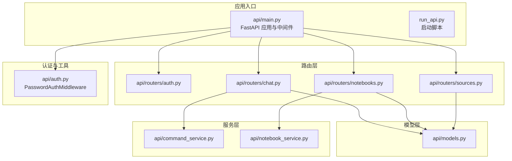
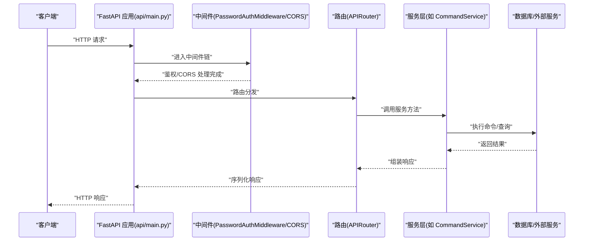
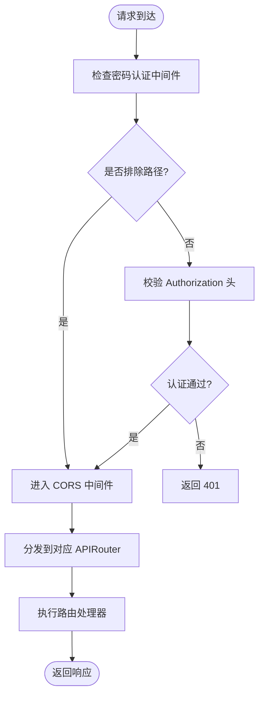
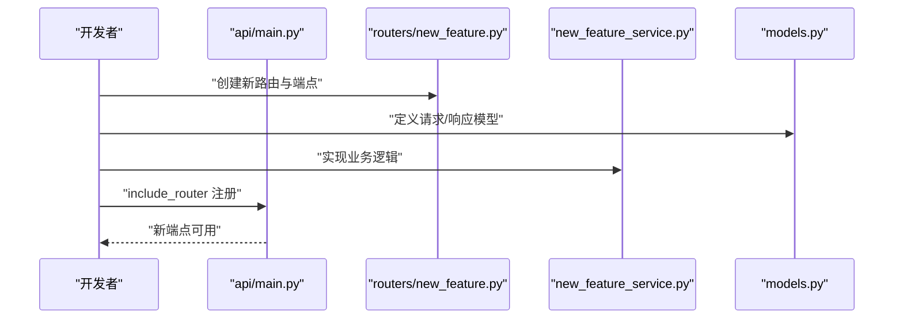
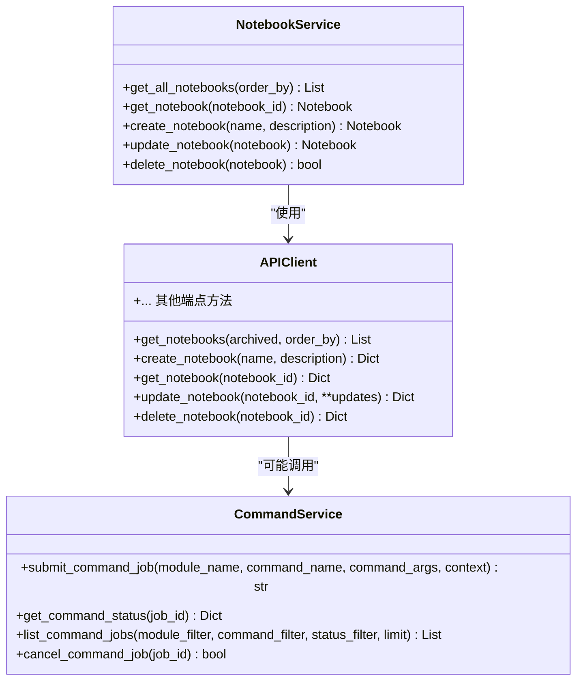
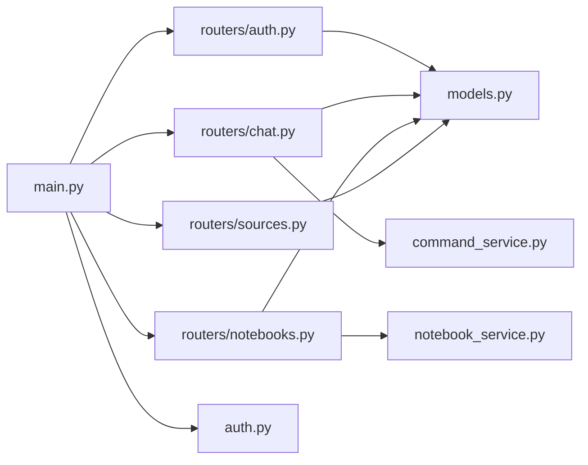

# API扩展

<cite>
**本文引用的文件**
- [api/main.py](file://api/main.py)
- [api/auth.py](file://api/auth.py)
- [api/routers/__init__.py](file://api/routers/__init__.py)
- [api/routers/auth.py](file://api/routers/auth.py)
- [api/routers/chat.py](file://api/routers/chat.py)
- [api/routers/notebooks.py](file://api/routers/notebooks.py)
- [api/routers/sources.py](file://api/routers/sources.py)
- [api/models.py](file://api/models.py)
- [api/command_service.py](file://api/command_service.py)
- [api/notebook_service.py](file://api/notebook_service.py)
- [api/client.py](file://api/client.py)
- [run_api.py](file://run_api.py)
- [api/CLAUDE.md](file://api/CLAUDE.md)
</cite>

## 目录
1. [简介](#简介)
2. [项目结构](#项目结构)
3. [核心组件](#核心组件)
4. [架构总览](#架构总览)
5. [详细组件分析](#详细组件分析)
6. [依赖分析](#依赖分析)
7. [性能考虑](#性能考虑)
8. [故障排查指南](#故障排查指南)
9. [结论](#结论)
10. [附录](#附录)

## 简介
本指南面向希望在 Open Notebook 的 FastAPI 后端上进行扩展与定制的开发者，系统讲解如何：
- 添加新的 API 端点与扩展现有路由
- 创建自定义服务层与业务逻辑
- 使用 FastAPI 路由系统与中间件机制
- 实施 API 版本控制与向后兼容策略
- 扩展认证、权限控制与速率限制
- 构建异步 API 端点与 WebSocket 连接
- 生成 API 文档与编写测试
- 集成第三方 API 与外部服务

## 项目结构
Open Notebook 的 API 层采用“路由 + 服务 + 模型”的分层设计：
- 路由层：定义端点、请求/响应模型与依赖注入
- 服务层：封装业务逻辑，协调领域模型与外部命令/服务
- 模型层：统一请求/响应数据结构
- 中间件：全局安全与跨域处理
- 启动入口：应用初始化、数据库迁移与路由注册

图表来源
- [api/main.py](file://api/main.py#L99-L180)
- [api/auth.py](file://api/auth.py#L12-L76)
- [api/routers/auth.py](file://api/routers/auth.py#L10-L27)
- [api/routers/chat.py](file://api/routers/chat.py#L18-L517)
- [api/routers/notebooks.py](file://api/routers/notebooks.py#L17-L328)
- [api/routers/sources.py](file://api/routers/sources.py#L38-L1020)
- [api/models.py](file://api/models.py#L1-L685)
- [api/command_service.py](file://api/command_service.py#L7-L93)
- [api/notebook_service.py](file://api/notebook_service.py#L13-L88)

章节来源
- [api/main.py](file://api/main.py#L99-L180)
- [run_api.py](file://run_api.py#L16-L32)

## 核心组件
- FastAPI 应用与生命周期：通过 lifespan 自动执行数据库迁移，确保启动时 schema 最新
- 密码认证中间件：统一拦截所有请求，支持可选排除路径与 Docker 秘钥文件
- CORS 中间件：允许跨域访问，生产环境建议限制具体来源
- 路由注册：集中 include_router，按模块化组织端点
- 客户端封装：APIClient 提供统一的 HTTP 访问与超时配置
- 命令服务：基于 surreal-commands 的异步任务提交与状态查询

章节来源
- [api/main.py](file://api/main.py#L47-L96)
- [api/auth.py](file://api/auth.py#L12-L76)
- [api/client.py](file://api/client.py#L13-L530)
- [api/command_service.py](file://api/command_service.py#L7-L93)

## 架构总览
下图展示从客户端到路由、服务与外部命令的调用链路，以及中间件对请求的处理顺序。

图表来源
- [api/main.py](file://api/main.py#L105-L127)
- [api/auth.py](file://api/auth.py#L30-L75)
- [api/routers/chat.py](file://api/routers/chat.py#L330-L409)
- [api/command_service.py](file://api/command_service.py#L11-L44)

## 详细组件分析

### FastAPI 路由系统与中间件集成
- 路由器定义：每个功能模块在独立文件中定义 APIRouter，使用装饰器声明端点、请求模型与响应模型
- 中间件顺序：密码认证中间件先于 CORS 注册，确保错误响应也能携带 CORS 头
- 异常处理：自定义异常处理器保证 413 等错误在反向代理前也能返回正确的 CORS 头

图表来源
- [api/main.py](file://api/main.py#L105-L127)
- [api/auth.py](file://api/auth.py#L30-L75)

章节来源
- [api/main.py](file://api/main.py#L105-L154)
- [api/auth.py](file://api/auth.py#L12-L76)

### 添加新的 API 端点与扩展现有路由
- 新增路由文件：在 routers 目录创建新模块，定义 APIRouter 与端点
- 引入与注册：在主应用中导入并 include_router
- 服务对接：在服务层实现业务逻辑，必要时通过 CommandService 提交后台任务
- 数据模型：在 models.py 或模块内新增 Pydantic 模型

图表来源
- [api/main.py](file://api/main.py#L157-L180)
- [api/CLAUDE.md](file://api/CLAUDE.md#L104-L111)

章节来源
- [api/CLAUDE.md](file://api/CLAUDE.md#L104-L111)

### 创建自定义服务
- 命令服务：通过 CommandService 提交后台任务，支持状态查询与进度反馈
- 业务服务：封装领域对象操作（如笔记、源），对外暴露简洁接口
- 客户端封装：APIClient 统一处理超时、认证头与错误转换

图表来源
- [api/command_service.py](file://api/command_service.py#L7-L93)
- [api/notebook_service.py](file://api/notebook_service.py#L13-L88)
- [api/client.py](file://api/client.py#L13-L530)

章节来源
- [api/command_service.py](file://api/command_service.py#L7-L93)
- [api/notebook_service.py](file://api/notebook_service.py#L13-L88)
- [api/client.py](file://api/client.py#L13-L530)

### API 版本控制与向后兼容
- 版本化路径：在 include_router 时为新模块指定前缀，如 /api/v1、/api/v2
- 向后兼容：旧版本端点保留一段时间，标注弃用；新增端点提供迁移指引
- 数据模型演进：在 models.py 中为新字段提供默认值或条件验证，避免破坏既有请求

章节来源
- [api/main.py](file://api/main.py#L157-L180)
- [api/models.py](file://api/models.py#L1-L685)

### 认证扩展、权限控制与速率限制
- 认证扩展：当前使用 PasswordAuthMiddleware，生产建议替换为 OAuth/JWT
- 权限控制：服务层不验证用户权限，需在路由层增加依赖或中间件实现细粒度授权
- 速率限制：未内置限流，可通过反向代理或自定义中间件实现

章节来源
- [api/auth.py](file://api/auth.py#L12-L76)
- [api/CLAUDE.md](file://api/CLAUDE.md#L91-L103)

### 异步 API 端点与 WebSocket 连接
- 异步端点：利用 FastAPI 的 async/await，结合 CommandService 提交后台任务
- WebSocket：可在 FastAPI 中启用 WebSocket，用于实时消息推送（需额外路由与连接管理）

章节来源
- [api/routers/sources.py](file://api/routers/sources.py#L352-L426)
- [api/command_service.py](file://api/command_service.py#L11-L44)

### API 文档生成与测试最佳实践
- 文档生成：FastAPI 自动生成 OpenAPI/Swagger 文档，注意在生产关闭文档端点
- 测试：为路由与服务编写单元测试，覆盖正常与异常分支

章节来源
- [api/main.py](file://api/main.py#L105-L103)
- [api/CLAUDE.md](file://api/CLAUDE.md#L91-L103)

### 第三方 API 集成与外部服务调用
- 外部服务：通过服务层封装 HTTP 客户端或 SDK，统一错误处理与重试策略
- 命令模式：复杂或耗时任务通过 CommandService 异步执行，避免阻塞请求线程

章节来源
- [api/client.py](file://api/client.py#L13-L530)
- [api/command_service.py](file://api/command_service.py#L11-L44)

## 依赖分析
- 路由到服务：聊天、源、笔记本等路由依赖服务层与命令系统
- 模型复用：Pydantic 模型在多个路由间共享，保持契约一致
- 中间件耦合：认证与 CORS 中间件贯穿所有请求，需谨慎调整排除路径

图表来源
- [api/main.py](file://api/main.py#L157-L180)
- [api/routers/chat.py](file://api/routers/chat.py#L18-L517)
- [api/routers/notebooks.py](file://api/routers/notebooks.py#L17-L328)
- [api/routers/sources.py](file://api/routers/sources.py#L38-L1020)
- [api/models.py](file://api/models.py#L1-L685)
- [api/command_service.py](file://api/command_service.py#L7-L93)
- [api/notebook_service.py](file://api/notebook_service.py#L13-L88)
- [api/auth.py](file://api/auth.py#L12-L76)

章节来源
- [api/main.py](file://api/main.py#L157-L180)

## 性能考虑
- 异步执行：长耗时任务通过命令队列异步处理，避免阻塞主线程
- 超时配置：APIClient 支持可调超时，适配慢速模型或远程服务
- 图执行：LangGraph 调用可能耗时较长，需合理设置超时与重试

章节来源
- [api/client.py](file://api/client.py#L16-L41)
- [api/routers/chat.py](file://api/routers/chat.py#L330-L409)

## 故障排查指南
- 认证失败：检查 OPEN_NOTEBOOK_PASSWORD 是否正确设置，确认 Authorization 头格式
- CORS 错误：确认反向代理已正确转发 CORS 头，或调整中间件配置
- 数据库迁移失败：查看启动日志中的迁移错误，修复 schema 后重启
- 文件上传 413：确认反向代理配置，或在应用层自定义异常处理器

章节来源
- [api/auth.py](file://api/auth.py#L43-L75)
- [api/main.py](file://api/main.py#L130-L154)

## 结论
通过模块化的路由、服务与模型分层，Open Notebook 的 API 易于扩展与维护。建议在新增端点时遵循版本化路径、保持数据模型向后兼容，并在生产环境中替换基础认证为 OAuth/JWT，同时引入速率限制与细粒度权限控制。

## 附录
- 快速启动：使用 run_api.py 在本地运行 API 服务器
- 开发提示：参考 CLAUDE.md 中的“如何添加新端点”步骤

章节来源
- [run_api.py](file://run_api.py#L16-L32)
- [api/CLAUDE.md](file://api/CLAUDE.md#L104-L111)