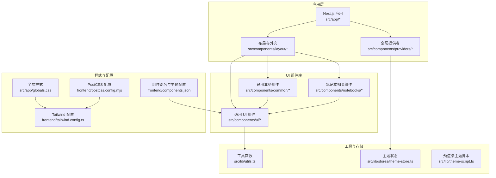
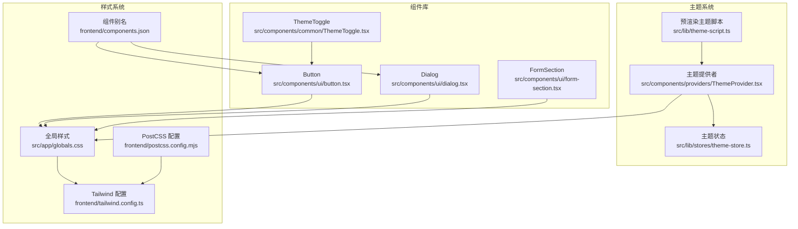
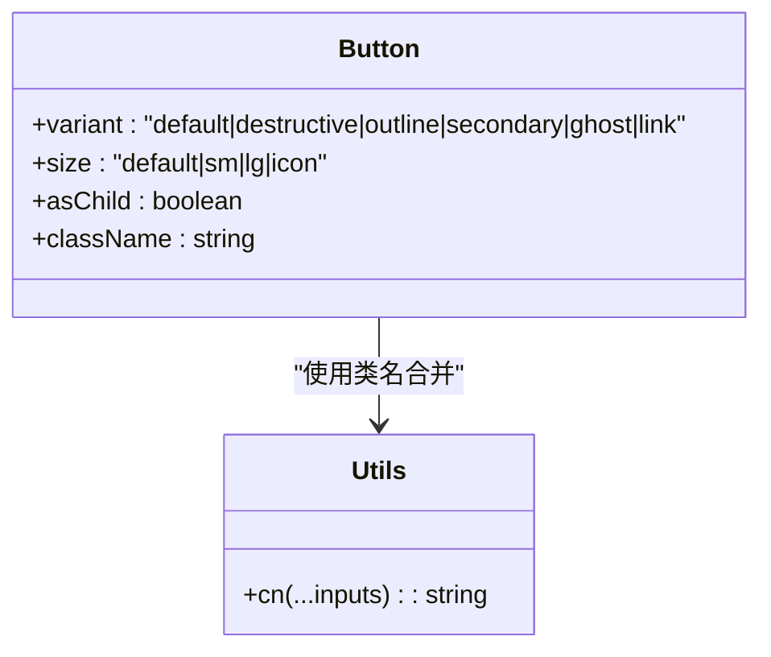
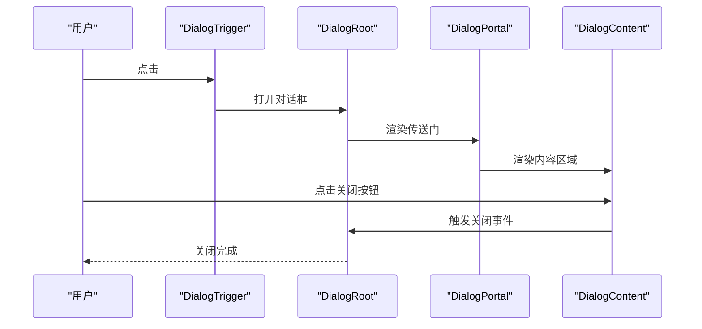
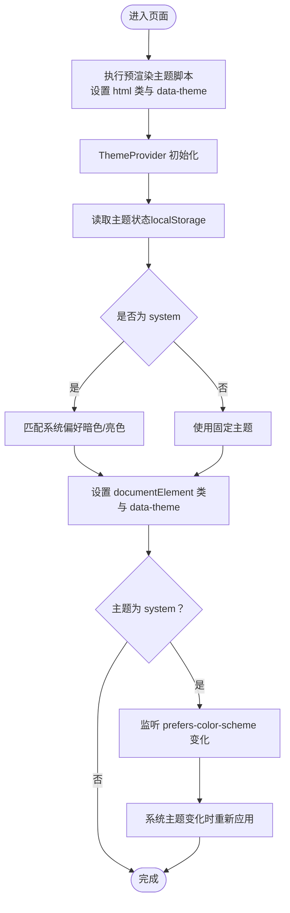
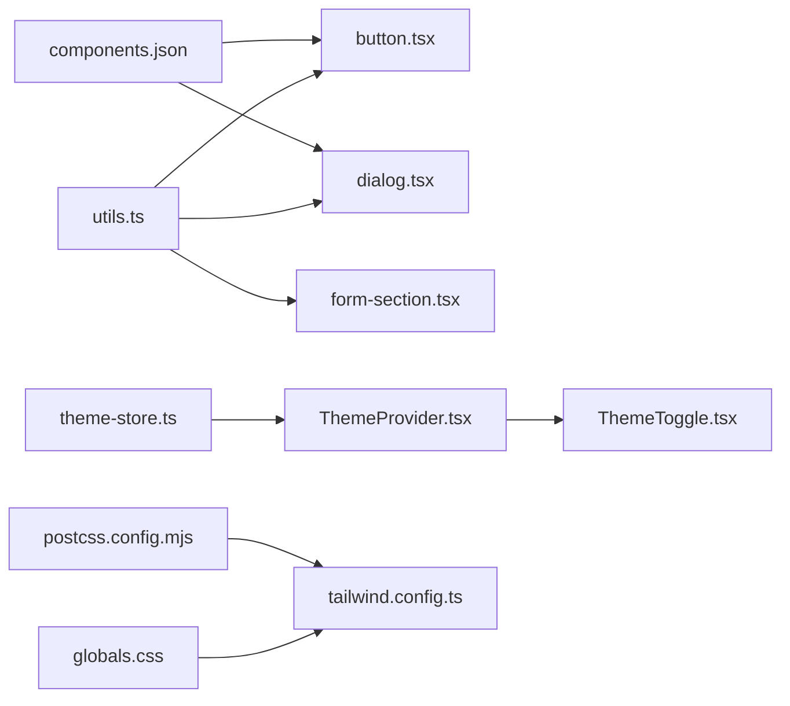

# UI组件定制

<cite>
**本文引用的文件**
- [tailwind.config.ts](file://frontend/tailwind.config.ts)
- [package.json](file://frontend/package.json)
- [theme-script.ts](file://frontend/src/lib/theme-script.ts)
- [globals.css](file://frontend/src/app/globals.css)
- [components.json](file://frontend/components.json)
- [button.tsx](file://frontend/src/components/ui/button.tsx)
- [dialog.tsx](file://frontend/src/components/ui/dialog.tsx)
- [form-section.tsx](file://frontend/src/components/ui/form-section.tsx)
- [ThemeProvider.tsx](file://frontend/src/components/providers/ThemeProvider.tsx)
- [utils.ts](file://frontend/src/lib/utils.ts)
- [ThemeToggle.tsx](file://frontend/src/components/common/ThemeToggle.tsx)
- [AppShell.tsx](file://frontend/src/components/layout/AppShell.tsx)
- [CreateNotebookDialog.tsx](file://frontend/src/components/notebooks/CreateNotebookDialog.tsx)
- [theme-store.ts](file://frontend/src/lib/stores/theme-store.ts)
- [postcss.config.mjs](file://frontend/postcss.config.mjs)
</cite>

## 目录
1. [简介](#简介)
2. [项目结构](#项目结构)
3. [核心组件](#核心组件)
4. [架构总览](#架构总览)
5. [详细组件分析](#详细组件分析)
6. [依赖关系分析](#依赖关系分析)
7. [性能考量](#性能考量)
8. [故障排查指南](#故障排查指南)
9. [结论](#结论)
10. [附录](#附录)

## 简介
本指南面向需要在 Open Notebook 前端进行 UI 组件定制与扩展的开发者，涵盖以下目标：
- 修改现有 UI 组件：样式覆盖、行为调整与交互增强
- 创建自定义组件：遵循现有风格与状态管理约定
- 实现主题定制：基于 CSS 变量与 Tailwind 配置的主题切换
- 使用 Tailwind CSS 与样式系统：CSS 变量、原子类与合并策略
- 响应式设计与无障碍访问：语义化标签、键盘可达性与屏幕阅读器支持
- 构建可复用 UI 组件库与组件组合模式：基于 Radix UI 的可组合性与 CVAs
- 提供最佳实践与可操作步骤，配合具体文件路径定位

## 项目结构
前端采用 Next.js 应用程序目录结构，UI 组件主要位于 src/components 下，样式通过 src/app/globals.css 引入，Tailwind 配置位于 frontend/tailwind.config.ts，PostCSS 配置位于 frontend/postcss.config.mjs。

图表来源
- [globals.css](file://frontend/src/app/globals.css#L1-L193)
- [tailwind.config.ts](file://frontend/tailwind.config.ts#L1-L17)
- [postcss.config.mjs](file://frontend/postcss.config.mjs#L1-L6)
- [components.json](file://frontend/components.json#L1-L21)

章节来源
- [globals.css](file://frontend/src/app/globals.css#L1-L193)
- [tailwind.config.ts](file://frontend/tailwind.config.ts#L1-L17)
- [postcss.config.mjs](file://frontend/postcss.config.mjs#L1-L6)
- [components.json](file://frontend/components.json#L1-L21)

## 核心组件
本节聚焦于 UI 组件库中的关键构件及其定制要点：

- 按钮 Button（变体与尺寸）
  - 通过 class-variance-authority 定义变体与尺寸，结合 tailwind-merge 与 clsx 合并类名，确保可组合性与最小化冲突。
  - 支持 asChild（Slot）以保持语义标签原生特性。
  - 关键路径：[button.tsx](file://frontend/src/components/ui/button.tsx#L1-L60)

- 对话框 Dialog（根组件、内容、标题、描述、页眉/页脚）
  - 基于 Radix UI，提供动画入场/出场、可选关闭按钮、无障碍属性与国际化文案。
  - 关键路径：[dialog.tsx](file://frontend/src/components/ui/dialog.tsx#L1-L144)

- 表单分组 FormSection
  - 封装标题、描述与子控件容器，统一间距与可访问性。
  - 关键路径：[form-section.tsx](file://frontend/src/components/ui/form-section.tsx#L1-L46)

- 主题提供者 ThemeProvider
  - 在客户端初始化并监听系统主题变化，设置 documentElement 的类与 data-theme 属性。
  - 关键路径：[ThemeProvider.tsx](file://frontend/src/components/providers/ThemeProvider.tsx#L1-L45)

- 主题切换器 ThemeToggle
  - 基于 DropdownMenu 与 Button，支持 light/dark/system 切换，内嵌无障碍文本。
  - 关键路径：[ThemeToggle.tsx](file://frontend/src/components/common/ThemeToggle.tsx#L1-L63)

- 应用外壳 AppShell
  - 统一布局结构：侧边栏 + 主内容区 + 设置横幅。
  - 关键路径：[AppShell.tsx](file://frontend/src/components/layout/AppShell.tsx#L1-L21)

- 创建笔记本对话框 CreateNotebookDialog
  - 表单校验（Zod）、受控表单（react-hook-form）、提交流程与禁用态处理。
  - 关键路径：[CreateNotebookDialog.tsx](file://frontend/src/components/notebooks/CreateNotebookDialog.tsx#L1-L113)

- 工具函数与主题状态
  - cn 合并类名；主题状态使用 Zustand 并持久化到 localStorage。
  - 关键路径：[utils.ts](file://frontend/src/lib/utils.ts#L1-L7)、[theme-store.ts](file://frontend/src/lib/stores/theme-store.ts#L1-L61)

章节来源
- [button.tsx](file://frontend/src/components/ui/button.tsx#L1-L60)
- [dialog.tsx](file://frontend/src/components/ui/dialog.tsx#L1-L144)
- [form-section.tsx](file://frontend/src/components/ui/form-section.tsx#L1-L46)
- [ThemeProvider.tsx](file://frontend/src/components/providers/ThemeProvider.tsx#L1-L45)
- [ThemeToggle.tsx](file://frontend/src/components/common/ThemeToggle.tsx#L1-L63)
- [AppShell.tsx](file://frontend/src/components/layout/AppShell.tsx#L1-L21)
- [CreateNotebookDialog.tsx](file://frontend/src/components/notebooks/CreateNotebookDialog.tsx#L1-L113)
- [utils.ts](file://frontend/src/lib/utils.ts#L1-L7)
- [theme-store.ts](file://frontend/src/lib/stores/theme-store.ts#L1-L61)

## 架构总览
Open Notebook 的 UI 架构围绕“组件库 + 主题系统 + 样式系统”展开，组件库基于 Radix UI 与 CVAs，主题系统通过 CSS 变量与 Zustand 状态管理，样式系统由 Tailwind v4 与 PostCSS 驱动。

图表来源
- [theme-script.ts](file://frontend/src/lib/theme-script.ts#L1-L18)
- [ThemeProvider.tsx](file://frontend/src/components/providers/ThemeProvider.tsx#L1-L45)
- [theme-store.ts](file://frontend/src/lib/stores/theme-store.ts#L1-L61)
- [button.tsx](file://frontend/src/components/ui/button.tsx#L1-L60)
- [dialog.tsx](file://frontend/src/components/ui/dialog.tsx#L1-L144)
- [form-section.tsx](file://frontend/src/components/ui/form-section.tsx#L1-L46)
- [ThemeToggle.tsx](file://frontend/src/components/common/ThemeToggle.tsx#L1-L63)
- [globals.css](file://frontend/src/app/globals.css#L1-L193)
- [tailwind.config.ts](file://frontend/tailwind.config.ts#L1-L17)
- [postcss.config.mjs](file://frontend/postcss.config.mjs#L1-L6)
- [components.json](file://frontend/components.json#L1-L21)

## 详细组件分析

### 按钮 Button 组件定制
- 变体与尺寸：通过 cva 定义 variant 与 size，支持 asChild 以保留原生语义。
- 样式覆盖：优先使用 Tailwind 原子类，必要时通过 className 覆盖；使用 cn 合并类名避免冲突。
- 交互增强：支持禁用态、焦点态、错误态（aria-invalid）等。
- 最佳实践：为图标元素添加尺寸与对齐规则，确保视觉一致性。

图表来源
- [button.tsx](file://frontend/src/components/ui/button.tsx#L1-L60)
- [utils.ts](file://frontend/src/lib/utils.ts#L1-L7)

章节来源
- [button.tsx](file://frontend/src/components/ui/button.tsx#L1-L60)
- [utils.ts](file://frontend/src/lib/utils.ts#L1-L7)

### 对话框 Dialog 组件定制
- 功能点：根组件、触发器、传送门、覆盖层、内容、页眉/页脚、标题/描述、关闭按钮。
- 无障碍：自动设置 aria-describedby，提供 sr-only 文本，支持键盘关闭。
- 动画与布局：内置入场/出场动画，响应式最大宽度与居中定位。
- 自定义建议：通过 className 扩展尺寸或布局，通过 showCloseButton 控制关闭按钮显示。

图表来源
- [dialog.tsx](file://frontend/src/components/ui/dialog.tsx#L1-L144)

章节来源
- [dialog.tsx](file://frontend/src/components/ui/dialog.tsx#L1-L144)

### 表单分组 FormSection 组件定制
- 结构：标题、描述、子控件容器，支持绑定 htmlFor 与 Label。
- 间距与排版：统一的外边距与子项间距，便于表单布局一致性。
- 扩展建议：在 children 中组合 Input、Select、Checkbox 等控件，保持一致的标签与错误提示样式。

章节来源
- [form-section.tsx](file://frontend/src/components/ui/form-section.tsx#L1-L46)

### 主题系统与主题切换
- 预渲染脚本：在 SSR/Hydration 前设置主题类与 data-theme，避免闪烁。
- 主题提供者：在客户端初始化，监听系统主题变化，动态更新根节点类。
- 主题状态：Zustand 管理当前主题，持久化到 localStorage，仅保存 theme 字段。
- 主题切换器：下拉菜单提供 light/dark/system 选项，内嵌无障碍文本。

图表来源
- [theme-script.ts](file://frontend/src/lib/theme-script.ts#L1-L18)
- [ThemeProvider.tsx](file://frontend/src/components/providers/ThemeProvider.tsx#L1-L45)
- [theme-store.ts](file://frontend/src/lib/stores/theme-store.ts#L1-L61)
- [ThemeToggle.tsx](file://frontend/src/components/common/ThemeToggle.tsx#L1-L63)

章节来源
- [theme-script.ts](file://frontend/src/lib/theme-script.ts#L1-L18)
- [ThemeProvider.tsx](file://frontend/src/components/providers/ThemeProvider.tsx#L1-L45)
- [theme-store.ts](file://frontend/src/lib/stores/theme-store.ts#L1-L61)
- [ThemeToggle.tsx](file://frontend/src/components/common/ThemeToggle.tsx#L1-L63)

### 应用外壳 AppShell 与页面组织
- AppShell：统一布局容器，左侧侧边栏 + 右侧主内容 + 设置横幅。
- 页面组织：页面级组件通过 AppShell 包裹，保证一致的导航与内容区域。

章节来源
- [AppShell.tsx](file://frontend/src/components/layout/AppShell.tsx#L1-L21)

### 创建笔记本对话框 CreateNotebookDialog
- 表单校验：Zod Schema + react-hook-form + zodResolver。
- 提交流程：异步提交后关闭对话框并重置表单。
- 禁用态：基于 isValid 与 mutation pending 状态控制提交按钮可用性。
- 国际化：使用 useTranslation 获取文案，确保多语言支持。

章节来源
- [CreateNotebookDialog.tsx](file://frontend/src/components/notebooks/CreateNotebookDialog.tsx#L1-L113)

## 依赖关系分析
- 组件库依赖：UI 组件依赖 utils.cn 进行类名合并；对话框依赖 Radix UI；按钮依赖 class-variance-authority。
- 主题系统依赖：ThemeProvider 依赖 theme-store；ThemeToggle 依赖 Button 与 DropdownMenu。
- 样式系统依赖：globals.css 依赖 Tailwind 与 tw-animate-css；tailwind.config.ts 控制 content 范围与 darkMode；postcss.config.mjs 加载 Tailwind 插件；components.json 定义组件别名与主题变量开关。

图表来源
- [utils.ts](file://frontend/src/lib/utils.ts#L1-L7)
- [button.tsx](file://frontend/src/components/ui/button.tsx#L1-L60)
- [dialog.tsx](file://frontend/src/components/ui/dialog.tsx#L1-L144)
- [form-section.tsx](file://frontend/src/components/ui/form-section.tsx#L1-L46)
- [theme-store.ts](file://frontend/src/lib/stores/theme-store.ts#L1-L61)
- [ThemeProvider.tsx](file://frontend/src/components/providers/ThemeProvider.tsx#L1-L45)
- [ThemeToggle.tsx](file://frontend/src/components/common/ThemeToggle.tsx#L1-L63)
- [globals.css](file://frontend/src/app/globals.css#L1-L193)
- [tailwind.config.ts](file://frontend/tailwind.config.ts#L1-L17)
- [postcss.config.mjs](file://frontend/postcss.config.mjs#L1-L6)
- [components.json](file://frontend/components.json#L1-L21)

章节来源
- [utils.ts](file://frontend/src/lib/utils.ts#L1-L7)
- [button.tsx](file://frontend/src/components/ui/button.tsx#L1-L60)
- [dialog.tsx](file://frontend/src/components/ui/dialog.tsx#L1-L144)
- [form-section.tsx](file://frontend/src/components/ui/form-section.tsx#L1-L46)
- [theme-store.ts](file://frontend/src/lib/stores/theme-store.ts#L1-L61)
- [ThemeProvider.tsx](file://frontend/src/components/providers/ThemeProvider.tsx#L1-L45)
- [ThemeToggle.tsx](file://frontend/src/components/common/ThemeToggle.tsx#L1-L63)
- [globals.css](file://frontend/src/app/globals.css#L1-L193)
- [tailwind.config.ts](file://frontend/tailwind.config.ts#L1-L17)
- [postcss.config.mjs](file://frontend/postcss.config.mjs#L1-L6)
- [components.json](file://frontend/components.json#L1-L21)

## 性能考量
- Tailwind 构建范围：content 指向 src/app、src/components、src/pages，确保仅打包使用到的样式，减少体积。
- 类名合并：使用 tw-merge 与 clsx 合并类名，避免重复与冲突，降低运行时样式计算成本。
- 动画与过渡：全局样式中为卡片与侧边栏菜单项提供平滑过渡，注意在低性能设备上的表现。
- 主题切换：预渲染脚本与客户端监听均只做最小 DOM 操作，避免频繁重排。

章节来源
- [tailwind.config.ts](file://frontend/tailwind.config.ts#L5-L9)
- [utils.ts](file://frontend/src/lib/utils.ts#L1-L7)
- [globals.css](file://frontend/src/app/globals.css#L168-L182)

## 故障排查指南
- 主题闪烁：确认预渲染脚本已注入，且 ThemeProvider 在客户端正确初始化。
  - 参考：[theme-script.ts](file://frontend/src/lib/theme-script.ts#L1-L18)、[ThemeProvider.tsx](file://frontend/src/components/providers/ThemeProvider.tsx#L1-L45)
- 主题不生效：检查 documentElement 是否存在 light/dark 类与 data-theme 属性，确认系统主题监听逻辑。
  - 参考：[theme-store.ts](file://frontend/src/lib/stores/theme-store.ts#L21-L29)
- 对话框无法关闭：确认 DialogTrigger 与 DialogRoot 的配对使用，检查关闭按钮的 aria-label。
  - 参考：[dialog.tsx](file://frontend/src/components/ui/dialog.tsx#L16-L32)
- 表单验证无效：检查 Zod Schema 与 resolver 配置，确认 useForm 的 mode 与默认值。
  - 参考：[CreateNotebookDialog.tsx](file://frontend/src/components/notebooks/CreateNotebookDialog.tsx#L43-L50)
- 样式未更新：确认 Tailwind 内容扫描路径与构建命令，清理缓存后重新构建。
  - 参考：[tailwind.config.ts](file://frontend/tailwind.config.ts#L5-L9)、[package.json](file://frontend/package.json#L5-L13)

章节来源
- [theme-script.ts](file://frontend/src/lib/theme-script.ts#L1-L18)
- [ThemeProvider.tsx](file://frontend/src/components/providers/ThemeProvider.tsx#L1-L45)
- [theme-store.ts](file://frontend/src/lib/stores/theme-store.ts#L21-L29)
- [dialog.tsx](file://frontend/src/components/ui/dialog.tsx#L16-L32)
- [CreateNotebookDialog.tsx](file://frontend/src/components/notebooks/CreateNotebookDialog.tsx#L43-L50)
- [tailwind.config.ts](file://frontend/tailwind.config.ts#L5-L9)
- [package.json](file://frontend/package.json#L5-L13)

## 结论
通过本指南，你可以：
- 基于现有组件库快速定制按钮、对话框、表单分组等组件
- 使用 CSS 变量与 Tailwind 配置实现主题系统与样式覆盖
- 遵循无障碍与响应式设计原则，提升用户体验
- 借助 Zustand 与 Radix UI 构建可复用、可组合的 UI 组件库

## 附录

### Tailwind CSS 配置与样式系统使用
- 配置文件位置与内容范围：frontend/tailwind.config.ts
  - 内容扫描路径：src/app、src/components、src/pages
  - 暗色模式：class 模式
  - 插件：@tailwindcss/typography
  - 参考：[tailwind.config.ts](file://frontend/tailwind.config.ts#L1-L17)
- 全局样式与 CSS 变量：frontend/src/app/globals.css
  - 定义了大量 CSS 变量（背景、前景、主色、次色、边框、输入、环形光晕等）
  - 在 :root 与 .dark 中分别定义浅色与深色变量
  - 提供基础层（base）样式与组件 hover 效果
  - 参考：[globals.css](file://frontend/src/app/globals.css#L4-L42)、[globals.css](file://frontend/src/app/globals.css#L44-L111)、[globals.css](file://frontend/src/app/globals.css#L113-L193)
- PostCSS 配置：frontend/postcss.config.mjs
  - 加载 @tailwindcss/postcss 插件
  - 参考：[postcss.config.mjs](file://frontend/postcss.config.mjs#L1-L6)
- 组件别名与主题变量开关：frontend/components.json
  - style/new-york、tsx、tailwind.css 变量启用、别名映射
  - 参考：[components.json](file://frontend/components.json#L1-L21)

### 主题定制步骤
- 步骤一：在 CSS 变量中新增或调整颜色变量
  - 示例路径：[globals.css](file://frontend/src/app/globals.css#L44-L77)
- 步骤二：在 Tailwind 配置中扩展 theme 或使用 CSS 变量
  - 示例路径：[tailwind.config.ts](file://frontend/tailwind.config.ts#L11-L14)
- 步骤三：在组件中使用变量或类名
  - 示例路径：[button.tsx](file://frontend/src/components/ui/button.tsx#L12-L22)
- 步骤四：确保主题提供者与状态同步
  - 示例路径：[ThemeProvider.tsx](file://frontend/src/components/providers/ThemeProvider.tsx#L13-L41)、[theme-store.ts](file://frontend/src/lib/stores/theme-store.ts#L18-L42)

### 响应式设计与无障碍访问
- 响应式：使用 Tailwind 断点类与相对单位，确保在小屏设备上良好显示
  - 示例路径：[dialog.tsx](file://frontend/src/components/ui/dialog.tsx#L66-L68)
- 无障碍：为交互元素提供 sr-only 文本，使用语义化标签与 aria-* 属性
  - 示例路径：[dialog.tsx](file://frontend/src/components/ui/dialog.tsx#L75-L76)、[ThemeToggle.tsx](file://frontend/src/components/common/ThemeToggle.tsx#L35)

### 组件扩展最佳实践
- 组合模式：使用 asChild 与 Slot 保持原生语义，如 Button
  - 示例路径：[button.tsx](file://frontend/src/components/ui/button.tsx#L48-L56)
- 可复用性：通过 Variants 与 className 参数实现可配置外观
  - 示例路径：[button.tsx](file://frontend/src/components/ui/button.tsx#L7-L36)
- 表单集成：结合 react-hook-form 与 Zod，提供即时反馈与禁用态
  - 示例路径：[CreateNotebookDialog.tsx](file://frontend/src/components/notebooks/CreateNotebookDialog.tsx#L43-L58)