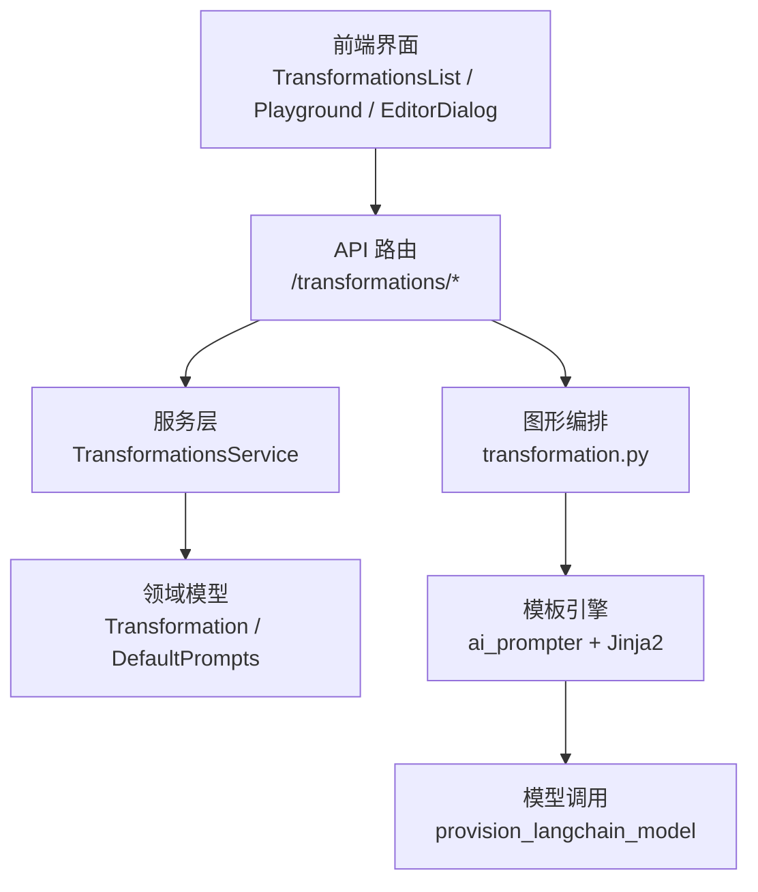
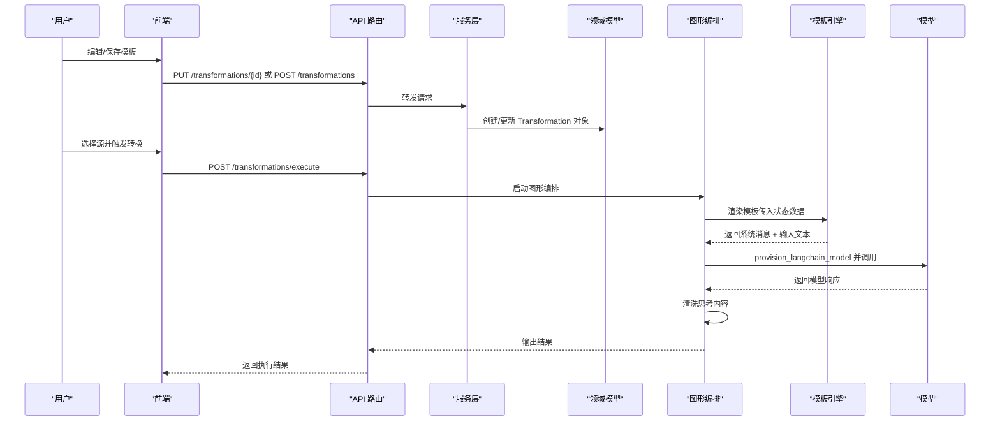
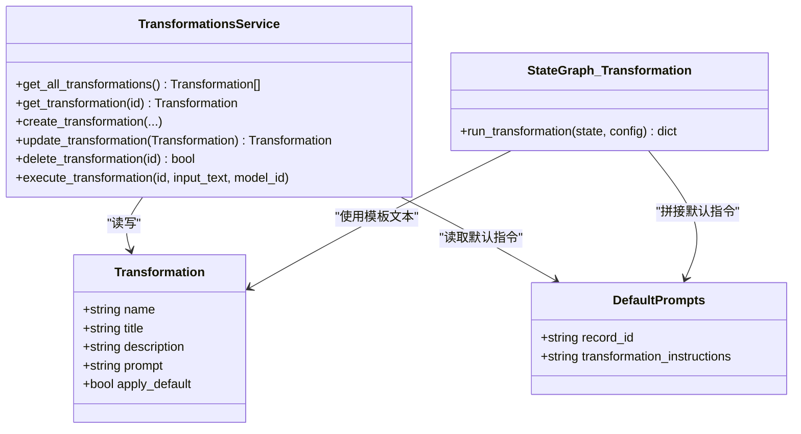
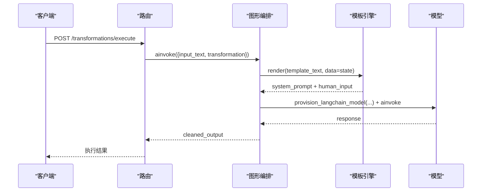
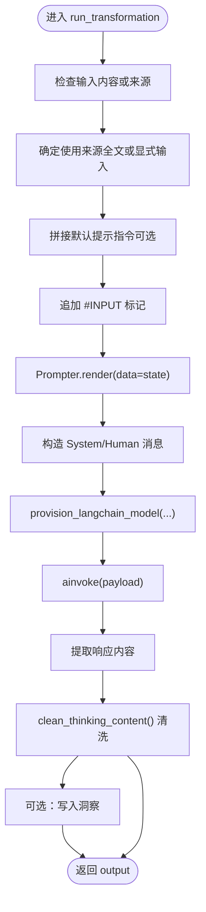
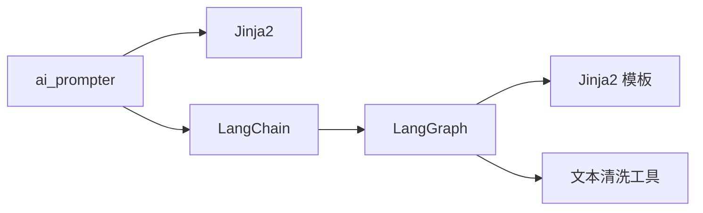

# 内容转换模板

<cite>
**本文引用的文件**
- [prompts/CLAUDE.md](file://prompts/CLAUDE.md)
- [docs/3-USER-GUIDE/transformations.md](file://docs/3-USER-GUIDE/transformations.md)
- [api/routers/transformations.py](file://api/routers/transformations.py)
- [api/transformations_service.py](file://api/transformations_service.py)
- [open_notebook/domain/transformation.py](file://open_notebook/domain/transformation.py)
- [open_notebook/graphs/transformation.py](file://open_notebook/graphs/transformation.py)
- [prompts/chat/system.jinja](file://prompts/chat/system.jinja)
- [prompts/source_chat/system.jinja](file://prompts/source_chat/system.jinja)
- [prompts/podcast/outline.jinja](file://prompts/podcast/outline.jinja)
- [prompts/ask/entry.jinja](file://prompts/ask/entry.jinja)
</cite>

## 目录
1. [简介](#简介)
2. [项目结构](#项目结构)
3. [核心组件](#核心组件)
4. [架构总览](#架构总览)
5. [详细组件分析](#详细组件分析)
6. [依赖关系分析](#依赖关系分析)
7. [性能考虑](#性能考虑)
8. [故障排查指南](#故障排查指南)
9. [结论](#结论)
10. [附录](#附录)

## 简介
本指南面向需要创建与维护“内容转换模板”的开发者与高级用户，系统讲解基于 Jinja 模板的提示工程与自定义转换规则设计。内容覆盖：
- 如何编写与修改 AI 提示模板（系统消息、用户输入、输出格式）
- 文本处理工具函数的使用与自定义转换逻辑实现
- 转换流程的设计模式与最佳实践
- 面向学术论文、技术文档等领域的模板定制策略
- 模板调试与性能优化技巧

## 项目结构
围绕“内容转换”能力，系统由以下层次构成：
- 前端：提供模板编辑器、播放器与列表展示
- API 层：提供模板的增删改查与执行接口
- 服务层：封装 API 请求与领域对象映射
- 图形编排层：以 LangGraph 将模板渲染与模型调用串联为可扩展流程
- 模板层：Jinja2 模板集中管理，按工作流分目录组织

图表来源
- [api/routers/transformations.py](file://api/routers/transformations.py#L23-L117)
- [api/transformations_service.py](file://api/transformations_service.py#L14-L142)
- [open_notebook/domain/transformation.py](file://open_notebook/domain/transformation.py#L8-L22)
- [open_notebook/graphs/transformation.py](file://open_notebook/graphs/transformation.py#L13-L68)
- [prompts/CLAUDE.md](file://prompts/CLAUDE.md#L13-L36)

章节来源
- [api/routers/transformations.py](file://api/routers/transformations.py#L23-L117)
- [api/transformations_service.py](file://api/transformations_service.py#L14-L142)
- [open_notebook/domain/transformation.py](file://open_notebook/domain/transformation.py#L8-L22)
- [open_notebook/graphs/transformation.py](file://open_notebook/graphs/transformation.py#L13-L68)
- [prompts/CLAUDE.md](file://prompts/CLAUDE.md#L13-L36)

## 核心组件
- 模板系统（Jinja2 + ai_prompter）
  - 模板集中于 prompts/ 下的工作流子目录，通过 Prompter 渲染变量并注入格式化指令
  - 支持条件块、循环与可选上下文注入，便于多场景复用
- 领域模型
  - Transformation：模板实体，包含名称、标题、描述、提示文本与默认应用标记
  - DefaultPrompts：全局默认提示指令记录
- API 与服务
  - 提供模板 CRUD 与执行接口；执行时将模板与输入文本组合后交由图形编排层处理
- 图形编排
  - 使用 StateGraph 定义“渲染模板 → 调用模型 → 清洗输出 → 生成洞察”的流程

章节来源
- [prompts/CLAUDE.md](file://prompts/CLAUDE.md#L103-L141)
- [open_notebook/domain/transformation.py](file://open_notebook/domain/transformation.py#L8-L22)
- [api/routers/transformations.py](file://api/routers/transformations.py#L23-L117)
- [open_notebook/graphs/transformation.py](file://open_notebook/graphs/transformation.py#L20-L61)

## 架构总览
下图展示了从“模板编辑”到“批量转换执行”的端到端路径。

图表来源
- [api/routers/transformations.py](file://api/routers/transformations.py#L81-L117)
- [open_notebook/graphs/transformation.py](file://open_notebook/graphs/transformation.py#L20-L61)
- [prompts/CLAUDE.md](file://prompts/CLAUDE.md#L21-L35)

章节来源
- [api/routers/transformations.py](file://api/routers/transformations.py#L81-L117)
- [open_notebook/graphs/transformation.py](file://open_notebook/graphs/transformation.py#L20-L61)
- [prompts/CLAUDE.md](file://prompts/CLAUDE.md#L21-L35)

## 详细组件分析

### 组件一：模板系统与提示工程模式
- 多阶段链路（Ask 工作流）
  - 三段式模板链：入口 → 查询处理 → 最终答案
  - 入口模板输出结构化 JSON（含推理与搜索项），查询处理模板接收单个检索词与结果生成子答案，最终答案模板汇总并强制引用来源
- 条件变量注入（Podcast/SourceChat）
  - 模板支持 notebook/context/speakers 等可选上下文，通过 Jinja2 条件块与循环组装
- 输出格式委托
  - 通过外部 format_instructions 注入格式约束（JSON/XML 等），解耦模板与输出格式演进
- 引用规范强化
  - 模板反复强调引用格式与 ID 规范，降低大模型幻觉

章节来源
- [prompts/CLAUDE.md](file://prompts/CLAUDE.md#L39-L102)
- [prompts/podcast/outline.jinja](file://prompts/podcast/outline.jinja#L10-L27)
- [prompts/source_chat/system.jinja](file://prompts/source_chat/system.jinja#L13-L28)
- [prompts/ask/entry.jinja](file://prompts/ask/entry.jinja#L33-L38)

### 组件二：模板类图（基于实际代码）

图表来源
- [open_notebook/domain/transformation.py](file://open_notebook/domain/transformation.py#L8-L22)
- [api/transformations_service.py](file://api/transformations_service.py#L14-L142)
- [open_notebook/graphs/transformation.py](file://open_notebook/graphs/transformation.py#L13-L68)

章节来源
- [open_notebook/domain/transformation.py](file://open_notebook/domain/transformation.py#L8-L22)
- [api/transformations_service.py](file://api/transformations_service.py#L14-L142)
- [open_notebook/graphs/transformation.py](file://open_notebook/graphs/transformation.py#L13-L68)

### 组件三：转换执行序列（API → 图形 → 模板 → 模型）

图表来源
- [api/routers/transformations.py](file://api/routers/transformations.py#L81-L117)
- [open_notebook/graphs/transformation.py](file://open_notebook/graphs/transformation.py#L20-L61)

章节来源
- [api/routers/transformations.py](file://api/routers/transformations.py#L81-L117)
- [open_notebook/graphs/transformation.py](file://open_notebook/graphs/transformation.py#L20-L61)

### 组件四：复杂逻辑流程（模板渲染与清洗）

图表来源
- [open_notebook/graphs/transformation.py](file://open_notebook/graphs/transformation.py#L20-L61)

章节来源
- [open_notebook/graphs/transformation.py](file://open_notebook/graphs/transformation.py#L20-L61)

### 组件五：模板调试与测试模式
- 手动渲染测试：直接使用 Prompter 渲染模板，打印输出以验证 Jinja2 变量与格式
- 结构化输出测试：绑定 PydanticOutputParser，确保模板包含 format_instructions 占位符
- 集成测试：在 ask/ 等完整工作流中验证模板链路

章节来源
- [prompts/CLAUDE.md](file://prompts/CLAUDE.md#L155-L185)

## 依赖关系分析
- 模板依赖
  - ai_prompter：负责加载与渲染 Jinja2 模板，并可绑定输出解析器
  - Jinja2：提供变量插值、条件块、循环与过滤器
- 运行时依赖
  - LangChain：消息封装与链式调用
  - LangGraph：状态图编排，串联模板渲染与模型调用
  - 文本清洗工具：清理模型输出中的“思考标签”，保证下游解析稳定

图表来源
- [prompts/CLAUDE.md](file://prompts/CLAUDE.md#L120-L125)
- [open_notebook/graphs/transformation.py](file://open_notebook/graphs/transformation.py#L1-L11)

章节来源
- [prompts/CLAUDE.md](file://prompts/CLAUDE.md#L120-L125)
- [open_notebook/graphs/transformation.py](file://open_notebook/graphs/transformation.py#L1-L11)

## 性能考虑
- 模板缓存与热更新
  - Prompter 可能缓存已加载模板；修改模板后需重启应用以生效
- 输出格式与解析开销
  - 使用 format_instructions 将格式约束外置，避免模板频繁变更导致的解析失败
- 文本清洗成本
  - 在图形编排层统一进行“思考内容”清洗，减少下游重复处理
- 批量执行并发
  - 执行接口支持并发调用；建议在前端或上层控制并发度，避免模型限流

章节来源
- [prompts/CLAUDE.md](file://prompts/CLAUDE.md#L150-L154)
- [open_notebook/graphs/transformation.py](file://open_notebook/graphs/transformation.py#L49-L56)

## 故障排查指南
- 模板路径与变量名不匹配
  - Prompter 使用“子目录/模板名”形式引用，且模板内变量名需与 render(data=...) 的键一致
- 条件块与循环陷阱
  - 空字符串在 Jinja2 中视为假；for 循环若传入字符串会逐字符迭代，易引发错误
- 输出解析顺序
  - render() 成功后再进行解析；若模板语法错误，解析器不会运行
- 引用 ID 格式
  - 模板强调引用 ID 规范，但不校验；调用方需确保 ID 正确
- 模板缓存问题
  - 修改模板后需重启应用，否则可能沿用旧缓存

章节来源
- [prompts/CLAUDE.md](file://prompts/CLAUDE.md#L142-L154)

## 结论
通过将提示工程与业务逻辑解耦，采用 Jinja2 模板与 LangGraph 流程编排，系统实现了高可维护、可扩展的内容转换能力。遵循本文的最佳实践与调试技巧，可在不同领域快速构建高质量的转换模板，并稳定地支撑批量处理与持续迭代。

## 附录

### A. 模板编写与修改要点
- 明确输入/输出契约
  - 在模板中明确声明变量名与可选上下文，必要时使用条件块与循环
- 强制输出格式
  - 通过 format_instructions 注入 JSON/XML 等格式约束，避免硬编码在模板中
- 引用规范
  - 在模板中反复强调引用格式与 ID 规范，降低幻觉风险
- 测试先行
  - 先手动渲染与绑定解析器验证，再集成到完整工作流

章节来源
- [prompts/CLAUDE.md](file://prompts/CLAUDE.md#L71-L90)
- [prompts/ask/entry.jinja](file://prompts/ask/entry.jinja#L33-L46)

### B. 领域模板示例与建议
- 学术论文
  - 关注研究问题、假设、方法、发现、局限与未来方向
  - 建议：固定结构化输出，要求页码引用
- 技术文档
  - 关注概述、认证方式、关键端点、常见参数、速率限制、错误码与示例
  - 建议：强调简洁性与可操作性
- 会议纪要
  - 关注出席者、时间、决策、行动项、开放问题与后续步骤
  - 建议：使用清晰可扫描的格式

章节来源
- [docs/3-USER-GUIDE/transformations.md](file://docs/3-USER-GUIDE/transformations.md#L169-L252)

### C. API 与服务交互参考
- 获取模板列表与详情
  - GET /transformations
  - GET /transformations/{id}
- 创建与更新模板
  - POST /transformations
  - PUT /transformations/{id}
- 删除模板
  - DELETE /transformations/{id}
- 执行模板
  - POST /transformations/execute（需提供模板 ID、输入文本与模型 ID）

章节来源
- [api/routers/transformations.py](file://api/routers/transformations.py#L23-L251)