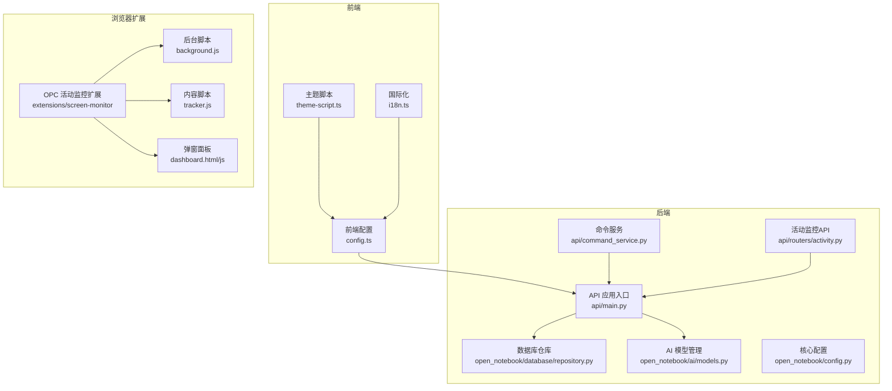
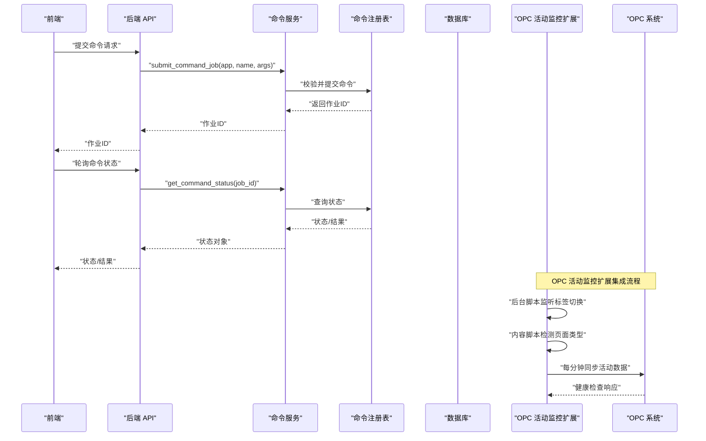
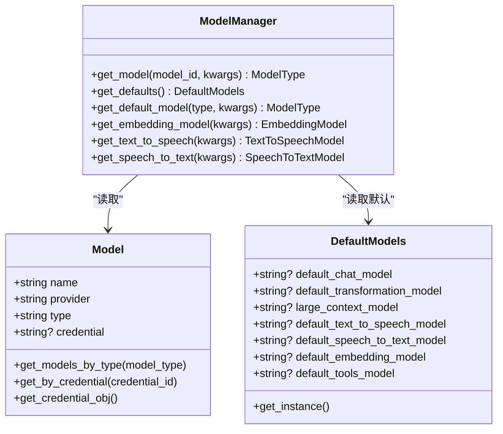
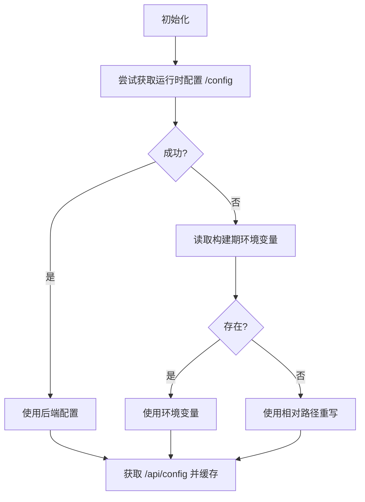
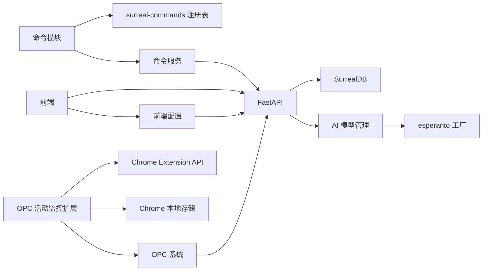

# 扩展与定制

<cite>
**本文引用的文件**
- [README.md](file://README.md)
- [api/main.py](file://api/main.py)
- [api/command_service.py](file://api/command_service.py)
- [api/routers/activity.py](file://api/routers/activity.py)
- [commands/__init__.py](file://commands/__init__.py)
- [commands/example_commands.py](file://commands/example_commands.py)
- [extensions/screen-monitor/README.md](file://extensions/screen-monitor/README.md)
- [extensions/screen-monitor/manifest.json](file://extensions/screen-monitor/manifest.json)
- [extensions/screen-monitor/background/background.js](file://extensions/screen-monitor/background/background.js)
- [extensions/screen-monitor/content/tracker.js](file://extensions/screen-monitor/content/tracker.js)
- [extensions/screen-monitor/popup/dashboard.html](file://extensions/screen-monitor/popup/dashboard.html)
- [extensions/screen-monitor/popup/dashboard.js](file://extensions/screen-monitor/popup/dashboard.js)
- [frontend/src/lib/config.ts](file://frontend/src/lib/config.ts)
- [frontend/src/lib/i18n.ts](file://frontend/src/lib/i18n.ts)
- [frontend/src/lib/theme-script.ts](file://frontend/src/lib/theme-script.ts)
- [open_notebook/ai/models.py](file://open_notebook/ai/models.py)
- [open_notebook/database/repository.py](file://open_notebook/database/repository.py)
- [open_notebook/config.py](file://open_notebook/config.py)
- [prompts/ask/entry.jinja](file://prompts/ask/entry.jinja)
- [api/models.py](file://api/models.py)
</cite>

## 更新摘要
**所做更改**
- 新增 OPC 活动监控浏览器扩展开发指南章节
- 添加浏览器扩展与 OPC 系统集成的技术架构说明
- 增加扩展安装、配置和使用指南
- 新增内容脚本、后台脚本和弹窗面板的详细说明
- 添加 OPC 活动监控 API 端点说明
- 更新扩展开发最佳实践和安全考虑

## 目录
1. [简介](#简介)
2. [项目结构](#项目结构)
3. [核心组件](#核心组件)
4. [架构总览](#架构总览)
5. [详细组件分析](#详细组件分析)
6. [OPC 活动监控浏览器扩展](#opc-活动监控浏览器扩展)
7. [依赖关系分析](#依赖关系分析)
8. [性能考虑](#性能考虑)
9. [故障排查指南](#故障排查指南)
10. [结论](#结论)
11. [附录](#附录)

## 简介
本指南面向希望对 Open Notebook 进行扩展与定制的开发者，覆盖以下主题：
- 插件与命令系统扩展：如何新增命令、注册命令、在前端触发命令并跟踪进度
- 自定义 AI 模型集成：通过凭据与默认模型配置接入新的 AI 提供商或端点
- UI 组件与主题定制：前端运行时配置、主题切换脚本与国际化扩展
- 内容转换模板（Prompt）：Jinja 模板的创建与修改方法
- API 扩展与第三方集成：FastAPI 路由扩展、中间件与 CORS 配置
- **新增** OPC 活动监控浏览器扩展：屏幕感知 MVP，理解超级个体的数字行为模式
- 性能优化与安全加固：数据库连接、加密密钥、异常处理与部署建议

## 项目结构
Open Notebook 采用前后端分离架构：
- 后端基于 FastAPI，提供 REST API；数据库为 SurrealDB
- 前端基于 Next.js/React，使用 i18n 和主题系统
- 命令系统基于 surreal-commands，支持后台作业提交与状态查询
- AI 模型管理通过 esperanto 的 AIFactory 动态加载与缓存
- **新增** 浏览器扩展支持：OPC 活动监控扩展提供屏幕感知功能



**图表来源**
- [api/main.py](file://api/main.py#L264-L264)
- [api/routers/activity.py](file://api/routers/activity.py#L1-L170)
- [extensions/screen-monitor/README.md](file://extensions/screen-monitor/README.md#L35-L50)

**章节来源**
- [README.md](file://README.md#L1-L358)
- [api/main.py](file://api/main.py#L99-L190)

## 核心组件
- 命令系统：通过 surreal-commands 注册命令，后端提交作业并返回作业 ID，前端轮询状态
- AI 模型管理：统一从数据库读取模型与默认模型配置，按凭据动态构建 Esperanto 配置
- 数据库访问：封装 SurrealDB 连接、查询、插入、更新、删除与关系建立
- 前端配置与运行时：优先从后端 /api/config 获取运行时配置，回退到环境变量与相对路径重写
- 国际化与主题：i18n 初始化与语言检测、主题脚本避免闪烁
- **新增** OPC 活动监控扩展：浏览器扩展提供屏幕活动追踪、隐私优先的数据存储和 OPC 系统集成

**章节来源**
- [commands/__init__.py](file://commands/__init__.py#L1-L25)
- [commands/example_commands.py](file://commands/example_commands.py#L1-L143)
- [api/command_service.py](file://api/command_service.py#L1-L93)
- [open_notebook/ai/models.py](file://open_notebook/ai/models.py#L97-L267)
- [open_notebook/database/repository.py](file://open_notebook/database/repository.py#L65-L195)
- [frontend/src/lib/config.ts](file://frontend/src/lib/config.ts#L1-L149)
- [frontend/src/lib/i18n.ts](file://frontend/src/lib/i18n.ts#L1-L25)
- [frontend/src/lib/theme-script.ts](file://frontend/src/lib/theme-script.ts#L1-L18)

## 架构总览
下图展示命令执行与模型加载的关键流程，以及 OPC 活动监控扩展的集成架构。



**图表来源**
- [api/command_service.py](file://api/command_service.py#L10-L93)
- [commands/__init__.py](file://commands/__init__.py#L1-L25)
- [commands/example_commands.py](file://commands/example_commands.py#L44-L92)
- [extensions/screen-monitor/background/background.js](file://extensions/screen-monitor/background/background.js#L266-L287)

## 详细组件分析

### 命令系统扩展与自定义命令开发
- 命令注册：在命令模块中使用装饰器注册命令，导出到包级 __all__
- 提交命令：通过命令服务提交作业，传入应用名、命令名与参数
- 查询状态：根据作业 ID 获取状态、结果、错误信息与进度
- 取消作业：预留取消接口（当前日志提示）


**图表来源**
- [api/command_service.py](file://api/command_service.py#L10-L93)
- [commands/example_commands.py](file://commands/example_commands.py#L44-L143)

**章节来源**
- [commands/__init__.py](file://commands/__init__.py#L1-L25)
- [commands/example_commands.py](file://commands/example_commands.py#L1-L143)
- [api/command_service.py](file://api/command_service.py#L1-L93)

### 自定义 AI 模型集成与默认模型配置
- 模型类型：语言模型、嵌入模型、语音转文本、文本转语音
- 默认模型记录：数据库中的记录用于保存默认模型 ID
- 凭据加载：若模型关联凭据，则从凭据构造 Esperanto 配置；否则回退到环境变量
- 类型校验与实例创建：根据类型调用相应工厂方法，并缓存实例



**图表来源**
- [open_notebook/ai/models.py](file://open_notebook/ai/models.py#L18-L267)

**章节来源**
- [open_notebook/ai/models.py](file://open_notebook/ai/models.py#L97-L267)

### UI 组件定制与前端运行时配置
- 运行时配置优先级：后端 /api/config → 构建期环境变量 → 相对路径重写
- 主题脚本：在 React 水合前设置主题，避免闪烁
- 国际化：i18n 初始化、语言检测与本地存储缓存



**图表来源**
- [frontend/src/lib/config.ts](file://frontend/src/lib/config.ts#L59-L140)
- [frontend/src/lib/theme-script.ts](file://frontend/src/lib/theme-script.ts#L1-L18)
- [frontend/src/lib/i18n.ts](file://frontend/src/lib/i18n.ts#L1-L25)

**章节来源**
- [frontend/src/lib/config.ts](file://frontend/src/lib/config.ts#L1-L149)
- [frontend/src/lib/theme-script.ts](file://frontend/src/lib/theme-script.ts#L1-L18)
- [frontend/src/lib/i18n.ts](file://frontend/src/lib/i18n.ts#L1-L25)

### 内容转换模板（Prompt）创建与修改
- 模板位置：Jinja 模板位于 prompts 目录
- 示例：问答流程模板展示了系统角色、步骤与输出格式约定
- 修改建议：保持输出格式约束（如 JSON），确保与解析逻辑一致

**章节来源**
- [prompts/ask/entry.jinja](file://prompts/ask/entry.jinja#L1-L46)

### API 扩展与第三方集成最佳实践
- 路由组织：在主应用中 include_router 注册各模块路由
- 中间件：密码认证中间件与 CORS 中间件的顺序与排除路径
- 异常处理：自定义 HTTP 异常处理器保证错误响应包含 CORS 头
- 数据库迁移：启动时自动执行迁移，失败则快速退出

**章节来源**
- [api/main.py](file://api/main.py#L157-L190)

## OPC 活动监控浏览器扩展

### 扩展概述
OPC 活动监控浏览器扩展是 Open Notebook 生态系统的重要组成部分，提供屏幕感知功能，帮助超级个体理解自己的数字行为模式。

**功能特性**：
- 实时活动追踪：自动记录浏览器标签切换和停留时间
- 隐私优先：所有数据本地存储，不上传云端
- 行为洞察：AI 分析工作模式，提供效率建议
- OPC 集成：可选同步到本地 OPC 系统

### 技术架构
扩展采用 MV3 架构，包含三个核心组件：

```mermaid
graph TB
subgraph "浏览器扩展架构"
BG["后台脚本<br/>Service Worker"]
CS["内容脚本"]
POP["弹窗仪表板"]
end
subgraph "数据流"
TAB["标签切换事件"] --> BG
URL["URL 变更事件"] --> BG
WIN["窗口焦点事件"] --> BG
BG --> STORAGE["Chrome 本地存储"]
BG --> API["OPC API 同步"]
STORAGE --> POP
API --> POP
END
subgraph "OPC 后端集成"
API --> ACT["/api/v1/activity/log"]
ACT --> DB["SurrealDB 存储"]
END
```

**图表来源**
- [extensions/screen-monitor/README.md](file://extensions/screen-monitor/README.md#L35-L50)
- [extensions/screen-monitor/manifest.json](file://extensions/screen-monitor/manifest.json#L16-L33)

### 安装与配置
**开发模式安装**：
1. 打开 Chrome/Edge，进入 `chrome://extensions/`
2. 开启"开发者模式"
3. 点击"加载已解压的扩展程序"
4. 选择 `extensions/screen-monitor` 文件夹

**权限配置**：
- `activeTab`：访问当前标签页信息
- `tabs`：监听标签切换事件
- `storage`：本地数据存储
- `alarms`：定时同步任务

**主机权限**：
- `http://localhost:*/`
- `https://localhost:*/`

### 核心组件详解

#### 后台脚本（Background Script）
负责监听浏览器事件和管理活动追踪：

**主要功能**：
- 监听标签激活和更新事件
- 窗口焦点变化处理
- 活动数据本地存储
- OPC 系统定时同步

**关键实现**：
- 使用 `chrome.alarms` 每分钟触发同步
- 7天自动清理旧数据
- 活动分类映射（设计、写作、研究等）

#### 内容脚本（Content Script）
在页面中运行，检测内容类型和用户参与度：

**内容类型检测**：
- 视频平台识别（YouTube、B站等）
- 文档/阅读内容检测
- 社交媒体内容识别
- 代码仓库内容识别
- 文章/写作内容检测

**参与度指标**：
- 滚动深度跟踪
- 复制事件检测
- 选择事件统计
- 页面加载报告

#### 弹窗仪表板（Popup Dashboard）
提供可视化界面展示活动数据：

**界面组件**：
- 当前活动显示
- 今日概览统计
- 时间分布图表
- 常用网站列表
- AI 洞察建议

**数据可视化**：
- 颜色编码的活动分类
- 进度条显示时间分配
- 交互式统计卡片
- 实时状态指示

### OPC 系统集成
扩展支持与本地 OPC 系统的可选集成：

**API 端点**：
- POST `/api/v1/activity/log`：接收活动数据
- GET `/api/v1/activity/today`：获取今日活动
- GET `/api/v1/activity/history`：获取历史数据
- GET `/api/v1/activity/insights`：获取洞察建议

**数据格式**：
- 活动记录包含 URL、标题、域名、时间段、分类等
- 日常汇总包含总时长、分类时间、域名时间、活动计数
- 支持增量同步，每次发送最近的活动记录

### 隐私与安全
- 数据完全本地存储，不上传云端
- 7天后自动清理旧数据
- 可选同步到本地 OPC 系统（localhost:5055）
- 支持随时停用或卸载

**章节来源**
- [extensions/screen-monitor/README.md](file://extensions/screen-monitor/README.md#L1-L72)
- [extensions/screen-monitor/manifest.json](file://extensions/screen-monitor/manifest.json#L1-L39)
- [extensions/screen-monitor/background/background.js](file://extensions/screen-monitor/background/background.js#L1-L294)
- [extensions/screen-monitor/content/tracker.js](file://extensions/screen-monitor/content/tracker.js#L1-L154)
- [extensions/screen-monitor/popup/dashboard.html](file://extensions/screen-monitor/popup/dashboard.html#L1-L381)
- [extensions/screen-monitor/popup/dashboard.js](file://extensions/screen-monitor/popup/dashboard.js#L1-L304)
- [api/routers/activity.py](file://api/routers/activity.py#L1-L170)

## 依赖关系分析
- 命令系统依赖 surreal-commands 注册表与后端导入
- AI 模型管理依赖 esperanto 工厂与凭据提供器
- 前端配置依赖后端 /api/config 与 Next.js 重写
- 数据库访问封装了 SurrealDB 连接与查询
- **新增** OPC 活动监控扩展依赖 Chrome Extension API 和本地存储



**图表来源**
- [api/command_service.py](file://api/command_service.py#L1-L93)
- [open_notebook/ai/models.py](file://open_notebook/ai/models.py#L97-L267)
- [frontend/src/lib/config.ts](file://frontend/src/lib/config.ts#L1-L149)
- [extensions/screen-monitor/background/background.js](file://extensions/screen-monitor/background/background.js#L65-L76)

**章节来源**
- [api/command_service.py](file://api/command_service.py#L1-L93)
- [open_notebook/ai/models.py](file://open_notebook/ai/models.py#L97-L267)
- [frontend/src/lib/config.ts](file://frontend/src/lib/config.ts#L1-L149)

## 性能考虑
- 命令异步化：命令服务支持异步处理，前端轮询状态以避免阻塞
- 模型缓存：Esperanto 工厂会缓存模型实例，减少重复初始化开销
- 数据库连接：统一连接管理与上下文关闭，避免连接泄漏
- 前端重写：使用相对路径重写避免跨域与端口映射问题，降低网络往返
- **新增** 扩展性能优化：后台脚本使用防抖机制，内容脚本定期清理临时数据，弹窗面板使用虚拟滚动

## 故障排查指南
- 加密密钥未配置：启动时检查 OPEN_NOTEBOOK_ENCRYPTION_KEY，未配置会导致凭据加密失败
- CORS 错误：自定义异常处理器确保错误响应包含 CORS 头；反向代理需正确转发错误头
- 数据库版本不匹配：启动时自动迁移，失败会快速退出，需检查数据库连接与权限
- 命令提交失败：确认命令模块已导入，提交后检查作业 ID 是否为空
- 国际化与主题：语言检测与本地存储缓存，主题脚本在水合前执行避免闪烁
- **新增** 扩展调试：检查 Chrome 扩展后台页面控制台，验证权限配置，确认 OPC API 可访问性

**章节来源**
- [api/main.py](file://api/main.py#L55-L96)
- [api/main.py](file://api/main.py#L130-L154)
- [open_notebook/database/repository.py](file://open_notebook/database/repository.py#L47-L83)
- [api/command_service.py](file://api/command_service.py#L18-L44)
- [frontend/src/lib/i18n.ts](file://frontend/src/lib/i18n.ts#L1-L25)
- [frontend/src/lib/theme-script.ts](file://frontend/src/lib/theme-script.ts#L1-L18)

## 结论
通过命令系统、AI 模型管理、前端运行时配置、数据库访问层和 OPC 活动监控浏览器扩展的协同，Open Notebook 提供了完整的扩展生态。开发者可按本文档的步骤新增命令、接入新模型、定制 UI 与主题、扩展 Prompt 模板，并在 API 层进行路由与中间件扩展。OPC 活动监控扩展进一步增强了系统对用户行为的理解能力，为个人成长和效率提升提供了数据支撑。同时，遵循性能与安全最佳实践可确保系统稳定与高效运行。

## 附录
- 快速开始与安装参考：[README.md](file://README.md#L97-L177)
- 前端配置优先级与实现细节：[frontend/src/lib/config.ts](file://frontend/src/lib/config.ts#L1-L149)
- 命令示例与注册：[commands/example_commands.py](file://commands/example_commands.py#L1-L143)
- AI 模型类型与默认模型记录：[open_notebook/ai/models.py](file://open_notebook/ai/models.py#L18-L267)
- 数据库连接与查询封装：[open_notebook/database/repository.py](file://open_notebook/database/repository.py#L65-L195)
- API 入口与中间件配置：[api/main.py](file://api/main.py#L99-L190)
- Prompt 模板示例：[prompts/ask/entry.jinja](file://prompts/ask/entry.jinja#L1-L46)
- **新增** OPC 活动监控扩展：[extensions/screen-monitor/README.md](file://extensions/screen-monitor/README.md#L1-L72)
- **新增** 扩展技术规范：[extensions/screen-monitor/manifest.json](file://extensions/screen-monitor/manifest.json#L1-L39)
- **新增** 后台脚本实现：[extensions/screen-monitor/background/background.js](file://extensions/screen-monitor/background/background.js#L1-L294)
- **新增** 内容脚本实现：[extensions/screen-monitor/content/tracker.js](file://extensions/screen-monitor/content/tracker.js#L1-L154)
- **新增** 弹窗面板实现：[extensions/screen-monitor/popup/dashboard.html](file://extensions/screen-monitor/popup/dashboard.html#L1-L381)
- **新增** OPC API 端点：[api/routers/activity.py](file://api/routers/activity.py#L1-L170)