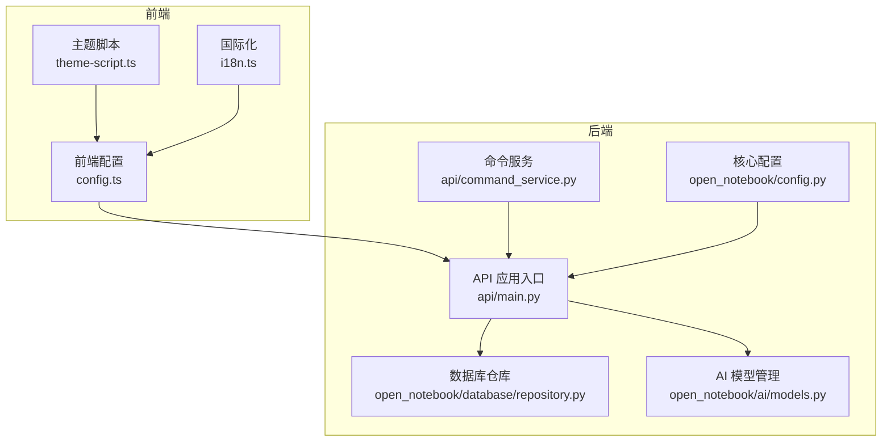
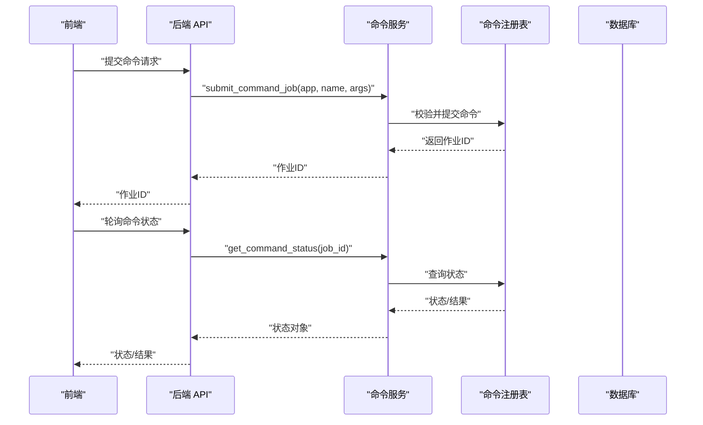
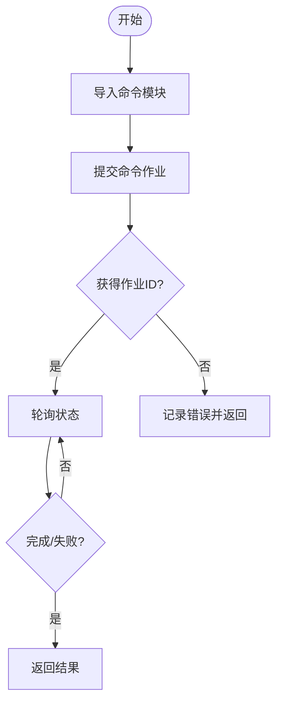
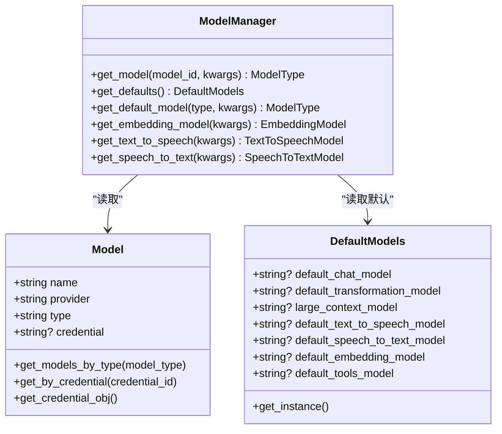
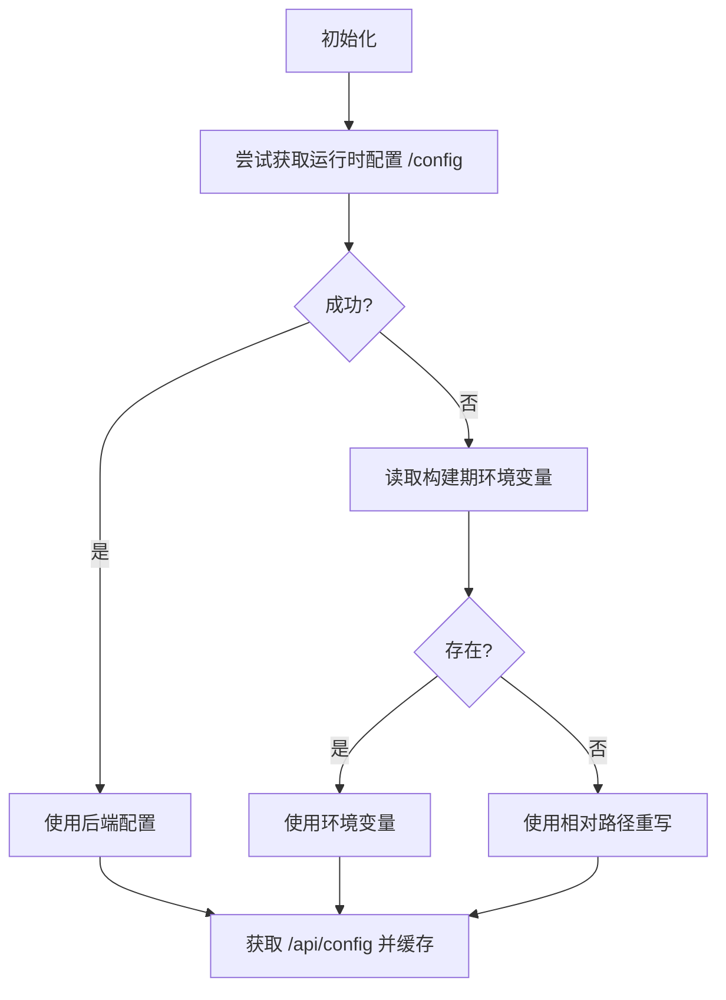
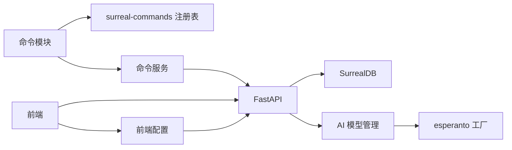

# 扩展与定制

<cite>
**本文引用的文件**
- [README.md](file://README.md)
- [api/main.py](file://api/main.py)
- [api/command_service.py](file://api/command_service.py)
- [commands/__init__.py](file://commands/__init__.py)
- [commands/example_commands.py](file://commands/example_commands.py)
- [frontend/src/lib/config.ts](file://frontend/src/lib/config.ts)
- [frontend/src/lib/i18n.ts](file://frontend/src/lib/i18n.ts)
- [frontend/src/lib/theme-script.ts](file://frontend/src/lib/theme-script.ts)
- [open_notebook/ai/models.py](file://open_notebook/ai/models.py)
- [open_notebook/database/repository.py](file://open_notebook/database/repository.py)
- [open_notebook/config.py](file://open_notebook/config.py)
- [prompts/ask/entry.jinja](file://prompts/ask/entry.jinja)
- [api/models.py](file://api/models.py)
</cite>

## 目录
1. [简介](#简介)
2. [项目结构](#项目结构)
3. [核心组件](#核心组件)
4. [架构总览](#架构总览)
5. [详细组件分析](#详细组件分析)
6. [依赖关系分析](#依赖关系分析)
7. [性能考虑](#性能考虑)
8. [故障排查指南](#故障排查指南)
9. [结论](#结论)
10. [附录](#附录)

## 简介
本指南面向希望对 Open Notebook 进行扩展与定制的开发者，覆盖以下主题：
- 插件与命令系统扩展：如何新增命令、注册命令、在前端触发命令并跟踪进度
- 自定义 AI 模型集成：通过凭据与默认模型配置接入新的 AI 提供商或端点
- UI 组件与主题定制：前端运行时配置、主题切换脚本与国际化扩展
- 内容转换模板（Prompt）：Jinja 模板的创建与修改方法
- API 扩展与第三方集成：FastAPI 路由扩展、中间件与 CORS 配置
- 性能优化与安全加固：数据库连接、加密密钥、异常处理与部署建议

## 项目结构
Open Notebook 采用前后端分离架构：
- 后端基于 FastAPI，提供 REST API；数据库为 SurrealDB
- 前端基于 Next.js/React，使用 i18n 和主题系统
- 命令系统基于 surreal-commands，支持后台作业提交与状态查询
- AI 模型管理通过 esperanto 的 AIFactory 动态加载与缓存

图表来源
- [api/main.py](file://api/main.py#L99-L190)
- [api/command_service.py](file://api/command_service.py#L1-L93)
- [frontend/src/lib/config.ts](file://frontend/src/lib/config.ts#L1-L149)
- [frontend/src/lib/theme-script.ts](file://frontend/src/lib/theme-script.ts#L1-L18)
- [frontend/src/lib/i18n.ts](file://frontend/src/lib/i18n.ts#L1-L25)
- [open_notebook/ai/models.py](file://open_notebook/ai/models.py#L97-L267)
- [open_notebook/database/repository.py](file://open_notebook/database/repository.py#L47-L83)
- [open_notebook/config.py](file://open_notebook/config.py#L1-L18)

章节来源
- [README.md](file://README.md#L1-L358)
- [api/main.py](file://api/main.py#L99-L190)

## 核心组件
- 命令系统：通过 surreal-commands 注册命令，后端提交作业并返回作业 ID，前端轮询状态
- AI 模型管理：统一从数据库读取模型与默认模型配置，按凭据动态构建 Esperanto 配置
- 数据库访问：封装 SurrealDB 连接、查询、插入、更新、删除与关系建立
- 前端配置与运行时：优先从后端 /api/config 获取运行时配置，回退到环境变量与相对路径重写
- 国际化与主题：i18n 初始化与语言检测、主题脚本避免闪烁

章节来源
- [commands/__init__.py](file://commands/__init__.py#L1-L25)
- [commands/example_commands.py](file://commands/example_commands.py#L1-L143)
- [api/command_service.py](file://api/command_service.py#L1-L93)
- [open_notebook/ai/models.py](file://open_notebook/ai/models.py#L97-L267)
- [open_notebook/database/repository.py](file://open_notebook/database/repository.py#L65-L195)
- [frontend/src/lib/config.ts](file://frontend/src/lib/config.ts#L1-L149)
- [frontend/src/lib/i18n.ts](file://frontend/src/lib/i18n.ts#L1-L25)
- [frontend/src/lib/theme-script.ts](file://frontend/src/lib/theme-script.ts#L1-L18)

## 架构总览
下图展示命令执行与模型加载的关键流程。

图表来源
- [api/command_service.py](file://api/command_service.py#L10-L93)
- [commands/__init__.py](file://commands/__init__.py#L1-L25)
- [commands/example_commands.py](file://commands/example_commands.py#L44-L92)

## 详细组件分析

### 命令系统扩展与自定义命令开发
- 命令注册：在命令模块中使用装饰器注册命令，导出到包级 __all__
- 提交命令：通过命令服务提交作业，传入应用名、命令名与参数
- 查询状态：根据作业 ID 获取状态、结果、错误信息与进度
- 取消作业：预留取消接口（当前日志提示）

图表来源
- [api/command_service.py](file://api/command_service.py#L10-L93)
- [commands/example_commands.py](file://commands/example_commands.py#L44-L143)

章节来源
- [commands/__init__.py](file://commands/__init__.py#L1-L25)
- [commands/example_commands.py](file://commands/example_commands.py#L1-L143)
- [api/command_service.py](file://api/command_service.py#L1-L93)

### 自定义 AI 模型集成与默认模型配置
- 模型类型：语言模型、嵌入模型、语音转文本、文本转语音
- 默认模型记录：数据库中的记录用于保存默认模型 ID
- 凭据加载：若模型关联凭据，则从凭据构造 Esperanto 配置；否则回退到环境变量
- 类型校验与实例创建：根据类型调用相应工厂方法，并缓存实例

图表来源
- [open_notebook/ai/models.py](file://open_notebook/ai/models.py#L18-L267)

章节来源
- [open_notebook/ai/models.py](file://open_notebook/ai/models.py#L97-L267)

### UI 组件定制与前端运行时配置
- 运行时配置优先级：后端 /api/config → 构建期环境变量 → 相对路径重写
- 主题脚本：在 React 水合前设置主题，避免闪烁
- 国际化：i18n 初始化、语言检测与本地存储缓存

图表来源
- [frontend/src/lib/config.ts](file://frontend/src/lib/config.ts#L59-L140)
- [frontend/src/lib/theme-script.ts](file://frontend/src/lib/theme-script.ts#L1-L18)
- [frontend/src/lib/i18n.ts](file://frontend/src/lib/i18n.ts#L1-L25)

章节来源
- [frontend/src/lib/config.ts](file://frontend/src/lib/config.ts#L1-L149)
- [frontend/src/lib/theme-script.ts](file://frontend/src/lib/theme-script.ts#L1-L18)
- [frontend/src/lib/i18n.ts](file://frontend/src/lib/i18n.ts#L1-L25)

### 内容转换模板（Prompt）创建与修改
- 模板位置：Jinja 模板位于 prompts 目录
- 示例：问答流程模板展示了系统角色、步骤与输出格式约定
- 修改建议：保持输出格式约束（如 JSON），确保与解析逻辑一致

章节来源
- [prompts/ask/entry.jinja](file://prompts/ask/entry.jinja#L1-L46)

### API 扩展与第三方集成最佳实践
- 路由组织：在主应用中 include_router 注册各模块路由
- 中间件：密码认证中间件与 CORS 中间件的顺序与排除路径
- 异常处理：自定义 HTTP 异常处理器保证错误响应包含 CORS 头
- 数据库迁移：启动时自动执行迁移，失败则快速退出

章节来源
- [api/main.py](file://api/main.py#L157-L190)

## 依赖关系分析
- 命令系统依赖 surreal-commands 注册表与后端导入
- AI 模型管理依赖 esperanto 工厂与凭据提供器
- 前端配置依赖后端 /api/config 与 Next.js 重写
- 数据库访问封装了 SurrealDB 连接与查询

图表来源
- [api/command_service.py](file://api/command_service.py#L1-L93)
- [open_notebook/ai/models.py](file://open_notebook/ai/models.py#L97-L267)
- [frontend/src/lib/config.ts](file://frontend/src/lib/config.ts#L1-L149)

章节来源
- [api/command_service.py](file://api/command_service.py#L1-L93)
- [open_notebook/ai/models.py](file://open_notebook/ai/models.py#L97-L267)
- [frontend/src/lib/config.ts](file://frontend/src/lib/config.ts#L1-L149)

## 性能考虑
- 命令异步化：命令服务支持异步处理，前端轮询状态以避免阻塞
- 模型缓存：Esperanto 工厂会缓存模型实例，减少重复初始化开销
- 数据库连接：统一连接管理与上下文关闭，避免连接泄漏
- 前端重写：使用相对路径重写避免跨域与端口映射问题，降低网络往返

## 故障排查指南
- 加密密钥未配置：启动时检查 OPEN_NOTEBOOK_ENCRYPTION_KEY，未配置会导致凭据加密失败
- CORS 错误：自定义异常处理器确保错误响应包含 CORS 头；反向代理需正确转发错误头
- 数据库版本不匹配：启动时自动迁移，失败会快速退出，需检查数据库连接与权限
- 命令提交失败：确认命令模块已导入，提交后检查作业 ID 是否为空
- 国际化与主题：语言检测与本地存储缓存，主题脚本在水合前执行避免闪烁

章节来源
- [api/main.py](file://api/main.py#L55-L96)
- [api/main.py](file://api/main.py#L130-L154)
- [open_notebook/database/repository.py](file://open_notebook/database/repository.py#L47-L83)
- [api/command_service.py](file://api/command_service.py#L18-L44)
- [frontend/src/lib/i18n.ts](file://frontend/src/lib/i18n.ts#L1-L25)
- [frontend/src/lib/theme-script.ts](file://frontend/src/lib/theme-script.ts#L1-L18)

## 结论
通过命令系统、AI 模型管理、前端运行时配置与数据库访问层的协同，Open Notebook 提供了清晰的扩展点。开发者可按本文档的步骤新增命令、接入新模型、定制 UI 与主题、扩展 Prompt 模板，并在 API 层进行路由与中间件扩展。同时，遵循性能与安全最佳实践可确保系统稳定与高效运行。

## 附录
- 快速开始与安装参考：[README.md](file://README.md#L97-L177)
- 前端配置优先级与实现细节：[frontend/src/lib/config.ts](file://frontend/src/lib/config.ts#L1-L149)
- 命令示例与注册：[commands/example_commands.py](file://commands/example_commands.py#L1-L143)
- AI 模型类型与默认模型记录：[open_notebook/ai/models.py](file://open_notebook/ai/models.py#L18-L267)
- 数据库连接与查询封装：[open_notebook/database/repository.py](file://open_notebook/database/repository.py#L65-L195)
- API 入口与中间件配置：[api/main.py](file://api/main.py#L99-L190)
- Prompt 模板示例：[prompts/ask/entry.jinja](file://prompts/ask/entry.jinja#L1-L46)