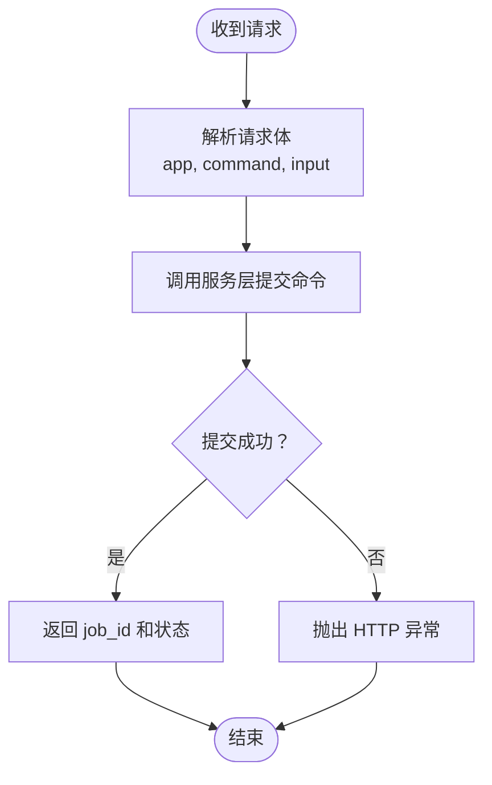

# 插件开发

<cite>
**本文引用的文件**
- [api/command_service.py](file://api/command_service.py)
- [api/routers/commands.py](file://api/routers/commands.py)
- [commands/__init__.py](file://commands/__init__.py)
- [commands/example_commands.py](file://commands/example_commands.py)
- [commands/podcast_commands.py](file://commands/podcast_commands.py)
- [commands/source_commands.py](file://commands/source_commands.py)
- [commands/embedding_commands.py](file://commands/embedding_commands.py)
- [open_notebook/config.py](file://open_notebook/config.py)
- [tests/test_domain.py](file://tests/test_domain.py)
- [docs/7-DEVELOPMENT/testing.md](file://docs/7-DEVELOPMENT/testing.md)
</cite>

## 目录
1. [简介](#简介)
2. [项目结构](#项目结构)
3. [核心组件](#核心组件)
4. [架构总览](#架构总览)
5. [详细组件分析](#详细组件分析)
6. [依赖分析](#依赖分析)
7. [性能考虑](#性能考虑)
8. [故障排查指南](#故障排查指南)
9. [结论](#结论)
10. [附录](#附录)

## 简介
本指南面向希望为 Open Notebook 扩展“命令插件”的开发者，系统讲解命令系统的架构、注册机制、参数处理与状态管理，并提供最佳实践（错误处理、日志记录、性能优化）。你将学会：
- 如何定义新命令处理器并与现有命令系统集成
- 如何通过 API 提交命令并查询状态
- 如何在命令中进行重试策略、幂等性与事务冲突处理
- 如何编写可维护、可观测且高性能的命令插件

## 项目结构
Open Notebook 的命令系统由三层组成：
- API 层：提供 REST 接口提交命令、查询状态、调试注册表
- 服务层：封装命令提交、状态查询、作业列表与取消
- 命令层：具体命令实现，使用 surreal-commands 装饰器注册

图表来源
- [api/routers/commands.py](file://api/routers/commands.py#L1-L167)
- [api/command_service.py](file://api/command_service.py#L1-L93)
- [commands/__init__.py](file://commands/__init__.py#L1-L25)
- [commands/example_commands.py](file://commands/example_commands.py#L1-L143)
- [commands/podcast_commands.py](file://commands/podcast_commands.py#L1-L188)
- [commands/source_commands.py](file://commands/source_commands.py#L1-L269)
- [commands/embedding_commands.py](file://commands/embedding_commands.py#L1-L787)
- [open_notebook/config.py](file://open_notebook/config.py#L1-L18)

章节来源
- [api/routers/commands.py](file://api/routers/commands.py#L1-L167)
- [api/command_service.py](file://api/command_service.py#L1-L93)
- [commands/__init__.py](file://commands/__init__.py#L1-L25)
- [open_notebook/config.py](file://open_notebook/config.py#L1-L18)

## 核心组件
- 命令路由器（FastAPI）：接收命令请求、返回作业 ID、查询状态、列出作业、取消作业、调试注册表
- 命令服务：封装提交、状态查询、作业列表与取消；负责导入命令模块以确保注册可用
- 命令模块：使用 surreal-commands 的装饰器注册命令；定义输入/输出 Pydantic 模型；实现业务逻辑与重试策略
- 配置：数据目录、上传目录、缓存目录等

章节来源
- [api/routers/commands.py](file://api/routers/commands.py#L1-L167)
- [api/command_service.py](file://api/command_service.py#L1-L93)
- [commands/__init__.py](file://commands/__init__.py#L1-L25)
- [open_notebook/config.py](file://open_notebook/config.py#L1-L18)

## 架构总览
命令从 API 提交到服务层，服务层调用 surreal-commands 提交作业；命令在后台执行，客户端通过作业 ID 查询状态。

图表来源
- [api/routers/commands.py](file://api/routers/commands.py#L37-L86)
- [api/command_service.py](file://api/command_service.py#L11-L68)

## 详细组件分析

### 命令路由器（API）
- 职责：定义请求/响应模型、暴露命令提交、状态查询、作业列表、取消、注册表调试接口
- 关键点：
  - 请求体包含 app、command、input
  - 返回立即响应，包含 job_id
  - 状态查询返回标准化字段（结果、错误、时间戳、进度）

图表来源
- [api/routers/commands.py](file://api/routers/commands.py#L37-L71)

章节来源
- [api/routers/commands.py](file://api/routers/commands.py#L1-L167)

### 命令服务（服务层）
- 职责：统一提交命令、查询状态、作业列表、取消作业
- 关键点：
  - 提交前导入命令模块，确保注册表已加载
  - 统一状态字段映射（含时间戳、进度、错误）
  - 取消作业目前记录日志（预留扩展）

图表来源
- [api/command_service.py](file://api/command_service.py#L11-L68)

章节来源
- [api/command_service.py](file://api/command_service.py#L1-L93)

### 命令注册与导出
- 命令通过装饰器注册到 surreal-commands 注册表
- commands/__init__.py 将所有命令集中导出，确保服务层导入时完成注册

图表来源
- [commands/__init__.py](file://commands/__init__.py#L1-L25)
- [commands/example_commands.py](file://commands/example_commands.py#L43-L92)
- [commands/podcast_commands.py](file://commands/podcast_commands.py#L49-L187)
- [commands/source_commands.py](file://commands/source_commands.py#L48-L268)
- [commands/embedding_commands.py](file://commands/embedding_commands.py#L120-L786)

章节来源
- [commands/__init__.py](file://commands/__init__.py#L1-L25)

### 示例命令：文本处理与数据分析
- 输入/输出使用 Pydantic 模型
- 支持异步延迟模拟、不同操作类型
- 统一返回处理耗时与错误信息

图表来源
- [commands/example_commands.py](file://commands/example_commands.py#L43-L92)

章节来源
- [commands/example_commands.py](file://commands/example_commands.py#L1-L143)

### 源内容处理命令：流程与重试
- 加载转换器、更新源记录关联命令、执行图工作流、统计洞察与嵌入数量
- 使用 retry 配置处理并发/事务冲突，区分永久失败与瞬时失败

图表来源
- [commands/source_commands.py](file://commands/source_commands.py#L60-L137)

章节来源
- [commands/source_commands.py](file://commands/source_commands.py#L1-L269)

### 播客生成命令：外部库集成与错误提示
- 加载剧集与说话人配置、生成输出目录、调用外部库生成播客
- 对特定模型问题给出明确提示，便于用户调整

图表来源
- [commands/podcast_commands.py](file://commands/podcast_commands.py#L50-L167)

章节来源
- [commands/podcast_commands.py](file://commands/podcast_commands.py#L1-L188)

### 嵌入命令：分块、批量嵌入与重建
- 单条嵌入：笔记、洞察、源
- 批量重建：按模式与包含项收集目标，提交子任务
- 重试策略：针对瞬时失败，避免对验证错误重试

图表来源
- [commands/embedding_commands.py](file://commands/embedding_commands.py#L621-L786)

章节来源
- [commands/embedding_commands.py](file://commands/embedding_commands.py#L1-L787)

### 命令定义、参数处理与状态管理
- 定义：使用装饰器注册，指定 app 与可选 retry 配置
- 参数：Pydantic 输入模型校验，输出模型统一结构
- 状态：服务层统一映射 surreal-commands 状态，包含结果、错误、时间戳、进度

章节来源
- [api/routers/commands.py](file://api/routers/commands.py#L13-L35)
- [api/command_service.py](file://api/command_service.py#L47-L68)
- [commands/example_commands.py](file://commands/example_commands.py#L43-L92)
- [commands/source_commands.py](file://commands/source_commands.py#L48-L59)

## 依赖分析
- 命令模块依赖 surreal-commands 的装饰器与注册表
- 命令服务依赖 surreal-commands 的提交与状态查询
- 命令实现依赖领域模型、数据库仓库、工具函数与配置

图表来源
- [api/routers/commands.py](file://api/routers/commands.py#L1-L10)
- [api/command_service.py](file://api/command_service.py#L1-L9)
- [commands/__init__.py](file://commands/__init__.py#L1-L25)
- [open_notebook/config.py](file://open_notebook/config.py#L1-L18)

章节来源
- [api/routers/commands.py](file://api/routers/commands.py#L1-L10)
- [api/command_service.py](file://api/command_service.py#L1-L9)
- [commands/__init__.py](file://commands/__init__.py#L1-L25)
- [open_notebook/config.py](file://open_notebook/config.py#L1-L18)

## 性能考虑
- 异步与并发：命令实现使用异步函数，避免阻塞事件循环
- 批量处理：嵌入命令支持批量生成与插入，减少往返次数
- 重试策略：对瞬时失败采用指数退避抖动，降低峰值压力
- 幂等性：重建嵌入先清理旧记录，保证重复提交安全
- I/O 优化：合理拆分内容（分块），减少单次请求负载

章节来源
- [commands/embedding_commands.py](file://commands/embedding_commands.py#L379-L403)
- [commands/source_commands.py](file://commands/source_commands.py#L51-L58)
- [commands/podcast_commands.py](file://commands/podcast_commands.py#L122-L126)

## 故障排查指南
- 提交失败：确认命令模块已导入；检查 app 名称与命令名称是否匹配
- 状态异常：使用调试端点查看注册表；核对 surreal-commands 状态字段映射
- 外部库错误：播客生成命令对特定模型问题给出明确提示，建议更换模型
- 事务冲突：源处理与洞察创建命令内置重试，避免并发写入冲突
- 日志定位：命令实现与服务层均使用日志记录关键路径与错误堆栈

章节来源
- [api/command_service.py](file://api/command_service.py#L19-L25)
- [api/routers/commands.py](file://api/routers/commands.py#L122-L166)
- [commands/podcast_commands.py](file://commands/podcast_commands.py#L169-L187)
- [commands/source_commands.py](file://commands/source_commands.py#L139-L154)

## 结论
Open Notebook 的命令系统以 surreal-commands 为核心，通过清晰的三层结构实现了命令的注册、提交、状态查询与调试。开发者只需遵循输入/输出模型规范、正确使用重试策略与日志记录，即可快速扩展自定义命令并安全地与现有系统集成。

## 附录

### 开发最佳实践
- 错误处理
  - 区分永久失败（如参数校验）与瞬时失败（网络/超时），前者不重试，后者使用指数退避
  - 在命令实现中捕获异常并返回标准化输出模型，包含错误信息与处理耗时
- 日志记录
  - 记录关键步骤、输入摘要、错误堆栈与处理耗时
  - 使用统一的日志级别与上下文（如命令 ID）
- 性能优化
  - 使用异步 I/O 与批量操作
  - 合理拆分内容（分块）与控制重试上限
  - 避免在命令中执行长时间阻塞操作
- 测试建议
  - 验证输入/输出模型的边界条件与错误场景
  - 模拟瞬时失败与事务冲突，验证重试策略
  - 使用独立测试用例覆盖成功与失败分支

章节来源
- [commands/source_commands.py](file://commands/source_commands.py#L139-L154)
- [commands/embedding_commands.py](file://commands/embedding_commands.py#L418-L439)
- [tests/test_domain.py](file://tests/test_domain.py#L256-L341)
- [docs/7-DEVELOPMENT/testing.md](file://docs/7-DEVELOPMENT/testing.md#L256-L341)

### 生命周期与依赖注入
- 命令生命周期
  - 注册阶段：模块导入后由装饰器注册到 surreal-commands
  - 提交阶段：服务层提交作业，返回 job_id
  - 执行阶段：后台异步执行，支持重试与错误恢复
  - 查询阶段：统一状态映射，返回结果或错误
- 依赖注入
  - 命令实现依赖领域模型、仓库与工具函数
  - 配置通过 open_notebook/config.py 提供（如数据目录）
  - 服务层作为适配器，屏蔽 surreal-commands 细节

章节来源
- [commands/__init__.py](file://commands/__init__.py#L1-L25)
- [api/command_service.py](file://api/command_service.py#L11-L44)
- [open_notebook/config.py](file://open_notebook/config.py#L1-L18)