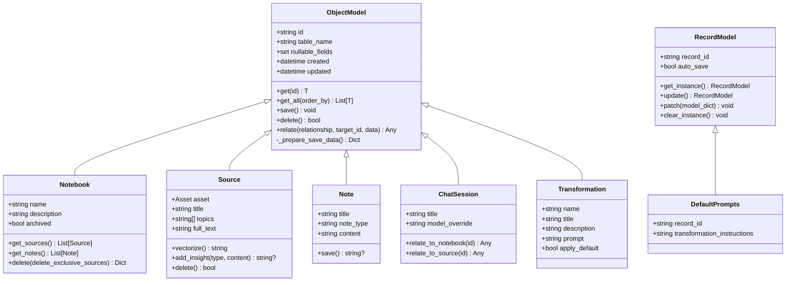

# 数据模型扩展

<cite>
**本文档引用的文件**
- [repository.py](file://open_notebook/database/repository.py)
- [async_migrate.py](file://open_notebook/database/async_migrate.py)
- [migrate.py](file://open_notebook/database/migrate.py)
- [base.py](file://open_notebook/domain/base.py)
- [notebook.py](file://open_notebook/domain/notebook.py)
- [transformation.py](file://open_notebook/domain/transformation.py)
- [models.py](file://open_notebook/podcasts/models.py)
- [embedding.py](file://open_notebook/utils/embedding.py)
- [1.surrealql](file://open_notebook/database/migrations/1.surrealql)
- [2.surrealql](file://open_notebook/database/migrations/2.surrealql)
- [3.surrealql](file://open_notebook/database/migrations/3.surrealql)
- [10.surrealql](file://open_notebook/database/migrations/10.surrealql)
- [11.surrealql](file://open_notebook/database/migrations/11.surrealql)
- [CLAUDE.md](file://open_notebook/database/CLAUDE.md)
- [architecture.md](file://docs/7-DEVELOPMENT/architecture.md)
- [code-standards.md](file://docs/7-DEVELOPMENT/code-standards.md)
</cite>

## 目录
1. [简介](#简介)
2. [项目结构](#项目结构)
3. [核心组件](#核心组件)
4. [架构总览](#架构总览)
5. [详细组件分析](#详细组件分析)
6. [依赖关系分析](#依赖关系分析)
7. [性能考虑](#性能考虑)
8. [故障排除指南](#故障排除指南)
9. [结论](#结论)
10. [附录](#附录)

## 简介
本指南面向需要在现有系统中扩展现有数据模型或创建新实体类型的开发者，重点覆盖以下方面：
- 基于 SurrealDB 的数据建模原则与关系设计
- 数据库迁移的创建与管理流程
- 字段扩展、索引优化与约束定义
- 新业务实体及其关系的添加方法
- 数据验证与业务规则的实现
- 数据导入导出与批量操作的扩展思路
- 缓存策略与性能优化技术

## 项目结构
系统采用分层架构：API 层负责请求处理；领域模型层封装业务逻辑；数据库访问层通过统一的仓库函数与 SurrealDB 交互；迁移系统确保模式演进的可追溯性。


图表来源
- [repository.py](file://open_notebook/database/repository.py#L1-L195)
- [async_migrate.py](file://open_notebook/database/async_migrate.py#L1-L229)
- [base.py](file://open_notebook/domain/base.py#L1-L329)
- [notebook.py](file://open_notebook/domain/notebook.py#L1-L679)
- [transformation.py](file://open_notebook/domain/transformation.py#L1-L22)
- [models.py](file://open_notebook/podcasts/models.py#L1-L148)
- [embedding.py](file://open_notebook/utils/embedding.py#L1-L208)

章节来源
- [repository.py](file://open_notebook/database/repository.py#L1-L195)
- [async_migrate.py](file://open_notebook/database/async_migrate.py#L1-L229)
- [base.py](file://open_notebook/domain/base.py#L1-L329)

## 核心组件
- 仓库函数（Repository）：提供统一的 CRUD、关系建立、查询与批量插入能力，并自动处理时间戳与 RecordID 类型转换。
- 基础模型（ObjectModel/RecordModel）：为所有领域模型提供通用的持久化、校验、关系绑定与单例记录支持。
- 迁移管理（AsyncMigrationManager/MigrationManager）：基于文件化的 SurrealQL 迁移，支持版本跟踪、向上/向下迁移与回滚。
- 模型示例：笔记本、源、笔记、聊天会话、转换、播客相关实体等，展示字段定义、关系建模与业务规则。
- 嵌入工具：提供文本分块、批量嵌入与向量池化，支撑检索与相似度搜索。

章节来源
- [repository.py](file://open_notebook/database/repository.py#L65-L195)
- [base.py](file://open_notebook/domain/base.py#L31-L329)
- [async_migrate.py](file://open_notebook/database/async_migrate.py#L91-L229)
- [notebook.py](file://open_notebook/domain/notebook.py#L16-L679)
- [transformation.py](file://open_notebook/domain/transformation.py#L8-L22)
- [models.py](file://open_notebook/podcasts/models.py#L10-L148)
- [embedding.py](file://open_notebook/utils/embedding.py#L82-L208)

## 架构总览
下图展示了从 API 到数据库的端到端数据流，以及迁移与模型的关系：


图表来源
- [repository.py](file://open_notebook/database/repository.py#L47-L83)
- [base.py](file://open_notebook/domain/base.py#L113-L183)
- [notebook.py](file://open_notebook/domain/notebook.py#L555-L626)

## 详细组件分析

### 数据建模原则与关系设计
- 表与字段：每个实体对应一张表，字段使用灵活类型以支持可选值与扩展。
- 关系建模：使用关系表（如 reference、artifact、refers_to）连接实体，支持多对多与层次关系。
- 时间戳：统一维护 created 与 updated 字段，便于审计与排序。
- 单例记录：RecordModel 支持以 record_id 作为全局唯一标识的单例记录，适合配置类数据。

```mermaid
erDiagram
NOTEBOOK {
string id PK
string name
string description
boolean archived
datetime created
datetime updated
}
SOURCE {
string id PK
json asset
string title
string[] topics
string full_text
datetime created
datetime updated
}
NOTE {
string id PK
string title
string note_type
string content
array<float> embedding
datetime created
datetime updated
}
CHAT_SESSION {
string id PK
string title
string model_override
datetime created
datetime updated
}
REFERENCE {
string id PK
}
ARTIFACT {
string id PK
}
NOTEBOOK ||--o{ REFERENCE : "被引用"
SOURCE ||--o{ REFERENCE : "引用"
NOTEBOOK ||--o{ ARTIFACT : "包含"
NOTE ||--o{ ARTIFACT : "归属"
CHAT_SESSION ||--o{ REFERENCE : "关联"
```

图表来源
- [1.surrealql](file://open_notebook/database/migrations/1.surrealql#L44-L61)
- [3.surrealql](file://open_notebook/database/migrations/3.surrealql#L4-L6)
- [notebook.py](file://open_notebook/domain/notebook.py#L16-L626)

章节来源
- [1.surrealql](file://open_notebook/database/migrations/1.surrealql#L1-L179)
- [3.surrealql](file://open_notebook/database/migrations/3.surrealql#L1-L146)
- [notebook.py](file://open_notebook/domain/notebook.py#L16-L626)

### 字段扩展与约束定义
- 新增字段：通过迁移文件中的 DEFINE FIELD 语句声明新字段类型与默认值。
- 可空字段：通过 nullable_fields 控制保存时是否允许 None 值。
- 验证规则：使用 Pydantic 的 field_validator 定义输入校验与业务规则。
- 示例路径：
  - [新增 note_type 字段](file://open_notebook/database/migrations/2.surrealql#L1-L2)
  - [定义字段与默认值（示例）](file://open_notebook/database/migrations/1.surrealql#L4-L52)
  - [模型字段校验（示例）](file://open_notebook/domain/notebook.py#L22-L27)

章节来源
- [2.surrealql](file://open_notebook/database/migrations/2.surrealql#L1-L2)
- [1.surrealql](file://open_notebook/database/migrations/1.surrealql#L4-L52)
- [notebook.py](file://open_notebook/domain/notebook.py#L22-L27)

### 索引优化与全文检索
- 全文索引：为标题、内容等列定义基于自定义分析器的 BM25 索引，提升检索性能。
- 向量索引：为 embedding 字段提供相似度搜索能力。
- 索引维护：迁移脚本中新增关系字段索引，减少查询扫描成本。
- 示例路径：
  - [全文索引定义](file://open_notebook/database/migrations/1.surrealql#L65-L72)
  - [向量搜索函数](file://open_notebook/database/migrations/1.surrealql#L139-L173)
  - [关系字段索引](file://open_notebook/database/migrations/10.surrealql#L5-L6)

章节来源
- [1.surrealql](file://open_notebook/database/migrations/1.surrealql#L65-L173)
- [10.surrealql](file://open_notebook/database/migrations/10.surrealql#L1-L14)

### 创建新的业务实体与关系
- 定义实体：在迁移文件中创建表与字段，必要时定义事件与触发器。
- 模型映射：在领域模型中继承 ObjectModel/RecordModel，设置 table_name 或 record_id。
- 关系绑定：使用 relate 方法建立双向关系，或通过查询直接操作关系表。
- 示例路径：
  - [创建表与关系（示例）](file://open_notebook/database/migrations/1.surrealql#L44-L61)
  - [模型继承与关系（示例）](file://open_notebook/domain/notebook.py#L611-L626)
  - [仓库关系操作（示例）](file://open_notebook/database/repository.py#L106-L121)

章节来源
- [1.surrealql](file://open_notebook/database/migrations/1.surrealql#L44-L61)
- [notebook.py](file://open_notebook/domain/notebook.py#L611-L626)
- [repository.py](file://open_notebook/database/repository.py#L106-L121)

### 数据验证与业务规则
- 输入校验：使用 Pydantic 验证器确保字段非空、格式正确。
- 业务规则：在模型 save/relate 等方法中实现业务逻辑，如状态检查、级联删除。
- 异常处理：统一捕获与转换为业务异常，便于上层处理。
- 示例路径：
  - [模型验证器（示例）](file://open_notebook/domain/notebook.py#L22-L27)
  - [保存前数据准备（示例）](file://open_notebook/domain/base.py#L162-L168)
  - [关系创建与错误处理（示例）](file://open_notebook/domain/base.py#L184-L196)

章节来源
- [notebook.py](file://open_notebook/domain/notebook.py#L22-L27)
- [base.py](file://open_notebook/domain/base.py#L162-L196)

### 数据导入导出与批量操作
- 批量插入：使用 repo_insert 支持批量创建，可选择忽略重复项。
- 导入策略：通过命令系统提交后台任务，避免阻塞主流程。
- 导出与下载：前端提供文件下载接口，后端返回二进制数据。
- 示例路径：
  - [批量插入（示例）](file://open_notebook/database/repository.py#L169-L195)
  - [向量化与异步处理（示例）](file://open_notebook/domain/notebook.py#L411-L456)
  - [前端上传与下载（示例）](file://frontend/src/lib/api/sources.ts#L84-L108)

章节来源
- [repository.py](file://open_notebook/database/repository.py#L169-L195)
- [notebook.py](file://open_notebook/domain/notebook.py#L411-L456)
- [sources.ts](file://frontend/src/lib/api/sources.ts#L84-L108)

### 缓存策略与性能优化
- 前端缓存：TanStack Query 在前端进行查询缓存与增量更新。
- 向量复用：向量搜索使用预计算的 embedding，避免重复计算。
- 分块策略：长文本按阈值分块，批量嵌入后均值池化，提升召回质量。
- 并发控制：事务冲突通过 RuntimeError 标识，支持重试与降级。
- 示例路径：
  - [均值池化与批量嵌入（示例）](file://open_notebook/utils/embedding.py#L26-L208)
  - [架构性能建议（示例）](file://docs/7-DEVELOPMENT/architecture.md#L811-L827)

章节来源
- [embedding.py](file://open_notebook/utils/embedding.py#L26-L208)
- [architecture.md](file://docs/7-DEVELOPMENT/architecture.md#L811-L827)

## 依赖关系分析



图表来源
- [base.py](file://open_notebook/domain/base.py#L31-L329)
- [notebook.py](file://open_notebook/domain/notebook.py#L16-L679)
- [transformation.py](file://open_notebook/domain/transformation.py#L8-L22)

章节来源
- [base.py](file://open_notebook/domain/base.py#L31-L329)
- [notebook.py](file://open_notebook/domain/notebook.py#L16-L679)
- [transformation.py](file://open_notebook/domain/transformation.py#L8-L22)

## 性能考虑
- 连接模型：当前仓库函数为每次操作新建连接，适用于无服务器/无状态 API；高吞吐场景建议引入连接池。
- 查询优化：利用迁移脚本中定义的索引与函数，避免全表扫描；对高频查询进行缓存。
- 向量搜索：使用预计算 embedding 与相似度函数，减少实时计算开销。
- 批量处理：优先使用批量插入与批量嵌入，降低网络往返与 API 调用次数。
- 并发冲突：事务冲突通过 RuntimeError 标识，可在上层实现指数退避重试。

章节来源
- [CLAUDE.md](file://open_notebook/database/CLAUDE.md#L87-L104)
- [architecture.md](file://docs/7-DEVELOPMENT/architecture.md#L811-L827)
- [repository.py](file://open_notebook/database/repository.py#L183-L195)

## 故障排除指南
- 迁移失败：检查迁移文件语法与依赖对象是否存在；查看日志输出定位具体错误。
- 事务冲突：捕获 RuntimeError 并进行重试；避免在热点资源上并发写入。
- 记录不存在：统一使用 NotFoundError 包装查询结果；确认 ID 格式与表名匹配。
- 嵌入失败：检查嵌入模型配置与提供商可用性；对长文本启用分块与均值池化。
- 健康检查：通过轻量查询检测数据库连通性与超时问题。

章节来源
- [async_migrate.py](file://open_notebook/database/async_migrate.py#L47-L49)
- [repository.py](file://open_notebook/database/repository.py#L76-L82)
- [embedding.py](file://open_notebook/utils/embedding.py#L124-L141)
- [config.py](file://api/routers/config.py#L102-L117)

## 结论
通过统一的仓库函数、强类型的领域模型与文件化迁移系统，系统实现了可演进、可维护的数据模型扩展能力。遵循本文档的字段扩展、索引优化、约束定义与关系建模最佳实践，可安全地添加新实体与业务规则；结合缓存与批量处理策略，能够有效提升整体性能与用户体验。

## 附录

### 数据库迁移创建与管理流程
- 创建迁移文件：在 migrations 目录下新增 N.surrealql 与 N_down.surrealql。
- 注册迁移：在 AsyncMigrationManager 中添加迁移文件路径。
- 应用迁移：启动时由生命周期钩子自动执行未应用的迁移。
- 版本管理：通过 _sbl_migrations 表记录当前版本，支持回滚。


图表来源
- [async_migrate.py](file://open_notebook/database/async_migrate.py#L96-L179)
- [1.surrealql](file://open_notebook/database/migrations/1.surrealql#L175-L179)

章节来源
- [async_migrate.py](file://open_notebook/database/async_migrate.py#L96-L179)
- [migrate.py](file://open_notebook/database/migrate.py#L6-L27)
- [1.surrealql](file://open_notebook/database/migrations/1.surrealql#L175-L179)

### 开发规范与最佳实践
- 使用迁移管理模式进行模式变更，避免直接修改生产环境。
- 对外暴露的字段需在迁移中显式定义类型与默认值。
- 业务规则尽量集中在模型层，保持 API 层简洁。
- 所有 CRUD 操作统一通过仓库函数，保证一致性与可观测性。

章节来源
- [code-standards.md](file://docs/7-DEVELOPMENT/code-standards.md#L265-L276)
- [CLAUDE.md](file://open_notebook/database/CLAUDE.md#L72-L104)