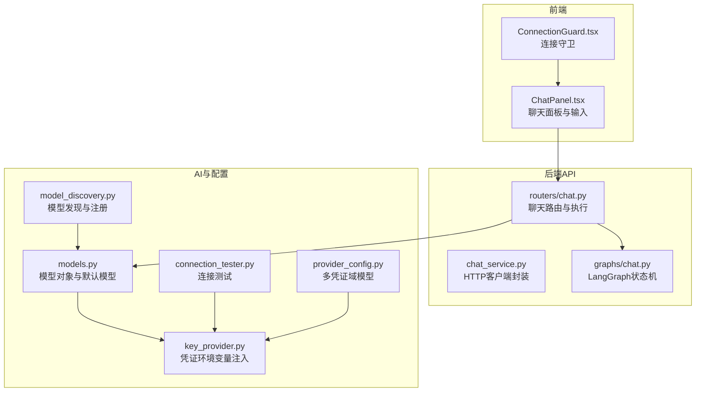
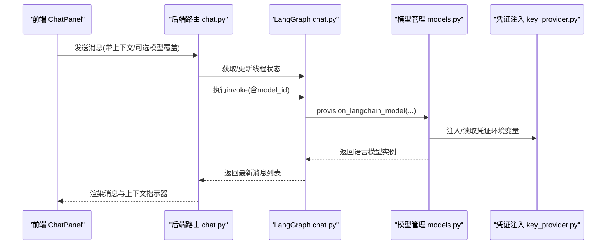
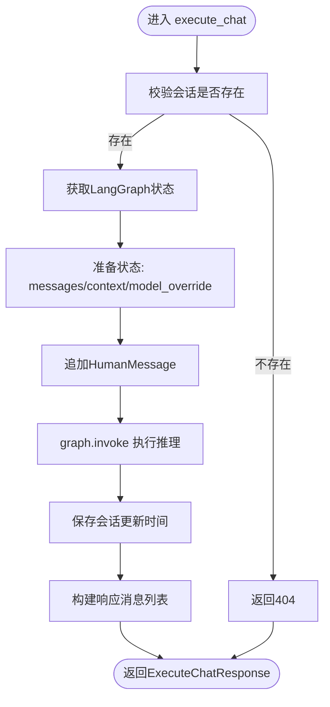
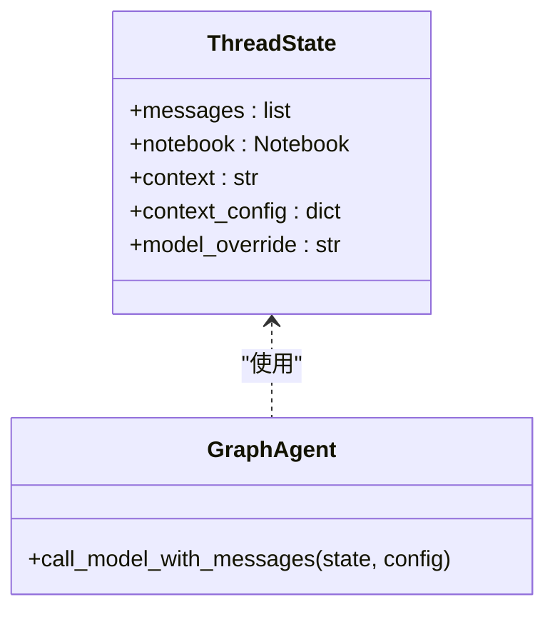
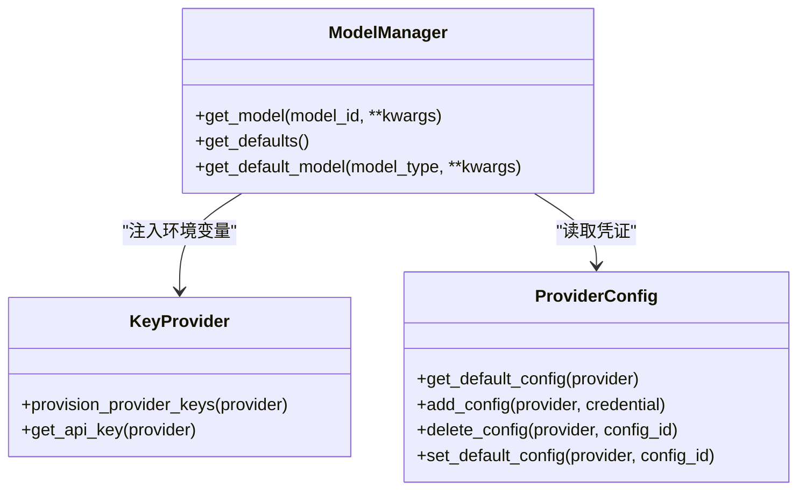
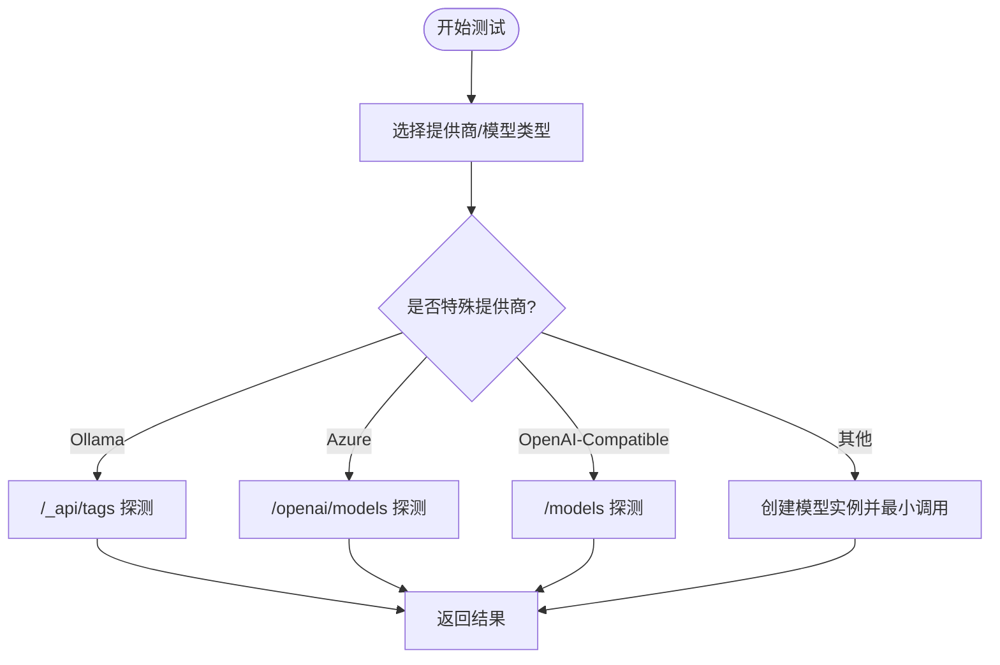
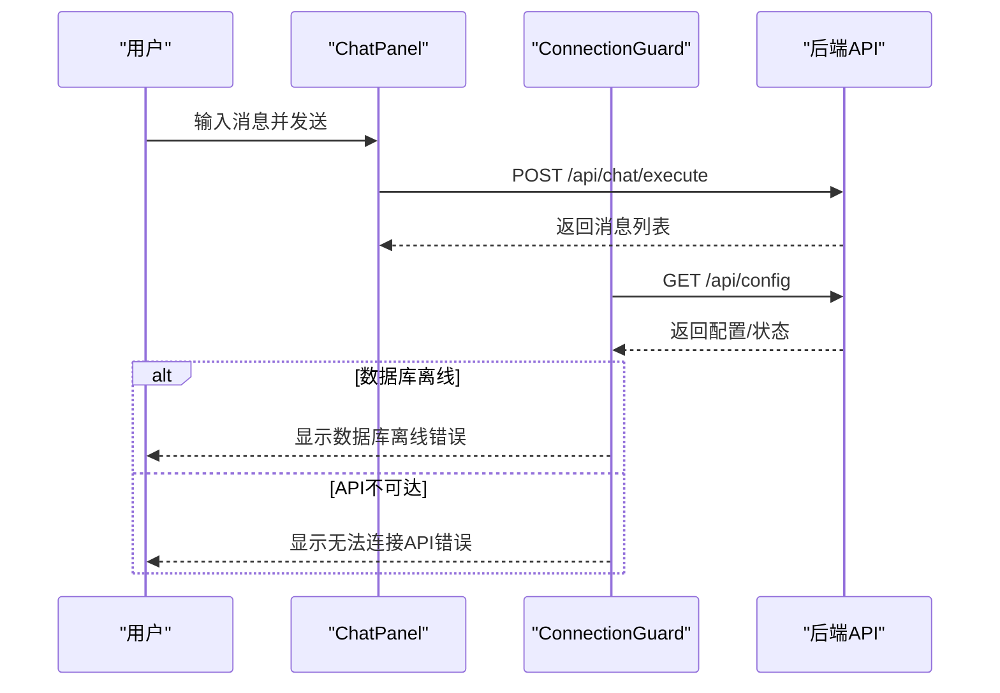
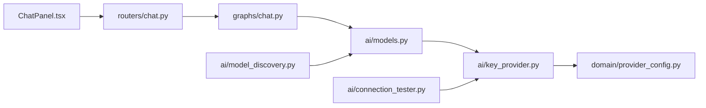

# AI聊天问题

<cite>
**本文引用的文件**
- [api/chat_service.py](file://api/chat_service.py)
- [api/routers/chat.py](file://api/routers/chat.py)
- [open_notebook/ai/connection_tester.py](file://open_notebook/ai/connection_tester.py)
- [open_notebook/ai/key_provider.py](file://open_notebook/ai/key_provider.py)
- [open_notebook/ai/model_discovery.py](file://open_notebook/ai/model_discovery.py)
- [open_notebook/ai/models.py](file://open_notebook/ai/models.py)
- [open_notebook/domain/provider_config.py](file://open_notebook/domain/provider_config.py)
- [open_notebook/graphs/chat.py](file://open_notebook/graphs/chat.py)
- [frontend/src/components/source/ChatPanel.tsx](file://frontend/src/components/source/ChatPanel.tsx)
- [frontend/src/components/common/ConnectionGuard.tsx](file://frontend/src/components/common/ConnectionGuard.tsx)
- [docs/6-TROUBLESHOOTING/ai-chat-issues.md](file://docs/6-TROUBLESHOOTING/ai-chat-issues.md)
- [docs/6-TROUBLESHOOTING/connection-issues.md](file://docs/6-TROUBLESHOOTING/connection-issues.md)
- [docs/6-TROUBLESHOOTING/quick-fixes.md](file://docs/6-TROUBLESHOOTING/quick-fixes.md)
- [docs/5-CONFIGURATION/ai-providers.md](file://docs/5-CONFIGURATION/ai-providers.md)
- [docs/5-CONFIGURATION/ollama.md](file://docs/5-CONFIGURATION/ollama.md)
</cite>

## 目录
1. [简介](#简介)
2. [项目结构](#项目结构)
3. [核心组件](#核心组件)
4. [架构总览](#架构总览)
5. [详细组件分析](#详细组件分析)
6. [依赖关系分析](#依赖关系分析)
7. [性能考虑](#性能考虑)
8. [故障排查指南](#故障排查指南)
9. [结论](#结论)
10. [附录](#附录)

## 简介
本指南聚焦于Open Notebook中“AI聊天”功能的综合排查与优化，覆盖以下常见问题：
- 聊天不工作（无法发送消息、会话异常）
- 响应缓慢或超时
- 回答质量差（通用、错误、缺乏引用）
- API密钥无效或权限不足
- 模型不可用或上下文过长
- 不同AI提供商（OpenAI、Anthropic、Ollama等）的特定问题

同时提供连接测试方法、模型配置验证、性能优化建议与调试技巧。

## 项目结构
Open Notebook的聊天功能由前后端协同完成：前端负责UI与用户交互，后端提供REST接口与LangGraph状态机执行推理，AI层通过esperanto工厂按需加载模型，凭证系统统一管理密钥与配置。

图示来源
- [frontend/src/components/source/ChatPanel.tsx](file://frontend/src/components/source/ChatPanel.tsx#L1-L375)
- [frontend/src/components/common/ConnectionGuard.tsx](file://frontend/src/components/common/ConnectionGuard.tsx#L1-L109)
- [api/routers/chat.py](file://api/routers/chat.py#L1-L517)
- [api/chat_service.py](file://api/chat_service.py#L1-L169)
- [open_notebook/graphs/chat.py](file://open_notebook/graphs/chat.py#L1-L94)
- [open_notebook/ai/key_provider.py](file://open_notebook/ai/key_provider.py#L1-L298)
- [open_notebook/ai/model_discovery.py](file://open_notebook/ai/model_discovery.py#L1-L757)
- [open_notebook/ai/connection_tester.py](file://open_notebook/ai/connection_tester.py#L1-L439)
- [open_notebook/ai/models.py](file://open_notebook/ai/models.py#L1-L267)
- [open_notebook/domain/provider_config.py](file://open_notebook/domain/provider_config.py#L1-L445)

章节来源
- [api/routers/chat.py](file://api/routers/chat.py#L1-L517)
- [open_notebook/graphs/chat.py](file://open_notebook/graphs/chat.py#L1-L94)
- [open_notebook/ai/models.py](file://open_notebook/ai/models.py#L1-L267)
- [open_notebook/ai/key_provider.py](file://open_notebook/ai/key_provider.py#L1-L298)

## 核心组件
- 前端聊天面板：负责渲染消息、处理输入、触发发送、展示上下文指示器与会话管理。
- 后端聊天路由：接收请求、校验会话、准备状态、调用LangGraph执行推理、返回消息列表。
- LangGraph状态机：维护消息历史、拼接系统提示、按需加载语言模型并生成回复。
- 模型管理：从数据库或凭证读取模型配置，注入环境变量，创建esperanto模型实例。
- 凭证与连接：统一管理多提供商凭证，支持测试连接、动态发现模型、设置环境变量。
- 连接守卫：在页面加载时检测API/数据库连通性，必要时显示错误覆盖层。

章节来源
- [frontend/src/components/source/ChatPanel.tsx](file://frontend/src/components/source/ChatPanel.tsx#L1-L375)
- [frontend/src/components/common/ConnectionGuard.tsx](file://frontend/src/components/common/ConnectionGuard.tsx#L1-L109)
- [api/routers/chat.py](file://api/routers/chat.py#L1-L517)
- [open_notebook/graphs/chat.py](file://open_notebook/graphs/chat.py#L1-L94)
- [open_notebook/ai/models.py](file://open_notebook/ai/models.py#L1-L267)
- [open_notebook/ai/key_provider.py](file://open_notebook/ai/key_provider.py#L1-L298)
- [open_notebook/ai/connection_tester.py](file://open_notebook/ai/connection_tester.py#L1-L439)

## 架构总览
聊天请求从前端发起，经由后端路由进入LangGraph状态机，状态机根据当前模型ID或会话覆盖模型ID加载语言模型，执行推理并返回消息。模型加载前会通过凭证系统注入环境变量或使用数据库中的配置。

图示来源
- [api/routers/chat.py](file://api/routers/chat.py#L330-L409)
- [open_notebook/graphs/chat.py](file://open_notebook/graphs/chat.py#L27-L80)
- [open_notebook/ai/models.py](file://open_notebook/ai/models.py#L97-L176)
- [open_notebook/ai/key_provider.py](file://open_notebook/ai/key_provider.py#L236-L270)

## 详细组件分析

### 组件A：聊天路由与执行流程
- 路由负责：
  - 校验会话存在性
  - 从请求与会话中确定模型覆盖优先级
  - 从LangGraph获取/更新状态，追加用户消息
  - 调用graph.invoke执行推理，保存会话时间戳
  - 将消息转换为响应格式返回
- 关键点：
  - 支持每请求覆盖模型与会话级覆盖
  - 使用SqliteSaver的同步get_state包装，避免异步阻塞
  - 记录详细错误日志便于定位

图示来源
- [api/routers/chat.py](file://api/routers/chat.py#L330-L409)

章节来源
- [api/routers/chat.py](file://api/routers/chat.py#L96-L173)
- [api/routers/chat.py](file://api/routers/chat.py#L175-L248)
- [api/routers/chat.py](file://api/routers/chat.py#L330-L409)

### 组件B：LangGraph状态机与模型加载
- 状态机定义了ThreadState字段（messages、notebook、context、context_config、model_override），并在节点中拼接系统提示与消息，调用provision_langchain_model加载模型并生成回复。
- 模型加载采用事件循环兼容策略：若已有运行中事件循环则在线程池中新建循环；否则直接运行。
- 输出消息会清理思考内容标记，确保输出整洁。

图示来源
- [open_notebook/graphs/chat.py](file://open_notebook/graphs/chat.py#L19-L25)
- [open_notebook/graphs/chat.py](file://open_notebook/graphs/chat.py#L27-L80)

章节来源
- [open_notebook/graphs/chat.py](file://open_notebook/graphs/chat.py#L1-L94)

### 组件C：模型管理与凭证注入
- 模型管理器：
  - 从数据库加载模型记录，按类型创建对应esperanto模型
  - 若模型绑定凭证，则从凭证读取配置并注入环境变量
  - 若无凭证则回退到环境变量注入
  - 提供默认模型查询能力，缺失时记录警告
- 凭证注入：
  - 支持简单提供商（如OpenAI、Anthropic）与复杂提供商（Azure、Vertex、OpenAI-Compatible）
  - 通过环境变量名映射表设置对应KEY/URL
- 多凭证域模型：
  - ProviderConfig支持同一提供商多个凭证，可设置默认凭证
  - 加载时解密API Key，保存时加密存储

图示来源
- [open_notebook/ai/models.py](file://open_notebook/ai/models.py#L97-L176)
- [open_notebook/ai/key_provider.py](file://open_notebook/ai/key_provider.py#L236-L270)
- [open_notebook/domain/provider_config.py](file://open_notebook/domain/provider_config.py#L280-L409)

章节来源
- [open_notebook/ai/models.py](file://open_notebook/ai/models.py#L1-L267)
- [open_notebook/ai/key_provider.py](file://open_notebook/ai/key_provider.py#L1-L298)
- [open_notebook/domain/provider_config.py](file://open_notebook/domain/provider_config.py#L1-L445)

### 组件D：连接测试与模型发现
- 连接测试：
  - 针对各提供商（OpenAI、Anthropic、Google、Groq、Mistral、DeepSeek、xAI、OpenRouter、Voyage、ElevenLabs、Ollama、Azure、OpenAI-Compatible）进行最小化调用验证
  - 对Ollama/Azure/OpenAI-Compatible提供专用探测逻辑
  - 归一化错误消息，区分认证失败、速率限制、网络超时、模型未找到等场景
- 模型发现：
  - 为各提供商实现模型列表拉取或静态清单
  - 基于模型名称模式分类语言/嵌入/语音模型
  - 支持批量注册到数据库，统计各类型数量

图示来源
- [open_notebook/ai/connection_tester.py](file://open_notebook/ai/connection_tester.py#L170-L300)
- [open_notebook/ai/connection_tester.py](file://open_notebook/ai/connection_tester.py#L97-L169)
- [open_notebook/ai/connection_tester.py](file://open_notebook/ai/connection_tester.py#L132-L169)
- [open_notebook/ai/connection_tester.py](file://open_notebook/ai/connection_tester.py#L170-L295)

章节来源
- [open_notebook/ai/connection_tester.py](file://open_notebook/ai/connection_tester.py#L1-L439)
- [open_notebook/ai/model_discovery.py](file://open_notebook/ai/model_discovery.py#L1-L757)

### 组件E：前端聊天面板与连接守卫
- 聊天面板：
  - 支持快捷键发送（Cmd/Ctrl+Enter）
  - 展示AI消息中的引用链接，点击跳转详情
  - 显示上下文指示器（来源/洞察/笔记数量）
  - 支持模型选择器与会话管理弹窗
- 连接守卫：
  - 页面加载时检查API/数据库连通性
  - API不可达时显示错误覆盖层，支持键盘重试

图示来源
- [frontend/src/components/source/ChatPanel.tsx](file://frontend/src/components/source/ChatPanel.tsx#L104-L120)
- [frontend/src/components/common/ConnectionGuard.tsx](file://frontend/src/components/common/ConnectionGuard.tsx#L18-L76)

章节来源
- [frontend/src/components/source/ChatPanel.tsx](file://frontend/src/components/source/ChatPanel.tsx#L1-L375)
- [frontend/src/components/common/ConnectionGuard.tsx](file://frontend/src/components/common/ConnectionGuard.tsx#L1-L109)

## 依赖关系分析
- 路由依赖LangGraph状态机与模型管理器，模型管理器再依赖凭证注入与数据库凭证记录。
- 前端依赖后端API，连接守卫在渲染前进行连通性检查。
- 连接测试与模型发现模块独立于主流程，但为配置阶段提供保障。

图示来源
- [api/routers/chat.py](file://api/routers/chat.py#L1-L517)
- [open_notebook/graphs/chat.py](file://open_notebook/graphs/chat.py#L1-L94)
- [open_notebook/ai/models.py](file://open_notebook/ai/models.py#L1-L267)
- [open_notebook/ai/key_provider.py](file://open_notebook/ai/key_provider.py#L1-L298)
- [open_notebook/domain/provider_config.py](file://open_notebook/domain/provider_config.py#L1-L445)
- [open_notebook/ai/connection_tester.py](file://open_notebook/ai/connection_tester.py#L1-L439)
- [open_notebook/ai/model_discovery.py](file://open_notebook/ai/model_discovery.py#L1-L757)

章节来源
- [api/routers/chat.py](file://api/routers/chat.py#L1-L517)
- [open_notebook/graphs/chat.py](file://open_notebook/graphs/chat.py#L1-L94)
- [open_notebook/ai/models.py](file://open_notebook/ai/models.py#L1-L267)
- [open_notebook/ai/key_provider.py](file://open_notebook/ai/key_provider.py#L1-L298)
- [open_notebook/domain/provider_config.py](file://open_notebook/domain/provider_config.py#L1-L445)
- [open_notebook/ai/connection_tester.py](file://open_notebook/ai/connection_tester.py#L1-L439)
- [open_notebook/ai/model_discovery.py](file://open_notebook/ai/model_discovery.py#L1-L757)

## 性能考虑
- 超时设置：后端对本地/慢速模型（如Ollama）使用较长读超时，避免早期中断。
- 并发控制：通过环境变量限制并发任务数，降低数据库与API压力。
- 上下文长度：合理选择上下文来源与模式（全量/摘要），避免超出模型上下文窗口。
- 模型选择：优先选择更快更便宜的模型用于日常对话，复杂推理再切换更强模型。
- 系统资源：监控CPU/内存占用，必要时降低并发或升级硬件。

章节来源
- [api/chat_service.py](file://api/chat_service.py#L137-L147)
- [docs/6-TROUBLESHOOTING/ai-chat-issues.md](file://docs/6-TROUBLESHOOTING/ai-chat-issues.md#L198-L236)
- [docs/6-TROUBLESHOOTING/quick-fixes.md](file://docs/6-TROUBLESHOOTING/quick-fixes.md#L115-L142)

## 故障排查指南

### 通用问题定位步骤
- 检查API连通性：确认后端服务运行、端口开放、API_URL正确。
- 检查凭证与密钥：在设置中测试连接，确保密钥有效且具备所需权限。
- 检查默认模型：确保已配置默认聊天模型，且模型仍存在于提供商处。
- 检查上下文：减少来源数量或切换为“摘要”，避免上下文过长。
- 查看日志：结合后端错误堆栈与前端提示，定位具体环节。

章节来源
- [docs/6-TROUBLESHOOTING/connection-issues.md](file://docs/6-TROUBLESHOOTING/connection-issues.md#L1-L448)
- [docs/6-TROUBLESHOOTING/ai-chat-issues.md](file://docs/6-TROUBLESHOOTING/ai-chat-issues.md#L1-L443)
- [docs/6-TROUBLESHOOTING/quick-fixes.md](file://docs/6-TROUBLESHOOTING/quick-fixes.md#L1-L373)

### 常见问题与解决方案

- 聊天不工作（“无法发送消息”）
  - 可能原因：未配置默认语言模型、模型被删除、会话ID格式不正确
  - 解决方案：在“设置→模型”中设置默认聊天模型；核对模型名称与提供商一致；确认会话ID带前缀
  - 参考：[AI聊天问题文档](file://docs/6-TROUBLESHOOTING/ai-chat-issues.md#L7-L58)

- 响应缓慢或超时
  - 可能原因：慢速模型、大上下文、API过载、系统资源紧张
  - 解决方案：切换更快模型；减少上下文；增加超时；降低并发；检查系统负载
  - 参考：[AI聊天问题文档](file://docs/6-TROUBLESHOOTING/ai-chat-issues.md#L192-L236)、[快速修复](file://docs/6-TROUBLESHOOTING/quick-fixes.md#L115-L142)

- 回答质量差（通用、错误、无引用）
  - 可能原因：上下文不足、问题模糊、模型不合适
  - 解决方案：勾选并使用“全文”上下文；提出更具体的问题；切换更强模型；要求引用页码
  - 参考：[AI聊天问题文档](file://docs/6-TROUBLESHOOTING/ai-chat-issues.md#L144-L189)

- API密钥无效或权限不足
  - 可能原因：密钥过期/错误/权限受限
  - 解决方案：在“设置→API密钥”中重新添加并测试；更换新密钥；确认账户配额与权限
  - 参考：[AI聊天问题文档](file://docs/6-TROUBLESHOOTING/ai-chat-issues.md#L100-L141)、[提供商配置](file://docs/5-CONFIGURATION/ai-providers.md#L1-L468)

- 模型不可用或上下文过长
  - 可能原因：模型不存在、上下文超过token限制
  - 解决方案：重新发现并注册模型；减少来源或使用“摘要”；切换上下文更长的模型
  - 参考：[AI聊天问题文档](file://docs/6-TROUBLESHOOTING/ai-chat-issues.md#L295-L324)

- Ollama相关问题
  - 可能原因：Ollama未运行、外部访问未启用、模型名不匹配、Docker网络解析失败
  - 解决方案：启动Ollama并允许外部访问；使用`ollama list`的确切模型名；Linux需配置`extra_hosts`；确保端口可达
  - 参考：[Ollama配置指南](file://docs/5-CONFIGURATION/ollama.md#L1-L741)、[AI聊天问题文档](file://docs/6-TROUBLESHOOTING/ai-chat-issues.md#L27-L58)

- 连接问题（前端无法访问API）
  - 可能原因：服务未运行、端口未暴露、API_URL不匹配、防火墙阻断
  - 解决方案：检查容器状态与端口映射；核对API_URL；放行端口；使用健康检查脚本
  - 参考：[连接问题文档](file://docs/6-TROUBLESHOOTING/connection-issues.md#L1-L448)

- 速率限制与配额
  - 可能原因：提供商限流或账户配额不足
  - 解决方案：等待或升级账户；切换到其他提供商；使用本地Ollama
  - 参考：[AI聊天问题文档](file://docs/6-TROUBLESHOOTING/ai-chat-issues.md#L257-L289)

- 会话历史丢失
  - 可能原因：未在同一会话中提问或会话标题为空
  - 解决方案：保持同一会话；为会话命名
  - 参考：[AI聊天问题文档](file://docs/6-TROUBLESHOOTING/ai-chat-issues.md#L239-L254)

### 调试技巧与最佳实践
- 在“设置→API密钥”中使用“测试连接”按钮快速验证凭证有效性。
- 使用“发现模型→注册模型”流程确保可用模型出现在“设置→模型”中。
- 在“聊天→选择来源”中仅勾选必要来源，并优先使用“全文”以提升准确性。
- 使用“模型选择器”临时覆盖本次消息使用的模型，便于对比效果。
- 定期查看后端日志中的错误堆栈，结合请求参数定位问题。
- 对于Ollama，使用`ollama list`核对模型名，避免大小写与标签差异导致的“模型未找到”。

章节来源
- [docs/6-TROUBLESHOOTING/ai-chat-issues.md](file://docs/6-TROUBLESHOOTING/ai-chat-issues.md#L1-L443)
- [docs/6-TROUBLESHOOTING/connection-issues.md](file://docs/6-TROUBLESHOOTING/connection-issues.md#L1-L448)
- [docs/6-TROUBLESHOOTING/quick-fixes.md](file://docs/6-TROUBLESHOOTING/quick-fixes.md#L1-L373)
- [docs/5-CONFIGURATION/ai-providers.md](file://docs/5-CONFIGURATION/ai-providers.md#L1-L468)
- [docs/5-CONFIGURATION/ollama.md](file://docs/5-CONFIGURATION/ollama.md#L1-L741)

## 结论
Open Notebook的聊天功能通过前后端协作、LangGraph状态机与esperanto模型工厂形成清晰的执行链路。排查问题的关键在于：
- 先确认API连通性与凭证有效性
- 再检查默认模型与上下文配置
- 最后针对具体提供商与部署场景（云/本地）采取差异化策略

遵循本文提供的诊断步骤与最佳实践，可显著提升聊天功能的稳定性与用户体验。

## 附录

### 快速自检清单
- [ ] API服务运行且端口可达
- [ ] 设置中已添加并测试通过API密钥
- [ ] 已“发现模型→注册模型”，默认模型已配置
- [ ] 聊天上下文来源合理，未过度膨胀
- [ ] 使用合适的模型（速度/成本/质量平衡）
- [ ] Ollama已允许外部访问，模型名与输出完全一致

章节来源
- [docs/6-TROUBLESHOOTING/quick-fixes.md](file://docs/6-TROUBLESHOOTING/quick-fixes.md#L319-L373)