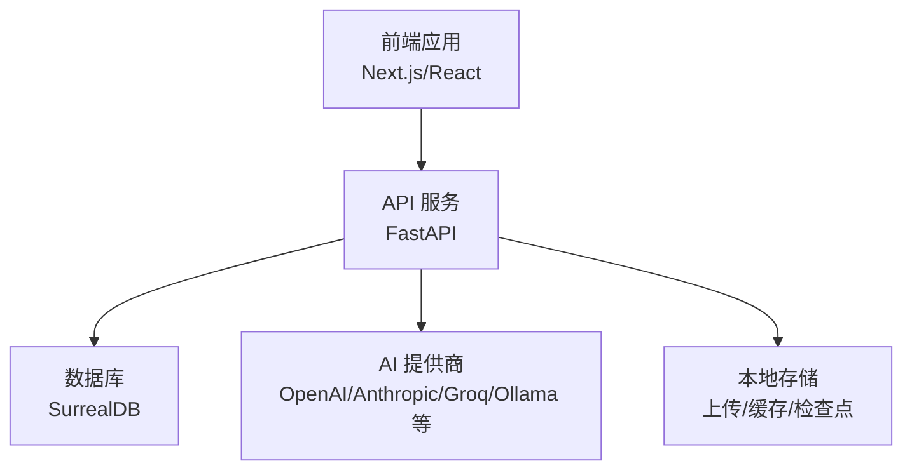
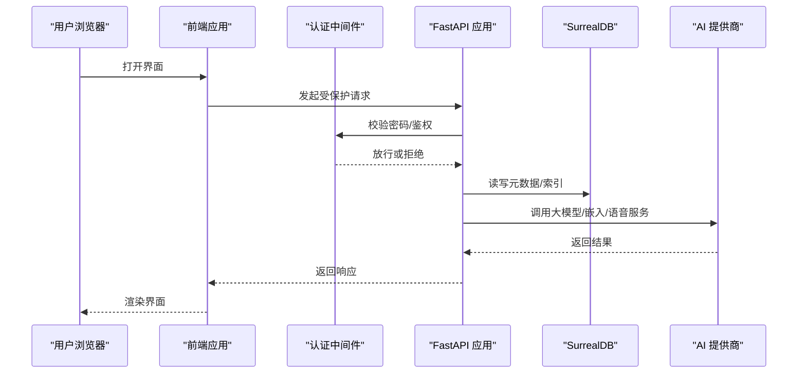
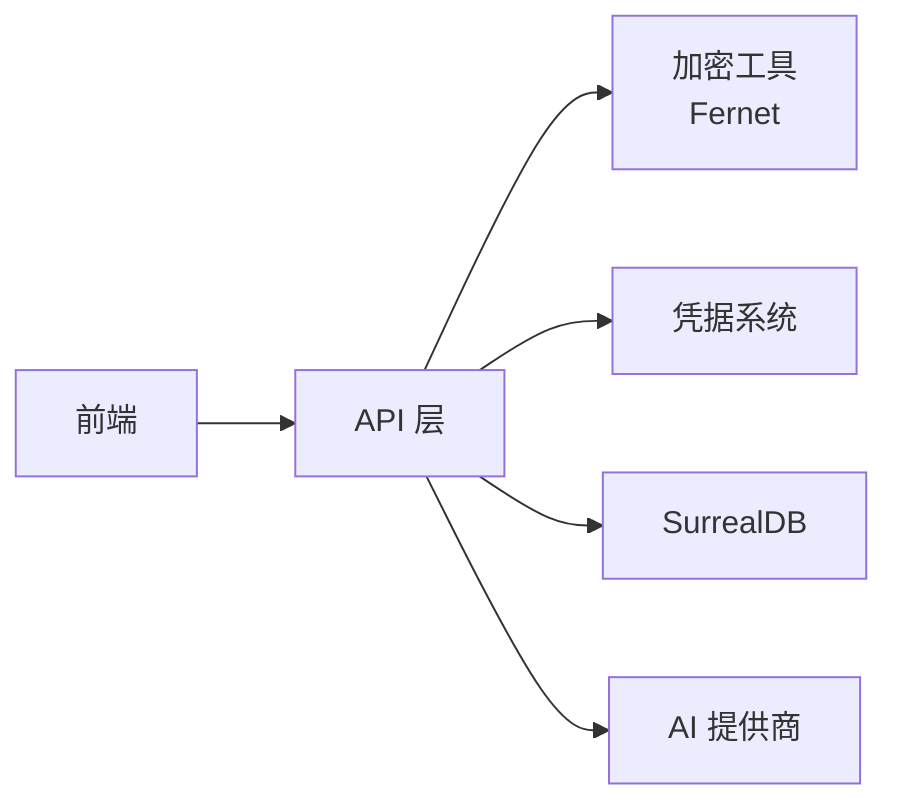

# 常见问答

<cite>
**本文引用的文件**
- [README.md](file://README.md)
- [docs/index.md](file://docs/index.md)
- [docs/6-TROUBLESHOOTING/faq.md](file://docs/6-TROUBLESHOOTING/faq.md)
- [docs/6-TROUBLESHOOTING/quick-fixes.md](file://docs/6-TROUBLESHOOTING/quick-fixes.md)
- [docs/3-USER-GUIDE/index.md](file://docs/3-USER-GUIDE/index.md)
- [docs/5-CONFIGURATION/index.md](file://docs/5-CONFIGURATION/index.md)
- [docs/5-CONFIGURATION/environment-reference.md](file://docs/5-CONFIGURATION/environment-reference.md)
- [docs/2-CORE-Concepts/index.md](file://docs/2-CORE-CONCEPTS/index.md)
- [docs/1-INSTALLATION/index.md](file://docs/1-INSTALLATION/index.md)
- [docs/4-AI-PROVIDERS/index.md](file://docs/4-AI-PROVIDERS/index.md)
- [api/main.py](file://api/main.py)
- [api/models.py](file://api/models.py)
- [open_notebook/config.py](file://open_notebook/config.py)
- [open_notebook/utils/token_utils.py](file://open_notebook/utils/token_utils.py)
- [open_notebook/utils/encryption.py](file://open_notebook/utils/encryption.py)
- [open_notebook/domain/provider_config.py](file://open_notebook/domain/provider_config.py)
</cite>

## 目录
1. [简介](#简介)
2. [项目结构](#项目结构)
3. [核心组件](#核心组件)
4. [架构总览](#架构总览)
5. [详细组件解析](#详细组件解析)
6. [依赖关系分析](#依赖关系分析)
7. [性能与成本优化](#性能与成本优化)
8. [故障排查指南](#故障排查指南)
9. [结论](#结论)
10. [附录](#附录)

## 简介
本常见问答面向首次使用或正在使用 Open Notebook 的用户，聚焦于“如何用、如何省、如何稳、如何安”。内容覆盖功能使用、成本控制、性能优化、数据安全与备份恢复等主题，并提供权威解答与最佳实践，帮助您以更低试错成本获得稳定体验。

## 项目结构
Open Notebook 采用前后端分离与模块化设计：前端为 Next.js/React 应用，后端为 FastAPI 服务，数据库采用 SurrealDB；同时提供 Docker 多容器部署方案与单容器方案，便于快速上手与生产部署。

图示来源
- [api/main.py](file://api/main.py#L99-L190)
- [docs/1-INSTALLATION/index.md](file://docs/1-INSTALLATION/index.md#L1-L154)
- [open_notebook/config.py](file://open_notebook/config.py#L1-L18)

章节来源
- [README.md](file://README.md#L1-L358)
- [docs/index.md](file://docs/index.md#L1-L290)

## 核心组件
- 前端界面：仪表盘、笔记本、源（PDF/链接/音视频）、笔记、搜索、聊天、播客生成、设置与配置。
- 后端 API：统一 REST 接口，路由覆盖认证、模型、笔记本、源、笔记、搜索、变换、嵌入、播客、上下文、命令等。
- 数据层：SurrealDB 存储元数据与索引；本地文件系统保存上传内容、缓存与检查点。
- 安全与加密：API 密钥通过“凭据”系统管理，支持对称加密存储；可选密码保护实例。
- 配置中心：环境变量驱动数据库连接、超时、代理、调试、并发等；可通过 UI 配置提供商密钥。

章节来源
- [api/main.py](file://api/main.py#L157-L180)
- [api/models.py](file://api/models.py#L1-L685)
- [docs/5-CONFIGURATION/index.md](file://docs/5-CONFIGURATION/index.md#L1-L329)
- [open_notebook/config.py](file://open_notebook/config.py#L1-L18)

## 架构总览
下图展示从浏览器到 API、数据库与外部 AI 提供商的整体调用链路，以及关键中间件（认证、CORS）与异常处理策略。

图示来源
- [api/main.py](file://api/main.py#L105-L127)
- [api/main.py](file://api/main.py#L130-L154)
- [api/main.py](file://api/main.py#L157-L180)

## 详细组件解析

### 功能使用类问题
- 如何开始使用？
  - 建议先完成安装与配置，再按“用户指南”逐项实践。可参考“快速入门路径”与“首 15 分钟清单”。
  - 参考：[docs/1-INSTALLATION/index.md](file://docs/1-INSTALLATION/index.md#L1-L154)、[docs/3-USER-GUIDE/index.md](file://docs/3-USER-GUIDE/index.md#L142-L172)

- 如何添加源（PDF/链接/音视频）？
  - 在“添加源”指南中查看支持类型、上传流程与常见错误修复。
  - 参考：[docs/3-USER-GUIDE/index.md](file://docs/3-USER-GUIDE/index.md#L18-L27)

- 如何高效地进行搜索与提问？
  - 文本搜索适合关键词定位，向量搜索适合语义检索；结合两者效果更佳。
  - 参考：[docs/3-USER-GUIDE/index.md](file://docs/3-USER-GUIDE/index.md#L66-L75)

- 如何用播客形式复用研究成果？
  - 创建播客前先准备好研究内容，选择合适的说话人与 TTS 提供商，生成后下载。
  - 参考：[docs/3-USER-GUIDE/index.md](file://docs/3-USER-GUIDE/index.md#L54-L63)

- 如何批量提取洞察（变换）？
  - 使用内置模板或自定义提示词，对多个源执行统一处理。
  - 参考：[docs/3-USER-GUIDE/index.md](file://docs/3-USER-GUIDE/index.md#L78-L86)

- 如何组织笔记本与源的关系？
  - 按主题/项目/时间维度建立笔记本；合理拆分源大小，避免单源过大导致处理缓慢。
  - 参考：[docs/3-USER-GUIDE/index.md](file://docs/3-USER-GUIDE/index.md#L175-L186)、[docs/2-CORE-CONCEPTS/index.md](file://docs/2-CORE-CONCEPTS/index.md#L1-L71)

章节来源
- [docs/3-USER-GUIDE/index.md](file://docs/3-USER-GUIDE/index.md#L1-L209)
- [docs/2-CORE-CONCEPTS/index.md](file://docs/2-CORE-CONCEPTS/index.md#L1-L71)

### 成本控制与模型选择
- 如何选择合适的提供商与模型组合？
  - 初学者推荐 OpenAI；注重隐私可用本地 Ollama；追求性价比可考虑 Groq/Google 免费额度；长上下文优先 Anthropic/Google Gemini。
  - 参考：[docs/4-AI-PROVIDERS/index.md](file://docs/4-AI-PROVIDERS/index.md#L9-L135)

- 如何估算月度成本？
  - 不同提供商计费差异较大，可参考“成本估算器”中的轻/中/重度用量区间。
  - 参考：[docs/4-AI-PROVIDERS/index.md](file://docs/4-AI-PROVIDERS/index.md#L154-L182)

- 如何降低 API 费用？
  - 小任务用小模型、复杂推理用大模型；开启“摘要仅上下文”减少传输；利用免费配额与本地模型。
  - 参考：[docs/6-TROUBLESHOOTING/faq.md](file://docs/6-TROUBLESHOOTING/faq.md#L84-L95)

- 如何在 UI 中配置提供商密钥？
  - 通过“设置 → API 密钥”添加凭证，测试连通性、发现模型并注册。
  - 参考：[docs/5-CONFIGURATION/index.md](file://docs/5-CONFIGURATION/index.md#L234-L250)

章节来源
- [docs/4-AI-PROVIDERS/index.md](file://docs/4-AI-PROVIDERS/index.md#L1-L200)
- [docs/6-TROUBLESHOOTING/faq.md](file://docs/6-TROUBLESHOOTING/faq.md#L40-L95)
- [docs/5-CONFIGURATION/index.md](file://docs/5-CONFIGURATION/index.md#L234-L250)

### 性能优化与系统要求
- 有哪些关键超时与并发参数？
  - API 客户端超时、LLM 推理超时、数据库最大并发任务数、TTS 并发批大小等均可通过环境变量调节。
  - 参考：[docs/5-CONFIGURATION/environment-reference.md](file://docs/5-CONFIGURATION/environment-reference.md#L11-L61)、[docs/5-CONFIGURATION/environment-reference.md](file://docs/5-CONFIGURATION/environment-reference.md#L46-L51)

- 为什么聊天很慢或超时？
  - 可能原因：上下文过大、提供商较慢、本地模型 CPU 加速不足、首次加载模型。建议切换更快模型、减少上下文、使用本地 GPU 或提高超时。
  - 参考：[docs/6-TROUBLESHOOTING/faq.md](file://docs/6-TROUBLESHOOTING/faq.md#L198-L224)、[docs/6-TROUBLESHOOTING/quick-fixes.md](file://docs/6-TROUBLESHOOTING/quick-fixes.md#L115-L142)

- 系统资源与硬件建议？
  - 最低 4GB 内存、2 核 CPU、10GB 空间；推荐 8GB+ 内存、多核 CPU、SSD；本地模型建议 16GB+ 内存与 GPU。
  - 参考：[docs/6-TROUBLESHOOTING/faq.md](file://docs/6-TROUBLESHOOTING/faq.md#L183-L195)、[docs/1-INSTALLATION/index.md](file://docs/1-INSTALLATION/index.md#L38-L51)

章节来源
- [docs/5-CONFIGURATION/environment-reference.md](file://docs/5-CONFIGURATION/environment-reference.md#L1-L275)
- [docs/6-TROUBLESHOOTING/faq.md](file://docs/6-TROUBLESHOOTING/faq.md#L183-L224)
- [docs/6-TROUBLESHOOTING/quick-fixes.md](file://docs/6-TROUBLESHOOTING/quick-fixes.md#L115-L142)
- [docs/1-INSTALLATION/index.md](file://docs/1-INSTALLATION/index.md#L38-L51)

### 数据安全与隐私
- 凭据与密钥如何存储与保护？
  - 通过“凭据”系统保存，使用对称加密（Fernet）存储于数据库；需设置加密密钥；支持 Docker 秘钥注入模式。
  - 参考：[docs/5-CONFIGURATION/index.md](file://docs/5-CONFIGURATION/index.md#L89-L107)、[open_notebook/utils/encryption.py](file://open_notebook/utils/encryption.py#L1-L198)

- 如何启用实例级访问保护？
  - 可设置登录密码，配合反向代理与 HTTPS 提升生产安全性。
  - 参考：[docs/5-CONFIGURATION/environment-reference.md](file://docs/5-CONFIGURATION/environment-reference.md#L11-L16)、[docs/5-CONFIGURATION/security.md](file://docs/5-CONFIGURATION/security.md)

- 本地数据存放位置与隐私边界？
  - 默认数据位于本地目录，不上传至第三方服务器（除选定提供商外），可手动备份。
  - 参考：[docs/6-TROUBLESHOOTING/faq.md](file://docs/6-TROUBLESHOOTING/faq.md#L100-L107)

- 如何迁移旧版环境变量密钥到新系统？
  - 通过 UI 迁移，自动导入并清理旧变量。
  - 参考：[docs/5-CONFIGURATION/environment-reference.md](file://docs/5-CONFIGURATION/environment-reference.md#L232-L275)

章节来源
- [docs/5-CONFIGURATION/index.md](file://docs/5-CONFIGURATION/index.md#L89-L107)
- [open_notebook/utils/encryption.py](file://open_notebook/utils/encryption.py#L1-L198)
- [docs/6-TROUBLESHOOTING/faq.md](file://docs/6-TROUBLESHOOTING/faq.md#L100-L107)
- [docs/5-CONFIGURATION/environment-reference.md](file://docs/5-CONFIGURATION/environment-reference.md#L232-L275)

### 备份与恢复
- 如何备份与恢复数据？
  - 对数据目录与数据库目录进行打包备份；恢复时解压对应目录即可。
  - 参考：[docs/6-TROUBLESHOOTING/faq.md](file://docs/6-TROUBLESHOOTING/faq.md#L108-L117)

- 删除笔记本会怎样？
  - 通常为软删除（归档），可在数据库中恢复。
  - 参考：[docs/6-TROUBLESHOOTING/faq.md](file://docs/6-TROUBLESHOOTING/faq.md#L125-L129)

章节来源
- [docs/6-TROUBLESHOOTING/faq.md](file://docs/6-TROUBLESHOOTING/faq.md#L108-L129)

### API 与集成
- 是否支持程序化调用？
  - 提供完整 REST API，支持所有 UI 功能；可通过密码头进行认证。
  - 参考：[docs/6-TROUBLESHOOTING/faq.md](file://docs/6-TROUBLESHOOTING/faq.md#L168-L174)、[api/main.py](file://api/main.py#L157-L180)

- 关键接口与数据模型概览
  - 笔记本、源、笔记、搜索、变换、嵌入、播客、上下文、设置、凭据等均有明确请求/响应模型。
  - 参考：[api/models.py](file://api/models.py#L1-L685)

章节来源
- [docs/6-TROUBLESHOOTING/faq.md](file://docs/6-TROUBLESHOOTING/faq.md#L168-L174)
- [api/main.py](file://api/main.py#L157-L180)
- [api/models.py](file://api/models.py#L1-L685)

## 依赖关系分析
- 组件耦合与职责
  - 前端仅通过 API 与后端交互，后端通过凭据系统与外部提供商通信，数据库负责持久化。
- 外部依赖
  - AI 提供商（OpenAI/Anthropic/Groq/Ollama 等）、SurrealDB、可选反向代理与证书。
- 安全边界
  - 加密密钥与提供商密钥均通过“凭据”系统管理，避免明文泄露。

图示来源
- [open_notebook/utils/encryption.py](file://open_notebook/utils/encryption.py#L1-L198)
- [open_notebook/domain/provider_config.py](file://open_notebook/domain/provider_config.py#L387-L426)
- [api/main.py](file://api/main.py#L157-L180)

章节来源
- [open_notebook/utils/encryption.py](file://open_notebook/utils/encryption.py#L1-L198)
- [open_notebook/domain/provider_config.py](file://open_notebook/domain/provider_config.py#L387-L426)
- [api/main.py](file://api/main.py#L157-L180)

## 性能与成本优化
- 模型与上下文
  - 小任务用小模型（如 gpt-4o-mini、claude-3-5-haiku），复杂推理用大模型；根据需要选择“摘要仅上下文”降低传输与费用。
  - 参考：[docs/6-TROUBLESHOOTING/faq.md](file://docs/6-TROUBLESHOOTING/faq.md#L84-L95)

- 超时与并发
  - 根据部署场景调整 API 客户端超时与 LLM 推理超时；在本地 CPU 场景适当延长等待时间。
  - 参考：[docs/6-TROUBLESHOOTING/faq.md](file://docs/6-TROUBLESHOOTING/faq.md#L215-L223)、[docs/5-CONFIGURATION/environment-reference.md](file://docs/5-CONFIGURATION/environment-reference.md#L11-L61)

- 本地模型与硬件
  - 使用 Ollama 本地推理可显著降低成本；GPU 显著提升速度；注意内存与磁盘空间。
  - 参考：[docs/4-AI-PROVIDERS/index.md](file://docs/4-AI-PROVIDERS/index.md#L57-L78)、[docs/1-INSTALLATION/index.md](file://docs/1-INSTALLATION/index.md#L67-L75)

- 搜索与索引
  - 合理拆分源文件，避免单源过大；文本与向量双通道搜索互补。
  - 参考：[docs/3-USER-GUIDE/index.md](file://docs/3-USER-GUIDE/index.md#L175-L186)

章节来源
- [docs/6-TROUBLESHOOTING/faq.md](file://docs/6-TROUBLESHOOTING/faq.md#L84-L95)
- [docs/6-TROUBLESHOOTING/faq.md](file://docs/6-TROUBLESHOOTING/faq.md#L215-L223)
- [docs/5-CONFIGURATION/environment-reference.md](file://docs/5-CONFIGURATION/environment-reference.md#L11-L61)
- [docs/4-AI-PROVIDERS/index.md](file://docs/4-AI-PROVIDERS/index.md#L57-L78)
- [docs/1-INSTALLATION/index.md](file://docs/1-INSTALLATION/index.md#L67-L75)
- [docs/3-USER-GUIDE/index.md](file://docs/3-USER-GUIDE/index.md#L175-L186)

## 故障排查指南
- 无法连接到服务
  - 检查 API 健康状态、端口映射、重启服务；确认 API_URL 与前端一致。
  - 参考：[docs/6-TROUBLESHOOTING/quick-fixes.md](file://docs/6-TROUBLESHOOTING/quick-fixes.md#L7-L35)

- 无效 API 密钥或模型未显示
  - 在 UI 中添加/测试凭据，重新发现并注册模型；检查加密密钥是否设置。
  - 参考：[docs/6-TROUBLESHOOTING/quick-fixes.md](file://docs/6-TROUBLESHOOTING/quick-fixes.md#L38-L60)

- 端口占用
  - 查找占用进程并释放，或修改映射端口后重启。
  - 参考：[docs/6-TROUBLESHOOTING/quick-fixes.md](file://docs/6-TROUBLESHOOTING/quick-fixes.md#L63-L86)

- 文件无法处理或格式不受支持
  - 确认文件类型与大小限制，必要时转换为受支持格式或拆分文件。
  - 参考：[docs/6-TROUBLESHOOTING/quick-fixes.md](file://docs/6-TROUBLESHOOTING/quick-fixes.md#L89-L112)

- 聊天慢或响应差
  - 切换更快模型、减少上下文、检查系统资源；验证引用来源。
  - 参考：[docs/6-TROUBLESHOOTING/quick-fixes.md](file://docs/6-TROUBLESHOOTING/quick-fixes.md#L115-L172)

- 搜索无结果
  - 切换搜索类型（文本/向量），简化查询词，确认源已处理完毕。
  - 参考：[docs/6-TROUBLESHOOTING/quick-fixes.md](file://docs/6-TROUBLESHOOTING/quick-fixes.md#L175-L204)

- 播客生成失败
  - 确保有足够内容、检查 TTS 配额与网络；尝试更换 TTS 提供商。
  - 参考：[docs/6-TROUBLESHOOTING/quick-fixes.md](file://docs/6-TROUBLESHOOTING/quick-fixes.md#L207-L234)

- 服务启动失败或数据库连接过多
  - 查看日志、重建镜像、降低并发；检查磁盘与内存资源。
  - 参考：[docs/6-TROUBLESHOOTING/quick-fixes.md](file://docs/6-TROUBLESHOOTING/quick-fixes.md#L238-L284)

- 启动慢/下载超时（国内网络）
  - 提高下载超时、使用国内镜像源；首次启动可能较长。
  - 参考：[docs/6-TROUBLESHOOTING/quick-fixes.md](file://docs/6-TROUBLESHOOTING/quick-fixes.md#L287-L316)

- 常用检查清单
  - 重启服务、查看日志、验证连通性、检查 .env、监控资源、清理缓存、必要时重建。
  - 参考：[docs/6-TROUBLESHOOTING/quick-fixes.md](file://docs/6-TROUBLESHOOTING/quick-fixes.md#L319-L331)

章节来源
- [docs/6-TROUBLESHOOTING/quick-fixes.md](file://docs/6-TROUBLESHOOTING/quick-fixes.md#L1-L373)

## 结论
通过上述问答与指引，您可以：
- 快速上手并正确使用 Open Notebook 的核心功能；
- 在保证隐私与安全的前提下，灵活选择与优化 AI 提供商与模型；
- 以合理的成本与性能配置满足个人研究与团队协作需求；
- 建立完善的备份与恢复机制，保障数据连续性；
- 遇到问题时，依据“快速修复清单”与“常见问题”高效定位与解决。

## 附录

### 常用环境变量速查
- OPEN_NOTEBOOK_ENCRYPTION_KEY：凭据加密密钥（必填）
- API_URL/INTERNAL_API_URL：前端与内部 API 访问地址
- API_CLIENT_TIMEOUT：API 客户端超时
- ESPERANTO_LLM_TIMEOUT：LLM 推理超时
- SURREAL_URL/USER/PASSWORD/NAMESPACE/DATABASE：数据库连接
- SURREAL_COMMANDS_MAX_TASKS：数据库并发任务数
- TTS_BATCH_SIZE：TTS 并发批大小
- HTTP_PROXY/HTTPS_PROXY/NO_PROXY：企业网络代理
- OPEN_NOTEBOOK_PASSWORD：实例访问密码

参考：[docs/5-CONFIGURATION/environment-reference.md](file://docs/5-CONFIGURATION/environment-reference.md#L1-L275)

### 成本估算参考（月度）
- 轻度使用：$1-5
- 中度使用：$10-30
- 重度使用：$50-100+

参考：[docs/4-AI-PROVIDERS/index.md](file://docs/4-AI-PROVIDERS/index.md#L154-L182)