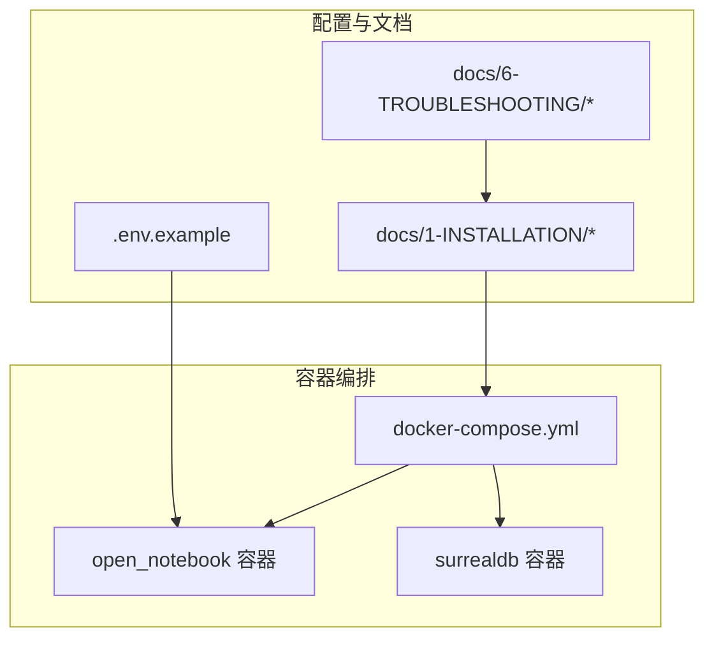
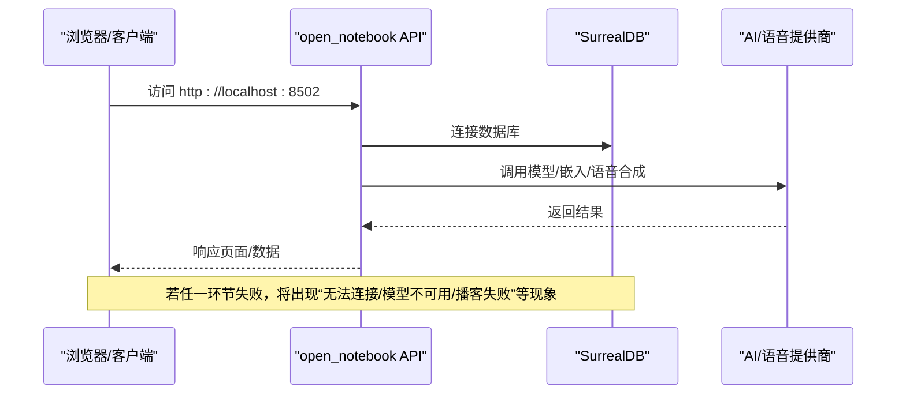
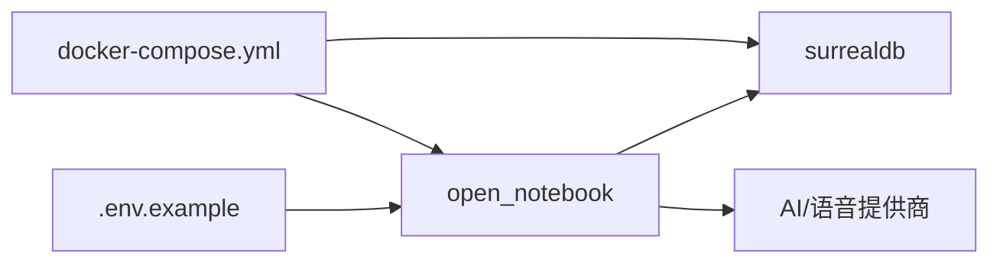

# 常见问题快速解决

<cite>
**本文引用的文件**
- [docs/6-TROUBLESHOOTING/quick-fixes.md](file://docs/6-TROUBLESHOOTING/quick-fixes.md)
- [docs/6-TROUBLESHOOTING/index.md](file://docs/6-TROUBLESHOOTING/index.md)
- [docs/6-TROUBLESHOOTING/connection-issues.md](file://docs/6-TROUBLESHOOTING/connection-issues.md)
- [docs/6-TROUBLESHOOTING/ai-chat-issues.md](file://docs/6-TROUBLESHOOTING/ai-chat-issues.md)
- [docs/1-INSTALLATION/docker-compose.md](file://docs/1-INSTALLATION/docker-compose.md)
- [docs/1-INSTALLATION/single-container.md](file://docs/1-INSTALLATION/single-container.md)
- [docker-compose.yml](file://docker-compose.yml)
- [.env.example](file://.env.example)
- [docs/5-CONFIGURATION/environment-reference.md](file://docs/5-CONFIGURATION/environment-reference.md)
- [docs/5-CONFIGURATION/security.md](file://docs/5-CONFIGURATION/security.md)
- [docs/3-USER-GUIDE/search.md](file://docs/3-USER-GUIDE/search.md)
- [docs/3-USER-GUIDE/creating-podcasts.md](file://docs/3-USER-GUIDE/creating-podcasts.md)
</cite>

## 目录
1. [简介](#简介)
2. [项目结构](#项目结构)
3. [核心组件](#核心组件)
4. [架构总览](#架构总览)
5. [详细组件分析](#详细组件分析)
6. [依赖关系分析](#依赖关系分析)
7. [性能注意事项](#性能注意事项)
8. [故障排查指南](#故障排查指南)
9. [结论](#结论)
10. [附录](#附录)

## 简介
本指南聚焦于Open Notebook在本地与容器化部署中最常见的1分钟内可解决的问题，覆盖Docker启动失败、端口冲突、权限问题、文件处理失败、搜索无结果、播客生成失败等高频场景。每个问题均提供症状描述、快速修复步骤与预防建议，帮助用户迅速定位并恢复服务。

## 项目结构
Open Notebook采用多容器架构（推荐）或单容器模式，前端通过REST API与后端交互，数据库为SurrealDB。安装与故障排查文档集中于docs目录，关键配置位于docker-compose.yml与.env.example。

图表来源
- [docker-compose.yml](file://docker-compose.yml#L1-L37)
- [docs/1-INSTALLATION/docker-compose.md](file://docs/1-INSTALLATION/docker-compose.md#L1-L357)
- [.env.example](file://.env.example#L1-L60)

章节来源
- [docs/1-INSTALLATION/docker-compose.md](file://docs/1-INSTALLATION/docker-compose.md#L1-L357)
- [docker-compose.yml](file://docker-compose.yml#L1-L37)
- [.env.example](file://.env.example#L1-L60)

## 核心组件
- 多容器部署：SurrealDB（数据库）、open_notebook（API/前端）
- 单容器部署：一体化镜像，适合平台限制或最小化部署
- 配置体系：环境变量（如OPEN_NOTEBOOK_ENCRYPTION_KEY、API_URL、SURREAL_*）与Settings UI中的凭据系统
- 故障排查：按症状映射到具体指南，提供诊断清单与一键命令

章节来源
- [docs/1-INSTALLATION/docker-compose.md](file://docs/1-INSTALLATION/docker-compose.md#L1-L357)
- [docs/1-INSTALLATION/single-container.md](file://docs/1-INSTALLATION/single-container.md#L1-L136)
- [.env.example](file://.env.example#L1-L60)

## 架构总览
下图展示典型访问路径与常见阻塞点，便于快速定位“无法连接服务器”“端口占用”“模型不可用”等问题。

图表来源
- [docs/6-TROUBLESHOOTING/connection-issues.md](file://docs/6-TROUBLESHOOTING/connection-issues.md#L1-L448)
- [docker-compose.yml](file://docker-compose.yml#L1-L37)

## 详细组件分析

### 1. Docker启动失败
- 症状
  - 启动后服务未就绪或崩溃
  - 日志显示初始化错误或资源不足
- 快速修复（1分钟）
  - 检查日志：查看API与数据库容器状态与错误
  - 重启服务：先重启，再重建
  - 检查磁盘空间与内存配额
- 预防
  - 首次启动允许下载依赖；后续启动更快
  - 在受限网络中提高下载超时与使用镜像源

章节来源
- [docs/6-TROUBLESHOOTING/quick-fixes.md](file://docs/6-TROUBLESHOOTING/quick-fixes.md#L238-L264)
- [docs/6-TROUBLESHOOTING/connection-issues.md](file://docs/6-TROUBLESHOOTING/connection-issues.md#L1-L448)
- [docs/1-INSTALLATION/docker-compose.md](file://docs/1-INSTALLATION/docker-compose.md#L238-L320)

### 2. 端口冲突
- 症状
  - “端口已被占用”（如8502/5055）
- 快速修复（1分钟）
  - 查找占用进程并终止，或修改docker-compose.yml中的端口映射
  - 重启服务并确认新端口可用
- 预防
  - 启动前检查常用端口占用情况
  - 使用不同端口组合避免冲突

章节来源
- [docs/6-TROUBLESHOOTING/quick-fixes.md](file://docs/6-TROUBLESHOOTING/quick-fixes.md#L63-L85)
- [docs/1-INSTALLATION/docker-compose.md](file://docs/1-INSTALLATION/docker-compose.md#L261-L272)

### 3. 权限问题（Linux绑定挂载）
- 症状
  - 数据库启动报权限错误（如RocksDB目录创建失败）
- 快速修复（1分钟）
  - 在docker-compose.yml中为surrealdb服务添加user: root
  - 重新构建并启动
- 预防
  - 部署前确认Docker卷权限与用户映射
  - 使用非root用户时确保目录权限正确

章节来源
- [docs/1-INSTALLATION/docker-compose.md](file://docs/1-INSTALLATION/docker-compose.md#L298-L320)

### 4. 文件处理失败（不支持格式/过大）
- 症状
  - 上传失败或提示“不支持的文件类型”
- 快速修复（1分钟）
  - 确认文件类型是否受支持（PDF/DOCX/PPTX/XLSX/音频/视频/URL）
  - 将大文件拆分或转换为支持格式后重试
- 预防
  - 严格控制文件大小与格式
  - 提前进行格式转换以减少失败率

章节来源
- [docs/6-TROUBLESHOOTING/quick-fixes.md](file://docs/6-TROUBLESHOOTING/quick-fixes.md#L89-L112)

### 5. 搜索无结果
- 症状
  - 搜索返回0条结果
- 快速修复（1分钟）
  - 切换搜索类型：关键词搜索与向量搜索互换尝试
  - 简化查询词，或改为概念性语句
  - 确认源已处理完成（绿灯状态）
- 预防
  - 使用两种搜索方式互补
  - 保持内容结构清晰、命名规范

章节来源
- [docs/6-TROUBLESHOOTING/quick-fixes.md](file://docs/6-TROUBLESHOOTING/quick-fixes.md#L175-L204)
- [docs/3-USER-GUIDE/search.md](file://docs/3-USER-GUIDE/search.md#L1-L476)

### 6. 播客生成失败
- 症状
  - 生成失败或长时间卡住
- 快速修复（1分钟）
  - 确保至少1-2个有效源且内容足够
  - 稍后再试（可能是临时API问题）
  - 检查TTS配额（OpenAI/Google/ElevenLabs等）
  - 更换TTS提供商（优先尝试Google/本地）
- 预防
  - 控制每期内容规模（3-5个源）
  - 使用稳定网络与充足配额

章节来源
- [docs/6-TROUBLESHOOTING/quick-fixes.md](file://docs/6-TROUBLESHOOTING/quick-fixes.md#L207-L234)
- [docs/3-USER-GUIDE/creating-podcasts.md](file://docs/3-USER-GUIDE/creating-podcasts.md#L472-L484)

### 7. 无法连接服务器（前端无法访问API）
- 症状
  - 浏览器提示“无法连接到服务器”或“无法到达API”
- 快速修复（1分钟）
  - 检查API健康状态（/health）
  - 确认端口映射与防火墙放通
  - 重启服务并验证各容器状态
- 预防
  - 启动后立即curl测试健康端点
  - 使用固定端口映射并避免冲突

章节来源
- [docs/6-TROUBLESHOOTING/quick-fixes.md](file://docs/6-TROUBLESHOOTING/quick-fixes.md#L7-L35)
- [docs/6-TROUBLESHOOTING/connection-issues.md](file://docs/6-TROUBLESHOOTING/connection-issues.md#L1-L448)

### 8. 模型不可用/无效API密钥
- 症状
  - 设置中“无可用模型”或“无效API密钥”
- 快速修复（1分钟）
  - 在设置中添加/测试/注册模型
  - 删除旧凭证并重新创建，确保无多余空格
  - 检查账户配额与密钥有效性
- 预防
  - 使用Settings UI管理凭据，定期轮换
  - 开启加密密钥以安全存储

章节来源
- [docs/6-TROUBLESHOOTING/quick-fixes.md](file://docs/6-TROUBLESHOOTING/quick-fixes.md#L38-L60)
- [docs/6-TROUBLESHOOTING/ai-chat-issues.md](file://docs/6-TROUBLESHOOTING/ai-chat-issues.md#L1-L443)
- [.env.example](file://.env.example#L1-L60)

### 9. 聊天响应慢/卡顿
- 症状
  - 响应时间长或超时
- 快速修复（1分钟）
  - 切换更快模型（如gpt-4o-mini/claude-3-5-haiku）
  - 减少上下文（选择更少源或摘要模式）
  - 检查系统负载并降低并发任务数
- 预防
  - 合理配置超时与并发参数
  - 使用本地模型或更快的云模型

章节来源
- [docs/6-TROUBLESHOOTING/quick-fixes.md](file://docs/6-TROUBLESHOOTING/quick-fixes.md#L115-L142)
- [docs/6-TROUBLESHOOTING/ai-chat-issues.md](file://docs/6-TROUBLESHOOTING/ai-chat-issues.md#L192-L236)
- [docs/5-CONFIGURATION/environment-reference.md](file://docs/5-CONFIGURATION/environment-reference.md#L1-L275)

### 10. 数据库连接过多/超限
- 症状
  - 报告数据库连接过多
- 快速修复（1分钟）
  - 在环境变量中降低并发任务数
  - 重启服务使变更生效
- 预防
  - 根据硬件能力调整并发上限
  - 监控数据库连接数与资源使用

章节来源
- [docs/6-TROUBLESHOOTING/quick-fixes.md](file://docs/6-TROUBLESHOOTING/quick-fixes.md#L267-L284)
- [docs/5-CONFIGURATION/environment-reference.md](file://docs/5-CONFIGURATION/environment-reference.md#L46-L51)

## 依赖关系分析
- 组件耦合
  - open_notebook依赖SurrealDB（数据库），并通过API暴露给前端
  - 模型与语音服务依赖外部提供商（OpenAI/Anthropic/Google/ElevenLabs等）
- 关键依赖链
  - docker-compose.yml定义服务与端口映射
  - .env.example提供默认配置项
  - 故障排查索引将症状映射到具体指南

图表来源
- [docker-compose.yml](file://docker-compose.yml#L1-L37)
- [.env.example](file://.env.example#L1-L60)

章节来源
- [docker-compose.yml](file://docker-compose.yml#L1-L37)
- [.env.example](file://.env.example#L1-L60)

## 性能注意事项
- 超时与并发
  - 根据部署环境调整API_CLIENT_TIMEOUT与并发任务数
  - 在受限网络中提高下载超时与使用镜像源
- 资源监控
  - 使用docker stats观察CPU/内存占用
  - 避免同时执行大量高负载操作

章节来源
- [docs/5-CONFIGURATION/environment-reference.md](file://docs/5-CONFIGURATION/environment-reference.md#L54-L61)
- [docs/6-TROUBLESHOOTING/quick-fixes.md](file://docs/6-TROUBLESHOOTING/quick-fixes.md#L287-L316)

## 故障排查指南

### 快速诊断清单（1分钟）
- 重启服务并查看日志
- 测试API健康端点
- 检查端口映射与防火墙
- 核对环境变量（尤其是加密密钥与API_URL）

章节来源
- [docs/6-TROUBLESHOOTING/quick-fixes.md](file://docs/6-TROUBLESHOOTING/quick-fixes.md#L319-L330)
- [docs/6-TROUBLESHOOTING/index.md](file://docs/6-TROUBLESHOOTING/index.md#L128-L140)

### 问题症状与对应指南
- 无法连接服务器 → 参考“连接问题”指南
- 端口被占用 → 修改映射或释放端口
- 权限错误（Linux）→ 添加user: root或修正卷权限
- 文件不支持/过大 → 转换格式或拆分文件
- 搜索无结果 → 切换搜索类型与简化查询
- 播客生成失败 → 检查源数量/配额/更换TTS提供商
- 模型不可用/密钥无效 → 重新添加/测试/注册模型
- 聊天慢/超时 → 切换更快模型/减少上下文/降低并发
- 数据库连接过多 → 降低并发任务数

章节来源
- [docs/6-TROUBLESHOOTING/index.md](file://docs/6-TROUBLESHOOTING/index.md#L23-L126)
- [docs/6-TROUBLESHOOTING/connection-issues.md](file://docs/6-TROUBLESHOOTING/connection-issues.md#L1-L448)
- [docs/6-TROUBLESHOOTING/ai-chat-issues.md](file://docs/6-TROUBLESHOOTING/ai-chat-issues.md#L1-L443)

## 结论
通过本快速解决指南，用户可在1分钟内定位并修复Open Notebook最常见的运行问题。建议在日常使用中：
- 启动后立即验证API健康状态
- 使用Settings UI管理凭据与模型
- 合理配置超时与并发参数
- 定期备份数据与日志
- 遇到复杂问题时参考完整故障排查索引与FAQ

## 附录

### 常用命令速查
- 启动/停止/重启
  - docker compose up -d
  - docker compose down
  - docker compose restart
- 查看状态与日志
  - docker compose ps
  - docker compose logs -f
- 健康检查
  - curl http://localhost:5055/health
- 端口与网络
  - lsof -i :8502/:5055
  - netstat -tlnp | grep -E "8502|5055|8000"

章节来源
- [docs/1-INSTALLATION/docker-compose.md](file://docs/1-INSTALLATION/docker-compose.md#L203-L230)
- [docs/6-TROUBLESHOOTING/connection-issues.md](file://docs/6-TROUBLESHOOTING/connection-issues.md#L357-L381)