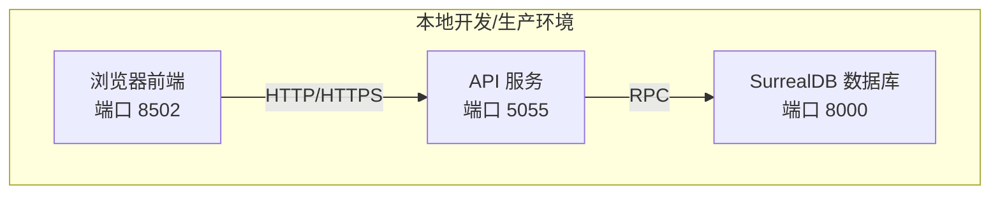
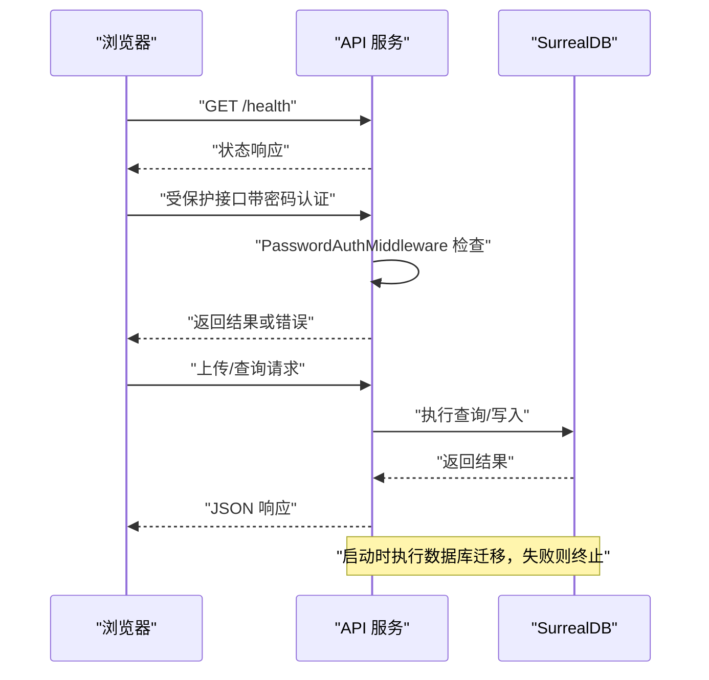
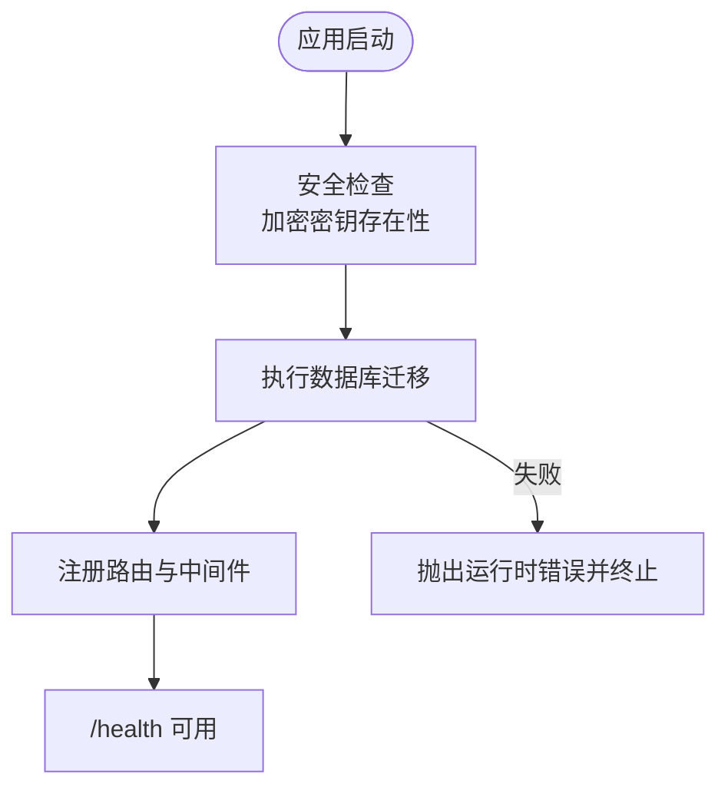
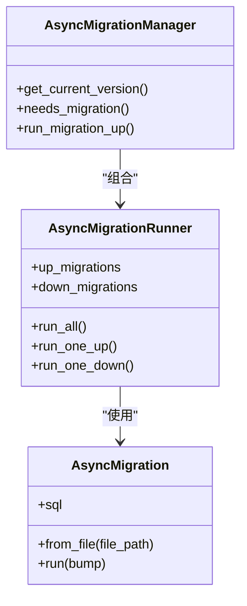
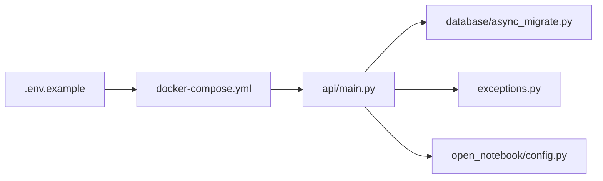

# 故障排除

<cite>
**本文引用的文件**
- [docs/6-TROUBLESHOOTING/index.md](file://docs/6-TROUBLESHOOTING/index.md)
- [docs/6-TROUBLESHOOTING/quick-fixes.md](file://docs/6-TROUBLESHOOTING/quick-fixes.md)
- [docs/6-TROUBLESHOOTING/connection-issues.md](file://docs/6-TROUBLESHOOTING/connection-issues.md)
- [docs/6-TROUBLESHOOTING/ai-chat-issues.md](file://docs/6-TROUBLESHOOTING/ai-chat-issues.md)
- [docs/6-TROUBLESHOOTING/faq.md](file://docs/6-TROUBLESHOOTING/faq.md)
- [api/main.py](file://api/main.py)
- [.env.example](file://.env.example)
- [docker-compose.yml](file://docker-compose.yml)
- [open_notebook/exceptions.py](file://open_notebook/exceptions.py)
- [open_notebook/database/async_migrate.py](file://open_notebook/database/async_migrate.py)
- [open_notebook/config.py](file://open_notebook/config.py)
</cite>

## 目录
1. [简介](#简介)
2. [项目结构](#项目结构)
3. [核心组件](#核心组件)
4. [架构总览](#架构总览)
5. [详细组件分析](#详细组件分析)
6. [依赖关系分析](#依赖关系分析)
7. [性能考虑](#性能考虑)
8. [故障排除指南](#故障排除指南)
9. [结论](#结论)
10. [附录](#附录)

## 简介
本指南面向使用 Open Notebook 的用户与运维人员，提供系统化的故障诊断流程、常见问题与解决方案、日志分析技巧、错误信息解读、快速修复与预防措施，并建立问题分类体系，帮助快速定位与解决安装部署、AI 连接、数据库连接、性能等各类问题。同时给出社区支持渠道与获取帮助的路径。

## 项目结构
Open Notebook 采用前后端分离的容器化部署方式：前端 UI 通过浏览器访问，后端 API 提供 REST 接口，数据库使用 SurrealDB。核心服务通过 docker-compose 编排，环境变量集中于 .env 文件，API 启动时自动执行数据库迁移。

图表来源
- [docker-compose.yml](file://docker-compose.yml#L1-L37)
- [api/main.py](file://api/main.py#L182-L190)

章节来源
- [docker-compose.yml](file://docker-compose.yml#L1-L37)
- [.env.example](file://.env.example#L1-L60)

## 核心组件
- API 服务（FastAPI）：负责路由注册、中间件（认证、CORS）、健康检查、异常处理与数据库迁移。
- 数据库（SurrealDB）：持久化存储笔记、源数据、嵌入向量等。
- 前端（Next.js）：用户界面，通过 /api 访问后端。
- 配置与环境：.env.example 提供默认配置项；docker-compose.yml 定义服务与端口映射。
- 异常体系：统一的异常类型定义，便于日志与错误处理。
- 数据库迁移：启动时自动执行版本迁移，失败则阻止 API 启动。

章节来源
- [api/main.py](file://api/main.py#L47-L97)
- [open_notebook/exceptions.py](file://open_notebook/exceptions.py#L1-L71)
- [open_notebook/database/async_migrate.py](file://open_notebook/database/async_migrate.py#L91-L189)
- [.env.example](file://.env.example#L1-L60)

## 架构总览
下图展示从浏览器到 API 再到数据库的关键交互路径，以及常见故障点（网络、认证、CORS、数据库迁移）：

图表来源
- [api/main.py](file://api/main.py#L105-L127)
- [api/main.py](file://api/main.py#L187-L190)
- [open_notebook/database/async_migrate.py](file://open_notebook/database/async_migrate.py#L66-L89)

## 详细组件分析

### API 服务与健康检查
- 负责在启动时进行安全检查（如加密密钥）、执行数据库迁移、注册中间件与路由。
- 提供 /health 健康检查端点，用于快速判断 API 是否可用。
- 自定义异常处理器确保错误响应包含 CORS 头，尤其对上传类 413 错误有效。

图表来源
- [api/main.py](file://api/main.py#L47-L97)
- [api/main.py](file://api/main.py#L187-L190)
- [open_notebook/database/async_migrate.py](file://open_notebook/database/async_migrate.py#L174-L188)

章节来源
- [api/main.py](file://api/main.py#L47-L97)
- [api/main.py](file://api/main.py#L187-L190)
- [open_notebook/database/async_migrate.py](file://open_notebook/database/async_migrate.py#L174-L188)

### 数据库迁移与版本管理
- 迁移系统基于异步实现，按序执行 up/down 迁移脚本。
- 启动阶段若检测到需要迁移，则自动执行；失败会记录错误并阻止 API 启动。
- 版本表记录当前版本，便于回滚与追踪。

图表来源
- [open_notebook/database/async_migrate.py](file://open_notebook/database/async_migrate.py#L13-L163)

章节来源
- [open_notebook/database/async_migrate.py](file://open_notebook/database/async_migrate.py#L91-L189)

### 配置与环境变量
- .env.example 提供示例配置，包括数据库连接、可选的 AI 提供商密钥、外部 API URL、Ollama 端点、内容处理参数、基本认证等。
- docker-compose.yml 明确了服务端口映射（UI 8502、API 5055、数据库 8000），并挂载数据目录。

章节来源
- [.env.example](file://.env.example#L1-L60)
- [docker-compose.yml](file://docker-compose.yml#L1-L37)

### 异常体系与错误分类
- 统一的异常基类与细分类型（数据库操作、不支持类型、无效输入、未找到、认证、配置、外部服务、速率限制、文件操作、网络、无字幕等），便于日志分级与 UI 展示。

章节来源
- [open_notebook/exceptions.py](file://open_notebook/exceptions.py#L1-L71)

## 依赖关系分析
- API 服务依赖数据库迁移模块完成启动前校验；迁移失败直接导致 API 启动失败。
- 前端通过 /api 访问后端，需遵循 CORS 配置与认证中间件。
- 环境变量影响数据库连接、模型发现、超时与并发控制等。

图表来源
- [.env.example](file://.env.example#L1-L60)
- [docker-compose.yml](file://docker-compose.yml#L1-L37)
- [api/main.py](file://api/main.py#L1-L190)
- [open_notebook/database/async_migrate.py](file://open_notebook/database/async_migrate.py#L1-L229)
- [open_notebook/exceptions.py](file://open_notebook/exceptions.py#L1-L71)
- [open_notebook/config.py](file://open_notebook/config.py#L1-L18)

章节来源
- [api/main.py](file://api/main.py#L1-L190)
- [open_notebook/database/async_migrate.py](file://open_notebook/database/async_migrate.py#L1-L229)

## 性能考虑
- 并发与超时：通过环境变量控制最大任务数与客户端超时，缓解慢模型或高负载带来的卡顿。
- 模型选择：优先使用更快更小的模型进行日常任务，复杂推理再切换更强模型。
- 资源监控：使用容器统计命令观察 CPU/内存占用，避免过载。

章节来源
- [docs/6-TROUBLESHOOTING/quick-fixes.md](file://docs/6-TROUBLESHOOTING/quick-fixes.md#L210-L217)
- [docs/6-TROUBLESHOOTING/ai-chat-issues.md](file://docs/6-TROUBLESHOOTING/ai-chat-issues.md#L218-L235)

## 故障排除指南

### 问题分类与快速定位
- 安装部署问题：容器无法启动、端口冲突、权限不足、镜像拉取缓慢。
- 连接问题：前端无法访问 API、跨域错误、反向代理 502、证书验证失败、远程访问不可达。
- AI/聊天问题：模型不可用、无效密钥、响应质量差、超时、上下文长度超限、速率限制、成本过高。
- 数据库问题：连接失败、连接过多、迁移失败、数据丢失风险。
- 性能问题：启动慢、处理超时、UI 卡顿、资源占用高。

章节来源
- [docs/6-TROUBLESHOOTING/index.md](file://docs/6-TROUBLESHOOTING/index.md#L23-L126)

### 通用诊断流程
- 检查服务状态：确认各容器是否运行。
- 查看日志：定位具体错误堆栈与时间点。
- 验证端口与连通性：使用健康检查端点与网络工具测试。
- 校验配置：核对 API_URL、密钥、超时与并发设置。
- 重启与重建：必要时重启或重建容器。
- 防护措施：定期备份、监控日志、保持更新。

章节来源
- [docs/6-TROUBLESHOOTING/index.md](file://docs/6-TROUBLESHOOTING/index.md#L128-L139)
- [docs/6-TROUBLESHOOTING/quick-fixes.md](file://docs/6-TROUBLESHOOTING/quick-fixes.md#L319-L331)

### 安装部署问题
- 容器无法启动或 Docker 报错
  - 步骤：查看日志、尝试重启、重建镜像、检查磁盘空间与内存配额。
  - 关键点：首次启动可能因下载依赖较慢，适当增加超时。
- 端口被占用
  - 步骤：查找占用进程并释放，或修改 docker-compose 中的端口映射。
- 权限不足
  - 步骤：检查宿主机文件权限与 SELinux/AppArmor 设置，必要时调整卷权限。
- 中国/慢网环境依赖下载失败
  - 步骤：提高下载超时、使用国内镜像源，等待首次构建完成。

章节来源
- [docs/6-TROUBLESHOOTING/quick-fixes.md](file://docs/6-TROUBLESHOOTING/quick-fixes.md#L238-L263)
- [docs/6-TROUBLESHOOTING/quick-fixes.md](file://docs/6-TROUBLESHOOTING/quick-fixes.md#L287-L316)

### 连接问题（前端无法访问 API）
- “无法连接到服务器”或“连接被拒绝”
  - 步骤：确认 API 服务运行、端口映射正确、防火墙放行、API_URL 与前端一致。
- CORS 错误
  - 步骤：确保前端与 API 的协议与域名匹配，必要时在反向代理中添加 CORS 头。
- 反向代理 502
  - 步骤：先验证后端 /health 可达，再检查代理路径与端口转发。
- 证书验证失败（HTTPS）
  - 步骤：使用自定义 CA 包或仅在可信网络使用 HTTP。
- 远程访问不可达
  - 步骤：获取服务器 IP、开放端口、在 .env 中设置 API_URL、测试连通性。

章节来源
- [docs/6-TROUBLESHOOTING/connection-issues.md](file://docs/6-TROUBLESHOOTING/connection-issues.md#L7-L95)
- [docs/6-TROUBLESHOOTING/connection-issues.md](file://docs/6-TROUBLESHOOTING/connection-issues.md#L180-L222)
- [docs/6-TROUBLESHOOTING/connection-issues.md](file://docs/6-TROUBLESHOOTING/connection-issues.md#L324-L354)
- [docs/6-TROUBLESHOOTING/connection-issues.md](file://docs/6-TROUBLESHOOTING/connection-issues.md#L396-L436)

### AI/聊天问题
- 模型不可用或“未找到模型”
  - 步骤：在设置中添加/测试凭据、发现并注册模型、核对模型名称（尤其是本地模型）。
- 无效 API 密钥或未授权
  - 步骤：重新生成密钥、删除旧凭据、更新并测试连接。
- 响应质量差/泛泛而谈
  - 步骤：确保相关源在上下文中、提出更具体的问题、使用更强模型、开启引用要求。
- 聊天非常慢
  - 步骤：切换更快模型、减少上下文、增加超时、降低并发、检查系统负载。
- 上下文长度超限/令牌超限
  - 步骤：选择长上下文模型、减少上下文、拆分大文档。
- 速率限制/配额耗尽
  - 步骤：等待额度恢复、切换提供商、使用本地模型、降低并发。
- 成本过高
  - 步骤：选用更便宜模型、减少上下文、使用本地模型、优化查询策略。
- 数据库连接过多
  - 步骤：降低并发任务数以提升稳定性。

章节来源
- [docs/6-TROUBLESHOOTING/ai-chat-issues.md](file://docs/6-TROUBLESHOOTING/ai-chat-issues.md#L7-L58)
- [docs/6-TROUBLESHOOTING/ai-chat-issues.md](file://docs/6-TROUBLESHOOTING/ai-chat-issues.md#L62-L97)
- [docs/6-TROUBLESHOOTING/ai-chat-issues.md](file://docs/6-TROUBLESHOOTING/ai-chat-issues.md#L144-L189)
- [docs/6-TROUBLESHOOTING/ai-chat-issues.md](file://docs/6-TROUBLESHOOTING/ai-chat-issues.md#L192-L236)
- [docs/6-TROUBLESHOOTING/ai-chat-issues.md](file://docs/6-TROUBLESHOOTING/ai-chat-issues.md#L295-L324)
- [docs/6-TROUBLESHOOTING/ai-chat-issues.md](file://docs/6-TROUBLESHOOTING/ai-chat-issues.md#L327-L365)
- [docs/6-TROUBLESHOOTING/ai-chat-issues.md](file://docs/6-TROUBLESHOOTING/ai-chat-issues.md#L368-L396)
- [docs/6-TROUBLESHOOTING/ai-chat-issues.md](file://docs/6-TROUBLESHOOTING/ai-chat-issues.md#L399-L434)
- [docs/6-TROUBLESHOOTING/quick-fixes.md](file://docs/6-TROUBLESHOOTING/quick-fixes.md#L267-L283)

### 数据库问题
- 无法连接数据库
  - 步骤：检查数据库服务状态、网络连通、凭据与命名空间/数据库名。
- 数据库连接过多
  - 步骤：降低并发任务数，避免瞬时高负载。
- 迁移失败
  - 步骤：查看迁移日志、确认数据库可写、重试或回退迁移。
- 数据丢失风险
  - 步骤：定期备份数据与数据库文件，妥善保存密钥。

章节来源
- [docs/6-TROUBLESHOOTING/connection-issues.md](file://docs/6-TROUBLESHOOTING/connection-issues.md#L108-L131)
- [docs/6-TROUBLESHOOTING/quick-fixes.md](file://docs/6-TROUBLESHOOTING/quick-fixes.md#L267-L283)
- [open_notebook/database/async_migrate.py](file://open_notebook/database/async_migrate.py#L174-L188)
- [docs/6-TROUBLESHOOTING/faq.md](file://docs/6-TROUBLESHOOTING/faq.md#L108-L116)

### 性能问题
- 启动慢/下载超时（中国/慢网）
  - 步骤：提高下载超时、使用镜像源、等待首次构建完成。
- 处理超时/响应慢
  - 步骤：降低并发、增加超时、切换更快模型、减少上下文。
- UI 卡顿/资源占用高
  - 步骤：监控容器资源、关闭不必要的任务、升级硬件。

章节来源
- [docs/6-TROUBLESHOOTING/quick-fixes.md](file://docs/6-TROUBLESHOOTING/quick-fixes.md#L287-L316)
- [docs/6-TROUBLESHOOTING/quick-fixes.md](file://docs/6-TROUBLESHOOTING/quick-fixes.md#L210-L217)
- [docs/6-TROUBLESHOOTING/ai-chat-issues.md](file://docs/6-TROUBLESHOOTING/ai-chat-issues.md#L218-L235)

### 日志分析与错误解读
- 常用命令
  - 查看所有服务日志、API 日志、特定容器日志。
  - 使用健康检查端点快速判断 API 可用性。
- 关注点
  - 启动阶段的迁移错误（阻止 API 启动）。
  - 上传类 413 错误与 CORS 头缺失。
  - 数据库连接与并发相关的报错。
  - 模型发现与调用失败的提示。
- 建议
  - 将日志输出级别设为调试以便定位。
  - 结合环境变量与配置文件逐项比对。

章节来源
- [api/main.py](file://api/main.py#L130-L154)
- [open_notebook/database/async_migrate.py](file://open_notebook/database/async_migrate.py#L84-L88)
- [docs/6-TROUBLESHOOTING/index.md](file://docs/6-TROUBLESHOOTING/index.md#L128-L139)

### 快速修复清单
- 重启服务、查看日志、验证健康检查、检查 .env 配置、监控资源、清理缓存、必要时重建。
- 最后手段：完全重置（含数据卷）或恢复默认配置后重新配置。

章节来源
- [docs/6-TROUBLESHOOTING/quick-fixes.md](file://docs/6-TROUBLESHOOTING/quick-fixes.md#L319-L353)

### 社区支持与求助
- 先读指南、查 FAQ、搜索 Discord 与 GitHub Issues。
- 报告问题时附上：错误信息、复现步骤、日志、环境信息、已尝试的修复。

章节来源
- [docs/6-TROUBLESHOOTING/index.md](file://docs/6-TROUBLESHOOTING/index.md#L142-L161)
- [docs/6-TROUBLESHOOTING/faq.md](file://docs/6-TROUBLESHOOTING/faq.md#L226-L251)

## 结论
通过建立问题分类体系、标准化诊断流程与修复步骤，结合日志分析与配置校验，大多数安装部署、连接、AI/聊天与性能问题均可快速定位与解决。建议在变更配置或升级后进行回归测试，并定期备份数据与监控日志，以降低风险并提升稳定性。

## 附录

### 常见症状与对应指南入口
- 安装部署：参见“快速修复”中的常见问题与端口/权限/网络问题。
- 连接问题：参见“连接问题”指南，覆盖 CORS、反向代理、证书、远程访问。
- AI/聊天：参见“AI 与聊天问题”，覆盖模型、密钥、响应质量、超时、成本。
- 数据库：参见“连接问题”与“快速修复”，覆盖连接、并发、迁移。
- 性能：参见“快速修复”与“AI 与聊天问题”的性能优化建议。

章节来源
- [docs/6-TROUBLESHOOTING/index.md](file://docs/6-TROUBLESHOOTING/index.md#L23-L126)