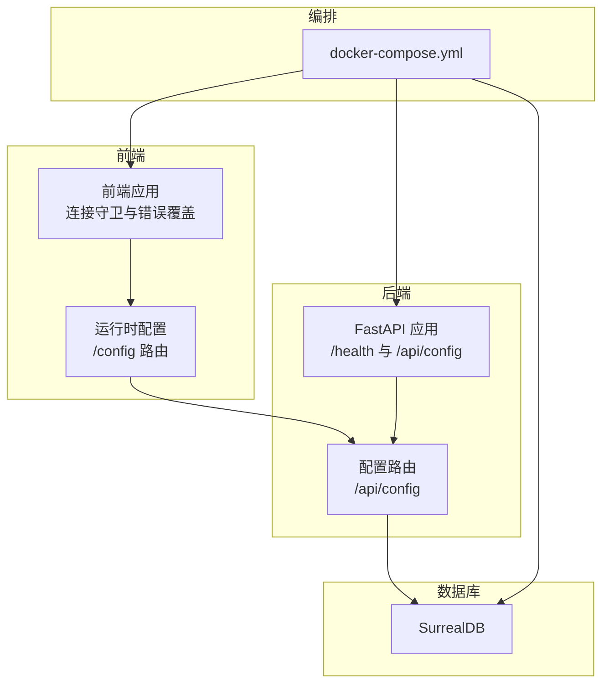
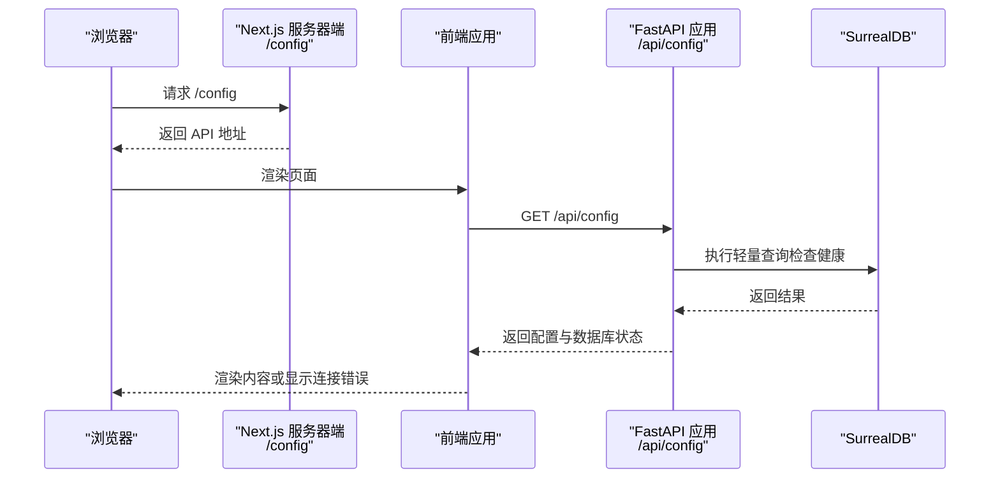
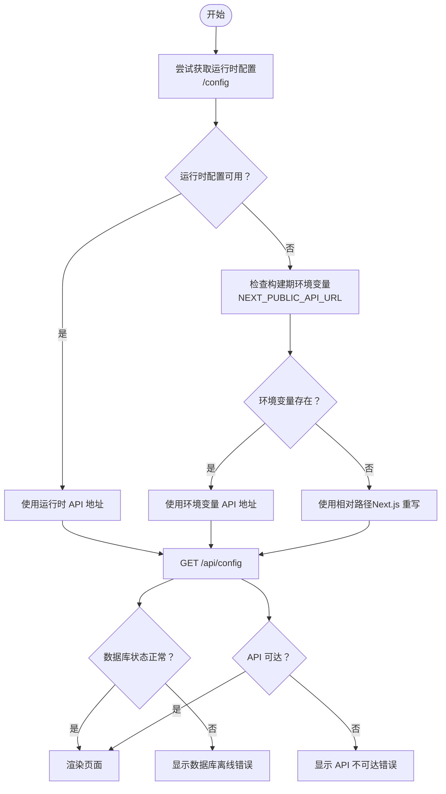
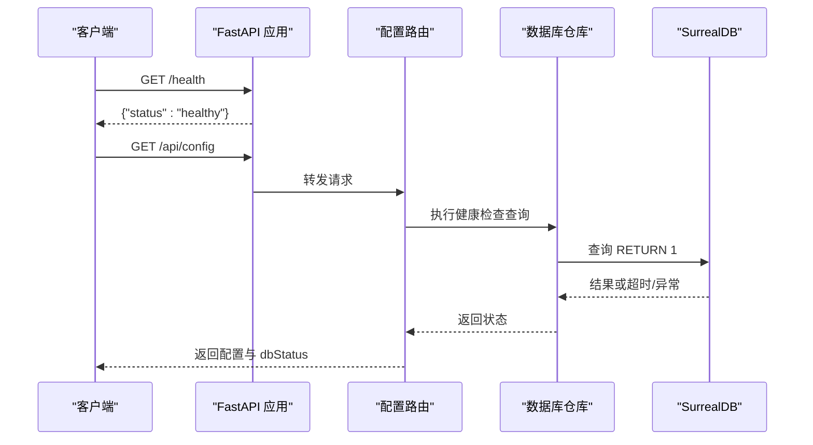
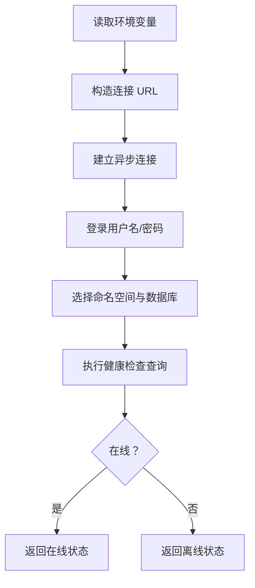
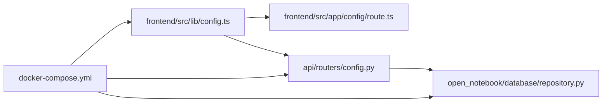

# 连接问题排查

<cite>
**本文引用的文件**
- [docs/6-TROUBLESHOOTING/connection-issues.md](file://docs/6-TROUBLESHOOTING/connection-issues.md)
- [frontend/src/lib/config.ts](file://frontend/src/lib/config.ts)
- [frontend/src/app/config/route.ts](file://frontend/src/app/config/route.ts)
- [frontend/src/components/common/ConnectionGuard.tsx](file://frontend/src/components/common/ConnectionGuard.tsx)
- [frontend/src/components/errors/ConnectionErrorOverlay.tsx](file://frontend/src/components/errors/ConnectionErrorOverlay.tsx)
- [api/main.py](file://api/main.py)
- [api/routers/config.py](file://api/routers/config.py)
- [open_notebook/database/repository.py](file://open_notebook/database/repository.py)
- [docker-compose.yml](file://docker-compose.yml)
- [examples/docker-compose-full-local.yml](file://examples/docker-compose-full-local.yml)
- [.env.example](file://.env.example)
- [docs/5-CONFIGURATION/environment-reference.md](file://docs/5-CONFIGURATION/environment-reference.md)
- [docs/5-CONFIGURATION/database.md](file://docs/5-CONFIGURATION/database.md)
- [docs/5-CONFIGURATION/reverse-proxy.md](file://docs/5-CONFIGURATION/reverse-proxy.md)
</cite>

## 目录
1. [简介](#简介)
2. [项目结构](#项目结构)
3. [核心组件](#核心组件)
4. [架构总览](#架构总览)
5. [详细组件分析](#详细组件分析)
6. [依赖关系分析](#依赖关系分析)
7. [性能考量](#性能考量)
8. [故障排查指南](#故障排查指南)
9. [结论](#结论)
10. [附录](#附录)

## 简介
本指南聚焦于 Open Notebook 的连接问题排查，覆盖前端无法连接 API、数据库连接失败、网络与代理配置异常等常见场景。文档提供系统化诊断流程（服务状态、端口验证、防火墙、代理设置）、具体网络测试命令与配置验证方法，并给出 Docker 容器网络、本地开发与生产部署等多环境的解决方案。

## 项目结构
Open Notebook 采用前后端分离架构：前端为 Next.js 应用，通过运行时配置自动推断 API 地址；后端为 FastAPI 应用，提供健康检查与配置接口；数据库使用 SurrealDB，通过环境变量进行连接配置。Compose 文件定义了服务间的网络映射与端口暴露。

图表来源
- [docker-compose.yml](file://docker-compose.yml#L1-L37)
- [frontend/src/app/config/route.ts](file://frontend/src/app/config/route.ts#L1-L68)
- [api/main.py](file://api/main.py#L182-L190)
- [api/routers/config.py](file://api/routers/config.py#L123-L161)
- [open_notebook/database/repository.py](file://open_notebook/database/repository.py#L12-L27)

章节来源
- [docker-compose.yml](file://docker-compose.yml#L1-L37)
- [frontend/src/app/config/route.ts](file://frontend/src/app/config/route.ts#L1-L68)
- [api/main.py](file://api/main.py#L182-L190)
- [api/routers/config.py](file://api/routers/config.py#L123-L161)
- [open_notebook/database/repository.py](file://open_notebook/database/repository.py#L12-L27)

## 核心组件
- 前端运行时配置：优先从服务器端 /config 获取 API 地址，其次使用构建期环境变量，最后采用相对路径（通过 Next.js 重写）以避免跨域与端口复杂性。
- 后端健康与配置：提供 /health 快速探测与 /api/config 返回版本信息与数据库健康状态。
- 数据库连接：通过环境变量读取 SurrealDB 连接参数，统一在连接上下文中完成登录与命名空间选择。
- 连接守卫与错误覆盖：在页面渲染前进行连接检测，区分“API 不可达”与“数据库离线”，并提供重试与技术细节展示。

章节来源
- [frontend/src/lib/config.ts](file://frontend/src/lib/config.ts#L14-L149)
- [frontend/src/app/config/route.ts](file://frontend/src/app/config/route.ts#L1-L68)
- [frontend/src/components/common/ConnectionGuard.tsx](file://frontend/src/components/common/ConnectionGuard.tsx#L1-L109)
- [frontend/src/components/errors/ConnectionErrorOverlay.tsx](file://frontend/src/components/errors/ConnectionErrorOverlay.tsx#L1-L176)
- [api/main.py](file://api/main.py#L182-L190)
- [api/routers/config.py](file://api/routers/config.py#L123-L161)
- [open_notebook/database/repository.py](file://open_notebook/database/repository.py#L12-L27)

## 架构总览
下图展示了连接相关的端到端交互：浏览器发起请求，Next.js 服务器端 /config 提供 API 地址，前端再向 /api/config 拉取配置并检查数据库健康状态；后端通过数据库仓库层执行轻量查询以判断数据库连通性。

图表来源
- [frontend/src/app/config/route.ts](file://frontend/src/app/config/route.ts#L25-L68)
- [frontend/src/lib/config.ts](file://frontend/src/lib/config.ts#L59-L140)
- [api/routers/config.py](file://api/routers/config.py#L102-L161)
- [open_notebook/database/repository.py](file://open_notebook/database/repository.py#L65-L83)

## 详细组件分析

### 前端配置与运行时检测
- 配置优先级：运行时配置（/config） > 构建期环境变量（NEXT_PUBLIC_API_URL） > 相对路径（通过 Next.js 重写）。
- 自动检测：若未显式设置 API_URL，服务器端会根据请求头（含反向代理头）自动推断协议与主机，拼接默认 API 端口。
- 错误处理：连接守卫在首次渲染前尝试获取配置，若数据库离线或 API 不可达，分别提示相应错误并允许重试。

图表来源
- [frontend/src/lib/config.ts](file://frontend/src/lib/config.ts#L59-L140)
- [frontend/src/app/config/route.ts](file://frontend/src/app/config/route.ts#L25-L68)
- [frontend/src/components/common/ConnectionGuard.tsx](file://frontend/src/components/common/ConnectionGuard.tsx#L18-L81)
- [api/routers/config.py](file://api/routers/config.py#L148-L161)

章节来源
- [frontend/src/lib/config.ts](file://frontend/src/lib/config.ts#L14-L149)
- [frontend/src/app/config/route.ts](file://frontend/src/app/config/route.ts#L1-L68)
- [frontend/src/components/common/ConnectionGuard.tsx](file://frontend/src/components/common/ConnectionGuard.tsx#L1-L109)
- [frontend/src/components/errors/ConnectionErrorOverlay.tsx](file://frontend/src/components/errors/ConnectionErrorOverlay.tsx#L1-L176)

### 后端健康与配置
- /health：快速返回服务健康状态，用于初步连通性测试。
- /api/config：返回版本信息与数据库健康状态；数据库健康检查通过一次轻量查询实现，超时或异常即判定为离线。
- CORS 与异常处理：全局中间件确保错误响应包含 CORS 头，便于前端识别与展示。

图表来源
- [api/main.py](file://api/main.py#L182-L190)
- [api/routers/config.py](file://api/routers/config.py#L102-L161)
- [open_notebook/database/repository.py](file://open_notebook/database/repository.py#L102-L121)

章节来源
- [api/main.py](file://api/main.py#L182-L190)
- [api/routers/config.py](file://api/routers/config.py#L102-L161)
- [open_notebook/database/repository.py](file://open_notebook/database/repository.py#L102-L121)

### 数据库连接与环境变量
- 连接参数：SURREAL_URL、SURREAL_USER、SURREAL_PASSWORD、SURREAL_NAMESPACE、SURREAL_DATABASE。
- 兼容性：支持新旧格式的地址解析；连接上下文内完成登录与命名空间选择。
- 健康检查：通过超时控制的轻量查询判断数据库可达性。

图表来源
- [open_notebook/database/repository.py](file://open_notebook/database/repository.py#L12-L27)
- [open_notebook/database/repository.py](file://open_notebook/database/repository.py#L47-L63)
- [open_notebook/database/repository.py](file://open_notebook/database/repository.py#L102-L121)

章节来源
- [open_notebook/database/repository.py](file://open_notebook/database/repository.py#L12-L27)
- [open_notebook/database/repository.py](file://open_notebook/database/repository.py#L47-L63)
- [open_notebook/database/repository.py](file://open_notebook/database/repository.py#L102-L121)
- [docs/5-CONFIGURATION/database.md](file://docs/5-CONFIGURATION/database.md#L1-L51)

## 依赖关系分析
- 前端配置依赖 Next.js 服务器端 /config 路由提供的 API 地址，随后调用 /api/config 获取配置与数据库状态。
- 后端配置路由依赖数据库仓库层进行健康检查。
- 编排层面，docker-compose 将前端与 API 的端口映射到宿主，SurrealDB 暴露 RPC 端口。

图表来源
- [frontend/src/lib/config.ts](file://frontend/src/lib/config.ts#L59-L140)
- [frontend/src/app/config/route.ts](file://frontend/src/app/config/route.ts#L25-L68)
- [api/routers/config.py](file://api/routers/config.py#L102-L161)
- [open_notebook/database/repository.py](file://open_notebook/database/repository.py#L12-L27)
- [docker-compose.yml](file://docker-compose.yml#L1-L37)

章节来源
- [frontend/src/lib/config.ts](file://frontend/src/lib/config.ts#L14-L149)
- [frontend/src/app/config/route.ts](file://frontend/src/app/config/route.ts#L1-L68)
- [api/routers/config.py](file://api/routers/config.py#L102-L161)
- [open_notebook/database/repository.py](file://open_notebook/database/repository.py#L12-L27)
- [docker-compose.yml](file://docker-compose.yml#L1-L37)

## 性能考量
- API 超时与慢请求：可通过调整 API 客户端超时与并发任务数缓解。
- 数据库并发：合理设置最大并发任务数，避免高负载导致超时。
- 网络延迟：在远程访问或反向代理场景中，关注链路延迟与代理超时配置。

章节来源
- [docs/5-CONFIGURATION/environment-reference.md](file://docs/5-CONFIGURATION/environment-reference.md#L54-L61)
- [docs/5-CONFIGURATION/environment-reference.md](file://docs/5-CONFIGURATION/environment-reference.md#L46-L52)
- [docs/5-CONFIGURATION/reverse-proxy.md](file://docs/5-CONFIGURATION/reverse-proxy.md#L579-L589)

## 故障排查指南

### 通用诊断清单
- 服务是否运行：检查容器/进程状态，确认前端与 API 均处于“Up”状态。
- 端口监听：验证 API 端口（默认 5055）与数据库端口（默认 8000）是否被监听。
- API 响应：直接访问 /health 与 /api/config，确认返回预期内容。
- 前端可访问：确认前端端口（默认 8502）可从浏览器访问。
- 网络连通：使用 ping 与 telnet 测试目标主机与端口连通性。
- 防火墙策略：检查系统与网络防火墙规则，确保所需端口放行。

章节来源
- [docs/6-TROUBLESHOOTING/connection-issues.md](file://docs/6-TROUBLESHOOTING/connection-issues.md#L357-L381)

### 前端无法连接 API
- 运行时配置优先级：确认 /config 是否成功返回 API 地址；若失败，检查构建期环境变量 NEXT_PUBLIC_API_URL 或改为相对路径。
- 反向代理与重写：在 Next.js 中使用重写可避免跨域与端口复杂性。
- 错误覆盖与重试：连接守卫会在不可达时显示错误覆盖，支持键盘快捷键重试。

章节来源
- [frontend/src/lib/config.ts](file://frontend/src/lib/config.ts#L14-L149)
- [frontend/src/app/config/route.ts](file://frontend/src/app/config/route.ts#L1-L68)
- [frontend/src/components/common/ConnectionGuard.tsx](file://frontend/src/components/common/ConnectionGuard.tsx#L1-L109)
- [frontend/src/components/errors/ConnectionErrorOverlay.tsx](file://frontend/src/components/errors/ConnectionErrorOverlay.tsx#L1-L176)

### API 不可达（连接被拒绝）
- 端口监听：使用 lsof/netstat 检查 5055 是否监听。
- 日志定位：查看 API 容器日志，寻找崩溃或启动失败信息。
- 重启与验证：重启 API 服务并再次检查日志中的错误。

章节来源
- [docs/6-TROUBLESHOOTING/connection-issues.md](file://docs/6-TROUBLESHOOTING/connection-issues.md#L98-L131)

### 超时与慢连接
- 资源占用：使用 docker stats 观察 CPU/内存占用。
- 慢操作排查：在日志中搜索慢操作或超时关键字。
- 调整参数：降低并发任务数、增加 API 客户端超时时间。

章节来源
- [docs/6-TROUBLESHOOTING/connection-issues.md](file://docs/6-TROUBLESHOOTING/connection-issues.md#L134-L177)
- [docs/5-CONFIGURATION/environment-reference.md](file://docs/5-CONFIGURATION/environment-reference.md#L46-L52)
- [docs/5-CONFIGURATION/environment-reference.md](file://docs/5-CONFIGURATION/environment-reference.md#L54-L61)

### 502 网关错误（反向代理）
- 后端可达性：从反向代理服务器直接访问 API /health，确认后端正常。
- 代理配置：确保 location /api 的 proxy_pass 正确指向 API 路径。
- HTTPS 与证书：如使用 HTTPS，确保 API_URL 与证书配置正确。

章节来源
- [docs/6-TROUBLESHOOTING/connection-issues.md](file://docs/6-TROUBLESHOOTING/connection-issues.md#L180-L222)
- [docs/5-CONFIGURATION/reverse-proxy.md](file://docs/5-CONFIGURATION/reverse-proxy.md#L579-L589)

### 间歇性断开
- 重试机制：启用数据库重试、设置最大重试次数与等待策略。
- 并发控制：降低并发任务数，减少资源争用。
- 网络稳定性：使用长周期 ping 检测丢包率。

章节来源
- [docs/6-TROUBLESHOOTING/connection-issues.md](file://docs/6-TROUBLESHOOTING/connection-issues.md#L225-L265)
- [docs/5-CONFIGURATION/environment-reference.md](file://docs/5-CONFIGURATION/environment-reference.md#L34-L43)
- [docs/5-CONFIGURATION/environment-reference.md](file://docs/5-CONFIGURATION/environment-reference.md#L46-L52)

### 远程访问与端口暴露
- 获取服务器 IP 并更新 API_URL。
- 确认 docker-compose 映射了前端与 API 端口。
- 防火墙放行相关端口，使用 telnet 验证连通性。

章节来源
- [docs/6-TROUBLESHOOTING/connection-issues.md](file://docs/6-TROUBLESHOOTING/connection-issues.md#L268-L321)

### CORS 错误
- 原因：前端与 API 的协议/端口不一致导致跨域。
- 解决：确保 API_URL 与前端访问 URL 协议与端口一致，必要时在反向代理中统一。

章节来源
- [docs/6-TROUBLESHOOTING/connection-issues.md](file://docs/6-TROUBLESHOOTING/connection-issues.md#L324-L354)

### 数据库连接失败
- 环境变量：核对 SURREAL_URL、SURREAL_USER、SURREAL_PASSWORD、SURREAL_NAMESPACE、SURREAL_DATABASE。
- 本地/容器网络：在同一容器组或同一主机上，使用默认地址即可；跨主机需使用宿主 IP 或 host.docker.internal。
- 健康检查：/api/config 的 dbStatus 字段可指示数据库离线。

章节来源
- [docs/5-CONFIGURATION/database.md](file://docs/5-CONFIGURATION/database.md#L1-L51)
- [api/routers/config.py](file://api/routers/config.py#L148-L161)
- [open_notebook/database/repository.py](file://open_notebook/database/repository.py#L12-L27)

### 代理与企业网络
- 出站代理：设置 HTTP_PROXY/HTTPS_PROXY/NO_PROXY，确保外部 API 调用与内容提取正常。
- 影响范围：代理设置影响 AI 提供商调用、URL 内容抽取与播客生成。

章节来源
- [docs/5-CONFIGURATION/environment-reference.md](file://docs/5-CONFIGURATION/environment-reference.md#L85-L117)

### SSL 证书错误
- 自签名证书：在 Python 环境中使用自定义 CA Bundle 或禁用校验（仅限开发）。
- HTTPS 使用：将 API 基础 URL 切换为 https，确保证书有效且链完整。

章节来源
- [docs/6-TROUBLESHOOTING/connection-issues.md](file://docs/6-TROUBLESHOOTING/connection-issues.md#L396-L437)
- [docs/5-CONFIGURATION/reverse-proxy.md](file://docs/5-CONFIGURATION/reverse-proxy.md#L820-L851)

### Docker 环境差异
- 默认编排：docker-compose.yml 暴露 8502（前端）与 5055（API），SurrealDB 暴露 8000。
- 本地完整栈：示例编排包含本地 AI 与 TTS/STT 服务，注意各服务端口映射与容器间通信。

章节来源
- [docker-compose.yml](file://docker-compose.yml#L1-L37)
- [examples/docker-compose-full-local.yml](file://examples/docker-compose-full-local.yml#L28-L100)

## 结论
通过结合前端运行时配置、后端健康与配置接口、数据库健康检查以及编排层面的端口与网络设置，可以系统化地定位与解决 Open Notebook 的连接问题。建议在生产部署中统一使用反向代理与 HTTPS，并为数据库与外部服务配置合理的超时与重试策略。

## 附录

### 关键环境变量参考
- API 配置：API_URL、INTERNAL_API_URL、API_CLIENT_TIMEOUT、OPEN_NOTEBOOK_PASSWORD、OPEN_NOTEBOOK_ENCRYPTION_KEY、HOSTNAME。
- 数据库：SURREAL_URL、SURREAL_USER、SURREAL_PASSWORD、SURREAL_NAMESPACE、SURREAL_DATABASE。
- 数据库重试与并发：SURREAL_COMMANDS_RETRY_ENABLED、SURREAL_COMMANDS_RETRY_MAX_ATTEMPTS、SURREAL_COMMANDS_RETRY_WAIT_STRATEGY、SURREAL_COMMANDS_MAX_TASKS。
- LLM 与 SSL：ESPERANTO_LLM_TIMEOUT、ESPERANTO_SSL_VERIFY、ESPERANTO_SSL_CA_BUNDLE。
- 代理：HTTP_PROXY、HTTPS_PROXY、NO_PROXY。

章节来源
- [docs/5-CONFIGURATION/environment-reference.md](file://docs/5-CONFIGURATION/environment-reference.md#L7-L61)
- [docs/5-CONFIGURATION/environment-reference.md](file://docs/5-CONFIGURATION/environment-reference.md#L85-L117)
- [.env.example](file://.env.example#L1-L60)