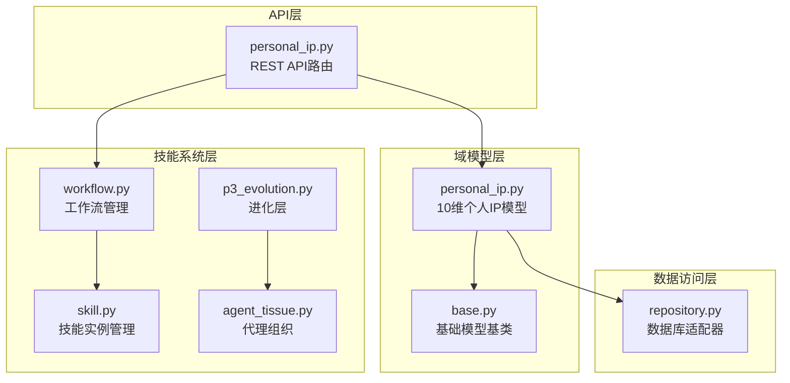
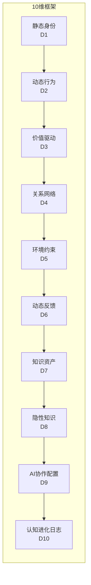
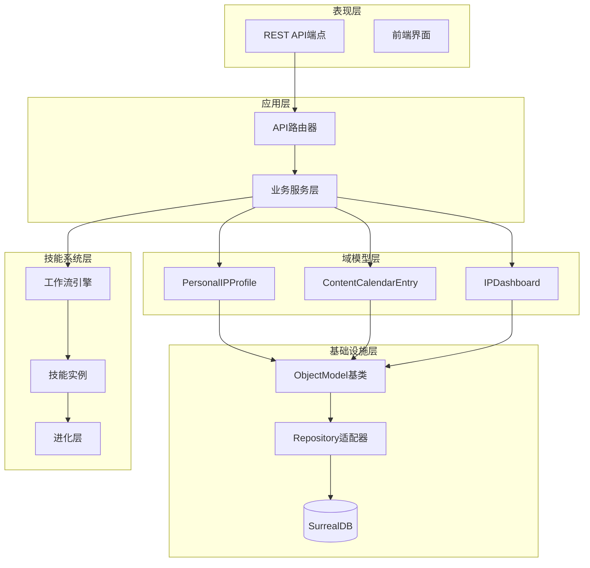
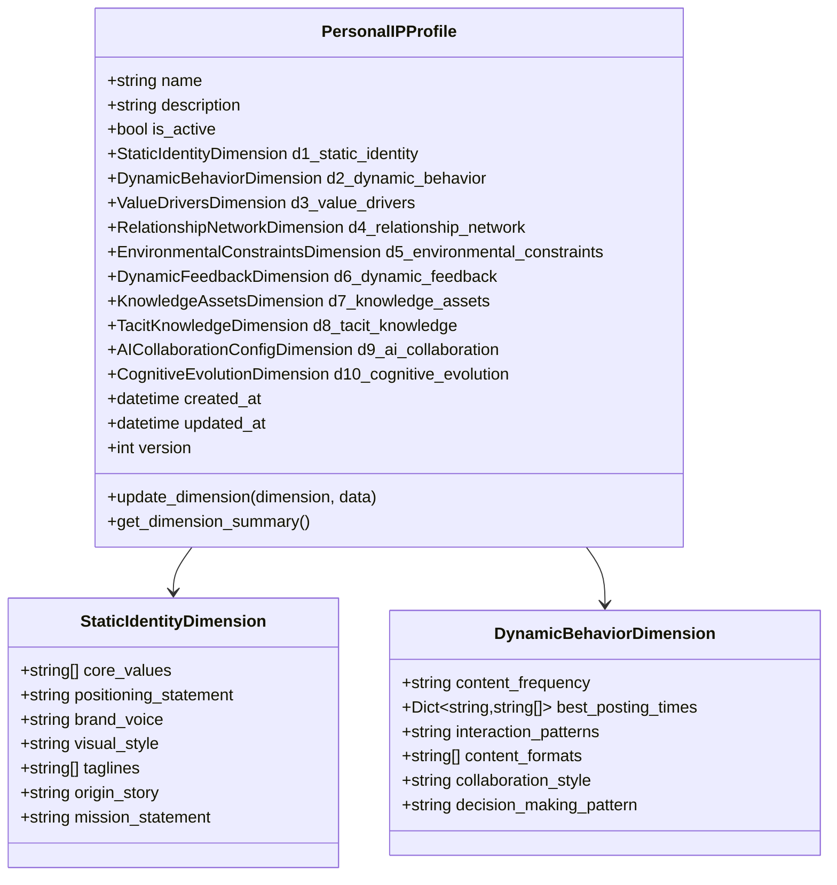
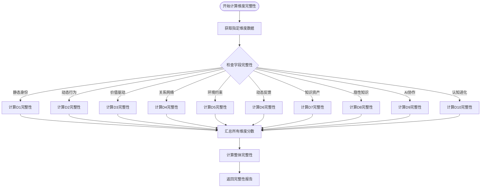
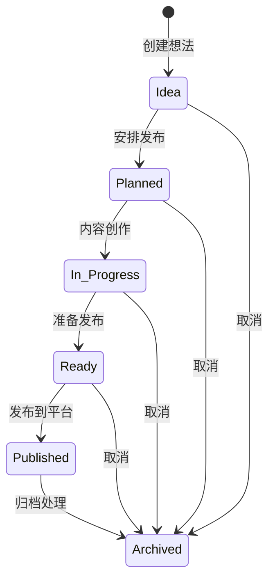
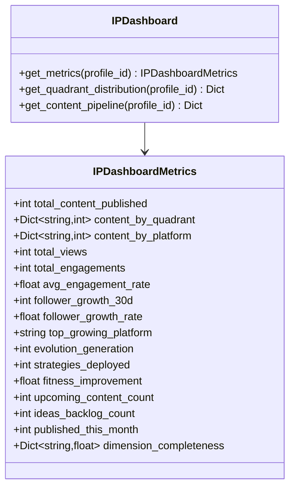
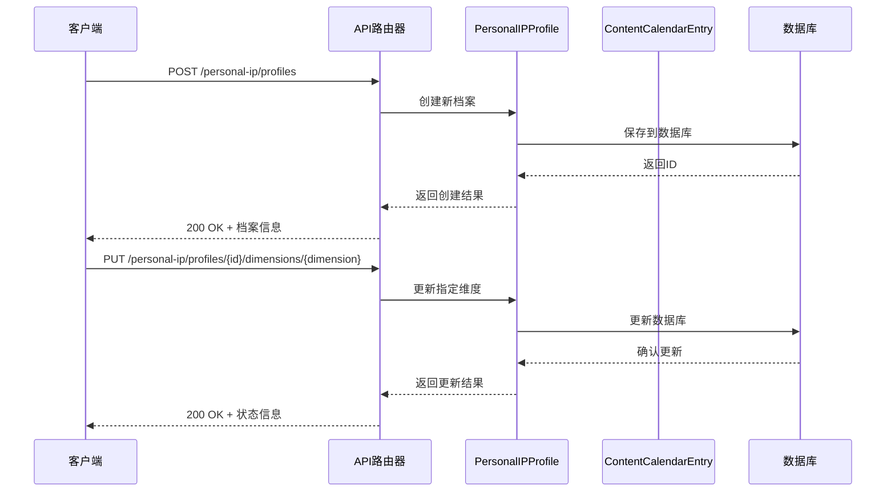
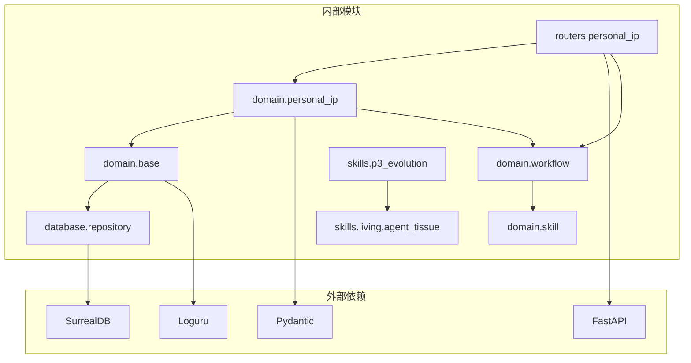
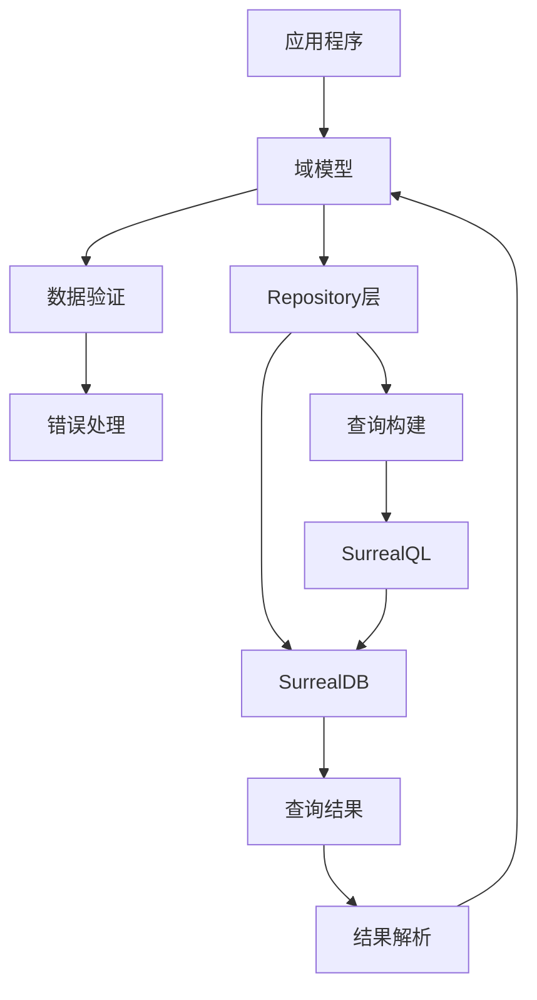

# 个人IP档案域模型

<cite>
**本文档引用的文件**
- [personal_ip.py](file://open_notebook/domain/personal_ip.py)
- [personal_ip.py](file://api/routers/personal_ip.py)
- [base.py](file://open_notebook/domain/base.py)
- [repository.py](file://open_notebook/database/repository.py)
- [workflow.py](file://open_notebook/domain/workflow.py)
- [skill.py](file://open_notebook/domain/skill.py)
- [p3_evolution.py](file://open_notebook/skills/p3_evolution.py)
- [agent_tissue.py](file://open_notebook/skills/living/agent_tissue.py)
</cite>

## 目录
1. [简介](#简介)
2. [项目结构](#项目结构)
3. [核心组件](#核心组件)
4. [架构概览](#架构概览)
5. [详细组件分析](#详细组件分析)
6. [依赖关系分析](#依赖关系分析)
7. [性能考虑](#性能考虑)
8. [故障排除指南](#故障排除指南)
9. [结论](#结论)

## 简介

个人IP档案域模型是Open Notebook项目中的核心功能模块，基于10维框架为超级个体提供全面的个人IP管理解决方案。该模型不仅涵盖了传统的个人品牌管理，还融入了现代AI协作、认知进化和四象限内容营销等前沿概念。

该系统采用立体有机体架构，将个人IP管理分解为10个相互关联的维度，每个维度都有其独特的数据结构、业务逻辑和API接口。通过这种分层设计，用户可以全面地构建、维护和发展自己的个人IP资产。

## 项目结构

个人IP档案域模型在项目中位于以下关键位置：

**图表来源**
- [personal_ip.py](file://open_notebook/domain/personal_ip.py#L1-L447)
- [base.py](file://open_notebook/domain/base.py#L31-L329)
- [repository.py](file://open_notebook/database/repository.py#L1-L195)

**章节来源**
- [personal_ip.py](file://open_notebook/domain/personal_ip.py#L1-L447)
- [base.py](file://open_notebook/domain/base.py#L1-L329)

## 核心组件

### 10维框架概述

个人IP档案采用10维框架，每个维度代表个人IP发展的不同方面：

**图表来源**
- [personal_ip.py](file://open_notebook/domain/personal_ip.py#L79-L187)

### 主要数据模型

系统包含三个核心数据模型：

1. **PersonalIPProfile**: 完整的10维个人IP档案
2. **ContentCalendarEntry**: 内容日历条目
3. **IPDashboardMetrics**: IP仪表板指标

**章节来源**
- [personal_ip.py](file://open_notebook/domain/personal_ip.py#L193-L447)

## 架构概览

个人IP档案域模型采用分层架构设计，确保各层职责清晰分离：

**图表来源**
- [personal_ip.py](file://api/routers/personal_ip.py#L1-L537)
- [base.py](file://open_notebook/domain/base.py#L31-L329)
- [repository.py](file://open_notebook/database/repository.py#L65-L195)

## 详细组件分析

### 1. PersonalIPProfile - 主要档案模型

PersonalIPProfile是整个系统的中心模型，包含了完整的10维个人IP档案：

**图表来源**
- [personal_ip.py](file://open_notebook/domain/personal_ip.py#L193-L233)
- [personal_ip.py](file://open_notebook/domain/personal_ip.py#L79-L178)

#### 维度完整性计算

系统提供了维度完整性计算功能，用于评估个人IP档案的完整程度：

**图表来源**
- [personal_ip.py](file://api/routers/personal_ip.py#L435-L537)

**章节来源**
- [personal_ip.py](file://open_notebook/domain/personal_ip.py#L193-L298)
- [personal_ip.py](file://api/routers/personal_ip.py#L435-L537)

### 2. ContentCalendarEntry - 内容日历模型

内容日历模型支持四象限内容营销策略，包含完整的生命周期管理：

**图表来源**
- [personal_ip.py](file://open_notebook/domain/personal_ip.py#L305-L358)

#### 内容状态管理

系统支持以下内容状态：

| 状态 | 描述 | 用途 |
|------|------|------|
| IDEA | 初始想法 | 内容创意阶段 |
| PLANNED | 已安排 | 发布计划确定 |
| IN_PROGRESS | 创作中 | 内容制作进行中 |
| READY | 已就绪 | 等待发布 |
| PUBLISHED | 已发布 | 内容已上线 |
| ARCHIVED | 已归档 | 历史内容管理 |

**章节来源**
- [personal_ip.py](file://open_notebook/domain/personal_ip.py#L29-L37)
- [personal_ip.py](file://open_notebook/domain/personal_ip.py#L305-L358)

### 3. IPDashboard - 仪表板分析

仪表板提供全面的个人IP健康度分析：

**图表来源**
- [personal_ip.py](file://open_notebook/domain/personal_ip.py#L385-L447)

**章节来源**
- [personal_ip.py](file://open_notebook/domain/personal_ip.py#L385-L447)

### 4. API路由层

API层提供了完整的REST接口，支持个人IP档案的CRUD操作：

**图表来源**
- [personal_ip.py](file://api/routers/personal_ip.py#L70-L200)

**章节来源**
- [personal_ip.py](file://api/routers/personal_ip.py#L1-L537)

## 依赖关系分析

个人IP档案域模型的依赖关系体现了清晰的分层架构：

**图表来源**
- [personal_ip.py](file://open_notebook/domain/personal_ip.py#L23-L26)
- [base.py](file://open_notebook/domain/base.py#L13-L26)

### 数据库集成

系统使用SurrealDB作为主要数据库，通过统一的Repository模式进行数据访问：

**图表来源**
- [repository.py](file://open_notebook/database/repository.py#L65-L195)

**章节来源**
- [repository.py](file://open_notebook/database/repository.py#L1-L195)

## 性能考虑

### 数据模型优化

1. **惰性加载**: 使用Pydantic的延迟字段验证，减少不必要的数据转换
2. **批量操作**: 支持批量创建和更新操作，提高数据库效率
3. **缓存策略**: 通过Singleton模式减少重复实例化开销

### API性能优化

1. **异步操作**: 所有数据库操作都是异步的，避免阻塞主线程
2. **连接池**: 使用上下文管理器确保数据库连接正确释放
3. **错误重试**: 对于并发冲突提供重试机制

### 内存管理

1. **对象生命周期**: 通过明确的创建、更新、删除流程管理内存
2. **字段过滤**: 只保存非空字段，减少存储空间
3. **类型安全**: 使用Pydantic确保数据类型一致性

## 故障排除指南

### 常见问题及解决方案

#### 1. 数据库连接问题

**症状**: API调用时出现数据库连接错误
**解决方案**:
- 检查SURREAL_URL环境变量配置
- 验证数据库凭据设置
- 确认数据库服务正常运行

#### 2. 数据验证失败

**症状**: 创建或更新个人IP档案时报验证错误
**解决方案**:
- 检查必填字段是否完整
- 验证枚举值的有效性
- 确认数据类型匹配

#### 3. 并发冲突

**症状**: 同时更新同一记录时出现冲突
**解决方案**:
- 实现重试机制
- 使用事务确保数据一致性
- 检查锁机制配置

**章节来源**
- [base.py](file://open_notebook/domain/base.py#L113-L183)
- [repository.py](file://open_notebook/database/repository.py#L76-L82)

## 结论

个人IP档案域模型是一个高度复杂且功能完整的系统，它将传统的个人品牌管理与现代AI技术相结合，为超级个体提供了全方位的IP管理解决方案。

### 主要优势

1. **全面性**: 10维框架覆盖了个人IP发展的各个方面
2. **灵活性**: 支持动态调整和个性化配置
3. **可扩展性**: 基于立体有机体架构，易于扩展新功能
4. **智能化**: 集成了AI协作和认知进化机制

### 技术特色

1. **分层架构**: 清晰的职责分离确保系统的可维护性
2. **异步设计**: 采用异步编程模式提高系统性能
3. **类型安全**: 使用Pydantic确保数据完整性
4. **数据库抽象**: 通过Repository模式实现数据库无关性

### 应用前景

该系统不仅适用于个人IP管理，还可以扩展到团队协作、企业品牌管理等多个领域，为数字化时代的内容创作者和品牌管理者提供强有力的技术支撑。