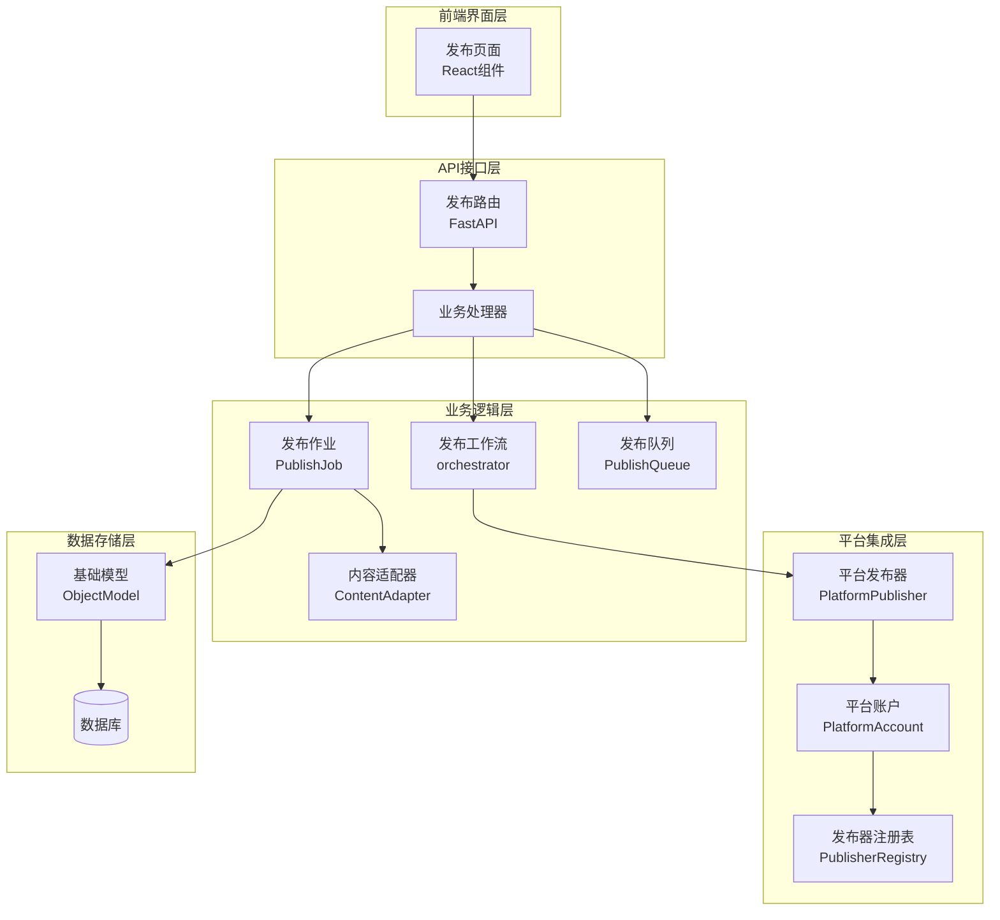
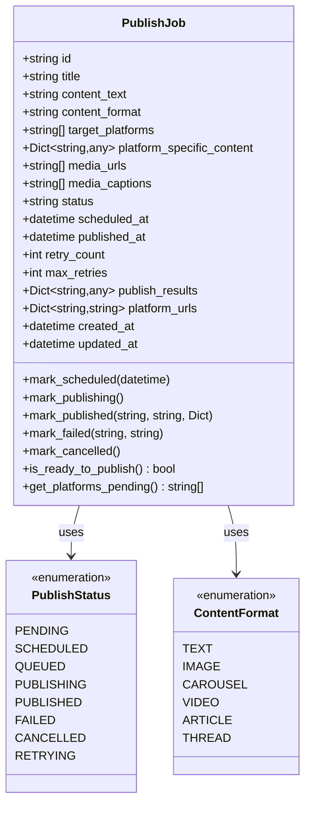
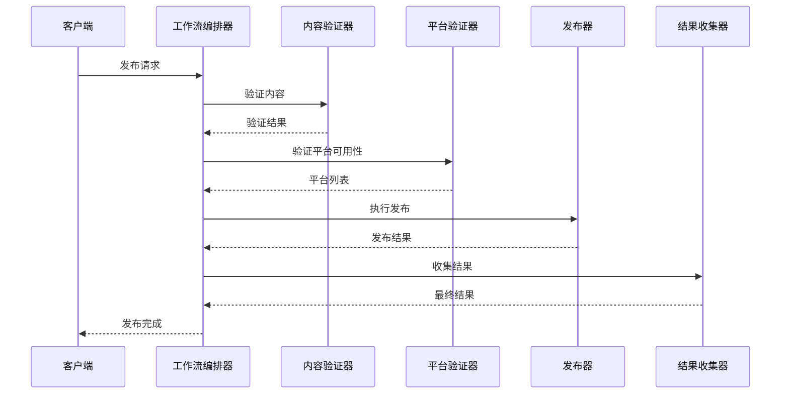
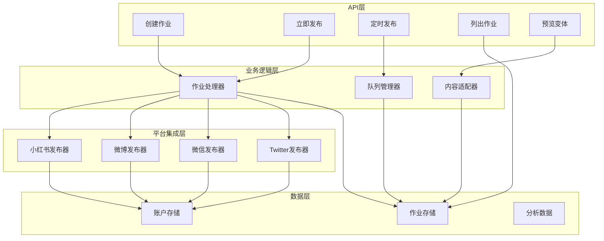
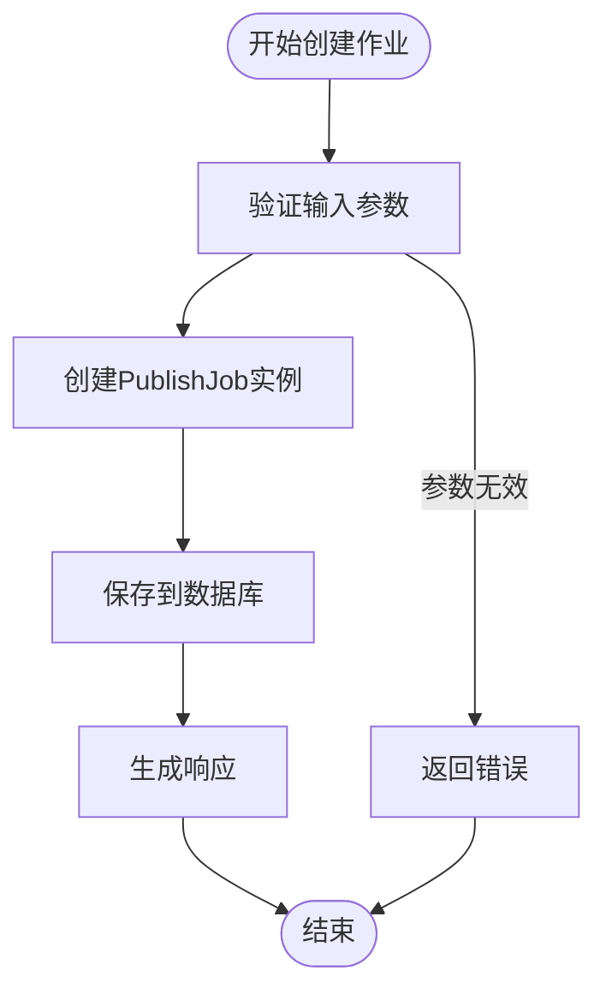
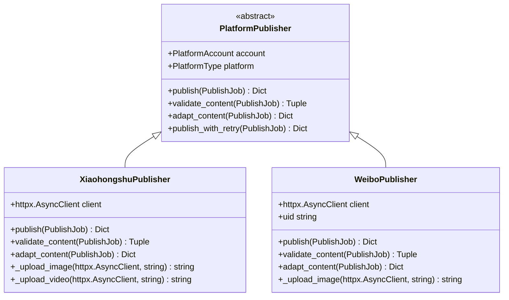
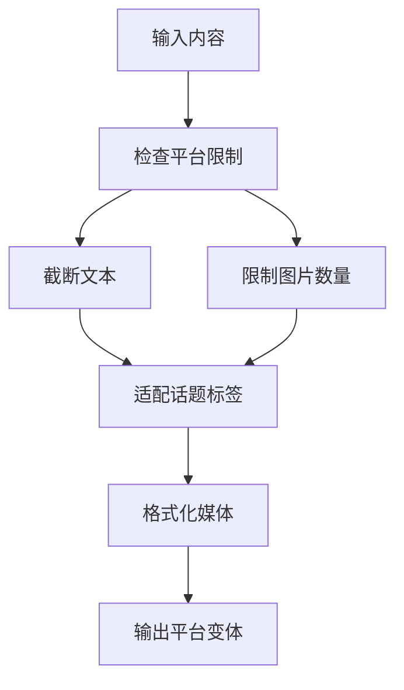
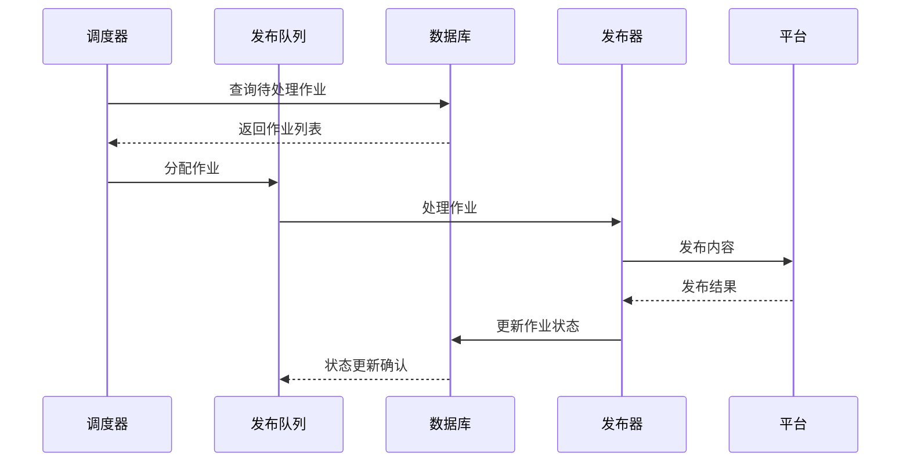
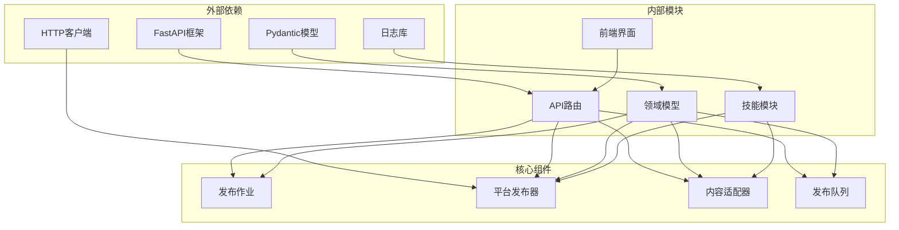

# 发布作业管理

<cite>
**本文档引用的文件**
- [api/routers/publish.py](file://api/routers/publish.py)
- [open_notebook/domain/publish_job.py](file://open_notebook/domain/publish_job.py)
- [open_notebook/skills/publish_workflow.py](file://open_notebook/skills/publish_workflow.py)
- [open_notebook/domain/platform_connector.py](file://open_notebook/domain/platform_connector.py)
- [open_notebook/skills/publishers/xiaohongshu_publisher.py](file://open_notebook/skills/publishers/xiaohongshu_publisher.py)
- [open_notebook/skills/publishers/weibo_publisher.py](file://open_notebook/skills/publishers/weibo_publisher.py)
- [open_notebook/skills/browser_publisher.py](file://open_notebook/skills/browser_publisher.py)
- [open_notebook/skills/browser_publishers/xiaohongshu_publisher.py](file://open_notebook/skills/browser_publishers/xiaohongshu_publisher.py)
- [frontend/src/app/(dashboard)/publish/page.tsx](file://frontend/src/app/(dashboard)/publish/page.tsx)
- [open_notebook/domain/base.py](file://open_notebook/domain/base.py)
- [api/main.py](file://api/main.py)
</cite>

## 目录
1. [简介](#简介)
2. [项目结构](#项目结构)
3. [核心组件](#核心组件)
4. [架构概览](#架构概览)
5. [详细组件分析](#详细组件分析)
6. [依赖关系分析](#依赖关系分析)
7. [性能考虑](#性能考虑)
8. [故障排除指南](#故障排除指南)
9. [结论](#结论)

## 简介

发布作业管理系统是 Open Notebook 生态系统中的核心模块，负责自动化内容发布到多个社交媒体平台。该系统提供了完整的发布流程管理，包括内容创建、格式适配、多平台发布、队列管理和结果跟踪等功能。

系统支持多种发布模式：
- **API驱动发布**：通过REST API进行内容发布
- **浏览器自动化发布**：使用真实浏览器会话进行发布
- **队列管理**：异步处理发布任务
- **格式适配**：针对不同平台的特定要求进行内容调整

## 项目结构

发布作业管理系统采用分层架构设计，主要包含以下层次：

**图表来源**
- [api/routers/publish.py](file://api/routers/publish.py#L21-L387)
- [open_notebook/domain/publish_job.py](file://open_notebook/domain/publish_job.py#L52-L482)
- [open_notebook/skills/publish_workflow.py](file://open_notebook/skills/publish_workflow.py#L63-L424)

**章节来源**
- [api/routers/publish.py](file://api/routers/publish.py#L1-L387)
- [open_notebook/domain/publish_job.py](file://open_notebook/domain/publish_job.py#L1-L482)
- [open_notebook/skills/publish_workflow.py](file://open_notebook/skills/publish_workflow.py#L1-L424)

## 核心组件

### 发布作业模型 (PublishJob)

发布作业是系统的核心实体，代表一次完整的发布任务：

**图表来源**
- [open_notebook/domain/publish_job.py](file://open_notebook/domain/publish_job.py#L52-L170)

### 发布工作流 (PublishWorkflowOrchestrator)

工作流编排器负责协调整个发布过程：

**图表来源**
- [open_notebook/skills/publish_workflow.py](file://open_notebook/skills/publish_workflow.py#L74-L144)

**章节来源**
- [open_notebook/domain/publish_job.py](file://open_notebook/domain/publish_job.py#L52-L170)
- [open_notebook/skills/publish_workflow.py](file://open_notebook/skills/publish_workflow.py#L63-L144)

## 架构概览

发布作业管理系统采用模块化设计，支持多种发布策略和平台集成：

**图表来源**
- [api/routers/publish.py](file://api/routers/publish.py#L67-L309)
- [open_notebook/domain/publish_job.py](file://open_notebook/domain/publish_job.py#L270-L375)

## 详细组件分析

### API路由层

API路由层提供了完整的发布管理接口：

#### 主要端点

| 端点 | 方法 | 功能描述 |
|------|------|----------|
| `/publish/jobs` | POST | 创建新的发布作业 |
| `/publish/jobs/{job_id}/publish-now` | POST | 立即发布作业 |
| `/publish/jobs/{job_id}/schedule` | POST | 定时发布作业 |
| `/publish/jobs/{job_id}/cancel` | POST | 取消发布作业 |
| `/publish/jobs` | GET | 列出所有发布作业 |
| `/publish/jobs/{job_id}` | GET | 获取作业详情 |
| `/publish/jobs/{job_id}/preview` | POST | 预览平台变体 |
| `/publish/publish-all` | POST | 一键多平台发布 |

#### 发布作业创建流程

**图表来源**
- [api/routers/publish.py](file://api/routers/publish.py#L67-L92)

**章节来源**
- [api/routers/publish.py](file://api/routers/publish.py#L67-L309)

### 平台发布器

系统支持多种社交媒体平台的发布功能：

#### 平台支持情况

| 平台 | 类型 | 支持功能 | 发布器类 |
|------|------|----------|----------|
| 小红书 | 图片/视频笔记 | 图片上传、视频上传、话题标签 | XiaohongshuPublisher |
| 微博 | 文本/图片/视频 | 文本发布、图片上传、话题标签 | WeiboPublisher |
| 微信公众号 | 文章 | 文章发布 | WechatOfficialPublisher |
| 知乎 | 文章/回答 | 文章发布 | ZhihuPublisher |
| Twitter | 推文 | 文本发布、媒体上传 | TwitterPublisher |
| Instagram | 图片/视频 | 图片发布、故事发布 | InstagramPublisher |
| YouTube | 视频 | 视频发布 | YoutubePublisher |

#### 发布器架构

**图表来源**
- [open_notebook/domain/publish_job.py](file://open_notebook/domain/publish_job.py#L233-L268)
- [open_notebook/skills/publishers/xiaohongshu_publisher.py](file://open_notebook/skills/publishers/xiaohongshu_publisher.py#L17-L224)
- [open_notebook/skills/publishers/weibo_publisher.py](file://open_notebook/skills/publishers/weibo_publisher.py#L16-L213)

**章节来源**
- [open_notebook/skills/publishers/xiaohongshu_publisher.py](file://open_notebook/skills/publishers/xiaohongshu_publisher.py#L1-L225)
- [open_notebook/skills/publishers/weibo_publisher.py](file://open_notebook/skills/publishers/weibo_publisher.py#L1-L214)

### 内容适配器

内容适配器负责将通用内容转换为特定平台所需的格式：

#### 平台限制配置

| 平台 | 文本最大长度 | 图片数量限制 | 视频时长限制 | 标题最大长度 |
|------|-------------|-------------|-------------|-------------|
| 小红书 | 1000字符 | 18张 | 600秒 | 20字符 |
| 微博 | 5000字符 | 18张 | 无限制 | 无限制 |
| 微信公众号 | 无限制 | 50张 | 无限制 | 64字符 |
| 知乎 | 无限制 | 100张 | 无限制 | 无限制 |
| Twitter | 280字符 | 4张 | 140秒 | 无限制 |

#### 适配流程

**图表来源**
- [open_notebook/domain/publish_job.py](file://open_notebook/domain/publish_job.py#L378-L482)

**章节来源**
- [open_notebook/domain/publish_job.py](file://open_notebook/domain/publish_job.py#L378-L482)

### 队列管理系统

发布队列系统负责异步处理发布任务：

#### 队列处理流程

**图表来源**
- [open_notebook/domain/publish_job.py](file://open_notebook/domain/publish_job.py#L290-L375)

**章节来源**
- [open_notebook/domain/publish_job.py](file://open_notebook/domain/publish_job.py#L270-L375)

### 前端发布界面

前端提供了直观的发布管理界面：

#### 界面功能

| 组件 | 功能 | 描述 |
|------|------|------|
| 内容编辑器 | 文本编辑 | 支持标题、正文编辑 |
| 标签管理 | 标签添加 | 添加和删除标签 |
| 平台选择 | 平台勾选 | 选择目标发布平台 |
| 预览功能 | 内容预览 | 查看各平台显示效果 |
| 发布队列 | 任务管理 | 查看发布历史和状态 |
| 定时任务 | 时间安排 | 设置定时发布时间 |

**章节来源**
- [frontend/src/app/(dashboard)/publish/page.tsx](file://frontend/src/app/(dashboard)/publish/page.tsx#L1-L542)

## 依赖关系分析

发布作业管理系统具有清晰的依赖层次结构：

**图表来源**
- [api/main.py](file://api/main.py#L174-L264)
- [open_notebook/domain/base.py](file://open_notebook/domain/base.py#L31-L329)

**章节来源**
- [api/main.py](file://api/main.py#L1-L275)
- [open_notebook/domain/base.py](file://open_notebook/domain/base.py#L1-L329)

## 性能考虑

发布作业管理系统在设计时充分考虑了性能优化：

### 异步处理
- 使用 asyncio 进行异步I/O操作
- 支持并发发布多个平台的内容
- 避免阻塞主线程

### 缓存机制
- 平台账户信息缓存
- 内容适配结果缓存
- 发布历史查询缓存

### 错误处理
- 自动重试机制（最多3次）
- 指数退避策略
- 失败降级处理

### 资源管理
- 连接池管理
- 超时控制
- 内存使用优化

## 故障排除指南

### 常见问题及解决方案

#### 发布失败
**症状**：发布作业状态变为FAILED
**可能原因**：
- 平台认证失败
- 内容格式不符合平台要求
- 网络连接问题

**解决步骤**：
1. 检查平台账户认证状态
2. 验证内容格式和长度限制
3. 确认网络连接正常
4. 查看详细错误信息

#### 队列积压
**症状**：发布队列长时间不处理
**可能原因**：
- 平台API限制
- 账户被限制
- 系统资源不足

**解决步骤**：
1. 检查平台API使用限制
2. 验证账户状态
3. 监控系统资源使用
4. 调整队列处理速度

#### 内容适配错误
**症状**：预览内容与预期不符
**可能原因**：
- 平台限制配置错误
- 内容格式转换问题
- 标签格式不正确

**解决步骤**：
1. 检查平台限制配置
2. 验证内容格式
3. 确认标签格式
4. 重新生成内容变体

**章节来源**
- [open_notebook/domain/publish_job.py](file://open_notebook/domain/publish_job.py#L131-L150)
- [open_notebook/skills/publish_workflow.py](file://open_notebook/skills/publish_workflow.py#L136-L144)

## 结论

发布作业管理系统是一个功能完整、架构清晰的多平台内容发布解决方案。系统的主要优势包括：

### 核心优势
- **多平台支持**：支持主流社交媒体平台的发布
- **灵活的发布模式**：支持即时发布和定时发布
- **智能内容适配**：自动处理不同平台的格式差异
- **可靠的错误处理**：完善的重试和降级机制
- **可扩展的架构**：易于添加新的平台和功能

### 技术特点
- 基于FastAPI的高性能API设计
- 异步处理确保良好的用户体验
- 完善的类型安全和数据验证
- 清晰的模块化架构设计

### 应用场景
- 个人IP内容管理
- 企业品牌推广
- 内容营销自动化
- 多渠道内容分发

该系统为用户提供了一个强大而易用的发布管理工具，能够有效提升内容发布的效率和一致性。