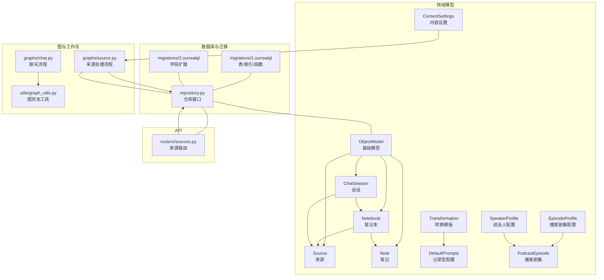
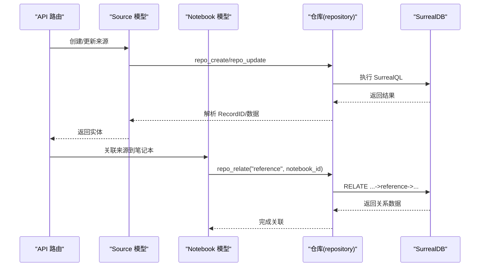
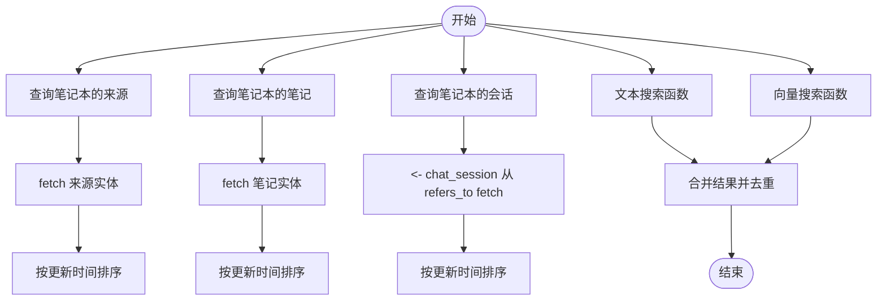
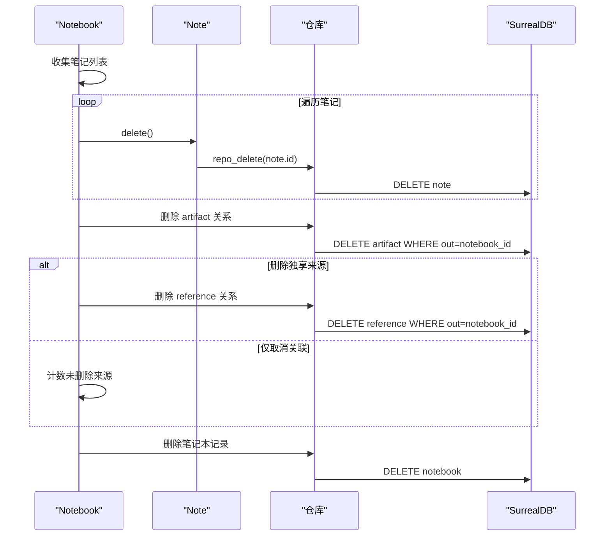
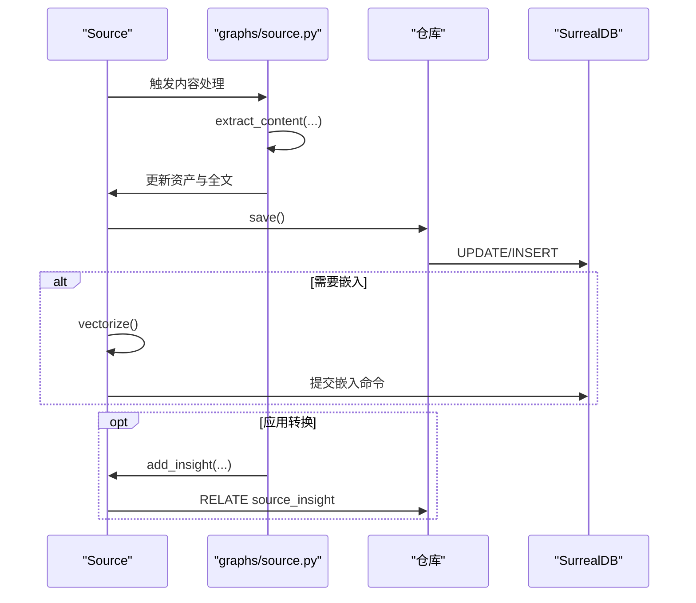
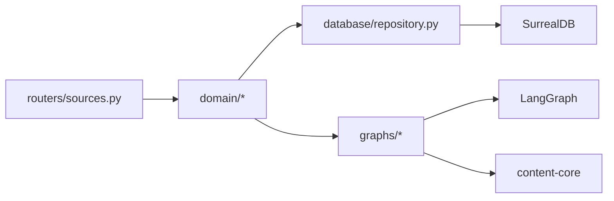

# 实体关系与关联

<cite>
**本文引用的文件**
- [open_notebook/domain/base.py](file://open_notebook/domain/base.py)
- [open_notebook/domain/notebook.py](file://open_notebook/domain/notebook.py)
- [open_notebook/domain/transformation.py](file://open_notebook/domain/transformation.py)
- [open_notebook/domain/content_settings.py](file://open_notebook/domain/content_settings.py)
- [open_notebook/podcasts/models.py](file://open_notebook/podcasts/models.py)
- [open_notebook/database/repository.py](file://open_notebook/database/repository.py)
- [open_notebook/database/migrations/1.surrealql](file://open_notebook/database/migrations/1.surrealql)
- [open_notebook/database/migrations/2.surrealql](file://open_notebook/database/migrations/2.surrealql)
- [open_notebook/graphs/source.py](file://open_notebook/graphs/source.py)
- [open_notebook/graphs/chat.py](file://open_notebook/graphs/chat.py)
- [open_notebook/utils/graph_utils.py](file://open_notebook/utils/graph_utils.py)
- [api/routers/sources.py](file://api/routers/sources.py)
- [open_notebook/exceptions.py](file://open_notebook/exceptions.py)
</cite>

## 目录
1. [简介](#简介)
2. [项目结构](#项目结构)
3. [核心组件](#核心组件)
4. [架构总览](#架构总览)
5. [详细组件分析](#详细组件分析)
6. [依赖分析](#依赖分析)
7. [性能考量](#性能考量)
8. [故障排查指南](#故障排查指南)
9. [结论](#结论)
10. [附录](#附录)

## 简介
本文件聚焦于本项目的“实体关系与关联”主题，系统性阐述基于图数据库（SurrealDB）的实体建模、关系映射、查询与遍历、级联与事务处理、加载策略与性能优化、完整性约束与最佳实践。文档以代码为依据，结合迁移脚本与图工作流，帮助读者从概念到实现全面理解。

## 项目结构
项目采用分层组织：领域模型位于 open_notebook/domain，持久化仓库位于 open_notebook/database，业务图工作流位于 open_notebook/graphs，API 路由位于 api/routers，异常类型位于 open_notebook/exceptions。迁移脚本定义了表结构、索引与函数，支撑全文检索与向量检索。



**图表来源**
- [open_notebook/domain/base.py](file://open_notebook/domain/base.py#L31-L329)
- [open_notebook/domain/notebook.py](file://open_notebook/domain/notebook.py#L16-L679)
- [open_notebook/domain/transformation.py](file://open_notebook/domain/transformation.py#L8-L22)
- [open_notebook/domain/content_settings.py](file://open_notebook/domain/content_settings.py#L8-L26)
- [open_notebook/podcasts/models.py](file://open_notebook/podcasts/models.py#L10-L148)
- [open_notebook/database/repository.py](file://open_notebook/database/repository.py#L65-L195)
- [open_notebook/database/migrations/1.surrealql](file://open_notebook/database/migrations/1.surrealql#L1-L179)
- [open_notebook/database/migrations/2.surrealql](file://open_notebook/database/migrations/2.surrealql#L1-L2)
- [open_notebook/graphs/source.py](file://open_notebook/graphs/source.py#L19-L168)
- [open_notebook/graphs/chat.py](file://open_notebook/graphs/chat.py#L19-L94)
- [open_notebook/utils/graph_utils.py](file://open_notebook/utils/graph_utils.py#L7-L24)
- [api/routers/sources.py](file://api/routers/sources.py#L152-L200)

**章节来源**
- [open_notebook/domain/base.py](file://open_notebook/domain/base.py#L31-L329)
- [open_notebook/database/repository.py](file://open_notebook/database/repository.py#L65-L195)
- [open_notebook/database/migrations/1.surrealql](file://open_notebook/database/migrations/1.surrealql#L1-L179)

## 核心组件
- 基础模型 ObjectModel：统一 CRUD、关系建立、时间戳处理与校验；提供 relate 方法用于创建图关系。
- 领域模型：
  - Notebook/Source/Note/ChatSession：定义实体与关系查询方法（如 get_sources/get_notes/get_chat_sessions）。
  - Transformation/DefaultPrompts：转换模板与记录型全局配置。
  - ContentSettings：内容处理与嵌入策略等全局设置。
  - Podcast 相关模型：EpisodeProfile/SpeakerProfile/PodcastEpisode。
- 仓库层 repository：封装 SurrealQL 查询、插入、更新、删除、关系创建与 UPSERT；提供连接管理与错误处理。
- 迁移脚本：定义表结构、关系类型、索引与全文/向量检索函数。
- 图工作流：graphs/source.py 定义来源处理流程；graphs/chat.py 定义聊天流程；utils/graph_utils.py 提供图状态读取辅助。

**章节来源**
- [open_notebook/domain/base.py](file://open_notebook/domain/base.py#L31-L329)
- [open_notebook/domain/notebook.py](file://open_notebook/domain/notebook.py#L16-L679)
- [open_notebook/domain/transformation.py](file://open_notebook/domain/transformation.py#L8-L22)
- [open_notebook/domain/content_settings.py](file://open_notebook/domain/content_settings.py#L8-L26)
- [open_notebook/podcasts/models.py](file://open_notebook/podcasts/models.py#L10-L148)
- [open_notebook/database/repository.py](file://open_notebook/database/repository.py#L65-L195)
- [open_notebook/database/migrations/1.surrealql](file://open_notebook/database/migrations/1.surrealql#L1-L179)

## 架构总览
系统围绕“实体-关系-查询-工作流”的闭环构建：
- 实体与关系：通过对象模型与关系查询方法表达一对多/多对多关系。
- 查询与检索：使用迁移脚本定义的函数实现文本与向量检索。
- 工作流：LangGraph 将来源处理、转换与嵌入串联为可编排流程。
- 事务与一致性：仓库层对并发冲突进行重试与日志控制。



**图表来源**
- [open_notebook/domain/notebook.py](file://open_notebook/domain/notebook.py#L406-L410)
- [open_notebook/domain/base.py](file://open_notebook/domain/base.py#L184-L196)
- [open_notebook/database/repository.py](file://open_notebook/database/repository.py#L106-L131)

## 详细组件分析

### 实体与关系建模
- 表与关系类型：
  - source、notebook、note、source_embedding、source_insight 等表在迁移脚本中定义。
  - reference 与 artifact 为关系表，分别表示“来源-笔记本”和“笔记-笔记本”的多对多关系。
- 关系映射：
  - Notebook.get_sources/get_notes/get_chat_sessions 使用查询语言直接遍历关系边并 fetch 相关实体。
  - Source.add_to_notebook/Note.add_to_notebook/ChatSession.relate_to_notebook 通过 relate 方法创建关系。
- 可空字段与校验：
  - ObjectModel.nullable_fields 控制保存时允许的空值字段集合。
  - 各模型通过 field_validator 对输入进行约束。

```mermaid
erDiagram
SOURCE {
record_id id PK
object asset
string title
array<string> topics
string full_text
string command
}
NOTEBOOK {
record_id id PK
string name
string description
bool archived
}
NOTE {
record_id id PK
string title
string summary
string content
array<float> embedding
}
SOURCE_EMBEDDING {
record_id id PK
record<source> source FK
int order
string content
array<float> embedding
}
SOURCE_INSIGHT {
record_id id PK
record<source> source FK
string insight_type
string content
array<float> embedding
}
REFERENCE {
record<source> in FK
record<notebook> out FK
}
ARTIFACT {
record<note> in FK
record<notebook> out FK
}
SOURCE }o--o| NOTEBOOK : "reference"
NOTE }o--o| NOTEBOOK : "artifact"
SOURCE }o--o{ SOURCE_EMBEDDING : "has_chunks"
SOURCE }o--o{ SOURCE_INSIGHT : "has_insights"
```

**图表来源**
- [open_notebook/database/migrations/1.surrealql](file://open_notebook/database/migrations/1.surrealql#L2-L62)

**章节来源**
- [open_notebook/database/migrations/1.surrealql](file://open_notebook/database/migrations/1.surrealql#L2-L62)
- [open_notebook/domain/notebook.py](file://open_notebook/domain/notebook.py#L29-L86)
- [open_notebook/domain/base.py](file://open_notebook/domain/base.py#L184-L196)

### 关系查询与遍历
- Notebook 到 Source/Note/ChatSession 的查询均通过原生查询语言完成，支持排序、投影与 fetch 关联实体。
- Source/Note/ChatSession 提供便捷方法，如 Source.add_to_notebook、Note.add_to_notebook、ChatSession.relate_to_notebook。
- 文本与向量检索通过迁移脚本中的函数实现，支持联合搜索与高亮。



**图表来源**
- [open_notebook/domain/notebook.py](file://open_notebook/domain/notebook.py#L29-L86)
- [open_notebook/database/migrations/1.surrealql](file://open_notebook/database/migrations/1.surrealql#L74-L173)

**章节来源**
- [open_notebook/domain/notebook.py](file://open_notebook/domain/notebook.py#L29-L86)
- [open_notebook/database/migrations/1.surrealql](file://open_notebook/database/migrations/1.surrealql#L74-L173)

### 级联操作与事务处理
- 删除级联：
  - Notebook.delete 先删除其下的所有笔记，再删除 artifact 关系；根据是否删除独享来源决定删除或仅取消关联；最后删除笔记本自身。
  - Source.delete 在删除记录前清理 source_embedding 与 source_insight，避免孤儿记录。
- 事务与冲突：
  - 仓库层对运行时错误（含事务冲突）进行区分与重抛，便于上层重试；非冲突异常统一记录并抛出。
  - 删除事件（source_delete）在迁移脚本中定义，自动清理关联的嵌入与洞察。



**图表来源**
- [open_notebook/domain/notebook.py](file://open_notebook/domain/notebook.py#L138-L231)
- [open_notebook/database/migrations/1.surrealql](file://open_notebook/database/migrations/1.surrealql#L29-L32)

**章节来源**
- [open_notebook/domain/notebook.py](file://open_notebook/domain/notebook.py#L138-L231)
- [open_notebook/database/migrations/1.surrealql](file://open_notebook/database/migrations/1.surrealql#L29-L32)
- [open_notebook/database/repository.py](file://open_notebook/database/repository.py#L65-L104)

### 加载策略与性能优化
- 延迟加载与单例：
  - RecordModel 提供实例缓存与延迟加载机制，减少重复查询。
- 查询优化：
  - 迁移脚本定义了全文检索与向量检索函数，并为相关字段建立索引，提升检索性能。
  - API 路由在查询来源时使用 LIMIT/OFFSET 与排序，配合投影字段减少传输与解析开销。
- 异步与后台任务：
  - Source.vectorize 与 Note.save 中提交嵌入命令，避免阻塞主流程。
- 图工作流：
  - 源内容处理、转换与嵌入通过 LangGraph 编排，支持条件分支与并行节点。

**章节来源**
- [open_notebook/domain/base.py](file://open_notebook/domain/base.py#L206-L329)
- [open_notebook/database/migrations/1.surrealql](file://open_notebook/database/migrations/1.surrealql#L65-L72)
- [api/routers/sources.py](file://api/routers/sources.py#L152-L200)
- [open_notebook/graphs/source.py](file://open_notebook/graphs/source.py#L19-L168)

### 关系完整性与约束检查
- 数据库层面：
  - 迁移脚本定义字段类型、默认值与索引，确保检索与存储一致性。
  - 事件触发器在删除 source 时自动清理 source_embedding 与 source_insight。
- 应用层面：
  - ObjectModel.validate 与各模型的 field_validator 在保存前进行输入校验。
  - relate/save/delete 统一通过仓库层执行，保证一致性与错误传播。

**章节来源**
- [open_notebook/database/migrations/1.surrealql](file://open_notebook/database/migrations/1.surrealql#L4-L62)
- [open_notebook/domain/base.py](file://open_notebook/domain/base.py#L121-L160)
- [open_notebook/domain/notebook.py](file://open_notebook/domain/notebook.py#L514-L552)

### 图数据库查询与关系遍历算法
- 查询语言：
  - 使用 SELECT/RELATE/FETCH 等原生命令进行关系遍历与数据获取。
- 函数式检索：
  - 文本搜索与向量搜索函数对多表结果进行合并、去重与排序。
- 工作流编排：
  - 源处理流程根据内容状态提取、保存、可选地触发转换与嵌入。
  - 聊天流程通过 LangGraph 管理消息与模型调用。



**图表来源**
- [open_notebook/graphs/source.py](file://open_notebook/graphs/source.py#L34-L107)
- [open_notebook/domain/notebook.py](file://open_notebook/domain/notebook.py#L411-L503)

**章节来源**
- [open_notebook/graphs/source.py](file://open_notebook/graphs/source.py#L34-L107)
- [open_notebook/database/migrations/1.surrealql](file://open_notebook/database/migrations/1.surrealql#L74-L173)

### 关系管理最佳实践与常见陷阱
- 最佳实践
  - 明确关系方向与命名：如 reference/artifact、refers_to 等，保持语义一致。
  - 使用 relate 方法统一创建关系，避免直接拼接字符串。
  - 在删除前清理关联数据，防止孤儿记录。
  - 利用迁移脚本定义索引与函数，提升查询性能。
  - 对并发冲突进行重试与幂等设计。
- 常见陷阱
  - 忽略事务冲突：仓库层已区分运行时错误，需在上层进行重试。
  - 直接删除实体而不清理关联：应先删除关系与子资源。
  - 查询未做投影与分页：导致网络与解析开销过大。
  - 字段类型不匹配：确保字段类型与索引/函数期望一致。

**章节来源**
- [open_notebook/database/repository.py](file://open_notebook/database/repository.py#L65-L104)
- [open_notebook/domain/notebook.py](file://open_notebook/domain/notebook.py#L138-L231)
- [open_notebook/database/migrations/1.surrealql](file://open_notebook/database/migrations/1.surrealql#L65-L72)

## 依赖分析
- 组件耦合
  - 领域模型依赖仓库层进行持久化；API 路由依赖领域模型；图工作流依赖领域模型与仓库层。
- 外部依赖
  - SurrealDB 作为图数据库；LangGraph 用于工作流编排；content-core 用于内容提取。
- 循环依赖
  - 未发现循环导入；模块职责清晰。



**图表来源**
- [api/routers/sources.py](file://api/routers/sources.py#L1-L200)
- [open_notebook/domain/notebook.py](file://open_notebook/domain/notebook.py#L1-L679)
- [open_notebook/database/repository.py](file://open_notebook/database/repository.py#L1-L195)
- [open_notebook/graphs/source.py](file://open_notebook/graphs/source.py#L1-L168)

**章节来源**
- [api/routers/sources.py](file://api/routers/sources.py#L1-L200)
- [open_notebook/domain/notebook.py](file://open_notebook/domain/notebook.py#L1-L679)
- [open_notebook/database/repository.py](file://open_notebook/database/repository.py#L1-L195)

## 性能考量
- 索引与函数：迁移脚本为标题、全文、嵌入与笔记内容建立索引与检索函数，显著提升查询效率。
- 分页与投影：API 路由支持 LIMIT/OFFSET 与字段投影，降低网络与解析成本。
- 异步与后台：嵌入与洞察创建通过命令提交，避免阻塞请求。
- 连接策略：当前每操作一次建立一次连接，适合无状态 API；批量场景建议评估连接池策略。

**章节来源**
- [open_notebook/database/migrations/1.surrealql](file://open_notebook/database/migrations/1.surrealql#L65-L72)
- [api/routers/sources.py](file://api/routers/sources.py#L152-L200)
- [open_notebook/database/repository.py](file://open_notebook/database/repository.py#L47-L63)

## 故障排查指南
- 常见错误类型
  - DatabaseOperationError：数据库操作失败。
  - InvalidInputError：输入参数非法。
  - NotFoundError：资源不存在。
- 排查步骤
  - 检查仓库层返回的错误信息与日志级别（DEBUG 用于事务冲突，其他异常记录堆栈）。
  - 确认关系 ID 格式与存在性；使用 ensure_record_id 统一转换。
  - 核对迁移版本与表结构；必要时回滚/升级迁移。
  - 对并发写入场景进行重试与幂等处理。

**章节来源**
- [open_notebook/exceptions.py](file://open_notebook/exceptions.py#L7-L28)
- [open_notebook/database/repository.py](file://open_notebook/database/repository.py#L65-L104)

## 结论
本项目以 SurrealDB 的图能力为核心，通过清晰的领域模型、统一的仓库层与迁移脚本，实现了实体间的一对多、多对多关系建模与高效查询。配合 LangGraph 的工作流编排与检索函数，系统在关系遍历、级联删除、事务处理与性能优化方面具备良好工程实践。遵循本文的最佳实践与注意事项，可进一步提升系统的稳定性与可维护性。

## 附录
- 查询示例路径
  - 文本搜索：[open_notebook/domain/notebook.py](file://open_notebook/domain/notebook.py#L628-L646)
  - 向量搜索：[open_notebook/domain/notebook.py](file://open_notebook/domain/notebook.py#L648-L679)
  - 获取笔记本来源：[open_notebook/domain/notebook.py](file://open_notebook/domain/notebook.py#L29-L44)
  - 获取笔记本笔记：[open_notebook/domain/notebook.py](file://open_notebook/domain/notebook.py#L46-L62)
  - 获取笔记本会话：[open_notebook/domain/notebook.py](file://open_notebook/domain/notebook.py#L63-L86)
- 关系创建示例路径
  - Notebook 关联 Source：[open_notebook/domain/notebook.py](file://open_notebook/domain/notebook.py#L406-L410)
  - Notebook 关联 Note：[open_notebook/domain/notebook.py](file://open_notebook/domain/notebook.py#L593-L596)
  - 会话关联笔记本/来源：[open_notebook/domain/notebook.py](file://open_notebook/domain/notebook.py#L617-L625)