# 平台连接器接口

<cite>
**本文档引用的文件**
- [platform_connector.py](file://open_notebook/domain/platform_connector.py)
- [weibo_connector.py](file://open_notebook/skills/connectors/weibo_connector.py)
- [xiaohongshu_connector.py](file://open_notebook/skills/connectors/xiaohongshu_connector.py)
- [__init__.py](file://open_notebook/skills/connectors/__init__.py)
- [platform_accounts.py](file://api/routers/platform_accounts.py)
- [base.py](file://open_notebook/domain/base.py)
- [repository.py](file://open_notebook/database/repository.py)
- [publish_workflow.py](file://open_notebook/skills/publish_workflow.py)
</cite>

## 目录
1. [简介](#简介)
2. [项目结构](#项目结构)
3. [核心组件](#核心组件)
4. [架构概览](#架构概览)
5. [详细组件分析](#详细组件分析)
6. [依赖关系分析](#依赖关系分析)
7. [性能考虑](#性能考虑)
8. [故障排除指南](#故障排除指南)
9. [结论](#结论)

## 简介

平台连接器接口是 Open Notebook 生态系统中的关键组件，负责从各种社交媒体平台（如小红书、微博、微信公众号等）同步内容和分析数据。该系统采用模块化设计，支持多种认证方式和平台类型，为个人IP运营提供完整的数据采集和分析能力。

系统的核心目标是：
- 提供统一的平台抽象接口
- 支持多平台内容同步
- 实现标准化的数据格式
- 提供完整的错误处理和重试机制
- 集成到更大的 P0-P3 知识系统中

## 项目结构

平台连接器系统主要分布在以下目录中：

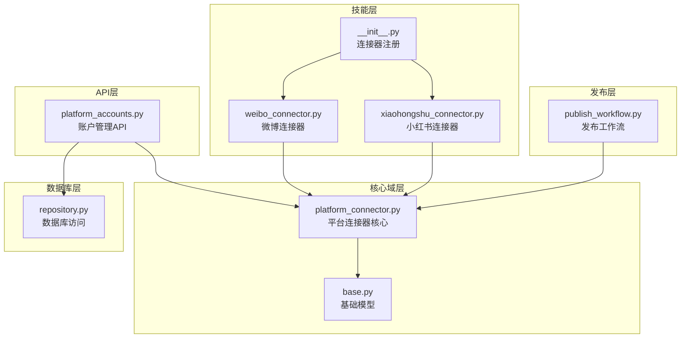

**图表来源**
- [platform_connector.py](file://open_notebook/domain/platform_connector.py#L1-L500)
- [weibo_connector.py](file://open_notebook/skills/connectors/weibo_connector.py#L1-L332)
- [xiaohongshu_connector.py](file://open_notebook/skills/connectors/xiaohongshu_connector.py#L1-L312)
- [platform_accounts.py](file://api/routers/platform_accounts.py#L1-L421)

**章节来源**
- [platform_connector.py](file://open_notebook/domain/platform_connector.py#L1-L500)
- [weibo_connector.py](file://open_notebook/skills/connectors/weibo_connector.py#L1-L332)
- [xiaohongshu_connector.py](file://open_notebook/skills/connectors/xiaohongshu_connector.py#L1-L312)

## 核心组件

### 平台枚举和配置

系统支持多种平台类型，每种平台都有特定的配置参数：

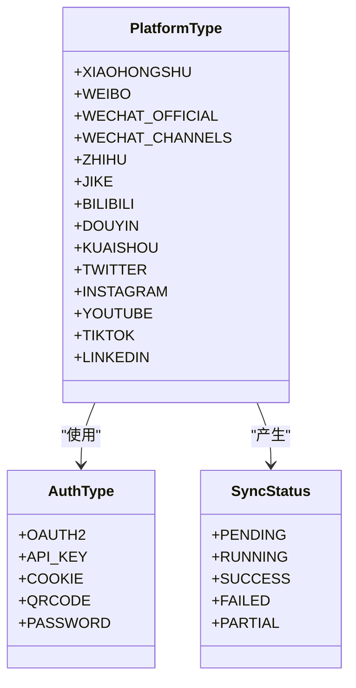

**图表来源**
- [platform_connector.py](file://open_notebook/domain/platform_connector.py#L32-L66)

### 数据模型

系统定义了标准化的数据模型来表示不同平台的内容：

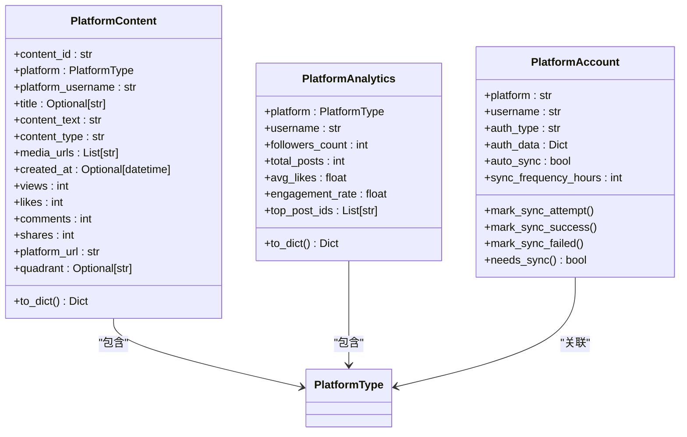

**图表来源**
- [platform_connector.py](file://open_notebook/domain/platform_connector.py#L68-L246)

**章节来源**
- [platform_connector.py](file://open_notebook/domain/platform_connector.py#L32-L246)

## 架构概览

平台连接器系统采用分层架构设计，确保了良好的可扩展性和维护性：

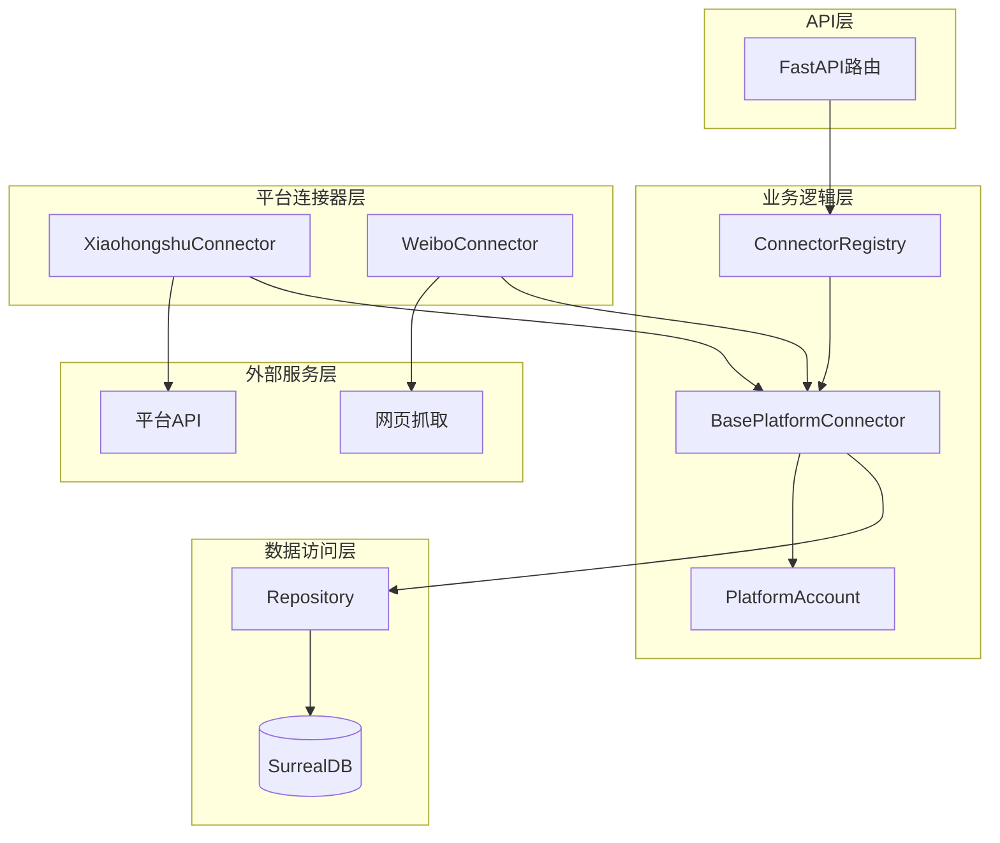

**图表来源**
- [platform_accounts.py](file://api/routers/platform_accounts.py#L89-L141)
- [platform_connector.py](file://open_notebook/domain/platform_connector.py#L315-L354)
- [repository.py](file://open_notebook/database/repository.py#L65-L83)

### 连接器注册机制

系统使用注册表模式来管理不同平台的连接器：

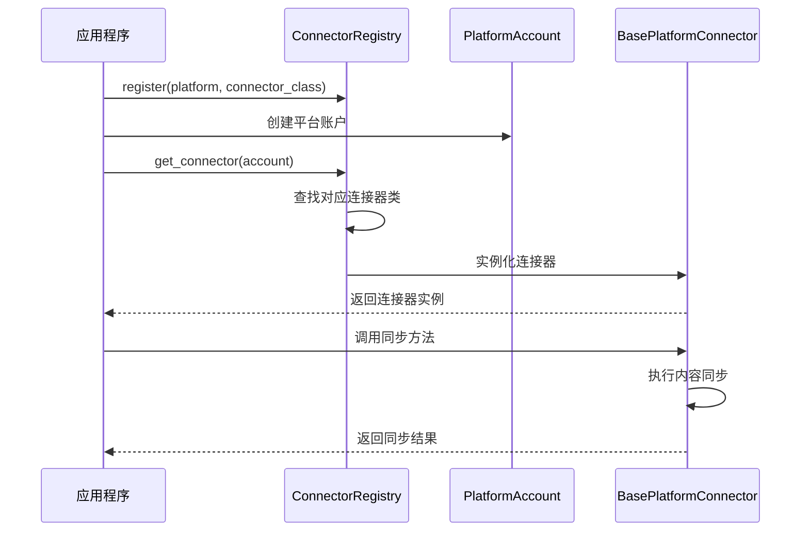

**图表来源**
- [platform_connector.py](file://open_notebook/domain/platform_connector.py#L395-L418)

**章节来源**
- [platform_connector.py](file://open_notebook/domain/platform_connector.py#L395-L418)

## 详细组件分析

### XiaohongshuConnector 分析

XiaohongshuConnector 是系统中最复杂的连接器之一，实现了完整的数据同步功能：

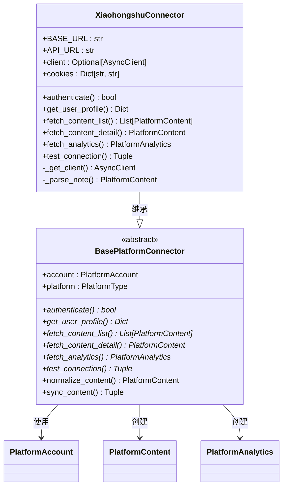

**图表来源**
- [xiaohongshu_connector.py](file://open_notebook/skills/connectors/xiaohongshu_connector.py#L32-L311)
- [platform_connector.py](file://open_notebook/domain/platform_connector.py#L315-L354)

#### 同步流程

XiaohongshuConnector 的内容同步流程如下：

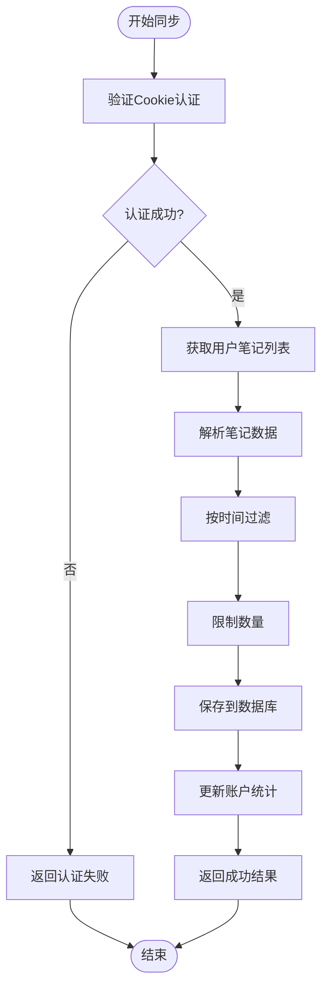

**图表来源**
- [xiaohongshu_connector.py](file://open_notebook/skills/connectors/xiaohongshu_connector.py#L127-L188)
- [platform_connector.py](file://open_notebook/domain/platform_connector.py#L368-L392)

**章节来源**
- [xiaohongshu_connector.py](file://open_notebook/skills/connectors/xiaohongshu_connector.py#L32-L311)

### WeiboConnector 分析

WeiboConnector 提供了微博平台的连接功能，具有相似的架构但针对微博特有的API：

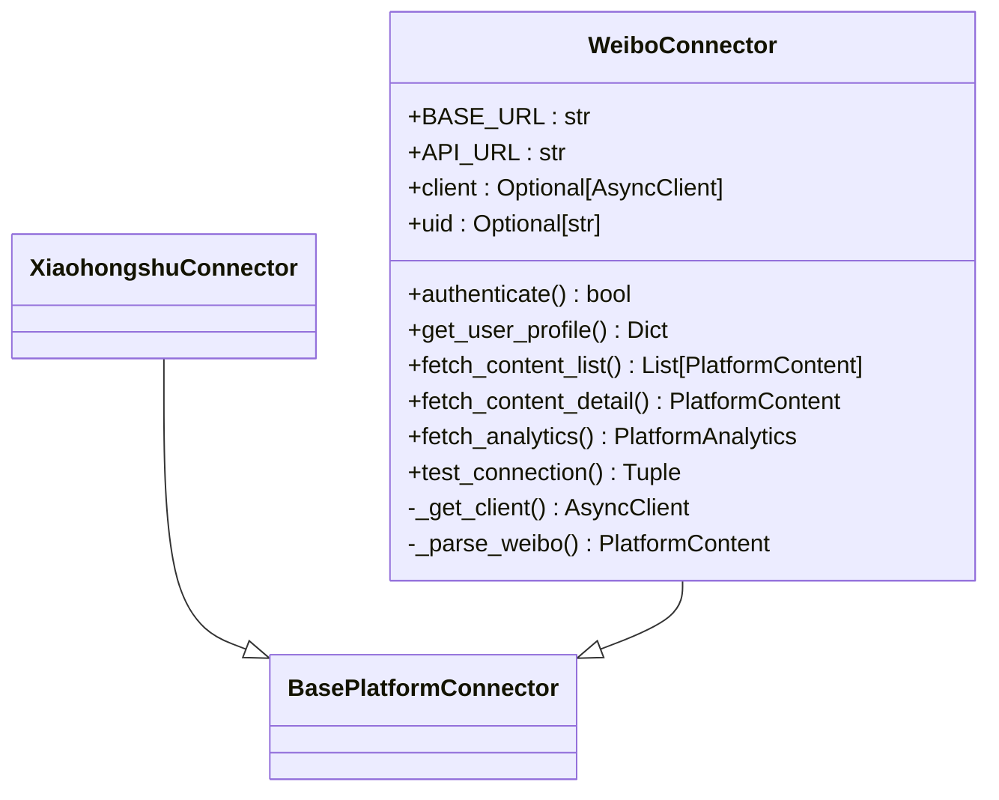

**图表来源**
- [weibo_connector.py](file://open_notebook/skills/connectors/weibo_connector.py#L25-L331)

#### 数据解析算法

微博内容解析包含特殊处理逻辑：

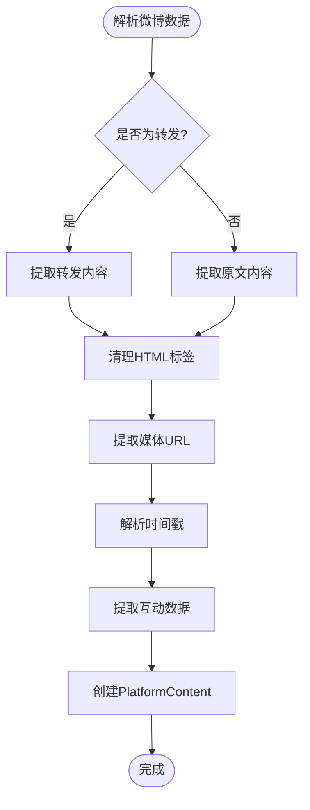

**图表来源**
- [weibo_connector.py](file://open_notebook/skills/connectors/weibo_connector.py#L269-L321)

**章节来源**
- [weibo_connector.py](file://open_notebook/skills/connectors/weibo_connector.py#L25-L331)

### API 接口分析

平台账户管理API提供了完整的账户生命周期管理：

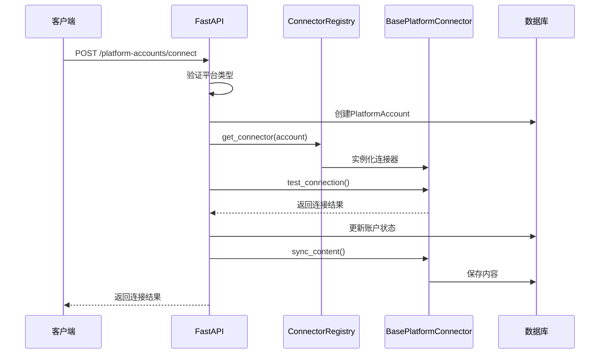

**图表来源**
- [platform_accounts.py](file://api/routers/platform_accounts.py#L89-L141)

**章节来源**
- [platform_accounts.py](file://api/routers/platform_accounts.py#L89-L141)

## 依赖关系分析

平台连接器系统具有清晰的依赖层次结构：

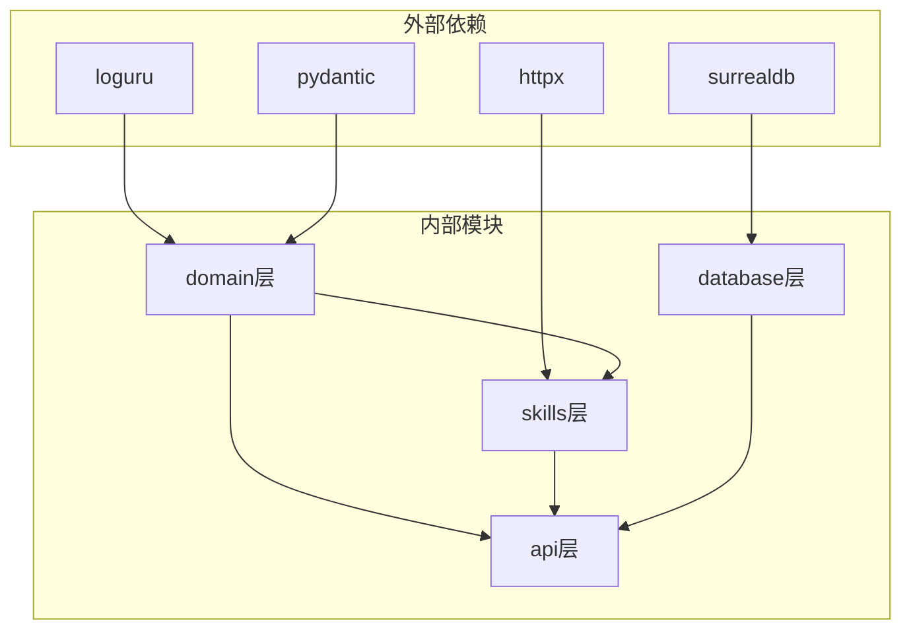

**图表来源**
- [platform_connector.py](file://open_notebook/domain/platform_connector.py#L18-L27)
- [repository.py](file://open_notebook/database/repository.py#L1-L10)

### 数据库集成

系统使用 SurrealDB 作为数据存储后端，通过统一的仓库模式进行访问：

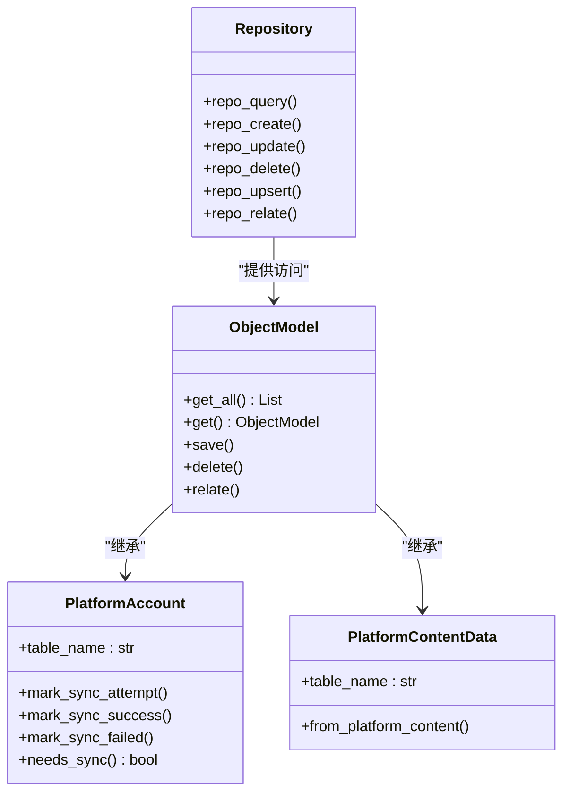

**图表来源**
- [repository.py](file://open_notebook/database/repository.py#L65-L195)
- [base.py](file://open_notebook/domain/base.py#L31-L183)

**章节来源**
- [repository.py](file://open_notebook/database/repository.py#L65-L195)
- [base.py](file://open_notebook/domain/base.py#L31-L183)

## 性能考虑

### 异步处理

系统广泛使用异步编程模式来提高并发性能：

- **HTTP请求异步化**：所有外部API调用都使用 `httpx.AsyncClient`
- **数据库操作异步化**：所有数据库操作都是异步的
- **并发控制**：使用 `asyncio.sleep()` 实现速率限制

### 缓存策略

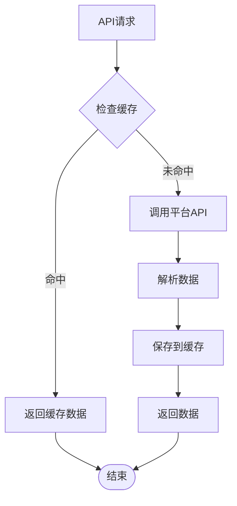

### 错误处理

系统实现了多层次的错误处理机制：

- **连接级错误**：网络超时、认证失败
- **数据级错误**：解析失败、格式不正确
- **业务级错误**：平台限制、配额不足

## 故障排除指南

### 常见问题诊断

1. **认证失败**
   - 检查Cookie是否过期
   - 验证平台API可用性
   - 确认用户权限设置

2. **内容同步失败**
   - 检查平台API限制
   - 验证网络连接稳定性
   - 确认数据库连接正常

3. **速率限制问题**
   - 实现适当的延迟机制
   - 使用指数退避策略
   - 监控API使用情况

### 调试建议

- 启用详细的日志记录
- 实现重试机制
- 监控系统性能指标
- 定期检查平台API变更

**章节来源**
- [weibo_connector.py](file://open_notebook/skills/connectors/weibo_connector.py#L258-L267)
- [xiaohongshu_connector.py](file://open_notebook/skills/connectors/xiaohongshu_connector.py#L255-L264)

## 结论

平台连接器接口为 Open Notebook 系统提供了强大的多平台内容同步能力。通过模块化的架构设计、标准化的数据模型和完善的错误处理机制，系统能够稳定地从各种社交媒体平台获取内容和分析数据。

主要优势包括：
- **高度可扩展**：支持新平台的轻松添加
- **统一接口**：标准化的数据格式便于后续处理
- **健壮性**：完善的错误处理和重试机制
- **性能优化**：异步处理和合理的速率控制

未来可以考虑的改进方向：
- 添加更多平台支持
- 实现更智能的缓存策略
- 增强实时数据同步能力
- 优化大规模数据处理性能