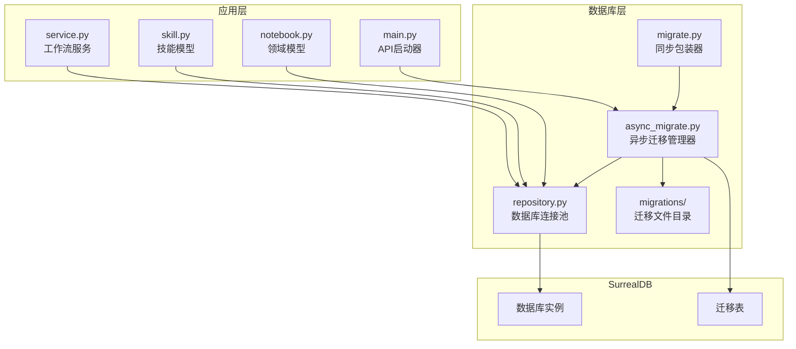
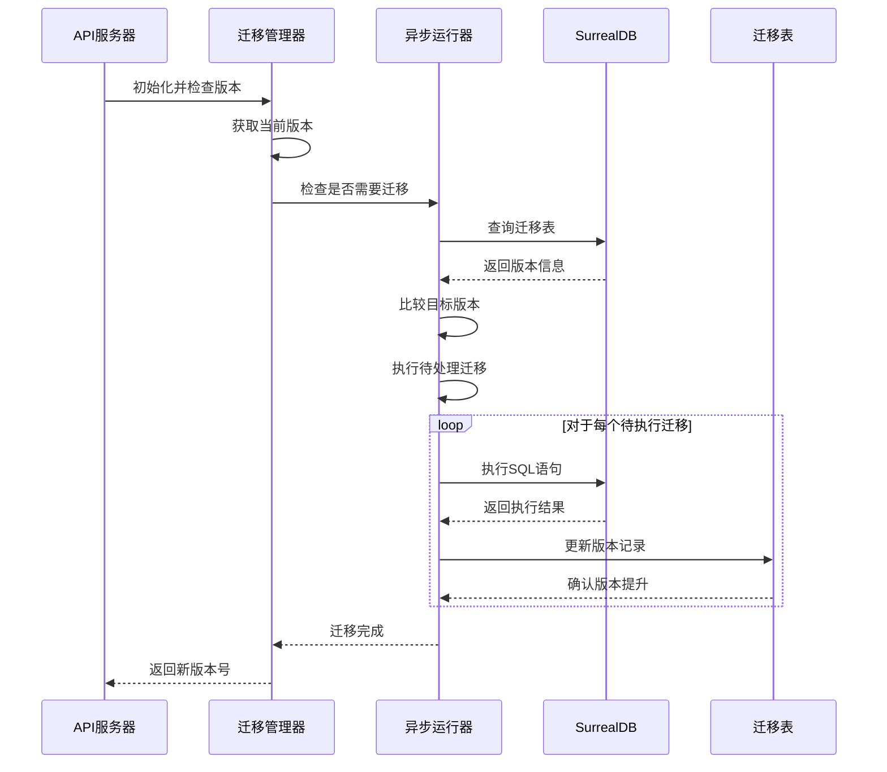
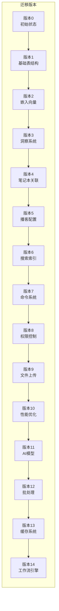
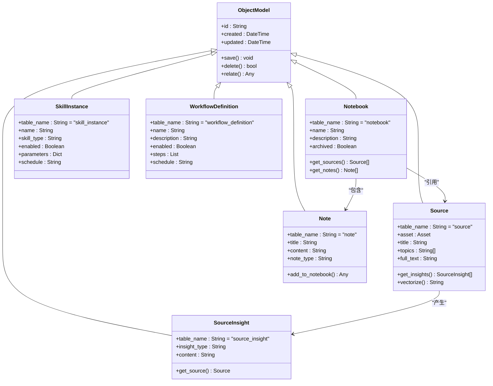
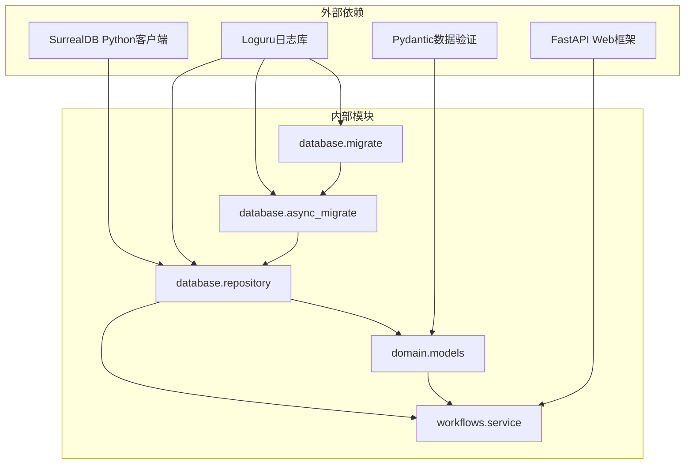

# 数据库Schema更新

<cite>
**本文档引用的文件**
- [migrate.py](file://open_notebook/database/migrate.py)
- [async_migrate.py](file://open_notebook/database/async_migrate.py)
- [repository.py](file://open_notebook/database/repository.py)
- [main.py](file://api/main.py)
- [1.surrealql](file://open_notebook/database/migrations/1.surrealql)
- [10.surrealql](file://open_notebook/database/migrations/10.surrealql)
- [14.surrealql](file://open_notebook/database/migrations/14.surrealql)
- [14_down.surrealql](file://open_notebook/database/migrations/14_down.surrealql)
- [notebook.py](file://open_notebook/domain/notebook.py)
- [skill.py](file://open_notebook/domain/skill.py)
- [service.py](file://open_notebook/workflows/service.py)
</cite>

## 目录
1. [简介](#简介)
2. [项目结构](#项目结构)
3. [核心组件](#核心组件)
4. [架构概览](#架构概览)
5. [详细组件分析](#详细组件分析)
6. [依赖关系分析](#依赖关系分析)
7. [性能考虑](#性能考虑)
8. [故障排除指南](#故障排除指南)
9. [结论](#结论)

## 简介

Open Notebook 项目采用基于 SurrealDB 的异步数据库迁移系统，实现了完整的 Schema 更新管理机制。该系统支持版本化的数据库结构演进，提供向前和向后兼容的迁移功能，确保应用在不同版本间的数据一致性。

系统的核心特性包括：
- 基于文件的版本化迁移（14个版本）
- 异步迁移执行引擎
- 自动版本检测和升级
- 完整的回滚支持
- 性能优化的索引策略

## 项目结构

**图表来源**
- [migrate.py](file://open_notebook/database/migrate.py#L1-L27)
- [async_migrate.py](file://open_notebook/database/async_migrate.py#L1-L235)
- [repository.py](file://open_notebook/database/repository.py#L1-L195)

**章节来源**
- [migrate.py](file://open_notebook/database/migrate.py#L1-L27)
- [async_migrate.py](file://open_notebook/database/async_migrate.py#L1-L235)
- [repository.py](file://open_notebook/database/repository.py#L1-L195)

## 核心组件

### 迁移管理系统

系统采用三层架构的迁移管理：

1. **同步包装器**：提供向后兼容的同步接口
2. **异步迁移管理器**：核心迁移逻辑处理
3. **迁移运行器**：批量执行迁移操作

### 数据库连接层

提供统一的数据库访问接口，支持：
- 自动连接管理
- 记录ID转换
- 查询结果解析
- 错误处理和重试

**章节来源**
- [migrate.py](file://open_notebook/database/migrate.py#L6-L27)
- [async_migrate.py](file://open_notebook/database/async_migrate.py#L91-L195)
- [repository.py](file://open_notebook/database/repository.py#L47-L83)

## 架构概览

**图表来源**
- [main.py](file://api/main.py#L51-L93)
- [async_migrate.py](file://open_notebook/database/async_migrate.py#L180-L195)
- [async_migrate.py](file://open_notebook/database/async_migrate.py#L220-L235)

## 详细组件分析

### 迁移文件结构

系统包含14个主要迁移文件，每个文件对应一个数据库版本：

**图表来源**
- [async_migrate.py](file://open_notebook/database/async_migrate.py#L98-L121)
- [async_migrate.py](file://open_notebook/database/async_migrate.py#L122-L165)

### 版本14：工作流引擎迁移

版本14引入了完整的工作流管理系统，包含以下核心表结构：

#### 工作流定义表 (workflow_definition)
- 名称和描述字段
- 步骤定义数组（包含类型、参数、依赖关系）
- 调度配置和目标笔记本
- 输入输出模式定义

#### 工作流执行表 (workflow_execution)
- 执行状态跟踪（pending、running、success、failed）
- 步骤执行历史和结果
- 错误处理和重试机制
- 性能监控指标

**章节来源**
- [14.surrealql](file://open_notebook/database/migrations/14.surrealql#L1-L65)
- [14_down.surrealql](file://open_notebook/database/migrations/14_down.surrealql#L1-L6)

### 性能优化迁移

版本10特别关注查询性能优化：

#### 新增索引
- `idx_source_insight_source`: 加速洞察查询
- `idx_source_embedding_source`: 加速嵌入向量查询

#### 字段增强
- 为源洞察添加嵌入向量字段
- 为笔记添加嵌入向量字段
- 清理孤立记录

**章节来源**
- [10.surrealql](file://open_notebook/database/migrations/10.surrealql#L1-L14)

### 数据模型类图

**图表来源**
- [notebook.py](file://open_notebook/domain/notebook.py#L16-L679)
- [skill.py](file://open_notebook/domain/skill.py#L17-L162)

**章节来源**
- [notebook.py](file://open_notebook/domain/notebook.py#L16-L679)
- [skill.py](file://open_notebook/domain/skill.py#L17-L162)

## 依赖关系分析

**图表来源**
- [async_migrate.py](file://open_notebook/database/async_migrate.py#L1-L11)
- [repository.py](file://open_notebook/database/repository.py#L1-L10)

**章节来源**
- [async_migrate.py](file://open_notebook/database/async_migrate.py#L1-L11)
- [repository.py](file://open_notebook/database/repository.py#L1-L10)

## 性能考虑

### 索引策略

系统采用多层索引策略优化查询性能：

1. **全文搜索索引**：为标题、内容建立BM25搜索引擎
2. **向量相似度索引**：支持高效的嵌入向量相似度计算
3. **关系索引**：优化多对多关系查询
4. **并发索引**：使用CONCURRENTLY关键字避免阻塞

### 连接池管理

数据库连接采用异步上下文管理器：
- 自动连接创建和关闭
- 连接池复用
- 异常安全的资源清理

### 查询优化

- 使用预编译查询减少解析开销
- 批量操作减少网络往返
- 条件查询避免不必要的数据传输

## 故障排除指南

### 常见迁移问题

1. **迁移失败**：检查数据库连接配置和权限
2. **版本不匹配**：确认迁移文件完整性
3. **索引冲突**：使用CONCURRENTLY关键字重建索引

### 错误处理机制

系统提供多层次的错误处理：
- 迁移异常捕获和日志记录
- 自动回滚支持
- 事务冲突重试机制

**章节来源**
- [async_migrate.py](file://open_notebook/database/async_migrate.py#L47-L49)
- [repository.py](file://open_notebook/database/repository.py#L76-L82)

## 结论

Open Notebook 的数据库Schema更新系统展现了现代应用的数据库演进最佳实践。通过版本化的迁移文件、异步执行引擎和完善的错误处理机制，系统确保了数据结构演进的安全性和可靠性。

关键优势包括：
- **向后兼容性**：同步包装器确保现有代码无需修改
- **性能优化**：精心设计的索引策略和查询优化
- **可维护性**：清晰的迁移文件组织和版本管理
- **可靠性**：完整的错误处理和回滚支持

该系统为后续的功能扩展提供了坚实的基础，特别是工作流引擎和技能调度系统的集成，为构建复杂的AI辅助研究工具奠定了数据层面的技术基础。