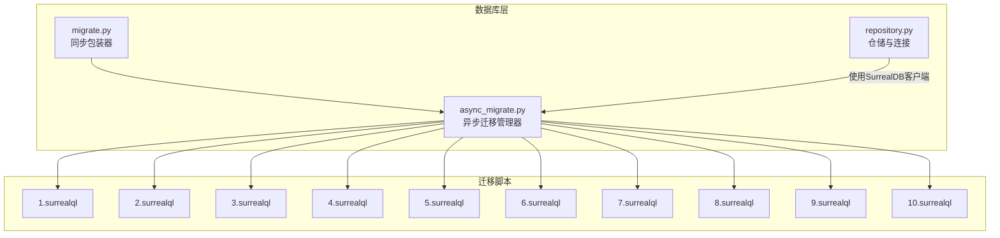
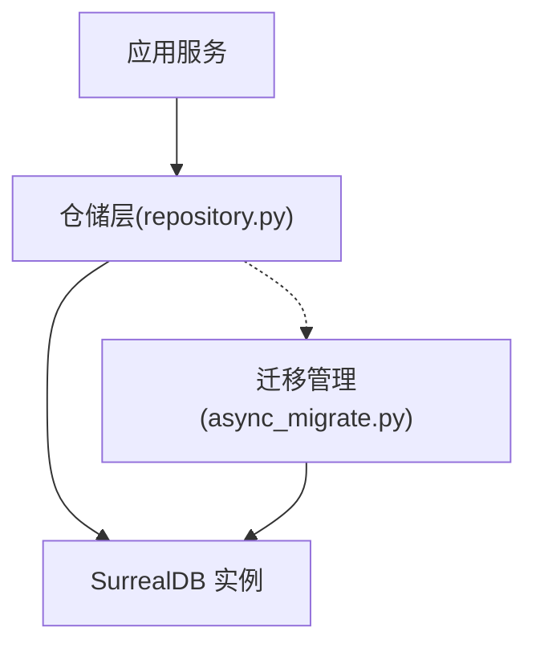
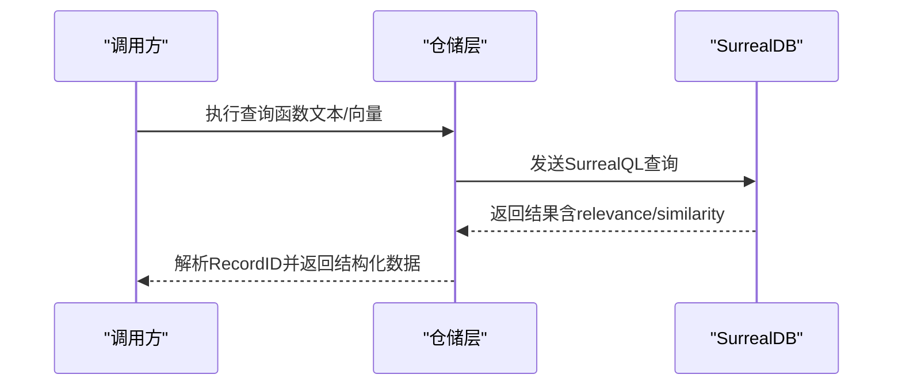
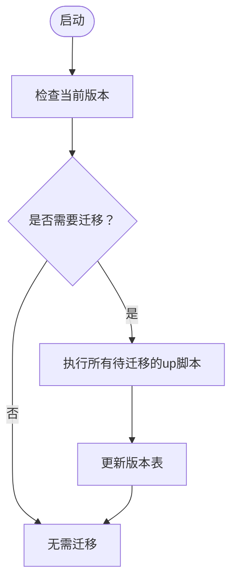
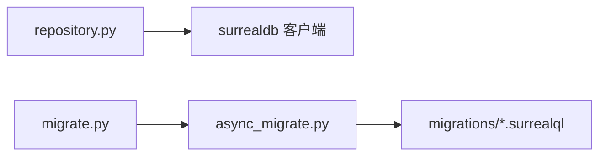

# 数据库架构

<cite>
**本文引用的文件**
- [open_notebook/database/repository.py](file://open_notebook/database/repository.py)
- [open_notebook/database/async_migrate.py](file://open_notebook/database/async_migrate.py)
- [open_notebook/database/migrate.py](file://open_notebook/database/migrate.py)
- [open_notebook/database/migrations/1.surrealql](file://open_notebook/database/migrations/1.surrealql)
- [open_notebook/database/migrations/2.surrealql](file://open_notebook/database/migrations/2.surrealql)
- [open_notebook/database/migrations/3.surrealql](file://open_notebook/database/migrations/3.surrealql)
- [open_notebook/database/migrations/4.surrealql](file://open_notebook/database/migrations/4.surrealql)
- [open_notebook/database/migrations/5.surrealql](file://open_notebook/database/migrations/5.surrealql)
- [open_notebook/database/migrations/6.surrealql](file://open_notebook/database/migrations/6.surrealql)
- [open_notebook/database/migrations/7.surrealql](file://open_notebook/database/migrations/7.surrealql)
- [open_notebook/database/migrations/8.surrealql](file://open_notebook/database/migrations/8.surrealql)
- [open_notebook/database/migrations/9.surrealql](file://open_notebook/database/migrations/9.surrealql)
- [open_notebook/database/migrations/10.surrealql](file://open_notebook/database/migrations/10.surrealql)
- [docs/5-CONFIGURATION/database.md](file://docs/5-CONFIGURATION/database.md)
- [.env.example](file://.env.example)
- [pyproject.toml](file://pyproject.toml)
</cite>

## 目录
1. [简介](#简介)
2. [项目结构](#项目结构)
3. [核心组件](#核心组件)
4. [架构总览](#架构总览)
5. [详细组件分析](#详细组件分析)
6. [依赖分析](#依赖分析)
7. [性能考虑](#性能考虑)
8. [故障排查指南](#故障排查指南)
9. [结论](#结论)
10. [附录](#附录)

## 简介
本文件系统性梳理 Open Notebook 使用的数据库架构，聚焦 SurrealDB 的整体设计、表结构与模式、索引与约束、查询函数、初始化与迁移历史，并给出 Schema 图与 ER 图、数据类型映射与完整性规则、查询优化策略、备份恢复与维护建议，以及多租户与数据隔离机制说明。内容基于仓库中的数据库迁移脚本、异步迁移管理器与通用仓储层实现。

## 项目结构
数据库相关代码集中在 open_notebook/database 目录，包含：
- 迁移管理：同步包装器与异步迁移管理器
- 迁移脚本：按版本号组织的 .surrealql 文件（up/down）
- 仓储层：统一的数据库连接、查询、CRUD 封装



**图表来源**
- [open_notebook/database/repository.py](file://open_notebook/database/repository.py#L47-L63)
- [open_notebook/database/async_migrate.py](file://open_notebook/database/async_migrate.py#L91-L163)
- [open_notebook/database/migrate.py](file://open_notebook/database/migrate.py#L6-L27)

**章节来源**
- [open_notebook/database/repository.py](file://open_notebook/database/repository.py#L1-L195)
- [open_notebook/database/async_migrate.py](file://open_notebook/database/async_migrate.py#L1-L229)
- [open_notebook/database/migrate.py](file://open_notebook/database/migrate.py#L1-L27)

## 核心组件
- 数据库连接与会话管理：通过环境变量获取连接信息，登录后选择命名空间与数据库，提供上下文管理器确保连接释放。
- 仓储层：封装查询、插入、更新、删除、关联等常用操作；统一处理 RecordID 类型转换；对错误进行分类记录与抛出。
- 异步迁移管理：按版本顺序执行 up/down 脚本；维护内部版本表用于判断当前版本与是否需要迁移；提供单步上/下滚能力。
- 同步包装器：为兼容旧用法提供同步接口，内部委托给异步管理器。

**章节来源**
- [open_notebook/database/repository.py](file://open_notebook/database/repository.py#L12-L63)
- [open_notebook/database/repository.py](file://open_notebook/database/repository.py#L65-L195)
- [open_notebook/database/async_migrate.py](file://open_notebook/database/async_migrate.py#L91-L189)
- [open_notebook/database/migrate.py](file://open_notebook/database/migrate.py#L6-L27)

## 架构总览
SurrealDB 在本项目中承担全文检索、向量相似度检索、结构化数据存储与关系建模的职责。应用通过仓储层执行 SurrealQL 查询，迁移系统保证模式演进与版本控制，查询函数提供搜索与相似度检索能力。



**图表来源**
- [open_notebook/database/repository.py](file://open_notebook/database/repository.py#L47-L63)
- [open_notebook/database/async_migrate.py](file://open_notebook/database/async_migrate.py#L191-L229)

## 详细组件分析

### 表结构与模式（Schema）概览
以下表在初始迁移中定义，后续版本通过字段增强、索引与关系调整逐步完善：

- 源（source）：存放内容资产元数据与全文；具备标题、主题、全文字段；带创建/更新时间戳。
- 源嵌入（source_embedding）：按分块存储的文本及其向量表示，建立内容到源的记录关系。
- 源洞察（source_insight）：从源提取的洞察文本与向量表示，同样与源建立记录关系。
- 笔记（note）：用户笔记，支持标题、摘要、内容与向量表示。
- 笔记本（notebook）：容器对象，可归档。
- 关系（reference/artifact）：source→notebook、note→notebook 的多对多关系。
- 聊天会话（chat_session）：与笔记本或源关联，支持模型覆盖字段。
- 变换（transformation）：预置的文本变换模板与默认提示。
- 剧集配置（episode_profile）、讲者配置（speaker_profile）、剧集（episode）：播客功能相关表。
- 默认模型/提示（open_notebook:*）：命名空间下的键值配置。

上述表均采用 SchemaFULL 或 SCHEMALESS 定义，部分表在后续版本中引入了更严格的字段类型与默认值。

**章节来源**
- [open_notebook/database/migrations/1.surrealql](file://open_notebook/database/migrations/1.surrealql#L2-L61)
- [open_notebook/database/migrations/2.surrealql](file://open_notebook/database/migrations/2.surrealql#L1-L2)
- [open_notebook/database/migrations/5.surrealql](file://open_notebook/database/migrations/5.surrealql#L8-L16)
- [open_notebook/database/migrations/7.surrealql](file://open_notebook/database/migrations/7.surrealql#L1-L49)
- [open_notebook/database/migrations/8.surrealql](file://open_notebook/database/migrations/8.surrealql#L5-L12)

### 索引策略与约束
- 全文检索索引：针对 source.title、source.full_text、source_embedding.content、source_insight.content、note.content、note.title 建立基于 BM25 的搜索索引，使用自定义分词器与过滤器，支持高亮。
- 向量相似度：note.embedding、source_insight.embedding、source_embedding.embedding 作为向量字段，配合 cosine 相似度查询。
- 关系与唯一性：episode_profile.name、speaker_profile.name 建立唯一索引；referred_to 关系从 chat_session 指向 notebook 或 source。
- 删除级联：当 source 删除时，自动清理其对应的 source_embedding 与 source_insight 记录。
- 字段默认值与时间戳：多数表具备 created/updated 时间戳，默认值为当前时间。

**章节来源**
- [open_notebook/database/migrations/1.surrealql](file://open_notebook/database/migrations/1.surrealql#L65-L72)
- [open_notebook/database/migrations/1.surrealql](file://open_notebook/database/migrations/1.surrealql#L29-L32)
- [open_notebook/database/migrations/10.surrealql](file://open_notebook/database/migrations/10.surrealql#L5-L6)
- [open_notebook/database/migrations/7.surrealql](file://open_notebook/database/migrations/7.surrealql#L45-L48)

### 查询函数与检索策略
- 文本检索函数：整合标题、分块、全文、洞察等维度的 BM25 检索结果，按相关度排序并去重返回。
- 向量检索函数：基于 cosine 相似度筛选满足阈值的结果，按相似度排序并去重返回。
- 版本演进：早期版本仅提供单一函数，后续版本增加字段、高亮、去重与匹配内容聚合。



**图表来源**
- [open_notebook/database/repository.py](file://open_notebook/database/repository.py#L65-L83)
- [open_notebook/database/migrations/3.surrealql](file://open_notebook/database/migrations/3.surrealql#L10-L73)
- [open_notebook/database/migrations/4.surrealql](file://open_notebook/database/migrations/4.surrealql#L5-L70)
- [open_notebook/database/migrations/9.surrealql](file://open_notebook/database/migrations/9.surrealql#L4-L66)

**章节来源**
- [open_notebook/database/migrations/3.surrealql](file://open_notebook/database/migrations/3.surrealql#L10-L73)
- [open_notebook/database/migrations/4.surrealql](file://open_notebook/database/migrations/4.surrealql#L5-L70)
- [open_notebook/database/migrations/9.surrealql](file://open_notebook/database/migrations/9.surrealql#L4-L66)

### 数据类型映射与完整性规则
- 类型映射（示例）：字符串、数组、整数、可选对象、记录引用、向量数组等。
- 完整性规则：唯一索引、外键记录引用、事件触发器自动清理、默认值与时间戳一致性。
- 字段约束：部分字段为必填（如 transformation.name/title/description/prompt），部分为可选（如 note.note_type、note.embedding）。

**章节来源**
- [open_notebook/database/migrations/1.surrealql](file://open_notebook/database/migrations/1.surrealql#L4-L26)
- [open_notebook/database/migrations/2.surrealql](file://open_notebook/database/migrations/2.surrealql#L1-L2)
- [open_notebook/database/migrations/5.surrealql](file://open_notebook/database/migrations/5.surrealql#L10-L16)
- [open_notebook/database/migrations/7.surrealql](file://open_notebook/database/migrations/7.surrealql#L1-L27)

### 初始化脚本与迁移历史
- 初始化：首次运行时由迁移管理器加载各版本脚本，逐个执行 up 脚本，维护内部版本表。
- 迁移历史：版本 1 至 13，包含模式定义、索引、函数、关系与数据填充等。
- 回滚：提供 down 脚本与回滚管理能力，按需逐版本回退。



**图表来源**
- [open_notebook/database/async_migrate.py](file://open_notebook/database/async_migrate.py#L169-L189)
- [open_notebook/database/async_migrate.py](file://open_notebook/database/async_migrate.py#L191-L229)

**章节来源**
- [open_notebook/database/async_migrate.py](file://open_notebook/database/async_migrate.py#L91-L189)
- [open_notebook/database/migrate.py](file://open_notebook/database/migrate.py#L15-L26)

### 多租户与数据隔离
- 命名空间与数据库：通过环境变量指定命名空间与数据库，不同部署可共享实例但隔离在不同命名空间/数据库。
- 多数据库支持：可在同一实例内使用多个命名空间与数据库，便于多租户场景。
- 隔离建议：生产环境建议为不同租户分配独立命名空间/数据库，结合访问控制与网络隔离进一步强化。

**章节来源**
- [docs/5-CONFIGURATION/database.md](file://docs/5-CONFIGURATION/database.md#L16-L50)
- [.env.example](file://.env.example#L16-L21)

## 依赖分析
- 运行时依赖：Python 包 surrealdb 指定版本，确保与官方客户端兼容。
- 组件耦合：仓储层对 SurrealDB 客户端有直接依赖；迁移管理器对迁移脚本路径强依赖；同步包装器对异步管理器弱依赖。



**图表来源**
- [pyproject.toml](file://pyproject.toml#L39-L39)
- [open_notebook/database/repository.py](file://open_notebook/database/repository.py#L7-L7)
- [open_notebook/database/async_migrate.py](file://open_notebook/database/async_migrate.py#L98-L159)

**章节来源**
- [pyproject.toml](file://pyproject.toml#L15-L43)

## 性能考虑
- 全文检索：BM25 索引与自定义分词器提升检索质量；高亮字段减少前端二次处理成本。
- 向量检索：限制向量维度一致性与最小相似度阈值，避免无效匹配；对空向量与长度不一致进行过滤。
- 索引优化：为 source_embedding/source_insight 的 source 字段建立索引，加速按源统计与存在性检查。
- 并发与冲突：仓储层对事务冲突与并发写入进行日志降噪与重试友好处理。

**章节来源**
- [open_notebook/database/migrations/1.surrealql](file://open_notebook/database/migrations/1.surrealql#L65-L72)
- [open_notebook/database/migrations/9.surrealql](file://open_notebook/database/migrations/9.surrealql#L14-L15)
- [open_notebook/database/migrations/10.surrealql](file://open_notebook/database/migrations/10.surrealql#L5-L6)
- [open_notebook/database/repository.py](file://open_notebook/database/repository.py#L76-L82)

## 故障排查指南
- 连接失败：检查环境变量（URL、用户名、密码、命名空间、数据库）是否正确；确认容器间网络可达。
- 迁移异常：查看迁移日志与错误堆栈；确认迁移脚本语法与版本表状态；必要时手动回滚至前一版本。
- 冲突与重试：仓储层对“事务冲突”类错误进行调试级别日志输出，避免噪声；若持续出现，检查并发写入策略。
- 记录ID解析：确保 RecordID 在入库/更新时被正确解析为字符串标识，避免跨模块类型不一致。

**章节来源**
- [open_notebook/database/repository.py](file://open_notebook/database/repository.py#L12-L27)
- [open_notebook/database/repository.py](file://open_notebook/database/repository.py#L76-L82)
- [open_notebook/database/async_migrate.py](file://open_notebook/database/async_migrate.py#L47-L49)

## 结论
本项目的数据库架构以 SurrealDB 为核心，结合仓储层与异步迁移系统，实现了从模式定义、索引与约束、全文与向量检索函数到版本演进与多租户隔离的完整闭环。通过明确的数据类型映射、严格的完整性规则与针对性的性能优化策略，系统在检索与相似度匹配方面具备良好表现。建议在生产环境中配合独立命名空间/数据库、完善的备份与监控策略，确保稳定性与可维护性。

## 附录

### 数据库 Schema 图（概念示意）
```mermaid
erDiagram
SOURCE {
string id PK
string title
string[] topics
string full_text
object asset
datetime created
datetime updated
}
SOURCE_EMBEDDING {
string id PK
record SOURCE source FK
int order
string content
float[] embedding
}
SOURCE_INSIGHT {
string id PK
record SOURCE source FK
string insight_type
string content
float[] embedding
}
NOTE {
string id PK
string title
string summary
string content
float[] embedding
datetime created
datetime updated
}
NOTEBOOK {
string id PK
string name
string description
bool archived
datetime created
datetime updated
}
TRANSFORMATION {
string id PK
string name
string title
string description
string prompt
bool apply_default
datetime created
datetime updated
}
EPISODE_PROFILE {
string id PK
string name UK
string description
string speaker_config
string outline_provider
string outline_model
string transcript_provider
string transcript_model
string default_briefing
int num_segments
datetime created
datetime updated
}
SPEAKER_PROFILE {
string id PK
string name UK
string description
string tts_provider
string tts_model
object[] speakers
datetime created
datetime updated
}
EPISODE {
string id PK
string name
string briefing
object episode_profile
object speaker_profile
object transcript
object outline
record COMMAND command
string content
string audio_file
datetime created
datetime updated
}
CHAT_SESSION {
string id PK
string model_override
record NOTEBOOK|SOURCE refers_to
}
REFERENCE {
string id PK
}
ARTIFACT {
string id PK
}
SOURCE }o--|| SOURCE_EMBEDDING : "包含"
SOURCE }o--o| SOURCE_INSIGHT : "生成"
NOTEBOOK ||--o{ REFERENCE : "引用"
SOURCE ||--o{ REFERENCE : "被引用"
NOTEBOOK ||--o{ ARTIFACT : "包含"
NOTE ||--o{ ARTIFACT : "归属"
EPISODE_PROFILE ||--o{ EPISODE : "配置"
SPEAKER_PROFILE ||--o{ EPISODE : "驱动"
CHAT_SESSION ||--o{ NOTEBOOK : "关联"
CHAT_SESSION ||--o{ SOURCE : "关联"
```

### 迁移版本一览（节选）
- 版本 1：基础表与全文索引、事件触发器、文本/向量检索函数初版
- 版本 2：为 note 增加 note_type 字段
- 版本 3：增强向量检索函数，加入高亮与最小相似度阈值
- 版本 4：再次优化文本检索函数，修正字段与高亮逻辑
- 版本 5：新增 transformation 表与默认模板数据
- 版本 6：模型提供商标识更新
- 版本 7：播客相关表与索引、示例数据
- 版本 8：referred_to 关系扩展为多态，chat_session 新增字段
- 版本 9：向量检索函数增强维度一致性校验
- 版本 10：为 source_embedding/source_insight 建立 source 字段索引，修正 embedding 字段类型并清理孤儿记录

**章节来源**
- [open_notebook/database/migrations/1.surrealql](file://open_notebook/database/migrations/1.surrealql#L1-L179)
- [open_notebook/database/migrations/2.surrealql](file://open_notebook/database/migrations/2.surrealql#L1-L2)
- [open_notebook/database/migrations/3.surrealql](file://open_notebook/database/migrations/3.surrealql#L1-L146)
- [open_notebook/database/migrations/4.surrealql](file://open_notebook/database/migrations/4.surrealql#L1-L134)
- [open_notebook/database/migrations/5.surrealql](file://open_notebook/database/migrations/5.surrealql#L1-L170)
- [open_notebook/database/migrations/6.surrealql](file://open_notebook/database/migrations/6.surrealql#L1-L1)
- [open_notebook/database/migrations/7.surrealql](file://open_notebook/database/migrations/7.surrealql#L1-L153)
- [open_notebook/database/migrations/8.surrealql](file://open_notebook/database/migrations/8.surrealql#L1-L12)
- [open_notebook/database/migrations/9.surrealql](file://open_notebook/database/migrations/9.surrealql#L1-L66)
- [open_notebook/database/migrations/10.surrealql](file://open_notebook/database/migrations/10.surrealql#L1-L14)