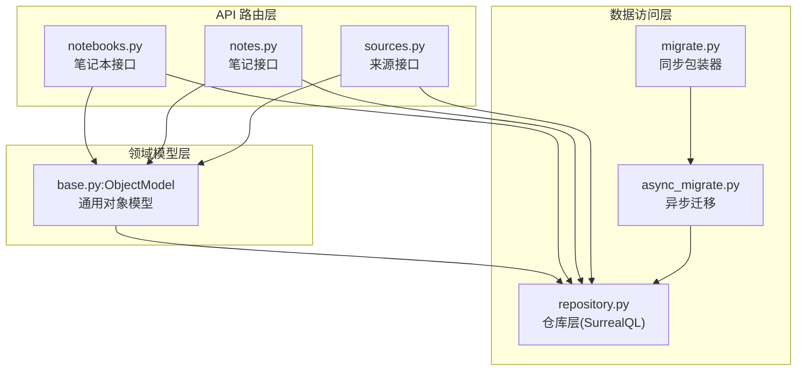
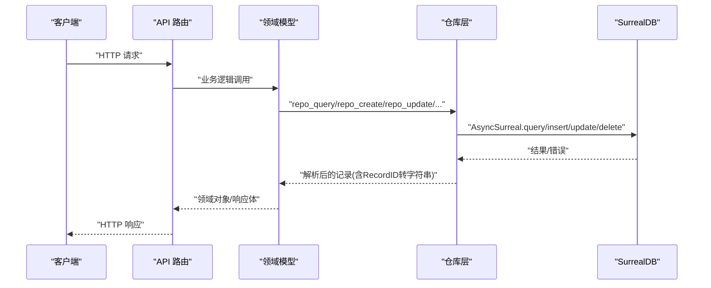
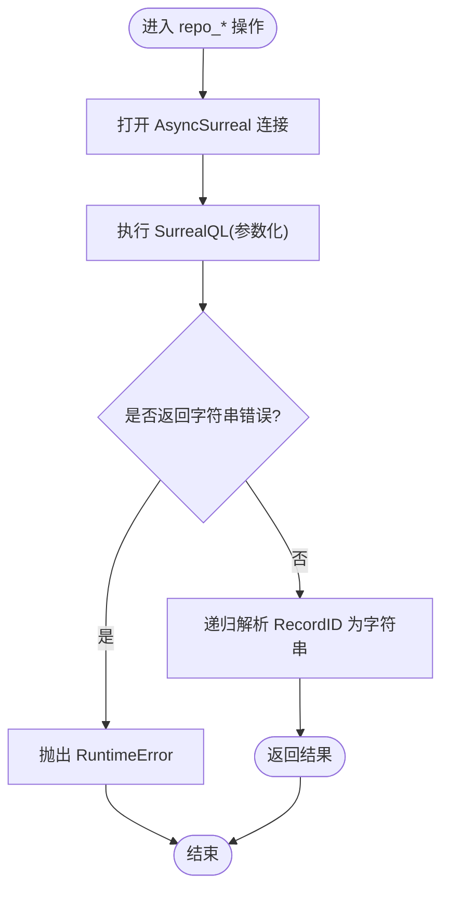
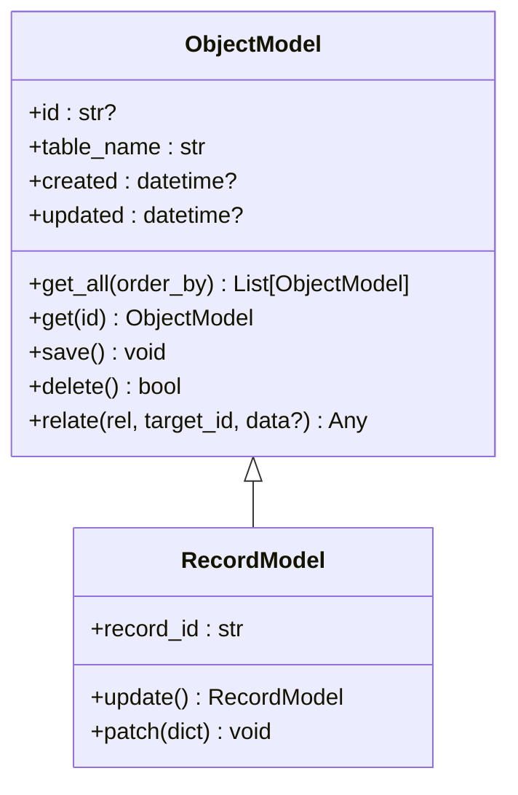
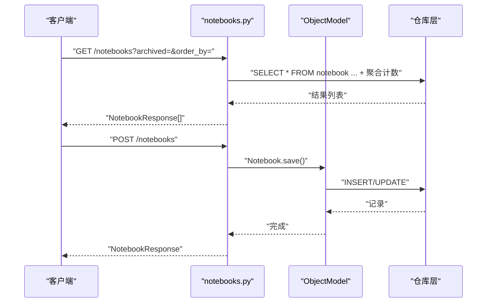
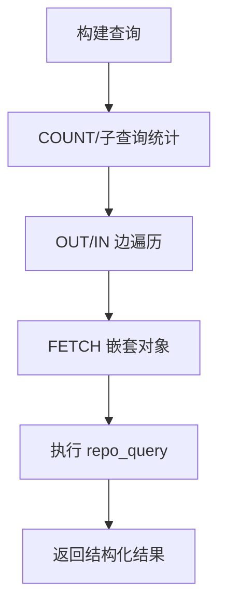
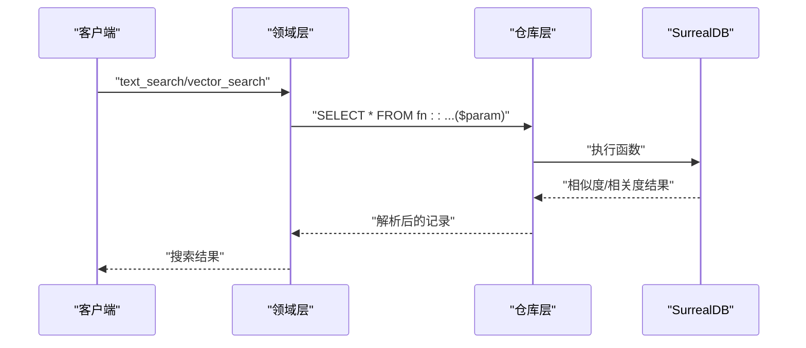
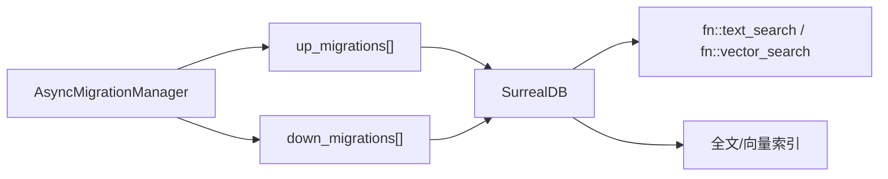
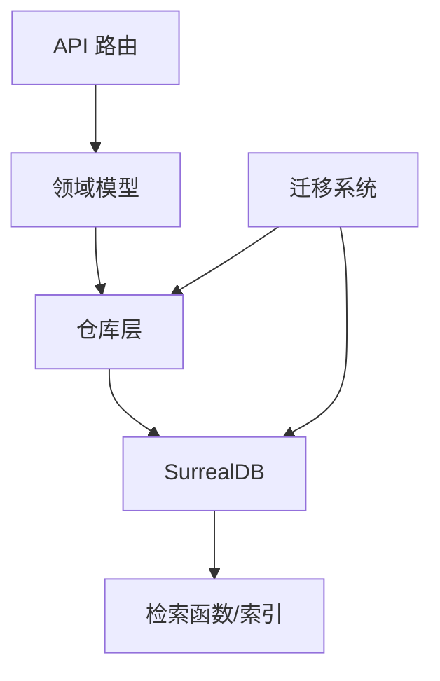

# 查询操作

<cite>
**本文引用的文件**
- [repository.py](file://open_notebook/database/repository.py)
- [async_migrate.py](file://open_notebook/database/async_migrate.py)
- [migrate.py](file://open_notebook/database/migrate.py)
- [1.surrealql](file://open_notebook/database/migrations/1.surrealql)
- [2.surrealql](file://open_notebook/database/migrations/2.surrealql)
- [base.py](file://open_notebook/domain/base.py)
- [notebooks.py](file://api/routers/notebooks.py)
- [notes.py](file://api/routers/notes.py)
- [sources.py](file://api/routers/sources.py)
- [search.md](file://docs/3-USER-GUIDE/search.md)
</cite>

## 目录
1. [简介](#简介)
2. [项目结构](#项目结构)
3. [核心组件](#核心组件)
4. [架构总览](#架构总览)
5. [详细组件分析](#详细组件分析)
6. [依赖关系分析](#依赖关系分析)
7. [性能考量](#性能考量)
8. [故障排查指南](#故障排查指南)
9. [结论](#结论)
10. [附录](#附录)

## 简介
本文件系统性梳理数据库查询与操作体系，围绕 SurrealDB 的 SurrealQL 语言，结合仓库层（Repository）与领域模型（Domain），完整覆盖 CRUD 操作、复杂查询、联表查询、聚合统计、全文/向量检索函数、迁移管理、批量与幂等写入、并发冲突处理、结果解析与错误处理等主题，并给出可操作的最佳实践与优化建议。

## 项目结构
数据库相关能力主要由三层构成：
- 数据访问层：仓库层（Repository）封装连接、参数化查询、记录 ID 转换与错误处理
- 领域模型层：基于对象模型的 CRUD 与关系管理，向上提供业务语义
- API 路由层：对外暴露 REST 接口，组合仓库与领域模型完成端到端流程

图表来源
- [notebooks.py](file://api/routers/notebooks.py#L1-L328)
- [notes.py](file://api/routers/notes.py#L1-L188)
- [sources.py](file://api/routers/sources.py#L1-L1020)
- [base.py](file://open_notebook/domain/base.py#L1-L329)
- [repository.py](file://open_notebook/database/repository.py#L1-L195)
- [async_migrate.py](file://open_notebook/database/async_migrate.py#L1-L229)
- [migrate.py](file://open_notebook/database/migrate.py#L1-L27)

章节来源
- [repository.py](file://open_notebook/database/repository.py#L1-L195)
- [base.py](file://open_notebook/domain/base.py#L1-L329)
- [notebooks.py](file://api/routers/notebooks.py#L1-L328)
- [notes.py](file://api/routers/notes.py#L1-L188)
- [sources.py](file://api/routers/sources.py#L1-L1020)
- [async_migrate.py](file://open_notebook/database/async_migrate.py#L1-L229)
- [migrate.py](file://open_notebook/database/migrate.py#L1-L27)

## 核心组件
- 仓库层（Repository）
  - 连接管理：统一的异步连接上下文，支持环境变量配置与兼容旧格式
  - 原始查询：参数化执行任意 SurrealQL，返回结构化结果并递归解析 RecordID
  - 写操作：插入、批量插入、更新、Upsert、删除、建立关系
  - 并发与错误：对事务冲突进行可重试处理，日志分级，异常上抛
- 领域模型（ObjectModel）
  - 统一 CRUD：保存、删除、按 ID 获取、全表获取、多态解析
  - 关系管理：通过 RELATE 语法建立图关系
  - 数据验证与时间戳：Pydantic 校验、自动 created/updated 时间
- 迁移系统（AsyncMigrationManager）
  - 异步迁移执行、版本跟踪、回滚支持
  - 通过内置函数与索引定义支撑全文与向量检索

章节来源
- [repository.py](file://open_notebook/database/repository.py#L47-L195)
- [base.py](file://open_notebook/domain/base.py#L31-L329)
- [async_migrate.py](file://open_notebook/database/async_migrate.py#L91-L229)

## 架构总览
下图展示从 API 到数据库的关键调用链路与职责边界：

图表来源
- [notebooks.py](file://api/routers/notebooks.py#L20-L215)
- [notes.py](file://api/routers/notes.py#L13-L170)
- [sources.py](file://api/routers/sources.py#L152-L792)
- [base.py](file://open_notebook/domain/base.py#L38-L196)
- [repository.py](file://open_notebook/database/repository.py#L65-L195)

## 详细组件分析

### 仓库层（Repository）与 CRUD 实现
- 连接与认证
  - 通过环境变量解析数据库地址与凭据，支持新旧格式兼容
  - 使用命名空间与数据库选择，确保隔离
- 原始查询与参数化
  - 所有查询均通过参数映射传入，避免拼接注入风险
  - 结果中 RecordID 会被递归转换为字符串，便于序列化
- 写操作
  - 插入：单条与批量；批量可忽略重复键冲突
  - 更新：自动补全 updated 字段；支持 ISO 时间字符串解析
  - Upsert：MERGE 语义，可选更新时间戳
  - 删除：接收 RecordID 或字符串形式
  - 关系：RELATE 语法，支持在关系上附加数据
- 错误与并发
  - 事务冲突以 RuntimeError 抛出，记录 DEBUG 日志，便于上层重试
  - 其他异常记录 ERROR 并重新抛出

图表来源
- [repository.py](file://open_notebook/database/repository.py#L65-L195)

章节来源
- [repository.py](file://open_notebook/database/repository.py#L12-L195)

### 领域模型（ObjectModel）与关系管理
- 多态获取：根据 ID 前缀解析具体子类，支持跨表查询后反序列化
- 保存流程：校验 -> 准备数据 -> 创建或更新 -> 合并回实例字段
- 关系建立：RELATE 语法，支持在关系边附加数据
- 记录删除：委托仓库层删除

图表来源
- [base.py](file://open_notebook/domain/base.py#L31-L329)

章节来源
- [base.py](file://open_notebook/domain/base.py#L31-L329)

### API 路由中的查询模式
- 笔记本接口：支持计数聚合、过滤与排序；关系建立/解除
- 笔记接口：按笔记本筛选、标题自动生成、类型校验
- 来源接口：分页、排序、FETCH 命令状态、嵌入与洞察统计

图表来源
- [notebooks.py](file://api/routers/notebooks.py#L20-L215)
- [base.py](file://open_notebook/domain/base.py#L113-L196)
- [repository.py](file://open_notebook/database/repository.py#L85-L156)

章节来源
- [notebooks.py](file://api/routers/notebooks.py#L1-L328)
- [notes.py](file://api/routers/notes.py#L1-L188)
- [sources.py](file://api/routers/sources.py#L152-L792)

### 复杂查询、联表与聚合
- 聚合统计：在路由层直接使用 COUNT/子查询计算关联数量
- 联表查询：通过 OUT/IN 边遍历与 FETCH 嵌套对象
- 自定义函数：迁移脚本中定义文本与向量检索函数，供领域层调用

图表来源
- [notebooks.py](file://api/routers/notebooks.py#L28-L34)
- [sources.py](file://api/routers/sources.py#L186-L195)
- [1.surrealql](file://open_notebook/database/migrations/1.surrealql#L74-L136)

章节来源
- [notebooks.py](file://api/routers/notebooks.py#L20-L215)
- [sources.py](file://api/routers/sources.py#L152-L278)
- [1.surrealql](file://open_notebook/database/migrations/1.surrealql#L28-L73)

### 全文搜索与向量检索
- 全文检索函数：基于 BM25 与高亮，支持标题、全文、片段与洞察
- 向量检索函数：基于余弦相似度，支持最小阈值与结果上限
- 领域层封装：生成查询向量并调用函数，返回去重后的结果

图表来源
- [base.py](file://open_notebook/domain/base.py#L638-L678)
- [1.surrealql](file://open_notebook/database/migrations/1.surrealql#L74-L173)

章节来源
- [base.py](file://open_notebook/domain/base.py#L638-L678)
- [1.surrealql](file://open_notebook/database/migrations/1.surrealql#L74-L173)
- [search.md](file://docs/3-USER-GUIDE/search.md#L77-L131)

### 迁移与索引
- 版本管理：迁移表记录版本号与应用时间，支持 bump/rollback
- 索引定义：全文检索使用 BM25 与分析器，向量检索依赖 embedding 字段
- 函数定义：文本与向量检索函数在迁移中集中维护，便于演进与回滚

图表来源
- [async_migrate.py](file://open_notebook/database/async_migrate.py#L91-L173)
- [1.surrealql](file://open_notebook/database/migrations/1.surrealql#L65-L173)
- [2.surrealql](file://open_notebook/database/migrations/2.surrealql#L1-L2)

章节来源
- [async_migrate.py](file://open_notebook/database/async_migrate.py#L1-L229)
- [migrate.py](file://open_notebook/database/migrate.py#L1-L27)
- [1.surrealql](file://open_notebook/database/migrations/1.surrealql#L1-L179)
- [2.surrealql](file://open_notebook/database/migrations/2.surrealql#L1-L2)

## 依赖关系分析
- API 路由依赖领域模型与仓库层
- 领域模型依赖仓库层进行持久化
- 迁移系统依赖仓库层执行 DDL/DML
- 全文/向量检索函数与索引定义位于迁移脚本

图表来源
- [notebooks.py](file://api/routers/notebooks.py#L1-L328)
- [notes.py](file://api/routers/notes.py#L1-L188)
- [sources.py](file://api/routers/sources.py#L1-L1020)
- [base.py](file://open_notebook/domain/base.py#L1-L329)
- [repository.py](file://open_notebook/database/repository.py#L1-L195)
- [async_migrate.py](file://open_notebook/database/async_migrate.py#L1-L229)

章节来源
- [notebooks.py](file://api/routers/notebooks.py#L1-L328)
- [notes.py](file://api/routers/notes.py#L1-L188)
- [sources.py](file://api/routers/sources.py#L1-L1020)
- [base.py](file://open_notebook/domain/base.py#L1-L329)
- [repository.py](file://open_notebook/database/repository.py#L1-L195)
- [async_migrate.py](file://open_notebook/database/async_migrate.py#L1-L229)

## 性能考量
- 连接策略
  - 当前为“每操作一次连接”，适合无状态/无服务器场景；若出现高吞吐写入，建议引入连接池或合并请求
- 查询优化
  - 使用迁移脚本中定义的全文与向量索引，避免全表扫描
  - 对高频查询使用 LIMIT/OFFSET 分页，避免一次性返回大量数据
- 写入优化
  - 批量插入时启用忽略重复键策略，减少失败重试开销
  - Upsert/MERGE 可减少条件判断与往返次数
- 并发与重试
  - 事务冲突以 RuntimeError 抛出，上层应采用指数退避重试
  - 对于热点资源，考虑在应用层做乐观锁或去重幂等写入

[本节为通用指导，不直接分析具体文件]

## 故障排查指南
- 连接与认证
  - 检查数据库地址与凭据环境变量，确认命名空间/数据库正确
- 查询错误
  - 参数化传参是否正确；RecordID 是否被正确解析为字符串
- 事务冲突
  - 观察 DEBUG 日志；对上层进行幂等设计与重试
- 迁移失败
  - 查看迁移版本与错误日志；必要时回滚至上一个稳定版本

章节来源
- [repository.py](file://open_notebook/database/repository.py#L47-L83)
- [async_migrate.py](file://open_notebook/database/async_migrate.py#L165-L188)

## 结论
本项目以仓库层抽象 SurrealQL，以领域模型承载业务语义，配合迁移系统与检索函数，形成从 CRUD 到复杂查询、从全文到向量检索的完整能力闭环。遵循参数化、幂等写入、索引利用与重试策略，可在保证一致性的同时获得良好性能与可维护性。

[本节为总结性内容，不直接分析具体文件]

## 附录

### 最佳实践清单
- 使用参数化查询，避免字符串拼接
- 对写入路径进行幂等设计（如 Upsert/去重）
- 利用迁移脚本定义索引与检索函数，保持版本可控
- 在热点路径上使用分页与限制返回数量
- 对并发冲突采用指数退避重试
- 对外响应前统一解析 RecordID 为字符串

### 常见问题速查
- 查询结果中出现字符串而非字典：检查是否返回了错误信息字符串
- 更新失败但无堆栈：查看 DEBUG 日志中的事务冲突提示
- 搜索结果为空：确认索引已生效且查询函数参数正确

[本节为通用指导，不直接分析具体文件]