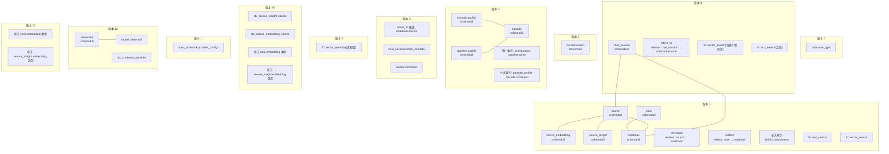
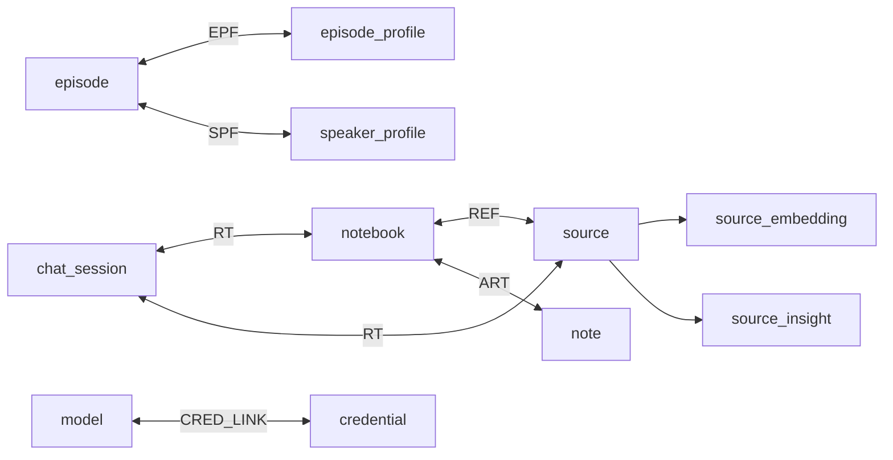

# 表结构设计

<cite>
**本文引用的文件**
- [1.surrealql](file://open_notebook/database/migrations/1.surrealql)
- [2.surrealql](file://open_notebook/database/migrations/2.surrealql)
- [3.surrealql](file://open_notebook/database/migrations/3.surrealql)
- [4.surrealql](file://open_notebook/database/migrations/4.surrealql)
- [5.surrealql](file://open_notebook/database/migrations/5.surrealql)
- [6.surrealql](file://open_notebook/database/migrations/6.surrealql)
- [7.surrealql](file://open_notebook/database/migrations/7.surrealql)
- [8.surrealql](file://open_notebook/database/migrations/8.surrealql)
- [9.surrealql](file://open_notebook/database/migrations/9.surrealql)
- [10.surrealql](file://open_notebook/database/migrations/10.surrealql)
- [11.surrealql](file://open_notebook/database/migrations/11.surrealql)
- [12.surrealql](file://open_notebook/database/migrations/12.surrealql)
- [13.surrealql](file://open_notebook/database/migrations/13.surrealql)
</cite>

## 目录
1. [简介](#简介)
2. [项目结构](#项目结构)
3. [核心组件](#核心组件)
4. [架构总览](#架构总览)
5. [详细组件分析](#详细组件分析)
6. [依赖分析](#依赖分析)
7. [性能考虑](#性能考虑)
8. [故障排查指南](#故障排查指南)
9. [结论](#结论)
10. [附录](#附录)

## 简介
本文件系统化梳理 Open Notebook 项目在 SurrealDB 中的数据库表结构设计与演进历史，覆盖字段类型、约束条件、默认值、主键/唯一性约束、索引策略、搜索与向量检索函数、事件触发器、表间关系映射及数据完整性保障机制。文档同时提供实体关系图与流程图，帮助读者快速理解各表的业务含义与交互方式。

## 项目结构
数据库模式由一系列 SurrealQL 迁移脚本定义，按版本号顺序演进，逐步引入新表、字段、索引与函数，并在后续版本中进行字段类型修正与清理孤儿记录等维护操作。核心迁移文件如下：
- 版本 1：基础实体（source、note、notebook）与关系（reference、artifact）、嵌入与洞察表、全文检索分析器与索引、文本与向量检索函数、默认配置记录
- 版本 2：为 note 增加 note_type 字段
- 版本 3：新增 chat_session 及其关系 refers_to；重构向量与文本检索函数
- 版本 4：进一步优化文本检索函数返回字段与分组逻辑
- 版本 5：新增 transformation 表并初始化默认模板
- 版本 6：更新模型提供商标识
- 版本 7：新增 episode_profile、speaker_profile、episode 表，建立唯一性与并发索引
- 版本 8：扩展 refers_to 关系支持 notebook 或 source；为 chat_session 增加 model_override；为 source 增加 command 字段
- 版本 9：增强向量检索函数的过滤条件
- 版本 10：为 source_insight 与 source_embedding 的 source 字段添加索引；修正 note 与 source_insight 的 embedding 类型
- 版本 11：新增 provider_configs 单例记录
- 版本 12：新增 credential 表并建立索引；为 model 表增加 credential 外链
- 版本 13：再次修正 note 与 source_insight 的 embedding 类型



**图表来源**
- [1.surrealql](file://open_notebook/database/migrations/1.surrealql#L2-L72)
- [2.surrealql](file://open_notebook/database/migrations/2.surrealql#L1-L2)
- [3.surrealql](file://open_notebook/database/migrations/3.surrealql#L2-L73)
- [4.surrealql](file://open_notebook/database/migrations/4.surrealql#L5-L70)
- [5.surrealql](file://open_notebook/database/migrations/5.surrealql#L8-L16)
- [7.surrealql](file://open_notebook/database/migrations/7.surrealql#L1-L48)
- [8.surrealql](file://open_notebook/database/migrations/8.surrealql#L5-L12)
- [9.surrealql](file://open_notebook/database/migrations/9.surrealql#L4-L66)
- [10.surrealql](file://open_notebook/database/migrations/10.surrealql#L5-L14)
- [11.surrealql](file://open_notebook/database/migrations/11.surrealql#L8-L11)
- [12.surrealql](file://open_notebook/database/migrations/12.surrealql#L6-L30)
- [13.surrealql](file://open_notebook/database/migrations/13.surrealql#L2-L4)

**章节来源**
- [1.surrealql](file://open_notebook/database/migrations/1.surrealql#L1-L179)
- [2.surrealql](file://open_notebook/database/migrations/2.surrealql#L1-L2)
- [3.surrealql](file://open_notebook/database/migrations/3.surrealql#L1-L146)
- [4.surrealql](file://open_notebook/database/migrations/4.surrealql#L1-L134)
- [5.surrealql](file://open_notebook/database/migrations/5.surrealql#L1-L170)
- [6.surrealql](file://open_notebook/database/migrations/6.surrealql#L1-L1)
- [7.surrealql](file://open_notebook/database/migrations/7.surrealql#L1-L153)
- [8.surrealql](file://open_notebook/database/migrations/8.surrealql#L1-L12)
- [9.surrealql](file://open_notebook/database/migrations/9.surrealql#L1-L66)
- [10.surrealql](file://open_notebook/database/migrations/10.surrealql#L1-L14)
- [11.surrealql](file://open_notebook/database/migrations/11.surrealql#L1-L11)
- [12.surrealql](file://open_notebook/database/migrations/12.surrealql#L1-L30)
- [13.surrealql](file://open_notebook/database/migrations/13.surrealql#L1-L4)

## 核心组件
本节概述数据库中的核心表及其职责：
- source：内容源，存储标题、主题、全文、资产对象等，具备创建/更新时间戳
- source_embedding：source 的分片/嵌入，包含顺序、内容与向量
- source_insight：source 的洞察条目，包含类型、内容与向量
- note：笔记，包含标题、摘要、内容与向量
- notebook：笔记本，包含名称、描述、归档状态与创建/更新时间戳
- reference：关系表，将 source 关联到 notebook
- artifact：关系表，将 note 关联到 notebook
- chat_session：聊天会话，支持与 notebook 或 source 关联
- refers_to：关系表，将 chat_session 关联到 notebook 或 source
- transformation：预设转换模板，包含名称、标题、描述、提示词与是否默认应用
- episode_profile：播客剧集配置档案，包含大纲与转录提供商、模型、默认简述、片段数量等
- speaker_profile：播客讲者配置档案，包含 TTS 提供商/模型与讲者数组
- episode：播客剧集，包含名称、简述、配置档案、讲者档案、大纲、转录、命令、音频文件等
- credential：凭据表，存储 API Key 与端点配置，可选链接到 model
- provider_configs：单例记录，用于多配置管理（迁移 11 引入）

**章节来源**
- [1.surrealql](file://open_notebook/database/migrations/1.surrealql#L2-L61)
- [5.surrealql](file://open_notebook/database/migrations/5.surrealql#L8-L16)
- [7.surrealql](file://open_notebook/database/migrations/7.surrealql#L1-L43)
- [12.surrealql](file://open_notebook/database/migrations/12.surrealql#L6-L29)
- [11.surrealql](file://open_notebook/database/migrations/11.surrealql#L8-L11)

## 架构总览
下图展示实体关系与外键约束（关系表以 relation 形式存在），并标注关键索引与事件触发器。

```mermaid
erDiagram
SOURCE {
record id PK
object asset
string title
array<string> topics
string full_text
datetime created
datetime updated
}
SOURCE_EMBEDDING {
record id PK
record source FK
int order
string content
array<float> embedding
}
SOURCE_INSIGHT {
record id PK
record source FK
string insight_type
string content
array<float> embedding
}
NOTE {
record id PK
string title
string summary
string content
array<float> embedding
datetime created
datetime updated
}
NOTEBOOK {
record id PK
string name
string description
bool archived
datetime created
datetime updated
}
REFERENCE {
record id PK
record source FK
record notebook FK
}
ARTIFACT {
record id PK
record note FK
record notebook FK
}
CHAT_SESSION {
record id PK
string model_override
}
REFERS_TO {
record id PK
record chat_session FK
record notebook|source FK
}
TRANSFORMATION {
record id PK
string name
string title
string description
string prompt
bool apply_default
datetime created
datetime updated
}
EPISODE_PROFILE {
record id PK
string name UK
string description
string speaker_config
string outline_provider
string outline_model
string transcript_provider
string transcript_model
string default_briefing
int num_segments
datetime created
datetime updated
}
SPEAKER_PROFILE {
record id PK
string name UK
string description
string tts_provider
string tts_model
array<object> speakers
datetime created
datetime updated
}
EPISODE {
record id PK
string name
string briefing
object episode_profile
object speaker_profile
object transcript
object outline
record command
string content
string audio_file
datetime created
datetime updated
}
CREDENTIAL {
record id PK
string name
string provider
array<string> modalities
string api_key
string base_url
string endpoint
string api_version
string endpoint_llm
string endpoint_embedding
string endpoint_stt
string endpoint_tts
string project
string location
string credentials_path
datetime created
datetime updated
}
PROVIDER_CONFIGS {
record id PK
}
SOURCE }o--|| SOURCE_EMBEDDING : "包含"
SOURCE }o--o| SOURCE_INSIGHT : "包含"
NOTEBOOK ||--o{ REFERENCE : "被引用"
SOURCE ||--o{ REFERENCE : "引用"
NOTEBOOK ||--o{ ARTIFACT : "包含"
NOTE ||--o{ ARTIFACT : "归属"
NOTEBOOK ||--o{ REFERS_TO : "关联"
SOURCE ||--o{ REFERS_TO : "关联"
CHAT_SESSION ||--o{ REFERS_TO : "关联"
EPISODE_PROFILE ||--o{ EPISODE : "配置"
SPEAKER_PROFILE ||--o{ EPISODE : "配置"
CREDENTIAL ||--o{ MODEL : "链接"
note "关系表使用 relation 定义<br/>索引见下方索引章节"
```

**图表来源**
- [1.surrealql](file://open_notebook/database/migrations/1.surrealql#L2-L61)
- [7.surrealql](file://open_notebook/database/migrations/7.surrealql#L1-L48)
- [8.surrealql](file://open_notebook/database/migrations/8.surrealql#L5-L12)
- [12.surrealql](file://open_notebook/database/migrations/12.surrealql#L6-L29)
- [11.surrealql](file://open_notebook/database/migrations/11.surrealql#L8-L11)

## 详细组件分析

### 表：source
- 用途与业务含义：记录内容源，支持标题、主题、全文检索、资产对象等元数据；作为 source_embedding 与 source_insight 的父实体
- 字段类型与约束
  - asset: 对象类型（可选）
  - title: 字符串（可选）
  - topics: 字符串数组（可选）
  - full_text: 字符串（可选）
  - created: 时间戳，默认当前时间
  - updated: 时间戳，默认当前时间
- 主键/唯一性：记录 id 为主键
- 索引策略：全文索引基于 title 与 full_text，使用自定义分析器
- 事件触发器：当删除 source 记录时，级联删除其对应的 source_embedding 与 source_insight
- 数据完整性：通过关系表 reference 将 source 与 notebook 关联；通过 source_embedding/source_insight 维持内容分片与洞察的完整性

**章节来源**
- [1.surrealql](file://open_notebook/database/migrations/1.surrealql#L2-L33)

### 表：source_embedding
- 用途与业务含义：保存 source 的分片内容与向量表示，支持向量相似度检索
- 字段类型与约束
  - source: 记录类型（指向 source）
  - order: 整数
  - content: 字符串
  - embedding: 浮点数组
- 主键/唯一性：记录 id 为主键
- 索引策略：对 content 建立全文索引
- 数据完整性：与 source 保持一对一/多对多关系，通过事件触发器与 source 同步删除

**章节来源**
- [1.surrealql](file://open_notebook/database/migrations/1.surrealql#L16-L32)

### 表：source_insight
- 用途与业务含义：保存 source 的洞察条目（如摘要、要点等），支持向量检索
- 字段类型与约束
  - source: 记录类型（指向 source）
  - insight_type: 字符串
  - content: 字符串
  - embedding: 浮点数组（版本 10 起修正为可选）
- 主键/唯一性：记录 id 为主键
- 索引策略：对 content 建立全文索引
- 数据完整性：与 source 保持一对多关系，版本 10 添加 source 字段索引以提升查询性能

**章节来源**
- [1.surrealql](file://open_notebook/database/migrations/1.surrealql#L22-L32)
- [10.surrealql](file://open_notebook/database/migrations/10.surrealql#L5-L14)

### 表：note
- 用途与业务含义：笔记实体，支持标题、摘要、内容与向量
- 字段类型与约束
  - title: 字符串（可选）
  - summary: 字符串（可选）
  - content: 字符串（可选）
  - embedding: 浮点数组（版本 10 起修正为可选）
  - created: 时间戳，默认当前时间
  - updated: 时间戳，默认当前时间
- 主键/唯一性：记录 id 为主键
- 索引策略：对 content 与 title 建立全文索引
- 数据完整性：通过关系表 artifact 与 notebook 关联

**章节来源**
- [1.surrealql](file://open_notebook/database/migrations/1.surrealql#L34-L52)
- [10.surrealql](file://open_notebook/database/migrations/10.surrealql#L8-L9)

### 表：notebook
- 用途与业务含义：笔记本容器，用于组织 source 与 note
- 字段类型与约束
  - name: 字符串（可选）
  - description: 字符串（可选）
  - archived: 布尔（可选，默认 False）
  - created: 时间戳，默认当前时间
  - updated: 时间戳，默认当前时间
- 主键/唯一性：记录 id 为主键
- 索引策略：无显式索引
- 数据完整性：通过 reference 与 artifact 与 source/note 关联

**章节来源**
- [1.surrealql](file://open_notebook/database/migrations/1.surrealql#L44-L56)

### 表：reference（关系表）
- 用途与业务含义：将 source 关联到 notebook
- 关系定义：FROM source TO notebook
- 主键/唯一性：记录 id 为主键
- 索引策略：无显式索引

**章节来源**
- [1.surrealql](file://open_notebook/database/migrations/1.surrealql#L54-L56)

### 表：artifact（关系表）
- 用途与业务含义：将 note 关联到 notebook
- 关系定义：FROM note TO notebook
- 主键/唯一性：记录 id 为主键
- 索引策略：无显式索引

**章节来源**
- [1.surrealql](file://open_notebook/database/migrations/1.surrealql#L58-L60)

### 表：chat_session
- 用途与业务含义：聊天会话，支持与 notebook 或 source 关联
- 字段类型与约束
  - model_override: 字符串（可选）
- 主键/唯一性：记录 id 为主键
- 索引策略：无显式索引
- 数据完整性：通过 refers_to 与 notebook 或 source 关联

**章节来源**
- [3.surrealql](file://open_notebook/database/migrations/3.surrealql#L2-L6)
- [8.surrealql](file://open_notebook/database/migrations/8.surrealql#L9-L11)

### 表：refers_to（关系表）
- 用途与业务含义：将 chat_session 关联到 notebook 或 source
- 关系定义：FROM chat_session TO notebook|source
- 主键/唯一性：记录 id 为主键
- 索引策略：无显式索引

**章节来源**
- [3.surrealql](file://open_notebook/database/migrations/3.surrealql#L4-L6)
- [8.surrealql](file://open_notebook/database/migrations/8.surrealql#L5-L7)

### 表：transformation
- 用途与业务含义：预设转换模板，包含名称、标题、描述、提示词与是否默认应用
- 字段类型与约束
  - name: 字符串
  - title: 字符串
  - description: 字符串
  - prompt: 字符串
  - apply_default: 布尔（默认 False）
  - created: 时间戳，默认当前时间
  - updated: 时间戳，默认当前时间
- 主键/唯一性：记录 id 为主键
- 索引策略：无显式索引
- 初始化：版本 5 中插入多条默认模板

**章节来源**
- [5.surrealql](file://open_notebook/database/migrations/5.surrealql#L8-L16)
- [5.surrealql](file://open_notebook/database/migrations/5.surrealql#L19-L156)

### 表：episode_profile
- 用途与业务含义：播客剧集配置档案，定义大纲与转录提供商、模型、默认简述、片段数量等
- 字段类型与约束
  - name: 字符串（唯一）
  - description: 字符串（可选）
  - speaker_config: 字符串
  - outline_provider: 字符串
  - outline_model: 字符串
  - transcript_provider: 字符串
  - transcript_model: 字符串
  - default_briefing: 字符串
  - num_segments: 整数（默认 5）
  - created: 时间戳，默认当前时间
  - updated: 时间戳，默认当前时间
- 主键/唯一性：记录 id 为主键；name 唯一
- 索引策略：对 name 建立唯一并发索引
- 初始化：版本 7 中插入示例数据

**章节来源**
- [7.surrealql](file://open_notebook/database/migrations/7.surrealql#L1-L12)
- [7.surrealql](file://open_notebook/database/migrations/7.surrealql#L44-L48)
- [7.surrealql](file://open_notebook/database/migrations/7.surrealql#L53-L86)

### 表：speaker_profile
- 用途与业务含义：播客讲者配置档案，包含 TTS 提供商/模型与讲者数组（名称、声音、背景、个性）
- 字段类型与约束
  - name: 字符串（唯一）
  - description: 字符串（可选）
  - tts_provider: 字符串
  - tts_model: 字符串
  - speakers: 对象数组（含 name、voice_id、backstory、personality）
  - created: 时间戳，默认当前时间
  - updated: 时间戳，默认当前时间
- 主键/唯一性：记录 id 为主键；name 唯一
- 索引策略：对 name 建立唯一并发索引
- 初始化：版本 7 中插入示例数据

**章节来源**
- [7.surrealql](file://open_notebook/database/migrations/7.surrealql#L15-L27)
- [7.surrealql](file://open_notebook/database/migrations/7.surrealql#L44-L48)
- [7.surrealql](file://open_notebook/database/migrations/7.surrealql#L88-L150)

### 表：episode
- 用途与业务含义：播客剧集，包含名称、简述、配置档案、讲者档案、大纲、转录、命令、音频文件等
- 字段类型与约束
  - name: 字符串
  - briefing: 字符串（可选）
  - episode_profile: 对象（可选）
  - speaker_profile: 对象（可选）
  - transcript: 对象（可选）
  - outline: 对象（可选）
  - command: 记录（可选，指向 command）
  - content: 字符串（可选）
  - audio_file: 字符串（可选）
  - created: 时间戳，默认当前时间
  - updated: 时间戳，默认当前时间
- 主键/唯一性：记录 id 为主键
- 索引策略：对 episode_profile 与 command 建立并发索引
- 数据完整性：与 episode_profile/speaker_profile 保持一对多关系

**章节来源**
- [7.surrealql](file://open_notebook/database/migrations/7.surrealql#L30-L43)
- [7.surrealql](file://open_notebook/database/migrations/7.surrealql#L44-L48)

### 表：credential
- 用途与业务含义：凭据表，存储 API Key 与端点配置，可选链接到 model
- 字段类型与约束
  - name: 字符串
  - provider: 字符串
  - modalities: 字符串数组（默认空）
  - api_key: 字符串（可选）
  - base_url: 字符串（可选）
  - endpoint: 字符串（可选）
  - api_version: 字符串（可选）
  - endpoint_llm: 字符串（可选）
  - endpoint_embedding: 字符串（可选）
  - endpoint_stt: 字符串（可选）
  - endpoint_tts: 字符串（可选）
  - project: 字符串（可选）
  - location: 字符串（可选）
  - credentials_path: 字符串（可选）
  - created: 时间戳（可选，默认当前时间）
  - updated: 时间戳（可选，默认当前时间）
- 主键/唯一性：记录 id 为主键
- 索引策略：对 provider 建立索引
- 数据完整性：通过外链与 model 关联

**章节来源**
- [12.surrealql](file://open_notebook/database/migrations/12.surrealql#L6-L29)
- [12.surrealql](file://open_notebook/database/migrations/12.surrealql#L25-L26)
- [12.surrealql](file://open_notebook/database/migrations/12.surrealql#L28-L29)

### 表：provider_configs（单例记录）
- 用途与业务含义：多配置管理的单例记录，存储多个提供商的 API Key 配置
- 数据完整性：通过 UPSERT 创建与维护

**章节来源**
- [11.surrealql](file://open_notebook/database/migrations/11.surrealql#L8-L11)

## 依赖分析
- 表间依赖
  - source → source_embedding / source_insight：一对多
  - notebook ← reference / artifact：多对一
  - note ← artifact：多对一
  - chat_session ← refers_to：多对一
  - episode ← episode_profile / speaker_profile：一对多
  - model ← credential：可选外链
- 函数与索引
  - 文本检索函数：基于全文索引与分析器
  - 向量检索函数：基于余弦相似度与最小相似度阈值
  - 事件触发器：删除 source 时级联删除其嵌入与洞察
- 性能与一致性
  - 并发索引与唯一索引提升查询性能
  - 字段类型修正确保向量维度一致性



**图表来源**
- [1.surrealql](file://open_notebook/database/migrations/1.surrealql#L2-L61)
- [7.surrealql](file://open_notebook/database/migrations/7.surrealql#L1-L48)
- [8.surrealql](file://open_notebook/database/migrations/8.surrealql#L5-L12)
- [12.surrealql](file://open_notebook/database/migrations/12.surrealql#L6-L29)

**章节来源**
- [1.surrealql](file://open_notebook/database/migrations/1.surrealql#L2-L72)
- [7.surrealql](file://open_notebook/database/migrations/7.surrealql#L1-L48)
- [8.surrealql](file://open_notebook/database/migrations/8.surrealql#L5-L12)
- [12.surrealql](file://open_notebook/database/migrations/12.surrealql#L6-L29)

## 性能考虑
- 全文检索
  - 使用自定义分析器与 BM25 算法，对 title、full_text、content 等列建立索引，支持高亮与评分
- 向量检索
  - 通过余弦相似度计算相似度，结合最小相似度阈值与维度一致性检查，避免无效向量参与匹配
- 索引策略
  - 并发索引与唯一索引减少锁争用与重复数据
  - 针对 source_insight 与 source_embedding 的 source 字段建立索引，加速按源统计与存在性检查
- 事件触发器
  - 删除 source 时自动清理嵌入与洞察，降低碎片化风险

**章节来源**
- [1.surrealql](file://open_notebook/database/migrations/1.surrealql#L65-L72)
- [9.surrealql](file://open_notebook/database/migrations/9.surrealql#L14-L15)
- [10.surrealql](file://open_notebook/database/migrations/10.surrealql#L5-L6)

## 故障排查指南
- 向量检索结果为空
  - 检查 embedding 是否为空或维度不一致；版本 9 增加了维度一致性与非空检查
- 全文检索命中率低
  - 确认分析器与索引已正确创建；检查查询文本是否符合分析器规则
- 删除 source 后仍有嵌入/洞察残留
  - 确认事件触发器已生效；版本 10 清理了孤儿记录
- 唯一性冲突
  - episode_profile 与 speaker_profile 的 name 字段需唯一；检查是否存在重复名称

**章节来源**
- [9.surrealql](file://open_notebook/database/migrations/9.surrealql#L14-L15)
- [1.surrealql](file://open_notebook/database/migrations/1.surrealql#L29-L32)
- [10.surrealql](file://open_notebook/database/migrations/10.surrealql#L11-L14)
- [7.surrealql](file://open_notebook/database/migrations/7.surrealql#L45-L46)

## 结论
该数据库设计围绕“内容源—分片/洞察—笔记—笔记本”的知识组织主线，辅以播客配置与凭据管理，形成从内容生产、索引检索到生成式应用的完整闭环。通过版本化的迁移脚本，系统实现了字段类型修正、索引优化与关系扩展，兼顾性能与可维护性。建议在后续迭代中持续关注向量维度一致性与索引维护策略，确保大规模数据下的稳定性与查询效率。

## 附录

### 字段验证规则与数据完整性
- 默认值
  - created/updated：默认为当前时间
  - notebook.archived：默认 False
  - episode_profile.num_segments：默认 5
  - credential.modalities：默认空数组
- 约束
  - 唯一性：episode_profile.name、speaker_profile.name
  - 外键：relation 定义的引用关系
  - 向量维度：向量检索函数中强制检查维度一致性
- 事件触发器
  - 删除 source 时级联删除其嵌入与洞察

**章节来源**
- [1.surrealql](file://open_notebook/database/migrations/1.surrealql#L13-L14)
- [1.surrealql](file://open_notebook/database/migrations/1.surrealql#L48)
- [7.surrealql](file://open_notebook/database/migrations/7.surrealql#L10)
- [12.surrealql](file://open_notebook/database/migrations/12.surrealql#L9)
- [1.surrealql](file://open_notebook/database/migrations/1.surrealql#L29-L32)

### 索引策略汇总
- 全文索引
  - source.title、source.full_text、source_embedding.content、source_insight.content、note.content、note.title
- 唯一索引
  - episode_profile.name、speaker_profile.name
- 并发索引
  - episode_profile、episode.command
  - source_insight.source、source_embedding.source
  - credential.provider

**章节来源**
- [1.surrealql](file://open_notebook/database/migrations/1.surrealql#L67-L72)
- [7.surrealql](file://open_notebook/database/migrations/7.surrealql#L45-L46)
- [7.surrealql](file://open_notebook/database/migrations/7.surrealql#L47-L48)
- [10.surrealql](file://open_notebook/database/migrations/10.surrealql#L5-L6)
- [12.surrealql](file://open_notebook/database/migrations/12.surrealql#L26)

### 表结构变更历史与版本控制
- 版本 1：基础实体、关系、全文索引、检索函数、默认配置
- 版本 2：为 note 增加 note_type
- 版本 3：新增 chat_session 与 refers_to；重构检索函数
- 版本 4：优化文本检索函数返回字段与分组
- 版本 5：新增 transformation 表并初始化默认模板
- 版本 6：更新模型提供商标识
- 版本 7：新增 episode_profile、speaker_profile、episode；建立唯一与并发索引；插入示例数据
- 版本 8：扩展 refers_to 支持 notebook|source；为 chat_session 增加 model_override；为 source 增加 command
- 版本 9：增强向量检索函数的过滤条件
- 版本 10：为 source_insight 与 source_embedding 的 source 字段添加索引；修正 note 与 source_insight 的 embedding 类型；清理孤儿记录
- 版本 11：新增 provider_configs 单例记录
- 版本 12：新增 credential 表并建立索引；为 model 表增加 credential 外链
- 版本 13：再次修正 note 与 source_insight 的 embedding 类型

**章节来源**
- [1.surrealql](file://open_notebook/database/migrations/1.surrealql#L1-L179)
- [2.surrealql](file://open_notebook/database/migrations/2.surrealql#L1-L2)
- [3.surrealql](file://open_notebook/database/migrations/3.surrealql#L1-L146)
- [4.surrealql](file://open_notebook/database/migrations/4.surrealql#L1-L134)
- [5.surrealql](file://open_notebook/database/migrations/5.surrealql#L1-L170)
- [6.surrealql](file://open_notebook/database/migrations/6.surrealql#L1-L1)
- [7.surrealql](file://open_notebook/database/migrations/7.surrealql#L1-L153)
- [8.surrealql](file://open_notebook/database/migrations/8.surrealql#L1-L12)
- [9.surrealql](file://open_notebook/database/migrations/9.surrealql#L1-L66)
- [10.surrealql](file://open_notebook/database/migrations/10.surrealql#L1-L14)
- [11.surrealql](file://open_notebook/database/migrations/11.surrealql#L1-L11)
- [12.surrealql](file://open_notebook/database/migrations/12.surrealql#L1-L30)
- [13.surrealql](file://open_notebook/database/migrations/13.surrealql#L1-L4)