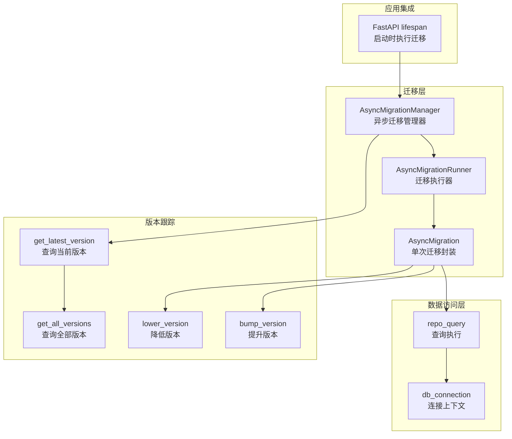
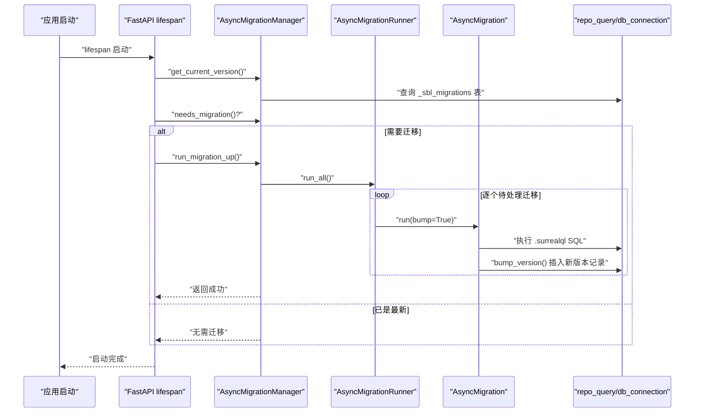
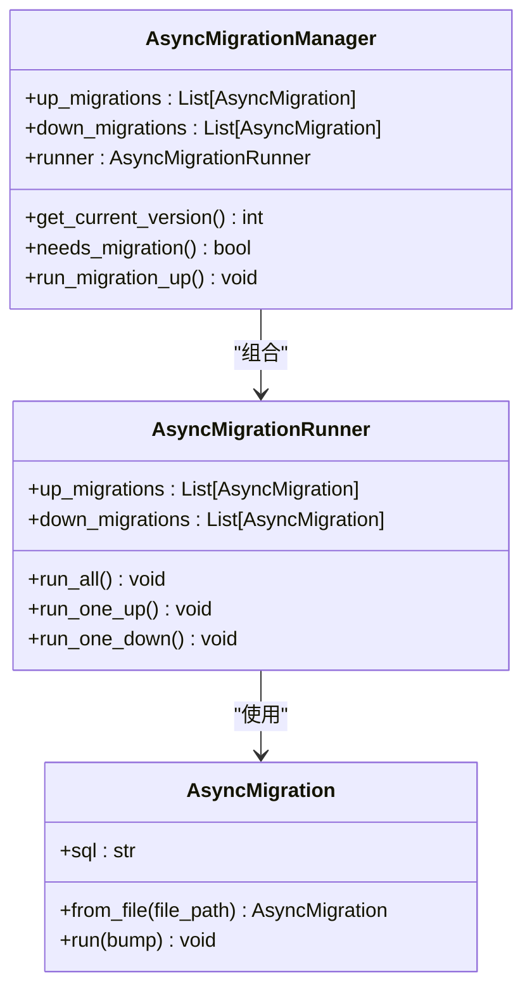
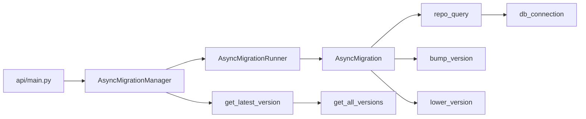

# 迁移系统

<cite>
**本文引用的文件**
- [open_notebook/database/async_migrate.py](file://open_notebook/database/async_migrate.py)
- [open_notebook/database/migrate.py](file://open_notebook/database/migrate.py)
- [open_notebook/database/repository.py](file://open_notebook/database/repository.py)
- [open_notebook/database/migrations/1.surrealql](file://open_notebook/database/migrations/1.surrealql)
- [open_notebook/database/migrations/1_down.surrealql](file://open_notebook/database/migrations/1_down.surrealql)
- [open_notebook/database/migrations/2.surrealql](file://open_notebook/database/migrations/2.surrealql)
- [open_notebook/database/migrations/2_down.surrealql](file://open_notebook/database/migrations/2_down.surrealql)
- [open_notebook/database/migrations/3.surrealql](file://open_notebook/database/migrations/3.surrealql)
- [open_notebook/database/migrations/3_down.surrealql](file://open_notebook/database/migrations/3_down.surrealql)
- [api/main.py](file://api/main.py)
- [open_notebook/database/CLAUDE.md](file://open_notebook/database/CLAUDE.md)
- [README.dev.md](file://README.dev.md)
</cite>

## 目录
1. [简介](#简介)
2. [项目结构](#项目结构)
3. [核心组件](#核心组件)
4. [架构总览](#架构总览)
5. [组件详解](#组件详解)
6. [依赖关系分析](#依赖关系分析)
7. [性能与并发特性](#性能与并发特性)
8. [迁移流程与最佳实践](#迁移流程与最佳实践)
9. [故障排查与回滚策略](#故障排查与回滚策略)
10. [生产环境安全与停机时间最小化](#生产环境安全与停机时间最小化)
11. [结论](#结论)

## 简介
本文件系统性阐述基于 SurrealDB 的数据库迁移系统，覆盖以下方面：
- SurrealQL 迁移脚本的编写、执行与版本管理
- 迁移文件命名规范、执行顺序与回滚机制
- 增量迁移、批量迁移与数据转换策略
- 失败处理与数据恢复方法
- 生产环境安全与停机时间最小化策略

该系统通过异步迁移管理器在应用启动时自动执行待处理迁移，并以独立的版本表记录已应用的迁移版本，确保数据库模式演进的可追踪与可回滚。

## 项目结构
迁移相关的核心文件与职责如下：
- 迁移执行与版本管理：open_notebook/database/async_migrate.py
- 同步兼容封装：open_notebook/database/migrate.py
- 数据库连接与查询：open_notebook/database/repository.py
- 迁移脚本（示例）：open_notebook/database/migrations/*.surrealql 及其 *_down.surrealql
- 应用启动集成：api/main.py
- 设计说明与扩展指引：open_notebook/database/CLAUDE.md
- 开发者迁移步骤：README.dev.md

图表来源
- [open_notebook/database/async_migrate.py](file://open_notebook/database/async_migrate.py#L91-L189)
- [open_notebook/database/repository.py](file://open_notebook/database/repository.py#L47-L83)
- [api/main.py](file://api/main.py#L47-L96)

章节来源
- [open_notebook/database/CLAUDE.md](file://open_notebook/database/CLAUDE.md#L1-L125)
- [api/main.py](file://api/main.py#L47-L96)

## 核心组件
- 异步迁移管理器（AsyncMigrationManager）
  - 负责加载上行与下行迁移列表、判断是否需要迁移、执行所有待处理迁移。
  - 提供获取当前版本与“是否需要迁移”的能力。
- 迁移执行器（AsyncMigrationRunner）
  - 按顺序执行待处理迁移或单次迁移；支持向上与向下迁移。
- 单次迁移封装（AsyncMigration）
  - 从 .surrealql 文件加载 SQL 内容（清理注释与空白），执行后更新版本表或回退版本表。
- 版本跟踪函数
  - 查询当前版本、查询全部版本、提升版本、降低版本。
- 数据访问层（repository.py）
  - 提供 db_connection 上下文与 repo_query 执行器，统一异常处理与日志记录。
- 同步兼容封装（migrate.py）
  - 为历史/遗留代码提供同步接口，内部委托给异步实现。

章节来源
- [open_notebook/database/async_migrate.py](file://open_notebook/database/async_migrate.py#L13-L189)
- [open_notebook/database/repository.py](file://open_notebook/database/repository.py#L47-L83)
- [open_notebook/database/migrate.py](file://open_notebook/database/migrate.py#L6-L27)

## 架构总览
迁移系统在应用启动阶段由 FastAPI 的 lifespan 钩子触发，自动完成以下流程：
- 获取当前数据库版本
- 若存在待处理迁移，则逐个执行上行迁移
- 成功后更新版本表，失败则中止启动并记录错误

图表来源
- [api/main.py](file://api/main.py#L47-L96)
- [open_notebook/database/async_migrate.py](file://open_notebook/database/async_migrate.py#L165-L189)
- [open_notebook/database/repository.py](file://open_notebook/database/repository.py#L65-L83)

## 组件详解

### 迁移类与执行链路
- AsyncMigration
  - 从文件加载 SQL，清理注释与空白，执行后根据方向参数决定提升或降低版本。
- AsyncMigrationRunner
  - 基于当前版本迭代执行上行迁移；支持单次上/下行迁移。
- AsyncMigrationManager
  - 组合加载 up/down 列表，提供版本查询与迁移执行入口。

图表来源
- [open_notebook/database/async_migrate.py](file://open_notebook/database/async_migrate.py#L13-L189)

章节来源
- [open_notebook/database/async_migrate.py](file://open_notebook/database/async_migrate.py#L13-L189)

### 版本跟踪与迁移脚本
- 版本表
  - 使用一个名为 _sbl_migrations 的记录表存储版本号与应用时间戳，迁移成功后插入新版本记录，回滚时删除最新记录。
- 迁移脚本
  - 上行脚本：以数字编号命名，如 1.surrealql、2.surrealql …
  - 下行脚本：以相同编号加 “_down” 命名，如 1_down.surrealql、2_down.surrealql …
  - 示例：第 1、2、3 次迁移分别定义了基础表、字段与函数等；第 1 次迁移包含全文检索索引与搜索函数。

章节来源
- [open_notebook/database/async_migrate.py](file://open_notebook/database/async_migrate.py#L192-L229)
- [open_notebook/database/migrations/1.surrealql](file://open_notebook/database/migrations/1.surrealql#L1-L179)
- [open_notebook/database/migrations/1_down.surrealql](file://open_notebook/database/migrations/1_down.surrealql#L1-L25)
- [open_notebook/database/migrations/2.surrealql](file://open_notebook/database/migrations/2.surrealql#L1-L2)
- [open_notebook/database/migrations/2_down.surrealql](file://open_notebook/database/migrations/2_down.surrealql#L1-L2)
- [open_notebook/database/migrations/3.surrealql](file://open_notebook/database/migrations/3.surrealql#L1-L146)
- [open_notebook/database/migrations/3_down.surrealql](file://open_notebook/database/migrations/3_down.surrealql#L1-L111)

### 数据访问与连接
- 连接管理
  - 通过 db_connection 上下文管理器建立与 SurrealDB 的连接，登录、选择命名空间与数据库后执行查询，最后关闭连接。
- 查询执行
  - repo_query 封装查询逻辑，对异常进行分类处理与日志记录；对 RecordID 结果进行递归解析，保证序列化一致性。
- 错误处理
  - 对事务冲突类错误以 DEBUG 等级记录，避免日志噪声；对其他异常抛出并由上层捕获。

章节来源
- [open_notebook/database/repository.py](file://open_notebook/database/repository.py#L47-L83)
- [open_notebook/database/repository.py](file://open_notebook/database/repository.py#L1-L195)

### 启动集成与生命周期
- FastAPI lifespan
  - 在应用启动时检查当前版本，若需要迁移则执行；迁移失败直接中止启动，确保服务不以过期模式运行。
- 生命周期钩子
  - 启动前进行安全检查（如加密密钥），迁移完成后输出成功日志。

章节来源
- [api/main.py](file://api/main.py#L47-L96)

## 依赖关系分析
- 组件耦合
  - AsyncMigrationManager 依赖 AsyncMigrationRunner 与 AsyncMigration；AsyncMigration 依赖 repo_query 与 db_connection；版本跟踪函数依赖 repo_query。
- 外部依赖
  - 使用 surrealdb.AsyncSurreal 客户端与 loguru 日志库。
- 潜在循环依赖
  - 当前模块间无循环导入；版本跟踪函数通过 repo_query 访问数据库，形成单向依赖。

图表来源
- [api/main.py](file://api/main.py#L37-L96)
- [open_notebook/database/async_migrate.py](file://open_notebook/database/async_migrate.py#L91-L229)
- [open_notebook/database/repository.py](file://open_notebook/database/repository.py#L47-L83)

章节来源
- [open_notebook/database/async_migrate.py](file://open_notebook/database/async_migrate.py#L91-L229)
- [open_notebook/database/repository.py](file://open_notebook/database/repository.py#L1-L195)

## 性能与并发特性
- 连接模型
  - 每次数据库操作均新建连接并在结束后关闭，适合无状态/请求级操作；对于批量写入场景建议引入连接池以减少开销。
- 并发冲突
  - 事务冲突类错误以 DEBUG 级别记录，避免高并发下的日志噪音；非冲突异常会抛出并由上层处理。
- 迁移执行
  - 迁移按序串行执行，单次迁移失败即中断，确保数据库状态一致。

章节来源
- [open_notebook/database/repository.py](file://open_notebook/database/repository.py#L76-L82)
- [open_notebook/database/CLAUDE.md](file://open_notebook/database/CLAUDE.md#L89-L95)

## 迁移流程与最佳实践

### 命名规范与组织
- 上行迁移：以数字命名，如 1.surrealql、2.surrealql …
- 下行迁移：同编号加 “_down”，如 1_down.surrealql、2_down.surrealql …
- 迁移脚本应仅包含可幂等的 DDL/DML，避免业务逻辑与状态变更。

章节来源
- [open_notebook/database/CLAUDE.md](file://open_notebook/database/CLAUDE.md#L100-L101)
- [README.dev.md](file://README.dev.md#L294-L295)

### 执行顺序与版本管理
- 版本表：_sbl_migrations 记录每个版本号与应用时间戳；查询当前版本时取最大值。
- 执行顺序：按版本号从小到大依次执行；若某版本缺失，系统不会跳过，需补齐对应迁移文件。
- 自动发现：当前实现为硬编码列出迁移文件，新增迁移需同时更新管理器的加载列表。

章节来源
- [open_notebook/database/async_migrate.py](file://open_notebook/database/async_migrate.py#L192-L229)
- [open_notebook/database/CLAUDE.md](file://open_notebook/database/CLAUDE.md#L90-L91)

### 回滚机制
- 单次回滚：通过 AsyncMigrationRunner.run_one_down 执行最近一次迁移的下行脚本，并删除版本表中的最新记录。
- 全量回滚：可通过多次调用单次回滚实现，或在测试环境中手动调整版本表。

章节来源
- [open_notebook/database/async_migrate.py](file://open_notebook/database/async_migrate.py#L82-L88)
- [open_notebook/database/async_migrate.py](file://open_notebook/database/async_migrate.py#L224-L229)

### 增量迁移、批量迁移与数据转换
- 增量迁移
  - 通过在 AsyncMigrationManager 中追加新的上/下行迁移文件，实现小步快跑的演进。
- 批量迁移
  - run_all 会一次性执行所有待处理迁移；适用于快速补齐多版本差异。
- 数据转换
  - 建议在迁移脚本中使用 UPDATE/UPSERT 等语句进行结构化数据转换；避免在迁移中执行耗时任务，必要时拆分为后续命令或后台作业。

章节来源
- [open_notebook/database/async_migrate.py](file://open_notebook/database/async_migrate.py#L66-L81)
- [open_notebook/database/async_migrate.py](file://open_notebook/database/async_migrate.py#L174-L189)

### 编写与验证迁移脚本
- 可幂等性：使用 IF NOT EXISTS/IF EXISTS 等条件声明，确保重复执行不会产生副作用。
- 注释与格式：脚本中可保留注释，但执行时会被清理；建议保持清晰的分段与注释以便审查。
- 测试建议：在开发环境先验证脚本的幂等性与可逆性，再在预生产环境演练。

章节来源
- [open_notebook/database/async_migrate.py](file://open_notebook/database/async_migrate.py#L22-L34)
- [open_notebook/database/migrations/1.surrealql](file://open_notebook/database/migrations/1.surrealql#L1-L179)

## 故障排查与回滚策略

### 常见问题定位
- 迁移失败
  - 查看启动日志中的错误信息；迁移失败会阻止 API 启动，便于第一时间发现。
- 版本表异常
  - 若版本表不存在或损坏，系统会视为版本 0；可检查 _sbl_migrations 是否存在且可查询。
- 连接与认证
  - 确认数据库地址、命名空间、数据库名与凭据配置正确；连接失败会导致迁移无法执行。

章节来源
- [api/main.py](file://api/main.py#L84-L88)
- [open_notebook/database/async_migrate.py](file://open_notebook/database/async_migrate.py#L192-L211)
- [open_notebook/database/repository.py](file://open_notebook/database/repository.py#L12-L26)

### 回滚步骤
- 单次回滚
  - 调用 run_one_down，系统将执行对应下行脚本并删除版本表中的最新记录。
- 全量回滚
  - 反复调用 run_one_down 直至目标版本；或在测试环境直接删除版本表记录（需谨慎）。

章节来源
- [open_notebook/database/async_migrate.py](file://open_notebook/database/async_migrate.py#L82-L88)
- [open_notebook/database/async_migrate.py](file://open_notebook/database/async_migrate.py#L224-L229)

### 数据恢复方法
- 快照与备份
  - 在执行重大迁移前，建议对数据库进行备份；迁移失败时可回滚到备份点。
- 逐步回滚
  - 通过下行脚本逐次回滚，缩小影响范围并定位具体失败点。
- 修复后重试
  - 修正迁移脚本或环境配置后，重新执行迁移；注意幂等性与可逆性。

章节来源
- [README.dev.md](file://README.dev.md#L294-L315)

## 生产环境安全与停机时间最小化

### 安全措施
- 启动即迁移
  - API 启动时强制执行迁移，失败即中止，避免以旧模式运行。
- 凭证与密钥
  - 启动前检查加密密钥等敏感配置，缺失时发出警告，防止运行在不安全状态。
- 权限控制
  - 确保数据库连接用户具备迁移所需的最小权限，避免过度授权。

章节来源
- [api/main.py](file://api/main.py#L55-L64)
- [api/main.py](file://api/main.py#L84-L88)

### 停机时间最小化策略
- 无状态连接
  - 每次操作新建连接，适合容器化部署；配合滚动重启可减少停机。
- 并发与重试
  - 对事务冲突类错误采用 DEBUG 级别记录，避免日志风暴；生产中可结合重试策略提升成功率。
- 分阶段迁移
  - 将大改动拆分为多个小迁移，缩短单次迁移时间；在低峰时段执行。
- 回滚预案
  - 为关键迁移准备下行脚本，确保失败时能快速回滚至稳定版本。

章节来源
- [open_notebook/database/CLAUDE.md](file://open_notebook/database/CLAUDE.md#L89-L95)
- [open_notebook/database/CLAUDE.md](file://open_notebook/database/CLAUDE.md#L100-L102)

## 结论
本迁移系统以异步方式在应用启动时自动执行数据库模式演进，通过版本表记录迁移状态，支持单次与批量迁移，并提供下行脚本以实现回滚。其设计强调幂等性与可逆性，结合严格的启动校验与日志记录，能够在开发、预生产和生产环境中提供可靠的数据库演进保障。建议在生产中配合备份、分阶段迁移与回滚预案，进一步降低风险与停机时间。