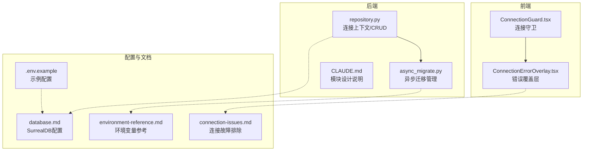
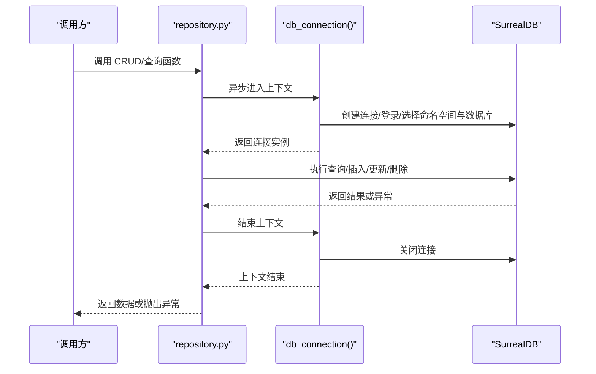
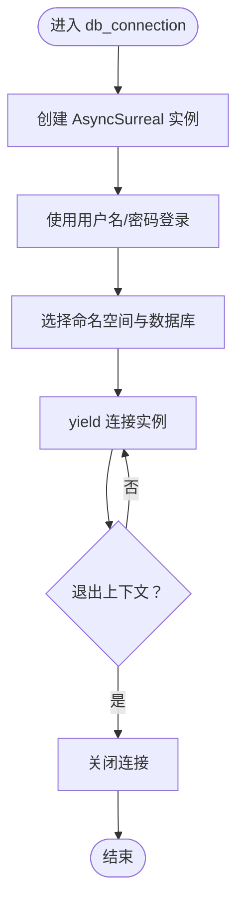
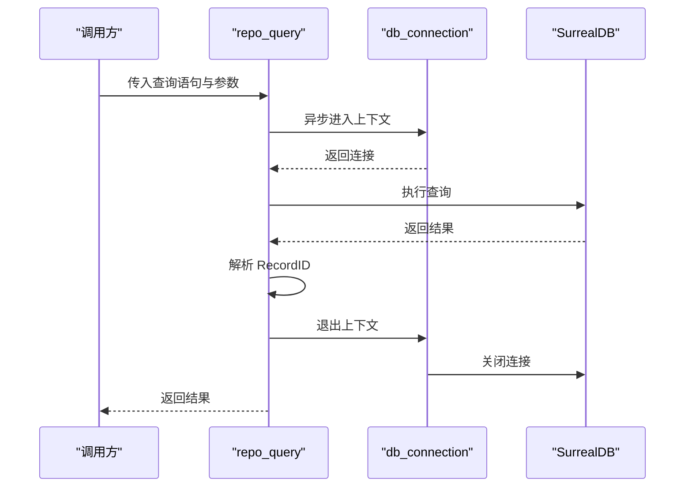
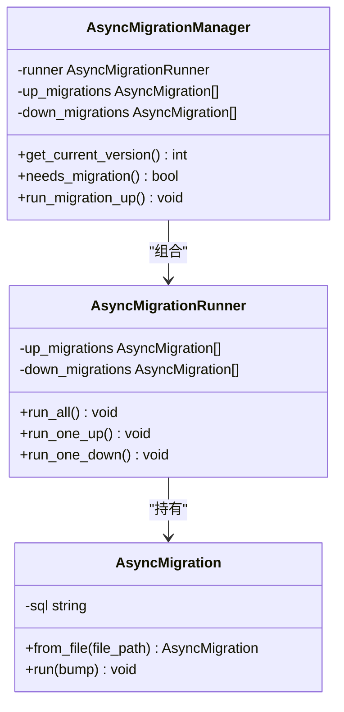
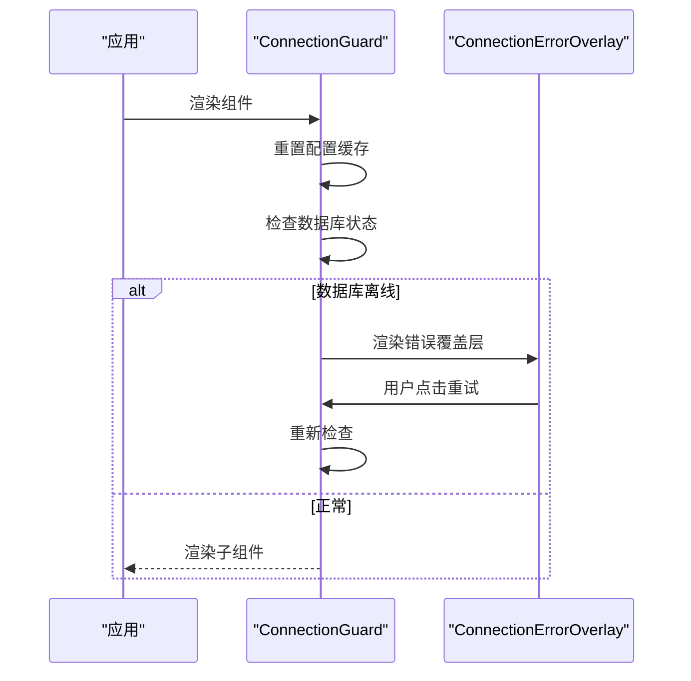
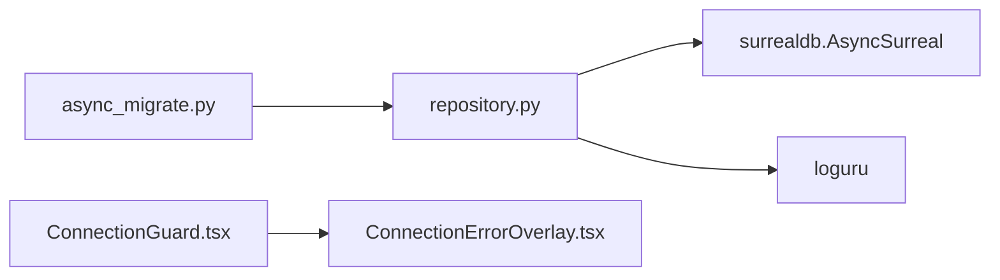

# 连接管理

<cite>
**本文引用的文件**
- [open_notebook/database/repository.py](file://open_notebook/database/repository.py)
- [open_notebook/database/async_migrate.py](file://open_notebook/database/async_migrate.py)
- [open_notebook/database/CLAUDE.md](file://open_notebook/database/CLAUDE.md)
- [docs/5-CONFIGURATION/database.md](file://docs/5-CONFIGURATION/database.md)
- [docs/5-CONFIGURATION/environment-reference.md](file://docs/5-CONFIGURATION/environment-reference.md)
- [.env.example](file://.env.example)
- [frontend/src/components/common/ConnectionGuard.tsx](file://frontend/src/components/common/ConnectionGuard.tsx)
- [frontend/src/components/errors/ConnectionErrorOverlay.tsx](file://frontend/src/components/errors/ConnectionErrorOverlay.tsx)
- [docs/6-TROUBLESHOOTING/connection-issues.md](file://docs/6-TROUBLESHOOTING/connection-issues.md)
- [open_notebook/exceptions.py](file://open_notebook/exceptions.py)
</cite>

## 目录
1. [简介](#简介)
2. [项目结构](#项目结构)
3. [核心组件](#核心组件)
4. [架构总览](#架构总览)
5. [详细组件分析](#详细组件分析)
6. [依赖关系分析](#依赖关系分析)
7. [性能考量](#性能考量)
8. [故障排除指南](#故障排除指南)
9. [结论](#结论)
10. [附录](#附录)

## 简介
本文件系统性阐述 Open Notebook 中基于 SurrealDB 的数据库连接管理，覆盖连接建立、维护与关闭流程；连接池、超时与重连策略现状与建议；数据库 URL、认证与安全配置；异步连接最佳实践与错误处理；连接状态监控、性能优化与故障排除；以及多租户场景下的连接隔离与资源管理。

## 项目结构
围绕数据库连接的关键模块与文档如下：
- 后端数据库抽象层：提供异步 CRUD 与迁移能力
  - repository.py：连接上下文、查询与 CRUD 封装
  - async_migrate.py：异步迁移执行器与版本管理
  - CLAUDE.md：模块设计与使用要点
- 前端连接守卫与错误展示
  - ConnectionGuard.tsx：应用启动时检测数据库可用性并阻断渲染
  - ConnectionErrorOverlay.tsx：数据库连接失败时的用户提示与排障指引
- 配置与参考
  - docs/5-CONFIGURATION/database.md：SurrealDB 默认配置与多命名空间说明
  - docs/5-CONFIGURATION/environment-reference.md：环境变量清单与高并发建议
  - .env.example：最小化示例配置
- 故障排除
  - docs/6-TROUBLESHOOTING/connection-issues.md：常见连接问题诊断与修复步骤

**图表来源**
- [open_notebook/database/repository.py](file://open_notebook/database/repository.py#L1-L195)
- [open_notebook/database/async_migrate.py](file://open_notebook/database/async_migrate.py#L1-L229)
- [open_notebook/database/CLAUDE.md](file://open_notebook/database/CLAUDE.md#L1-L102)
- [frontend/src/components/common/ConnectionGuard.tsx](file://frontend/src/components/common/ConnectionGuard.tsx#L1-L108)
- [frontend/src/components/errors/ConnectionErrorOverlay.tsx](file://frontend/src/components/errors/ConnectionErrorOverlay.tsx#L1-L175)
- [docs/5-CONFIGURATION/database.md](file://docs/5-CONFIGURATION/database.md#L1-L51)
- [docs/5-CONFIGURATION/environment-reference.md](file://docs/5-CONFIGURATION/environment-reference.md#L22-L31)
- [.env.example](file://.env.example#L16-L21)
- [docs/6-TROUBLESHOOTING/connection-issues.md](file://docs/6-TROUBLESHOOTING/connection-issues.md#L1-L448)

**章节来源**
- [open_notebook/database/repository.py](file://open_notebook/database/repository.py#L1-L195)
- [open_notebook/database/async_migrate.py](file://open_notebook/database/async_migrate.py#L1-L229)
- [open_notebook/database/CLAUDE.md](file://open_notebook/database/CLAUDE.md#L1-L102)
- [frontend/src/components/common/ConnectionGuard.tsx](file://frontend/src/components/common/ConnectionGuard.tsx#L1-L108)
- [frontend/src/components/errors/ConnectionErrorOverlay.tsx](file://frontend/src/components/errors/ConnectionErrorOverlay.tsx#L1-L175)
- [docs/5-CONFIGURATION/database.md](file://docs/5-CONFIGURATION/database.md#L1-L51)
- [docs/5-CONFIGURATION/environment-reference.md](file://docs/5-CONFIGURATION/environment-reference.md#L22-L31)
- [.env.example](file://.env.example#L16-L21)
- [docs/6-TROUBLESHOOTING/connection-issues.md](file://docs/6-TROUBLESHOOTING/connection-issues.md#L1-L448)

## 核心组件
- 连接上下文与生命周期
  - db_connection：异步上下文管理器，负责创建 AsyncSurreal 实例、登录、选择命名空间与数据库，并在退出时关闭连接
  - get_database_url/get_database_password：从环境变量解析数据库地址与凭据，兼容旧版变量名
- 查询与 CRUD
  - repo_query/repo_create/repo_update/repo_delete/repo_insert/repo_relate/repo_upsert：均通过 db_connection 获取连接，执行后自动释放
  - parse_record_ids/ensure_record_id：对 RecordID 类型进行统一转换与校验
- 异步迁移
  - AsyncMigration/AsyncMigrationRunner/AsyncMigrationManager：按序执行迁移脚本并维护版本表
  - get_latest_version/get_all_versions/bump_version/lower_version：版本查询与推进/回退

**章节来源**
- [open_notebook/database/repository.py](file://open_notebook/database/repository.py#L12-L63)
- [open_notebook/database/repository.py](file://open_notebook/database/repository.py#L65-L195)
- [open_notebook/database/async_migrate.py](file://open_notebook/database/async_migrate.py#L13-L229)
- [open_notebook/database/CLAUDE.md](file://open_notebook/database/CLAUDE.md#L19-L102)

## 架构总览
下图展示了从调用方到 SurrealDB 的连接生命周期与关键职责：

**图表来源**
- [open_notebook/database/repository.py](file://open_notebook/database/repository.py#L47-L62)
- [open_notebook/database/repository.py](file://open_notebook/database/repository.py#L65-L195)

## 详细组件分析

### 组件一：连接上下文与生命周期（db_connection）
- 设计要点
  - 使用异步上下文管理器确保连接在异常情况下也能正确关闭
  - 登录阶段同时提供用户名与密码，命名空间与数据库在会话内选择
  - 退出时显式关闭连接，避免资源泄漏
- 数据流
  - 输入：环境变量（URL、用户、密码、命名空间、数据库）
  - 输出：可复用的连接对象；异常时抛出并记录日志
- 错误处理
  - 连接失败、认证失败、命名空间/数据库不存在等均会向上抛出
  - 对于事务冲突类错误采用调试级别日志以降低噪声

**图表来源**
- [open_notebook/database/repository.py](file://open_notebook/database/repository.py#L47-L62)

**章节来源**
- [open_notebook/database/repository.py](file://open_notebook/database/repository.py#L47-L62)
- [open_notebook/database/CLAUDE.md](file://open_notebook/database/CLAUDE.md#L74-L79)

### 组件二：查询与 CRUD（repo_*）
- 设计要点
  - 每次操作均通过 db_connection 获取/释放连接，无连接池
  - 自动时间戳字段处理（创建/更新）
  - RecordID 多态输入与字符串转换
- 典型流程（以 repo_query 为例）
  - 进入上下文 -> 执行查询 -> 解析 RecordID -> 处理字符串返回值 -> 异常捕获与日志 -> 返回结果

**图表来源**
- [open_notebook/database/repository.py](file://open_notebook/database/repository.py#L65-L82)

**章节来源**
- [open_notebook/database/repository.py](file://open_notebook/database/repository.py#L65-L195)
- [open_notebook/database/CLAUDE.md](file://open_notebook/database/CLAUDE.md#L74-L79)

### 组件三：异步迁移（AsyncMigrationManager）
- 设计要点
  - 通过文件加载迁移脚本，逐个执行并维护版本表
  - 支持“升版”和“降版”，异常时记录错误并中断
- 版本管理
  - 通过查询内部版本表获取当前版本，若表不存在则视为 0

**图表来源**
- [open_notebook/database/async_migrate.py](file://open_notebook/database/async_migrate.py#L13-L163)

**章节来源**
- [open_notebook/database/async_migrate.py](file://open_notebook/database/async_migrate.py#L1-L229)

### 组件四：前端连接守卫与错误展示（ConnectionGuard / ConnectionErrorOverlay）
- 设计要点
  - 应用启动时检查配置与数据库状态，若离线则阻止渲染并显示错误覆盖层
  - 提供重试按钮与可展开的技术细节，便于快速定位问题
- 交互流程
  - 初始化 -> 重置配置缓存 -> 获取配置 -> 若数据库离线 -> 显示错误覆盖层 -> 用户点击重试 -> 再次检查

**图表来源**
- [frontend/src/components/common/ConnectionGuard.tsx](file://frontend/src/components/common/ConnectionGuard.tsx#L18-L94)
- [frontend/src/components/errors/ConnectionErrorOverlay.tsx](file://frontend/src/components/errors/ConnectionErrorOverlay.tsx#L20-L175)

**章节来源**
- [frontend/src/components/common/ConnectionGuard.tsx](file://frontend/src/components/common/ConnectionGuard.tsx#L1-L108)
- [frontend/src/components/errors/ConnectionErrorOverlay.tsx](file://frontend/src/components/errors/ConnectionErrorOverlay.tsx#L1-L175)

## 依赖关系分析
- 模块耦合
  - repository.py 与 async_migrate.py 通过 db_connection 共享连接生命周期管理
  - 前端组件仅依赖配置接口，不直接参与连接细节
- 外部依赖
  - surrealdb.AsyncSurreal：SurrealDB 官方异步客户端
  - loguru：统一日志输出与级别控制
- 可能的循环依赖
  - 当前未发现循环导入；迁移模块仅在初始化时读取文件，运行期通过 db_connection 使用连接

**图表来源**
- [open_notebook/database/repository.py](file://open_notebook/database/repository.py#L6-L7)
- [open_notebook/database/async_migrate.py](file://open_notebook/database/async_migrate.py#L8-L10)

**章节来源**
- [open_notebook/database/repository.py](file://open_notebook/database/repository.py#L1-L10)
- [open_notebook/database/async_migrate.py](file://open_notebook/database/async_migrate.py#L1-L11)

## 性能考量
- 连接模式现状
  - 当前实现为“每次操作新建连接”，无连接池；适合无状态/无服务器场景，但不适合高并发批量写入
- 建议优化
  - 在高吞吐场景引入连接池（如每进程/每路由池），并在业务层复用连接
  - 对热点查询启用查询缓存与索引优化
  - 控制并发度（例如通过环境变量限制最大任务数）以避免数据库过载
- 超时与重试
  - 可在上游（API 层）增加请求级超时与指数退避重试
  - 对事务冲突类错误采用幂等重试策略

[本节为通用指导，无需特定文件引用]

## 故障排除指南
- 常见症状与原因
  - 无法连接/连接被拒绝：服务未启动、端口未映射、URL 不匹配、防火墙拦截
  - 超时/慢连接：API 过载、网络延迟、反向代理配置不当
  - 间歇性断开：瞬时网络波动或数据库事务冲突
- 排查步骤
  - 检查服务状态与端口监听
  - 校验 API_URL 与 SURREAL_URL 是否一致且可达
  - 在 .env 中适当提高超时或降低并发度
  - 开启重试策略与指数抖动等待
- 前端错误提示
  - ConnectionErrorOverlay 提供可展开的技术详情与重试入口，便于快速恢复

**章节来源**
- [docs/6-TROUBLESHOOTING/connection-issues.md](file://docs/6-TROUBLESHOOTING/connection-issues.md#L1-L448)
- [frontend/src/components/errors/ConnectionErrorOverlay.tsx](file://frontend/src/components/errors/ConnectionErrorOverlay.tsx#L57-L175)

## 结论
- 当前实现以“按需连接”为核心，简化了部署与运维复杂度，适合无服务器与轻量场景
- 对于高并发与批量写入，建议引入连接池与限流/重试策略
- 通过前端连接守卫与完善的错误提示，显著提升了用户体验与可维护性
- 多命名空间/多数据库支持为多租户隔离提供了天然基础，结合连接池与资源配额可进一步强化隔离效果

[本节为总结，无需特定文件引用]

## 附录

### 数据库 URL 与认证配置
- 环境变量
  - SURREAL_URL：SurrealDB WebSocket 地址（默认示例）
  - SURREAL_USER/SURREAL_PASSWORD：登录凭据
  - SURREAL_NAMESPACE/SURREAL_DATABASE：命名空间与数据库
- 示例与参考
  - .env.example 提供最小化示例
  - database.md 提供不同部署场景的 URL 建议
  - environment-reference.md 列出完整变量清单与用途

**章节来源**
- [.env.example](file://.env.example#L16-L21)
- [docs/5-CONFIGURATION/database.md](file://docs/5-CONFIGURATION/database.md#L16-L46)
- [docs/5-CONFIGURATION/environment-reference.md](file://docs/5-CONFIGURATION/environment-reference.md#L24-L31)

### 多租户与资源隔离
- 命名空间与数据库
  - 文档明确支持在同一实例中使用多个命名空间与数据库，便于多租户隔离
- 连接与资源
  - 建议为不同租户配置独立的命名空间/数据库，并在应用侧限制并发与批量大小
  - 如引入连接池，可按租户维度划分池容量与超时策略

**章节来源**
- [docs/5-CONFIGURATION/database.md](file://docs/5-CONFIGURATION/database.md#L48-L51)

### 异步连接最佳实践与错误处理
- 最佳实践
  - 在业务层捕获并记录异常，区分可重试与不可重试错误
  - 对事务冲突类错误采用幂等重试与指数退避
  - 对外部服务错误（如网络/SSL）提供清晰的用户提示与重试入口
- 错误类型参考
  - DatabaseOperationError/NetworkError/ExternalServiceError 等用于统一异常体系

**章节来源**
- [open_notebook/database/repository.py](file://open_notebook/database/repository.py#L76-L82)
- [open_notebook/exceptions.py](file://open_notebook/exceptions.py#L7-L71)