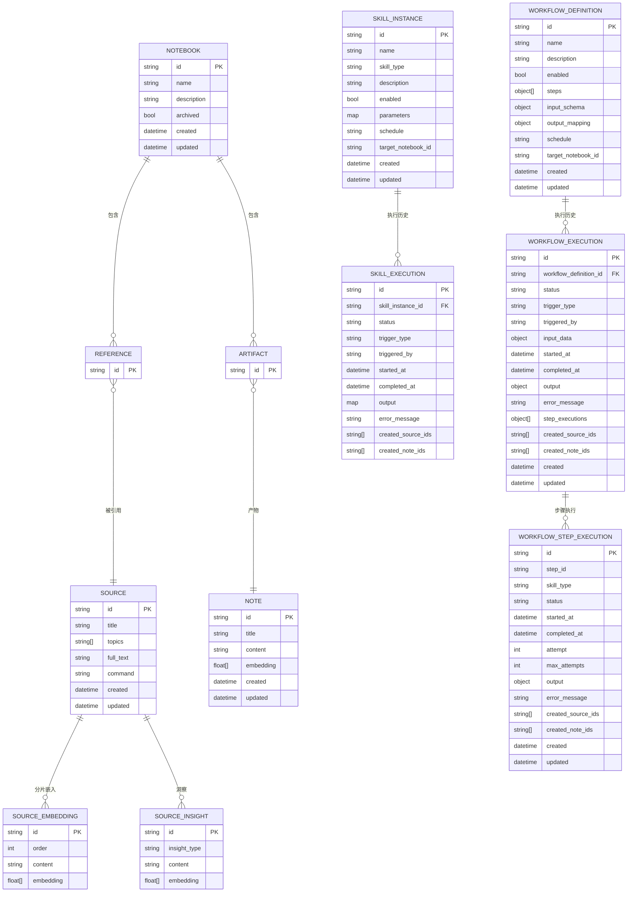
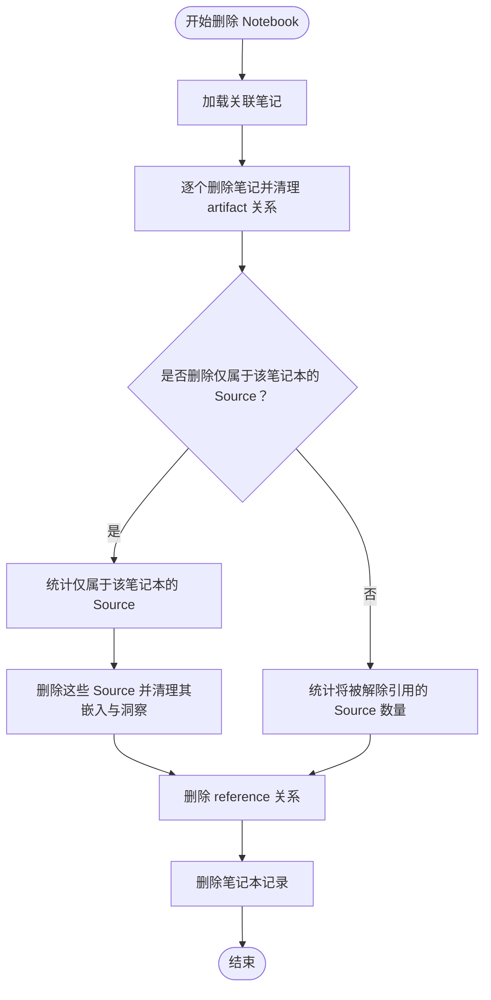
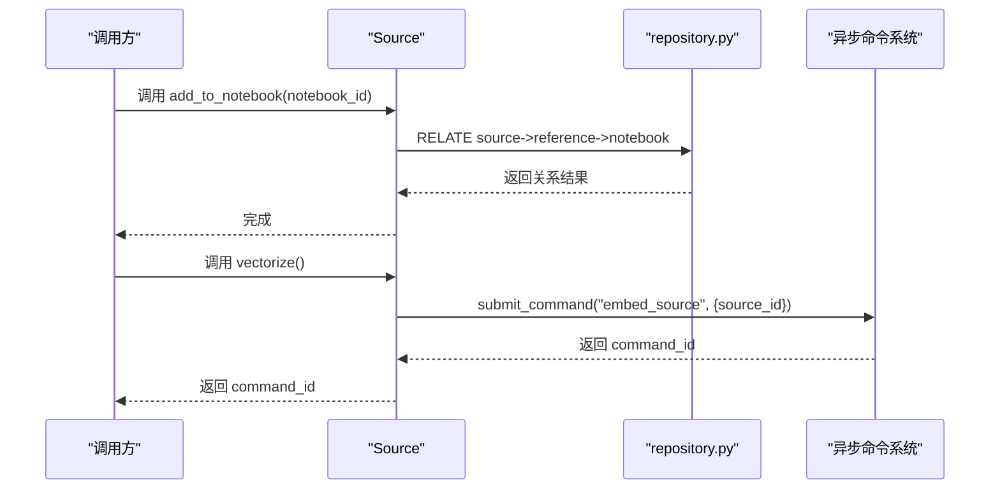
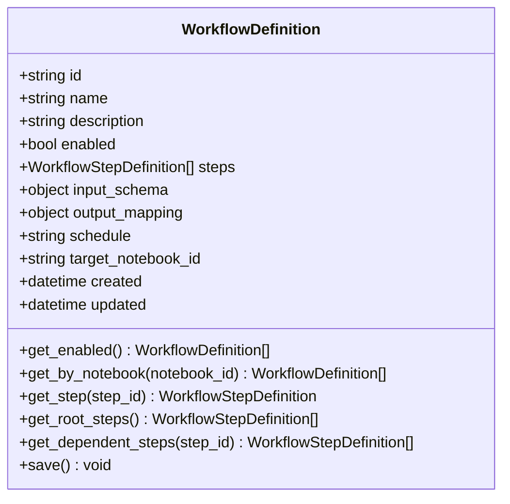
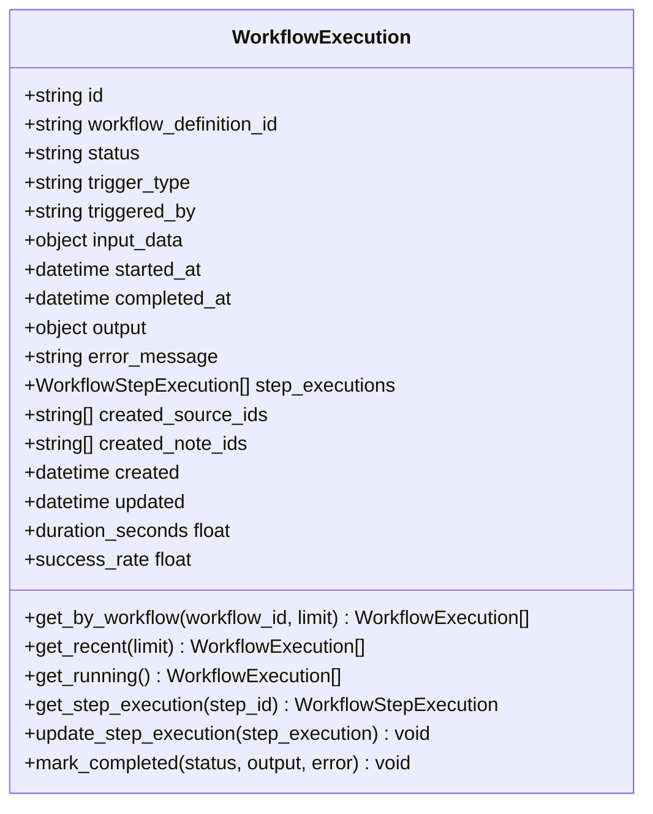
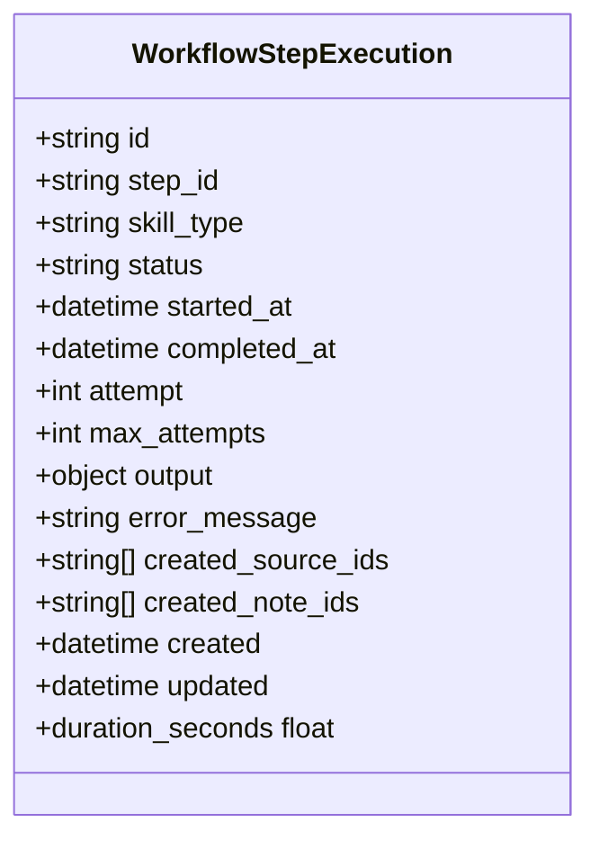
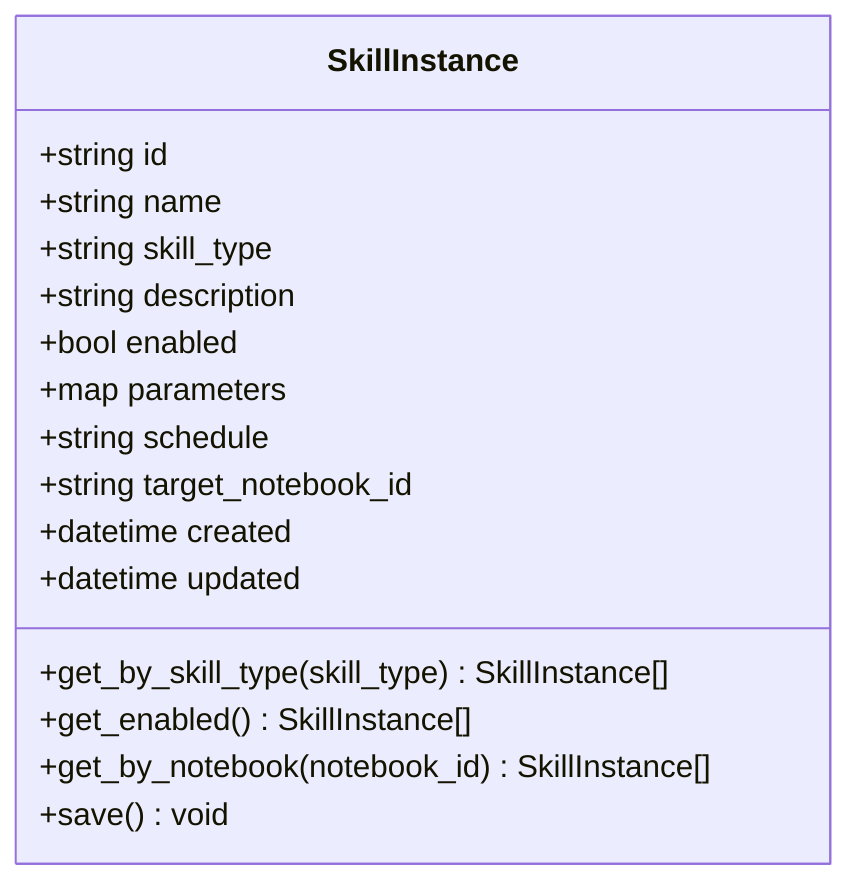
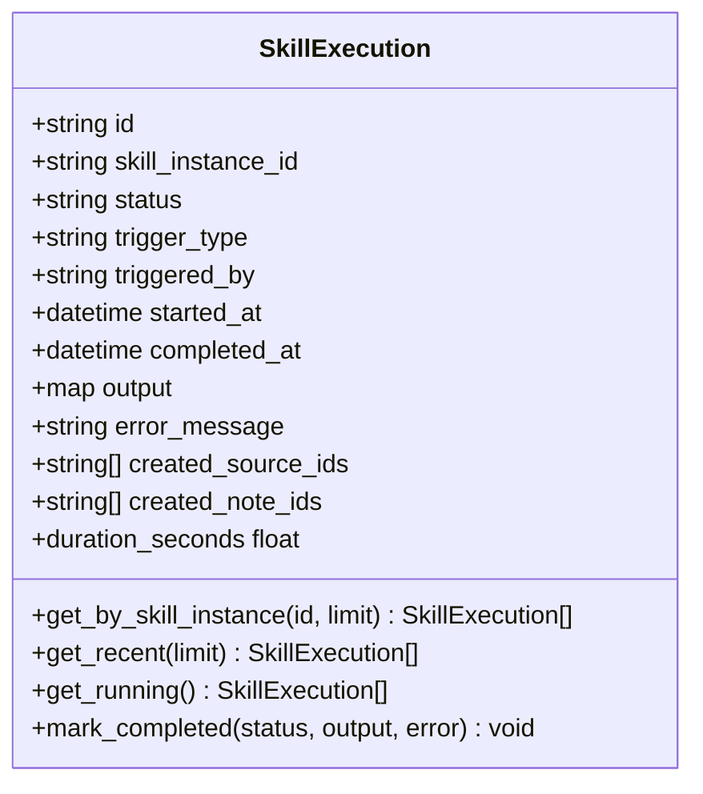
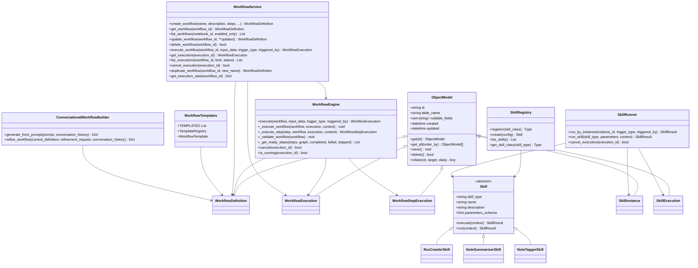

# 数据模型

<cite>
**本文引用的文件**
- [open_notebook/domain/base.py](file://open_notebook/domain/base.py)
- [open_notebook/domain/notebook.py](file://open_notebook/domain/notebook.py)
- [open_notebook/domain/skill.py](file://open_notebook/domain/skill.py)
- [open_notebook/domain/workflow.py](file://open_notebook/domain/workflow.py)
- [open_notebook/podcasts/models.py](file://open_notebook/podcasts/models.py)
- [open_notebook/database/repository.py](file://open_notebook/database/repository.py)
- [open_notebook/database/migrations/1.surrealql](file://open_notebook/database/migrations/1.surrealql)
- [open_notebook/database/migrations/14.surrealql](file://open_notebook/database/migrations/14.surrealql)
- [open_notebook/skills/base.py](file://open_notebook/skills/base.py)
- [open_notebook/skills/registry.py](file://open_notebook/skills/registry.py)
- [open_notebook/skills/runner.py](file://open_notebook/skills/runner.py)
- [open_notebook/skills/content_crawler.py](file://open_notebook/skills/content_crawler.py)
- [open_notebook/skills/note_organizer.py](file://open_notebook/skills/note_organizer.py)
- [open_notebook/workflows/engine.py](file://open_notebook/workflows/engine.py)
- [open_notebook/workflows/service.py](file://open_notebook/workflows/service.py)
- [open_notebook/workflows/templates.py](file://open_notebook/workflows/templates.py)
- [open_notebook/workflows/conversational.py](file://open_notebook/workflows/conversational.py)
- [api/routers/skills.py](file://api/routers/skills.py)
- [api/routers/workflows.py](file://api/routers/workflows.py)
- [api/routers/workflow_templates.py](file://api/routers/workflow_templates.py)
- [api/routers/workflow_builder.py](file://api/routers/workflow_builder.py)
- [api/notebook_service.py](file://api/notebook_service.py)
- [api/sources_service.py](file://api/sources_service.py)
- [api/notes_service.py](file://api/notes_service.py)
</cite>

## 更新摘要
**所做更改**
- 新增工作流实体模型的完整数据模型文档
- 添加 WorkflowDefinition、WorkflowExecution、WorkflowStepExecution 等核心工作流实体
- 包含工作流状态管理、步骤依赖关系和执行历史
- 更新数据库实体关系图以反映新的工作流系统
- 添加工作流模板系统和对话式工作流构建器
- 更新 API 路由以支持工作流管理功能

## 目录
1. [简介](#简介)
2. [项目结构](#项目结构)
3. [核心组件](#核心组件)
4. [架构总览](#架构总览)
5. [详细组件分析](#详细组件分析)
6. [依赖分析](#依赖分析)
7. [性能考量](#性能考量)
8. [故障排查指南](#故障排查指南)
9. [结论](#结论)
10. [附录](#附录)

## 简介
本文件系统化梳理 Open Notebook 的数据模型与实体关系，覆盖 Notebook（笔记本）、Source（来源）、Note（笔记）、ChatSession（聊天会话）、工作流系统（WorkflowDefinition、WorkflowExecution、WorkflowStepExecution）以及新增的技能系统（SkillInstance、SkillExecution）等核心实体的字段定义、约束、校验规则、业务规则与关系映射；并结合数据库 Schema 与函数式查询，给出实体关系图、数据访问模式、缓存与性能建议、数据生命周期与迁移路径。

## 项目结构
围绕数据模型的关键代码分布在以下模块：
- 领域模型与基类：open_notebook/domain/base.py、open_notebook/domain/notebook.py、open_notebook/domain/skill.py、open_notebook/domain/workflow.py、open_notebook/podcasts/models.py
- 技能系统：open_notebook/skills/base.py、open_notebook/skills/registry.py、open_notebook/skills/runner.py、open_notebook/skills/content_crawler.py、open_notebook/skills/note_organizer.py
- 工作流系统：open_notebook/workflows/engine.py、open_notebook/workflows/service.py、open_notebook/workflows/templates.py、open_notebook/workflows/conversational.py
- 数据访问层：open_notebook/database/repository.py
- 数据库迁移与函数：open_notebook/database/migrations/1.surrealql、open_notebook/database/migrations/14.surrealql
- API 服务封装：api/routers/skills.py、api/routers/workflows.py、api/routers/workflow_templates.py、api/routers/workflow_builder.py、api/notebook_service.py、api/sources_service.py、api/notes_service.py

```mermaid
graph TB
subgraph "领域模型"
OM["ObjectModel 基类"]
NB["Notebook"]
SRC["Source"]
NTE["Note"]
CHAT["ChatSession"]
SK["SkillInstance"]
SE["SkillExecution"]
WD["WorkflowDefinition"]
WE["WorkflowExecution"]
WSE["WorkflowStepExecution"]
EP["EpisodeProfile"]
SP["SpeakerProfile"]
PE["PodcastEpisode"]
end
subgraph "技能系统"
SB["Skill 基类"]
SR["SkillRegistry 注册表"]
RUN["SkillRunner 执行器"]
CC["RssCrawlerSkill"]
NS["NoteSummarizerSkill"]
NT["NoteTaggerSkill"]
end
subgraph "工作流系统"
WENG["WorkflowEngine 引擎"]
WSVC["WorkflowService 服务"]
WTPL["WorkflowTemplates 模板"]
WCNV["ConversationalBuilder 对话式构建器"]
end
subgraph "数据访问"
REPO["repository.py<br/>查询/创建/更新/删除/关系"]
end
subgraph "数据库"
MIG1["migrations/1.surrealql<br/>Schema/索引/函数"]
MIG14["migrations/14.surrealql<br/>工作流表结构"]
end
subgraph "API 服务"
SVC_SK["routers/skills.py"]
SVC_WF["routers/workflows.py"]
SVC_WFT["routers/workflow_templates.py"]
SVC_WFB["routers/workflow_builder.py"]
SVC_NB["notebook_service.py"]
SVC_SRC["sources_service.py"]
SVC_NTE["notes_service.py"]
end
OM --> NB
OM --> SRC
OM --> NTE
OM --> CHAT
OM --> SK
OM --> SE
OM --> WD
OM --> WE
OM --> WSE
OM --> EP
OM --> SP
OM --> PE
SK --> SR
SE --> RUN
SB --> SR
CC --> SB
NS --> SB
NT --> SB
WD --> WENG
WE --> WENG
WSE --> WENG
WENG --> WSVC
WTPL --> WSVC
WCNV --> WSVC
NB --> REPO
SRC --> REPO
NTE --> REPO
CHAT --> REPO
SK --> REPO
SE --> REPO
WD --> REPO
WE --> REPO
WSE --> REPO
EP --> REPO
SP --> REPO
PE --> REPO
REPO --> MIG1
REPO --> MIG14
SVC_SK --> SK
SVC_SK --> SE
SVC_WF --> WD
SVC_WF --> WE
SVC_WF --> WSE
SVC_WFT --> WTPL
SVC_WFB --> WCNV
SVC_NB --> NB
SVC_SRC --> SRC
SVC_NTE --> NTE
```



**图表来源**
- [open_notebook/domain/base.py](file://open_notebook/domain/base.py#L31-L196)
- [open_notebook/domain/notebook.py](file://open_notebook/domain/notebook.py#L16-L679)
- [open_notebook/domain/skill.py](file://open_notebook/domain/skill.py#L17-L162)
- [open_notebook/domain/workflow.py](file://open_notebook/domain/workflow.py#L1-L309)
- [open_notebook/podcasts/models.py](file://open_notebook/podcasts/models.py#L10-L148)
- [open_notebook/skills/base.py](file://open_notebook/skills/base.py#L83-L183)
- [open_notebook/skills/registry.py](file://open_notebook/skills/registry.py#L12-L133)
- [open_notebook/skills/runner.py](file://open_notebook/skills/runner.py#L20-L250)
- [open_notebook/skills/content_crawler.py](file://open_notebook/skills/content_crawler.py#L20-L311)
- [open_notebook/skills/note_organizer.py](file://open_notebook/skills/note_organizer.py#L19-L406)
- [open_notebook/workflows/engine.py](file://open_notebook/workflows/engine.py#L1-L620)
- [open_notebook/workflows/service.py](file://open_notebook/workflows/service.py#L1-L240)
- [open_notebook/workflows/templates.py](file://open_notebook/workflows/templates.py#L1-L675)
- [open_notebook/workflows/conversational.py](file://open_notebook/workflows/conversational.py)

## 核心组件
本节聚焦 Notebook、Source、Note、ChatSession、工作流系统以及新增的技能系统（SkillInstance、SkillExecution）的数据结构、字段、约束与业务规则。

- Notebook（笔记本）
  - 字段：name、description、archived（默认 False）
  - 约束：名称非空校验
  - 关系：通过"引用"关系连接 Source；通过"产物"关系连接 Note；可关联 ChatSession

- Source（来源）
  - 字段：asset（文件路径或URL）、title、topics、full_text、command（异步处理作业）
  - 约束：command 字段在保存时统一为 RecordID 格式；ID 支持字符串与 RecordID 输入
  - 能力：获取处理状态与进度；生成上下文；统计嵌入片段数；添加到笔记本；向量化提交后台任务；新增洞察（异步命令）

- Note（笔记）
  - 字段：title、note_type（human/ai）、content
  - 约束：内容非空校验
  - 能力：保存后提交异步嵌入任务；添加到笔记本；生成上下文

- ChatSession（聊天会话）
  - 字段：title、model_override（可空）
  - 能力：与 Notebook 或 Source 建立关联关系

- **WorkflowDefinition（工作流定义）**
  - 字段：name、description、enabled（默认 True）、steps（步骤数组）、input_schema、output_mapping、schedule、target_notebook_id、created/updated
  - 约束：steps 数组中的 step_id 必须唯一；依赖步骤必须存在；支持循环依赖检测
  - 能力：按笔记本查询；获取根步骤；获取依赖步骤；启用状态管理

- **WorkflowExecution（工作流执行历史）**
  - 字段：workflow_definition_id、status（pending/running/success/failed/cancelled/partial）、trigger_type、triggered_by、input_data、started_at、completed_at、output、error_message、step_executions、created_source_ids、created_note_ids
  - 约束：status 字段值受限；时间戳字段可空
  - 能力：按工作流查询；获取最近执行；获取运行中执行；更新步骤执行；标记完成；计算持续时间；计算成功率

- **WorkflowStepExecution（步骤执行记录）**
  - 字段：step_id、skill_type、status（pending/running/success/failed/skipped/retrying）、started_at、completed_at、attempt/max_attempts、output、error_message、created_source_ids、created_note_ids
  - 约束：状态字段值受限；尝试次数默认为1
  - 能力：计算执行时长；记录创建的资源

- SkillInstance（技能实例）
  - 字段：name、skill_type、description、enabled、parameters、schedule、target_notebook_id、created、updated
  - 约束：nullable_fields 包含 schedule、target_notebook_id、description
  - 能力：按技能类型、启用状态、笔记本筛选；保存时自动更新时间戳

- SkillExecution（技能执行历史）
  - 字段：skill_instance_id、status、trigger_type、triggered_by、started_at、completed_at、output、error_message、created_source_ids、created_note_ids
  - 约束：nullable_fields 包含 error_message、output、completed_at
  - 能力：按技能实例、最近执行、运行中状态查询；标记完成状态；计算执行时长

**章节来源**
- [open_notebook/domain/notebook.py](file://open_notebook/domain/notebook.py#L16-L231)
- [open_notebook/domain/notebook.py](file://open_notebook/domain/notebook.py#L287-L553)
- [open_notebook/domain/notebook.py](file://open_notebook/domain/notebook.py#L554-L609)
- [open_notebook/domain/notebook.py](file://open_notebook/domain/notebook.py#L610-L626)
- [open_notebook/domain/workflow.py](file://open_notebook/domain/workflow.py#L19-L309)
- [open_notebook/domain/skill.py](file://open_notebook/domain/skill.py#L17-L162)

## 架构总览
下图展示实体与数据库 Schema 的对应关系、索引与函数，以及对象模型与数据访问层的交互，包括新增的工作流系统和技能系统实体。



**图表来源**
- [open_notebook/database/migrations/1.surrealql](file://open_notebook/database/migrations/1.surrealql#L2-L73)
- [open_notebook/database/migrations/14.surrealql](file://open_notebook/database/migrations/14.surrealql#L1-L65)
- [open_notebook/domain/notebook.py](file://open_notebook/domain/notebook.py#L16-L679)
- [open_notebook/domain/skill.py](file://open_notebook/domain/skill.py#L24-L92)
- [open_notebook/domain/workflow.py](file://open_notebook/domain/workflow.py#L68-L309)

## 详细组件分析

### Notebook 实体
- 字段与约束
  - name：非空校验
  - description：可选
  - archived：布尔，默认 False
- 关系
  - 与 Source：reference 关系（多对多）
  - 与 Note：artifact 关系（多对多）
  - 与 ChatSession：通过"指向"关系建立关联
- 删除策略
  - 获取删除预览：统计将被删除的笔记数量、仅属于该笔记本的 Source 数量、与其他笔记本共享的 Source 数量
  - 删除操作：先删除所有笔记及其 artifact 关系；再按选项删除仅属于该笔记本的 Source，或仅解除引用；最后删除笔记本记录



**图表来源**
- [open_notebook/domain/notebook.py](file://open_notebook/domain/notebook.py#L88-L231)

**章节来源**
- [open_notebook/domain/notebook.py](file://open_notebook/domain/notebook.py#L16-L87)
- [open_notebook/domain/notebook.py](file://open_notebook/domain/notebook.py#L88-L231)

### Source 实体
- 字段与约束
  - asset：文件路径或 URL
  - title/topics/full_text：可选
  - command：RecordID 格式（保存前转换）
- 能力
  - 获取处理状态与进度（基于关联的异步命令）
  - 生成上下文（短/长两种模式）
  - 统计嵌入片段数
  - 添加到笔记本（建立 reference 关系）
  - 向量化：提交 embed_source 异步命令
  - 新增洞察：提交 create_insight 异步命令
  - 删除：清理上传文件、嵌入与洞察，再删除记录



**图表来源**
- [open_notebook/domain/notebook.py](file://open_notebook/domain/notebook.py#L406-L456)
- [open_notebook/database/repository.py](file://open_notebook/database/repository.py#L106-L121)

**章节来源**
- [open_notebook/domain/notebook.py](file://open_notebook/domain/notebook.py#L287-L553)
- [open_notebook/database/repository.py](file://open_notebook/database/repository.py#L106-L121)

### Note 实体
- 字段与约束
  - title/content：可选；content 非空校验
  - note_type：枚举 human/ai
- 能力
  - 保存：提交 embed_note 异步命令（当存在有效内容时）
  - 添加到笔记本：建立 artifact 关系
  - 生成上下文：短/长两种模式

```mermaid
sequenceDiagram
participant Caller as "调用方"
participant Note as "Note"
participant Repo as "repository.py"
participant Cmd as "异步命令系统"
Caller->>Note : 调用 save()
Note->>Repo : INSERT/UPDATE 记录
Repo-->>Note : 返回最新记录
Note->>Cmd : submit_command("embed_note", {note_id})
Cmd-->>Note : 返回 command_id
Note-->>Caller : 返回 command_id
```

**图表来源**
- [open_notebook/domain/notebook.py](file://open_notebook/domain/notebook.py#L568-L591)
- [open_notebook/database/repository.py](file://open_notebook/database/repository.py#L85-L104)

**章节来源**
- [open_notebook/domain/notebook.py](file://open_notebook/domain/notebook.py#L554-L609)

### ChatSession 实体
- 字段与约束
  - title：可选
  - model_override：可空
- 能力
  - 与 Notebook 建立关联：relate("refers_to", notebook_id)
  - 与 Source 建立关联：relate("refers_to", source_id)

**章节来源**
- [open_notebook/domain/notebook.py](file://open_notebook/domain/notebook.py#L610-L626)

### WorkflowDefinition 实体（新增）
- 字段与约束
  - name：必填
  - description：可选描述
  - enabled：布尔，是否启用，默认 True
  - steps：步骤数组，每个步骤包含 step_id、skill_type、parameters、depends_on、condition、retry_on_fail、retry_delay_seconds、continue_on_fail
  - input_schema：输入参数验证模式
  - output_mapping：输出映射模板
  - schedule：可选 Cron 表达式
  - target_notebook_id：可选目标笔记本 ID
  - created/updated：时间戳，自动管理
- 关系
  - 与 WorkflowExecution：一对多关系，记录执行历史
- 查询能力
  - 按启用状态查询：get_enabled()
  - 按笔记本查询：get_by_notebook()
  - 获取根步骤：get_root_steps()
  - 获取依赖步骤：get_dependent_steps()



**图表来源**
- [open_notebook/domain/workflow.py](file://open_notebook/domain/workflow.py#L68-L138)

**章节来源**
- [open_notebook/domain/workflow.py](file://open_notebook/domain/workflow.py#L68-L138)

### WorkflowExecution 实体（新增）
- 字段与约束
  - workflow_definition_id：外键，关联工作流定义
  - status：执行状态，枚举 pending/running/success/failed/cancelled/partial
  - trigger_type：触发类型，枚举 manual/schedule/event/api
  - triggered_by：触发者标识
  - input_data：输入参数
  - started_at/completed_at：时间戳
  - output：最终聚合输出
  - error_message：错误信息
  - step_executions：步骤执行历史数组
  - created_source_ids/created_note_ids：创建的资源 ID 列表
- 关系
  - 与 WorkflowDefinition：多对一关系
  - 与 WorkflowStepExecution：一对多关系
- 查询能力
  - 按工作流查询：get_by_workflow()
  - 最近执行查询：get_recent()
  - 运行中查询：get_running()
- 工具方法
  - get_step_execution()：获取特定步骤执行记录
  - update_step_execution()：更新或添加步骤执行记录
  - mark_completed()：标记执行完成
  - duration_seconds：计算执行时长
  - success_rate：计算步骤成功率



**图表来源**
- [open_notebook/domain/workflow.py](file://open_notebook/domain/workflow.py#L184-L298)

**章节来源**
- [open_notebook/domain/workflow.py](file://open_notebook/domain/workflow.py#L184-L298)

### WorkflowStepExecution 实体（新增）
- 字段与约束
  - step_id：步骤 ID
  - skill_type：技能类型
  - status：执行状态，枚举 pending/running/success/failed/skipped/retrying
  - started_at/completed_at：时间戳
  - attempt/max_attempts：尝试次数
  - output：执行输出结果
  - error_message：错误信息
  - created_source_ids/created_note_ids：创建的资源 ID 列表
- 关系
  - 与 WorkflowExecution：多对一关系
- 工具方法
  - duration_seconds：计算执行时长



**图表来源**
- [open_notebook/domain/workflow.py](file://open_notebook/domain/workflow.py#L140-L182)

**章节来源**
- [open_notebook/domain/workflow.py](file://open_notebook/domain/workflow.py#L140-L182)

### SkillInstance 实体（新增）
- 字段与约束
  - name：必填
  - skill_type：技能类型标识符
  - description：可选描述
  - enabled：布尔，是否启用
  - parameters：字典参数，存储技能配置
  - schedule：可选 Cron 表达式，用于定时执行
  - target_notebook_id：可选目标笔记本 ID
  - created/updated：时间戳，自动管理
- 关系
  - 与 SkillExecution：一对多关系，记录执行历史
- 查询能力
  - 按技能类型查询：get_by_skill_type()
  - 按启用状态查询：get_enabled()
  - 按笔记本查询：get_by_notebook()



**图表来源**
- [open_notebook/domain/skill.py](file://open_notebook/domain/skill.py#L17-L79)

**章节来源**
- [open_notebook/domain/skill.py](file://open_notebook/domain/skill.py#L17-L79)

### SkillExecution 实体（新增）
- 字段与约束
  - skill_instance_id：外键，关联技能实例
  - status：执行状态，枚举 pending/running/success/failed/cancelled
  - trigger_type：触发类型，枚举 manual/schedule/event
  - triggered_by：触发者标识
  - started_at/completed_at：时间戳
  - output：执行输出结果
  - error_message：错误信息
  - created_source_ids/created_note_ids：创建的资源 ID 列表
- 关系
  - 与 SkillInstance：多对一关系
- 查询能力
  - 按技能实例查询：get_by_skill_instance()
  - 最近执行查询：get_recent()
  - 运行中查询：get_running()
- 工具方法
  - mark_completed()：标记执行完成
  - duration_seconds：计算执行时长



**图表来源**
- [open_notebook/domain/skill.py](file://open_notebook/domain/skill.py#L81-L162)

**章节来源**
- [open_notebook/domain/skill.py](file://open_notebook/domain/skill.py#L81-L162)

### Podcasts 模型（扩展）
- EpisodeProfile：播客剧集配置简档，包含大纲与口播模型、默认简报、段落数等
- SpeakerProfile：说话人配置简档，包含 TTS 提供商与模型、1-4 名说话人配置
- PodcastEpisode：播客剧集记录，包含生成元数据、音频文件、转录、提纲、命令 ID

**章节来源**
- [open_notebook/podcasts/models.py](file://open_notebook/podcasts/models.py#L10-L148)

## 依赖分析
- 对象模型基类
  - ObjectModel 提供统一的 CRUD、关系建立、时间戳处理与字段过滤（nullable_fields）
- 数据访问层
  - repository.py 封装查询、创建、更新、删除、关系建立、Upsert 等操作，并负责 RecordID 解析与连接管理
- 数据库 Schema 与函数
  - migrations/1.surrealql 定义表结构、字段类型、事件触发器、索引与全文检索函数
  - migrations/14.surrealql 定义工作流相关表结构、字段约束与索引
- 技能系统架构
  - Skill 基类提供抽象接口和生命周期钩子
  - SkillRegistry 管理技能注册和实例化
  - SkillRunner 处理技能执行和状态管理
- 工作流系统架构
  - WorkflowEngine 负责工作流执行、依赖解析、并行执行和状态管理
  - WorkflowService 提供工作流定义和执行的高级操作
  - WorkflowTemplates 提供预定义工作流模板
  - ConversationalWorkflowBuilder 支持自然语言生成工作流



**图表来源**
- [open_notebook/domain/base.py](file://open_notebook/domain/base.py#L31-L196)
- [open_notebook/domain/workflow.py](file://open_notebook/domain/workflow.py#L1-L309)
- [open_notebook/domain/skill.py](file://open_notebook/domain/skill.py#L17-L162)
- [open_notebook/workflows/engine.py](file://open_notebook/workflows/engine.py#L130-L620)
- [open_notebook/workflows/service.py](file://open_notebook/workflows/service.py#L22-L240)
- [open_notebook/workflows/templates.py](file://open_notebook/workflows/templates.py#L12-L675)
- [open_notebook/workflows/conversational.py](file://open_notebook/workflows/conversational.py)
- [open_notebook/skills/base.py](file://open_notebook/skills/base.py#L83-L183)
- [open_notebook/skills/registry.py](file://open_notebook/skills/registry.py#L12-L133)
- [open_notebook/skills/runner.py](file://open_notebook/skills/runner.py#L20-L250)

**章节来源**
- [open_notebook/domain/base.py](file://open_notebook/domain/base.py#L31-L196)
- [open_notebook/database/repository.py](file://open_notebook/database/repository.py#L65-L195)
- [open_notebook/database/migrations/1.surrealql](file://open_notebook/database/migrations/1.surrealql#L1-L179)
- [open_notebook/database/migrations/14.surrealql](file://open_notebook/database/migrations/14.surrealql#L1-L65)
- [open_notebook/skills/base.py](file://open_notebook/skills/base.py#L83-L183)
- [open_notebook/skills/registry.py](file://open_notebook/skills/registry.py#L12-L133)
- [open_notebook/skills/runner.py](file://open_notebook/skills/runner.py#L20-L250)
- [open_notebook/workflows/engine.py](file://open_notebook/workflows/engine.py#L130-L620)
- [open_notebook/workflows/service.py](file://open_notebook/workflows/service.py#L22-L240)
- [open_notebook/workflows/templates.py](file://open_notebook/workflows/templates.py#L12-L675)
- [open_notebook/workflows/conversational.py](file://open_notebook/workflows/conversational.py)

## 性能考量
- 异步处理与后台任务
  - Source 向量化与 Note 嵌入均通过异步命令提交，避免阻塞主流程与连接池耗尽
  - 技能执行通过 SkillRunner 异步管理，支持并发执行多个技能实例
  - 工作流执行通过 WorkflowEngine 异步管理，支持并行执行多个步骤
- 查询与索引
  - 全文检索与向量相似度检索通过函数实现，配合索引提升性能
  - 新增的技能执行历史查询支持按时间排序和限制返回数量
  - 工作流执行历史查询支持按工作流 ID、状态和时间排序
- 批量写入
  - repository.insert 支持批量插入，可忽略重复项以降低冲突日志噪声
- 缓存策略
  - 当前未见显式缓存实现；可在应用层对热点查询结果进行短期缓存（如笔记/来源列表、技能实例列表、工作流定义列表），注意与数据库一致性同步

## 故障排查指南
- 数据库异常
  - repository 层对运行时错误（如事务冲突）进行区分与重抛，便于上层重试
- 对象模型校验失败
  - ObjectModel.save 在保存前执行严格校验，字段为空或格式不符会抛出异常
- 删除失败
  - Notebook 删除过程中若部分 Source 删除失败会记录警告并继续流程
- 技能执行异常
  - SkillRunner 捕获技能执行中的异常并记录到 SkillExecution
  - 支持取消正在运行的技能执行，但实际进程可能无法强制终止
- 工作流执行异常
  - WorkflowEngine 检测循环依赖并抛出异常
  - 支持步骤重试和继续执行策略
  - 支持取消正在运行的工作流执行

**章节来源**
- [open_notebook/database/repository.py](file://open_notebook/database/repository.py#L65-L104)
- [open_notebook/domain/base.py](file://open_notebook/domain/base.py#L113-L161)
- [open_notebook/domain/notebook.py](file://open_notebook/domain/notebook.py#L138-L231)
- [open_notebook/skills/runner.py](file://open_notebook/skills/runner.py#L133-L150)
- [open_notebook/workflows/engine.py](file://open_notebook/workflows/engine.py#L345-L373)

## 结论
本文从实体定义、关系映射、约束与业务规则出发，结合数据库 Schema 与函数，给出了 Open Notebook 的数据模型全景。通过异步命令与索引优化，系统在保证一致性的同时兼顾了性能与可扩展性。新增的工作流系统进一步增强了自动化能力，通过 WorkflowEngine 和 WorkflowService 提供了灵活的工作流编排和执行机制。新增的技能系统增强了单个技能的自动化能力，而工作流系统则提供了多技能协同的复杂工作流编排。后续可在应用层引入缓存与更细粒度的生命周期管理策略。

## 附录

### 数据访问模式
- 服务层封装
  - NotebookService/SourcesService/NotesService 将 API 响应转换为领域对象，简化调用方逻辑
  - Skill 路由器提供技能实例管理、执行控制和历史查询的完整 API
  - Workflow 路由器提供工作流定义管理、执行控制和历史查询的完整 API
  - WorkflowTemplate 路由器提供模板浏览和实例化的 API
  - WorkflowBuilder 路由器提供对话式工作流生成的 API
- 对象模型持久化
  - 通过 ObjectModel.save/save/relate/delete 等方法完成数据持久化与关系维护
- 工作流系统访问模式
  - WorkflowDefinition 和 WorkflowExecution 通过专门的查询方法支持按条件筛选
  - WorkflowEngine 提供统一的工作流执行入口，支持手动和定时执行模式
  - WorkflowService 提供高级工作流操作，协调引擎、领域模型和外部系统

**章节来源**
- [api/notebook_service.py](file://api/notebook_service.py#L13-L88)
- [api/sources_service.py](file://api/sources_service.py#L66-L200)
- [api/notes_service.py](file://api/notes_service.py#L13-L104)
- [api/routers/skills.py](file://api/routers/skills.py#L1-L399)
- [api/routers/workflows.py](file://api/routers/workflows.py#L1-L453)
- [api/routers/workflow_templates.py](file://api/routers/workflow_templates.py#L1-L215)
- [api/routers/workflow_builder.py](file://api/routers/workflow_builder.py#L1-L305)
- [open_notebook/domain/base.py](file://open_notebook/domain/base.py#L113-L196)
- [open_notebook/domain/workflow.py](file://open_notebook/domain/workflow.py#L107-L138)
- [open_notebook/domain/skill.py](file://open_notebook/domain/skill.py#L49-L162)
- [open_notebook/skills/runner.py](file://open_notebook/skills/runner.py#L41-L197)
- [open_notebook/workflows/engine.py](file://open_notebook/workflows/engine.py#L144-L203)
- [open_notebook/workflows/service.py](file://open_notebook/workflows/service.py#L32-L142)

### 数据验证与业务规则
- 字段校验
  - Notebook.name、Note.content 非空校验
  - Source.command、PodcastEpisode.command 的 RecordID 格式转换
  - 技能实例的参数验证和配置校验
  - 工作流定义的步骤 ID 唯一性校验和依赖关系验证
- 业务规则
  - 删除 Notebook 时可选择删除仅属于该笔记本的 Source
  - Source/Note 的嵌入通过异步命令提交，避免阻塞
  - 技能实例必须注册后才能使用，支持禁用状态管理
  - 技能执行历史记录完整的生命周期状态
  - 工作流定义支持循环依赖检测和状态管理
  - 工作流执行支持并行步骤执行和重试机制

**章节来源**
- [open_notebook/domain/notebook.py](file://open_notebook/domain/notebook.py#L22-L27)
- [open_notebook/domain/notebook.py](file://open_notebook/domain/notebook.py#L561-L566)
- [open_notebook/domain/notebook.py](file://open_notebook/domain/notebook.py#L300-L317)
- [open_notebook/podcasts/models.py](file://open_notebook/podcasts/models.py#L132-L138)
- [open_notebook/domain/skill.py](file://open_notebook/domain/skill.py#L31-L47)
- [open_notebook/skills/content_crawler.py](file://open_notebook/skills/content_crawler.py#L75-L85)
- [open_notebook/skills/note_organizer.py](file://open_notebook/skills/note_organizer.py#L82-L88)
- [open_notebook/domain/workflow.py](file://open_notebook/domain/workflow.py#L345-L373)
- [open_notebook/workflows/engine.py](file://open_notebook/workflows/engine.py#L431-L437)

### 数据生命周期、保留与归档
- 归档
  - Notebook.archived 字段用于标记归档状态
- 删除
  - Notebook 删除时可级联删除笔记与可选删除仅属于该笔记本的 Source
  - Source 删除时自动清理嵌入与洞察记录
- 保留策略
  - 仓库未定义显式的自动清理策略；可在上层业务中结合 archived 与外部归档流程实现
  - 技能执行历史可通过查询参数限制返回数量，支持定期清理过期记录
  - 工作流执行历史可通过查询参数限制返回数量，支持定期清理过期记录
- 工作流模板
  - 预定义模板可直接实例化为工作流定义，支持参数覆盖和启用状态管理

**章节来源**
- [open_notebook/domain/notebook.py](file://open_notebook/domain/notebook.py#L18-L20)
- [open_notebook/domain/notebook.py](file://open_notebook/domain/notebook.py#L138-L231)
- [open_notebook/database/migrations/1.surrealql](file://open_notebook/database/migrations/1.surrealql#L29-L32)
- [open_notebook/domain/skill.py](file://open_notebook/domain/skill.py#L117-L132)
- [open_notebook/domain/workflow.py](file://open_notebook/domain/workflow.py#L230-L247)
- [open_notebook/workflows/templates.py](file://open_notebook/workflows/templates.py#L641-L675)

### 数据库 Schema 图与实体关系图
- Schema 定义
  - 表：notebook、source、source_embedding、source_insight、note、reference、artifact、skill_instance、skill_execution、workflow_definition、workflow_execution、workflow_step_execution
  - 索引：标题、全文、内容等字段的 BM25 索引
  - 函数：文本搜索与向量搜索函数
- 字段覆盖
  - 14 号迁移：新增工作流相关表结构，包括 workflow_definition、workflow_execution、workflow_step_execution
  - 定义了工作流状态枚举约束和索引优化
- 新增实体
  - workflow_definition：存储工作流配置和步骤定义
  - workflow_execution：记录工作流执行历史和状态
  - workflow_step_execution：记录单个步骤的执行详情

**章节来源**
- [open_notebook/database/migrations/1.surrealql](file://open_notebook/database/migrations/1.surrealql#L2-L73)
- [open_notebook/database/migrations/1.surrealql](file://open_notebook/database/migrations/1.surrealql#L74-L173)
- [open_notebook/database/migrations/14.surrealql](file://open_notebook/database/migrations/14.surrealql#L1-L65)
- [open_notebook/domain/workflow.py](file://open_notebook/domain/workflow.py#L68-L309)

### 搜索与检索
- 文本搜索：fn::text_search 支持来源标题、来源全文、来源洞察、笔记标题与内容的联合检索
- 向量搜索：fn::vector_search 基于 embedding 计算余弦相似度
- 技能系统搜索
  - 技能实例按技能类型、启用状态、笔记本进行筛选
  - 技能执行按实例、时间顺序、状态进行查询
- 工作流系统搜索
  - 工作流定义按启用状态、笔记本进行筛选
  - 工作流执行按工作流 ID、状态、时间进行查询

**章节来源**
- [open_notebook/domain/notebook.py](file://open_notebook/domain/notebook.py#L628-L679)
- [open_notebook/database/migrations/1.surrealql](file://open_notebook/database/migrations/1.surrealql#L74-L173)
- [open_notebook/domain/skill.py](file://open_notebook/domain/skill.py#L50-L73)
- [open_notebook/domain/skill.py](file://open_notebook/domain/skill.py#L117-L140)
- [open_notebook/domain/workflow.py](file://open_notebook/domain/workflow.py#L107-L138)
- [open_notebook/domain/workflow.py](file://open_notebook/domain/workflow.py#L230-L247)

### 迁移与版本管理
- 迁移管理
  - 同步包装器 MigrationManager 调用异步迁移管理器，提供当前版本查询与执行
- 版本演进
  - 1 号迁移：定义核心表、字段、索引与函数
  - 14 号迁移：新增工作流相关表结构（workflow_definition、workflow_execution、workflow_step_execution）
  - 技能系统：通过新增实体和关系扩展现有 Schema
  - 工作流系统：通过新增实体和关系扩展现有 Schema

**章节来源**
- [open_notebook/database/migrate.py](file://open_notebook/database/migrate.py#L6-L27)
- [open_notebook/database/migrations/1.surrealql](file://open_notebook/database/migrations/1.surrealql#L1-L179)
- [open_notebook/database/migrations/14.surrealql](file://open_notebook/database/migrations/14.surrealql#L1-L65)

### 工作流系统 API 接口
- 工作流定义管理
  - GET /workflows：列出工作流定义（支持按笔记本和启用状态过滤）
  - POST /workflows：创建工作流定义
  - GET /workflows/{workflow_id}：获取特定工作流定义
  - PATCH /workflows/{workflow_id}：更新工作流定义
  - DELETE /workflows/{workflow_id}：删除工作流定义
  - POST /workflows/{workflow_id}/duplicate：复制工作流定义
- 工作流执行管理
  - POST /workflows/{workflow_id}/execute：执行工作流
  - GET /workflows/executions：列出执行历史（支持按工作流、状态、限制数量过滤）
  - GET /workflows/executions/{execution_id}：获取特定执行详情
  - POST /workflows/executions/{execution_id}/cancel：取消执行
- 工作流统计
  - GET /workflows/{workflow_id}/stats：获取工作流统计信息
  - GET /workflows/stats/overview：获取全局统计信息
- 工作流调度
  - GET /workflows/{workflow_id}/schedule：获取工作流调度信息
  - PATCH /workflows/{workflow_id}/schedule：更新工作流调度
  - POST /workflows/{workflow_id}/enable：启用工作流
  - POST /workflows/{workflow_id}/disable：禁用工作流

**章节来源**
- [api/routers/workflows.py](file://api/routers/workflows.py#L199-L453)

### 工作流模板系统 API 接口
- 模板浏览
  - GET /workflow-templates：列出可用模板（支持按类别过滤）
  - GET /workflow-templates/{template_id}：获取特定模板
  - GET /workflow-templates/categories：获取所有模板类别
- 模板实例化
  - POST /workflow-templates/{template_id}/instantiate：从模板创建工作流
  - 快速创建接口：POST /workflow-templates/quick/rss-to-notes、POST /workflow-templates/quick/repurpose-content

**章节来源**
- [api/routers/workflow_templates.py](file://api/routers/workflow_templates.py#L87-L215)

### 对话式工作流构建器 API 接口
- 生成工作流
  - POST /workflow-builder/generate：从自然语言生成工作流定义
  - POST /workflow-builder/refine：根据反馈精炼工作流定义
- 工作流建议
  - GET /workflow-builder/suggestions：获取工作流建议
  - POST /workflow-builder/quick-create：从建议快速创建工作流
- 模板匹配
  - POST /workflow-builder/match-template：根据描述匹配最佳模板
- 需求分析
  - POST /workflow-builder/analyze-requirements：分析用户需求并建议工作流结构

**章节来源**
- [api/routers/workflow_builder.py](file://api/routers/workflow_builder.py#L84-L305)

### 工作流实现示例
- RSS 监控到笔记管道：监控 RSS 源，提取文章并自动生成摘要笔记
- 内容二次创作管道：将长篇文章转换为多种格式（Twitter、LinkedIn、Newsletter）
- 竞争对手监控管道：监控竞争对手网站变化并生成洞察
- 笔记本自动整理管道：自动标记、总结和组织笔记本内容
- 研究摘要管道：将一周的研究内容整理为摘要报告
- Vikki 内容运营管道：基于四象限方法论的 IP 内容策略
- 播客制作管道：从源内容生成播客剧集

**章节来源**
- [open_notebook/workflows/templates.py](file://open_notebook/workflows/templates.py#L54-L634)