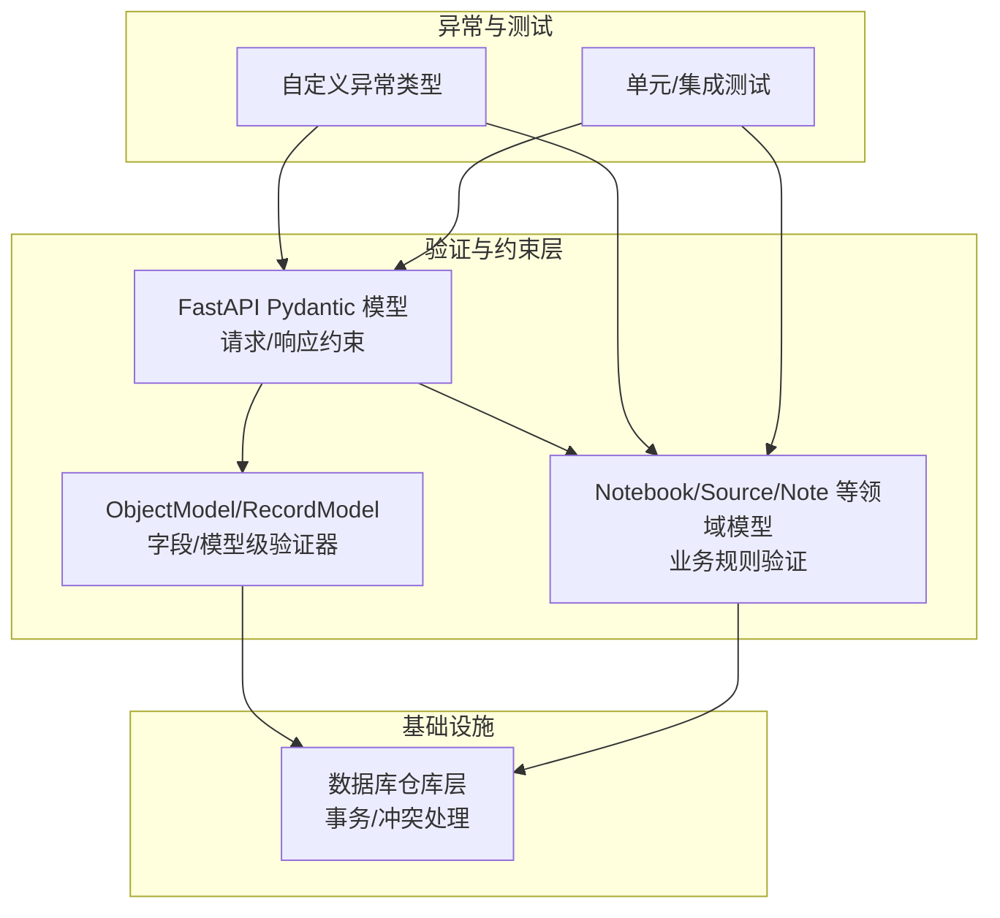
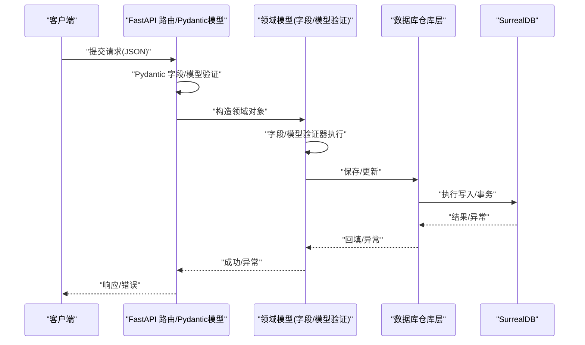
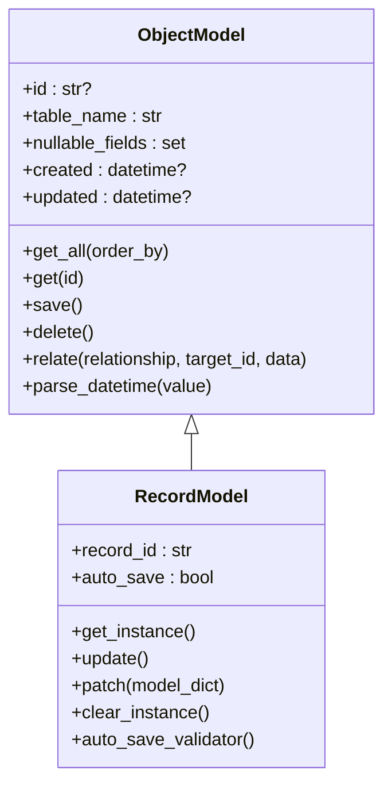
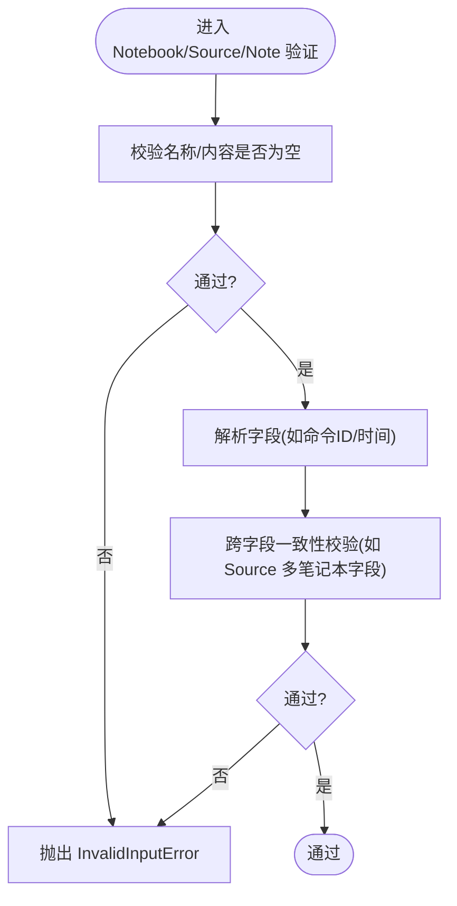
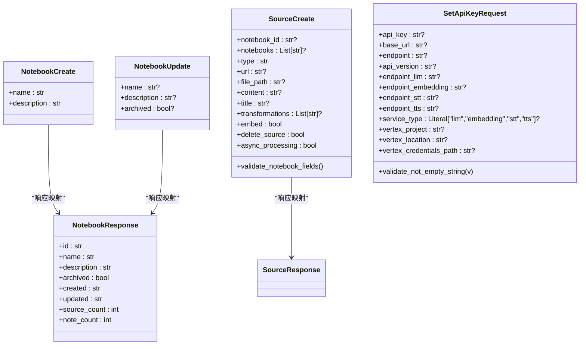
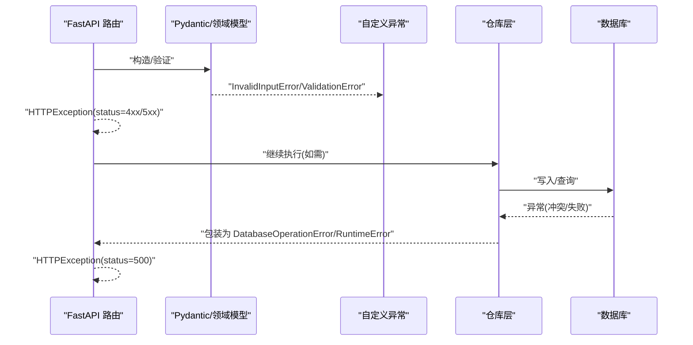
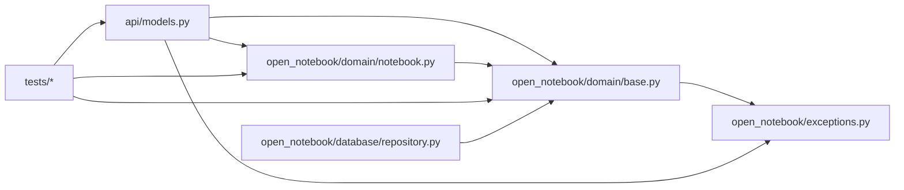

# 数据验证与约束

<cite>
**本文引用的文件**
- [open_notebook/domain/base.py](file://open_notebook/domain/base.py)
- [open_notebook/domain/notebook.py](file://open_notebook/domain/notebook.py)
- [api/models.py](file://api/models.py)
- [open_notebook/exceptions.py](file://open_notebook/exceptions.py)
- [docs/7-DEVELOPMENT/code-standards.md](file://docs/7-DEVELOPMENT/code-standards.md)
- [tests/test_domain.py](file://tests/test_domain.py)
- [tests/test_models_api.py](file://tests/test_models_api.py)
- [open_notebook/database/repository.py](file://open_notebook/database/repository.py)
</cite>

## 目录
1. [简介](#简介)
2. [项目结构](#项目结构)
3. [核心组件](#核心组件)
4. [架构总览](#架构总览)
5. [详细组件分析](#详细组件分析)
6. [依赖关系分析](#依赖关系分析)
7. [性能考量](#性能考量)
8. [故障排查指南](#故障排查指南)
9. [结论](#结论)
10. [附录](#附录)

## 简介
本文件系统性梳理本项目的“数据验证与约束”体系，覆盖 Pydantic 模型验证器（字段级与模型级）、自定义验证函数、数据类型转换、格式校验、业务规则校验、错误处理与异常管理、数据完整性与约束机制，并给出性能优化建议与最佳实践。内容基于后端 Python 代码与测试用例，辅以开发规范文档，帮助开发者在新增或修改模型时遵循统一的验证与约束策略。

## 项目结构
围绕验证与约束的关键模块与文件如下：
- 领域基类与通用验证：open_notebook/domain/base.py
- 具体领域模型与业务规则：open_notebook/domain/notebook.py
- API 请求/响应模型与约束：api/models.py
- 自定义异常类型：open_notebook/exceptions.py
- 开发规范与验证模式参考：docs/7-DEVELOPMENT/code-standards.md
- 单元测试与集成测试：tests/test_domain.py、tests/test_models_api.py
- 数据访问层与事务冲突处理：open_notebook/database/repository.py

图表来源
- [open_notebook/domain/base.py](file://open_notebook/domain/base.py#L31-L204)
- [open_notebook/domain/notebook.py](file://open_notebook/domain/notebook.py#L16-L679)
- [api/models.py](file://api/models.py#L1-L685)
- [open_notebook/exceptions.py](file://open_notebook/exceptions.py#L1-L71)
- [open_notebook/database/repository.py](file://open_notebook/database/repository.py#L183-L194)

章节来源
- [open_notebook/domain/base.py](file://open_notebook/domain/base.py#L1-L329)
- [open_notebook/domain/notebook.py](file://open_notebook/domain/notebook.py#L1-L679)
- [api/models.py](file://api/models.py#L1-L685)
- [open_notebook/exceptions.py](file://open_notebook/exceptions.py#L1-L71)
- [docs/7-DEVELOPMENT/code-standards.md](file://docs/7-DEVELOPMENT/code-standards.md#L1-L376)

## 核心组件
- 字段级验证器（field_validator）：用于对单个字段进行格式、类型与值范围校验；支持 before/after 模式。
- 模型级验证器（model_validator）：对整个模型实例进行跨字段一致性与业务规则校验。
- 自定义验证函数：通过装饰器或显式调用实现复杂业务逻辑与外部条件校验。
- 数据类型转换：字符串到日期时间、RecordID 解析、字段归一化（如去除前后空格）。
- 约束与默认值：使用 Pydantic Field 的约束参数（如最小长度、最大值、枚举等），以及类变量控制可空字段。
- 异常与错误处理：统一的自定义异常类型，结合 FastAPI HTTP 异常返回一致的错误响应。
- 数据完整性：保存前的模型验证、可空字段白名单、数据库事务冲突重试策略。

章节来源
- [open_notebook/domain/base.py](file://open_notebook/domain/base.py#L198-L204)
- [open_notebook/domain/notebook.py](file://open_notebook/domain/notebook.py#L22-L27)
- [api/models.py](file://api/models.py#L307-L324)
- [open_notebook/exceptions.py](file://open_notebook/exceptions.py#L1-L71)

## 架构总览
下图展示从 API 到领域模型再到数据库的验证与约束流程，包括字段验证、模型验证、业务规则与异常传播路径。

图表来源
- [api/models.py](file://api/models.py#L1-L685)
- [open_notebook/domain/base.py](file://open_notebook/domain/base.py#L113-L161)
- [open_notebook/database/repository.py](file://open_notebook/database/repository.py#L183-L194)

## 详细组件分析

### 组件A：通用对象模型与记录模型（ObjectModel/RecordModel）
- 字段级验证器：对 created/updated 字段进行 ISO 时间字符串解析，确保入库前为 datetime 对象。
- 模型级验证器：RecordModel 提供 after 模式验证器，提示异步更新的注意事项。
- 保存流程：先 model_validate(strict=True)，再准备保存数据（可空字段白名单），最后写入数据库。
- 关系操作：relate 前进行输入合法性校验，避免空关系或目标 ID。
- 记录模型单例：RecordModel 支持按 record_id 的单例缓存，避免重复实例。

图表来源
- [open_notebook/domain/base.py](file://open_notebook/domain/base.py#L31-L204)
- [open_notebook/domain/base.py](file://open_notebook/domain/base.py#L206-L329)

章节来源
- [open_notebook/domain/base.py](file://open_notebook/domain/base.py#L198-L204)
- [open_notebook/domain/base.py](file://open_notebook/domain/base.py#L113-L161)
- [open_notebook/domain/base.py](file://open_notebook/domain/base.py#L281-L288)

### 组件B：笔记/源/注释领域模型（Notebook/Source/Note）
- Notebook 名称非空校验：去除空白后若为空则抛出 InvalidInputError。
- Source 命令字段解析：支持字符串与 RecordID 输入，统一转为 RecordID 存储。
- Note 内容非空校验：允许 None，但空字符串或仅空白将被拒绝。
- 文本/向量检索：关键词非空校验，防止无效查询。
- 删除级联：Notebook 删除时统计删除/解链数量，保证数据一致性。

图表来源
- [open_notebook/domain/notebook.py](file://open_notebook/domain/notebook.py#L22-L27)
- [open_notebook/domain/notebook.py](file://open_notebook/domain/notebook.py#L300-L317)
- [open_notebook/domain/notebook.py](file://open_notebook/domain/notebook.py#L561-L566)

章节来源
- [open_notebook/domain/notebook.py](file://open_notebook/domain/notebook.py#L22-L27)
- [open_notebook/domain/notebook.py](file://open_notebook/domain/notebook.py#L300-L317)
- [open_notebook/domain/notebook.py](file://open_notebook/domain/notebook.py#L561-L566)

### 组件C：API 请求/响应模型与约束
- NotebookCreate/Update/Response：字段级约束（如最小长度、可空）与默认值。
- SearchRequest：限制查询类型、结果上限、分数阈值等。
- SourceCreate：多笔记本支持与互斥字段校验（notebook_id 与 notebooks 二选一），自动归一化为 notebooks 数组。
- SetApiKeyRequest：字段去空格/空串转 None，避免无效配置。
- 错误响应模型：ErrorResponse 统一错误结构。

图表来源
- [api/models.py](file://api/models.py#L7-L29)
- [api/models.py](file://api/models.py#L12-L18)
- [api/models.py](file://api/models.py#L20-L29)
- [api/models.py](file://api/models.py#L280-L324)
- [api/models.py](file://api/models.py#L482-L505)

章节来源
- [api/models.py](file://api/models.py#L307-L324)
- [api/models.py](file://api/models.py#L482-L505)

### 组件D：验证错误处理与异常管理
- 自定义异常：InvalidInputError、NotFoundError、DatabaseOperationError 等，用于区分不同错误场景。
- FastAPI 层：在路由中捕获自定义异常并转换为 HTTP 异常，保持一致的错误响应。
- 数据库层：事务冲突按预期重试，非预期错误包装为 RuntimeError 并上抛。

图表来源
- [open_notebook/exceptions.py](file://open_notebook/exceptions.py#L1-L71)
- [open_notebook/domain/base.py](file://open_notebook/domain/base.py#L152-L160)
- [open_notebook/database/repository.py](file://open_notebook/database/repository.py#L183-L194)

章节来源
- [open_notebook/exceptions.py](file://open_notebook/exceptions.py#L1-L71)
- [open_notebook/domain/base.py](file://open_notebook/domain/base.py#L152-L160)
- [open_notebook/database/repository.py](file://open_notebook/database/repository.py#L183-L194)

### 组件E：数据完整性与约束机制
- 可空字段白名单：_prepare_save_data 仅保留非 None 值或在白名单中的字段，避免写入 None。
- 字段解析与归一化：时间字符串解析、命令 ID/RecordID 规范化、API Key 去空格处理。
- 业务规则约束：SourceCreate 中 notebook_id 与 notebooks 的互斥校验，Notebook 名称与 Note 内容的非空校验。
- 删除级联与计数：Notebook 删除前统计删除/解链数量，保证关系完整性。

章节来源
- [open_notebook/domain/base.py](file://open_notebook/domain/base.py#L162-L168)
- [open_notebook/domain/notebook.py](file://open_notebook/domain/notebook.py#L307-L324)
- [open_notebook/domain/notebook.py](file://open_notebook/domain/notebook.py#L22-L27)
- [open_notebook/domain/notebook.py](file://open_notebook/domain/notebook.py#L561-L566)

## 依赖关系分析
- 模型依赖：API 层 Pydantic 模型依赖于领域模型；领域模型依赖于通用 ObjectModel/RecordModel 与数据库仓库层。
- 异常依赖：自定义异常贯穿 API、领域与仓库层，形成统一的错误语义。
- 测试依赖：单元测试覆盖字段验证、业务规则与边界条件；集成测试覆盖模型重复性与提供者可用性。

图表来源
- [api/models.py](file://api/models.py#L1-L685)
- [open_notebook/domain/base.py](file://open_notebook/domain/base.py#L1-L329)
- [open_notebook/domain/notebook.py](file://open_notebook/domain/notebook.py#L1-L679)
- [open_notebook/exceptions.py](file://open_notebook/exceptions.py#L1-L71)
- [open_notebook/database/repository.py](file://open_notebook/database/repository.py#L183-L194)

章节来源
- [api/models.py](file://api/models.py#L1-L685)
- [open_notebook/domain/base.py](file://open_notebook/domain/base.py#L1-L329)
- [open_notebook/domain/notebook.py](file://open_notebook/domain/notebook.py#L1-L679)
- [open_notebook/exceptions.py](file://open_notebook/exceptions.py#L1-L71)
- [open_notebook/database/repository.py](file://open_notebook/database/repository.py#L183-L194)

## 性能考量
- 避免在验证器中执行昂贵操作：验证器应轻量，IO 或复杂计算放在后续流程。
- 使用严格模式验证：在保存前 model_validate(strict=True) 可提前发现类型不匹配，减少后续错误。
- 可空字段白名单：减少写入冗余字段，降低存储与索引开销。
- 批量处理与异步：如嵌入与洞察生成采用命令队列异步处理，避免阻塞请求线程。
- 事务冲突重试：仓库层对并发冲突进行日志记录与重试，提升吞吐稳定性。

## 故障排查指南
- 常见错误类型
  - 输入非法：InvalidInputError（如空名称、空内容、空关键词）。
  - 数据库操作失败：DatabaseOperationError（含事务冲突与运行时错误）。
  - 资源不存在：NotFoundError。
- 排查步骤
  - 检查 API 请求体是否符合 Pydantic 约束（长度、范围、类型）。
  - 查看领域模型验证器是否触发（名称/内容非空、跨字段互斥）。
  - 关注仓库层日志与异常包装，定位具体失败点。
  - 对事务冲突类错误，确认并发写入策略与重试配置。
- 相关测试参考
  - Notebook/Note/Source/Podcast 等验证用例覆盖边界与异常分支。

章节来源
- [open_notebook/exceptions.py](file://open_notebook/exceptions.py#L1-L71)
- [open_notebook/domain/base.py](file://open_notebook/domain/base.py#L152-L160)
- [open_notebook/database/repository.py](file://open_notebook/database/repository.py#L183-L194)
- [tests/test_domain.py](file://tests/test_domain.py#L74-L108)
- [tests/test_domain.py](file://tests/test_domain.py#L209-L243)

## 结论
本项目通过“API 层约束 + 领域模型验证 + 通用基类增强 + 统一异常体系”的组合，实现了从请求到持久化的全链路数据验证与约束。字段级与模型级验证器配合可空字段白名单与严格的保存流程，有效保障了数据完整性与一致性。结合异步命令与事务冲突处理，系统在保证正确性的同时兼顾了性能与可维护性。

## 附录
- 最佳实践清单
  - 在 API 层使用 Pydantic Field 约束与模型级校验，明确最小/最大值、枚举与必填项。
  - 将业务规则放入模型级验证器，避免分散在服务层。
  - 对外部输入进行解析与归一化（如时间、ID、敏感配置），并在保存前统一验证。
  - 使用自定义异常类型表达不同错误语义，便于前端与监控系统识别。
  - 对高成本操作采用异步命令队列，避免阻塞请求。
  - 针对并发写入，利用仓库层的冲突重试与日志记录，确保最终一致性。