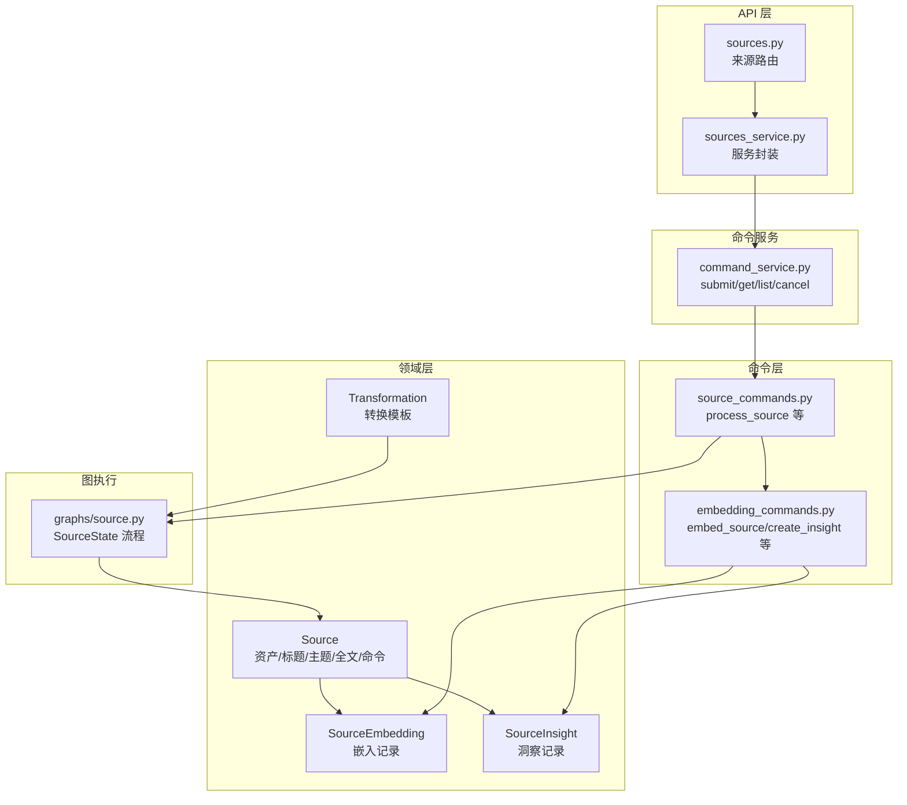
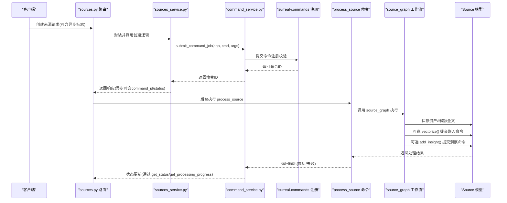
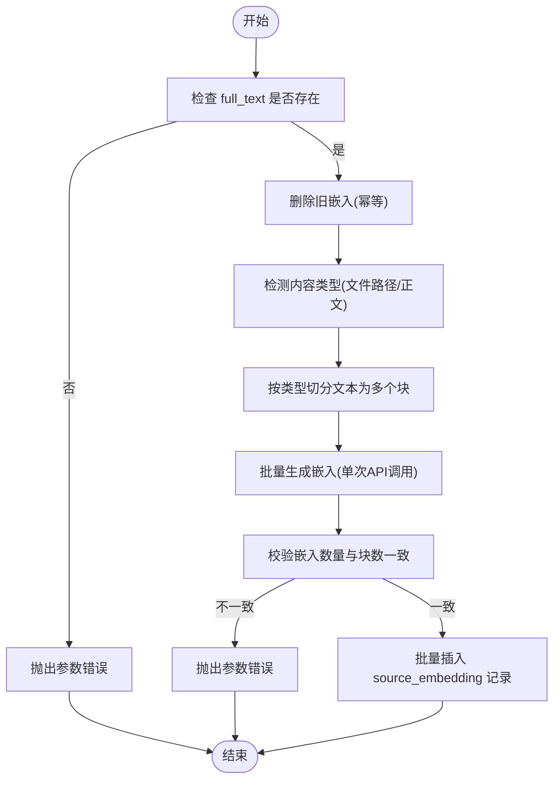
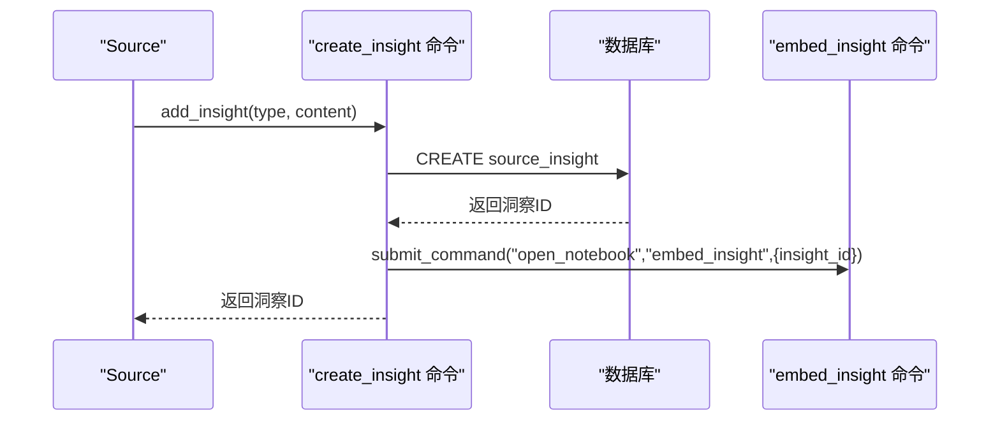
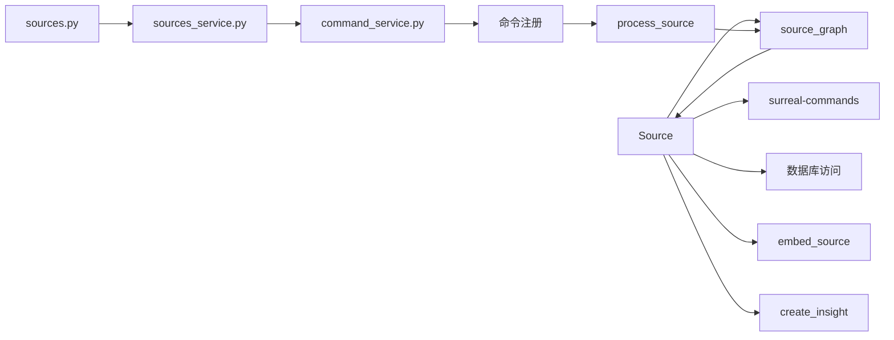

# 内容源实体模型

<cite>
**本文引用的文件**
- [open_notebook/domain/notebook.py](file://open_notebook/domain/notebook.py)
- [api/routers/sources.py](file://api/routers/sources.py)
- [commands/source_commands.py](file://commands/source_commands.py)
- [open_notebook/graphs/source.py](file://open_notebook/graphs/source.py)
- [commands/embedding_commands.py](file://commands/embedding_commands.py)
- [api/command_service.py](file://api/command_service.py)
- [api/sources_service.py](file://api/sources_service.py)
- [open_notebook/domain/transformation.py](file://open_notebook/domain/transformation.py)
- [open_notebook/exceptions.py](file://open_notebook/exceptions.py)
</cite>

## 目录
1. [简介](#简介)
2. [项目结构](#项目结构)
3. [核心组件](#核心组件)
4. [架构总览](#架构总览)
5. [详细组件分析](#详细组件分析)
6. [依赖分析](#依赖分析)
7. [性能考量](#性能考量)
8. [故障排查指南](#故障排查指南)
9. [结论](#结论)
10. [附录：使用示例与最佳实践](#附录使用示例与最佳实践)

## 简介
本文件系统性阐述“内容源”实体模型，重点围绕 Source 类的数据结构、字段定义、处理逻辑与异步处理机制展开。内容涵盖以下要点：
- Source 核心字段（asset、title、topics、full_text、command）的语义与数据类型
- 与 Processing Job 的关联关系及命令模式（surreal-commands）
- 关键方法实现细节：get_status()、get_processing_progress()、get_context()
- 向量化处理流程、嵌入生成与洞察创建的异步命令链路
- 文件清理、错误处理与状态跟踪机制
- 实际代码示例路径，展示如何添加、处理与查询内容源

## 项目结构
围绕内容源的处理，涉及以下模块协同工作：
- 领域层：Source 模型与相关实体（SourceEmbedding、SourceInsight）
- API 层：来源路由与服务封装（sources.py、sources_service.py）
- 命令层：异步处理命令（source_commands.py、embedding_commands.py）
- 图执行：LangGraph 工作流（open_notebook/graphs/source.py）
- 命令服务：统一提交与状态查询（api/command_service.py）
- 异常体系：统一错误类型（open_notebook/exceptions.py）

图表来源
- [open_notebook/domain/notebook.py](file://open_notebook/domain/notebook.py#L288-L552)
- [api/routers/sources.py](file://api/routers/sources.py#L350-L549)
- [commands/source_commands.py](file://commands/source_commands.py#L48-L155)
- [open_notebook/graphs/source.py](file://open_notebook/graphs/source.py#L19-L168)
- [commands/embedding_commands.py](file://commands/embedding_commands.py#L340-L440)
- [api/command_service.py](file://api/command_service.py#L1-L92)

章节来源
- [open_notebook/domain/notebook.py](file://open_notebook/domain/notebook.py#L288-L552)
- [api/routers/sources.py](file://api/routers/sources.py#L350-L549)
- [commands/source_commands.py](file://commands/source_commands.py#L48-L155)
- [open_notebook/graphs/source.py](file://open_notebook/graphs/source.py#L19-L168)
- [commands/embedding_commands.py](file://commands/embedding_commands.py#L340-L440)
- [api/command_service.py](file://api/command_service.py#L1-L92)

## 核心组件
- Source：内容源实体，承载资产、标题、主题、全文以及与 Processing Job 的关联（command 字段）。提供状态查询、进度获取、上下文导出、向量化、洞察创建、删除清理等能力。
- SourceEmbedding：嵌入记录，与 Source 多对一关联，用于向量检索。
- SourceInsight：洞察记录，与 Source 多对一关联，支持保存为笔记。
- Transformation：转换模板，驱动洞察生成的提示词与流程。

章节来源
- [open_notebook/domain/notebook.py](file://open_notebook/domain/notebook.py#L288-L552)
- [open_notebook/domain/transformation.py](file://open_notebook/domain/transformation.py#L8-L22)

## 架构总览
内容从“来源路由”进入，根据同步或异步模式分发到命令层；命令层通过 LangGraph 执行工作流，完成内容抽取、保存、可选的嵌入与洞察生成；最终通过命令服务进行状态跟踪与管理。

图表来源
- [api/routers/sources.py](file://api/routers/sources.py#L350-L549)
- [api/sources_service.py](file://api/sources_service.py#L128-L218)
- [api/command_service.py](file://api/command_service.py#L11-L44)
- [commands/source_commands.py](file://commands/source_commands.py#L48-L155)
- [open_notebook/graphs/source.py](file://open_notebook/graphs/source.py#L151-L168)
- [open_notebook/domain/notebook.py](file://open_notebook/domain/notebook.py#L411-L502)

## 详细组件分析

### Source 类数据结构与字段定义
- 字段概览
  - asset: 可选资产对象，包含 file_path 与 url
  - title: 可选标题
  - topics: 主题列表，默认空
  - full_text: 可选全文内容
  - command: 可选命令引用（RecordID 或字符串），指向 surreal-commands 的处理作业
- 数据类型与约束
  - command 字段在序列化前会解析为 RecordID 格式，确保数据库一致性
  - id 支持字符串或 RecordID 输入，统一转为字符串存储
- 关系
  - 与 SourceEmbedding：一对多（嵌入块）
  - 与 SourceInsight：一对多（洞察）
  - 与 Transformation：通过工作流触发洞察生成

章节来源
- [open_notebook/domain/notebook.py](file://open_notebook/domain/notebook.py#L288-L317)

### 关键方法实现细节

#### get_status()
- 功能：查询与该 Source 绑定的 Processing Job 当前状态
- 行为：
  - 若未绑定 command，返回 None
  - 通过命令服务获取状态，异常时返回 "unknown"
- 返回值：状态字符串（如 queued/running/completed/failed/unknown）

章节来源
- [open_notebook/domain/notebook.py](file://open_notebook/domain/notebook.py#L318-L331)

#### get_processing_progress()
- 功能：获取更详细的处理进度与元数据
- 行为：
  - 获取命令状态与结果中的执行元数据（如 started_at/completed_at）
  - 包含错误信息与原始结果
- 返回值：字典，包含 status、时间戳、错误、结果等

章节来源
- [open_notebook/domain/notebook.py](file://open_notebook/domain/notebook.py#L332-L359)

#### get_context(context_size)
- 功能：按需导出 Source 上下文，用于检索或聊天
- 行为：
  - 获取所有洞察并序列化
  - short 模式仅返回 id/title/insights
  - long 模式额外返回 full_text

章节来源
- [open_notebook/domain/notebook.py](file://open_notebook/domain/notebook.py#L361-L375)

#### get_embedded_chunks()
- 功能：统计该 Source 的嵌入块数量
- 行为：基于数据库查询聚合计数，异常时抛出数据库操作异常

章节来源
- [open_notebook/domain/notebook.py](file://open_notebook/domain/notebook.py#L376-L391)

#### get_insights()
- 功能：加载该 Source 的所有洞察
- 行为：查询并构造 SourceInsight 对象列表，异常时抛出数据库操作异常

章节来源
- [open_notebook/domain/notebook.py](file://open_notebook/domain/notebook.py#L392-L404)

#### add_to_notebook(notebook_id)
- 功能：将 Source 与笔记本建立关联
- 行为：通过关系查询创建 reference 边，避免重复

章节来源
- [open_notebook/domain/notebook.py](file://open_notebook/domain/notebook.py#L406-L409)

#### vectorize()
- 功能：提交异步嵌入任务（embed_source）
- 行为：
  - 校验 full_text 是否存在
  - 通过命令服务提交 embed_source
  - 返回命令ID，用于后续状态跟踪
- 错误：无文本时抛出参数错误；提交失败时抛出数据库操作异常

章节来源
- [open_notebook/domain/notebook.py](file://open_notebook/domain/notebook.py#L411-L456)

#### add_insight(insight_type, content)
- 功能：提交异步洞察创建（create_insight）
- 行为：
  - 提交 create_insight 命令（内部自动重试事务冲突）
  - 成功后异步提交 embed_insight
  - 返回命令ID，便于追踪
- 错误：参数为空时抛出输入错误；提交失败返回 None 并记录日志

章节来源
- [open_notebook/domain/notebook.py](file://open_notebook/domain/notebook.py#L457-L502)

#### delete()
- 功能：删除 Source 并清理资源
- 行为：
  - 删除上传文件（若存在）
  - 清理嵌入与洞察记录
  - 删除数据库记录
- 错误：文件删除失败仅记录警告；嵌入/洞察清理失败记录警告并继续

章节来源
- [open_notebook/domain/notebook.py](file://open_notebook/domain/notebook.py#L514-L552)

### 异步处理与命令模式

#### 来源路由中的异步/同步分支
- 异步路径（async_processing=True）
  - 先创建最小化 Source 记录，立即返回（含 command_id/status/processing_info）
  - 导入命令模块以确保注册
  - 通过 CommandService.submit_command_job 提交 process_source
  - 更新 Source.command 并持久化
- 同步路径（async_processing=False）
  - 在线程池中执行 execute_command_sync
  - 成功后刷新 Source 并返回完整结果

章节来源
- [api/routers/sources.py](file://api/routers/sources.py#L350-L549)

#### 命令层：process_source
- 加载转换模板并校验
- 更新 Source.command 引用
- 调用 source_graph 执行工作流
- 统计嵌入块数与洞察数，返回处理结果

章节来源
- [commands/source_commands.py](file://commands/source_commands.py#L48-L155)

#### 图执行：source_graph
- 节点
  - content_process：根据内容状态配置引擎并提取内容
  - save_source：更新 Source 的资产与全文，并可触发 vectorize()
  - transform_content：应用 Transformation 生成洞察并写入
- 边与条件
  - 从 content_process 到 save_source
  - save_source 条件触发 transform_content（当存在转换模板）

章节来源
- [open_notebook/graphs/source.py](file://open_notebook/graphs/source.py#L19-L168)

#### 嵌入与洞察命令
- embed_source：删除旧嵌入、按内容类型切分、批量生成嵌入并批量入库
- create_insight：创建洞察记录并异步提交 embed_insight

章节来源
- [commands/embedding_commands.py](file://commands/embedding_commands.py#L340-L440)
- [commands/embedding_commands.py](file://commands/embedding_commands.py#L442-L539)

### 向量化处理流程（算法流程图）

图表来源
- [commands/embedding_commands.py](file://commands/embedding_commands.py#L340-L440)

### 洞察创建与嵌入（序列图）

图表来源
- [open_notebook/domain/notebook.py](file://open_notebook/domain/notebook.py#L457-L502)
- [commands/embedding_commands.py](file://commands/embedding_commands.py#L442-L539)

## 依赖分析
- Source 依赖
  - 命令服务：通过 surreal-commands 获取状态与提交作业
  - 数据库访问：通过 repo_query/repo_create/repo_update/repo_delete 进行 CRUD
  - LangGraph：通过 source_graph 执行工作流
- API 层依赖
  - sources_service：封装 API 客户端调用，返回增强结果（异步时含 command_id/status）
  - command_service：统一命令提交与状态查询
- 命令层依赖
  - source_commands：process_source、run_transformation
  - embedding_commands：embed_source、create_insight、embed_insight
- 异常体系
  - DatabaseOperationError、InvalidInputError、NotFoundError 等

图表来源
- [open_notebook/domain/notebook.py](file://open_notebook/domain/notebook.py#L318-L502)
- [api/routers/sources.py](file://api/routers/sources.py#L350-L549)
- [api/sources_service.py](file://api/sources_service.py#L128-L218)
- [api/command_service.py](file://api/command_service.py#L1-L92)
- [commands/source_commands.py](file://commands/source_commands.py#L48-L155)
- [commands/embedding_commands.py](file://commands/embedding_commands.py#L340-L440)

章节来源
- [open_notebook/domain/notebook.py](file://open_notebook/domain/notebook.py#L318-L502)
- [api/routers/sources.py](file://api/routers/sources.py#L350-L549)
- [api/sources_service.py](file://api/sources_service.py#L128-L218)
- [api/command_service.py](file://api/command_service.py#L1-L92)
- [commands/source_commands.py](file://commands/source_commands.py#L48-L155)
- [commands/embedding_commands.py](file://commands/embedding_commands.py#L340-L440)

## 性能考量
- 异步命令模式
  - 使用 surreal-commands 将长耗时任务（下载/解析/嵌入/洞察）移至后台，避免阻塞 HTTP 请求
  - 通过指数抖动退避策略应对队列拥堵与瞬时故障
- 向量化优化
  - 单次 API 调用批量生成嵌入，减少网络往返
  - 按内容类型智能切分，兼顾精度与性能
- 幂等与重试
  - 嵌入前先删除旧记录，保证幂等
  - 命令层对事务冲突进行自动重试，提升吞吐稳定性

[本节为通用指导，无需特定文件来源]

## 故障排查指南
- 常见错误类型
  - 参数错误：如缺少 full_text、空洞察内容、无效的转换ID
  - 数据库操作错误：查询/插入/删除失败
  - 命令提交失败：模块未注册、命令名不存在
- 排查步骤
  - 通过 Source.get_status() 与 get_processing_progress() 获取命令状态与错误信息
  - 在 API 层使用 get_source_status() 查询状态
  - 检查命令服务的 get_command_status() 返回的 progress 与 error_message
  - 查看命令日志（surreal-commands 自动记录最终失败原因）
- 清理与回滚
  - Source.delete() 会尝试删除文件、嵌入与洞察，失败仅记录警告
  - 嵌入命令幂等删除旧记录，重新提交即可修复

章节来源
- [open_notebook/domain/notebook.py](file://open_notebook/domain/notebook.py#L318-L552)
- [api/routers/sources.py](file://api/routers/sources.py#L706-L740)
- [api/command_service.py](file://api/command_service.py#L47-L68)
- [open_notebook/exceptions.py](file://open_notebook/exceptions.py#L7-L71)

## 结论
Source 类作为内容源的核心实体，通过清晰的字段定义与完善的异步处理机制，实现了从内容抽取、保存、嵌入到洞察生成的全链路自动化。配合 LangGraph 工作流与 surreal-commands 命令系统，系统具备高吞吐、强容错与良好扩展性。建议在生产环境中充分利用异步模式与状态查询接口，结合幂等命令与重试策略，确保大规模内容处理的稳定性与可观测性。

[本节为总结性内容，无需特定文件来源]

## 附录：使用示例与最佳实践

### 添加内容源（异步模式）
- 步骤
  - 调用创建接口，设置 async_processing=True
  - 接收响应中的 command_id 与 status
  - 使用命令服务轮询状态，直至 completed 或 failed
- 示例路径
  - [api/routers/sources.py](file://api/routers/sources.py#L350-L426)
  - [api/sources_service.py](file://api/sources_service.py#L128-L218)
  - [api/command_service.py](file://api/command_service.py#L11-L44)

### 处理内容源（同步模式）
- 步骤
  - 设置 async_processing=False
  - 在线程池中执行同步命令
  - 成功后刷新 Source 并获取嵌入块数
- 示例路径
  - [api/routers/sources.py](file://api/routers/sources.py#L427-L526)

### 查询处理状态
- 步骤
  - 调用 get_status()/get_processing_progress()
  - 或通过 API 的 get_source_status()
- 示例路径
  - [open_notebook/domain/notebook.py](file://open_notebook/domain/notebook.py#L318-L359)
  - [api/routers/sources.py](file://api/routers/sources.py#L706-L740)

### 触发洞察生成
- 步骤
  - 调用 add_insight() 提交 create_insight 命令
  - 命令完成后自动提交 embed_insight
- 示例路径
  - [open_notebook/domain/notebook.py](file://open_notebook/domain/notebook.py#L457-L502)
  - [commands/embedding_commands.py](file://commands/embedding_commands.py#L442-L539)

### 向量化处理
- 步骤
  - 调用 vectorize() 提交 embed_source 命令
  - 通过 get_embedded_chunks() 统计嵌入块数
- 示例路径
  - [open_notebook/domain/notebook.py](file://open_notebook/domain/notebook.py#L411-L456)
  - [commands/embedding_commands.py](file://commands/embedding_commands.py#L340-L440)

### 最佳实践
- 异步优先：大文档或批量导入建议使用异步模式，避免阻塞
- 幂等设计：嵌入与洞察命令均具备幂等特性，可安全重试
- 错误隔离：利用命令层的重试策略与异常类型，快速定位问题
- 资源清理：删除 Source 时自动清理文件、嵌入与洞察，避免悬挂数据

[本节为实践指导，无需特定文件来源]