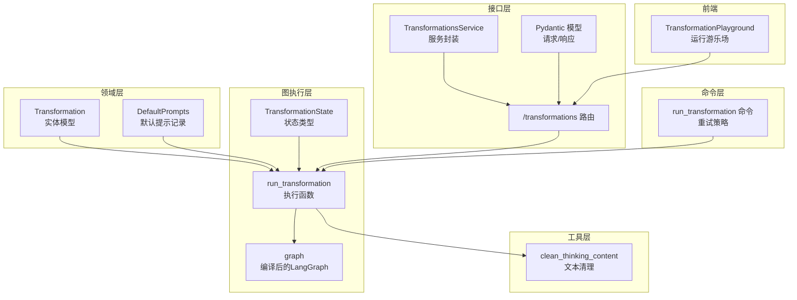
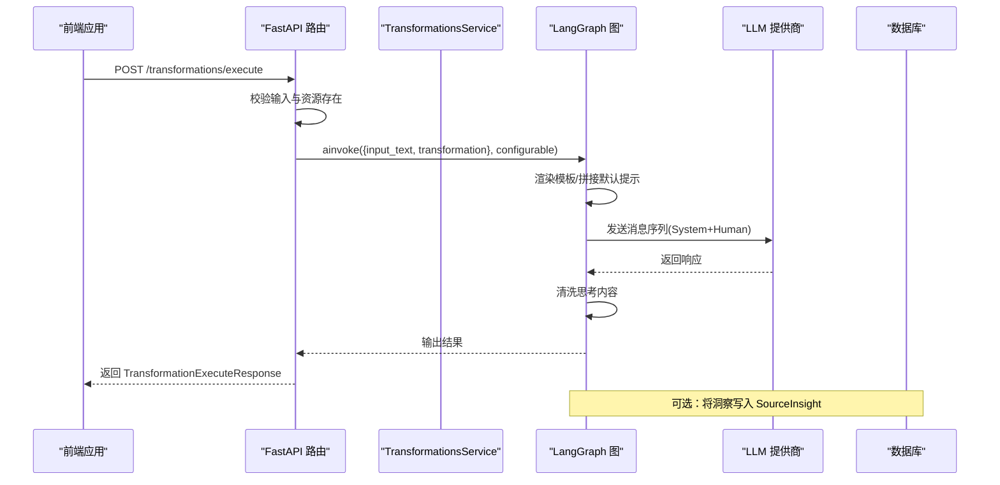
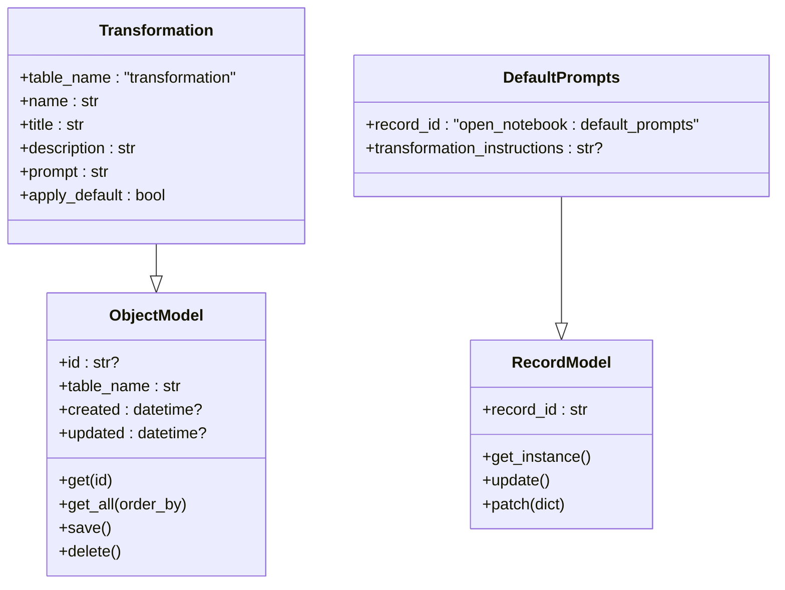
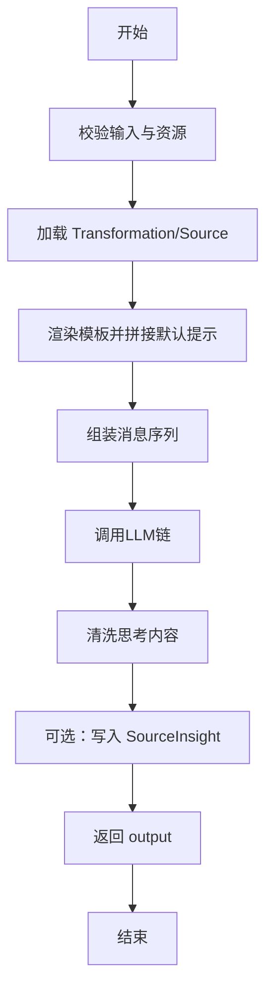
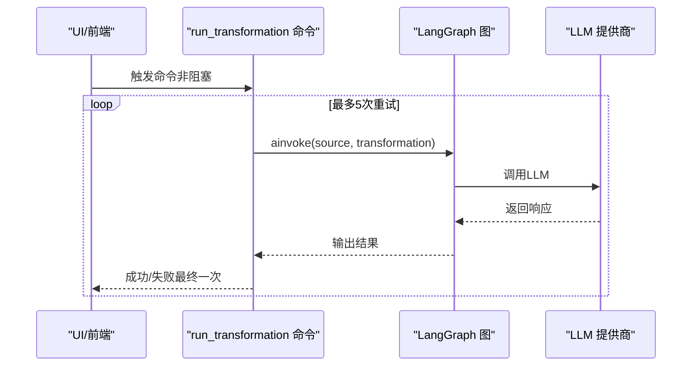
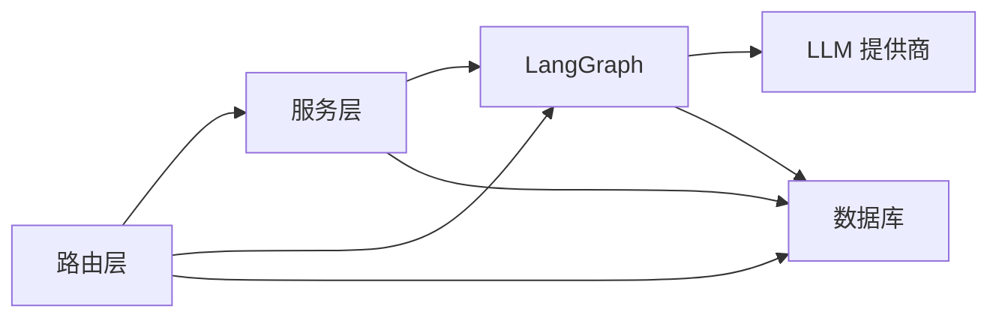

# 内容转换实体模型

<cite>
**本文引用的文件**
- [open_notebook/domain/transformation.py](file://open_notebook/domain/transformation.py)
- [open_notebook/domain/base.py](file://open_notebook/domain/base.py)
- [open_notebook/graphs/transformation.py](file://open_notebook/graphs/transformation.py)
- [api/routers/transformations.py](file://api/routers/transformations.py)
- [api/models.py](file://api/models.py)
- [api/transformations_service.py](file://api/transformations_service.py)
- [commands/source_commands.py](file://commands/source_commands.py)
- [open_notebook/utils/text_utils.py](file://open_notebook/utils/text_utils.py)
- [frontend/src/app/(dashboard)/transformations/components/TransformationPlayground.tsx](file://frontend/src/app/(dashboard)/transformations/components/TransformationPlayground.tsx)
- [frontend/src/lib/api/transformations.ts](file://frontend/src/lib/api/transformations.ts)
</cite>

## 目录
1. [简介](#简介)
2. [项目结构](#项目结构)
3. [核心组件](#核心组件)
4. [架构总览](#架构总览)
5. [详细组件分析](#详细组件分析)
6. [依赖关系分析](#依赖关系分析)
7. [性能考量](#性能考量)
8. [故障排查指南](#故障排查指南)
9. [结论](#结论)
10. [附录：代码示例与最佳实践](#附录代码示例与最佳实践)

## 简介
本文件系统性阐述“内容转换实体模型”，围绕 Transformation 类的数据结构、字段定义与转换逻辑展开，覆盖转换模板、参数配置、执行流程、调度与异步执行模式、模板渲染与输出生成、状态管理与错误处理及重试机制，并给出模板验证、参数校验与性能优化策略。同时提供可直接定位到源码位置的示例路径，帮助读者快速在工程中落地实现。

## 项目结构
围绕内容转换的关键模块分布如下：
- 领域层（Domain）
  - Transformation 实体与默认提示记录：定义数据模型与持久化基类
- 图执行层（Graphs）
  - 转换工作流：封装模板渲染、LLM 调用、输出清洗与洞察写回
- 接口层（API）
  - 路由与服务：暴露 CRUD、执行接口；统一请求/响应模型
- 命令层（Commands）
  - 异步调度：基于重试策略的后台执行与状态更新
- 工具层（Utils）
  - 文本清理：去除思考内容标记等
- 前端（Frontend）
  - 变换编辑器与运行游乐场：用户交互入口

图表来源
- [open_notebook/domain/transformation.py](file://open_notebook/domain/transformation.py#L8-L21)
- [open_notebook/graphs/transformation.py](file://open_notebook/graphs/transformation.py#L13-L67)
- [api/routers/transformations.py](file://api/routers/transformations.py#L23-L116)
- [api/models.py](file://api/models.py#L105-L171)
- [api/transformations_service.py](file://api/transformations_service.py#L14-L142)
- [commands/source_commands.py](file://commands/source_commands.py#L179-L268)
- [open_notebook/utils/text_utils.py](file://open_notebook/utils/text_utils.py#L100-L120)
- [frontend/src/app/(dashboard)/transformations/components/TransformationPlayground.tsx](file://frontend/src/app/(dashboard)/transformations/components/TransformationPlayground.tsx#L1-L154)

章节来源
- [open_notebook/domain/transformation.py](file://open_notebook/domain/transformation.py#L1-L22)
- [open_notebook/graphs/transformation.py](file://open_notebook/graphs/transformation.py#L1-L68)
- [api/routers/transformations.py](file://api/routers/transformations.py#L1-L251)
- [api/models.py](file://api/models.py#L105-L171)
- [api/transformations_service.py](file://api/transformations_service.py#L1-L142)
- [commands/source_commands.py](file://commands/source_commands.py#L1-L269)
- [open_notebook/utils/text_utils.py](file://open_notebook/utils/text_utils.py#L1-L120)
- [frontend/src/app/(dashboard)/transformations/components/TransformationPlayground.tsx](file://frontend/src/app/(dashboard)/transformations/components/TransformationPlayground.tsx#L1-L154)

## 核心组件
- Transformation 实体
  - 字段：name、title、description、prompt、apply_default
  - 继承自 ObjectModel，具备统一的 CRUD 与数据库访问能力
- DefaultPrompts 记录
  - 单例记录模型，存储全局默认提示 transformation_instructions
- Pydantic 请求/响应模型
  - TransformationCreate、TransformationUpdate、TransformationResponse
  - TransformationExecuteRequest、TransformationExecuteResponse
  - DefaultPromptResponse、DefaultPromptUpdate
- LangGraph 执行图
  - 定义状态 TransformationState，节点 run_transformation，编译为 graph

章节来源
- [open_notebook/domain/transformation.py](file://open_notebook/domain/transformation.py#L8-L21)
- [open_notebook/domain/base.py](file://open_notebook/domain/base.py#L31-L183)
- [api/models.py](file://api/models.py#L105-L171)
- [open_notebook/graphs/transformation.py](file://open_notebook/graphs/transformation.py#L13-L67)

## 架构总览
内容转换从“前端交互”到“后端执行”的整体链路如下：

图表来源
- [api/routers/transformations.py](file://api/routers/transformations.py#L81-L116)
- [open_notebook/graphs/transformation.py](file://open_notebook/graphs/transformation.py#L20-L60)
- [api/transformations_service.py](file://api/transformations_service.py#L128-L137)

## 详细组件分析

### Transformation 类与数据结构
- 继承关系
  - ObjectModel：提供 get/get_all/save/delete 等通用方法
  - RecordModel：单例记录模型（DefaultPrompts 使用）
- 字段语义
  - name/title/description：用于 UI 展示与分类
  - prompt：Jinja 模板字符串，作为系统提示模板
  - apply_default：是否默认应用该转换
- 表名约定
  - table_name 固定为 transformation，便于统一查询与持久化

图表来源
- [open_notebook/domain/base.py](file://open_notebook/domain/base.py#L31-L183)
- [open_notebook/domain/transformation.py](file://open_notebook/domain/transformation.py#L8-L21)

章节来源
- [open_notebook/domain/transformation.py](file://open_notebook/domain/transformation.py#L8-L21)
- [open_notebook/domain/base.py](file://open_notebook/domain/base.py#L31-L183)

### 转换模板与参数配置
- 模板来源
  - transformation.prompt：系统提示模板（Jinja）
  - DefaultPrompts.transformation_instructions：全局默认指令（可选）
- 参数注入
  - run_transformation 接收 state，包含 input_text、source、transformation
  - 将 state 渲染到模板，形成最终系统提示
- 执行参数
  - 路由层通过 ExecutionRequest 指定 transformation_id、input_text、model_id
  - configurable 中携带 model_id，传递给 provision_langchain_model

章节来源
- [open_notebook/graphs/transformation.py](file://open_notebook/graphs/transformation.py#L20-L47)
- [api/routers/transformations.py](file://api/routers/transformations.py#L81-L116)
- [api/models.py](file://api/models.py#L142-L158)

### 执行流程与状态管理
- 状态结构
  - TransformationState：包含 input_text、source、transformation、output
- 执行步骤
  1) 校验输入与资源存在
  2) 加载 Transformation 与可选 Source
  3) 合并默认提示与模板，渲染系统提示
  4) 组装消息序列（SystemMessage + HumanMessage）
  5) 通过 provision_langchain_model 获取链并调用 ainvoke
  6) 清洗思考内容，写入 SourceInsight（可选）
  7) 返回 output
- 状态流转
  - START -> agent -> END，无分支条件

图表来源
- [open_notebook/graphs/transformation.py](file://open_notebook/graphs/transformation.py#L20-L60)

章节来源
- [open_notebook/graphs/transformation.py](file://open_notebook/graphs/transformation.py#L13-L67)

### 调度机制与异步执行模式
- HTTP 触发
  - /transformations/execute 直接调用 LangGraph 执行，适合短时任务或 UI 交互
- 命令触发（后台异步）
  - run_transformation 命令：支持指数抖动重试（最多 5 次），避免瞬时失败导致阻塞
  - 适用于 UI 触发但不希望阻塞请求的场景，或批量生成洞察
- 重试策略
  - max_attempts、wait_strategy、wait_min/max、stop_on、retry_log_level
  - 对永久性错误（如 ValueError）不重试，对瞬时异常自动重试

图表来源
- [commands/source_commands.py](file://commands/source_commands.py#L179-L268)

章节来源
- [api/routers/transformations.py](file://api/routers/transformations.py#L81-L116)
- [commands/source_commands.py](file://commands/source_commands.py#L179-L268)

### 模板渲染与输出生成
- 渲染逻辑
  - 使用 Prompter(template_text).render(data=state)，将 state 注入模板
  - 若存在 DefaultPrompts.transformation_instructions，则前置拼接到模板
  - 在模板末尾追加“# INPUT”分隔符，便于后续处理
- 输出生成
  - 将 LLM 响应内容转为字符串，调用 clean_thinking_content 去除思考标记
  - 可选地将清洗后的输出写入 SourceInsight，形成持久化洞察

章节来源
- [open_notebook/graphs/transformation.py](file://open_notebook/graphs/transformation.py#L20-L60)
- [open_notebook/utils/text_utils.py](file://open_notebook/utils/text_utils.py#L100-L120)

### 状态管理、错误处理与重试
- 错误处理
  - 路由层捕获异常并返回 HTTPException，包含详细错误信息
  - 命令层区分永久性错误（不重试）与瞬时异常（自动重试）
- 状态更新
  - 命令执行成功后，可在上游逻辑中更新 Source 的 command 字段以追踪执行上下文

章节来源
- [api/routers/transformations.py](file://api/routers/transformations.py#L42-L46)
- [commands/source_commands.py](file://commands/source_commands.py#L139-L154)

### 模板验证与参数校验
- Pydantic 校验
  - 请求模型（TransformationCreate/Update/ExecuteRequest）对必填字段进行约束
  - 响应模型确保对外暴露字段的结构一致性
- 数据库校验
  - ObjectModel.save() 内部执行 model_validate，保证入库前的数据完整性
- 默认提示记录
  - DefaultPrompts 采用单例记录模型，通过 get_instance 确保唯一实例与一致读取

章节来源
- [api/models.py](file://api/models.py#L105-L171)
- [open_notebook/domain/base.py](file://open_notebook/domain/base.py#L113-L160)
- [open_notebook/domain/transformation.py](file://open_notebook/domain/transformation.py#L17-L21)

## 依赖关系分析
- 组件耦合
  - 路由层依赖 Transformation、Model、DefaultPrompts 与 LangGraph
  - 服务层封装 API 调用，便于前端与命令层复用
  - 命令层独立于 HTTP，通过重试策略提升鲁棒性
- 外部依赖
  - LangChain/LangGraph：构建状态图与链式调用
  - LLM 提供商：通过 provision_langchain_model 统一接入
  - 数据库：通过 repository 抽象层访问

图表来源
- [api/routers/transformations.py](file://api/routers/transformations.py#L23-L116)
- [api/transformations_service.py](file://api/transformations_service.py#L14-L142)
- [open_notebook/graphs/transformation.py](file://open_notebook/graphs/transformation.py#L1-L11)

章节来源
- [api/routers/transformations.py](file://api/routers/transformations.py#L1-L251)
- [api/transformations_service.py](file://api/transformations_service.py#L1-L142)
- [open_notebook/graphs/transformation.py](file://open_notebook/graphs/transformation.py#L1-L68)

## 性能考量
- 模板渲染与消息构造
  - 控制模板大小与复杂度，避免过长的系统提示影响 Token 使用
- LLM 调用
  - 限制 max_tokens，合理设置超时与并发
  - 对重复请求进行缓存（视业务需求）
- 输出清洗
  - clean_thinking_content 仅做必要清洗，避免对大文本进行昂贵操作
- 异步执行
  - 长耗时任务走命令队列，避免阻塞 HTTP 请求
- 数据库访问
  - 批量操作与事务冲突时启用重试，减少失败率

[本节为通用指导，无需列出具体文件来源]

## 故障排查指南
- 常见错误
  - 资源不存在：404（Transformation/Model）
  - 输入非法：400（InvalidInputError）
  - 服务器内部错误：500（异常捕获并记录日志）
- 日志与可观测性
  - 路由层与命令层均记录错误详情，便于定位问题
- 重试建议
  - 对网络波动、超时等瞬时异常启用重试
  - 对参数错误、权限不足等永久性错误避免重试

章节来源
- [api/routers/transformations.py](file://api/routers/transformations.py#L42-L46)
- [commands/source_commands.py](file://commands/source_commands.py#L139-L154)

## 结论
内容转换实体模型以 Transformation 为核心，结合默认提示记录、LangGraph 执行图与统一的 Pydantic 模型，实现了从模板渲染到 LLM 调用再到输出清洗与持久化的完整闭环。通过路由直连与命令异步两种执行模式，兼顾了交互体验与可靠性。配合严格的参数校验、错误处理与重试策略，能够在复杂环境中稳定运行。

[本节为总结性内容，无需列出具体文件来源]

## 附录：代码示例与最佳实践

- 定义一个转换模板
  - 使用 TransformationCreate 指定 name/title/description/prompt/apply_default
  - 示例路径：[api/models.py](file://api/models.py#L105-L114)
- 创建并保存转换
  - 路由层 POST /transformations
  - 示例路径：[api/routers/transformations.py](file://api/routers/transformations.py#L49-L78)
- 执行转换（HTTP 直连）
  - POST /transformations/execute，传入 transformation_id、input_text、model_id
  - 示例路径：[api/routers/transformations.py](file://api/routers/transformations.py#L81-L116)
- 执行转换（命令异步）
  - 使用 run_transformation 命令，自动带重试
  - 示例路径：[commands/source_commands.py](file://commands/source_commands.py#L179-L268)
- 管理默认提示
  - GET/PUT /transformations/default-prompt
  - 示例路径：[api/routers/transformations.py](file://api/routers/transformations.py#L119-L154)
- 前端运行游乐场
  - 选择转换、模型与输入，点击运行并查看输出
  - 示例路径：[frontend/src/app/(dashboard)/transformations/components/TransformationPlayground.tsx](file://frontend/src/app/(dashboard)/transformations/components/TransformationPlayground.tsx#L1-L154)
  - 前端 API 封装：[frontend/src/lib/api/transformations.ts](file://frontend/src/lib/api/transformations.ts#L1-L50)

最佳实践
- 模板设计
  - 明确系统提示与输入分隔，保持简洁可维护
- 参数校验
  - 使用 Pydantic 模型约束输入，避免空值与越界
- 错误处理
  - 区分永久性与瞬时性错误，合理设置重试策略
- 性能优化
  - 控制模板长度、限制最大 Token、异步执行长任务

[本节为示例与最佳实践汇总，已在相应位置标注来源]