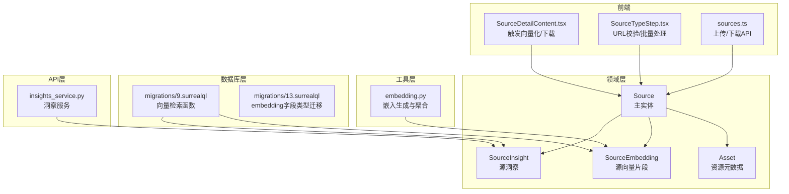
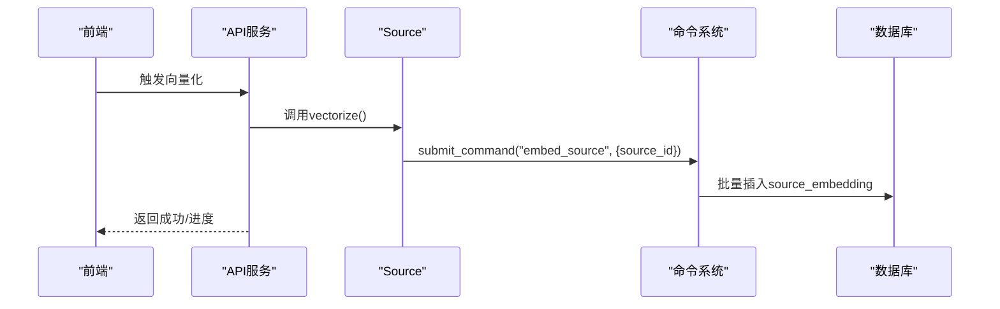
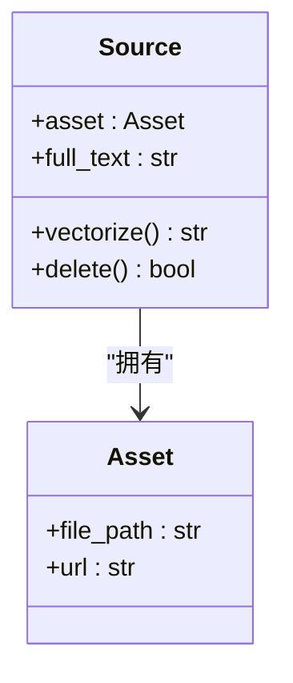
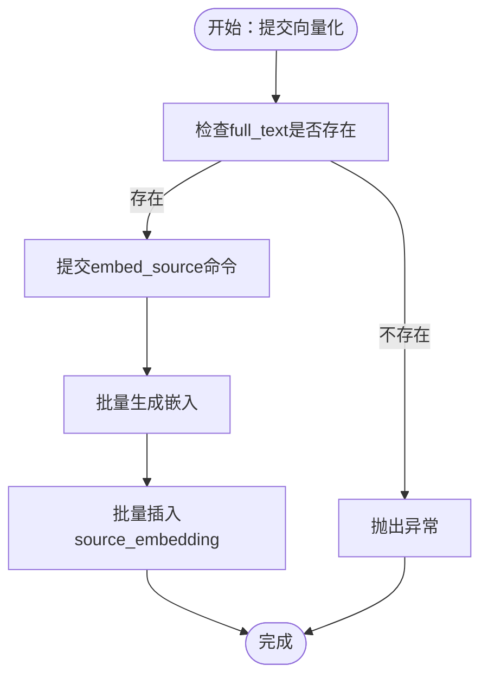
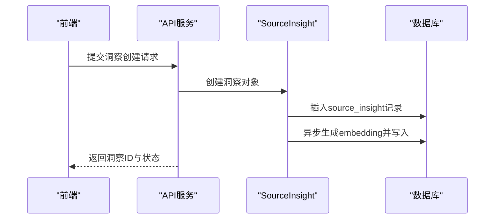
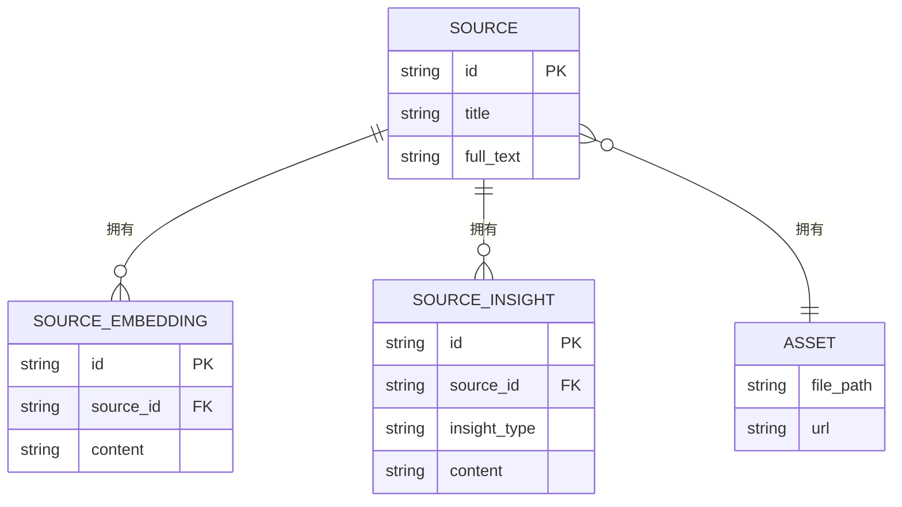

# 支撑实体模型

<cite>
**本文引用的文件**
- [notebook.py](file://open_notebook/domain/notebook.py)
- [base.py](file://open_notebook/domain/base.py)
- [embedding.py](file://open_notebook/utils/embedding.py)
- [13.surrealql](file://open_notebook/database/migrations/13.surrealql)
- [9.surrealql](file://open_notebook/database/migrations/9.surrealql)
- [4.surrealql](file://open_notebook/database/migrations/4.surrealql)
- [insights_service.py](file://api/insights_service.py)
- [SourceDetailContent.tsx](file://frontend/src/components/source/SourceDetailContent.tsx)
- [SourceTypeStep.tsx](file://frontend/src/components/sources/steps/SourceTypeStep.tsx)
- [sources.ts](file://frontend/src/lib/api/sources.ts)
</cite>

## 目录
1. [简介](#简介)
2. [项目结构](#项目结构)
3. [核心组件](#核心组件)
4. [架构总览](#架构总览)
5. [详细组件分析](#详细组件分析)
6. [依赖关系分析](#依赖关系分析)
7. [性能考量](#性能考量)
8. [故障排查指南](#故障排查指南)
9. [结论](#结论)
10. [附录](#附录)

## 简介
本文件聚焦于支撑实体模型，系统性阐述以下三类实体：
- Asset：资源元数据载体，承载文件路径与URL两种来源信息
- SourceEmbedding：源内容的向量化片段，用于语义检索
- SourceInsight：从源内容生成的洞察条目，支持分类与内容管理

文档将从数据结构、作用与职责、与主实体的关系、查询与操作方法、数据验证与清理机制、性能优化策略等方面进行深入说明，并提供可定位到源码的示例路径，帮助开发者快速理解并正确使用这些支撑实体。

## 项目结构
支撑实体位于领域层（domain），通过统一的ORM基类进行数据库访问；向量检索能力由数据库函数提供；前端通过API调用触发向量化与洞察生成流程。

图表来源
- [notebook.py](file://open_notebook/domain/notebook.py#L233-L286)
- [embedding.py](file://open_notebook/utils/embedding.py#L1-L208)
- [9.surrealql](file://open_notebook/database/migrations/9.surrealql#L1-L66)
- [13.surrealql](file://open_notebook/database/migrations/13.surrealql#L1-L3)
- [insights_service.py](file://api/insights_service.py#L38-L75)
- [SourceDetailContent.tsx](file://frontend/src/components/source/SourceDetailContent.tsx#L230-L243)
- [SourceTypeStep.tsx](file://frontend/src/components/sources/steps/SourceTypeStep.tsx#L28-L64)
- [sources.ts](file://frontend/src/lib/api/sources.ts#L84-L108)

章节来源
- [notebook.py](file://open_notebook/domain/notebook.py#L233-L286)
- [embedding.py](file://open_notebook/utils/embedding.py#L1-L208)
- [9.surrealql](file://open_notebook/database/migrations/9.surrealql#L1-L66)
- [13.surrealql](file://open_notebook/database/migrations/13.surrealql#L1-L3)
- [insights_service.py](file://api/insights_service.py#L38-L75)
- [SourceDetailContent.tsx](file://frontend/src/components/source/SourceDetailContent.tsx#L230-L243)
- [SourceTypeStep.tsx](file://frontend/src/components/sources/steps/SourceTypeStep.tsx#L28-L64)
- [sources.ts](file://frontend/src/lib/api/sources.ts#L84-L108)

## 核心组件
- Asset：承载资源的文件路径或URL，作为Source的附属信息存在，用于文件管理与下载。
- SourceEmbedding：记录源文本的向量化片段，支持基于余弦相似度的向量检索。
- SourceInsight：记录从源内容生成的洞察条目，包含洞察类型与内容，支持保存为笔记。

章节来源
- [notebook.py](file://open_notebook/domain/notebook.py#L233-L286)
- [9.surrealql](file://open_notebook/database/migrations/9.surrealql#L4-L35)

## 架构总览
支撑实体与主实体的关系如下：
- Source持有Asset（可选），用于标识资源来源（文件或URL）
- Source通过命令提交向量化任务，生成多个SourceEmbedding记录
- Source可生成SourceInsight，用于分类与内容管理
- 向量检索通过数据库函数完成，同时覆盖SourceEmbedding与SourceInsight

图表来源
- [notebook.py](file://open_notebook/domain/notebook.py#L411-L456)
- [SourceDetailContent.tsx](file://frontend/src/components/source/SourceDetailContent.tsx#L230-L243)

章节来源
- [notebook.py](file://open_notebook/domain/notebook.py#L411-L456)
- [SourceDetailContent.tsx](file://frontend/src/components/source/SourceDetailContent.tsx#L230-L243)

## 详细组件分析

### Asset 实体
- 数据结构
  - file_path: 可选字符串，指向本地文件路径
  - url: 可选字符串，指向远程URL
- 作用与职责
  - 作为Source的附属信息，标识资源来源
  - 支持文件下载与外部链接打开
- 文件管理逻辑
  - 删除Source时，若存在file_path且文件存在则删除物理文件
  - 下载接口支持Blob响应，前端解析Content-Disposition以确定文件名
- 关联关系
  - Source.asset: 可选的Asset对象
- 示例路径
  - 删除清理：[删除Source时的文件清理](file://open_notebook/domain/notebook.py#L514-L552)
  - 下载接口：[下载文件API](file://frontend/src/lib/api/sources.ts#L103-L108)
  - 前端下载按钮与文件名提取：[下载与文件名解析](file://frontend/src/components/source/SourceDetailContent.tsx#L268-L271)

图表来源
- [notebook.py](file://open_notebook/domain/notebook.py#L288-L300)
- [notebook.py](file://open_notebook/domain/notebook.py#L233-L236)

章节来源
- [notebook.py](file://open_notebook/domain/notebook.py#L233-L236)
- [notebook.py](file://open_notebook/domain/notebook.py#L288-L300)
- [notebook.py](file://open_notebook/domain/notebook.py#L514-L552)
- [sources.ts](file://frontend/src/lib/api/sources.ts#L103-L108)
- [SourceDetailContent.tsx](file://frontend/src/components/source/SourceDetailContent.tsx#L268-L271)

### SourceEmbedding 实体
- 数据结构
  - content: 字符串，向量化的内容片段
  - embedding: 数组浮点数，向量表示（在数据库中以字段形式存储）
- 作用与职责
  - 存储源文本的分块向量，支持语义检索
  - 与Source建立“一对多”关系
- 向量存储与查询机制
  - 向量化：通过命令提交批量生成并批量写入
  - 查询：数据库函数基于余弦相似度进行检索，过滤最小相似度阈值
- 关联关系
  - get_source(): 通过数据库查询反查所属Source
- 示例路径
  - 向量检索函数（含embedding字段长度校验）：[向量检索函数](file://open_notebook/database/migrations/9.surrealql#L4-L35)
  - 溯源所属Source：[get_source()](file://open_notebook/domain/notebook.py#L242-L254)
  - 统计嵌入数量：[get_embedded_chunks()](file://open_notebook/domain/notebook.py#L376-L391)

图表来源
- [notebook.py](file://open_notebook/domain/notebook.py#L411-L456)
- [embedding.py](file://open_notebook/utils/embedding.py#L82-L141)
- [9.surrealql](file://open_notebook/database/migrations/9.surrealql#L14-L17)

章节来源
- [notebook.py](file://open_notebook/domain/notebook.py#L238-L255)
- [notebook.py](file://open_notebook/domain/notebook.py#L242-L254)
- [notebook.py](file://open_notebook/domain/notebook.py#L376-L391)
- [9.surrealql](file://open_notebook/database/migrations/9.surrealql#L4-L35)
- [embedding.py](file://open_notebook/utils/embedding.py#L82-L141)

### SourceInsight 实体
- 数据结构
  - insight_type: 字符串，洞察类型（如“主题”、“方法论”等）
  - content: 字符串，洞察内容
  - embedding: 数组浮点数，向量表示（在数据库中以字段形式存储）
- 作用与职责
  - 记录从源内容生成的结构化洞察，便于后续检索与管理
  - 支持保存为笔记（Note）
- 内容管理
  - 通过服务层提交创建洞察命令，异步执行并自动嵌入
  - 支持删除与转换为笔记
- 关联关系
  - get_source(): 通过数据库查询反查所属Source
  - save_as_note(): 将洞察保存为笔记
- 示例路径
  - 创建洞察服务封装：[创建洞察](file://api/insights_service.py#L38-L51)
  - 删除洞察服务封装：[删除洞察](file://api/insights_service.py#L53-L56)
  - 保存为笔记服务封装：[保存为笔记](file://api/insights_service.py#L58-L75)
  - 溯源所属Source：[get_source()](file://open_notebook/domain/notebook.py#L262-L274)
  - 保存为笔记实现：[save_as_note()](file://open_notebook/domain/notebook.py#L276-L285)

图表来源
- [insights_service.py](file://api/insights_service.py#L38-L51)
- [notebook.py](file://open_notebook/domain/notebook.py#L257-L285)

章节来源
- [notebook.py](file://open_notebook/domain/notebook.py#L257-L285)
- [insights_service.py](file://api/insights_service.py#L38-L75)

## 依赖关系分析
- Source 与 Asset：组合关系，Source可选拥有Asset
- Source 与 SourceEmbedding：一对多关系，一个Source可有多个向量片段
- Source 与 SourceInsight：一对多关系，一个Source可有多个洞察
- 向量检索：通过数据库函数统一查询SourceEmbedding与SourceInsight
- 数据验证：统一由ObjectModel基类与Pydantic字段验证器保证

图表来源
- [notebook.py](file://open_notebook/domain/notebook.py#L233-L286)

章节来源
- [notebook.py](file://open_notebook/domain/notebook.py#L233-L286)

## 性能考量
- 向量生成
  - 长文本采用分块与均值池化，减少单次API调用次数
  - 批量嵌入在同一API调用中完成，降低网络开销
- 向量检索
  - 数据库函数按余弦相似度排序并限制返回数量
  - 过滤embedding长度与维度一致，避免不匹配导致的错误
- 异步处理
  - Source向量化与洞察创建均通过命令系统异步提交，避免阻塞HTTP连接
- 数据库连接
  - 当前repo_*操作为每次新建连接，适合请求级操作；批量场景建议引入连接池

章节来源
- [embedding.py](file://open_notebook/utils/embedding.py#L143-L208)
- [9.surrealql](file://open_notebook/database/migrations/9.surrealql#L14-L17)
- [notebook.py](file://open_notebook/domain/notebook.py#L411-L456)

## 故障排查指南
- 向量检索无结果
  - 检查最小相似度阈值是否过高
  - 确认embedding字段长度与查询向量维度一致
- 向量生成失败
  - 检查文本是否为空或仅空白字符
  - 确认嵌入模型已配置
- 文件下载失败
  - 检查Content-Disposition头解析与文件名编码
  - 确认后端下载接口返回Blob类型
- URL批量添加失败
  - 使用前端提供的URL解析与校验逻辑，修正无效URL

章节来源
- [9.surrealql](file://open_notebook/database/migrations/9.surrealql#L14-L17)
- [embedding.py](file://open_notebook/utils/embedding.py#L143-L175)
- [SourceTypeStep.tsx](file://frontend/src/components/sources/steps/SourceTypeStep.tsx#L28-L64)
- [SourceDetailContent.tsx](file://frontend/src/components/source/SourceDetailContent.tsx#L253-L266)
- [sources.ts](file://frontend/src/lib/api/sources.ts#L103-L108)

## 结论
Asset、SourceEmbedding、SourceInsight三者共同构成了Open Notebook的支撑实体体系：
- Asset负责资源来源标识与文件管理
- SourceEmbedding承载向量化片段，支撑语义检索
- SourceInsight承载结构化洞察，便于分类与内容管理

通过统一的ORM基类、数据库函数与命令系统，实现了高内聚、低耦合的实体设计与高效的数据流。

## 附录
- 数据验证规则
  - SourceEmbedding与SourceInsight的embedding字段类型在迁移中明确为数组浮点数
  - Source的command字段统一解析为RecordID格式
- 清理机制
  - 删除Source时同步清理物理文件、嵌入与洞察
- 实际使用示例（路径）
  - 触发向量化：[前端触发向量化](file://frontend/src/components/source/SourceDetailContent.tsx#L230-L243)
  - URL批量校验与解析：[URL解析与校验](file://frontend/src/components/sources/steps/SourceTypeStep.tsx#L28-L64)
  - 下载文件：[下载接口](file://frontend/src/lib/api/sources.ts#L103-L108)
  - 创建洞察服务封装：[洞察服务](file://api/insights_service.py#L38-L75)

章节来源
- [13.surrealql](file://open_notebook/database/migrations/13.surrealql#L1-L3)
- [notebook.py](file://open_notebook/domain/notebook.py#L288-L300)
- [notebook.py](file://open_notebook/domain/notebook.py#L514-L552)
- [SourceDetailContent.tsx](file://frontend/src/components/source/SourceDetailContent.tsx#L230-L243)
- [SourceTypeStep.tsx](file://frontend/src/components/sources/steps/SourceTypeStep.tsx#L28-L64)
- [sources.ts](file://frontend/src/lib/api/sources.ts#L103-L108)
- [insights_service.py](file://api/insights_service.py#L38-L75)