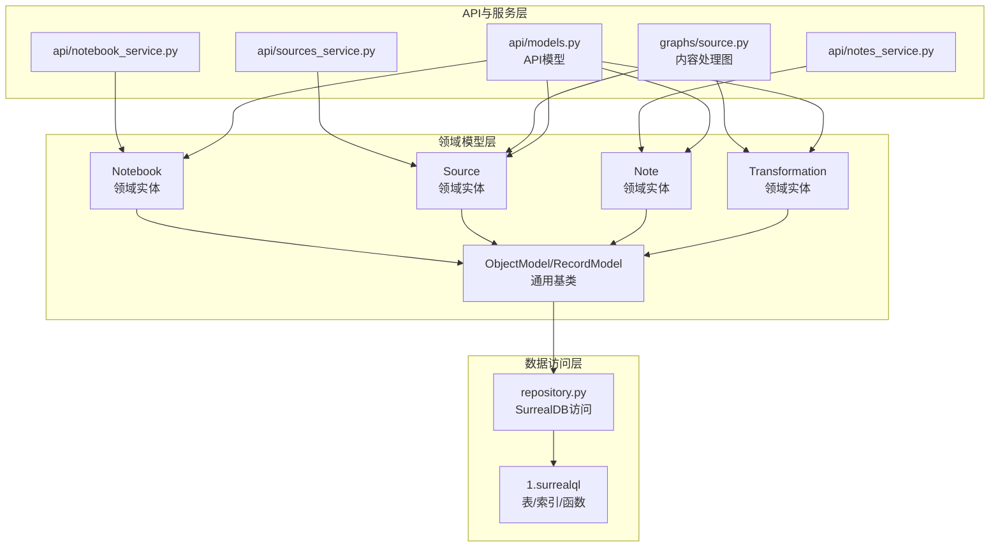
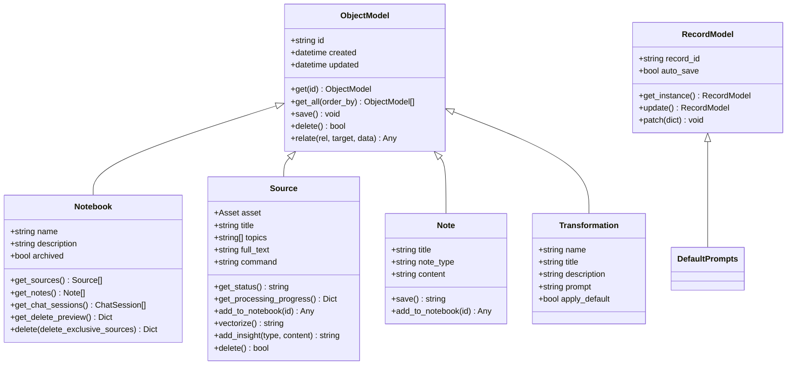
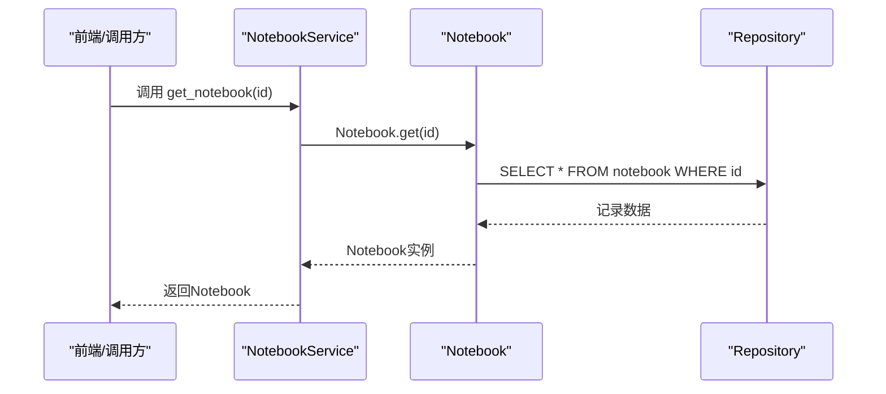
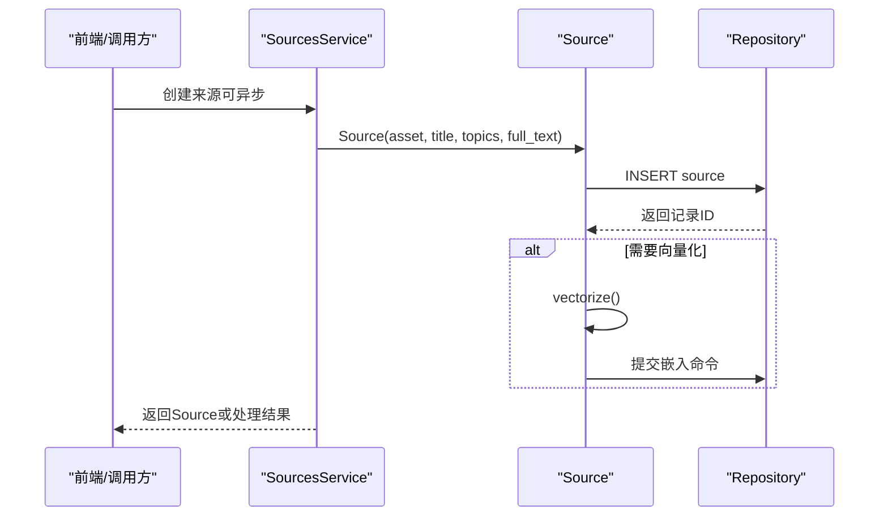
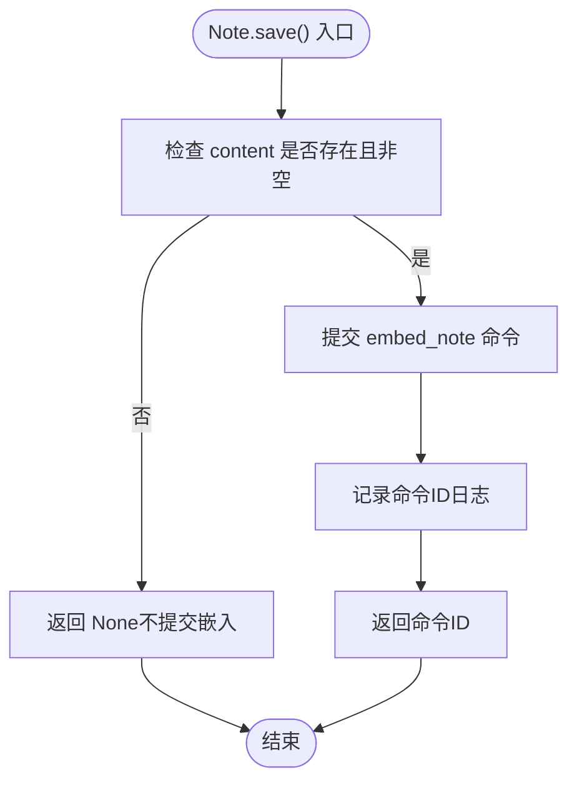
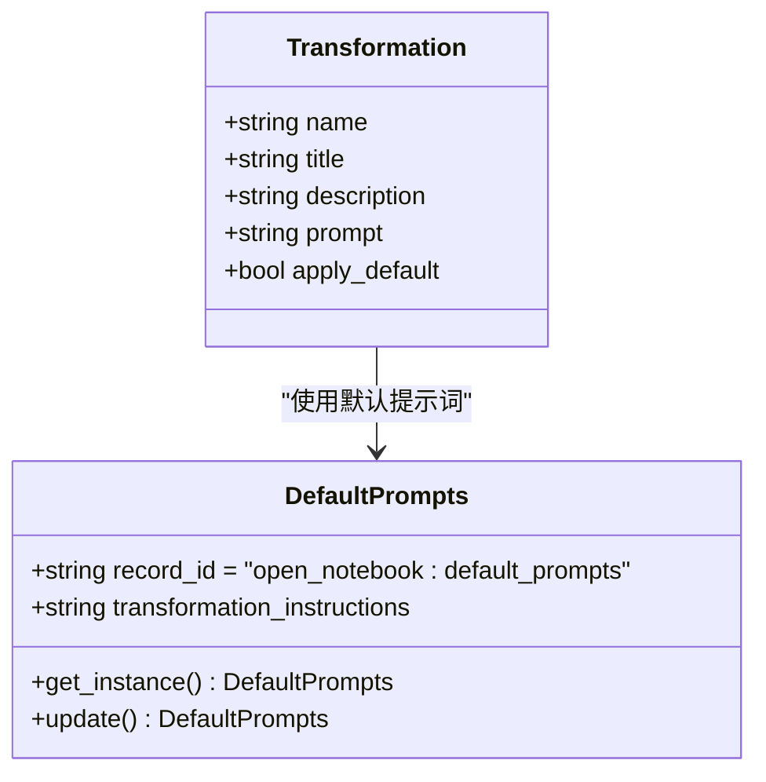
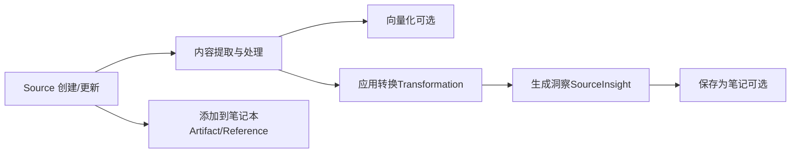
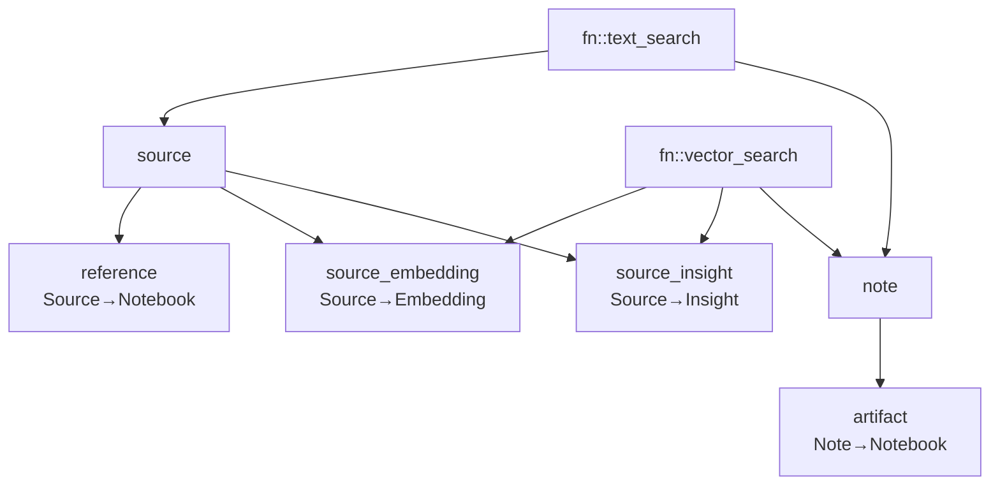

# 核心实体模型

<cite>
**本文档引用的文件**
- [open_notebook/domain/notebook.py](file://open_notebook/domain/notebook.py)
- [open_notebook/domain/base.py](file://open_notebook/domain/base.py)
- [open_notebook/domain/transformation.py](file://open_notebook/domain/transformation.py)
- [api/models.py](file://api/models.py)
- [open_notebook/database/migrations/1.surrealql](file://open_notebook/database/migrations/1.surrealql)
- [open_notebook/database/repository.py](file://open_notebook/database/repository.py)
- [open_notebook/graphs/source.py](file://open_notebook/graphs/source.py)
- [api/notebook_service.py](file://api/notebook_service.py)
- [api/sources_service.py](file://api/sources_service.py)
- [api/notes_service.py](file://api/notes_service.py)
</cite>

## 目录
1. [简介](#简介)
2. [项目结构](#项目结构)
3. [核心组件](#核心组件)
4. [架构总览](#架构总览)
5. [详细组件分析](#详细组件分析)
6. [依赖关系分析](#依赖关系分析)
7. [性能考虑](#性能考虑)
8. [故障排除指南](#故障排除指南)
9. [结论](#结论)
10. [附录](#附录)

## 简介
本文件系统性梳理Open Notebook项目的核心实体模型，重点覆盖Notebook（笔记本）、Source（来源）、Note（笔记）、Transformation（转换）四大实体的数据结构、字段定义、约束与业务规则，并解释它们之间的关联关系与外键约束。同时提供实体关系图与数据流图，说明字段验证规则、默认值设置、业务逻辑实现、生命周期管理、状态变化与持久化策略，并给出实际的代码示例路径与使用模式。

## 项目结构
围绕核心实体模型的关键模块分布如下：
- 领域模型层：位于open_notebook/domain，定义实体类与通用基类
- 数据访问层：位于open_notebook/database，封装SurrealDB访问与查询
- 迁移定义：位于open_notebook/database/migrations，定义表结构、索引与函数
- API模型层：位于api/models.py，定义API请求/响应模型
- 图工作流：位于open_notebook/graphs，定义内容处理与转换流程
- 服务层：位于api，封装对领域模型的调用与API交互

**图表来源**
- [open_notebook/domain/notebook.py](file://open_notebook/domain/notebook.py#L16-L679)
- [open_notebook/domain/base.py](file://open_notebook/domain/base.py#L31-L329)
- [open_notebook/database/repository.py](file://open_notebook/database/repository.py#L65-L195)
- [open_notebook/database/migrations/1.surrealql](file://open_notebook/database/migrations/1.surrealql#L1-L179)
- [api/models.py](file://api/models.py#L1-L685)
- [open_notebook/graphs/source.py](file://open_notebook/graphs/source.py#L1-L168)
- [api/notebook_service.py](file://api/notebook_service.py#L1-L88)
- [api/sources_service.py](file://api/sources_service.py#L1-L200)
- [api/notes_service.py](file://api/notes_service.py#L1-L104)

**章节来源**
- [open_notebook/domain/notebook.py](file://open_notebook/domain/notebook.py#L16-L679)
- [open_notebook/domain/base.py](file://open_notebook/domain/base.py#L31-L329)
- [open_notebook/database/migrations/1.surrealql](file://open_notebook/database/migrations/1.surrealql#L1-L179)
- [api/models.py](file://api/models.py#L1-L685)
- [open_notebook/graphs/source.py](file://open_notebook/graphs/source.py#L1-L168)
- [api/notebook_service.py](file://api/notebook_service.py#L1-L88)
- [api/sources_service.py](file://api/sources_service.py#L1-L200)
- [api/notes_service.py](file://api/notes_service.py#L1-L104)

## 核心组件
本节从数据结构、字段定义、约束与业务规则四个维度，系统阐述四大核心实体。

- Notebook（笔记本）
  - 字段与类型
    - id: 可选字符串（记录标识）
    - name: 必填字符串（名称）
    - description: 必填字符串（描述）
    - archived: 可选布尔，默认False（归档标记）
    - created/updated: 可选时间戳（由基类统一维护）
  - 约束与规则
    - 名称不能为空（字段校验）
    - 归档字段默认False
    - 支持按更新时间倒序查询
  - 关联关系
    - 通过“artifact”关系与Note建立多对多（一个笔记可属于多个笔记本）
    - 通过“reference”关系与Source建立多对多（一个来源可被多个笔记本引用）
    - 通过“refers_to”关系与ChatSession建立一对多（一个笔记本可有多个会话）
  - 生命周期与持久化
    - 继承自ObjectModel，支持保存、删除、关系建立
    - 删除时提供级联预览与级联删除能力（可选择是否删除独享来源）

- Source（来源）
  - 字段与类型
    - id: 可选字符串
    - asset: 可选对象（file_path/url二选一或两者皆无）
    - title: 可选字符串
    - topics: 可选字符串数组
    - full_text: 可选长文本
    - command: 可选记录ID（指向异步命令）
    - created/updated: 时间戳
  - 约束与规则
    - command字段在入库前统一解析为RecordID格式
    - id字段支持字符串与RecordID互转
    - 支持异步处理状态查询与进度信息提取
    - 支持向量嵌入提交与分块计数查询
    - 支持洞察（insight）的异步创建与批量嵌入
  - 关联关系
    - 通过“reference”关系与Notebook建立多对多
    - 通过“source_embedding”表存储分块向量
    - 通过“source_insight”表存储洞察
  - 生命周期与持久化
    - 删除时清理上传文件、嵌入与洞察，避免孤儿记录
    - 保存时自动注入创建/更新时间戳

- Note（笔记）
  - 字段与类型
    - id: 可选字符串
    - title: 可选字符串
    - note_type: 可选枚举（human/ai）
    - content: 可选长文本
    - created/updated: 时间戳
  - 约束与规则
    - 内容不能为空（字段校验）
    - 保存后异步提交嵌入命令（非阻塞）
    - 支持添加到笔记本（artifact关系）
  - 关联关系
    - 通过“artifact”关系与Notebook建立多对多
  - 生命周期与持久化
    - 继承自ObjectModel，保存后触发异步嵌入

- Transformation（转换）
  - 字段与类型
    - id: 可选字符串
    - name: 必填字符串（内部标识）
    - title: 必填字符串（显示标题）
    - description: 必填字符串（用途说明）
    - prompt: 必填字符串（提示词模板）
    - apply_default: 布尔（是否默认应用）
    - created/updated: 时间戳
  - 约束与规则
    - 作为领域实体，支持保存与查询
    - 默认提示词记录（RecordModel）用于全局配置
  - 关联关系
    - 在图工作流中作为输入，驱动内容转换

**章节来源**
- [open_notebook/domain/notebook.py](file://open_notebook/domain/notebook.py#L16-L679)
- [open_notebook/domain/base.py](file://open_notebook/domain/base.py#L31-L329)
- [open_notebook/domain/transformation.py](file://open_notebook/domain/transformation.py#L1-L22)
- [api/models.py](file://api/models.py#L105-L171)

## 架构总览
下图展示核心实体在系统中的角色与交互：

**图表来源**
- [open_notebook/domain/base.py](file://open_notebook/domain/base.py#L31-L329)
- [open_notebook/domain/notebook.py](file://open_notebook/domain/notebook.py#L16-L679)
- [open_notebook/domain/transformation.py](file://open_notebook/domain/transformation.py#L1-L22)

## 详细组件分析

### Notebook 实体分析
- 数据结构与字段
  - 基础字段：id、name、description、archived、created、updated
  - 行为方法：获取来源、获取笔记、获取聊天会话、删除预览、删除
- 约束与业务规则
  - 名称非空校验
  - 归档默认False
  - 删除支持级联：可选择删除独享来源或仅取消关联
- 外键与关系
  - reference（Source→Notebook）
  - artifact（Note→Notebook）
  - refers_to（ChatSession→Notebook）

**图表来源**
- [api/notebook_service.py](file://api/notebook_service.py#L36-L48)
- [open_notebook/domain/notebook.py](file://open_notebook/domain/notebook.py#L69-L96)
- [open_notebook/database/repository.py](file://open_notebook/database/repository.py#L65-L83)

**章节来源**
- [open_notebook/domain/notebook.py](file://open_notebook/domain/notebook.py#L16-L231)
- [api/notebook_service.py](file://api/notebook_service.py#L1-L88)

### Source 实体分析
- 数据结构与字段
  - 基础字段：id、asset、title、topics、full_text、command、created、updated
  - 行为方法：状态查询、进度查询、上下文获取、分块计数、洞察获取、添加到笔记本、向量化、添加洞察、删除
- 约束与业务规则
  - command与id字段的RecordID格式统一
  - 异步处理状态与进度信息提取
  - 删除时清理文件、嵌入与洞察
- 外键与关系
  - reference（Source→Notebook）
  - source_embedding（嵌入分块）
  - source_insight（洞察）

**图表来源**
- [api/sources_service.py](file://api/sources_service.py#L128-L200)
- [open_notebook/domain/notebook.py](file://open_notebook/domain/notebook.py#L288-L553)
- [open_notebook/database/repository.py](file://open_notebook/database/repository.py#L85-L104)

**章节来源**
- [open_notebook/domain/notebook.py](file://open_notebook/domain/notebook.py#L288-L553)
- [api/sources_service.py](file://api/sources_service.py#L1-L200)

### Note 实体分析
- 数据结构与字段
  - 基础字段：id、title、note_type、content、created、updated
  - 行为方法：保存（异步嵌入）、添加到笔记本、上下文获取
- 约束与业务规则
  - 内容非空校验
  - 保存后提交嵌入命令（fire-and-forget）
- 外键与关系
  - artifact（Note→Notebook）

**图表来源**
- [open_notebook/domain/notebook.py](file://open_notebook/domain/notebook.py#L555-L591)

**章节来源**
- [open_notebook/domain/notebook.py](file://open_notebook/domain/notebook.py#L555-L609)
- [api/notes_service.py](file://api/notes_service.py#L1-L104)

### Transformation 实体分析
- 数据结构与字段
  - 基础字段：id、name、title、description、prompt、apply_default、created、updated
  - 默认提示词记录：DefaultPrompts（RecordModel），存储全局指令
- 约束与业务规则
  - 作为领域实体，支持保存与查询
  - 默认提示词记录为单例，支持异步加载与更新
- 外键与关系
  - 在图工作流中作为输入，驱动内容转换

**图表来源**
- [open_notebook/domain/transformation.py](file://open_notebook/domain/transformation.py#L1-L22)
- [open_notebook/domain/base.py](file://open_notebook/domain/base.py#L206-L329)

**章节来源**
- [open_notebook/domain/transformation.py](file://open_notebook/domain/transformation.py#L1-L22)
- [open_notebook/domain/base.py](file://open_notebook/domain/base.py#L206-L329)

### 概念性总览
以下为概念性数据流图，展示内容从来源到洞察再到笔记的整体流程（概念示意）：

[此图为概念性流程，无需图表来源]

## 依赖关系分析
- 表结构与索引
  - 定义了source、source_embedding、source_insight、note、notebook、reference、artifact等表
  - 定义了全文检索与向量相似度搜索函数
- 外键与关系
  - reference：Source→Notebook（多对多）
  - artifact：Note→Notebook（多对多）
  - source_embedding/source_insight：分别与Source建立一对多
- 查询与事务
  - Repository层封装连接、查询、插入、更新、删除、关系建立
  - 对异常进行分类处理，区分可重试的事务冲突与不可重试错误

**图表来源**
- [open_notebook/database/migrations/1.surrealql](file://open_notebook/database/migrations/1.surrealql#L2-L179)

**章节来源**
- [open_notebook/database/migrations/1.surrealql](file://open_notebook/database/migrations/1.surrealql#L1-L179)
- [open_notebook/database/repository.py](file://open_notebook/database/repository.py#L65-L195)

## 性能考虑
- 异步处理
  - Source向量化与Note嵌入均通过异步命令提交，避免阻塞主线程
  - Source洞察创建采用fire-and-forget模式，提升吞吐
- 批量操作
  - 向量化阶段一次性生成所有分块嵌入并批量写入，减少网络往返
- 查询优化
  - 使用全文检索与向量相似度函数，结合索引提升检索效率
- 并发与重试
  - Repository层对事务冲突进行日志降噪与重试友好处理

[本节为通用性能讨论，无需章节来源]

## 故障排除指南
- 常见错误与定位
  - 数据库操作失败：捕获DatabaseOperationError，检查Repository层日志
  - 输入无效：InvalidInputError，检查字段校验（如Note内容非空、Notebook名称非空）
  - 记录不存在：NotFoundError，确认ID与表名匹配
- 排查步骤
  - 确认ID格式（RecordID与字符串互转）
  - 检查异步命令状态与进度信息
  - 核对关系建立参数（源ID、目标ID、关系名）

**章节来源**
- [open_notebook/domain/base.py](file://open_notebook/domain/base.py#L113-L183)
- [open_notebook/domain/notebook.py](file://open_notebook/domain/notebook.py#L514-L553)

## 结论
本文件系统化梳理了Notebook、Source、Note、Transformation四大核心实体的数据结构、字段定义、约束与业务规则，并阐明了它们之间的关联关系与外键约束。通过Repository层与SurrealDB迁移定义，实现了稳定的持久化与高效检索；通过异步命令与图工作流，支撑了高吞吐的内容处理与转换。建议在实际使用中遵循字段校验与默认值约定，合理利用异步处理与批量操作，以获得最佳性能与可靠性。

[本节为总结性内容，无需章节来源]

## 附录
- 使用模式示例（代码路径）
  - Notebook创建与查询：[api/notebook_service.py](file://api/notebook_service.py#L50-L78)
  - Source创建与异步处理：[api/sources_service.py](file://api/sources_service.py#L128-L200)
  - Note创建与异步嵌入：[api/notes_service.py](file://api/notes_service.py#L52-L94)
  - Transformation定义与使用：[open_notebook/domain/transformation.py](file://open_notebook/domain/transformation.py#L8-L22)
  - 搜索接口（文本/向量）：[open_notebook/domain/notebook.py](file://open_notebook/domain/notebook.py#L628-L679)
  - API模型定义（请求/响应）：[api/models.py](file://api/models.py#L105-L171)

**章节来源**
- [api/notebook_service.py](file://api/notebook_service.py#L1-L88)
- [api/sources_service.py](file://api/sources_service.py#L1-L200)
- [api/notes_service.py](file://api/notes_service.py#L1-L104)
- [open_notebook/domain/transformation.py](file://open_notebook/domain/transformation.py#L1-L22)
- [open_notebook/domain/notebook.py](file://open_notebook/domain/notebook.py#L628-L679)
- [api/models.py](file://api/models.py#L105-L171)