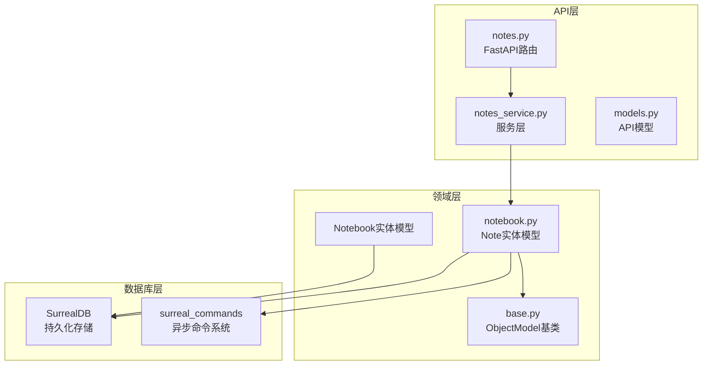
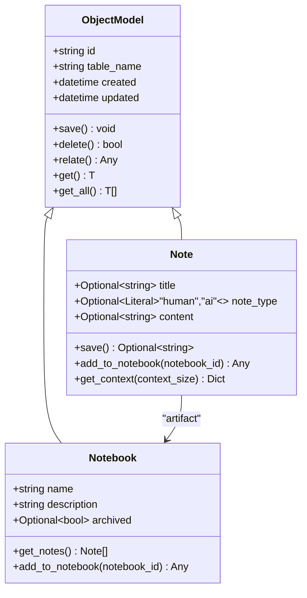
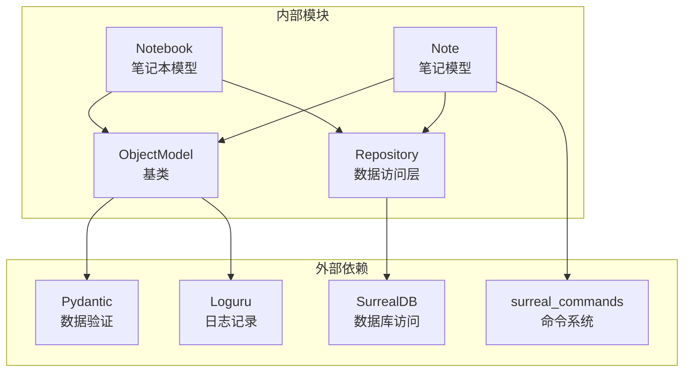

# 笔记实体模型

<cite>
**本文档引用的文件**
- [notebook.py](file://open_notebook/domain/notebook.py)
- [base.py](file://open_notebook/domain/base.py)
- [notes_service.py](file://api/notes_service.py)
- [notes.py](file://api/routers/notes.py)
- [models.py](file://api/models.py)
- [test_domain.py](file://tests/test_domain.py)
</cite>

## 目录
1. [简介](#简介)
2. [项目结构](#项目结构)
3. [核心组件](#核心组件)
4. [架构概览](#架构概览)
5. [详细组件分析](#详细组件分析)
6. [依赖关系分析](#依赖关系分析)
7. [性能考虑](#性能考虑)
8. [故障排除指南](#故障排除指南)
9. [结论](#结论)

## 简介

本文档深入解析Open Notebook项目中的笔记实体模型（Note），这是一个基于Pydantic构建的领域模型，用于管理知识库中的笔记数据。该模型实现了异步持久化、自动嵌入生成功能，并与笔记本（Notebook）建立了清晰的关联关系。

Note实体模型是整个知识管理系统的核心组件之一，它不仅负责存储笔记的基本信息，还集成了智能的内容处理、关系管理和上下文获取功能。

## 项目结构

笔记实体模型位于项目的领域层，采用分层架构设计：



**图表来源**
- [notebook.py](file://open_notebook/domain/notebook.py#L555-L610)
- [base.py](file://open_notebook/domain/base.py#L31-L183)

**章节来源**
- [notebook.py](file://open_notebook/domain/notebook.py#L1-L679)
- [base.py](file://open_notebook/domain/base.py#L1-L329)

## 核心组件

### Note实体模型概述

Note类是笔记实体的核心实现，继承自ObjectModel基类，提供了完整的CRUD操作和特殊业务逻辑：



**图表来源**
- [notebook.py](file://open_notebook/domain/notebook.py#L555-L610)
- [base.py](file://open_notebook/domain/base.py#L31-L183)

### 数据结构定义

Note实体模型的核心字段定义如下：

| 字段名 | 类型 | 可选性 | 默认值 | 描述 |
|--------|------|--------|--------|------|
| id | Optional[str] | 是 | None | 唯一标识符，格式为"note:uuid" |
| title | Optional[str] | 是 | None | 笔记标题，支持None值 |
| note_type | Optional[Literal["human","ai"]] | 是 | None | 笔记类型，限制为"human"或"ai" |
| content | Optional[str] | 是 | None | 笔记内容，支持None值 |
| created | Optional[datetime] | 是 | None | 创建时间戳 |
| updated | Optional[datetime] | 是 | None | 更新时间戳 |

**章节来源**
- [notebook.py](file://open_notebook/domain/notebook.py#L555-L560)

## 架构概览

### 异步嵌入提交机制

Note模型采用了创新的异步嵌入提交架构，避免了同步嵌入可能造成的性能瓶颈：

```mermaid
sequenceDiagram
participant Client as 客户端
participant API as API路由
participant Service as 服务层
participant Note as Note模型
participant DB as 数据库
participant Command as 命令系统
Client->>API : POST /notes
API->>Service : create_note()
Service->>Note : Note(content, title, note_type)
Note->>Note : save()
Note->>DB : 持久化记录
Note->>Command : submit_command("embed_note")
Command-->>Note : 返回command_id
Note-->>Service : 返回note对象
Service-->>API : 返回响应
API-->>Client : 返回创建结果
Note->>Command : 后台执行嵌入生成
Command->>DB : 存储向量嵌入
```

**图表来源**
- [notebook.py](file://open_notebook/domain/notebook.py#L568-L591)
- [notes.py](file://api/routers/notes.py#L76-L90)

### 关系管理架构

笔记与笔记本之间的关联通过图数据库的关系实现：

```mermaid
graph LR
subgraph "图数据库结构"
A[Notebook:notebook:123]
B[Note:note:456]
C[Content:content:789]
A ---|"artifact"| --> B
B ---|"content"| --> C
end
subgraph "业务逻辑"
D[add_to_notebook]
E[get_notes]
F[get_context]
end
D --> A
D --> B
E --> A
E --> B
F --> B
```

**图表来源**
- [notebook.py](file://open_notebook/domain/notebook.py#L593-L596)
- [notebook.py](file://open_notebook/domain/notebook.py#L46-L57)

**章节来源**
- [notebook.py](file://open_notebook/domain/notebook.py#L555-L610)

## 详细组件分析

### 字段验证系统

Note模型实现了严格的字段验证机制，确保数据完整性：

#### 内容验证规则

```mermaid
flowchart TD
A[接收content参数] --> B{content是否为None?}
B --> |是| C[允许None值]
B --> |否| D{content是否为空字符串?}
D --> |是| E[抛出InvalidInputError]
D --> |否| F{content是否只包含空白字符?}
F --> |是| E
F --> |否| G[验证通过]
E --> H[错误: "Note content cannot be empty"]
C --> I[返回None]
G --> J[返回原始内容]
```

**图表来源**
- [notebook.py](file://open_notebook/domain/notebook.py#L561-L566)

#### 类型验证规则

note_type字段仅允许特定的枚举值：
- `"human"` - 人类创建的笔记
- `"ai"` - AI生成的笔记
- `None` - 允许的空值

**章节来源**
- [notebook.py](file://open_notebook/domain/notebook.py#L557-L559)
- [test_domain.py](file://tests/test_domain.py#L213-L230)

### save()方法重写逻辑

Note.save()方法重写了基类的保存逻辑，实现了异步嵌入提交：

#### 保存流程详解

```mermaid
flowchart TD
A[调用save()] --> B[调用super().save()]
B --> C[持久化Note记录到数据库]
C --> D{检查条件}
D --> |id存在且content非空| E[提交embed_note命令]
D --> |条件不满足| F[返回None]
E --> G[submit_command("embed_note")]
G --> H[记录调试日志]
H --> I[返回command_id]
F --> J[结束]
I --> K[结束]
```

**图表来源**
- [notebook.py](file://open_notebook/domain/notebook.py#L568-L591)

#### 异步嵌入提交机制

异步嵌入提交避免了阻塞主请求线程，提高了系统整体性能：

| 特性 | 实现细节 | 性能影响 |
|------|----------|----------|
| 非阻塞 | 使用submit_command而非直接执行 | 提升响应速度 |
| 错误隔离 | 嵌入失败不影响笔记保存 | 提高系统稳定性 |
| 调度管理 | 通过命令系统统一调度 | 优化资源利用 |
| 状态跟踪 | 返回command_id便于监控 | 改善可观测性 |

**章节来源**
- [notebook.py](file://open_notebook/domain/notebook.py#L568-L591)

### 上下文获取与内容截断

Note.get_context()方法提供了灵活的内容访问策略：

#### 上下文获取策略

```mermaid
flowchart TD
A[调用get_context(context_size)] --> B{context_size参数}
B --> |默认或"short"| C[短上下文模式]
B --> |"long"| D[长上下文模式]
C --> E[返回{id, title, content[:100]}]
D --> F[返回{id, title, content}]
E --> G[内容截断至100字符]
F --> H[完整内容返回]
```

**图表来源**
- [notebook.py](file://open_notebook/domain/notebook.py#L598-L608)

#### 截断策略说明

- **短上下文**：内容被截断为前100个字符，适用于列表显示和快速预览
- **长上下文**：返回完整内容，适用于详细编辑和深度分析场景
- **安全处理**：当content为None时，截断操作不会产生异常

**章节来源**
- [notebook.py](file://open_notebook/domain/notebook.py#L598-L608)

### 笔记与笔记本的关联关系

#### add_to_notebook()方法实现

```mermaid
sequenceDiagram
participant Note as Note实例
participant DB as 数据库
participant Graph as 图关系
Note->>Note : validate(notebook_id)
Note->>Graph : relate("artifact", notebook_id)
Graph->>DB : 创建artifact关系
DB-->>Graph : 确认关系创建
Graph-->>Note : 返回关系对象
Note-->>调用者 : 返回关系结果
```

**图表来源**
- [notebook.py](file://open_notebook/domain/notebook.py#L593-L596)

#### 关系类型说明

- **"artifact"**：表示笔记是笔记本的组成部分
- **反向关系**：Notebook.get_notes()可以查询所有关联的笔记
- **唯一性保证**：每个笔记只能属于一个笔记本

**章节来源**
- [notebook.py](file://open_notebook/domain/notebook.py#L593-L596)

## 依赖关系分析

### 组件耦合度分析



**图表来源**
- [base.py](file://open_notebook/domain/base.py#L1-L329)
- [notebook.py](file://open_notebook/domain/notebook.py#L1-L14)

### 错误处理机制

系统实现了多层次的错误处理策略：

| 错误类型 | 触发条件 | 处理方式 | 影响范围 |
|----------|----------|----------|----------|
| InvalidInputError | 参数验证失败 | 抛出HTTP 400错误 | 单个请求 |
| DatabaseOperationError | 数据库操作异常 | 包装为HTTP 500错误 | 请求级 |
| NotFoundError | 记录不存在 | 抛出HTTP 404错误 | 请求级 |
| ValidationError | Pydantic验证失败 | 重新抛出验证错误 | 请求级 |

**章节来源**
- [base.py](file://open_notebook/domain/base.py#L152-L160)
- [notebook.py](file://open_notebook/domain/notebook.py#L561-L566)

## 性能考虑

### 异步架构优势

1. **非阻塞嵌入生成**：避免了长时间的同步嵌入操作阻塞请求线程
2. **连接池优化**：异步命令系统减少了数据库连接的占用时间
3. **批量处理能力**：命令系统支持后台批量处理大量嵌入任务

### 内存使用优化

- **延迟加载**：content字段在短上下文中被截断，减少内存占用
- **可选字段设计**：title和note_type允许None值，避免不必要的存储开销
- **惰性关系查询**：get_context()方法根据需要返回不同粒度的内容

### 缓存策略建议

虽然当前实现没有内置缓存，但可以考虑以下优化：
- 对于频繁访问的笔记内容，可以在应用层实现缓存
- 利用数据库索引优化查询性能
- 实施适当的过期策略避免数据陈旧

## 故障排除指南

### 常见问题诊断

#### 笔记保存失败

**症状**：调用save()后返回None或抛出异常

**可能原因**：
1. content字段为空或只包含空白字符
2. 数据库连接异常
3. 命令系统不可用

**解决方案**：
```python
# 确保content有效
if note.content and note.content.strip():
    command_id = await note.save()
    if command_id:
        print(f"嵌入任务已提交: {command_id}")
```

#### 关联关系创建失败

**症状**：add_to_notebook()抛出InvalidInputError

**可能原因**：
1. notebook_id参数为空
2. 目标笔记本不存在
3. 权限不足

**解决方案**：
```python
# 验证笔记本ID
try:
    notebook = await Notebook.get(notebook_id)
    if not notebook:
        raise ValueError("笔记本不存在")
    await note.add_to_notebook(notebook_id)
except InvalidInputError as e:
    print(f"关联失败: {e}")
```

#### 上下文获取异常

**症状**：get_context()返回意外结果

**可能原因**：
1. context_size参数无效
2. content字段为None

**解决方案**：
```python
# 使用正确的参数
context_short = note.get_context("short")  # 截断内容
context_long = note.get_context("long")   # 完整内容
```

**章节来源**
- [test_domain.py](file://tests/test_domain.py#L213-L230)

## 结论

Note实体模型展现了现代Python应用的最佳实践：

### 设计亮点

1. **异步架构**：通过异步嵌入提交提升了系统整体性能
2. **严格验证**：Pydantic验证确保了数据完整性
3. **清晰抽象**：面向对象设计提供了良好的封装性
4. **错误处理**：多层次的错误处理机制提高了系统稳定性

### 扩展性考虑

该模型为未来的功能扩展奠定了良好基础：
- 可以轻松添加新的字段和验证规则
- 异步架构支持未来的大规模并发处理
- 图数据库关系模型支持复杂的关联查询
- 模块化设计便于单元测试和维护

### 最佳实践建议

1. **始终验证输入**：利用内置的字段验证机制
2. **合理使用异步**：充分利用异步嵌入提交的优势
3. **注意内存管理**：在处理大量笔记时关注内存使用
4. **实施监控**：利用返回的command_id进行进度跟踪

这个笔记实体模型为Open Notebook项目提供了一个强大而灵活的知识管理基础，既满足了当前的功能需求，又为未来的扩展预留了充足的空间。