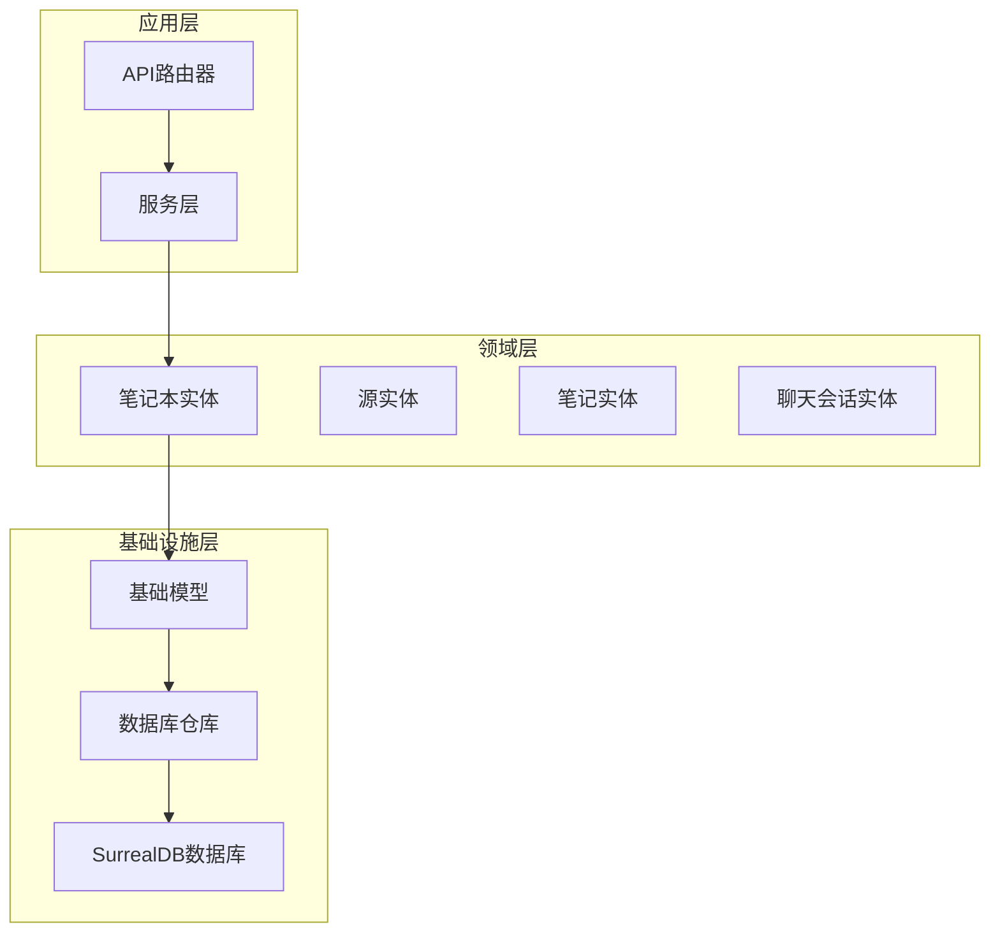
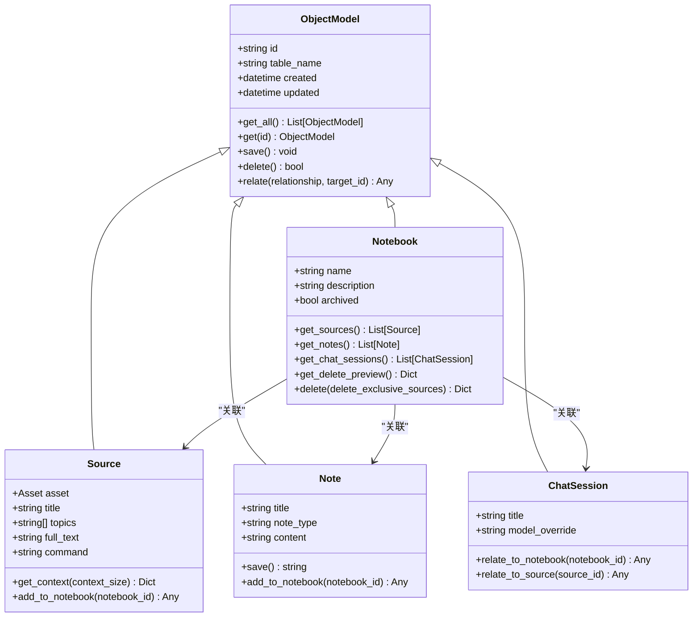
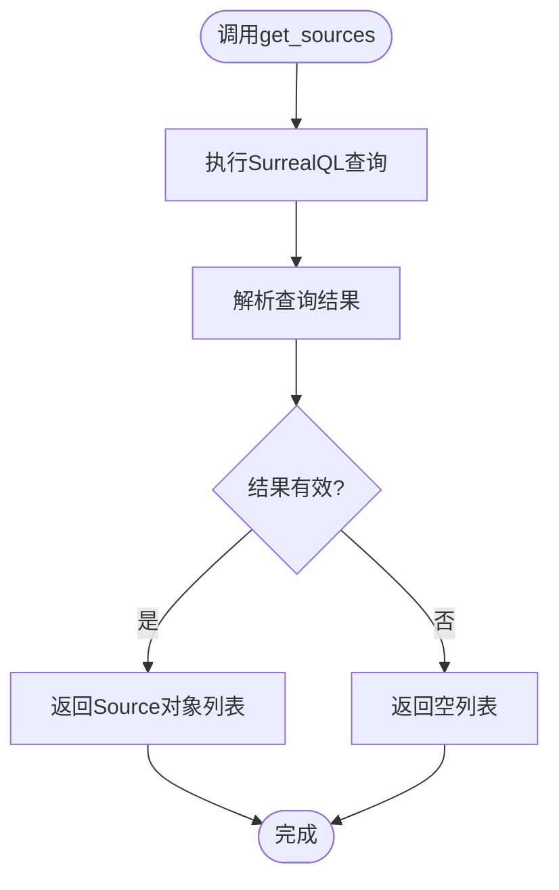
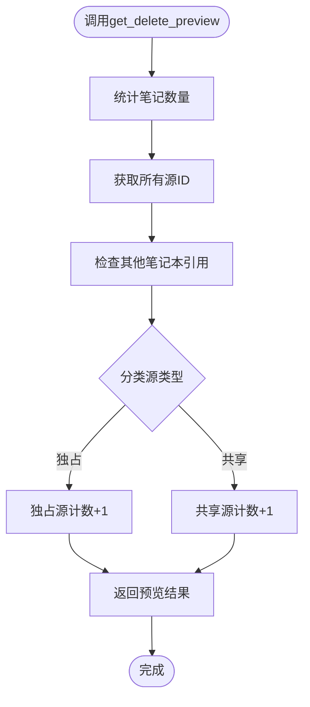
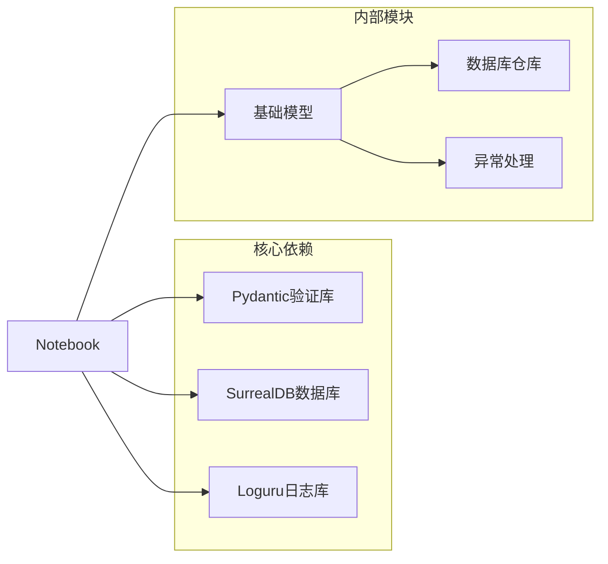

# 笔记本实体模型

<cite>
**本文档引用的文件**
- [notebook.py](file://open_notebook/domain/notebook.py)
- [base.py](file://open_notebook/domain/base.py)
- [models.py](file://api/models.py)
- [notebooks.py](file://api/routers/notebooks.py)
- [notebook_service.py](file://api/notebook_service.py)
- [repository.py](file://open_notebook/database/repository.py)
- [test_domain.py](file://tests/test_domain.py)
</cite>

## 目录
1. [简介](#简介)
2. [项目结构](#项目结构)
3. [核心组件](#核心组件)
4. [架构概览](#架构概览)
5. [详细组件分析](#详细组件分析)
6. [依赖关系分析](#依赖关系分析)
7. [性能考虑](#性能考虑)
8. [故障排除指南](#故障排除指南)
9. [结论](#结论)

## 简介

笔记本实体模型是Open Notebook知识管理系统的核心数据结构，用于组织和管理用户的知识内容。该模型实现了完整的CRUD操作、数据验证、关联关系管理和生命周期控制。本文档深入分析Notebook类的数据结构、字段定义、业务逻辑和查询方法，为开发者提供全面的技术参考。

## 项目结构

Open Notebook采用分层架构设计，笔记本实体模型位于领域层（Domain Layer），通过API层和数据库层进行交互：



**图表来源**
- [notebook.py](file://open_notebook/domain/notebook.py#L16-L23)
- [base.py](file://open_notebook/domain/base.py#L31-L37)
- [repository.py](file://open_notebook/database/repository.py#L65-L86)

**章节来源**
- [notebook.py](file://open_notebook/domain/notebook.py#L1-L679)
- [base.py](file://open_notebook/domain/base.py#L1-L329)

## 核心组件

### Notebook类定义

Notebook类继承自ObjectModel基类，实现了完整的实体模型功能：



**图表来源**
- [notebook.py](file://open_notebook/domain/notebook.py#L16-L23)
- [notebook.py](file://open_notebook/domain/notebook.py#L288-L307)
- [notebook.py](file://open_notebook/domain/notebook.py#L555-L567)
- [notebook.py](file://open_notebook/domain/notebook.py#L611-L625)

### 字段定义与约束

| 字段名 | 类型 | 默认值 | 约束 | 描述 |
|--------|------|--------|------|------|
| id | Optional[str] | None | 自动分配 | 实体唯一标识符 |
| name | str | - | 必填且非空 | 笔记本名称，不能为空或空白字符 |
| description | str | "" | 可选 | 笔记本描述信息 |
| archived | Optional[bool] | False | 可选 | 归档状态标志，默认False |
| created | Optional[datetime] | None | 自动设置 | 创建时间戳 |
| updated | Optional[datetime] | None | 自动更新 | 最后更新时间戳 |

**章节来源**
- [notebook.py](file://open_notebook/domain/notebook.py#L16-L23)
- [notebook.py](file://open_notebook/domain/notebook.py#L22-L27)

## 架构概览

笔记本实体模型采用Repository模式，通过统一的数据库访问层实现数据持久化：

```mermaid
sequenceDiagram
participant Client as 客户端
participant API as API路由器
participant Service as 服务层
participant Domain as 领域模型
participant Repo as 数据库仓库
participant DB as SurrealDB
Client->>API : GET /notebooks
API->>Service : get_all_notebooks()
Service->>Domain : Notebook.get_all()
Domain->>Repo : repo_query(SELECT * FROM notebook)
Repo->>DB : 执行查询
DB-->>Repo : 返回结果
Repo-->>Domain : 解析数据
Domain-->>Service : 返回Notebook列表
Service-->>API : 返回NotebookResponse
API-->>Client : HTTP 200
Note : 异步查询模式，支持并发操作
```

**图表来源**
- [notebooks.py](file://api/routers/notebooks.py#L20-L59)
- [notebook_service.py](file://api/notebook_service.py#L19-L34)
- [base.py](file://open_notebook/domain/base.py#L39-L67)

## 详细组件分析

### 数据验证规则

Notebook类实现了严格的字段验证机制：

#### 名称验证
- 必须为非空字符串
- 不允许仅包含空白字符
- 使用Pydantic字段验证器确保数据完整性

#### 归档状态管理
- archived字段默认False
- 支持布尔值更新
- 用于控制笔记本显示状态

**章节来源**
- [notebook.py](file://open_notebook/domain/notebook.py#L22-L27)
- [notebook.py](file://open_notebook/domain/notebook.py#L18-L20)

### 关联关系管理

笔记本实体与多个子实体建立复杂的关系网络：

#### 源实体关联
- 通过reference关系连接到Source实体
- 支持多对多关系管理
- 提供添加和移除源的操作

#### 笔记实体关联
- 通过artifact关系连接到Note实体
- 支持笔记内容的组织和检索
- 实现笔记与笔记本的绑定

#### 聊天会话关联
- 通过refers_to关系连接到ChatSession实体
- 支持基于笔记本的上下文聊天
- 维护对话历史和上下文

**章节来源**
- [notebook.py](file://open_notebook/domain/notebook.py#L29-L86)
- [notebook.py](file://open_notebook/domain/notebook.py#L406-L410)
- [notebook.py](file://open_notebook/domain/notebook.py#L593-L596)
- [notebook.py](file://open_notebook/domain/notebook.py#L617-L625)

### 查询方法实现

#### 获取源列表


**图表来源**
- [notebook.py](file://open_notebook/domain/notebook.py#L29-L44)

#### 获取笔记列表
- 支持内容省略以提高性能
- 按更新时间倒序排列
- 返回Note对象列表

#### 获取聊天会话列表
- 通过refers_to关系查询
- 支持模型覆盖配置
- 返回ChatSession对象列表

**章节来源**
- [notebook.py](file://open_notebook/domain/notebook.py#L46-L86)

### 删除预览功能

删除预览功能提供了安全的批量删除操作：



**图表来源**
- [notebook.py](file://open_notebook/domain/notebook.py#L88-L136)

### 级联删除策略

笔记本删除操作遵循严格的安全策略：

#### 删除流程
1. **笔记删除**：递归删除所有关联笔记
2. **关系清理**：删除artifact关系记录
3. **源处理**：
   - 如果启用独占删除：删除仅属于当前笔记本的源
   - 否则：仅取消与其他笔记本的关联
4. **笔记本清理**：删除笔记本记录本身

#### 删除选项
- `delete_exclusive_sources`：是否删除独占源
- 返回详细的删除统计信息

**章节来源**
- [notebook.py](file://open_notebook/domain/notebook.py#L138-L230)
- [notebooks.py](file://api/routers/notebooks.py#L293-L327)

## 依赖关系分析

### 外部依赖

笔记本实体模型依赖以下核心组件：



**图表来源**
- [notebook.py](file://open_notebook/domain/notebook.py#L1-L14)
- [base.py](file://open_notebook/domain/base.py#L1-L27)

### 内部耦合关系

| 组件 | 依赖关系 | 作用 |
|------|----------|------|
| Notebook | ObjectModel | 基础实体功能 |
| Notebook | Source | 源关联管理 |
| Notebook | Note | 笔记关联管理 |
| Notebook | ChatSession | 聊天关联管理 |
| ObjectModel | Repository | 数据库操作 |
| ObjectModel | Exceptions | 错误处理 |

**章节来源**
- [notebook.py](file://open_notebook/domain/notebook.py#L1-L14)
- [base.py](file://open_notebook/domain/base.py#L13-L21)

## 性能考虑

### 查询优化

1. **字段选择优化**：在获取源列表时省略full_text字段
2. **内容过滤**：在获取笔记列表时省略content和embedding字段
3. **索引利用**：通过ORDER BY子句优化排序性能

### 并发处理

- 所有数据库操作都是异步的
- 支持高并发请求处理
- 事务冲突自动重试机制

### 缓存策略

- 对于频繁访问的实体，建议在应用层实现缓存
- 避免重复的数据库查询
- 使用适当的缓存失效策略

## 故障排除指南

### 常见错误类型

| 错误类型 | 触发条件 | 解决方案 |
|----------|----------|----------|
| InvalidInputError | 输入数据无效 | 检查字段验证规则 |
| DatabaseOperationError | 数据库操作失败 | 查看日志获取详细信息 |
| NotFoundError | 实体不存在 | 确认ID有效性 |
| RuntimeError | 事务冲突 | 实现重试逻辑 |

### 调试技巧

1. **启用详细日志**：查看数据库查询和错误堆栈
2. **单元测试**：运行测试套件验证功能正确性
3. **API测试**：使用Swagger UI验证接口行为

**章节来源**
- [base.py](file://open_notebook/domain/base.py#L152-L160)
- [test_domain.py](file://tests/test_domain.py#L80-L101)

## 结论

笔记本实体模型通过清晰的架构设计和严格的验证机制，为Open Notebook提供了强大的知识管理能力。其异步查询、级联删除和关联管理等功能，确保了系统的可扩展性和数据完整性。开发者可以基于此模型快速构建复杂的知识管理应用，同时享受良好的性能表现和错误处理机制。

通过本文档提供的详细分析和最佳实践指导，开发者能够有效地使用和扩展笔记本实体模型，满足各种知识管理场景的需求。