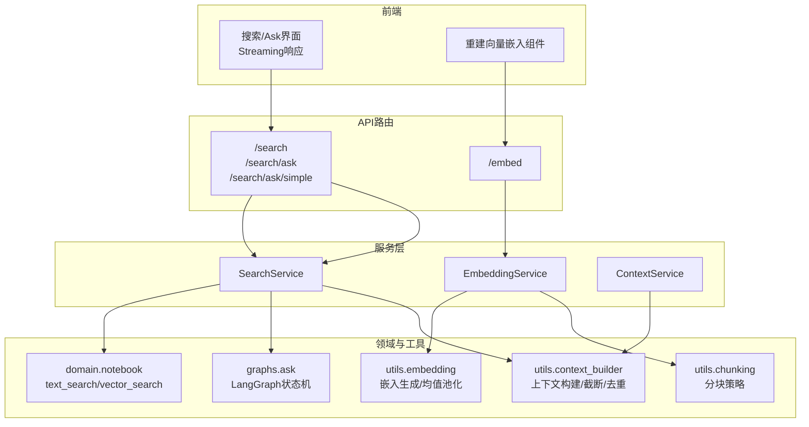
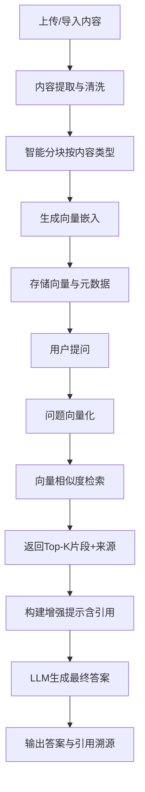
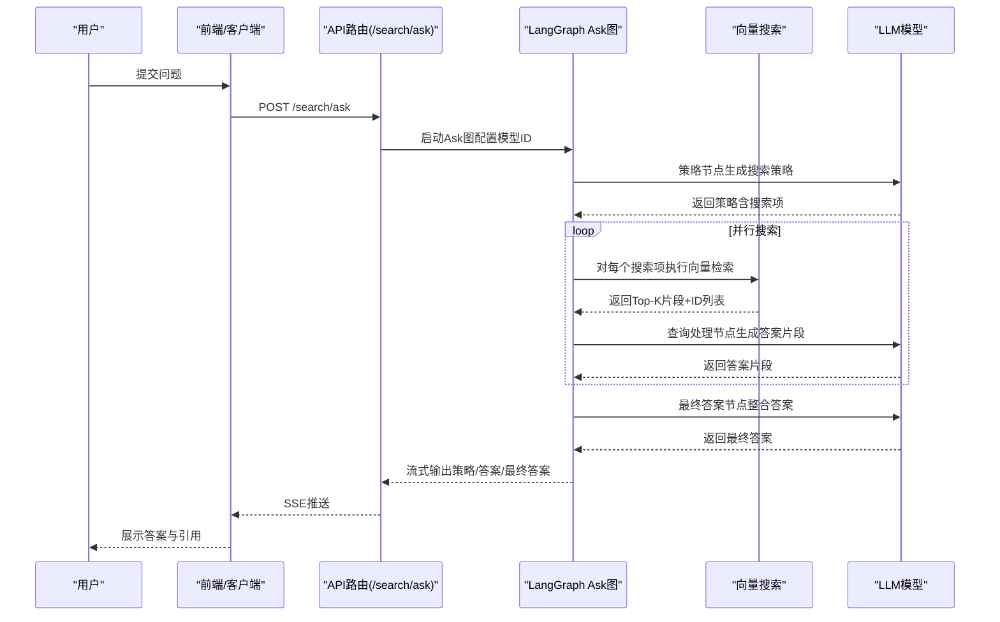
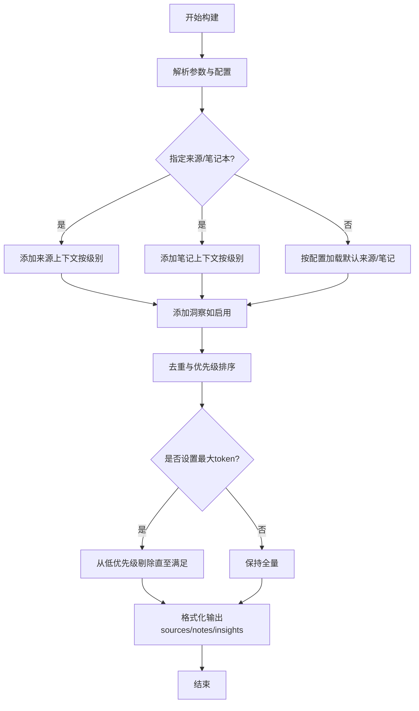
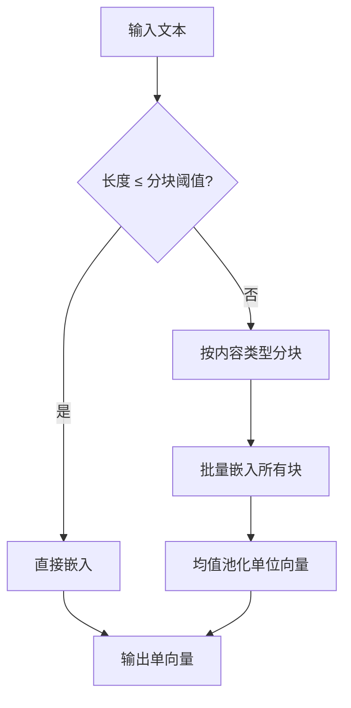
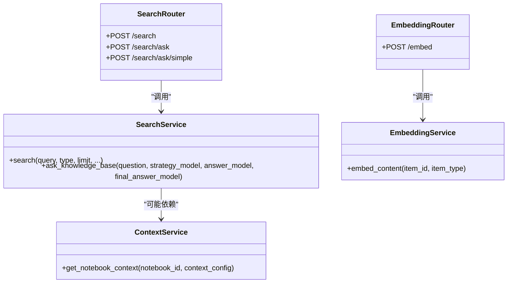
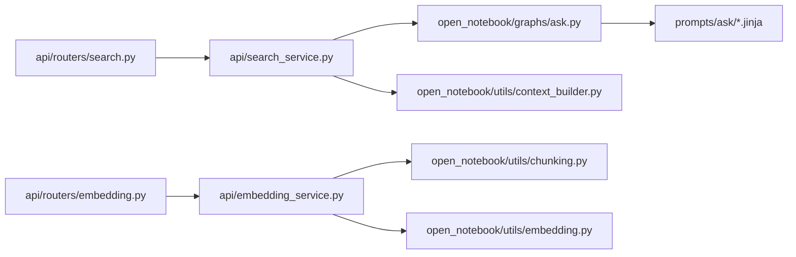

# AI上下文与RAG原理

<cite>
**本文引用的文件**
- [docs/2-CORE-CONCEPTS/ai-context-rag.md](file://docs/2-CORE-CONCEPTS/ai-context-rag.md)
- [docs/2-CORE-CONCEPTS/chat-vs-transformations.md](file://docs/2-CORE-CONCEPTS/chat-vs-transformations.md)
- [api/routers/search.py](file://api/routers/search.py)
- [api/routers/embedding.py](file://api/routers/embedding.py)
- [api/context_service.py](file://api/context_service.py)
- [api/embedding_service.py](file://api/embedding_service.py)
- [api/search_service.py](file://api/search_service.py)
- [open_notebook/graphs/ask.py](file://open_notebook/graphs/ask.py)
- [open_notebook/utils/context_builder.py](file://open_notebook/utils/context_builder.py)
- [open_notebook/utils/chunking.py](file://open_notebook/utils/chunking.py)
- [open_notebook/utils/embedding.py](file://open_notebook/utils/embedding.py)
- [open_notebook/domain/content_settings.py](file://open_notebook/domain/content_settings.py)
- [prompts/ask/entry.jinja](file://prompts/ask/entry.jinja)
- [prompts/ask/query_process.jinja](file://prompts/ask/query_process.jinja)
- [prompts/ask/final_answer.jinja](file://prompts/ask/final_answer.jinja)
- [frontend/src/app/(dashboard)/advanced/components/RebuildEmbeddings.tsx](file://frontend/src/app/(dashboard)/advanced/components/RebuildEmbeddings.tsx)
</cite>

## 目录
1. [引言](#引言)
2. [项目结构](#项目结构)
3. [核心组件](#核心组件)
4. [架构总览](#架构总览)
5. [详细组件分析](#详细组件分析)
6. [依赖关系分析](#依赖关系分析)
7. [性能考量](#性能考量)
8. [故障排查指南](#故障排查指南)
9. [结论](#结论)
10. [附录](#附录)

## 引言
本文件面向开发者与使用者，系统化阐述Open Notebook中的AI上下文与RAG（检索增强生成）原理，解释RAG三阶段工作机制（内容准备、查询时检索、增强合成）、两种AI交互模式（完整内容聊天Chat与RAG检索增强Ask）的差异与适用场景，并说明上下文管理在隐私控制、成本优化与性能方面的价值。文中结合后端服务层、工具函数与前端组件，给出可操作的架构视图与流程图，帮助读者快速理解并高效使用该能力。

## 项目结构
Open Notebook围绕“知识源”（Sources）与“笔记”（Notes）两类内容，提供两大AI交互路径：
- Chat（完整内容上下文）：手动选择来源，按配置级别发送到LLM，适合对话探索与深度分析。
- Ask（RAG检索增强）：基于向量搜索自动召回相关片段，再由LLM合成答案，适合复杂问题与大规模资料的综合回答。

图表来源
- [api/routers/search.py](file://api/routers/search.py#L17-L215)
- [api/routers/embedding.py](file://api/routers/embedding.py#L12-L114)
- [api/search_service.py](file://api/search_service.py#L18-L58)
- [api/embedding_service.py](file://api/embedding_service.py#L18-L27)
- [api/context_service.py](file://api/context_service.py#L18-L25)
- [open_notebook/graphs/ask.py](file://open_notebook/graphs/ask.py#L137-L147)
- [open_notebook/utils/context_builder.py](file://open_notebook/utils/context_builder.py#L105-L141)
- [open_notebook/utils/chunking.py](file://open_notebook/utils/chunking.py#L386-L446)
- [open_notebook/utils/embedding.py](file://open_notebook/utils/embedding.py#L82-L208)

章节来源
- [docs/2-CORE-CONCEPTS/ai-context-rag.md](file://docs/2-CORE-CONCEPTS/ai-context-rag.md#L26-L347)
- [docs/2-CORE-CONCEPTS/chat-vs-transformations.md](file://docs/2-CORE-CONCEPTS/chat-vs-transformations.md#L7-L194)

## 核心组件
- 搜索与Ask服务
  - 文本/向量搜索：支持BM25关键词匹配与向量相似度检索，返回结果包含来源、页码、置信度等元信息。
  - Ask流式管线：通过LangGraph状态机拆解问题、并发检索、汇总答案，支持结构化输出与引用溯源。
- 向量嵌入服务
  - 支持异步/同步两种模式：异步提交后台任务，同步直接触发嵌入生成；对长文本进行分块与均值池化，保证语义一致性。
- 上下文构建器
  - 统一聚合来源、笔记、洞察，按优先级排序、去重、截断，控制最大token数，确保LLM输入可控。
- 分块与嵌入工具
  - 基于内容类型（HTML/Markdown/纯文本）智能分块，支持环境变量配置分块大小与重叠；提供批量嵌入与均值池化以降低维度漂移。
- 内容设置
  - 控制默认内容处理引擎、嵌入选项、YouTube字幕语言偏好等，影响后续预处理与检索质量。

章节来源
- [api/routers/search.py](file://api/routers/search.py#L17-L215)
- [api/routers/embedding.py](file://api/routers/embedding.py#L12-L114)
- [open_notebook/graphs/ask.py](file://open_notebook/graphs/ask.py#L1-L147)
- [open_notebook/utils/context_builder.py](file://open_notebook/utils/context_builder.py#L59-L496)
- [open_notebook/utils/chunking.py](file://open_notebook/utils/chunking.py#L30-L446)
- [open_notebook/utils/embedding.py](file://open_notebook/utils/embedding.py#L26-L208)
- [open_notebook/domain/content_settings.py](file://open_notebook/domain/content_settings.py#L8-L26)

## 架构总览
RAG工作流分为三个阶段：内容准备（提取→分块→嵌入→入库）、查询时检索（问题向量化→相似度搜索→返回Top-K）、增强合成（构建提示→调用LLM→生成答案+引用）。

图表来源
- [docs/2-CORE-CONCEPTS/ai-context-rag.md](file://docs/2-CORE-CONCEPTS/ai-context-rag.md#L40-L144)
- [open_notebook/utils/chunking.py](file://open_notebook/utils/chunking.py#L386-L446)
- [open_notebook/utils/embedding.py](file://open_notebook/utils/embedding.py#L82-L208)
- [api/routers/search.py](file://api/routers/search.py#L17-L59)

## 详细组件分析

### 组件A：Ask检索增强流程（LangGraph状态机）
- 角色分工
  - 策略节点：根据问题生成多条搜索策略与指令。
  - 并行检索节点：对每条策略执行向量搜索，收集结果与文档ID。
  - 最终答案节点：汇总各答案，生成统一结论并保留引用。
- 数据流
  - 输入：用户问题与模型配置。
  - 输出：策略、中间答案、最终答案，以及Server-Sent Events流式传输。
- 关键提示词模板
  - 入口策略模板：引导模型制定JSON格式的搜索策略。
  - 查询处理模板：指导模型基于检索结果与指令生成答案，并严格引用提供的文档ID。
  - 最终答案模板：整合所有子答案，形成一致、可溯源的最终回复。

图表来源
- [api/routers/search.py](file://api/routers/search.py#L61-L155)
- [open_notebook/graphs/ask.py](file://open_notebook/graphs/ask.py#L48-L147)
- [prompts/ask/entry.jinja](file://prompts/ask/entry.jinja#L1-L46)
- [prompts/ask/query_process.jinja](file://prompts/ask/query_process.jinja#L1-L55)
- [prompts/ask/final_answer.jinja](file://prompts/ask/final_answer.jinja#L1-L41)

章节来源
- [open_notebook/graphs/ask.py](file://open_notebook/graphs/ask.py#L1-L147)
- [prompts/ask/entry.jinja](file://prompts/ask/entry.jinja#L1-L46)
- [prompts/ask/query_process.jinja](file://prompts/ask/query_process.jinja#L1-L55)
- [prompts/ask/final_answer.jinja](file://prompts/ask/final_answer.jinja#L1-L41)

### 组件B：上下文构建与截断（ContextBuilder）
- 功能要点
  - 聚合来源、笔记、洞察，支持按优先级排序与去重。
  - 自动计算token数量，超过阈值时从低优先级开始剔除，确保LLM输入上限。
  - 支持灵活配置：是否包含洞察、是否包含笔记、最大token数、各类别权重。
- 使用场景
  - Chat模式：按用户选择的来源与级别（全文/摘要/不入上下文）构建上下文。
  - Ask模式：作为检索前的上下文辅助（例如过滤与优先级），或用于非RAG的对话增强。

图表来源
- [open_notebook/utils/context_builder.py](file://open_notebook/utils/context_builder.py#L105-L141)
- [open_notebook/utils/context_builder.py](file://open_notebook/utils/context_builder.py#L315-L366)

章节来源
- [open_notebook/utils/context_builder.py](file://open_notebook/utils/context_builder.py#L59-L496)

### 组件C：分块与嵌入（Chunking + Embedding）
- 分块策略
  - 基于内容类型选择不同分割器：HTML/Markdown按标题层级切分，纯文本按字符递归切分。
  - 支持环境变量配置分块大小与重叠比例，避免超长片段导致嵌入失败或语义割裂。
- 嵌入生成
  - 长文本先分块，再批量嵌入，最后通过均值池化得到单一向量，提升稳定性与一致性。
  - 错误处理与日志记录，便于定位模型不可用、输入为空等问题。

图表来源
- [open_notebook/utils/chunking.py](file://open_notebook/utils/chunking.py#L386-L446)
- [open_notebook/utils/embedding.py](file://open_notebook/utils/embedding.py#L82-L208)

章节来源
- [open_notebook/utils/chunking.py](file://open_notebook/utils/chunking.py#L30-L446)
- [open_notebook/utils/embedding.py](file://open_notebook/utils/embedding.py#L26-L208)

### 组件D：API服务层（Search/Embedding/Context）
- SearchService/SearchRouter
  - 提供文本/向量搜索接口，校验嵌入模型可用性；Ask接口支持流式SSE与简单一次性响应。
- EmbeddingService/EmbeddingRouter
  - 提供异步/同步嵌入提交，自动注册命令并返回命令ID；支持对Source或Note进行向量化。
- ContextService
  - 封装获取笔记本上下文的API调用，便于上层业务复用。

图表来源
- [api/search_service.py](file://api/search_service.py#L18-L58)
- [api/embedding_service.py](file://api/embedding_service.py#L18-L27)
- [api/context_service.py](file://api/context_service.py#L18-L25)
- [api/routers/search.py](file://api/routers/search.py#L17-L215)
- [api/routers/embedding.py](file://api/routers/embedding.py#L12-L114)

章节来源
- [api/search_service.py](file://api/search_service.py#L12-L58)
- [api/embedding_service.py](file://api/embedding_service.py#L12-L27)
- [api/context_service.py](file://api/context_service.py#L12-L29)
- [api/routers/search.py](file://api/routers/search.py#L17-L215)
- [api/routers/embedding.py](file://api/routers/embedding.py#L12-L114)

## 依赖关系分析
- 模块耦合
  - API路由依赖服务层；服务层进一步依赖领域模型与工具模块。
  - Ask图依赖LangChain模型提供器与向量搜索；向量搜索依赖嵌入模型与数据库索引。
- 外部依赖
  - 嵌入模型（如OpenAI等）与向量数据库（未在本节展开）。
  - LangGraph用于编排Ask流程，Jinja模板驱动提示词工程。
- 可能的循环依赖
  - 工具模块避免在导入时直接依赖AI模型配置，采用延迟导入规避循环依赖。

图表来源
- [api/routers/search.py](file://api/routers/search.py#L1-L215)
- [api/routers/embedding.py](file://api/routers/embedding.py#L1-L114)
- [api/search_service.py](file://api/search_service.py#L1-L59)
- [api/embedding_service.py](file://api/embedding_service.py#L1-L28)
- [open_notebook/graphs/ask.py](file://open_notebook/graphs/ask.py#L1-L147)
- [open_notebook/utils/context_builder.py](file://open_notebook/utils/context_builder.py#L1-L496)
- [open_notebook/utils/chunking.py](file://open_notebook/utils/chunking.py#L1-L446)
- [open_notebook/utils/embedding.py](file://open_notebook/utils/embedding.py#L1-L208)
- [prompts/ask/entry.jinja](file://prompts/ask/entry.jinja#L1-L46)
- [prompts/ask/query_process.jinja](file://prompts/ask/query_process.jinja#L1-L55)
- [prompts/ask/final_answer.jinja](file://prompts/ask/final_answer.jinja#L1-L41)

章节来源
- [open_notebook/utils/embedding.py](file://open_notebook/utils/embedding.py#L106-L141)

## 性能考量
- Token控制
  - Chat侧通过上下文构建器的max_tokens参数与优先级剔除，避免超出模型上下文窗口。
- 向量检索效率
  - 采用向量相似度而非关键词匹配，适合概念检索；合理设置Top-K与最小分数阈值平衡召回与速度。
- 批量嵌入与均值池化
  - 单次API调用处理多个块，减少往返开销；池化降低维度漂移，提升检索稳定性。
- 分块参数
  - 通过环境变量调节分块大小与重叠，兼顾检索粒度与嵌入成本。

章节来源
- [open_notebook/utils/context_builder.py](file://open_notebook/utils/context_builder.py#L320-L350)
- [open_notebook/utils/chunking.py](file://open_notebook/utils/chunking.py#L30-L83)
- [open_notebook/utils/embedding.py](file://open_notebook/utils/embedding.py#L82-L141)

## 故障排查指南
- Ask/搜索报错
  - 现象：返回HTTP 400/500错误。
  - 排查：确认嵌入模型已配置；检查请求体字段（模型ID、问题、限制参数）；查看后端日志定位异常。
- 嵌入提交失败
  - 现象：/embed返回失败或命令ID为空。
  - 排查：确认item_type为source或note；检查资源是否存在；查看命令队列状态。
- 上下文过大
  - 现象：Chat响应缓慢或被截断。
  - 排查：调整context_config的max_tokens；降低来源数量或改为“摘要”级别。
- 重建向量嵌入
  - 现象：需要重新向量化已有内容。
  - 排查：使用前端“重建向量嵌入”组件，选择模式与包含类型，观察进度与失败统计。

章节来源
- [api/routers/search.py](file://api/routers/search.py#L51-L58)
- [api/routers/search.py](file://api/routers/search.py#L150-L155)
- [api/routers/embedding.py](file://api/routers/embedding.py#L16-L22)
- [api/routers/embedding.py](file://api/routers/embedding.py#L105-L114)
- [frontend/src/app/(dashboard)/advanced/components/RebuildEmbeddings.tsx](file://frontend/src/app/(dashboard)/advanced/components/RebuildEmbeddings.tsx#L34-L114)

## 结论
Open Notebook通过“Chat（完整内容上下文）+ Ask（RAG检索增强）”双通道，既满足对话探索的灵活性，又覆盖跨源综合问答的需求。借助可配置的分块与嵌入策略、严格的上下文截断与优先级管理，系统在隐私保护、成本控制与性能之间取得平衡。配合LangGraph的Ask流程与提示词模板，实现了可解释、可溯源的答案生成。

## 附录
- Chat与Ask对比速览
  - Chat：手动选择来源与级别，对话连贯，适合深度分析与逐步推理。
  - Ask：自动检索与合成，适合复杂问题与大规模资料的综合回答。
- 上下文管理要点
  - 全文/摘要/不入上下文三级控制，兼顾隐私、成本与质量。
- 实际应用建议
  - 学术综述：先用Transformations抽取结构化信息，再用Ask/Chat整合与讨论。
  - 产品研究：先用Ask获取全局概览，再用Chat聚焦细节与权衡。
  - 政策比较：先用Ask对比异同，再用Chat探讨取舍与落地。

章节来源
- [docs/2-CORE-CONCEPTS/chat-vs-transformations.md](file://docs/2-CORE-CONCEPTS/chat-vs-transformations.md#L181-L354)
- [docs/2-CORE-CONCEPTS/ai-context-rag.md](file://docs/2-CORE-CONCEPTS/ai-context-rag.md#L268-L347)