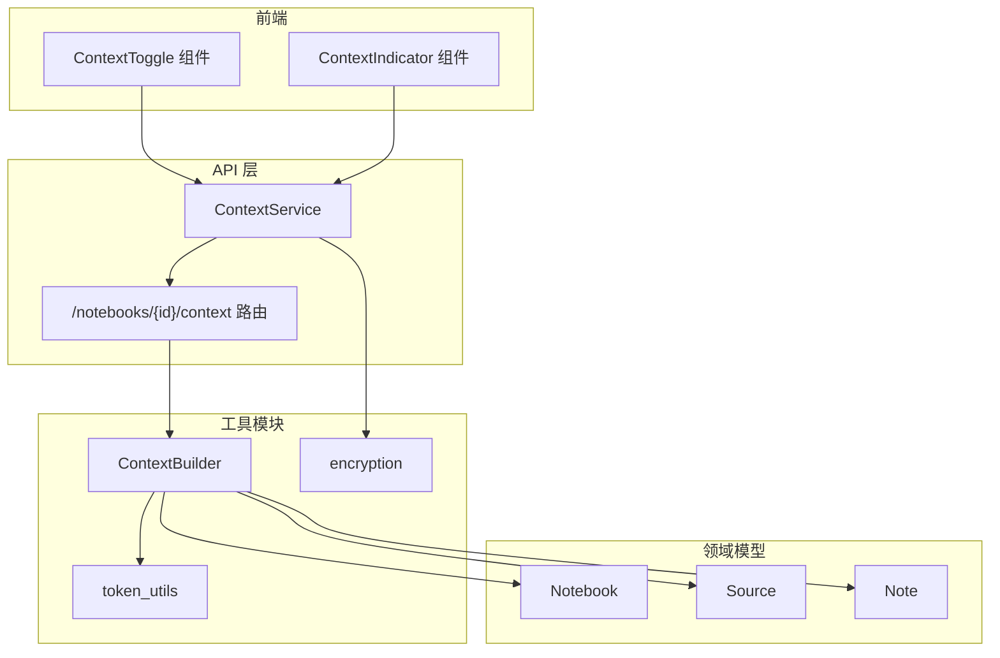
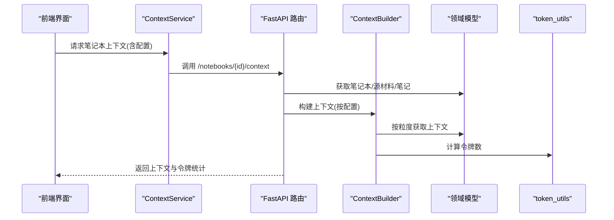
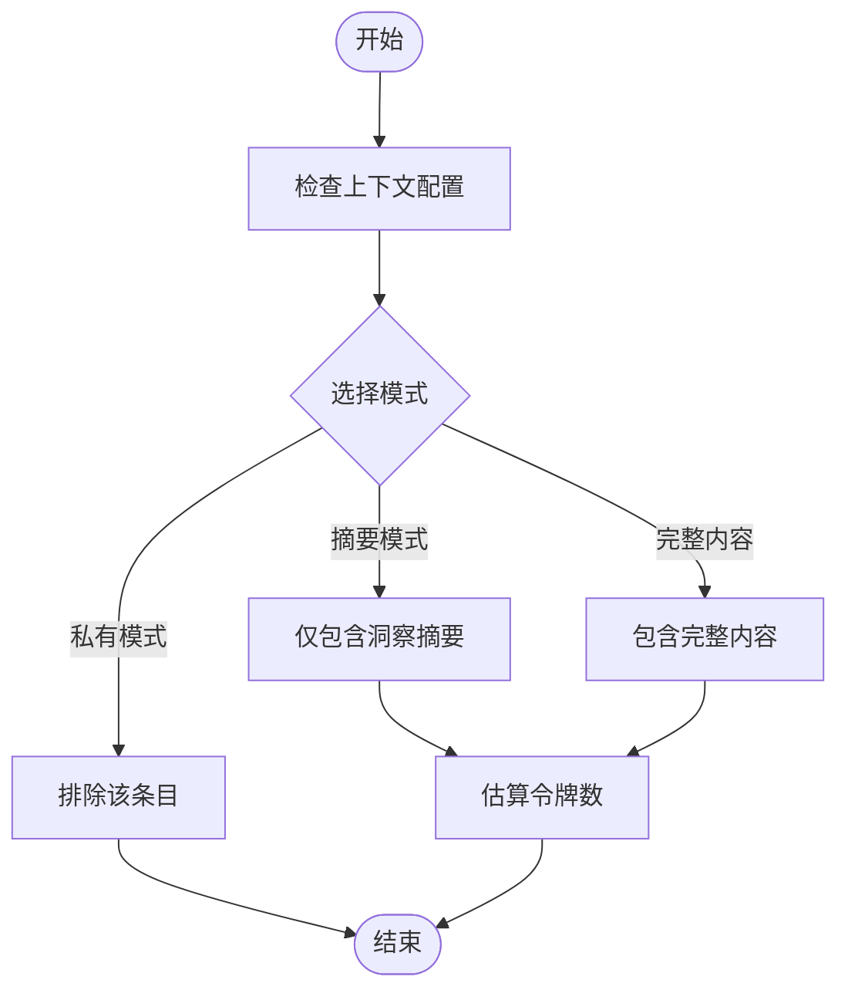
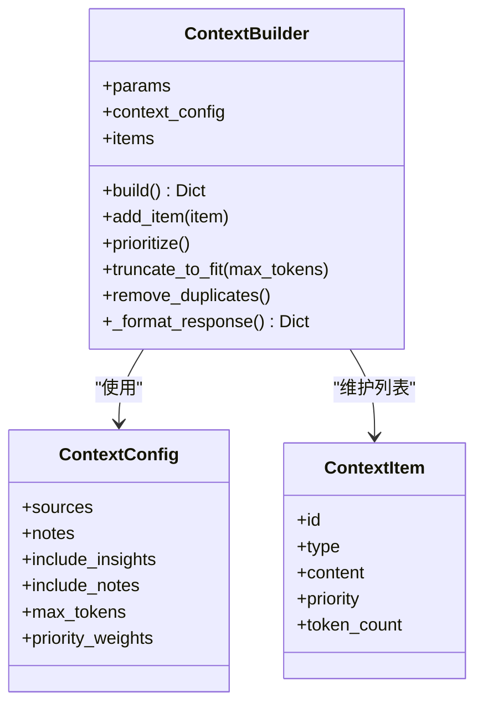
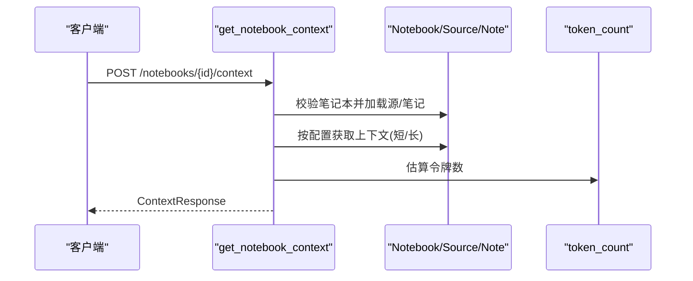
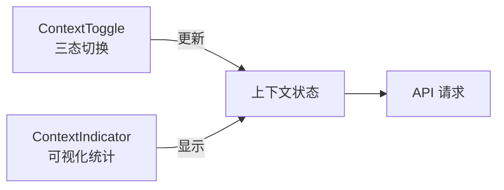
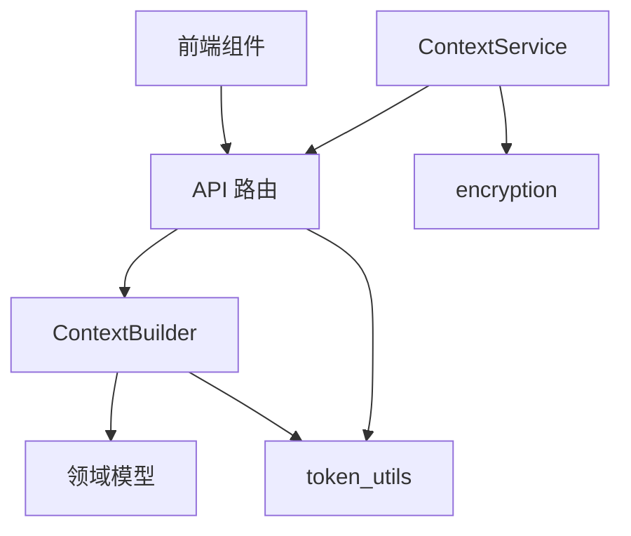

# 上下文管理与隐私控制

<cite>
**本文档引用的文件**
- [api/context_service.py](file://api/context_service.py)
- [api/routers/context.py](file://api/routers/context.py)
- [open_notebook/utils/context_builder.py](file://open_notebook/utils/context_builder.py)
- [open_notebook/domain/notebook.py](file://open_notebook/domain/notebook.py)
- [open_notebook/utils/token_utils.py](file://open_notebook/utils/token_utils.py)
- [open_notebook/utils/encryption.py](file://open_notebook/utils/encryption.py)
- [api/models.py](file://api/models.py)
- [docs/2-CORE-CONCEPTS/ai-context-rag.md](file://docs/2-CORE-CONCEPTS/ai-context-rag.md)
- [docs/5-CONFIGURATION/security.md](file://docs/5-CONFIGURATION/security.md)
- [frontend/src/components/common/ContextToggle.tsx](file://frontend/src/components/common/ContextToggle.tsx)
- [frontend/src/components/common/ContextIndicator.tsx](file://frontend/src/components/common/ContextIndicator.tsx)
</cite>

## 目录
1. [简介](#简介)
2. [项目结构](#项目结构)
3. [核心组件](#核心组件)
4. [架构总览](#架构总览)
5. [详细组件分析](#详细组件分析)
6. [依赖关系分析](#依赖关系分析)
7. [性能考量](#性能考量)
8. [故障排查指南](#故障排查指南)
9. [结论](#结论)
10. [附录](#附录)

## 简介
本文件聚焦于 Open Notebook 的上下文管理与隐私控制机制，系统性阐述以下主题：
- 三种上下文级别设置的含义与影响：私有模式（数据不进入 AI）、摘要模式（仅传递压缩信息）、完整内容模式（完全透明访问）
- 如何通过上下文配置在隐私保护、成本控制与 AI 性能之间取得平衡
- 面向个人研究、团队协作与生产环境的最佳实践建议

## 项目结构
Open Notebook 将“上下文构建”与“隐私控制”贯穿于后端服务层、领域模型与前端交互层：
- 后端服务层负责对外暴露上下文接口，并调用领域模型与工具模块进行内容聚合与估算
- 领域模型定义了笔记本、源材料与笔记等实体及其上下文获取方法
- 工具模块提供令牌计数、成本估算与敏感数据加密能力
- 前端提供直观的上下文切换与指示器，帮助用户可视化地控制隐私边界

图表来源
- [api/context_service.py](file://api/context_service.py#L12-L29)
- [api/routers/context.py](file://api/routers/context.py#L12-L116)
- [open_notebook/utils/context_builder.py](file://open_notebook/utils/context_builder.py#L59-L141)
- [open_notebook/domain/notebook.py](file://open_notebook/domain/notebook.py#L288-L608)
- [open_notebook/utils/token_utils.py](file://open_notebook/utils/token_utils.py#L15-L48)
- [open_notebook/utils/encryption.py](file://open_notebook/utils/encryption.py#L128-L199)

章节来源
- [api/context_service.py](file://api/context_service.py#L1-L30)
- [api/routers/context.py](file://api/routers/context.py#L1-L116)
- [open_notebook/utils/context_builder.py](file://open_notebook/utils/context_builder.py#L1-L496)
- [open_notebook/domain/notebook.py](file://open_notebook/domain/notebook.py#L1-L679)
- [open_notebook/utils/token_utils.py](file://open_notebook/utils/token_utils.py#L1-L48)
- [open_notebook/utils/encryption.py](file://open_notebook/utils/encryption.py#L1-L199)

## 核心组件
- 上下文服务层：封装对外的上下文获取接口，统一调用 API 客户端
- 上下文路由：接收请求参数，解析上下文配置，按需加载源材料与笔记，计算令牌数
- 上下文构建器：面向领域对象的通用构建器，支持优先级、去重、截断与格式化输出
- 领域模型：提供源材料与笔记的上下文获取方法，支持“摘要/全文”两种粒度
- 令牌工具：基于编码器估算令牌数量，支持成本估算
- 加密工具：对数据库中存储的 API 密钥进行对称加密，保障凭据安全

章节来源
- [api/context_service.py](file://api/context_service.py#L12-L29)
- [api/routers/context.py](file://api/routers/context.py#L12-L116)
- [open_notebook/utils/context_builder.py](file://open_notebook/utils/context_builder.py#L59-L496)
- [open_notebook/domain/notebook.py](file://open_notebook/domain/notebook.py#L361-L608)
- [open_notebook/utils/token_utils.py](file://open_notebook/utils/token_utils.py#L15-L48)
- [open_notebook/utils/encryption.py](file://open_notebook/utils/encryption.py#L128-L199)

## 架构总览
Open Notebook 的上下文管理采用“显式检索 + 可控粒度”的设计：用户在前端选择哪些源材料与笔记进入上下文，并指定其上下文粒度；后端根据配置构建上下文，估算令牌数，最终返回给调用方。

图表来源
- [api/context_service.py](file://api/context_service.py#L18-L25)
- [api/routers/context.py](file://api/routers/context.py#L12-L116)
- [open_notebook/utils/context_builder.py](file://open_notebook/utils/context_builder.py#L105-L141)
- [open_notebook/domain/notebook.py](file://open_notebook/domain/notebook.py#L361-L608)
- [open_notebook/utils/token_utils.py](file://open_notebook/utils/token_utils.py#L15-L34)

## 详细组件分析

### 上下文级别与隐私策略
- 私有模式（数据不进入 AI）：对应“not in”状态，源材料或笔记不会被包含在上下文中，实现最强隐私保护
- 摘要模式（仅传递压缩信息）：对应“insights”状态，仅发送 AI 生成的洞察摘要，显著降低令牌消耗与外传数据量
- 完整内容模式（完全透明访问）：对应“full content”状态，发送源材料或笔记的完整内容，适合深度分析但带来更高成本与风险

图表来源
- [open_notebook/utils/context_builder.py](file://open_notebook/utils/context_builder.py#L142-L186)
- [open_notebook/domain/notebook.py](file://open_notebook/domain/notebook.py#L361-L374)
- [open_notebook/utils/token_utils.py](file://open_notebook/utils/token_utils.py#L15-L34)

章节来源
- [docs/2-CORE-CONCEPTS/ai-context-rag.md](file://docs/2-CORE-CONCEPTS/ai-context-rag.md#L202-L264)
- [open_notebook/utils/context_builder.py](file://open_notebook/utils/context_builder.py#L142-L186)
- [open_notebook/domain/notebook.py](file://open_notebook/domain/notebook.py#L361-L374)

### 上下文构建器与令牌控制
- 支持优先级权重、去重与按令牌上限截断，确保在有限上下文窗口内最大化价值
- 提供便捷函数以笔记本、源材料或混合方式构建上下文，满足不同使用场景

图表来源
- [open_notebook/utils/context_builder.py](file://open_notebook/utils/context_builder.py#L38-L141)

章节来源
- [open_notebook/utils/context_builder.py](file://open_notebook/utils/context_builder.py#L38-L496)

### API 路由与上下文聚合
- 路由接收上下文请求，校验笔记本存在性，按配置遍历源材料与笔记
- 对“摘要模式”与“完整内容模式”分别调用领域模型的上下文获取方法
- 统计总内容并估算令牌数，返回结构化响应

图表来源
- [api/routers/context.py](file://api/routers/context.py#L12-L116)
- [open_notebook/domain/notebook.py](file://open_notebook/domain/notebook.py#L28-L62)
- [open_notebook/utils/token_utils.py](file://open_notebook/utils/token_utils.py#L15-L34)

章节来源
- [api/routers/context.py](file://api/routers/context.py#L12-L116)
- [open_notebook/domain/notebook.py](file://open_notebook/domain/notebook.py#L28-L62)

### 前端上下文控制与可视化
- ContextToggle：三态切换（关闭/洞察/完整），自动根据是否有洞察调整可用模式
- ContextIndicator：展示当前上下文中洞察、完整源材料与笔记的数量及估算令牌/字符数

图表来源
- [frontend/src/components/common/ContextToggle.tsx](file://frontend/src/components/common/ContextToggle.tsx#L22-L89)
- [frontend/src/components/common/ContextIndicator.tsx](file://frontend/src/components/common/ContextIndicator.tsx#L28-L117)

章节来源
- [frontend/src/components/common/ContextToggle.tsx](file://frontend/src/components/common/ContextToggle.tsx#L1-L89)
- [frontend/src/components/common/ContextIndicator.tsx](file://frontend/src/components/common/ContextIndicator.tsx#L1-L117)

## 依赖关系分析
- 上下文构建器依赖领域模型的上下文获取方法与令牌估算工具
- API 路由依赖上下文构建器与令牌估算工具
- 前端组件依赖上下文状态与指标展示
- 加密工具为凭据安全提供基础保障，间接支撑隐私控制

图表来源
- [api/context_service.py](file://api/context_service.py#L12-L29)
- [api/routers/context.py](file://api/routers/context.py#L12-L116)
- [open_notebook/utils/context_builder.py](file://open_notebook/utils/context_builder.py#L59-L141)
- [open_notebook/utils/token_utils.py](file://open_notebook/utils/token_utils.py#L15-L48)
- [open_notebook/utils/encryption.py](file://open_notebook/utils/encryption.py#L128-L199)

章节来源
- [api/context_service.py](file://api/context_service.py#L1-L30)
- [api/routers/context.py](file://api/routers/context.py#L1-L116)
- [open_notebook/utils/context_builder.py](file://open_notebook/utils/context_builder.py#L1-L496)
- [open_notebook/utils/token_utils.py](file://open_notebook/utils/token_utils.py#L1-L48)
- [open_notebook/utils/encryption.py](file://open_notebook/utils/encryption.py#L1-L199)

## 性能考量
- 令牌估算：通过编码器估算令牌数，避免超限与昂贵的模型调用
- 截断策略：当总令牌超过上限时，按优先级从低到高移除条目，保证在有限窗口内的最优覆盖
- 成本控制：摘要模式显著降低令牌消耗，适合大规模背景材料；完整内容模式用于关键细节分析

章节来源
- [open_notebook/utils/context_builder.py](file://open_notebook/utils/context_builder.py#L320-L350)
- [open_notebook/utils/token_utils.py](file://open_notebook/utils/token_utils.py#L36-L48)

## 故障排查指南
- 上下文为空：确认前端已启用至少一个条目的上下文模式；检查后端日志中关于条目缺失或异常的警告
- 令牌估算异常：若未安装编码器，将回退为词数估算；请确保运行环境具备所需依赖
- 凭据安全问题：API 密钥需经对称加密存储；若更改加密密钥，旧数据将不可读，需重新保存

章节来源
- [api/routers/context.py](file://api/routers/context.py#L52-L56)
- [open_notebook/utils/token_utils.py](file://open_notebook/utils/token_utils.py#L25-L34)
- [open_notebook/utils/encryption.py](file://open_notebook/utils/encryption.py#L83-L87)

## 结论
Open Notebook 通过“显式检索 + 可控粒度”的上下文管理，实现了隐私保护、成本控制与 AI 性能之间的动态平衡。结合前端直观的上下文切换与可视化指标，用户可以灵活地在不同场景下选择合适的上下文级别，从而获得更安全、高效且可控的 AI 辅助体验。

## 附录

### 不同场景下的最佳实践建议
- 个人研究
  - 默认采用摘要模式作为背景材料，完整内容模式用于关键论文或文档
  - 使用私有模式排除不相关或敏感条目
- 团队协作
  - 在共享笔记本中，为外部资料使用摘要模式，内部笔记默认完整内容
  - 定期审查上下文配置，避免不必要的令牌消耗
- 生产环境
  - 强制启用密码保护与反向代理 HTTPS
  - 使用摘要模式处理大量背景材料，完整内容模式仅限必要条目
  - 严格管理加密密钥，定期轮换并做好备份

章节来源
- [docs/2-CORE-CONCEPTS/ai-context-rag.md](file://docs/2-CORE-CONCEPTS/ai-context-rag.md#L202-L264)
- [docs/5-CONFIGURATION/security.md](file://docs/5-CONFIGURATION/security.md#L266-L314)