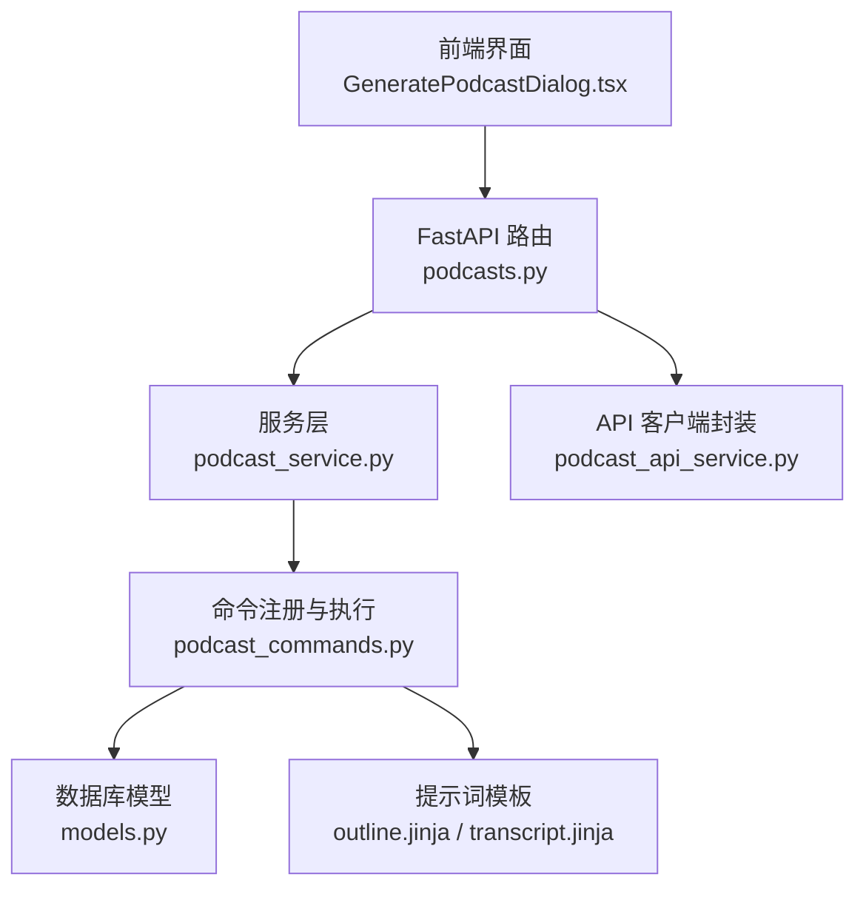
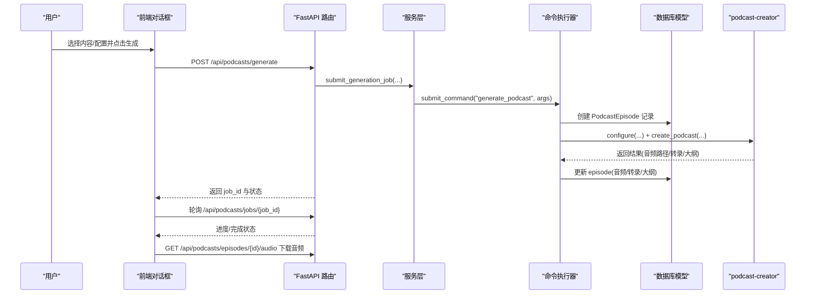
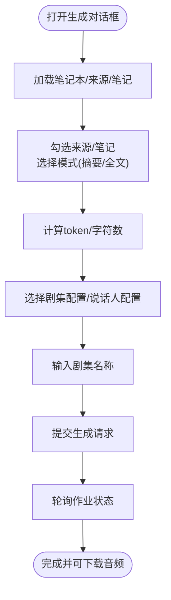
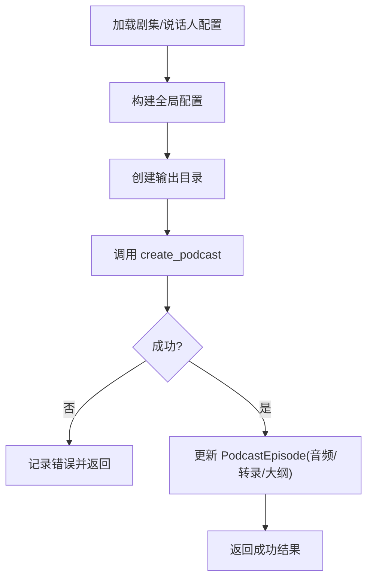
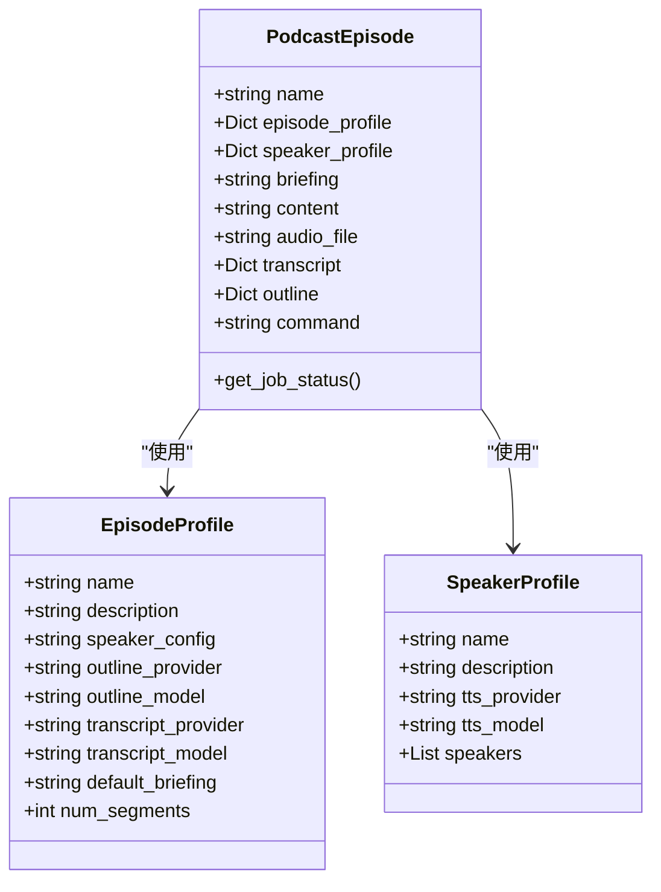
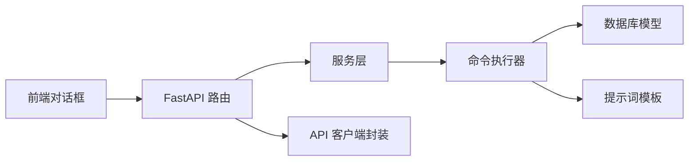

# 播客生成机制

<cite>
**本文引用的文件**
- [api/routers/podcasts.py](file://api/routers/podcasts.py)
- [api/podcast_service.py](file://api/podcast_service.py)
- [api/podcast_api_service.py](file://api/podcast_api_service.py)
- [commands/podcast_commands.py](file://commands/podcast_commands.py)
- [open_notebook/podcasts/models.py](file://open_notebook/podcasts/models.py)
- [prompts/podcast/outline.jinja](file://prompts/podcast/outline.jinja)
- [prompts/podcast/transcript.jinja](file://prompts/podcast/transcript.jinja)
- [docs/2-CORE-CONCEPTS/podcasts-explained.md](file://docs/2-CORE-CONCEPTS/podcasts-explained.md)
- [docs/3-USER-GUIDE/creating-podcasts.md](file://docs/3-USER-GUIDE/creating-podcasts.md)
- [frontend/src/components/podcasts/GeneratePodcastDialog.tsx](file://frontend/src/components/podcasts/GeneratePodcastDialog.tsx)
- [frontend/src/lib/types/podcasts.ts](file://frontend/src/lib/types/podcasts.ts)
- [open_notebook/database/migrations/7.surrealql](file://open_notebook/database/migrations/7.surrealql)
</cite>

## 目录
1. [简介](#简介)
2. [项目结构](#项目结构)
3. [核心组件](#核心组件)
4. [架构总览](#架构总览)
5. [详细组件分析](#详细组件分析)
6. [依赖关系分析](#依赖关系分析)
7. [性能考量](#性能考量)
8. [故障排查指南](#故障排查指南)
9. [结论](#结论)
10. [附录](#附录)

## 简介
本文件系统化阐述 Open Notebook 的播客生成机制，覆盖从研究内容到音频播客的完整技术架构与工作流。重点解析播客生成的三大阶段：大纲生成、脚本创作与音频合成；详解播客配置项（说话人角色、音频风格、内容长度等）；对比播客与其他内容消费方式（阅读、搜索、聊天）的差异与优势；并提供最佳实践与创意应用案例，帮助用户以播客形式提升知识传播效果。

## 项目结构
播客功能由“前端交互层”“后端 API 层”“服务层”“命令执行层”“领域模型与提示词模板”共同组成，并通过数据库迁移定义播客相关表结构。

图表来源
- [api/routers/podcasts.py](file://api/routers/podcasts.py#L1-L234)
- [api/podcast_service.py](file://api/podcast_service.py#L1-L207)
- [api/podcast_api_service.py](file://api/podcast_api_service.py#L1-L126)
- [commands/podcast_commands.py](file://commands/podcast_commands.py#L1-L188)
- [open_notebook/podcasts/models.py](file://open_notebook/podcasts/models.py#L1-L148)
- [prompts/podcast/outline.jinja](file://prompts/podcast/outline.jinja#L1-L84)
- [prompts/podcast/transcript.jinja](file://prompts/podcast/transcript.jinja#L1-L135)

章节来源
- [api/routers/podcasts.py](file://api/routers/podcasts.py#L1-L234)
- [api/podcast_service.py](file://api/podcast_service.py#L1-L207)
- [api/podcast_api_service.py](file://api/podcast_api_service.py#L1-L126)
- [commands/podcast_commands.py](file://commands/podcast_commands.py#L1-L188)
- [open_notebook/podcasts/models.py](file://open_notebook/podcasts/models.py#L1-L148)
- [prompts/podcast/outline.jinja](file://prompts/podcast/outline.jinja#L1-L84)
- [prompts/podcast/transcript.jinja](file://prompts/podcast/transcript.jinja#L1-L135)

## 核心组件
- 前端生成对话框：负责内容选择、配置选择与提交生成请求。
- FastAPI 路由：暴露生成、状态查询、资源管理等接口。
- 服务层：封装业务逻辑，校验配置、提交后台任务、查询状态。
- 命令执行器：使用 podcast-creator 库完成大纲生成、脚本创作与音频合成。
- 领域模型：EpisodeProfile/SpeakerProfile/PodcastEpisode，承载播客配置与产物元数据。
- 提示词模板：outline.jinja 与 transcript.jinja，驱动大纲与脚本生成。
- 数据库迁移：定义 episode_profile、speaker_profile、episode 表及字段。

章节来源
- [frontend/src/components/podcasts/GeneratePodcastDialog.tsx](file://frontend/src/components/podcasts/GeneratePodcastDialog.tsx#L1-L984)
- [frontend/src/lib/types/podcasts.ts](file://frontend/src/lib/types/podcasts.ts#L1-L63)
- [api/routers/podcasts.py](file://api/routers/podcasts.py#L1-L234)
- [api/podcast_service.py](file://api/podcast_service.py#L1-L207)
- [commands/podcast_commands.py](file://commands/podcast_commands.py#L1-L188)
- [open_notebook/podcasts/models.py](file://open_notebook/podcasts/models.py#L1-L148)
- [prompts/podcast/outline.jinja](file://prompts/podcast/outline.jinja#L1-L84)
- [prompts/podcast/transcript.jinja](file://prompts/podcast/transcript.jinja#L1-L135)
- [open_notebook/database/migrations/7.surrealql](file://open_notebook/database/migrations/7.surrealql#L1-L20)

## 架构总览
播客生成采用“异步后台处理 + 多阶段流水线”的设计，确保不阻塞前端交互。整体流程如下：

图表来源
- [api/routers/podcasts.py](file://api/routers/podcasts.py#L40-L83)
- [api/podcast_service.py](file://api/podcast_service.py#L36-L113)
- [commands/podcast_commands.py](file://commands/podcast_commands.py#L49-L167)
- [open_notebook/podcasts/models.py](file://open_notebook/podcasts/models.py#L90-L148)

## 详细组件分析

### 组件一：前端生成对话框（内容选择与提交）
- 功能要点
  - 支持按笔记本聚合来源与笔记，按“摘要/全文”模式选择。
  - 实时统计 token/字符数，辅助估算生成时长与成本。
  - 选择“剧集配置”“说话人配置”，填写剧集名称，提交生成请求。
- 关键交互
  - 使用 React Query 预取来源与笔记列表，减少等待。
  - 构建上下文字符串用于后续生成。

图表来源
- [frontend/src/components/podcasts/GeneratePodcastDialog.tsx](file://frontend/src/components/podcasts/GeneratePodcastDialog.tsx#L556-L800)
- [frontend/src/lib/types/podcasts.ts](file://frontend/src/lib/types/podcasts.ts#L54-L63)

章节来源
- [frontend/src/components/podcasts/GeneratePodcastDialog.tsx](file://frontend/src/components/podcasts/GeneratePodcastDialog.tsx#L1-L984)
- [frontend/src/lib/types/podcasts.ts](file://frontend/src/lib/types/podcasts.ts#L1-L63)

### 组件二：FastAPI 路由与响应模型
- 路由职责
  - 提交生成：返回 job_id，立即非阻塞。
  - 查询作业：返回进度/状态/结果。
  - 列表/详情：列出或获取单个播客条目，包含音频链接与元数据。
  - 流式音频：根据存储路径返回音频文件。
  - 删除：删除记录与本地音频文件。
- 响应模型
  - PodcastGenerationRequest/Response：封装生成参数与返回信息。
  - PodcastEpisodeResponse：封装 episode 列表/详情的对外输出。

章节来源
- [api/routers/podcasts.py](file://api/routers/podcasts.py#L1-L234)
- [api/podcast_service.py](file://api/podcast_service.py#L12-L31)

### 组件三：服务层（业务编排与校验）
- 校验与准备
  - 校验剧集配置与说话人配置是否存在。
  - 若未提供内容，尝试从指定笔记本抽取上下文。
  - 准备命令参数并导入命令模块，提交至 surreal-commands。
- 状态查询
  - 通过 get_command_status 获取作业状态与进度。
- 列表与详情
  - 读取 PodcastEpisode 并补充音频 URL 与作业状态。

章节来源
- [api/podcast_service.py](file://api/podcast_service.py#L36-L161)

### 组件四：命令执行器（podcast-creator 驱动）
- 执行流程
  - 加载剧集与说话人配置，构建全局配置。
  - 创建输出目录，调用 create_podcast 生成音频、转录与大纲。
  - 将结果写回 PodcastEpisode 记录。
- 错误处理
  - 对特定模型输出异常给出明确提示，建议更换模型。

图表来源
- [commands/podcast_commands.py](file://commands/podcast_commands.py#L49-L167)

章节来源
- [commands/podcast_commands.py](file://commands/podcast_commands.py#L1-L188)

### 组件五：领域模型与数据库结构
- EpisodeProfile：剧集配置，包含大纲/转录模型、默认 briefing、段落数等。
- SpeakerProfile：说话人配置，支持 1-4 位说话人，含姓名、voice_id、backstory、personality。
- PodcastEpisode：播客条目，关联剧集/说话人配置、briefing、内容、音频路径、转录、大纲、命令 ID 等。
- 数据库迁移：定义 episode_profile、speaker_profile、episode 表及字段。

图表来源
- [open_notebook/podcasts/models.py](file://open_notebook/podcasts/models.py#L10-L148)
- [open_notebook/database/migrations/7.surrealql](file://open_notebook/database/migrations/7.surrealql#L1-L20)

章节来源
- [open_notebook/podcasts/models.py](file://open_notebook/podcasts/models.py#L1-L148)
- [open_notebook/database/migrations/7.surrealql](file://open_notebook/database/migrations/7.surrealql#L1-L20)

### 组件六：提示词模板（大纲与脚本）
- outline.jinja：基于 briefing 与上下文生成分段大纲，控制段落数与每段大小。
- transcript.jinja：基于大纲与上下文生成自然对话，匹配说话人个性与背景，保证段落内对话连贯。

章节来源
- [prompts/podcast/outline.jinja](file://prompts/podcast/outline.jinja#L1-L84)
- [prompts/podcast/transcript.jinja](file://prompts/podcast/transcript.jinja#L1-L135)

## 依赖关系分析
- 前端依赖后端 API，通过 PodcastGenerationRequest 提交生成。
- 后端路由依赖服务层，服务层依赖命令系统与数据库模型。
- 命令执行器依赖 podcast-creator 库与提示词模板。
- 数据库迁移定义了剧集/说话人/播客条目的表结构与字段。

图表来源
- [api/routers/podcasts.py](file://api/routers/podcasts.py#L1-L234)
- [api/podcast_service.py](file://api/podcast_service.py#L1-L207)
- [api/podcast_api_service.py](file://api/podcast_api_service.py#L1-L126)
- [commands/podcast_commands.py](file://commands/podcast_commands.py#L1-L188)
- [open_notebook/podcasts/models.py](file://open_notebook/podcasts/models.py#L1-L148)
- [prompts/podcast/outline.jinja](file://prompts/podcast/outline.jinja#L1-L84)
- [prompts/podcast/transcript.jinja](file://prompts/podcast/transcript.jinja#L1-L135)

章节来源
- [api/routers/podcasts.py](file://api/routers/podcasts.py#L1-L234)
- [api/podcast_service.py](file://api/podcast_service.py#L1-L207)
- [api/podcast_api_service.py](file://api/podcast_api_service.py#L1-L126)
- [commands/podcast_commands.py](file://commands/podcast_commands.py#L1-L188)
- [open_notebook/podcasts/models.py](file://open_notebook/podcasts/models.py#L1-L148)
- [prompts/podcast/outline.jinja](file://prompts/podcast/outline.jinja#L1-L84)
- [prompts/podcast/transcript.jinja](file://prompts/podcast/transcript.jinja#L1-L135)

## 性能考量
- 异步生成：避免阻塞前端，支持后台排队与进度反馈。
- 内容预处理：前端在提交前计算 token/字符数，帮助用户合理控制内容规模。
- TTS 成本与质量权衡：不同提供商速度与费用差异较大，可在隐私与预算间折中。
- 生成时长估算：通常 3-5 分钟/5 分钟内容，30 分钟播客约 10-20 分钟生成时间。

[本节为通用指导，无需特定文件引用]

## 故障排查指南
- 生成失败
  - 检查网络连接（尤其是 TTS 阶段）。
  - 尝试切换 TTS 提供商或使用本地 TTS。
  - 减少来源数量，降低生成复杂度。
- 音频质量不佳
  - 更换更自然的语音或调整语速。
  - 优化内容表达，避免过长句子。
- 说话人辨识度低
  - 选择差异更大的声音或增加个性描述。
  - 调整说话人数（2 vs 3 vs 4）。
- 内容遗漏
  - 在内容选择阶段加入关键来源。
  - 重新生成并提供更清晰的 briefing。

章节来源
- [docs/3-USER-GUIDE/creating-podcasts.md](file://docs/3-USER-GUIDE/creating-podcasts.md#L421-L483)

## 结论
Open Notebook 的播客生成机制通过“异步 + 多阶段 + 可定制”的架构，将研究内容转化为高质量音频播客。其优势在于：可随时消费、多格式复用、隐私可控、成本可选。配合丰富的剧集与说话人配置，用户可以针对不同受众与场景快速产出多样化播客内容。

[本节为总结性内容，无需特定文件引用]

## 附录

### 播客生成三阶段详解
- 大纲生成：基于 briefing 与上下文，生成结构化分段大纲，控制段落数与每段体量。
- 脚本创作：依据大纲与上下文，生成符合说话人个性与背景的自然对话。
- 音频合成：将脚本交给 TTS，合成各说话人音频并混音成最终 MP3。

章节来源
- [docs/2-CORE-CONCEPTS/podcasts-explained.md](file://docs/2-CORE-CONCEPTS/podcasts-explained.md#L64-L178)
- [docs/3-USER-GUIDE/creating-podcasts.md](file://docs/3-USER-GUIDE/creating-podcasts.md#L248-L280)

### 播客配置选项说明
- 剧集配置（EpisodeProfile）
  - 包含大纲/转录模型、默认 briefing、段落数等。
  - 影响大纲结构与脚本风格。
- 说话人配置（SpeakerProfile）
  - 支持 1-4 位说话人，每人的 voice_id、backstory、personality 必填。
  - 影响对话真实感与辨识度。
- 内容长度控制
  - 通过段落数与内容规模控制总时长。
  - 建议 3-5 个来源，聚焦单一主题。

章节来源
- [open_notebook/podcasts/models.py](file://open_notebook/podcasts/models.py#L10-L88)
- [docs/3-USER-GUIDE/creating-podcasts.md](file://docs/3-USER-GUIDE/creating-podcasts.md#L70-L134)

### 与其他内容消费方式的对比
- 文本阅读：需专注、耗时、难以多任务。
- 搜索：检索效率高但缺乏结构化叙事。
- 聊天：交互性强但不适合系统性知识传递。
- 播客：被动消费、多场景适用、结构化对话更易理解与记忆。

章节来源
- [docs/2-CORE-CONCEPTS/podcasts-explained.md](file://docs/2-CORE-CONCEPTS/podcasts-explained.md#L251-L271)

### 最佳实践与创意应用
- 最佳实践
  - 明确主题与受众，控制内容规模。
  - 选择合适剧集格式（单讲/访谈/辩论/圆桌）。
  - 为说话人设计清晰个性与声音差异。
- 创意应用
  - 同一研究产出多版本播客（概述/深度/辩论）。
  - 将播客作为“第一接触点”，引导读者进一步阅读源材料。
  - 团队知识传承：离职专家的“经验播客”。

章节来源
- [docs/3-USER-GUIDE/creating-podcasts.md](file://docs/3-USER-GUIDE/creating-podcasts.md#L573-L677)
- [docs/2-CORE-CONCEPTS/podcasts-explained.md](file://docs/2-CORE-CONCEPTS/podcasts-explained.md#L298-L321)