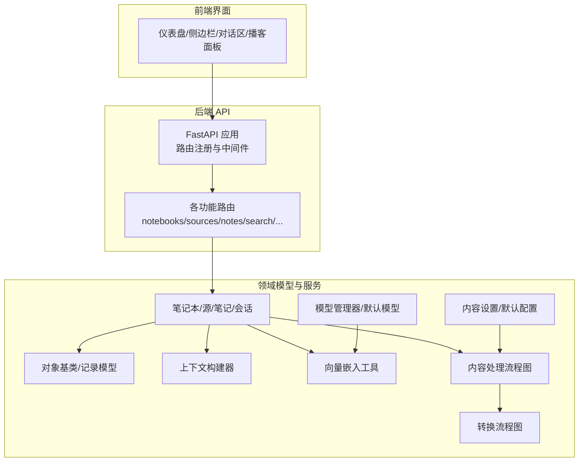
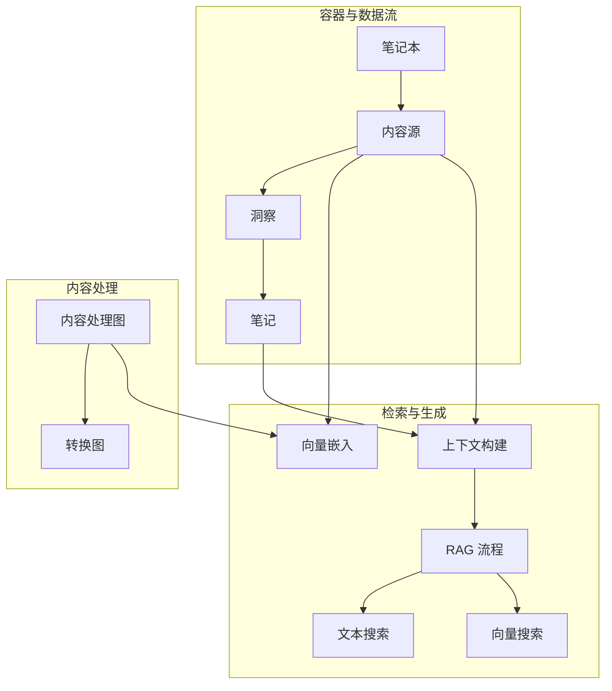
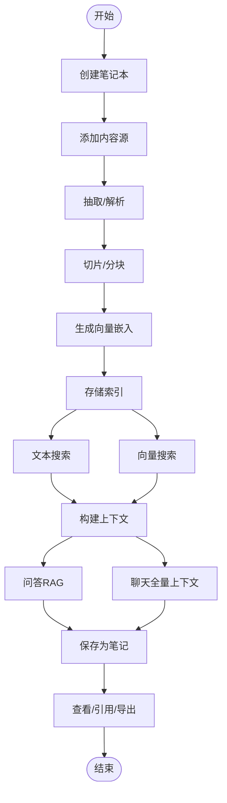
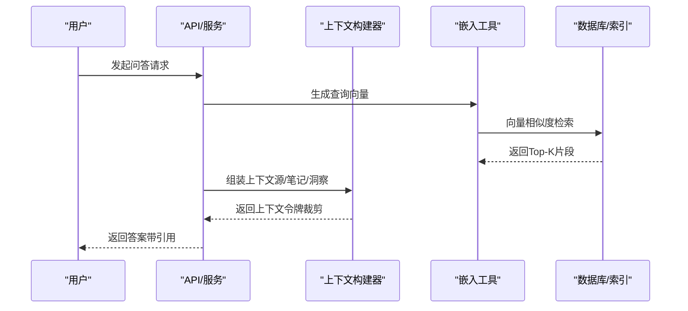
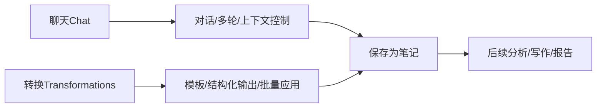
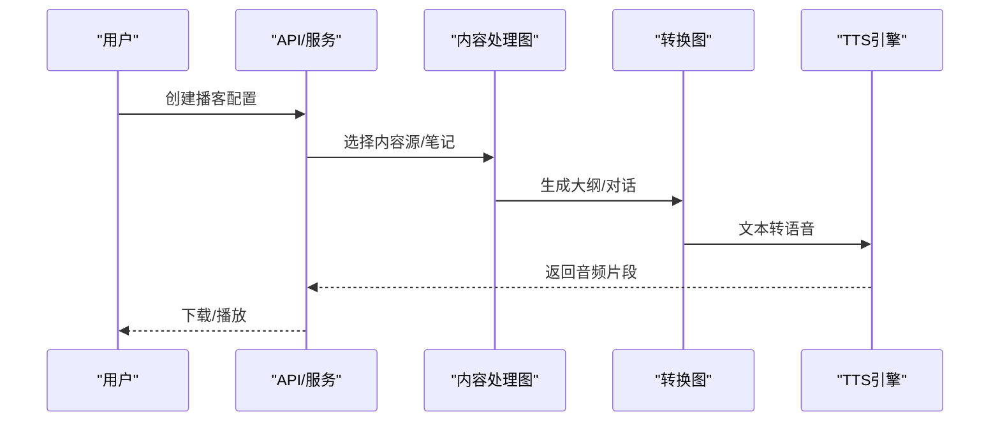
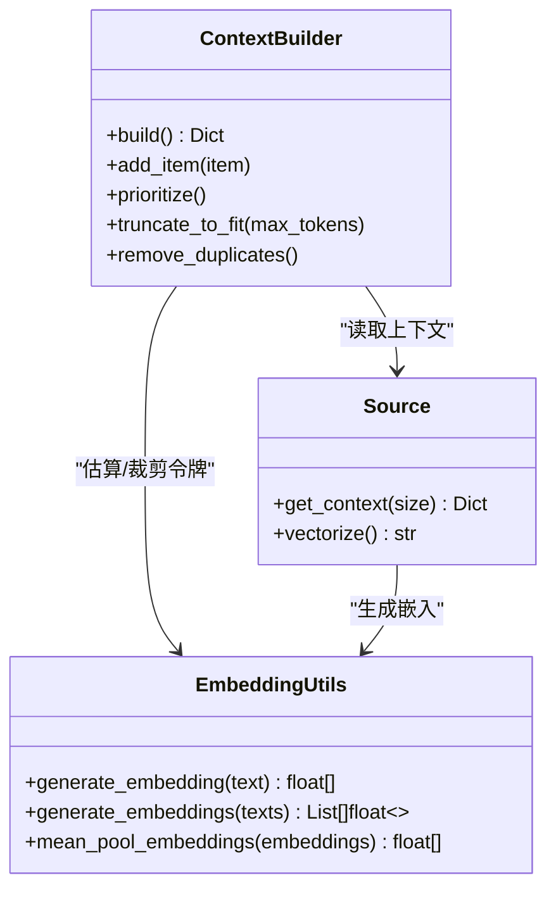
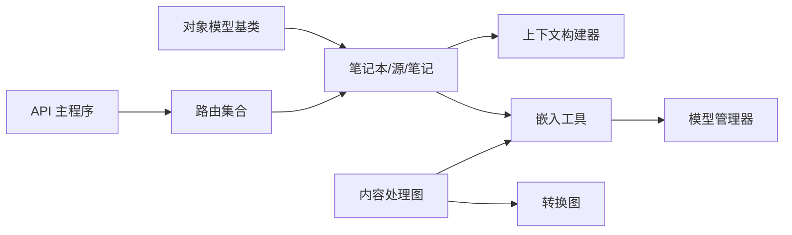

# 核心概念

<cite>
**本文引用的文件**
- [docs/2-CORE-CONCEPTS/index.md](file://docs/2-CORE-CONCEPTS/index.md)
- [docs/2-CORE-CONCEPTS/notebooks-sources-notes.md](file://docs/2-CORE-CONCEPTS/notebooks-sources-notes.md)
- [docs/2-CORE-CONCEPTS/ai-context-rag.md](file://docs/2-CORE-CONCEPTS/ai-context-rag.md)
- [docs/2-CORE-CONCEPTS/chat-vs-transformations.md](file://docs/2-CORE-CONCEPTS/chat-vs-transformations.md)
- [docs/2-CORE-CONCEPTS/podcasts-explained.md](file://docs/2-CORE-CONCEPTS/podcasts-explained.md)
- [open_notebook/domain/notebook.py](file://open_notebook/domain/notebook.py)
- [open_notebook/domain/content_settings.py](file://open_notebook/domain/content_settings.py)
- [open_notebook/utils/context_builder.py](file://open_notebook/utils/context_builder.py)
- [open_notebook/utils/embedding.py](file://open_notebook/utils/embedding.py)
- [open_notebook/graphs/source.py](file://open_notebook/graphs/source.py)
- [open_notebook/graphs/transformation.py](file://open_notebook/graphs/transformation.py)
- [open_notebook/domain/base.py](file://open_notebook/domain/base.py)
- [open_notebook/ai/models.py](file://open_notebook/ai/models.py)
- [api/main.py](file://api/main.py)
- [api/models.py](file://api/models.py)
</cite>

## 目录
1. [引言](#引言)
2. [项目结构](#项目结构)
3. [核心组件](#核心组件)
4. [架构总览](#架构总览)
5. [详细组件分析](#详细组件分析)
6. [依赖关系分析](#依赖关系分析)
7. [性能考量](#性能考量)
8. [故障排查指南](#故障排查指南)
9. [结论](#结论)
10. [附录](#附录)

## 引言
本篇“核心概念”文档面向首次接触或希望系统理解 Open Notebook 的用户，聚焦于以下目标：
- 明确研究笔记本、内容源、笔记、播客等核心实体的边界与职责
- 深入解释检索增强生成（RAG）的工作原理及其在系统中的落地方式
- 阐述 AI 上下文构建、向量嵌入、智能搜索等关键技术
- 区分“内容转换（Transformations）”与“AI 聊天（Chat）”的应用场景与差异
- 提供概念图与使用示例，帮助建立对系统工作原理的整体认知

## 项目结构
Open Notebook 将“容器-输入-输出”的三层模型贯穿到前端界面、后端 API、服务层与工具模块中：
- 容器层：笔记本（Notebook）
- 输入层：内容源（Source，含上传、链接、文本等）
- 输出层：笔记（Note）、洞察（SourceInsight）、播客（Podcast）

**图表来源**
- [api/main.py](file://api/main.py#L157-L180)
- [open_notebook/domain/base.py](file://open_notebook/domain/base.py#L31-L197)
- [open_notebook/domain/notebook.py](file://open_notebook/domain/notebook.py#L16-L679)
- [open_notebook/utils/context_builder.py](file://open_notebook/utils/context_builder.py#L59-L496)
- [open_notebook/utils/embedding.py](file://open_notebook/utils/embedding.py#L14-L208)
- [open_notebook/graphs/source.py](file://open_notebook/graphs/source.py#L19-L168)
- [open_notebook/graphs/transformation.py](file://open_notebook/graphs/transformation.py#L13-L68)
- [open_notebook/domain/content_settings.py](file://open_notebook/domain/content_settings.py#L8-L26)
- [open_notebook/ai/models.py](file://open_notebook/ai/models.py#L97-L267)

**章节来源**
- [api/main.py](file://api/main.py#L157-L180)
- [open_notebook/domain/base.py](file://open_notebook/domain/base.py#L31-L197)

## 核心组件
- 研究笔记本（Notebook）：项目级容器，承载上下文与范围控制，隔离不同研究主题
- 内容源（Source）：原始输入材料，支持 PDF、URL、音频、视频、纯文本等；不可变，自动索引与嵌入
- 笔记（Note）：加工后的输出，可为手动撰写或 AI 生成；可被引用与分享
- 洞察（SourceInsight）：从源内容中提取的结构化见解，可保存为笔记
- 上下文构建器（ContextBuilder）：统一组装源、笔记、洞察，按优先级与令牌限制裁剪
- 向量嵌入（Embedding）：文本切片、批量嵌入与均值池化，支撑语义检索
- 内容处理流程图（Source Graph）：抽取、保存、可选嵌入、可选转换
- 转换流程图（Transformation Graph）：模板化提示，结构化提取
- 模型管理（ModelManager）：统一加载语言模型、嵌入模型、语音模型

**章节来源**
- [open_notebook/domain/notebook.py](file://open_notebook/domain/notebook.py#L16-L679)
- [open_notebook/utils/context_builder.py](file://open_notebook/utils/context_builder.py#L59-L496)
- [open_notebook/utils/embedding.py](file://open_notebook/utils/embedding.py#L14-L208)
- [open_notebook/graphs/source.py](file://open_notebook/graphs/source.py#L19-L168)
- [open_notebook/graphs/transformation.py](file://open_notebook/graphs/transformation.py#L13-L68)
- [open_notebook/ai/models.py](file://open_notebook/ai/models.py#L97-L267)

## 架构总览
Open Notebook 的“容器-输入-输出”模型与“检索增强生成”能力共同构成系统的核心心智模型。

**图表来源**
- [docs/2-CORE-CONCEPTS/notebooks-sources-notes.md](file://docs/2-CORE-CONCEPTS/notebooks-sources-notes.md#L175-L201)
- [docs/2-CORE-CONCEPTS/ai-context-rag.md](file://docs/2-CORE-CONCEPTS/ai-context-rag.md#L40-L146)
- [open_notebook/utils/context_builder.py](file://open_notebook/utils/context_builder.py#L105-L141)
- [open_notebook/utils/embedding.py](file://open_notebook/utils/embedding.py#L143-L208)
- [open_notebook/graphs/source.py](file://open_notebook/graphs/source.py#L19-L168)
- [open_notebook/graphs/transformation.py](file://open_notebook/graphs/transformation.py#L13-L68)

## 详细组件分析

### 1) 研究笔记本、内容源、笔记的关系与生命周期
- 笔记本是研究容器，提供上下文边界与隔离性；源属于且仅属于一个笔记本；笔记在笔记本内引用源
- 源的生命周期：添加 → 抽取/切片 → 嵌入 → 存储；不可变
- 笔记的生命周期：创建/捕获 → 可编辑/删除；可引用源并生成审计线索

**图表来源**
- [docs/2-CORE-CONCEPTS/notebooks-sources-notes.md](file://docs/2-CORE-CONCEPTS/notebooks-sources-notes.md#L84-L127)
- [open_notebook/domain/notebook.py](file://open_notebook/domain/notebook.py#L428-L456)
- [open_notebook/utils/context_builder.py](file://open_notebook/utils/context_builder.py#L105-L141)

**章节来源**
- [docs/2-CORE-CONCEPTS/notebooks-sources-notes.md](file://docs/2-CORE-CONCEPTS/notebooks-sources-notes.md#L29-L285)
- [open_notebook/domain/notebook.py](file://open_notebook/domain/notebook.py#L29-L226)

### 2) AI 上下文构建与检索增强生成（RAG）
- 全量上下文（聊天）：由用户显式选择源与上下文级别（完整/摘要/不入），一次性发送给大模型
- 自动检索（问答）：问题经嵌入向量化，相似度匹配最相关片段，仅发送检索结果给模型合成答案
- 搜索模式：关键词（BM25）与语义（向量）双通道，满足精确查找与概念发现

**图表来源**
- [docs/2-CORE-CONCEPTS/ai-context-rag.md](file://docs/2-CORE-CONCEPTS/ai-context-rag.md#L80-L146)
- [open_notebook/utils/context_builder.py](file://open_notebook/utils/context_builder.py#L105-L141)
- [open_notebook/utils/embedding.py](file://open_notebook/utils/embedding.py#L143-L208)
- [open_notebook/domain/notebook.py](file://open_notebook/domain/notebook.py#L628-L679)

**章节来源**
- [docs/2-CORE-CONCEPTS/ai-context-rag.md](file://docs/2-CORE-CONCEPTS/ai-context-rag.md#L148-L347)

### 3) 内容转换（Transformations）与 AI 聊天（Chat）的区别
- 聊天：交互式探索，上下文可控，适合深入讨论与多轮对话
- 转换：模板化结构化提取，对单个源重复应用，适合批量知识抽取与标准化输出
- 两者均可保存为笔记，便于后续组织与复用

**图表来源**
- [docs/2-CORE-CONCEPTS/chat-vs-transformations.md](file://docs/2-CORE-CONCEPTS/chat-vs-transformations.md#L7-L152)
- [open_notebook/graphs/transformation.py](file://open_notebook/graphs/transformation.py#L20-L61)

**章节来源**
- [docs/2-CORE-CONCEPTS/chat-vs-transformations.md](file://docs/2-CORE-CONCEPTS/chat-vs-transformations.md#L1-L354)

### 4) 播客：研究作为音频对话
- 将研究内容转化为多角色、多音色的音频节目，支持本地/云端 TTS，异步生成，降低阻塞
- 通过“演播员档案+剧集配置”，实现风格、时长、受众的定制化

**图表来源**
- [docs/2-CORE-CONCEPTS/podcasts-explained.md](file://docs/2-CORE-CONCEPTS/podcasts-explained.md#L64-L156)
- [open_notebook/graphs/source.py](file://open_notebook/graphs/source.py#L19-L168)
- [open_notebook/graphs/transformation.py](file://open_notebook/graphs/transformation.py#L13-L68)

**章节来源**
- [docs/2-CORE-CONCEPTS/podcasts-explained.md](file://docs/2-CORE-CONCEPTS/podcasts-explained.md#L1-L395)

### 5) 关键技术：上下文构建、向量嵌入与智能搜索
- 上下文构建：支持源/笔记/洞察混合装配，按优先级与令牌上限裁剪，避免超限
- 向量嵌入：长文本自动切片、批量嵌入、均值池化，保证语义一致性
- 智能搜索：关键词与语义双通道，支持最小分数过滤与结果数量控制

**图表来源**
- [open_notebook/utils/context_builder.py](file://open_notebook/utils/context_builder.py#L59-L496)
- [open_notebook/utils/embedding.py](file://open_notebook/utils/embedding.py#L14-L208)
- [open_notebook/domain/notebook.py](file://open_notebook/domain/notebook.py#L361-L456)

**章节来源**
- [open_notebook/utils/context_builder.py](file://open_notebook/utils/context_builder.py#L59-L496)
- [open_notebook/utils/embedding.py](file://open_notebook/utils/embedding.py#L14-L208)
- [open_notebook/domain/notebook.py](file://open_notebook/domain/notebook.py#L628-L679)

### 6) 实际使用示例（概念性）
- 场景一：学术综述
  - 步骤：批量转换（提取方法/结论/局限）→ 聊天（归纳主题）→ 问答（跨文献对比）
- 场景二：产品研究
  - 步骤：问答（识别痛点）→ 聊天（优先级排序）→ 转换（结构化记录）
- 场景三：政策比较
  - 步骤：问答（差异对比）→ 聊天（权衡讨论）→ 导出笔记用于报告

[本节为概念性说明，无需列出具体文件来源]

## 依赖关系分析
- 对象模型（ObjectModel/RecordModel）为所有领域模型提供统一的 CRUD、关系连接与数据库访问
- 上下文构建器依赖领域模型（笔记本/源/笔记）与令牌估算工具
- 向量嵌入工具依赖内容类型切片与模型管理器提供的嵌入模型
- 内容处理与转换流程图串联抽取、嵌入与模板化生成
- API 层负责路由聚合与中间件（认证、CORS、异常处理）

**图表来源**
- [open_notebook/domain/base.py](file://open_notebook/domain/base.py#L31-L329)
- [open_notebook/domain/notebook.py](file://open_notebook/domain/notebook.py#L16-L679)
- [open_notebook/utils/context_builder.py](file://open_notebook/utils/context_builder.py#L59-L496)
- [open_notebook/utils/embedding.py](file://open_notebook/utils/embedding.py#L14-L208)
- [open_notebook/ai/models.py](file://open_notebook/ai/models.py#L97-L267)
- [api/main.py](file://api/main.py#L157-L180)

**章节来源**
- [open_notebook/domain/base.py](file://open_notebook/domain/base.py#L31-L329)
- [open_notebook/ai/models.py](file://open_notebook/ai/models.py#L97-L267)
- [api/main.py](file://api/main.py#L157-L180)

## 性能考量
- 令牌裁剪：上下文构建器根据最大令牌数进行自适应裁剪，避免超限
- 批量嵌入：对多个片段一次性调用嵌入模型，减少往返开销
- 切片与池化：长文本切片后均值池化，兼顾代表性与稳定性
- 异步处理：内容处理与嵌入提交为后台命令，避免阻塞接口
- 搜索优化：关键词与语义双通道，结合最小分数与结果上限，平衡召回与质量

[本节提供通用指导，无需列出具体文件来源]

## 故障排查指南
- 数据库迁移失败：启动时自动执行异步迁移，若失败需检查版本与权限
- CORS 错误：自定义异常处理器确保错误响应包含 CORS 头
- 模型未配置：默认模型缺失会导致推理失败，需在设置中配置
- 嵌入失败：检查嵌入模型可用性与网络连通性，必要时重试或切换模型

**章节来源**
- [api/main.py](file://api/main.py#L47-L96)
- [api/main.py](file://api/main.py#L130-L155)
- [open_notebook/ai/models.py](file://open_notebook/ai/models.py#L177-L264)

## 结论
Open Notebook 以“容器-输入-输出”为核心心智，结合检索增强生成与结构化转换，既保障隐私与可控性，又提供灵活的研究范式。通过上下文构建、向量嵌入与智能搜索，系统实现了“可验证、可审计、可扩展”的 AI 辅助研究体验。

[本节为总结性内容，无需列出具体文件来源]

## 附录
- 快速参考
  - 容器与范围：笔记本隔离、源不可变、笔记可编辑
  - 搜索与检索：关键词与语义双通道，RAG 自动检索
  - 工具选择：聊天适合深入对话，转换适合批量结构化抽取
  - 音频化：播客异步生成，支持本地/云端 TTS

[本节为概览性内容，无需列出具体文件来源]