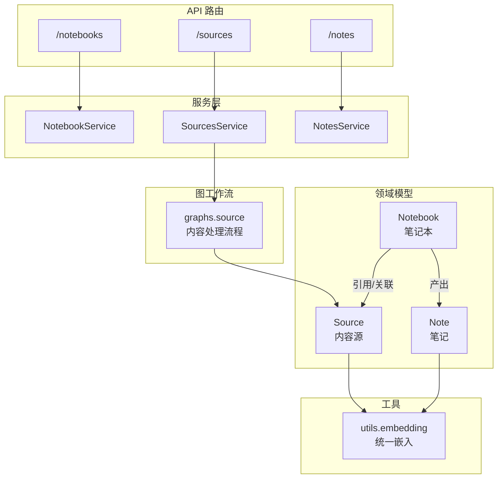
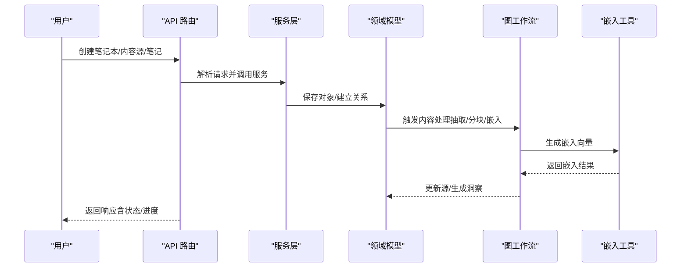
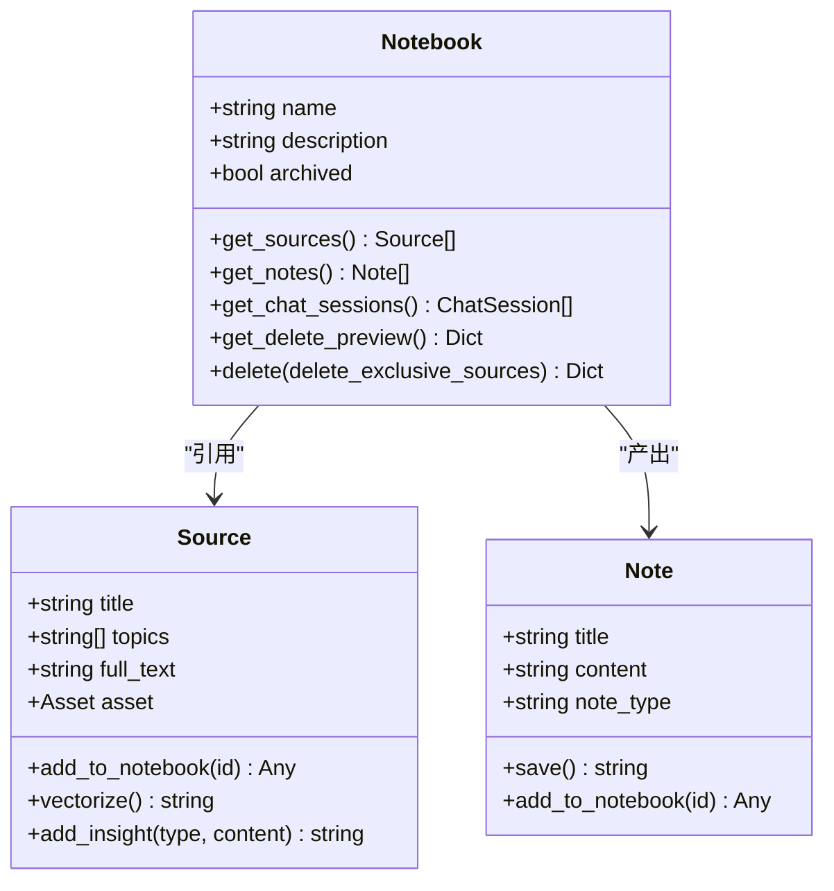
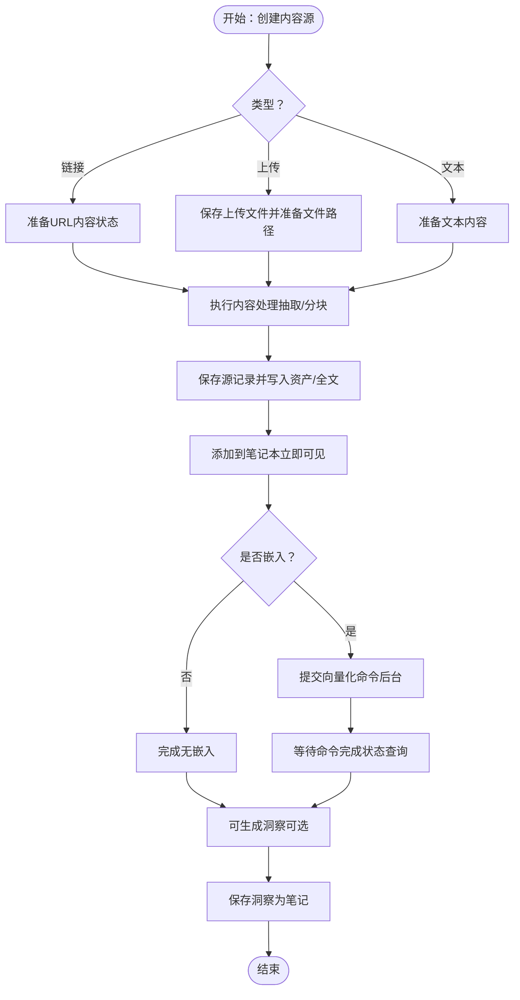
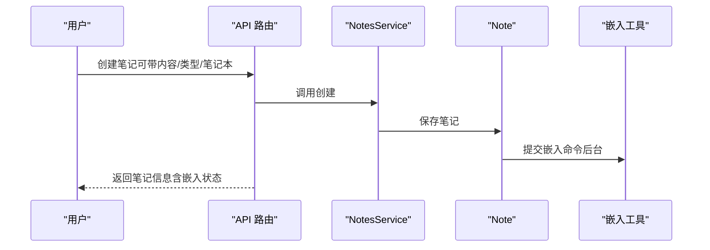
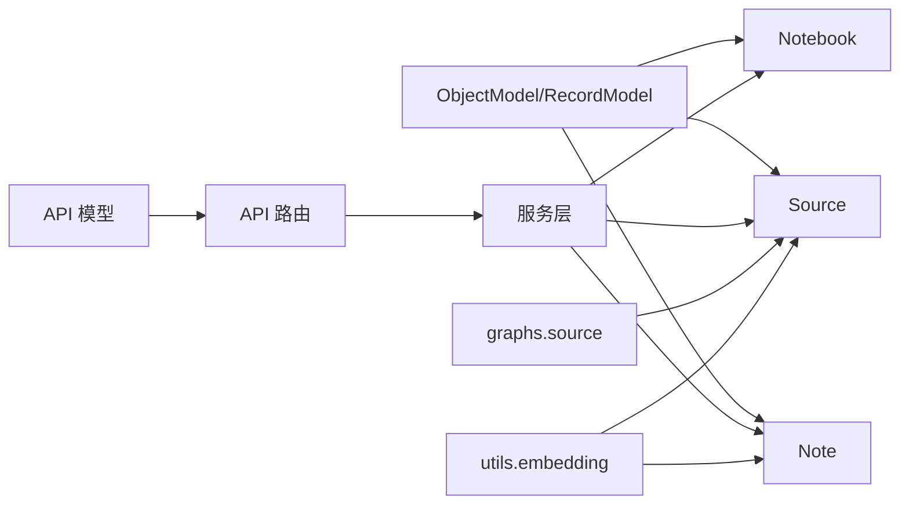

# 笔记本、内容源与笔记

<cite>
**本文引用的文件**
- [open_notebook/domain/notebook.py](file://open_notebook/domain/notebook.py)
- [open_notebook/domain/base.py](file://open_notebook/domain/base.py)
- [open_notebook/domain/content_settings.py](file://open_notebook/domain/content_settings.py)
- [open_notebook/domain/transformation.py](file://open_notebook/domain/transformation.py)
- [api/models.py](file://api/models.py)
- [api/routers/notebooks.py](file://api/routers/notebooks.py)
- [api/routers/sources.py](file://api/routers/sources.py)
- [api/routers/notes.py](file://api/routers/notes.py)
- [api/notebook_service.py](file://api/notebook_service.py)
- [api/sources_service.py](file://api/sources_service.py)
- [api/notes_service.py](file://api/notes_service.py)
- [open_notebook/utils/embedding.py](file://open_notebook/utils/embedding.py)
- [open_notebook/graphs/source.py](file://open_notebook/graphs/source.py)
- [docs/2-CORE-CONCEPTS/notebooks-sources-notes.md](file://docs/2-CORE-CONCEPTS/notebooks-sources-notes.md)
</cite>

## 目录
1. [简介](#简介)
2. [项目结构](#项目结构)
3. [核心组件](#核心组件)
4. [架构总览](#架构总览)
5. [详细组件分析](#详细组件分析)
6. [依赖分析](#依赖分析)
7. [性能考虑](#性能考虑)
8. [故障排查指南](#故障排查指南)
9. [结论](#结论)
10. [附录](#附录)

## 简介
本文件系统性阐述 Open Notebook 的三层容器模型：笔记本（研究容器）、内容源（输入材料）、笔记（输出洞察）。围绕“如何从原始材料（PDF、URL 等）生成最终洞察”的完整数据流，解释三者的关系、属性、行为与生命周期，并给出使用场景与最佳实践，帮助用户高效组织与管理研究内容。

## 项目结构
- 后端领域模型位于 open_notebook/domain，定义了 Notebook、Source、Note 及其关系与行为。
- API 层位于 api/routers，提供 REST 接口；服务层位于 api/*_service.py，封装调用。
- 图计算工作流位于 open_notebook/graphs，负责内容提取、分块、嵌入、洞察生成等。
- 工具模块 open_notebook/utils 提供统一嵌入生成能力。
- 文档 docs/2-CORE-CONCEPTS/notebooks-sources-notes.md 提供高层概念说明。

图表来源
- [open_notebook/domain/notebook.py](file://open_notebook/domain/notebook.py#L16-L286)
- [api/routers/notebooks.py](file://api/routers/notebooks.py#L20-L328)
- [api/routers/sources.py](file://api/routers/sources.py#L280-L552)
- [api/routers/notes.py](file://api/routers/notes.py#L13-L188)
- [open_notebook/graphs/source.py](file://open_notebook/graphs/source.py#L19-L168)
- [open_notebook/utils/embedding.py](file://open_notebook/utils/embedding.py#L143-L208)

章节来源
- [open_notebook/domain/notebook.py](file://open_notebook/domain/notebook.py#L16-L286)
- [api/routers/notebooks.py](file://api/routers/notebooks.py#L20-L328)
- [api/routers/sources.py](file://api/routers/sources.py#L280-L552)
- [api/routers/notes.py](file://api/routers/notes.py#L13-L188)
- [open_notebook/graphs/source.py](file://open_notebook/graphs/source.py#L19-L168)
- [open_notebook/utils/embedding.py](file://open_notebook/utils/embedding.py#L143-L208)

## 核心组件
- Notebook（笔记本）
  - 角色：研究容器与上下文边界，隔离不同主题的研究项目。
  - 关键属性：名称、描述、归档标记。
  - 关键行为：关联内容源与笔记、删除预览与级联删除、查询聊天会话。
- Source（内容源）
  - 角色：不可变的输入材料，包含资产信息、标题、话题、全文文本、命令引用等。
  - 关键行为：状态查询、进度获取、上下文构建、嵌入向量化、洞察生成、添加到笔记本、删除清理。
- Note（笔记）
  - 角色：可编辑的输出产物，可为手动或 AI 生成，支持嵌入。
  - 关键行为：保存并提交异步嵌入、添加到笔记本、上下文构建。
- ContentSettings（内容设置）
  - 控制默认内容处理引擎、嵌入策略、自动删除上传文件、YouTube 语言偏好等。
- Transformation（转换模板）
  - 定义可复用的提示词与应用策略，驱动从源内容生成洞察。

章节来源
- [open_notebook/domain/notebook.py](file://open_notebook/domain/notebook.py#L16-L286)
- [open_notebook/domain/content_settings.py](file://open_notebook/domain/content_settings.py#L8-L26)
- [open_notebook/domain/transformation.py](file://open_notebook/domain/transformation.py#L8-L22)

## 架构总览
Open Notebook 将“研究容器-输入材料-输出洞察”三者解耦：
- Notebook 作为边界与上下文容器，隔离不同研究项目。
- Source 作为不可变证据，经过抽取、分块、嵌入后入库，支持语义检索。
- Note 作为可演化的知识产物，可引用 Source 并参与检索。
- API 路由负责 CRUD 与状态查询；服务层封装调用；图工作流负责内容处理；工具模块提供统一嵌入。

图表来源
- [api/routers/notebooks.py](file://api/routers/notebooks.py#L62-L88)
- [api/routers/sources.py](file://api/routers/sources.py#L280-L552)
- [api/routers/notes.py](file://api/routers/notes.py#L49-L106)
- [open_notebook/graphs/source.py](file://open_notebook/graphs/source.py#L34-L107)
- [open_notebook/utils/embedding.py](file://open_notebook/utils/embedding.py#L143-L208)

## 详细组件分析

### 组件一：Notebook（笔记本）
- 设计要点
  - 每个笔记本是独立的研究环境，拥有自己的上下文与资源集合。
  - 支持查询绑定的 Source 与 Note，以及聊天会话。
  - 删除时提供预览：统计将被删除的笔记数、仅属于该笔记本的源数、与其他笔记本共享的源数。
- 关键方法与行为
  - 获取绑定的 Source/Note/聊天会话
  - 删除预览与级联删除（可选删除独享源）
- 生命周期
  - 创建 → 添加 Source/Note → 使用/检索 → 删除（含预览）

图表来源
- [open_notebook/domain/notebook.py](file://open_notebook/domain/notebook.py#L16-L286)

章节来源
- [open_notebook/domain/notebook.py](file://open_notebook/domain/notebook.py#L16-L286)
- [api/routers/notebooks.py](file://api/routers/notebooks.py#L20-L328)

### 组件二：Source（内容源）
- 设计要点
  - 不可变输入材料，支持多种类型（链接、上传、文本），自动抽取、分块、嵌入。
  - 支持异步处理，返回命令 ID 与状态进度。
  - 可生成洞察（SourceInsight），并可直接保存为 Note。
- 关键方法与行为
  - 状态查询与进度获取
  - 上下文构建（短/长）
  - 嵌入向量化（提交后台作业）
  - 洞察生成（提交后台命令）
  - 添加到笔记本、删除清理（含文件与嵌入/洞察清理）
- 生命周期
  - 创建（可同步/异步）→ 处理完成（抽取/分块/嵌入）→ 生成洞察 → 可保存为笔记

图表来源
- [open_notebook/graphs/source.py](file://open_notebook/graphs/source.py#L34-L107)
- [open_notebook/utils/embedding.py](file://open_notebook/utils/embedding.py#L143-L208)
- [api/routers/sources.py](file://api/routers/sources.py#L280-L552)

章节来源
- [open_notebook/domain/notebook.py](file://open_notebook/domain/notebook.py#L288-L553)
- [open_notebook/graphs/source.py](file://open_notebook/graphs/source.py#L34-L107)
- [open_notebook/utils/embedding.py](file://open_notebook/utils/embedding.py#L143-L208)
- [api/routers/sources.py](file://api/routers/sources.py#L280-L552)

### 组件三：Note（笔记）
- 设计要点
  - 可手动或 AI 生成，支持类型标注（人类/AI）。
  - 保存后异步提交嵌入，便于检索。
  - 可添加到笔记本，成为该笔记本的知识产物。
- 关键方法与行为
  - 保存并提交嵌入命令
  - 添加到笔记本
  - 上下文构建（短/长）
- 生命周期
  - 创建 → 编辑/完善 → 添加到笔记本 → 搜索/引用

图表来源
- [api/routers/notes.py](file://api/routers/notes.py#L49-L106)
- [open_notebook/domain/notebook.py](file://open_notebook/domain/notebook.py#L555-L609)
- [open_notebook/utils/embedding.py](file://open_notebook/utils/embedding.py#L143-L208)

章节来源
- [open_notebook/domain/notebook.py](file://open_notebook/domain/notebook.py#L555-L609)
- [api/routers/notes.py](file://api/routers/notes.py#L49-L106)

### 组件四：内容设置与转换模板
- 内容设置（ContentSettings）
  - 默认内容处理引擎（文档/URL）、默认嵌入选项、自动删除上传文件、YouTube 语言偏好。
- 转换模板（Transformation）
  - 名称、标题、描述、提示词、默认应用开关。
- 作用
  - 统一控制内容处理策略与提示词复用，支撑从源内容生成结构化洞察。

章节来源
- [open_notebook/domain/content_settings.py](file://open_notebook/domain/content_settings.py#L8-L26)
- [open_notebook/domain/transformation.py](file://open_notebook/domain/transformation.py#L8-L22)

## 依赖分析
- 领域模型基类
  - ObjectModel 提供通用的持久化、关系建立、删除与查询能力；RecordModel 提供单例记录读取与更新。
- API 与服务层
  - NotebookService/SourcesService/NotesService 封装 API 客户端调用，返回领域对象。
- 图工作流
  - graphs.source 将内容处理、分块、嵌入、洞察生成串联为状态图，Source 通过命令提交触发。
- 工具模块
  - utils.embedding 提供统一嵌入生成与均值池化，支持长文本分块后聚合。

图表来源
- [open_notebook/domain/base.py](file://open_notebook/domain/base.py#L31-L183)
- [api/models.py](file://api/models.py#L6-L685)
- [api/routers/notebooks.py](file://api/routers/notebooks.py#L20-L328)
- [api/routers/sources.py](file://api/routers/sources.py#L280-L552)
- [api/routers/notes.py](file://api/routers/notes.py#L13-L188)
- [open_notebook/graphs/source.py](file://open_notebook/graphs/source.py#L19-L168)
- [open_notebook/utils/embedding.py](file://open_notebook/utils/embedding.py#L143-L208)

章节来源
- [open_notebook/domain/base.py](file://open_notebook/domain/base.py#L31-L183)
- [api/models.py](file://api/models.py#L6-L685)
- [open_notebook/graphs/source.py](file://open_notebook/graphs/source.py#L19-L168)
- [open_notebook/utils/embedding.py](file://open_notebook/utils/embedding.py#L143-L208)

## 性能考虑
- 异步处理
  - Source 创建支持异步模式，避免阻塞请求线程；通过命令 ID 查询状态与进度。
- 批量嵌入
  - 对长文本采用分块与均值池化，减少高维向量噪声，提升检索质量与速度。
- 数据库查询优化
  - Notebook 查询时一次性统计 Source/Note 数量，减少多次往返。
- 文件处理
  - 上传文件命名去重与安全路径校验，防止路径穿越与重复覆盖。

章节来源
- [api/routers/sources.py](file://api/routers/sources.py#L352-L426)
- [open_notebook/utils/embedding.py](file://open_notebook/utils/embedding.py#L185-L207)
- [api/routers/notebooks.py](file://api/routers/notebooks.py#L27-L54)

## 故障排查指南
- 源处理失败
  - 检查命令状态与错误信息；必要时重试或查看处理日志。
- 嵌入失败
  - 确认嵌入模型配置；检查文本长度与分块策略；查看均值池化是否成功。
- 删除预览不准确
  - 确认 Source 是否被其他笔记本引用；共享源不会被删除，仅取消关联。
- 笔记本删除异常
  - 查看删除返回统计（已删笔记、已删独享源、已取消关联源）；确认权限与事务一致性。

章节来源
- [api/routers/sources.py](file://api/routers/sources.py#L691-L750)
- [open_notebook/domain/notebook.py](file://open_notebook/domain/notebook.py#L88-L136)
- [api/routers/notebooks.py](file://api/routers/notebooks.py#L293-L328)

## 结论
Open Notebook 的三层容器模型以“不可变证据（Source）—可演化知识（Note）—研究边界（Notebook）”为核心，通过异步处理与统一嵌入工具实现高效的内容加工与检索。配合明确的上下文控制与清晰的生命周期管理，用户可以稳定地组织复杂研究项目并持续沉淀高质量洞察。

## 附录
- 使用场景与最佳实践
  - 一个笔记本对应一个研究主题，避免跨笔记本引用；将 Source 作为证据保留，Note 用于沉淀观点与结论。
  - 对大文档优先选择异步处理与嵌入，缩短前端等待时间。
  - 利用转换模板标准化洞察生成，确保结构一致与可复用。
  - 定期重建嵌入以适配模型变更或内容增量。

章节来源
- [docs/2-CORE-CONCEPTS/notebooks-sources-notes.md](file://docs/2-CORE-CONCEPTS/notebooks-sources-notes.md#L1-L285)