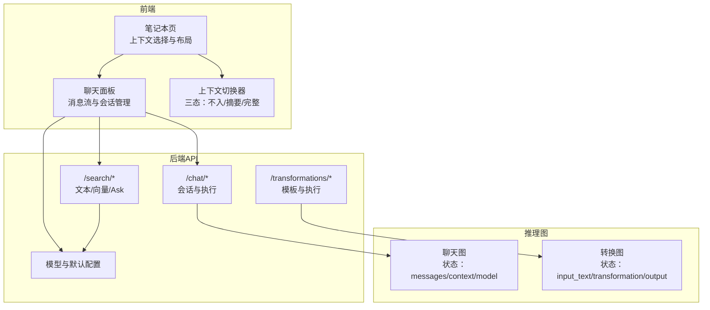
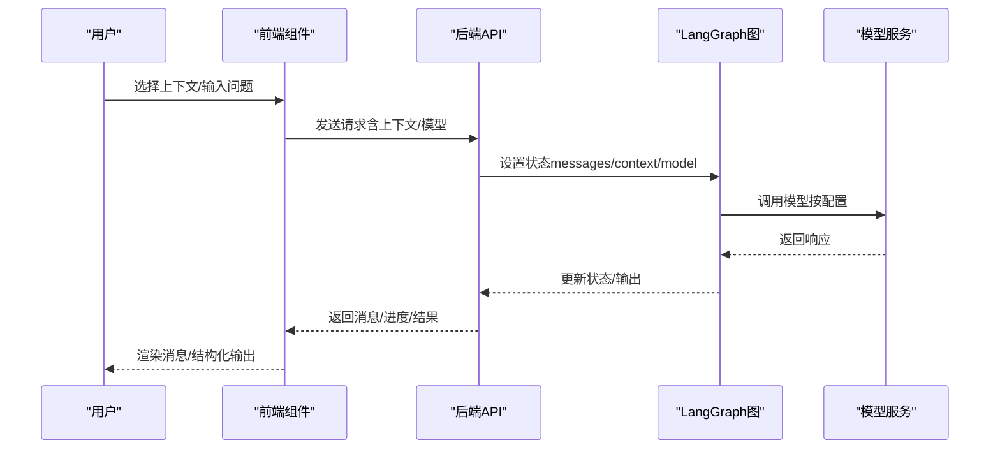
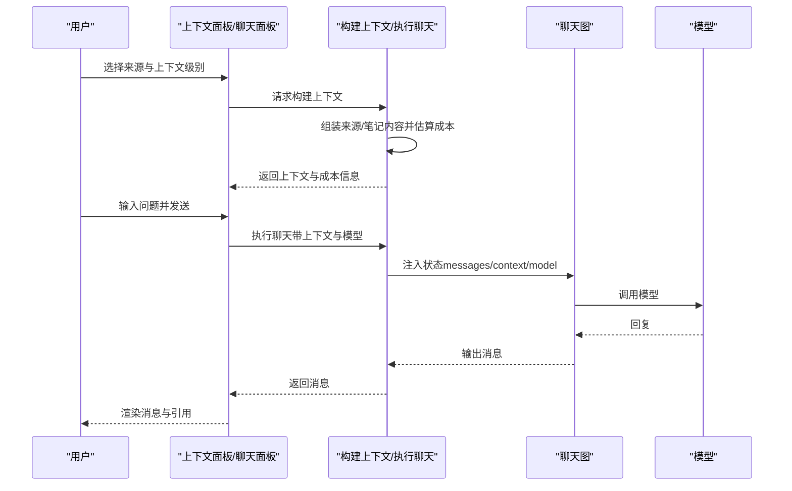
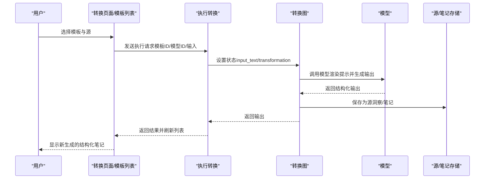
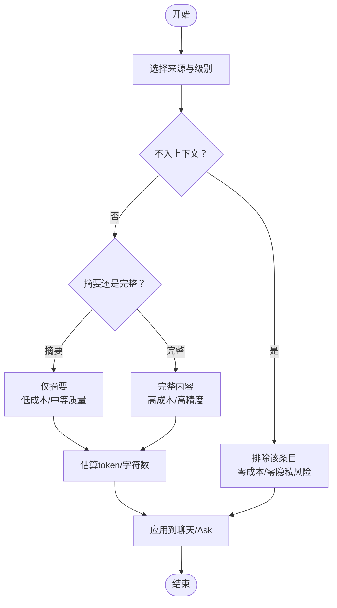
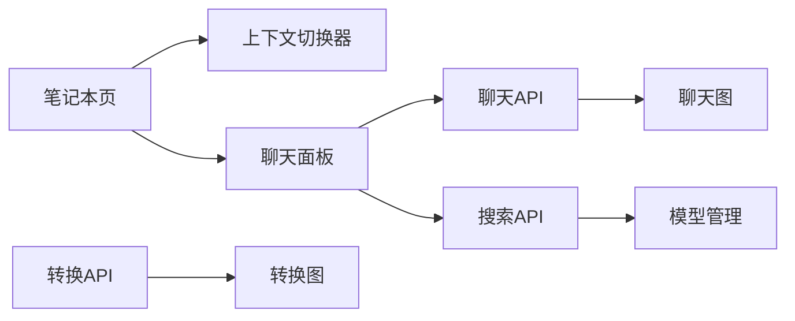

# 聊天与内容转换

<cite>
**本文引用的文件**
- [docs/2-CORE-CONCEPTS/chat-vs-transformations.md](file://docs/2-CORE-CONCEPTS/chat-vs-transformations.md)
- [docs/3-USER-GUIDE/chat-effectively.md](file://docs/3-USER-GUIDE/chat-effectively.md)
- [docs/3-USER-GUIDE/transformations.md](file://docs/3-USER-GUIDE/transformations.md)
- [api/routers/chat.py](file://api/routers/chat.py)
- [api/routers/transformations.py](file://api/routers/transformations.py)
- [api/routers/search.py](file://api/routers/search.py)
- [api/models.py](file://api/models.py)
- [open_notebook/graphs/chat.py](file://open_notebook/graphs/chat.py)
- [open_notebook/graphs/transformation.py](file://open_notebook/graphs/transformation.py)
- [frontend/src/app/(dashboard)/notebooks/[id]/page.tsx](file://frontend/src/app/(dashboard)/notebooks/[id]/page.tsx)
- [frontend/src/components/common/ContextToggle.tsx](file://frontend/src/components/common/ContextToggle.tsx)
- [frontend/src/components/source/ChatPanel.tsx](file://frontend/src/components/source/ChatPanel.tsx)
</cite>

## 目录
1. [引言](#引言)
2. [项目结构](#项目结构)
3. [核心组件](#核心组件)
4. [架构总览](#架构总览)
5. [详细组件分析](#详细组件分析)
6. [依赖关系分析](#依赖关系分析)
7. [性能考量](#性能考量)
8. [故障排查指南](#故障排查指南)
9. [结论](#结论)
10. [附录](#附录)

## 引言
本文件面向Open Notebook的使用者与开发者，系统化对比“聊天”与“内容转换”两种交互模式，解释其设计动机、适用场景、优势与局限，并深入说明上下文管理控制面板的三种隐私级别（不入上下文、仅摘要、完整内容）如何影响成本、隐私与质量。同时给出实用的使用案例与决策建议，帮助你在不同研究阶段选择最合适的交互方式。

## 项目结构
Open Notebook在后端通过API路由分别暴露聊天、内容转换与搜索能力；在前端通过页面与组件实现上下文选择、模型切换与消息展示。核心交互流程由LangGraph状态图驱动，确保可追踪、可扩展。

图表来源
- [frontend/src/app/(dashboard)/notebooks/[id]/page.tsx](file://frontend/src/app/(dashboard)/notebooks/[id]/page.tsx#L21-L97)
- [frontend/src/components/common/ContextToggle.tsx](file://frontend/src/components/common/ContextToggle.tsx#L22-L60)
- [frontend/src/components/source/ChatPanel.tsx](file://frontend/src/components/source/ChatPanel.tsx#L59-L77)
- [api/routers/chat.py](file://api/routers/chat.py#L96-L134)
- [api/routers/transformations.py](file://api/routers/transformations.py#L23-L46)
- [api/routers/search.py](file://api/routers/search.py#L17-L59)
- [open_notebook/graphs/chat.py](file://open_notebook/graphs/chat.py#L19-L25)
- [open_notebook/graphs/transformation.py](file://open_notebook/graphs/transformation.py#L13-L18)

章节来源
- [frontend/src/app/(dashboard)/notebooks/[id]/page.tsx](file://frontend/src/app/(dashboard)/notebooks/[id]/page.tsx#L28-L97)
- [frontend/src/components/common/ContextToggle.tsx](file://frontend/src/components/common/ContextToggle.tsx#L22-L60)
- [frontend/src/components/source/ChatPanel.tsx](file://frontend/src/components/source/ChatPanel.tsx#L59-L77)
- [api/routers/chat.py](file://api/routers/chat.py#L96-L134)
- [api/routers/transformations.py](file://api/routers/transformations.py#L23-L46)
- [api/routers/search.py](file://api/routers/search.py#L17-L59)
- [open_notebook/graphs/chat.py](file://open_notebook/graphs/chat.py#L19-L25)
- [open_notebook/graphs/transformation.py](file://open_notebook/graphs/transformation.py#L13-L18)

## 核心组件
- 聊天模式（Chat）
  - 特性：对话式探索，手动选择上下文，支持多轮追问，可调整上下文级别。
  - 关键点：上下文控制权在用户；适合探索性问题、需要逐步深入的分析。
- 内容转换模式（Transformations）
  - 特性：模板化批量处理，对单个源重复应用同一提示，生成结构化笔记。
  - 关键点：一次定义、多次应用；适合构建知识库、一致性输出。
- 上下文管理控制面板
  - 三态：不入上下文、仅摘要、完整内容；用于平衡隐私、成本与质量。
- 模型选择与成本
  - 不同模式对模型速度/能力偏好不同；可通过模型覆盖或默认模型进行优化。

章节来源
- [docs/2-CORE-CONCEPTS/chat-vs-transformations.md](file://docs/2-CORE-CONCEPTS/chat-vs-transformations.md#L9-L48)
- [docs/3-USER-GUIDE/transformations.md](file://docs/3-USER-GUIDE/transformations.md#L7-L16)
- [docs/3-USER-GUIDE/chat-effectively.md](file://docs/3-USER-GUIDE/chat-effectively.md#L24-L67)
- [api/routers/chat.py](file://api/routers/chat.py#L411-L516)
- [api/routers/transformations.py](file://api/routers/transformations.py#L81-L116)

## 架构总览
Open Notebook将“上下文选择—推理—输出”解耦为清晰的模块链路：前端负责交互与上下文可视化，API负责编排与校验，LangGraph负责状态机与调用模型，最终返回消息或结构化结果。

图表来源
- [frontend/src/components/source/ChatPanel.tsx](file://frontend/src/components/source/ChatPanel.tsx#L104-L120)
- [api/routers/chat.py](file://api/routers/chat.py#L330-L408)
- [open_notebook/graphs/chat.py](file://open_notebook/graphs/chat.py#L27-L80)
- [open_notebook/graphs/transformation.py](file://open_notebook/graphs/transformation.py#L20-L60)

章节来源
- [frontend/src/components/source/ChatPanel.tsx](file://frontend/src/components/source/ChatPanel.tsx#L59-L77)
- [api/routers/chat.py](file://api/routers/chat.py#L330-L408)
- [open_notebook/graphs/chat.py](file://open_notebook/graphs/chat.py#L27-L80)
- [open_notebook/graphs/transformation.py](file://open_notebook/graphs/transformation.py#L20-L60)

## 详细组件分析

### 聊天模式（Chat）
- 设计目标
  - 提供可控的检索增强对话体验，允许用户精确决定哪些内容进入上下文，从而兼顾隐私、成本与质量。
- 关键流程
  - 会话管理：创建/读取/更新/删除会话，持久化消息历史。
  - 执行聊天：将用户消息与上下文注入LangGraph状态，调用模型生成回复。
  - 上下文构建：根据用户选择的“不入上下文/仅摘要/完整内容”，拼装来源与笔记内容，并估算token/字符数。
- 上下文控制面板
  - 三态切换：不入上下文、仅摘要、完整内容；支持来源与笔记分别设置。
  - 可视化指标：显示包含的来源数量、笔记数量及估算token/字符数，便于成本与隐私控制。
- 适用场景
  - 探索性研究、多轮追问、需要逐步聚焦与验证的分析。
- 局限性
  - 需要用户主动选择上下文；复杂问题可能需要先用“Ask”获得全局视角再用“Chat”深入。

图表来源
- [frontend/src/app/(dashboard)/notebooks/[id]/page.tsx](file://frontend/src/app/(dashboard)/notebooks/[id]/page.tsx#L56-L97)
- [frontend/src/components/common/ContextToggle.tsx](file://frontend/src/components/common/ContextToggle.tsx#L22-L60)
- [api/routers/chat.py](file://api/routers/chat.py#L411-L516)
- [api/routers/chat.py](file://api/routers/chat.py#L330-L408)
- [open_notebook/graphs/chat.py](file://open_notebook/graphs/chat.py#L27-L80)

章节来源
- [api/routers/chat.py](file://api/routers/chat.py#L96-L134)
- [api/routers/chat.py](file://api/routers/chat.py#L137-L173)
- [api/routers/chat.py](file://api/routers/chat.py#L175-L247)
- [api/routers/chat.py](file://api/routers/chat.py#L330-L408)
- [api/routers/chat.py](file://api/routers/chat.py#L411-L516)
- [open_notebook/graphs/chat.py](file://open_notebook/graphs/chat.py#L19-L25)
- [open_notebook/graphs/chat.py](file://open_notebook/graphs/chat.py#L27-L80)
- [frontend/src/app/(dashboard)/notebooks/[id]/page.tsx](file://frontend/src/app/(dashboard)/notebooks/[id]/page.tsx#L56-L97)
- [frontend/src/components/common/ContextToggle.tsx](file://frontend/src/components/common/ContextToggle.tsx#L22-L60)
- [frontend/src/components/source/ChatPanel.tsx](file://frontend/src/components/source/ChatPanel.tsx#L126-L164)

### 内容转换模式（Transformations）
- 设计目标
  - 将重复性的信息抽取任务模板化，实现“一次定义、批量应用”，提升一致性与效率。
- 关键流程
  - 模板管理：创建/编辑/删除自定义模板或使用内置模板。
  - 单源转换：对单个源应用模板，生成结构化笔记并保存到源洞察。
  - 批量转换：对多个源并行应用同一模板，产出多条结构化笔记。
- 适用场景
  - 文献综述、会议纪要、竞品分析等需要统一格式的批量信息抽取。
- 局限性
  - 当前为逐源处理；复杂跨源比较更适合先用“Ask”获得整体视角，再用“Chat”深入讨论。

图表来源
- [frontend/src/app/(dashboard)/transformations/page.tsx](file://frontend/src/app/(dashboard)/transformations/page.tsx#L15-L80)
- [api/routers/transformations.py](file://api/routers/transformations.py#L81-L116)
- [open_notebook/graphs/transformation.py](file://open_notebook/graphs/transformation.py#L20-L60)

章节来源
- [api/routers/transformations.py](file://api/routers/transformations.py#L23-L46)
- [api/routers/transformations.py](file://api/routers/transformations.py#L81-L116)
- [api/routers/transformations.py](file://api/routers/transformations.py#L157-L183)
- [open_notebook/graphs/transformation.py](file://open_notebook/graphs/transformation.py#L13-L18)
- [open_notebook/graphs/transformation.py](file://open_notebook/graphs/transformation.py#L20-L60)
- [frontend/src/app/(dashboard)/transformations/page.tsx](file://frontend/src/app/(dashboard)/transformations/page.tsx#L15-L80)

### 上下文管理控制面板（隐私级别与策略）
- 三种隐私级别
  - 不入上下文：完全排除该来源/笔记，零token、零隐私风险。
  - 仅摘要：发送AI生成的摘要（非全文），成本低、隐私好，但精度下降。
  - 完整内容：发送全文，精度高、引用准，成本较高。
- 策略建议
  - 最小化策略：仅主焦点源完整内容，其余排除。
  - 全量策略：预算充足时全部完整内容。
  - 分层策略：主源完整、次源摘要、背景排除，兼顾成本与质量。
  - 隐私优先：敏感材料排除，公开材料完整。
- 成本估算
  - 前端/后端均提供token与字符数估算，便于预算控制与决策。

图表来源
- [docs/3-USER-GUIDE/chat-effectively.md](file://docs/3-USER-GUIDE/chat-effectively.md#L28-L67)
- [docs/3-USER-GUIDE/chat-effectively.md](file://docs/3-USER-GUIDE/chat-effectively.md#L95-L143)
- [api/routers/chat.py](file://api/routers/chat.py#L411-L516)
- [frontend/src/components/common/ContextToggle.tsx](file://frontend/src/components/common/ContextToggle.tsx#L22-L60)

章节来源
- [docs/3-USER-GUIDE/chat-effectively.md](file://docs/3-USER-GUIDE/chat-effectively.md#L24-L67)
- [docs/3-USER-GUIDE/chat-effectively.md](file://docs/3-USER-GUIDE/chat-effectively.md#L95-L143)
- [api/routers/chat.py](file://api/routers/chat.py#L411-L516)
- [frontend/src/components/common/ContextToggle.tsx](file://frontend/src/components/common/ContextToggle.tsx#L22-L60)

### 与“Ask”的关系与互补
- Ask适合一次性、综合性问题，自动搜索与合成，适合先“广度了解”，再用Chat“深度对话”。
- Chat适合多轮探索与动态调整上下文，适合“精读+验证”。
- Transformations适合“批量抽取+结构化沉淀”，适合“建立知识库”。

章节来源
- [docs/2-CORE-CONCEPTS/chat-vs-transformations.md](file://docs/2-CORE-CONCEPTS/chat-vs-transformations.md#L51-L93)
- [docs/3-USER-GUIDE/search.md](file://docs/3-USER-GUIDE/search.md#L196-L208)
- [api/routers/search.py](file://api/routers/search.py#L110-L154)

## 依赖关系分析
- 前端依赖
  - 笔记本页负责上下文选择与布局，提供“不入/摘要/完整”的三态切换。
  - 聊天面板负责消息流、会话管理、模型选择与引用解析。
  - 转换页面负责模板管理与执行入口。
- 后端依赖
  - 聊天API：会话生命周期、执行聊天、构建上下文。
  - 转换API：模板管理、执行转换、默认提示管理。
  - 搜索API：文本/向量搜索、Ask流式/简单响应。
- 图依赖
  - 聊天图：维护messages、context、context_config、model_override等状态。
  - 转换图：维护input_text、transformation、output等状态。

图表来源
- [frontend/src/app/(dashboard)/notebooks/[id]/page.tsx](file://frontend/src/app/(dashboard)/notebooks/[id]/page.tsx#L56-L97)
- [frontend/src/components/common/ContextToggle.tsx](file://frontend/src/components/common/ContextToggle.tsx#L22-L60)
- [frontend/src/components/source/ChatPanel.tsx](file://frontend/src/components/source/ChatPanel.tsx#L59-L77)
- [api/routers/chat.py](file://api/routers/chat.py#L96-L134)
- [api/routers/transformations.py](file://api/routers/transformations.py#L23-L46)
- [api/routers/search.py](file://api/routers/search.py#L17-L59)
- [open_notebook/graphs/chat.py](file://open_notebook/graphs/chat.py#L19-L25)
- [open_notebook/graphs/transformation.py](file://open_notebook/graphs/transformation.py#L13-L18)

章节来源
- [frontend/src/app/(dashboard)/notebooks/[id]/page.tsx](file://frontend/src/app/(dashboard)/notebooks/[id]/page.tsx#L28-L97)
- [frontend/src/components/common/ContextToggle.tsx](file://frontend/src/components/common/ContextToggle.tsx#L22-L60)
- [frontend/src/components/source/ChatPanel.tsx](file://frontend/src/components/source/ChatPanel.tsx#L59-L77)
- [api/routers/chat.py](file://api/routers/chat.py#L96-L134)
- [api/routers/transformations.py](file://api/routers/transformations.py#L23-L46)
- [api/routers/search.py](file://api/routers/search.py#L17-L59)
- [open_notebook/graphs/chat.py](file://open_notebook/graphs/chat.py#L19-L25)
- [open_notebook/graphs/transformation.py](file://open_notebook/graphs/transformation.py#L13-L18)

## 性能考量
- 成本控制
  - 使用“摘要”替代“完整内容”可显著降低token消耗；仅对必要来源使用完整内容。
  - 通过最小化策略与分层策略平衡成本与质量。
- 模型选择
  - 聊天：探索阶段可用较快速模型，深入阶段可切换更强模型。
  - 转换：批量处理优先考虑快速模型以降低成本。
- 并发与异步
  - 转换支持后台并行处理，不影响前台操作。
- 搜索与上下文
  - Ask在生成最终答案前会进行多角度搜索与合成，适合复杂问题；简单搜索与向量搜索适合发现与定位。

章节来源
- [docs/3-USER-GUIDE/chat-effectively.md](file://docs/3-USER-GUIDE/chat-effectively.md#L414-L471)
- [docs/3-USER-GUIDE/transformations.md](file://docs/3-USER-GUIDE/transformations.md#L156-L166)
- [api/routers/search.py](file://api/routers/search.py#L110-L154)

## 故障排查指南
- 聊天常见问题
  - 回答泛泛：检查是否提供了具体问题与引用要求；确认上下文中包含相关来源。
  - 未引用来源：要求AI提供引用，或调整上下文级别为“完整内容”。
  - 成本过高：减少上下文规模与长度，或改用“摘要”模式。
- 转换常见问题
  - 输出不一致：在模板中明确格式、字数与引用要求；先试一源再批量化。
  - 处理失败：检查源已完全处理、模板简洁明确；必要时拆分长源或简化提示。
- 搜索与Ask
  - Ask无结果：确认嵌入模型已配置；尝试更具体的问题或先用搜索定位再Ask。

章节来源
- [docs/3-USER-GUIDE/chat-effectively.md](file://docs/3-USER-GUIDE/chat-effectively.md#L474-L494)
- [docs/3-USER-GUIDE/transformations.md](file://docs/3-USER-GUIDE/transformations.md#L334-L363)
- [api/routers/search.py](file://api/routers/search.py#L135-L140)

## 结论
Open Notebook提供“聊天—内容转换—Ask/搜索”的完整研究工具链。聊天强调可控的对话探索，内容转换强调模板化的批量抽取，Ask/搜索强调综合与发现。通过上下文管理控制面板，你可以灵活地在隐私、成本与质量之间取得平衡，并结合不同模式形成“先广度、后深度、再沉淀”的高效工作流。

## 附录
- 使用案例与决策建议
  - 学术综述：先用“内容转换”批量抽取结构化摘要，再用“聊天”组织主题与优先级，最后用“Ask”进行跨源比较。
  - 产品研究：先用“Ask”获取整体洞察，再用“聊天”对关键发现进行深入探讨，必要时用“内容转换”标准化记录。
  - 政策分析：先用“Ask”比较政策差异，再用“聊天”讨论取舍与影响，最后导出为笔记用于报告。
- 快速决策树
  - 需要多轮对话与逐步深入：选择“聊天”
  - 需要一次性综合回答：选择“Ask”
  - 需要对大量来源进行一致化抽取：选择“内容转换”

章节来源
- [docs/2-CORE-CONCEPTS/chat-vs-transformations.md](file://docs/2-CORE-CONCEPTS/chat-vs-transformations.md#L154-L177)
- [docs/2-CORE-CONCEPTS/chat-vs-transformations.md](file://docs/2-CORE-CONCEPTS/chat-vs-transformations.md#L196-L260)
- [docs/3-USER-GUIDE/chat-effectively.md](file://docs/3-USER-GUIDE/chat-effectively.md#L522-L537)
- [docs/3-USER-GUIDE/transformations.md](file://docs/3-USER-GUIDE/transformations.md#L366-L375)