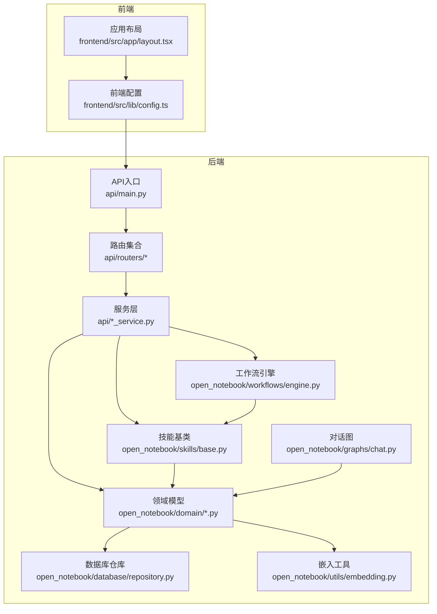
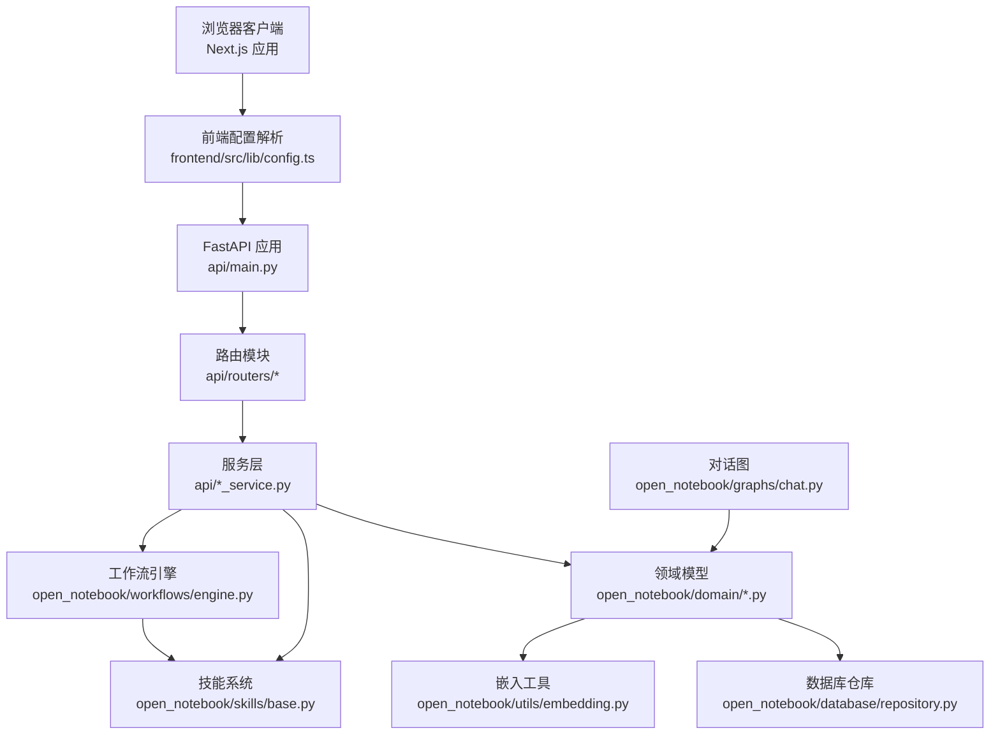
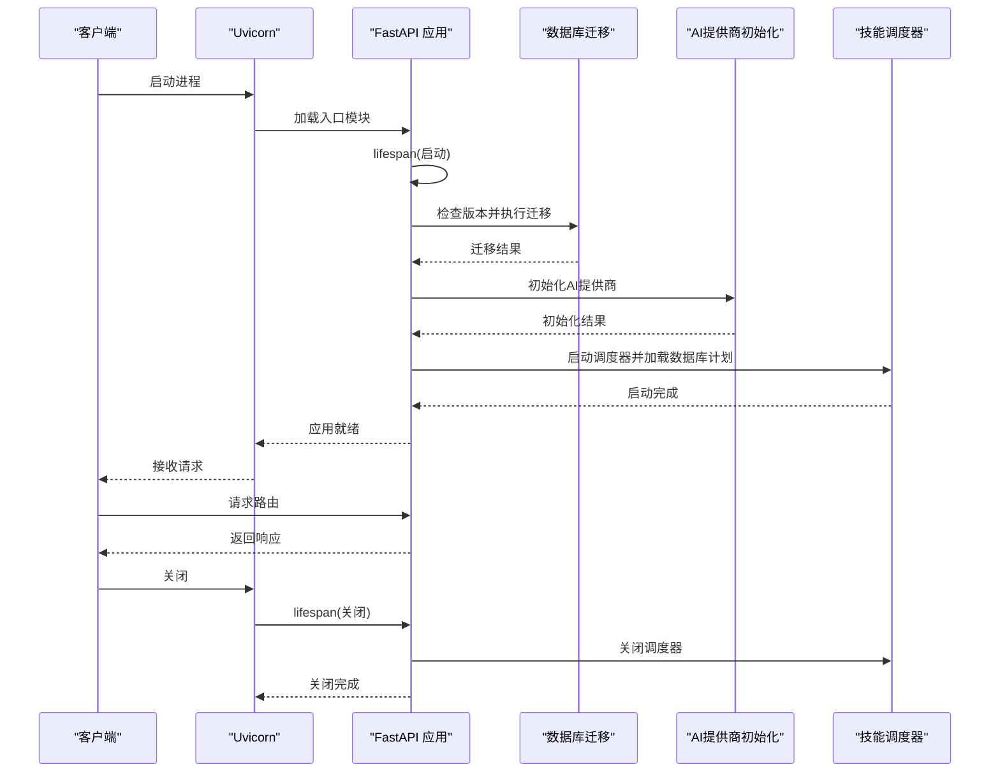
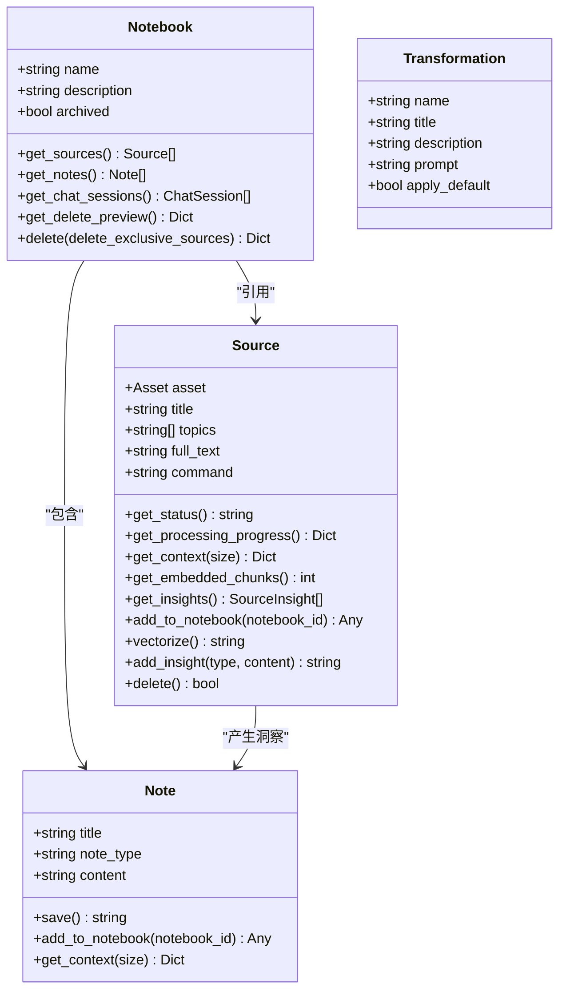
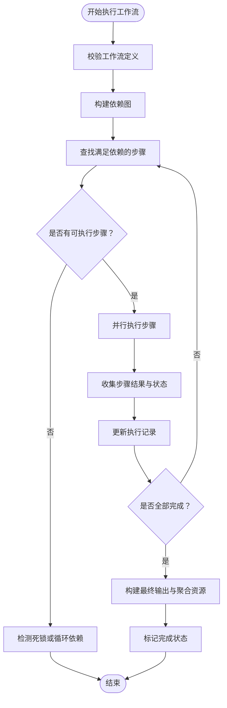
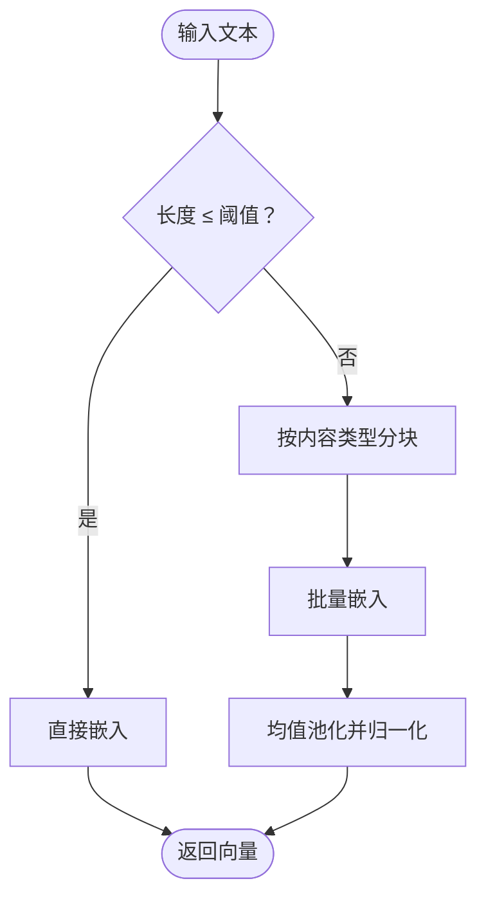
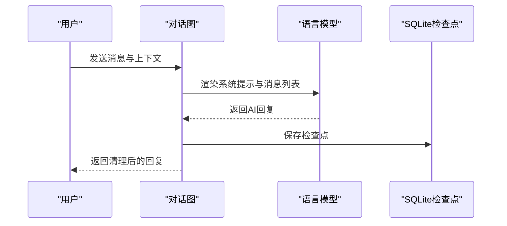
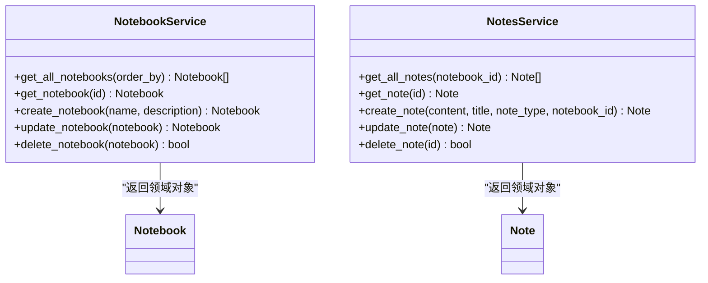
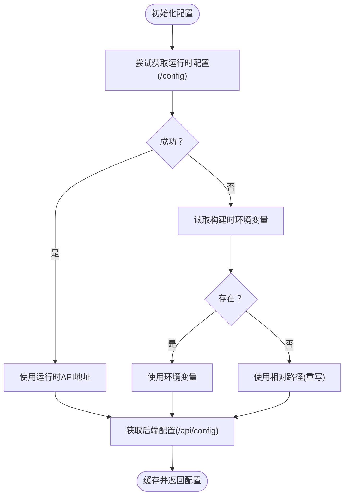
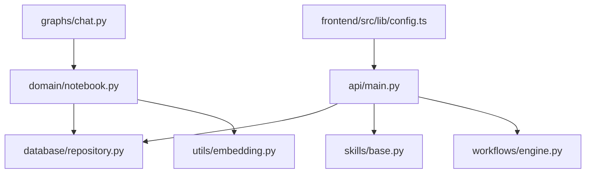

# 核心组件

<cite>
**本文档引用的文件**
- [api/main.py](file://api/main.py)
- [run_api.py](file://run_api.py)
- [open_notebook/domain/notebook.py](file://open_notebook/domain/notebook.py)
- [open_notebook/domain/transformation.py](file://open_notebook/domain/transformation.py)
- [open_notebook/skills/base.py](file://open_notebook/skills/base.py)
- [open_notebook/workflows/engine.py](file://open_notebook/workflows/engine.py)
- [open_notebook/database/repository.py](file://open_notebook/database/repository.py)
- [open_notebook/utils/embedding.py](file://open_notebook/utils/embedding.py)
- [open_notebook/graphs/chat.py](file://open_notebook/graphs/chat.py)
- [api/notebook_service.py](file://api/notebook_service.py)
- [api/notes_service.py](file://api/notes_service.py)
- [frontend/src/lib/config.ts](file://frontend/src/lib/config.ts)
- [frontend/src/app/layout.tsx](file://frontend/src/app/layout.tsx)
</cite>

## 目录
1. [简介](#简介)
2. [项目结构](#项目结构)
3. [核心组件](#核心组件)
4. [架构总览](#架构总览)
5. [详细组件分析](#详细组件分析)
6. [依赖关系分析](#依赖关系分析)
7. [性能考虑](#性能考虑)
8. [故障排除指南](#故障排除指南)
9. [结论](#结论)

## 简介
Open Notebook 是一个隐私优先的研究助手与知识管理系统，采用前后端分离架构：后端基于 FastAPI 提供 REST API，前端使用 Next.js 构建用户界面。系统围绕“笔记本（Notebook）—资料（Source）—笔记（Note）”的知识组织模型，提供向量检索、智能对话、技能自动化与工作流编排等能力。

## 项目结构
项目采用模块化分层设计：
- 后端 API 层：路由注册、中间件、异常处理、数据库迁移与初始化
- 领域模型层：Notebook、Source、Note、Transformation 等核心实体
- 技能与工作流层：Skill 基类、工作流引擎与执行上下文
- 数据访问层：SurrealDB 连接封装与通用查询接口
- 工具与嵌入层：统一的嵌入生成与均值池化策略
- 图谱与对话层：LangGraph 对话图与检查点存储
- 前端配置层：动态 API 地址解析与运行时配置

图表来源
- [api/main.py](file://api/main.py#L173-L273)
- [frontend/src/lib/config.ts](file://frontend/src/lib/config.ts#L1-L149)
- [frontend/src/app/layout.tsx](file://frontend/src/app/layout.tsx#L1-L46)
- [open_notebook/database/repository.py](file://open_notebook/database/repository.py#L47-L83)
- [open_notebook/utils/embedding.py](file://open_notebook/utils/embedding.py#L143-L208)
- [open_notebook/graphs/chat.py](file://open_notebook/graphs/chat.py#L1-L94)

章节来源
- [api/main.py](file://api/main.py#L1-L273)
- [frontend/src/lib/config.ts](file://frontend/src/lib/config.ts#L1-L149)
- [frontend/src/app/layout.tsx](file://frontend/src/app/layout.tsx#L1-L46)

## 核心组件
本节聚焦于系统的关键组件及其职责边界与交互方式。

- API 应用与生命周期管理
  - 负责应用启动与关闭时的数据库迁移、AI 提供商初始化、技能调度器启动与关闭
  - 注册所有路由模块，设置密码认证中间件与 CORS 中间件
  - 自定义异常处理器确保错误响应包含 CORS 头部
  - 参考路径：[api/main.py](file://api/main.py#L56-L171)，[api/main.py](file://api/main.py#L173-L273)

- 数据库访问与连接管理
  - 统一封装 SurrealDB 连接、查询、创建、更新、删除与关联操作
  - 支持 RecordID 解析与转换，兼容旧格式环境变量
  - 参考路径：[open_notebook/database/repository.py](file://open_notebook/database/repository.py#L47-L195)

- 领域模型与知识组织
  - Notebook：笔记本实体，支持获取资料、笔记、聊天会话，提供删除预览与级联删除
  - Source：资料实体，支持处理状态查询、洞察提取、向量化提交、洞察创建
  - Note：笔记实体，保存时异步提交嵌入命令
  - Transformation：转换模板与默认提示配置
  - 参考路径：[open_notebook/domain/notebook.py](file://open_notebook/domain/notebook.py#L16-L679)，[open_notebook/domain/transformation.py](file://open_notebook/domain/transformation.py#L1-L22)

- 技能系统与工作流引擎
  - Skill 基类：定义技能生命周期钩子、参数校验与执行流程
  - WorkflowEngine：解析工作流定义、构建依赖图、并行执行步骤、条件与重试控制
  - 参考路径：[open_notebook/skills/base.py](file://open_notebook/skills/base.py#L83-L183)，[open_notebook/workflows/engine.py](file://open_notebook/workflows/engine.py#L129-L619)

- 嵌入生成与向量检索
  - 统一嵌入生成：短文本直接嵌入，长文本自动分块并均值池化
  - 批量嵌入：一次 API 调用处理多个文本，提升吞吐
  - 参考路径：[open_notebook/utils/embedding.py](file://open_notebook/utils/embedding.py#L143-L208)

- 对话图与检查点
  - 基于 LangGraph 的对话状态图，SQLite 检查点持久化，支持多轮消息与上下文注入
  - 参考路径：[open_notebook/graphs/chat.py](file://open_notebook/graphs/chat.py#L1-L94)

- 服务层适配（API 客户端）
  - NotebookService、NotesService 将 API 响应映射为领域对象，便于前端或内部逻辑使用
  - 参考路径：[api/notebook_service.py](file://api/notebook_service.py#L13-L88)，[api/notes_service.py](file://api/notes_service.py#L13-L104)

- 前端配置与运行时解析
  - 动态解析 API 地址：优先运行时配置 → 构建时环境变量 → 相对路径重写
  - 参考路径：[frontend/src/lib/config.ts](file://frontend/src/lib/config.ts#L22-L140)

章节来源
- [api/main.py](file://api/main.py#L56-L171)
- [open_notebook/database/repository.py](file://open_notebook/database/repository.py#L47-L195)
- [open_notebook/domain/notebook.py](file://open_notebook/domain/notebook.py#L16-L679)
- [open_notebook/domain/transformation.py](file://open_notebook/domain/transformation.py#L1-L22)
- [open_notebook/skills/base.py](file://open_notebook/skills/base.py#L83-L183)
- [open_notebook/workflows/engine.py](file://open_notebook/workflows/engine.py#L129-L619)
- [open_notebook/utils/embedding.py](file://open_notebook/utils/embedding.py#L143-L208)
- [open_notebook/graphs/chat.py](file://open_notebook/graphs/chat.py#L1-L94)
- [api/notebook_service.py](file://api/notebook_service.py#L13-L88)
- [api/notes_service.py](file://api/notes_service.py#L13-L104)
- [frontend/src/lib/config.ts](file://frontend/src/lib/config.ts#L22-L140)

## 架构总览
系统采用“API 服务 + 领域模型 + 技能/工作流 + 嵌入检索 + 对话图”的分层架构。前端通过动态配置解析 API 地址，后端在启动时完成数据库迁移与组件初始化，随后对外提供稳定的服务接口。

图表来源
- [frontend/src/lib/config.ts](file://frontend/src/lib/config.ts#L22-L140)
- [api/main.py](file://api/main.py#L173-L273)
- [open_notebook/database/repository.py](file://open_notebook/database/repository.py#L47-L83)
- [open_notebook/utils/embedding.py](file://open_notebook/utils/embedding.py#L143-L208)
- [open_notebook/graphs/chat.py](file://open_notebook/graphs/chat.py#L1-L94)

## 详细组件分析

### API 应用与生命周期
- 生命周期事件
  - 启动阶段：检查加密密钥、执行数据库迁移、自动初始化 AI 提供商、启动技能调度器与 P0 日常同步调度器
  - 关闭阶段：优雅关闭技能调度器与 P0 调度器
- 中间件与异常处理
  - 密码认证中间件排除健康检查与配置端点
  - CORS 中间件允许跨域请求
  - 自定义异常处理器保证错误响应包含 CORS 头部
- 路由注册
  - 包含认证、配置、笔记本、搜索、模型、转换、笔记、嵌入、设置、上下文、资料、洞察、命令、播客、剧集与演讲者档案、聊天、源聊天、凭据、技能、工作流、工作流模板、工作流构建器、P0/P3 调度、个人 IP、平台账号、发布等路由

图表来源
- [api/main.py](file://api/main.py#L56-L171)
- [run_api.py](file://run_api.py#L16-L31)

章节来源
- [api/main.py](file://api/main.py#L56-L171)
- [run_api.py](file://run_api.py#L16-L31)

### 领域模型与知识组织
- Notebook
  - 获取资料、笔记、聊天会话
  - 删除预览：统计将被删除的笔记数、可删除的独享资料数、与其他笔记本共享的资料数
  - 级联删除：删除笔记、解除资料关联、可选删除独享资料
- Source
  - 处理状态与进度：通过关联命令查询状态与执行元数据
  - 上下文：短/长两种上下文返回，长上下文包含全文
  - 向量化：提交 embed_source 命令进行后台处理
  - 洞察：提交 create_insight 命令异步创建洞察并触发嵌入
- Note
  - 保存时异步提交 embed_note 命令
  - 上下文：短/长两种上下文，长上下文包含全文
- Transformation
  - 转换模板与默认提示配置

图表来源
- [open_notebook/domain/notebook.py](file://open_notebook/domain/notebook.py#L16-L679)
- [open_notebook/domain/transformation.py](file://open_notebook/domain/transformation.py#L1-L22)

章节来源
- [open_notebook/domain/notebook.py](file://open_notebook/domain/notebook.py#L16-L679)
- [open_notebook/domain/transformation.py](file://open_notebook/domain/transformation.py#L1-L22)

### 技能系统与工作流引擎
- Skill 基类
  - 定义技能类型、名称、描述、参数模式
  - 生命周期：before_execute → execute → after_execute
  - 结果封装：包含状态、耗时、输出、错误信息、创建的资源 ID 列表
- WorkflowEngine
  - 解析与校验工作流定义（重复 ID、未定义依赖、环形依赖）
  - 构建依赖图，按波次并行执行满足依赖的步骤
  - 条件执行、重试与延迟、输出映射、聚合创建的资源
  - 安全表达式求值（白名单内置函数）

图表来源
- [open_notebook/workflows/engine.py](file://open_notebook/workflows/engine.py#L204-L297)
- [open_notebook/skills/base.py](file://open_notebook/skills/base.py#L146-L183)

章节来源
- [open_notebook/skills/base.py](file://open_notebook/skills/base.py#L83-L183)
- [open_notebook/workflows/engine.py](file://open_notebook/workflows/engine.py#L129-L619)

### 嵌入生成与向量检索
- 短文本：直接调用嵌入模型生成单个向量
- 长文本：自动分块（根据内容类型选择分隔符），批量嵌入后进行均值池化归一化
- 批量嵌入：一次 API 调用处理多个文本，降低网络开销
- 向量检索：统一生成查询向量，调用数据库函数执行向量搜索

图表来源
- [open_notebook/utils/embedding.py](file://open_notebook/utils/embedding.py#L143-L208)

章节来源
- [open_notebook/utils/embedding.py](file://open_notebook/utils/embedding.py#L143-L208)

### 对话图与检查点
- 使用 LangGraph StateGraph 构建对话状态机，支持消息累积、上下文注入与模型覆盖
- SQLite 检查点持久化，确保中断后可恢复
- 异步模型提供在同步上下文中安全运行

图表来源
- [open_notebook/graphs/chat.py](file://open_notebook/graphs/chat.py#L27-L81)

章节来源
- [open_notebook/graphs/chat.py](file://open_notebook/graphs/chat.py#L1-L94)

### 服务层适配（API 客户端）
- NotebookService：获取笔记本列表/详情、创建、更新、删除
- NotesService：获取笔记列表/详情、创建、更新、删除
- 二者均将 API 响应映射为领域对象，便于上层使用

图表来源
- [api/notebook_service.py](file://api/notebook_service.py#L13-L88)
- [api/notes_service.py](file://api/notes_service.py#L13-L104)

章节来源
- [api/notebook_service.py](file://api/notebook_service.py#L13-L88)
- [api/notes_service.py](file://api/notes_service.py#L13-L104)

### 前端配置与运行时解析
- 优先级：运行时配置（/config）→ 构建时环境变量（NEXT_PUBLIC_API_URL）→ 相对路径（重写）
- 在开发环境下打印调试信息，生产环境由连接守卫统一展示错误
- 支持版本信息与数据库状态读取

图表来源
- [frontend/src/lib/config.ts](file://frontend/src/lib/config.ts#L59-L140)

章节来源
- [frontend/src/lib/config.ts](file://frontend/src/lib/config.ts#L22-L140)
- [frontend/src/app/layout.tsx](file://frontend/src/app/layout.tsx#L1-L46)

## 依赖关系分析
- 组件耦合
  - API 主模块与数据库迁移、AI 提供商初始化、技能调度器存在启动时耦合，但生命周期管理清晰
  - 领域模型依赖数据库仓库进行 CRUD 操作，避免直接耦合具体数据库驱动
  - 技能系统与工作流引擎通过注册表解耦具体技能实现
  - 前端配置与后端 API 通过运行时配置端点解耦部署时的硬编码
- 外部依赖
  - SurrealDB：作为主要数据存储与查询后端
  - LangGraph：用于对话图与检查点
  - LangChain：模型提供与调用
  - FastAPI/Uvicorn：API 服务器

图表来源
- [api/main.py](file://api/main.py#L173-L273)
- [open_notebook/database/repository.py](file://open_notebook/database/repository.py#L47-L83)
- [open_notebook/utils/embedding.py](file://open_notebook/utils/embedding.py#L143-L208)
- [open_notebook/graphs/chat.py](file://open_notebook/graphs/chat.py#L1-L94)

章节来源
- [api/main.py](file://api/main.py#L173-L273)
- [open_notebook/database/repository.py](file://open_notebook/database/repository.py#L47-L83)
- [open_notebook/utils/embedding.py](file://open_notebook/utils/embedding.py#L143-L208)
- [open_notebook/graphs/chat.py](file://open_notebook/graphs/chat.py#L1-L94)

## 性能考虑
- 嵌入性能
  - 长文本采用分块 + 批量嵌入 + 均值池化策略，减少 API 调用次数并保持语义一致性
  - 参考路径：[open_notebook/utils/embedding.py](file://open_notebook/utils/embedding.py#L143-L208)
- 数据库操作
  - 事务冲突使用调试日志避免噪声，必要时重试；批量插入忽略重复项以提升吞吐
  - 参考路径：[open_notebook/database/repository.py](file://open_notebook/database/repository.py#L169-L195)
- 对话图
  - SQLite 检查点避免频繁序列化，线程安全连接配置降低锁竞争
  - 参考路径：[open_notebook/graphs/chat.py](file://open_notebook/graphs/chat.py#L83-L94)
- 工作流执行
  - 依赖图按波次并行执行，失败步骤不影响已完成步骤，支持部分成功场景
  - 参考路径：[open_notebook/workflows/engine.py](file://open_notebook/workflows/engine.py#L222-L297)

## 故障排除指南
- 数据库迁移失败
  - 现象：启动时报错并终止
  - 处理：检查数据库连接、命名空间与数据库名配置，确保迁移脚本可用
  - 参考路径：[api/main.py](file://api/main.py#L75-L98)
- 嵌入模型未配置
  - 现象：生成嵌入时报错
  - 处理：在模型配置中设置嵌入模型
  - 参考路径：[open_notebook/utils/embedding.py](file://open_notebook/utils/embedding.py#L108-L113)
- 技能调度器启动失败
  - 现象：技能无法按时执行
  - 处理：查看调度器日志，确认 Runner 与 WorkflowService 初始化成功
  - 参考路径：[api/main.py](file://api/main.py#L110-L125)
- CORS 错误导致上传失败
  - 现象：413 错误且浏览器报 CORS 缺失
  - 处理：使用自定义异常处理器或在反向代理中添加 CORS 头
  - 参考路径：[api/main.py](file://api/main.py#L206-L228)
- 前端无法连接后端
  - 现象：页面显示连接错误
  - 处理：检查运行时配置端点与环境变量，确认相对路径重写生效
  - 参考路径：[frontend/src/lib/config.ts](file://frontend/src/lib/config.ts#L113-L140)

章节来源
- [api/main.py](file://api/main.py#L75-L98)
- [open_notebook/utils/embedding.py](file://open_notebook/utils/embedding.py#L108-L113)
- [api/main.py](file://api/main.py#L110-L125)
- [api/main.py](file://api/main.py#L206-L228)
- [frontend/src/lib/config.ts](file://frontend/src/lib/config.ts#L113-L140)

## 结论
Open Notebook 的核心组件围绕“知识组织 + 智能检索 + 自动化技能 + 工作流编排 + 对话交互”展开，采用清晰的分层与解耦设计。后端通过生命周期管理确保系统稳定启动，前端通过动态配置实现灵活部署。建议在生产环境中：
- 明确数据库与模型配置，完善监控与日志
- 对长文本处理与批量嵌入进行容量规划
- 优化工作流依赖设计，避免环形依赖与死锁
- 使用反向代理正确配置 CORS 与静态资源