# 活体知识系统

<cite>
**本文档引用的文件**
- [README.md](file://README.md)
- [活体知识系统架构.md](file://docs/活体知识系统架构.md)
- [living_system_architecture.md](file://docs/living_system_architecture.md)
- [living_system_implementation_summary.md](file://docs/living_system_implementation_summary.md)
- [open_notebook/__init__.py](file://open_notebook/__init__.py)
- [open_notebook/skills/living/skill_cell.py](file://open_notebook/skills/living/skill_cell.py)
- [open_notebook/skills/living/agent_tissue.py](file://open_notebook/skills/living/agent_tissue.py)
- [open_notebook/skills/living/meridian_flow.py](file://open_notebook/skills/living/meridian_flow.py)
- [open_notebook/skills/living/acupoint_trigger.py](file://open_notebook/skills/living/acupoint_trigger.py)
- [open_notebook/skills/living/p4_data_agent.py](file://open_notebook/skills/living/p4_data_agent.py)
- [open_notebook/skills/living/api_server.py](file://open_notebook/skills/living/api_server.py)
- [open_notebook/skills/living/api_endpoints.py](file://open_notebook/skills/living/api_endpoints.py)
- [open_notebook/skills/living/launcher.py](file://open_notebook/skills/living/launcher.py)
- [open_notebook/skills/living/examples/p0_perception_organ.py](file://open_notebook/skills/living/examples/p0_perception_organic.py)
</cite>

## 目录
1. [简介](#简介)
2. [项目结构](#项目结构)
3. [核心组件](#核心组件)
4. [架构概览](#架构概览)
5. [详细组件分析](#详细组件分析)
6. [依赖关系分析](#依赖关系分析)
7. [性能考虑](#性能考虑)
8. [故障排除指南](#故障排除指南)
9. [结论](#结论)
10. [附录](#附录)

## 简介

活体知识系统是一个创新的知识管理系统，它将知识管理类比为人体组织，实现了自组织、自运行的智能系统。该系统采用五层架构设计，模拟生物体的组织层次结构，从最基本的技能单元到复杂的器官系统。

系统的核心理念是通过生物学隐喻来构建智能化的知识处理管道，包括：

- **细胞层（Skill）**：基本功能单元，可独立执行特定任务
- **组织层（Agent）**：由多个技能组成的协作单元
- **器官层（System）**：由多个Agent组成的复杂系统
- **经络层（Meridian）**：连接各层的数据流、控制流、时序流
- **穴位层（Acupoint）**：外部系统接入的触发点

该系统支持异步执行、生命周期管理、依赖解析、时序调度等高级特性，为现代知识管理工作提供了完整的解决方案。

## 项目结构

活体知识系统采用模块化的项目结构，主要分为以下几个核心部分：

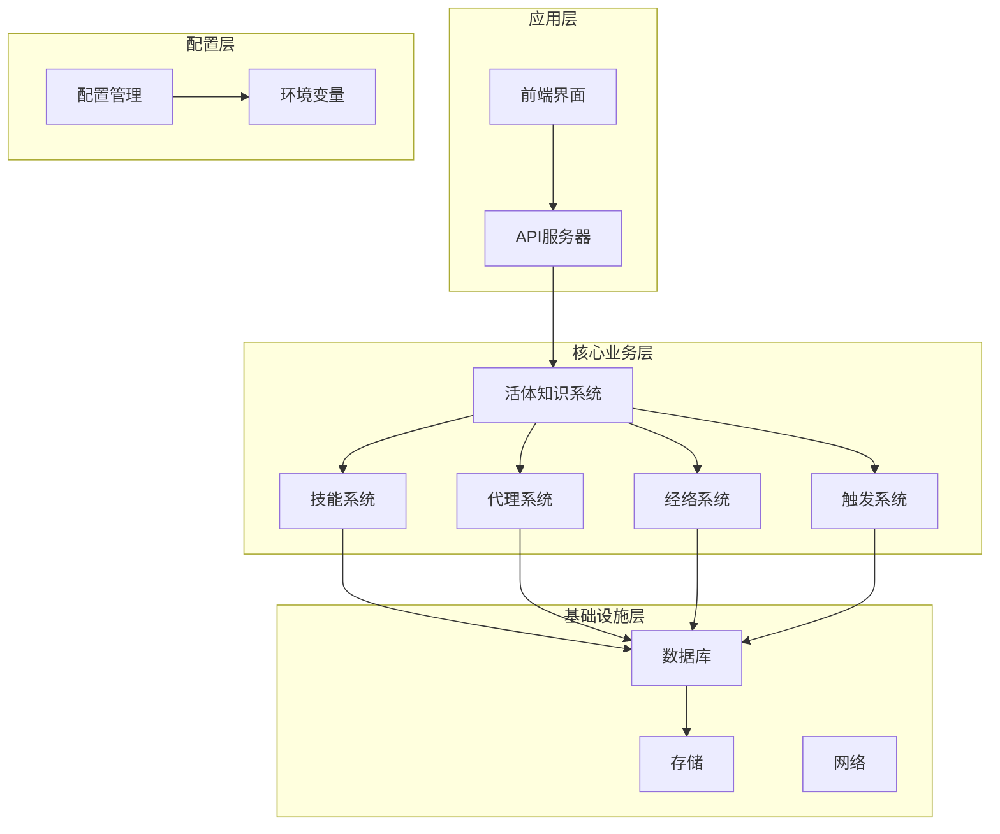

**图表来源**
- [README.md](file://README.md#L1-L358)
- [open_notebook/skills/living/launcher.py](file://open_notebook/skills/living/launcher.py#L1-L345)

**章节来源**
- [README.md](file://README.md#L1-L358)
- [open_notebook/__init__.py](file://open_notebook/__init__.py#L1-L1)

## 核心组件

### 五层架构设计

活体知识系统采用经典的五层架构设计，每层都有其特定的功能和职责：

#### 细胞层（Skill）
- **定义**：最基本的功能单元，可独立执行特定任务
- **属性**：生命周期管理、时序调度、资源加载、依赖关系
- **示例**：疼痛扫描器、情感观察者、趋势猎手、场景发现者

#### 组织层（Agent）
- **定义**：由多个Skill组成的协作单元，完成特定功能
- **属性**：协调机制、节律管理、健康监控、响应能力
- **示例**：P0感知系统、P1判断系统、P2关系系统、P3进化系统

#### 器官层（System）
- **定义**：由多个Agent组成的复杂系统
- **属性**：系统间交互、稳态维持、自适应机制
- **示例**：内容创作系统、IP运营系统、增长引擎系统

#### 经络层（Flow）
- **定义**：连接各层的数据流、控制流、时序流
- **类型**：数据经络、控制经络、时序经络
- **功能**：信息传递、指令传递、节律同步

#### 穴位层（Acupoint）
- **定义**：外部系统接入的触发点
- **类型**：时间触发器、事件触发器、条件触发器、手动触发器
- **功能**：外部事件接入、系统刺激、状态转换

**章节来源**
- [活体知识系统架构.md](file://docs/活体知识系统架构.md#L1-L266)
- [living_system_architecture.md](file://docs/living_system_architecture.md#L1-L264)

### 技术栈与特性

系统基于以下核心技术构建：

- **编程语言**：Python 3.8+
- **Web框架**：FastAPI 0.95+
- **数据库**：PostgreSQL + TimescaleDB
- **异步处理**：asyncio + uvicorn
- **容器化**：Docker + docker-compose
- **前端**：Next.js + React

**章节来源**
- [README.md](file://README.md#L312-L313)

## 架构概览

### 整体架构设计

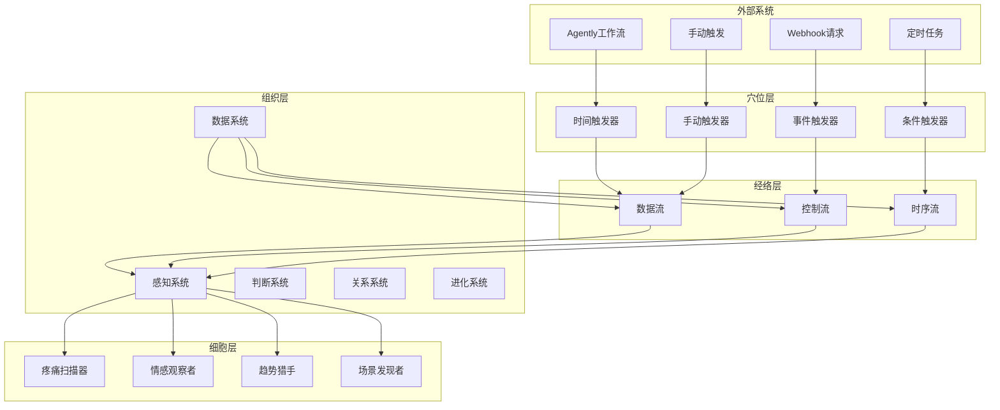

**图表来源**
- [living_system_architecture.md](file://docs/living_system_architecture.md#L5-L58)

### 数据流架构

系统采用事件驱动的数据流架构，确保各组件之间的松耦合和高内聚：

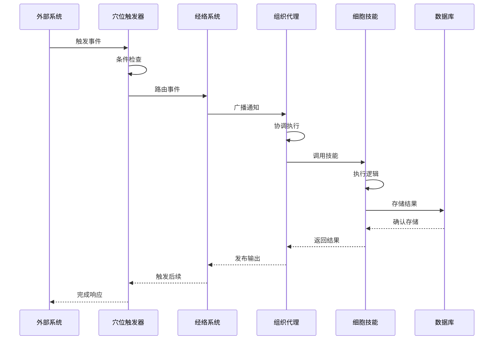

**图表来源**
- [living_system_architecture.md](file://docs/living_system_architecture.md#L242-L264)

**章节来源**
- [living_system_architecture.md](file://docs/living_system_architecture.md#L1-L264)

## 详细组件分析

### 细胞层（Skill）分析

#### LivingSkill 类设计

LivingSkill 是系统中最基本的功能单元，模拟生物细胞的特性：

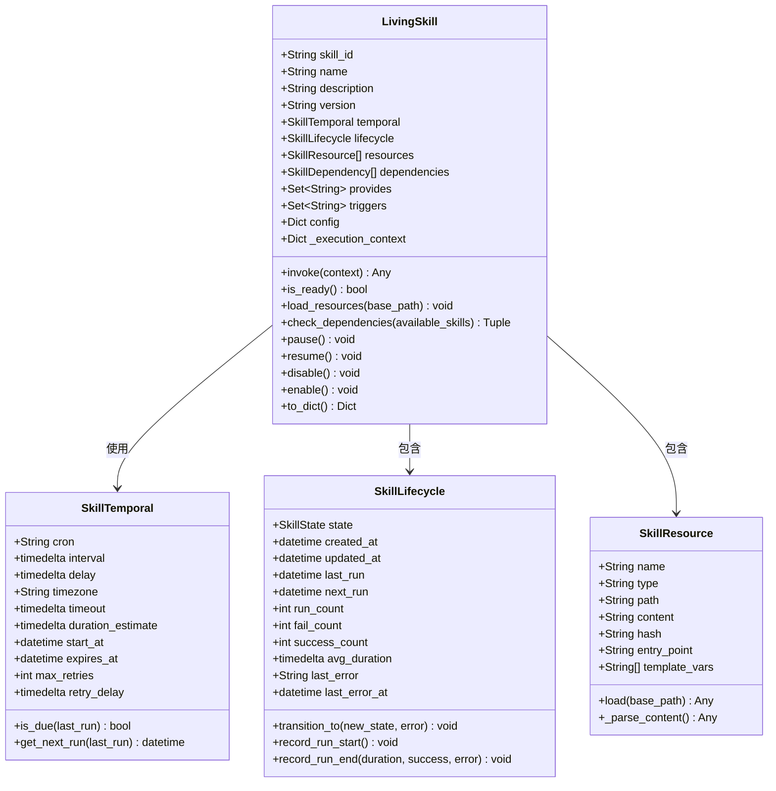

**图表来源**
- [open_notebook/skills/living/skill_cell.py](file://open_notebook/skills/living/skill_cell.py#L211-L474)

#### 技能生命周期管理

系统实现了完整的技能生命周期管理，包括状态转换和健康监控：

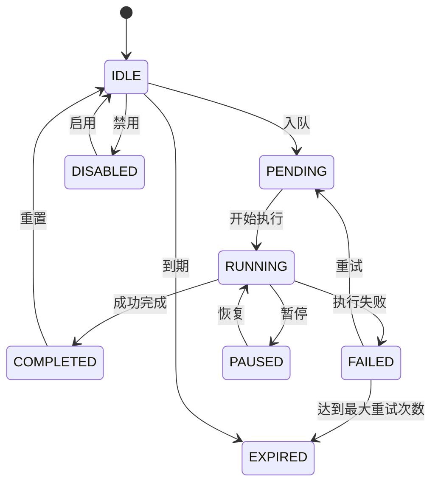

**图表来源**
- [open_notebook/skills/living/skill_cell.py](file://open_notebook/skills/living/skill_cell.py#L29-L39)

**章节来源**
- [open_notebook/skills/living/skill_cell.py](file://open_notebook/skills/living/skill_cell.py#L1-L474)

### 组织层（Agent）分析

#### AgentTissue 类设计

AgentTissue 模拟生物组织的特性，协调多个技能的执行：

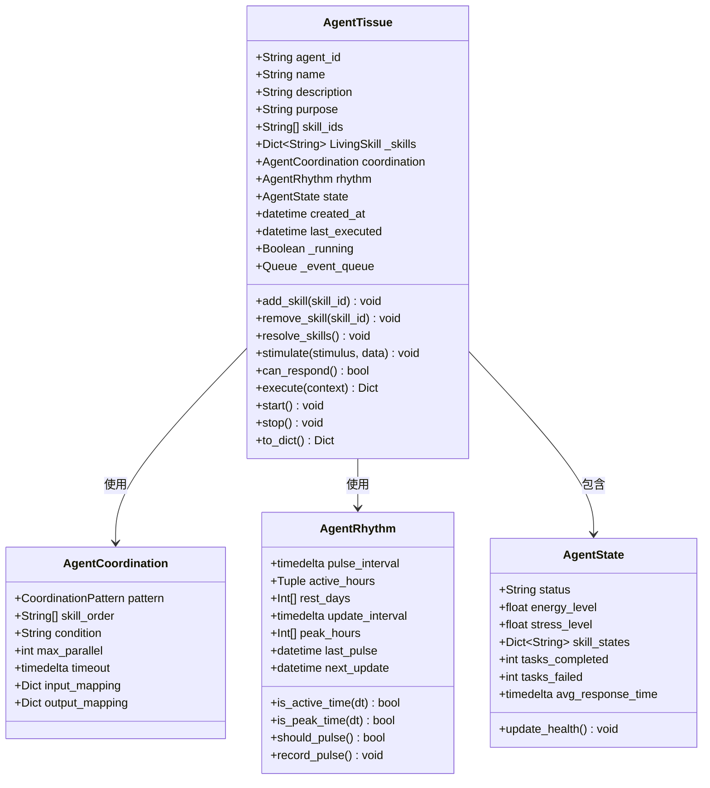

**图表来源**
- [open_notebook/skills/living/agent_tissue.py](file://open_notebook/skills/living/agent_tissue.py#L127-L489)

#### 协调模式设计

系统支持多种协调模式，模拟不同的生物组织行为：

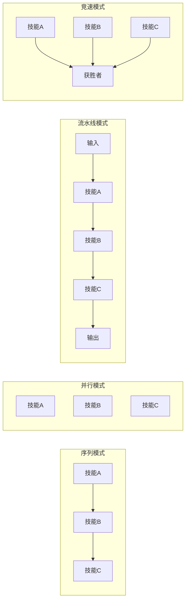

**图表来源**
- [living_system_architecture.md](file://docs/living_system_architecture.md#L80-L101)

**章节来源**
- [open_notebook/skills/living/agent_tissue.py](file://open_notebook/skills/living/agent_tissue.py#L1-L489)

### 经络层（Meridian）分析

#### MeridianFlow 类设计

MeridianFlow 模拟生物经络系统，提供不同类型的数据传输通道：

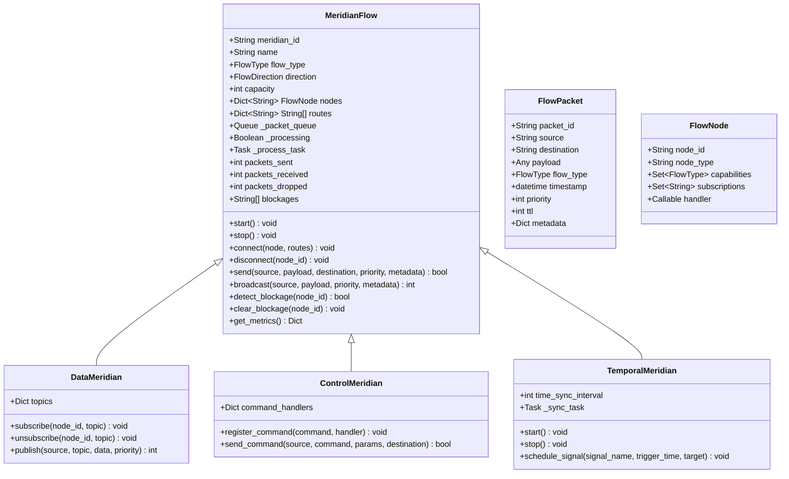

**图表来源**
- [open_notebook/skills/living/meridian_flow.py](file://open_notebook/skills/living/meridian_flow.py#L63-L444)

**章节来源**
- [open_notebook/skills/living/meridian_flow.py](file://open_notebook/skills/living/meridian_flow.py#L1-L444)

### 穴位层（Acupoint）分析

#### AcupointTrigger 类设计

AcupointTrigger 模拟生物穴位，作为外部系统与内部系统的接口点：

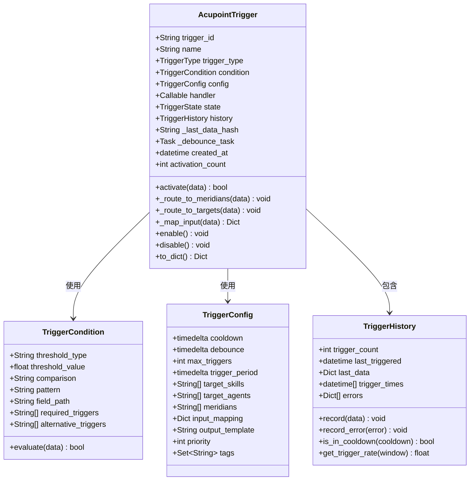

**图表来源**
- [open_notebook/skills/living/acupoint_trigger.py](file://open_notebook/skills/living/acupoint_trigger.py#L173-L355)

**章节来源**
- [open_notebook/skills/living/acupoint_trigger.py](file://open_notebook/skills/living/acupoint_trigger.py#L1-L596)

### 数据层（P4）分析

#### P4DataAgent 类设计

P4DataAgent 模拟生物免疫系统，负责数据生命周期管理：

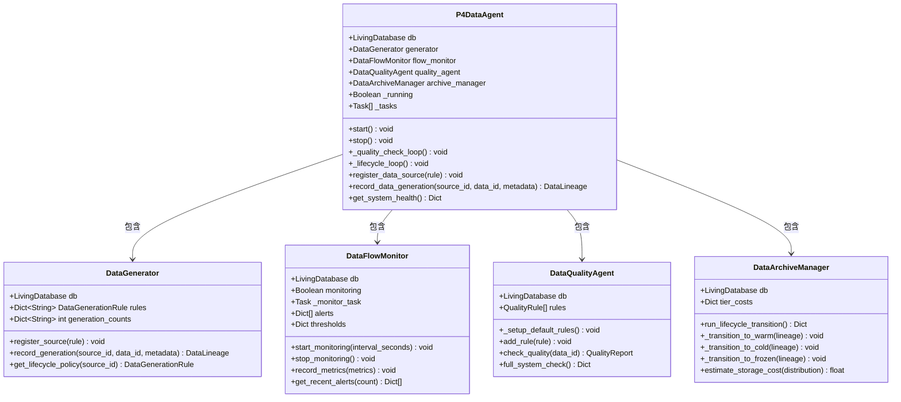

**图表来源**
- [open_notebook/skills/living/p4_data_agent.py](file://open_notebook/skills/living/p4_data_agent.py#L385-L493)

**章节来源**
- [open_notebook/skills/living/p4_data_agent.py](file://open_notebook/skills/living/p4_data_agent.py#L1-L601)

## 依赖关系分析

### 组件依赖图

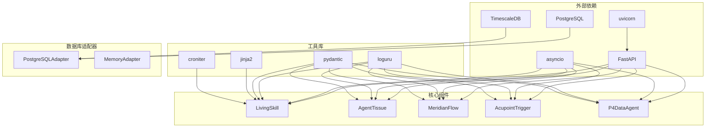

**图表来源**
- [open_notebook/skills/living/api_server.py](file://open_notebook/skills/living/api_server.py#L18-L39)
- [open_notebook/skills/living/launcher.py](file://open_notebook/skills/living/launcher.py#L39-L59)

### 数据流依赖

系统中的数据流依赖关系如下：

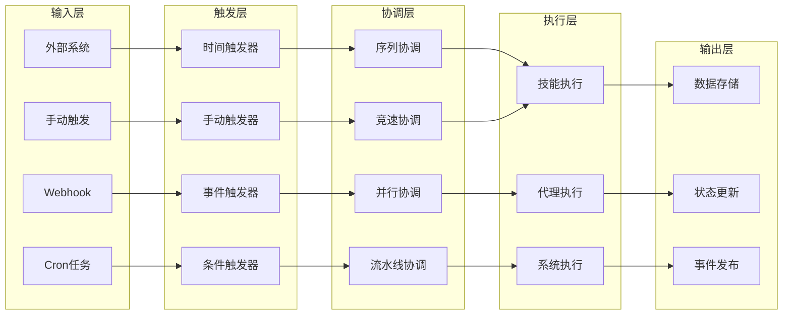

**图表来源**
- [open_notebook/skills/living/agent_tissue.py](file://open_notebook/skills/living/agent_tissue.py#L294-L384)

**章节来源**
- [open_notebook/skills/living/api_server.py](file://open_notebook/skills/living/api_server.py#L1-L556)
- [open_notebook/skills/living/launcher.py](file://open_notebook/skills/living/launcher.py#L1-L345)

## 性能考虑

### 异步执行模型

系统采用完全的异步执行模型，通过 asyncio 提供高性能的并发处理能力：

- **事件循环**：使用 uvicorn 的高性能 ASGI 服务器
- **协程管理**：每个技能和代理都支持异步执行
- **资源池**：数据库连接和外部 API 调用使用连接池
- **背压处理**：经络系统内置流量控制和拥塞避免

### 内存管理

- **对象池**：技能实例和代理实例使用注册表管理
- **垃圾回收**：自动清理过期和失效的对象
- **内存映射**：大型数据使用内存映射文件
- **缓存策略**：智能缓存热点数据和计算结果

### 数据库优化

- **索引策略**：为常用查询字段建立复合索引
- **分区表**：使用 TimescaleDB 进行时间序列数据分区
- **批量操作**：支持批量插入和更新操作
- **连接池**：配置合适的连接池大小

### 监控与诊断

- **指标收集**：实时收集系统性能指标
- **日志聚合**：统一的日志格式和级别
- **健康检查**：定期的系统健康状态检查
- **告警机制**：基于阈值的自动告警

## 故障排除指南

### 常见问题诊断

#### 系统启动问题

**症状**：系统无法正常启动或启动后立即退出

**排查步骤**：
1. 检查数据库连接配置
2. 验证环境变量设置
3. 查看启动日志中的错误信息
4. 确认端口未被占用

**解决方案**：
```bash
# 检查数据库连接
docker-compose logs surrealdb

# 验证环境变量
echo $OPEN_NOTEBOOK_ENCRYPTION_KEY
echo $SURREAL_URL

# 查看系统日志
tail -f logs/living_system.log
```

#### 技能执行失败

**症状**：技能执行抛出异常或返回错误结果

**排查步骤**：
1. 检查技能资源加载是否成功
2. 验证依赖关系是否满足
3. 查看技能生命周期状态
4. 检查外部 API 调用情况

**解决方案**：
```python
# 手动测试技能执行
skill = LivingSkill.get_instance("p0.pain_scanner")
result = await skill.invoke(test_context)
print(f"Skill result: {result}")

# 检查技能状态
print(f"Skill state: {skill.lifecycle.state}")
print(f"Last error: {skill.lifecycle.last_error}")
```

#### 经络阻塞

**症状**：数据在经络中传输缓慢或完全停止

**排查步骤**：
1. 检查经络节点连接状态
2. 验证路由配置是否正确
3. 查看队列长度和处理速度
4. 检查目标节点的可用性

**解决方案**：
```python
# 检查经络状态
meridian = MeridianSystem.get("p0.data.perception")
metrics = meridian.get_metrics()
print(f"Packets sent: {metrics['packets_sent']}")
print(f"Packets received: {metrics['packets_received']}")
print(f"Queue size: {metrics['queue_size']}")

# 清理阻塞节点
for node_id in meridian.blockages:
    meridian.clear_blockage(node_id)
    print(f"Cleared blockage for node: {node_id}")
```

### 性能优化建议

#### 数据库性能优化

1. **索引优化**：为经常查询的字段创建适当的索引
2. **查询优化**：避免 N+1 查询问题
3. **连接池配置**：根据并发需求调整连接池大小
4. **分区策略**：对大数据表进行分区

#### 系统资源优化

1. **内存使用**：监控内存使用情况，及时清理无用对象
2. **CPU 使用**：优化算法复杂度，避免不必要的计算
3. **网络延迟**：减少外部 API 调用次数
4. **磁盘 I/O**：使用异步文件操作

#### 监控指标

系统提供以下关键性能指标：

| 指标类别 | 关键指标 | 目标值 | 监控方式 |
|---------|---------|-------|---------|
| 系统健康 | CPU 使用率 | < 80% | Prometheus |
| 系统健康 | 内存使用率 | < 85% | 系统监控 |
| 数据库 | 查询响应时间 | < 100ms | 应用日志 |
| 数据库 | 连接池利用率 | < 70% | 连接池监控 |
| 经络系统 | 队列长度 | < 1000 | 经络监控 |
| 经络系统 | 丢包率 | < 0.1% | 经络日志 |

**章节来源**
- [open_notebook/skills/living/api_server.py](file://open_notebook/skills/living/api_server.py#L192-L206)
- [open_notebook/skills/living/meridian_flow.py](file://open_notebook/skills/living/meridian_flow.py#L239-L248)

## 结论

活体知识系统是一个高度复杂且精心设计的智能知识管理平台。通过采用生物组织的隐喻，系统实现了真正的自组织、自运行能力。

### 主要成就

1. **架构创新**：五层架构设计提供了清晰的抽象层次
2. **技术先进**：基于最新的异步编程技术和现代数据库
3. **扩展性强**：模块化设计支持功能的灵活扩展
4. **可靠性高**：完善的错误处理和监控机制
5. **性能优异**：异步执行和优化的数据库访问

### 技术特色

- **生物隐喻**：将知识管理类比为生物体，概念新颖且实用
- **事件驱动**：完全基于事件驱动的架构设计
- **生命周期管理**：完整的对象生命周期管理
- **时序调度**：灵活的时序调度和依赖管理
- **数据血缘**：完整的数据生命周期追踪

### 未来发展方向

1. **P1-P3系统实现**：完成判断、关系、进化层的开发
2. **Agently集成**：实现与外部工作流系统的深度集成
3. **监控面板**：开发可视化的系统监控界面
4. **产品化**：完善文档和部署工具，支持独立部署
5. **性能优化**：进一步优化大规模数据处理能力

活体知识系统代表了知识管理领域的前沿探索，为未来的智能知识系统发展提供了宝贵的参考和实践经验。

## 附录

### API 参考

系统提供完整的 RESTful API 接口：

#### 健康检查接口
- **GET /** - 系统基本信息
- **GET /health** - 系统健康检查
- **GET /stats** - 系统统计信息

#### 细胞（技能）接口
- **GET /cells** - 列出所有技能
- **GET /cells/{id}** - 获取技能详情
- **POST /cells/{id}/invoke** - 手动执行技能

#### 代理（组织）接口
- **GET /agents** - 列出所有代理
- **GET /agents/{id}** - 获取代理详情
- **POST /agents/{id}/execute** - 手动执行代理
- **POST /agents/{id}/stimulate** - 刺激代理

#### 触发器接口
- **GET /triggers** - 列出所有触发器
- **POST /triggers/{id}/activate** - 激活触发器
- **GET /triggers/{id}/history** - 获取触发历史

#### 经络接口
- **GET /meridians** - 列出所有经络
- **GET /meridians/{id}/metrics** - 获取经络指标

#### 数据管理接口
- **GET /data/lineage/{id}** - 获取数据血缘
- **POST /data/tier** - 更新数据存储层级
- **GET /data/alerts** - 获取数据告警

### 配置选项

系统支持丰富的配置选项：

| 配置项 | 默认值 | 描述 |
|-------|-------|------|
| LIVING_DB_HOST | localhost | 数据库主机地址 |
| LIVING_DB_PORT | 5432 | 数据库端口号 |
| LIVING_DB_NAME | living_system | 数据库名称 |
| LIVING_DB_USER | living | 数据库用户名 |
| LIVING_DB_PASSWORD | living | 数据库密码 |
| LIVING_HOST | 0.0.0.0 | API服务器主机 |
| LIVING_PORT | 8888 | API服务器端口 |
| LIVING_P0_ENABLED | true | 是否启用P0感知系统 |
| LIVING_DATA_ENABLED | true | 是否启用数据管理系统 |

### 部署指南

#### 开发环境部署

```bash
# 克隆仓库
git clone https://github.com/lfnovo/open-notebook.git
cd open-notebook

# 启动数据库
docker-compose -f docker-compose.living.yml up -d postgres

# 启动API服务
./scripts/start_living.sh dev
```

#### 生产环境部署

```bash
# 完整启动
docker-compose -f docker-compose.living.yml up -d

# 或使用启动脚本
./scripts/start_living.sh prod
```

#### 环境变量配置

```bash
# 数据库配置
export LIVING_DB_HOST=localhost
export LIVING_DB_PORT=5433
export LIVING_DB_NAME=live_db
export LIVING_DB_USER=live_user
export LIVING_DB_PASSWORD=live_pass

# 服务器配置
export LIVING_HOST=0.0.0.0
export LIVING_PORT=8888

# 功能开关
export LIVING_P0_ENABLED=true
export LIVING_DATA_ENABLED=true
```

**章节来源**
- [living_system_implementation_summary.md](file://docs/living_system_implementation_summary.md#L74-L118)
- [open_notebook/skills/living/api_server.py](file://open_notebook/skills/living/api_server.py#L538-L556)
- [open_notebook/skills/living/launcher.py](file://open_notebook/skills/living/launcher.py#L83-L97)