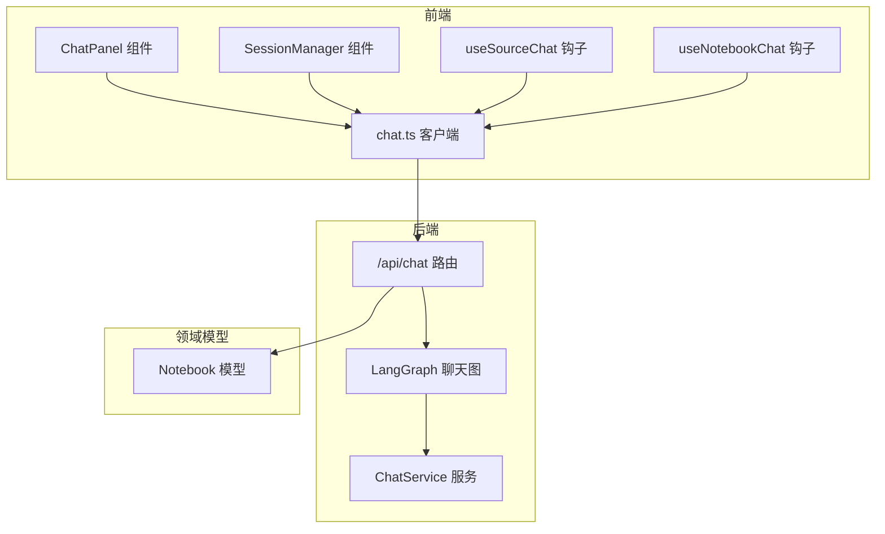
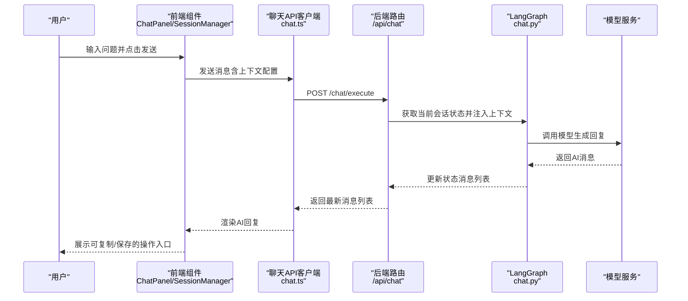
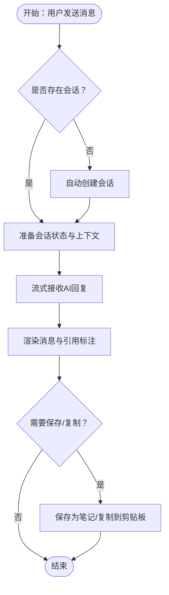
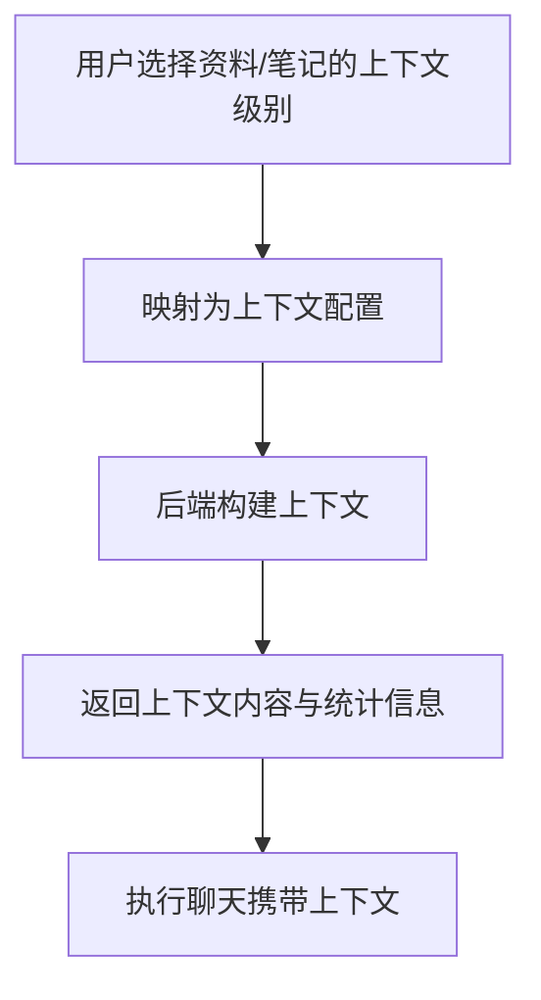
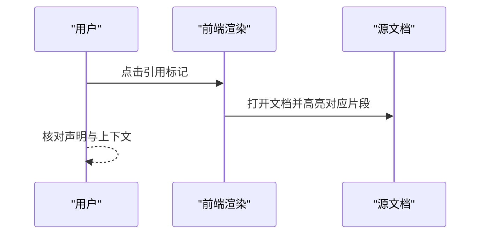
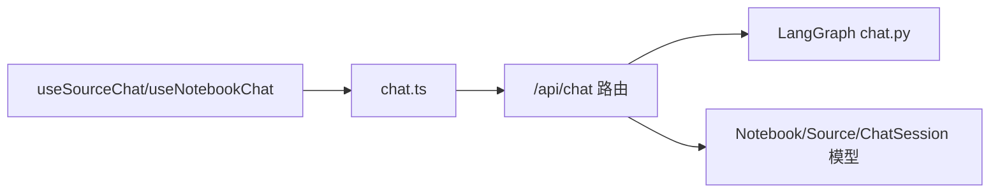

# AI聊天

<cite>
**本文引用的文件**
- [api/routers/chat.py](file://api/routers/chat.py)
- [api/chat_service.py](file://api/chat_service.py)
- [open_notebook/graphs/chat.py](file://open_notebook/graphs/chat.py)
- [open_notebook/domain/notebook.py](file://open_notebook/domain/notebook.py)
- [frontend/src/components/source/ChatPanel.tsx](file://frontend/src/components/source/ChatPanel.tsx)
- [frontend/src/components/source/SessionManager.tsx](file://frontend/src/components/source/SessionManager.tsx)
- [frontend/src/components/source/MessageActions.tsx](file://frontend/src/components/source/MessageActions.tsx)
- [frontend/src/lib/hooks/useSourceChat.ts](file://frontend/src/lib/hooks/useSourceChat.ts)
- [frontend/src/lib/hooks/useNotebookChat.ts](file://frontend/src/lib/hooks/useNotebookChat.ts)
- [frontend/src/lib/api/chat.ts](file://frontend/src/lib/api/chat.ts)
- [frontend/src/app/(dashboard)/notebooks/[id]/page.tsx](file://frontend/src/app/(dashboard)/notebooks/[id]/page.tsx)
- [frontend/src/app/(dashboard)/notebooks/components/ChatColumn.tsx](file://frontend/src/app/(dashboard)/notebooks/components/ChatColumn.tsx)
- [frontend/src/lib/types/api.ts](file://frontend/src/lib/types/api.ts)
- [docs/3-USER-GUIDE/chat-effectively.md](file://docs/3-USER-GUIDE/chat-effectively.md)
- [docs/3-USER-GUIDE/citations.md](file://docs/3-USER-GUIDE/citations.md)
- [docs/3-USER-GUIDE/interface-overview.md](file://docs/3-USER-GUIDE/interface-overview.md)
</cite>

## 目录
1. [简介](#简介)
2. [项目结构](#项目结构)
3. [核心组件](#核心组件)
4. [架构总览](#架构总览)
5. [详细组件分析](#详细组件分析)
6. [依赖关系分析](#依赖关系分析)
7. [性能考量](#性能考量)
8. [故障排查指南](#故障排查指南)
9. [结论](#结论)
10. [附录](#附录)

## 简介
本指南面向首次使用“AI聊天”功能的用户，帮助您从零开始高效地与研究资料进行对话式交互。内容涵盖：
- 如何启动首次聊天、选择上下文范围、设置聊天参数
- 上下文管理的重要性与策略：选择哪些内容源参与对话、调整上下文大小、控制AI记忆范围
- 有效提问技巧：如何提出清晰的问题、使用引导性语言、进行多轮对话
- 高级功能：消息历史管理、回复编辑、重新生成、引用标注与验证
- 实用功能：聊天会话保存、分享、导出
- 不同场景下的聊天策略与最佳实践

## 项目结构
Open Notebook 的聊天能力由前后端协同实现：
- 前端负责用户界面、上下文选择、会话管理、消息展示与交互
- 后端提供聊天会话生命周期管理、上下文构建、与模型服务的调用
- 图形编排（LangGraph）负责状态流转与模型调用

图表来源
- [frontend/src/components/source/ChatPanel.tsx](file://frontend/src/components/source/ChatPanel.tsx#L59-L325)
- [frontend/src/components/source/SessionManager.tsx](file://frontend/src/components/source/SessionManager.tsx#L44-L270)
- [frontend/src/lib/hooks/useSourceChat.ts](file://frontend/src/lib/hooks/useSourceChat.ts#L17-L200)
- [frontend/src/lib/hooks/useNotebookChat.ts](file://frontend/src/lib/hooks/useNotebookChat.ts#L26-L182)
- [frontend/src/lib/api/chat.ts](file://frontend/src/lib/api/chat.ts#L50-L69)
- [api/routers/chat.py](file://api/routers/chat.py#L96-L517)
- [open_notebook/graphs/chat.py](file://open_notebook/graphs/chat.py#L19-L94)
- [open_notebook/domain/notebook.py](file://open_notebook/domain/notebook.py#L16-L87)

章节来源
- [frontend/src/components/source/ChatPanel.tsx](file://frontend/src/components/source/ChatPanel.tsx#L59-L325)
- [frontend/src/components/source/SessionManager.tsx](file://frontend/src/components/source/SessionManager.tsx#L44-L270)
- [frontend/src/lib/hooks/useSourceChat.ts](file://frontend/src/lib/hooks/useSourceChat.ts#L17-L200)
- [frontend/src/lib/hooks/useNotebookChat.ts](file://frontend/src/lib/hooks/useNotebookChat.ts#L26-L182)
- [frontend/src/lib/api/chat.ts](file://frontend/src/lib/api/chat.ts#L50-L69)
- [api/routers/chat.py](file://api/routers/chat.py#L96-L517)
- [open_notebook/graphs/chat.py](file://open_notebook/graphs/chat.py#L19-L94)
- [open_notebook/domain/notebook.py](file://open_notebook/domain/notebook.py#L16-L87)

## 核心组件
- 聊天路由与服务
  - 提供会话创建、查询、更新、删除；执行聊天请求；构建上下文
- 前端聊天面板与会话管理
  - 负责输入、发送、显示消息、上下文指示器、会话列表与操作
- 图形编排（LangGraph）
  - 维护会话状态、调用模型、清理思考内容
- 类型定义
  - 明确前后端数据结构，包括会话、消息、上下文指标等

章节来源
- [api/routers/chat.py](file://api/routers/chat.py#L96-L517)
- [frontend/src/components/source/ChatPanel.tsx](file://frontend/src/components/source/ChatPanel.tsx#L59-L325)
- [frontend/src/components/source/SessionManager.tsx](file://frontend/src/components/source/SessionManager.tsx#L44-L270)
- [open_notebook/graphs/chat.py](file://open_notebook/graphs/chat.py#L19-L94)
- [frontend/src/lib/types/api.ts](file://frontend/src/lib/types/api.ts#L132-L242)

## 架构总览
下面的时序图展示了从用户输入到AI响应的完整流程，以及上下文构建与会话管理的关键步骤。

图表来源
- [frontend/src/lib/api/chat.ts](file://frontend/src/lib/api/chat.ts#L50-L69)
- [api/routers/chat.py](file://api/routers/chat.py#L330-L409)
- [open_notebook/graphs/chat.py](file://open_notebook/graphs/chat.py#L27-L81)

章节来源
- [frontend/src/lib/api/chat.ts](file://frontend/src/lib/api/chat.ts#L50-L69)
- [api/routers/chat.py](file://api/routers/chat.py#L330-L409)
- [open_notebook/graphs/chat.py](file://open_notebook/graphs/chat.py#L27-L81)

## 详细组件分析

### 会话管理与消息流
- 会话生命周期
  - 创建：若无会话则自动创建，标题可基于首条消息截断
  - 查询：支持按笔记本列出会话、按会话ID获取带消息的详情
  - 更新：可修改标题或模型覆盖
  - 删除：彻底移除会话及其关联状态
- 消息流
  - 前端乐观添加用户消息，流式接收AI消息，错误时回滚
  - 支持取消流式输出
- 引用标注与保存
  - AI消息渲染为Markdown，支持紧凑引用链接
  - 右侧提供“保存为笔记”“复制到剪贴板”等快捷操作

图表来源
- [frontend/src/lib/hooks/useSourceChat.ts](file://frontend/src/lib/hooks/useSourceChat.ts#L104-L200)
- [frontend/src/components/source/MessageActions.tsx](file://frontend/src/components/source/MessageActions.tsx#L16-L120)
- [frontend/src/components/source/ChatPanel.tsx](file://frontend/src/components/source/ChatPanel.tsx#L200-L375)

章节来源
- [frontend/src/lib/hooks/useSourceChat.ts](file://frontend/src/lib/hooks/useSourceChat.ts#L104-L200)
- [frontend/src/components/source/MessageActions.tsx](file://frontend/src/components/source/MessageActions.tsx#L16-L120)
- [frontend/src/components/source/ChatPanel.tsx](file://frontend/src/components/source/ChatPanel.tsx#L200-L375)

### 上下文构建与策略
- 上下文来源
  - 来自笔记本内的资料与笔记，支持三种级别：
    - 全文（Full Content）：完整文本，适合精确引用
    - 概要（Summary Only）：AI生成摘要，成本较低
    - 不在上下文中（Not In Context）：完全排除
- 构建过程
  - 前端根据用户选择映射为上下文配置，调用后端构建接口
  - 后端遍历选中的资料与笔记，拼接内容并估算字符数与令牌数
- 策略建议
  - 最小化：主资料全文，其余排除
  - 全量：全部资料全文（成本较高）
  - 分层：主资料全文，次资料概要，背景排除
  - 隐私优先：敏感资料排除

图表来源
- [frontend/src/lib/hooks/useNotebookChat.ts](file://frontend/src/lib/hooks/useNotebookChat.ts#L140-L173)
- [api/routers/chat.py](file://api/routers/chat.py#L411-L517)

章节来源
- [frontend/src/lib/hooks/useNotebookChat.ts](file://frontend/src/lib/hooks/useNotebookChat.ts#L140-L173)
- [api/routers/chat.py](file://api/routers/chat.py#L411-L517)
- [docs/3-USER-GUIDE/chat-effectively.md](file://docs/3-USER-GUIDE/chat-effectively.md#L69-L144)

### 引用标注与验证
- 引用格式
  - 内联引用标记与参考列表，点击可跳转至原文片段
- 验证流程
  - 读取AI回复 → 点击引用 → 查看原文片段 → 对比是否准确
- 质量提升
  - 使用“全文”上下文以获得更精确的引用
  - 在问题中明确要求页码或具体段落
  - 当引用缺失或不准确时，要求AI补充或修正

图表来源
- [frontend/src/components/source/ChatPanel.tsx](file://frontend/src/components/source/ChatPanel.tsx#L327-L375)
- [docs/3-USER-GUIDE/citations.md](file://docs/3-USER-GUIDE/citations.md#L18-L95)

章节来源
- [frontend/src/components/source/ChatPanel.tsx](file://frontend/src/components/source/ChatPanel.tsx#L327-L375)
- [docs/3-USER-GUIDE/citations.md](file://docs/3-USER-GUIDE/citations.md#L18-L95)

### 会话保存、分享与导出
- 保存为笔记
  - 在AI回复气泡右侧点击“保存为笔记”，自动创建类型为“AI”的笔记
- 导出与复制
  - 复制到剪贴板保留Markdown链接
  - 导出时保持引用链接与结构化格式
- 分享
  - 将会话作为笔记保存后，可在笔记中进一步分享与协作

章节来源
- [frontend/src/components/source/MessageActions.tsx](file://frontend/src/components/source/MessageActions.tsx#L21-L33)
- [docs/3-USER-GUIDE/citations.md](file://docs/3-USER-GUIDE/citations.md#L154-L163)

### 不同场景下的聊天策略与最佳实践
- 探索阶段：使用概要上下文与便宜模型，快速了解主题
- 深度分析：切换为主资料全文，使用更强模型，聚焦细节与引用
- 综合比较：多资料对比，逐步增加上下文规模
- 决策支持：结合多个来源，提出可操作问题，要求给出权衡与建议

章节来源
- [docs/3-USER-GUIDE/chat-effectively.md](file://docs/3-USER-GUIDE/chat-effectively.md#L362-L411)
- [docs/3-USER-GUIDE/chat-effectively.md](file://docs/3-USER-GUIDE/chat-effectively.md#L414-L472)

## 依赖关系分析
- 前端依赖
  - React Query 管理会话与消息的查询与缓存
  - TanStack Table/Dialog/Tooltip 等UI组件库
  - 自定义Hook封装API调用与状态管理
- 后端依赖
  - FastAPI 路由与Pydantic模型校验
  - LangGraph 状态机与Sqlite检查点
  - SurrealDB 查询与记录ID处理

图表来源
- [frontend/src/lib/hooks/useSourceChat.ts](file://frontend/src/lib/hooks/useSourceChat.ts#L17-L200)
- [frontend/src/lib/hooks/useNotebookChat.ts](file://frontend/src/lib/hooks/useNotebookChat.ts#L26-L182)
- [frontend/src/lib/api/chat.ts](file://frontend/src/lib/api/chat.ts#L50-L69)
- [api/routers/chat.py](file://api/routers/chat.py#L96-L517)
- [open_notebook/graphs/chat.py](file://open_notebook/graphs/chat.py#L19-L94)
- [open_notebook/domain/notebook.py](file://open_notebook/domain/notebook.py#L16-L87)

章节来源
- [frontend/src/lib/hooks/useSourceChat.ts](file://frontend/src/lib/hooks/useSourceChat.ts#L17-L200)
- [frontend/src/lib/hooks/useNotebookChat.ts](file://frontend/src/lib/hooks/useNotebookChat.ts#L26-L182)
- [frontend/src/lib/api/chat.ts](file://frontend/src/lib/api/chat.ts#L50-L69)
- [api/routers/chat.py](file://api/routers/chat.py#L96-L517)
- [open_notebook/graphs/chat.py](file://open_notebook/graphs/chat.py#L19-L94)
- [open_notebook/domain/notebook.py](file://open_notebook/domain/notebook.py#L16-L87)

## 性能考量
- 控制上下文规模
  - 通过“概要”模式减少令牌消耗，提高响应速度
- 选择合适模型
  - 探索阶段使用轻量模型，深度分析阶段使用更强模型
- 优化问题表述
  - 简洁明确的问题可降低令牌用量与等待时间
- 会话管理
  - 长对话可考虑归档旧会话，避免历史过长导致成本上升

## 故障排查指南
- 无法找到会话或笔记本
  - 确认ID格式与权限，检查是否存在关联关系
- 无引用或引用不准确
  - 检查上下文是否包含相关资料；要求AI提供页码或具体位置
- 回复泛泛而谈
  - 重新提问，明确范围、约束与验证方式
- 成本过高
  - 减少上下文数量与级别，缩短问题长度，选择更便宜模型

章节来源
- [docs/3-USER-GUIDE/chat-effectively.md](file://docs/3-USER-GUIDE/chat-effectively.md#L474-L495)
- [docs/3-USER-GUIDE/citations.md](file://docs/3-USER-GUIDE/citations.md#L188-L247)

## 结论
通过合理选择上下文、掌握提问技巧、善用引用标注与会话管理，您可以将AI聊天从“可有可无”的工具转变为“研究伙伴”。建议在探索阶段采用“概要+低价模型”，在深度分析阶段切换“全文+强模型”，并在每次对话后将有价值的结果保存为笔记，形成可追溯的研究资产。

## 附录
- 快速上手步骤
  - 进入笔记本 → 点击“聊天” → 选择上下文（资料/笔记） → 输入问题 → 查看引用并验证 → 保存为笔记
- 常用操作
  - 新建/切换/重命名/删除会话
  - 切换模型覆盖
  - 复制/保存/导出回复
  - 调整上下文级别与范围

章节来源
- [docs/3-USER-GUIDE/interface-overview.md](file://docs/3-USER-GUIDE/interface-overview.md#L300-L323)
- [docs/3-USER-GUIDE/chat-effectively.md](file://docs/3-USER-GUIDE/chat-effectively.md#L7-L21)