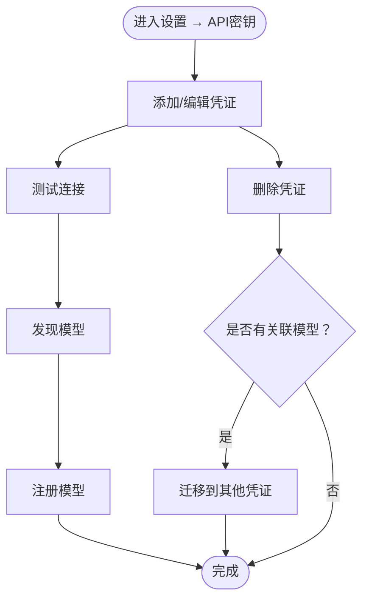

# API配置

<cite>
**本文引用的文件**
- [api/routers/credentials.py](file://api/routers/credentials.py)
- [api/credentials_service.py](file://api/credentials_service.py)
- [open_notebook/domain/credential.py](file://open_notebook/domain/credential.py)
- [open_notebook/utils/encryption.py](file://open_notebook/utils/encryption.py)
- [open_notebook/ai/connection_tester.py](file://open_notebook/ai/connection_tester.py)
- [open_notebook/ai/key_provider.py](file://open_notebook/ai/key_provider.py)
- [api/models.py](file://api/models.py)
- [frontend/src/app/(dashboard)/settings/api-keys/page.tsx](file://frontend/src/app/(dashboard)/settings/api-keys/page.tsx)
- [docs/3-USER-GUIDE/api-configuration.md](file://docs/3-USER-GUIDE/api-configuration.md)
- [docs/5-CONFIGURATION/ai-providers.md](file://docs/5-CONFIGURATION/ai-providers.md)
- [docs/5-CONFIGURATION/security.md](file://docs/5-CONFIGURATION/security.md)
- [docs/6-TROUBLESHOOTING/connection-issues.md](file://docs/6-TROUBLESHOOTING/connection-issues.md)
- [api/routers/config.py](file://api/routers/config.py)
</cite>

## 目录
1. [简介](#简介)
2. [项目结构](#项目结构)
3. [核心组件](#核心组件)
4. [架构总览](#架构总览)
5. [详细组件分析](#详细组件分析)
6. [依赖关系分析](#依赖关系分析)
7. [性能考虑](#性能考虑)
8. [故障排除指南](#故障排除指南)
9. [结论](#结论)
10. [附录](#附录)

## 简介
本指南面向需要在系统中配置和管理AI提供商API密钥的用户与运维人员。内容覆盖：
- 通过设置界面配置OpenAI、Anthropic、Google、Groq、Mistral、DeepSeek、xAI、OpenRouter、Voyage AI、ElevenLabs、Ollama、Azure OpenAI、OpenAI兼容服务、Vertex AI等主流服务商。
- API密钥的安全存储与加密机制（Fernet对称加密）。
- 不同提供商的配置步骤与注意事项。
- API连接测试方法与故障排除流程。
- Azure与兼容OpenAI协议服务的配置要点。
- 密钥管理：新增、更新、删除、迁移与轮换策略。
- 使用限额、计费监控与成本控制建议。
- 配置与系统其他功能的集成关系。
- 常见配置错误的原因与解决方案。

## 项目结构
Open Notebook采用前后端分离架构，API配置功能由后端FastAPI路由与服务层、领域模型与工具模块共同实现，并通过前端Next.js页面提供可视化配置界面。

图表来源
- [frontend/src/app/(dashboard)/settings/api-keys/page.tsx](file://frontend/src/app/(dashboard)/settings/api-keys/page.tsx#L1-L1396)
- [api/routers/credentials.py](file://api/routers/credentials.py#L1-L387)
- [api/credentials_service.py](file://api/credentials_service.py#L1-L884)
- [open_notebook/domain/credential.py](file://open_notebook/domain/credential.py#L1-L200)
- [open_notebook/utils/encryption.py](file://open_notebook/utils/encryption.py#L1-L199)
- [open_notebook/ai/connection_tester.py](file://open_notebook/ai/connection_tester.py#L1-L439)
- [open_notebook/ai/key_provider.py](file://open_notebook/ai/key_provider.py#L200-L243)

章节来源
- [frontend/src/app/(dashboard)/settings/api-keys/page.tsx](file://frontend/src/app/(dashboard)/settings/api-keys/page.tsx#L1-L1396)
- [api/routers/credentials.py](file://api/routers/credentials.py#L1-L387)
- [api/credentials_service.py](file://api/credentials_service.py#L1-L884)

## 核心组件
- 设置界面（前端）：提供“添加凭证”“测试连接”“发现模型”“注册模型”“删除凭证”等交互。
- 凭证路由（后端）：暴露REST接口，负责凭证的增删改查、测试、发现与注册。
- 凭证服务：业务逻辑层，执行凭证校验、URL验证、连接测试、模型发现与注册、迁移等。
- 凭证领域模型：封装数据库记录，处理加密存储与解密读取。
- 加密工具：基于Fernet的对称加密，确保API密钥在数据库中的安全存储。
- 连接测试器：针对各提供商进行最小化连通性测试，避免产生费用。
- 环境变量注入：从数据库凭证动态注入到运行时环境变量，供底层SDK使用。

章节来源
- [api/routers/credentials.py](file://api/routers/credentials.py#L1-L387)
- [api/credentials_service.py](file://api/credentials_service.py#L1-L884)
- [open_notebook/domain/credential.py](file://open_notebook/domain/credential.py#L1-L200)
- [open_notebook/utils/encryption.py](file://open_notebook/utils/encryption.py#L1-L199)
- [open_notebook/ai/connection_tester.py](file://open_notebook/ai/connection_tester.py#L1-L439)
- [open_notebook/ai/key_provider.py](file://open_notebook/ai/key_provider.py#L200-L243)

## 架构总览
下图展示了从设置界面到后端服务、再到提供商的调用链路与数据流。

图表来源
- [api/routers/credentials.py](file://api/routers/credentials.py#L1-L387)
- [api/credentials_service.py](file://api/credentials_service.py#L1-L884)
- [open_notebook/domain/credential.py](file://open_notebook/domain/credential.py#L1-L200)
- [open_notebook/utils/encryption.py](file://open_notebook/utils/encryption.py#L1-L199)
- [open_notebook/ai/connection_tester.py](file://open_notebook/ai/connection_tester.py#L1-L439)

## 详细组件分析

### 设置界面与交互流程
- 用户在“设置 → API密钥”中添加或编辑凭证，填写名称、提供商类型、必要字段（如API Key、Base URL、Endpoint、API版本、项目/位置等），并可选择模态类型（语言、嵌入、TTS、STT）。
- 点击“测试连接”触发后端连通性测试；点击“发现模型”拉取可用模型列表；点击“注册模型”将选中模型与凭证关联。
- 删除凭证时，若存在已链接模型，需选择“删除模型”或“迁移到其他凭证”。

图表来源
- [frontend/src/app/(dashboard)/settings/api-keys/page.tsx](file://frontend/src/app/(dashboard)/settings/api-keys/page.tsx#L1-L1396)
- [api/routers/credentials.py](file://api/routers/credentials.py#L1-L387)

章节来源
- [frontend/src/app/(dashboard)/settings/api-keys/page.tsx](file://frontend/src/app/(dashboard)/settings/api-keys/page.tsx#L1-L1396)
- [api/routers/credentials.py](file://api/routers/credentials.py#L1-L387)

### 凭证模型与加密存储
- 凭证模型支持多种提供商字段（API Key、Base URL、Endpoint、API版本、服务端点、项目/位置、凭据路径等）。
- 写入数据库前对API Key进行加密；读取时自动解密，保证密钥只在内存中以明文形式短暂出现。
- 支持Docker Secrets方式加载加密密钥与应用密码，提升生产部署安全性。

图表来源
- [open_notebook/domain/credential.py](file://open_notebook/domain/credential.py#L1-L200)
- [open_notebook/utils/encryption.py](file://open_notebook/utils/encryption.py#L1-L199)

章节来源
- [open_notebook/domain/credential.py](file://open_notebook/domain/credential.py#L1-L200)
- [open_notebook/utils/encryption.py](file://open_notebook/utils/encryption.py#L1-L199)

### 连接测试与模型发现
- 后端为每个提供商定义了最小化测试模型（如gpt-3.5-turbo、claude-3-haiku、gemini-2.0-flash等），用于低成本连通性验证。
- 对于Azure OpenAI、Ollama、OpenAI兼容服务等特殊提供商，采用专门的测试逻辑（列举模型、检查端点可达性等）。
- 模型发现支持静态列表（Anthropic、Voyage、ElevenLabs）与API枚举（OpenAI风格/Google Vertex等）。

图表来源
- [api/routers/credentials.py](file://api/routers/credentials.py#L313-L317)
- [api/credentials_service.py](file://api/credentials_service.py#L356-L466)
- [open_notebook/ai/connection_tester.py](file://open_notebook/ai/connection_tester.py#L170-L300)

章节来源
- [api/credentials_service.py](file://api/credentials_service.py#L356-L466)
- [open_notebook/ai/connection_tester.py](file://open_notebook/ai/connection_tester.py#L1-L439)

### URL验证与SSRF防护
- 对URL格式进行严格校验，仅允许http/https方案；阻断链路本地地址（169.254.x.x）等危险地址，防止SSRF风险。
- 允许私有IP与本地回环地址用于自托管场景（如Ollama/LM Studio），但禁止解析到链路本地地址的主机名。

章节来源
- [api/credentials_service.py](file://api/credentials_service.py#L85-L185)

### Azure与OpenAI兼容服务配置
- Azure OpenAI：至少需要API Key、Endpoint、API Version；可选配置服务级端点（LLM、Embedding、STT、TTS）。
- OpenAI兼容：配置Base URL与可选API Key；可为不同服务类型（LLM、Embedding、STT、TTS）分别指定端点。
- Vertex AI：配置项目ID、区域与凭据路径（可选）。

章节来源
- [docs/3-USER-GUIDE/api-configuration.md](file://docs/3-USER-GUIDE/api-configuration.md#L209-L237)
- [docs/5-CONFIGURATION/ai-providers.md](file://docs/5-CONFIGURATION/ai-providers.md#L372-L400)
- [api/credentials_service.py](file://api/credentials_service.py#L48-L60)

### 凭证迁移与环境变量兼容
- 支持从旧版ProviderConfig与环境变量迁移至数据库凭证，保留加密与一致性。
- 迁移时会跳过已在数据库存在的同名凭证，避免重复。

章节来源
- [api/credentials_service.py](file://api/credentials_service.py#L686-L791)
- [api/credentials_service.py](file://api/credentials_service.py#L794-L884)

### 前端凭证表单与模型选择
- 前端根据提供商类型动态显示必填/可选字段；支持多模态勾选；提供“发现模型”对话框，支持搜索与自定义模型输入。
- 删除凭证时，若存在已链接模型，提供“迁移到其他凭证”选项，避免破坏性删除。

章节来源
- [frontend/src/app/(dashboard)/settings/api-keys/page.tsx](file://frontend/src/app/(dashboard)/settings/api-keys/page.tsx#L149-L377)
- [frontend/src/app/(dashboard)/settings/api-keys/page.tsx](file://frontend/src/app/(dashboard)/settings/api-keys/page.tsx#L383-L630)

## 依赖关系分析
- 路由层依赖服务层；服务层依赖领域模型、加密工具与连接测试器；领域模型依赖加密工具；连接测试器依赖SDK；环境变量注入依赖凭证模型。
- URL验证与SSRF防护贯穿服务层，确保外部输入安全。
- 前端仅接收非敏感元数据（不含实际API Key），保障密钥不被泄露。

图表来源
- [api/routers/credentials.py](file://api/routers/credentials.py#L1-L387)
- [api/credentials_service.py](file://api/credentials_service.py#L1-L884)
- [open_notebook/domain/credential.py](file://open_notebook/domain/credential.py#L1-L200)
- [open_notebook/utils/encryption.py](file://open_notebook/utils/encryption.py#L1-L199)
- [open_notebook/ai/connection_tester.py](file://open_notebook/ai/connection_tester.py#L1-L439)
- [open_notebook/ai/key_provider.py](file://open_notebook/ai/key_provider.py#L200-L243)

章节来源
- [api/routers/credentials.py](file://api/routers/credentials.py#L1-L387)
- [api/credentials_service.py](file://api/credentials_service.py#L1-L884)

## 性能考虑
- 测试使用最小化模型，降低网络与费用开销。
- 数据库健康检查与版本检查带缓存，避免频繁外部请求。
- URL验证在创建/更新阶段执行，减少后续调用失败概率。
- 建议在高并发场景下合理设置超时与重试策略（参考连接问题排查文档中的环境变量）。

章节来源
- [open_notebook/ai/connection_tester.py](file://open_notebook/ai/connection_tester.py#L19-L38)
- [api/routers/config.py](file://api/routers/config.py#L1-L161)
- [docs/6-TROUBLESHOOTING/connection-issues.md](file://docs/6-TROUBLESHOOTING/connection-issues.md#L134-L177)

## 故障排除指南
- “无法连接服务器”：检查API服务是否启动、端口映射、防火墙与反向代理配置。
- “连接被拒绝/超时”：核对端点URL、网络连通性、代理与DNS设置。
- “401未授权/403禁止访问”：确认API Key格式正确、权限范围满足要求、IP白名单配置。
- “密钥未保存/加密失败”：确保已设置OPEN_NOTEBOOK_ENCRYPTION_KEY，且值有效。
- “迁移失败/部分迁移”：查看迁移日志，修复冲突后重试。
- “提供商显示未配置”：检查是否存在对应凭证、是否已测试通过、是否重新发现并注册模型。

章节来源
- [docs/6-TROUBLESHOOTING/connection-issues.md](file://docs/6-TROUBLESHOOTING/connection-issues.md#L1-L448)
- [docs/3-USER-GUIDE/api-configuration.md](file://docs/3-USER-GUIDE/api-configuration.md#L324-L384)
- [api/credentials_service.py](file://api/credentials_service.py#L686-L791)

## 结论
通过设置界面与后端服务的协同，Open Notebook实现了安全、直观且可扩展的API配置能力。加密存储、最小化测试与严格的URL验证共同保障了安全性与稳定性。建议在生产环境中启用Docker Secrets、定期轮换密钥并结合监控告警实现成本控制。

## 附录

### API配置与系统其他功能的集成关系
- 凭证与模型：凭证保存后可发现并注册模型，模型再与默认设置、转换与笔记等功能联动。
- 环境变量注入：数据库中的凭证可动态注入到运行时环境变量，供底层SDK直接使用。
- 安全与认证：前端登录与后端认证配合，确保API访问受控。

章节来源
- [open_notebook/ai/key_provider.py](file://open_notebook/ai/key_provider.py#L200-L243)
- [docs/5-CONFIGURATION/security.md](file://docs/5-CONFIGURATION/security.md#L1-L397)

### 常见配置错误与解决方案
- 错误：保存凭证时报“未设置加密密钥”
  - 解决：在部署中设置OPEN_NOTEBOOK_ENCRYPTION_KEY并重启服务。
- 错误：测试连接提示“无效API Key”
  - 解决：核对Key来源与格式，确保账户已启用计费或访问权限。
- 错误：Azure连接失败
  - 解决：确认Endpoint、API Version、Key正确，必要时使用服务级端点覆盖。
- 错误：Ollama连接失败
  - 解决：确认Ollama服务已启动、URL可达、模型已下载。

章节来源
- [docs/3-USER-GUIDE/api-configuration.md](file://docs/3-USER-GUIDE/api-configuration.md#L324-L384)
- [open_notebook/ai/connection_tester.py](file://open_notebook/ai/connection_tester.py#L40-L130)