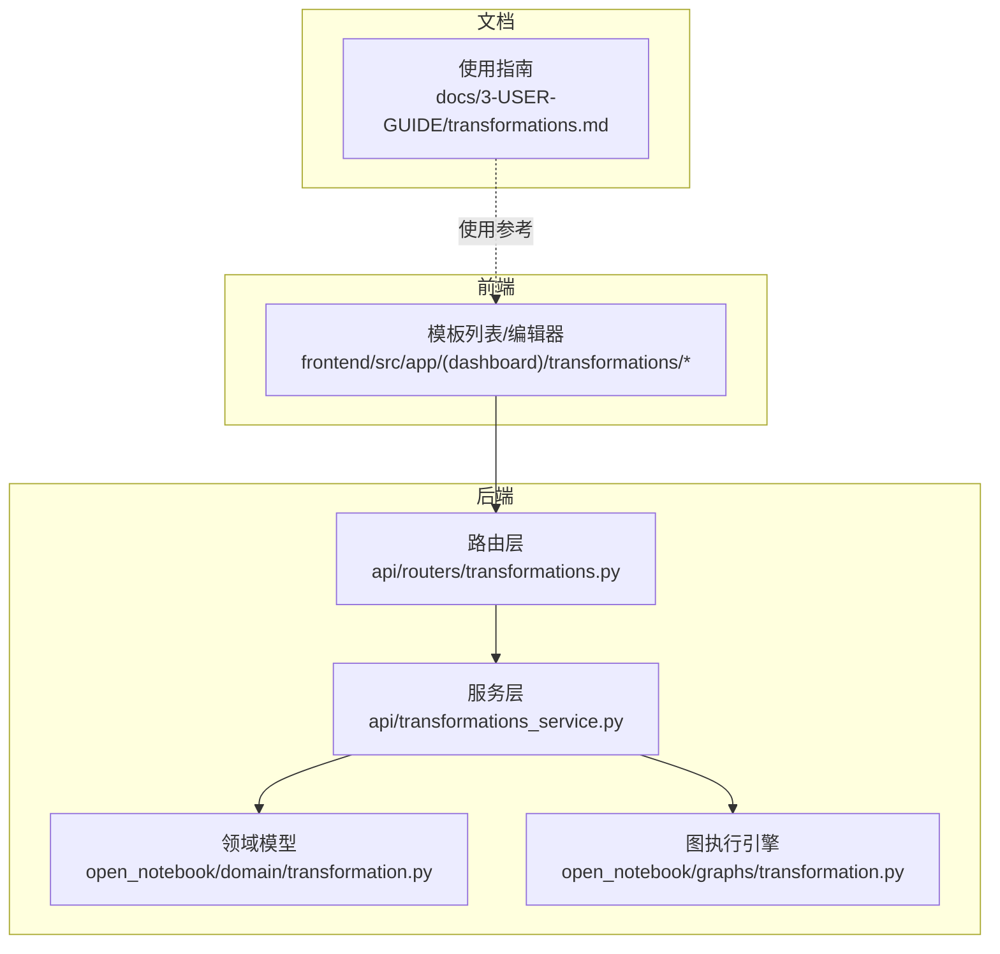
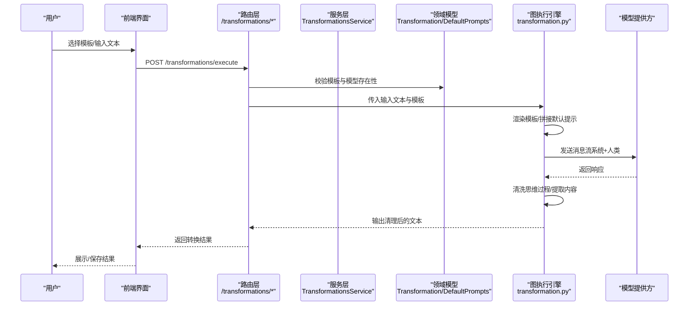
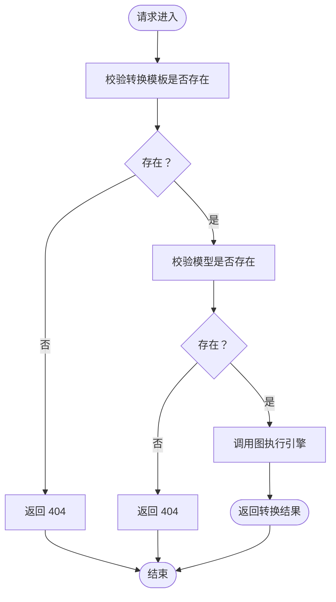
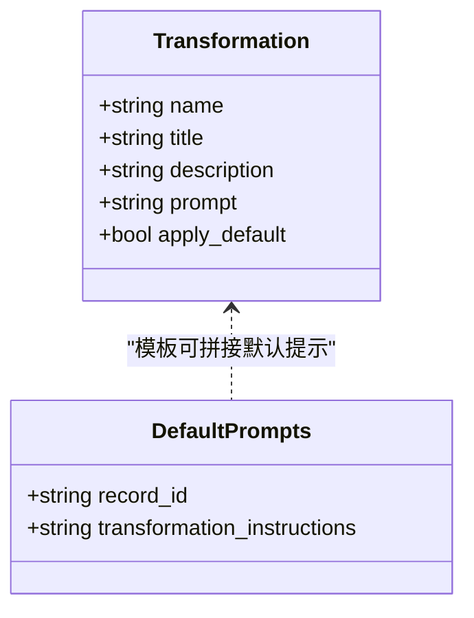
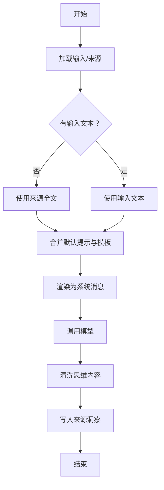
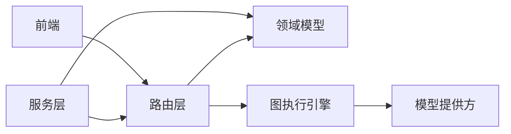

# 内容转换

<cite>
**本文引用的文件**
- [api/routers/transformations.py](file://api/routers/transformations.py)
- [api/transformations_service.py](file://api/transformations_service.py)
- [open_notebook/domain/transformation.py](file://open_notebook/domain/transformation.py)
- [open_notebook/graphs/transformation.py](file://open_notebook/graphs/transformation.py)
- [docs/3-USER-GUIDE/transformations.md](file://docs/3-USER-GUIDE/transformations.md)
- [api/models.py](file://api/models.py)
</cite>

## 目录
1. [简介](#简介)
2. [项目结构](#项目结构)
3. [核心组件](#核心组件)
4. [架构总览](#架构总览)
5. [详细组件分析](#详细组件分析)
6. [依赖关系分析](#依赖关系分析)
7. [性能考虑](#性能考虑)
8. [故障排查指南](#故障排查指南)
9. [结论](#结论)
10. [附录](#附录)

## 简介
内容转换（Transformations）是本系统中用于对多份来源内容进行“同构化、批量化”的智能分析与结构化输出能力。其核心目标包括：
- 批量处理：对多个来源一次性应用相同的分析模板，避免重复提问或手动整理
- 标准化输出：通过统一的提示词模板，确保不同来源的输出格式一致、可比较
- 模板驱动：内置多种常用模板，并支持用户自定义模板，满足不同业务场景
- 结果管理：生成的结构化笔记自动归档到笔记本中，便于查看、编辑、重跑与批量操作
- 集成关系：与笔记、播客、搜索等模块协同工作，形成“内容采集—转换—沉淀—检索”的闭环

## 项目结构
围绕内容转换功能，后端由路由层、服务层、领域模型与图执行引擎构成；前端提供模板列表、编辑器与运行面板；文档提供使用指南与最佳实践。

图表来源
- [api/routers/transformations.py](file://api/routers/transformations.py#L1-L251)
- [api/transformations_service.py](file://api/transformations_service.py#L1-L142)
- [open_notebook/domain/transformation.py](file://open_notebook/domain/transformation.py#L1-L22)
- [open_notebook/graphs/transformation.py](file://open_notebook/graphs/transformation.py#L1-L68)
- [docs/3-USER-GUIDE/transformations.md](file://docs/3-USER-GUIDE/transformations.md#L1-L403)

章节来源
- [api/routers/transformations.py](file://api/routers/transformations.py#L1-L251)
- [api/transformations_service.py](file://api/transformations_service.py#L1-L142)
- [open_notebook/domain/transformation.py](file://open_notebook/domain/transformation.py#L1-L22)
- [open_notebook/graphs/transformation.py](file://open_notebook/graphs/transformation.py#L1-L68)
- [docs/3-USER-GUIDE/transformations.md](file://docs/3-USER-GUIDE/transformations.md#L1-L403)

## 核心组件
- 路由层（FastAPI）：提供获取/创建/更新/删除转换模板、执行转换、获取/更新默认提示等接口
- 服务层：封装API调用，负责数据转换与调用后端接口
- 领域模型：定义转换模板与默认提示的持久化结构
- 图执行引擎：基于LangGraph的状态机，串联模板渲染、模型调用与结果清洗
- 前端组件：模板列表、编辑器、运行面板与演练场
- 文档指南：内置模板说明、自定义流程、最佳实践与常见问题

章节来源
- [api/routers/transformations.py](file://api/routers/transformations.py#L23-L251)
- [api/transformations_service.py](file://api/transformations_service.py#L14-L142)
- [open_notebook/domain/transformation.py](file://open_notebook/domain/transformation.py#L8-L22)
- [open_notebook/graphs/transformation.py](file://open_notebook/graphs/transformation.py#L13-L68)
- [docs/3-USER-GUIDE/transformations.md](file://docs/3-USER-GUIDE/transformations.md#L1-L403)

## 架构总览
内容转换的端到端流程如下：

图表来源
- [api/routers/transformations.py](file://api/routers/transformations.py#L81-L117)
- [open_notebook/graphs/transformation.py](file://open_notebook/graphs/transformation.py#L20-L61)
- [api/models.py](file://api/models.py#L142-L158)

## 详细组件分析

### 路由层（API 路由）
- 提供以下关键接口：
  - 获取所有模板、获取单个模板、创建模板、更新模板、删除模板
  - 执行模板：校验模板与模型存在性，调用图执行引擎，返回输出
  - 默认提示：获取与更新全局默认提示，作为模板前缀增强一致性
- 错误处理：捕获未找到、输入非法与通用异常，统一返回HTTP状态码与错误信息

图表来源
- [api/routers/transformations.py](file://api/routers/transformations.py#L81-L117)

章节来源
- [api/routers/transformations.py](file://api/routers/transformations.py#L23-L251)
- [api/models.py](file://api/models.py#L104-L171)

### 服务层（TransformationsService）
- 封装对后端API的调用，负责：
  - 列表与详情查询
  - 创建、更新、删除
  - 执行转换并返回结果
- 数据映射：将API响应转换为领域对象，便于上层复用

章节来源
- [api/transformations_service.py](file://api/transformations_service.py#L14-L142)

### 领域模型（Transformation/DefaultPrompts）
- Transformation：模板实体，包含名称、标题、描述、提示词与是否默认应用标记
- DefaultPrompts：记录型实体，存储全局默认提示，作为模板前缀拼接

图表来源
- [open_notebook/domain/transformation.py](file://open_notebook/domain/transformation.py#L8-L22)

章节来源
- [open_notebook/domain/transformation.py](file://open_notebook/domain/transformation.py#L1-L22)

### 图执行引擎（LangGraph）
- 状态结构：包含输入文本、来源对象、转换模板与输出
- 执行逻辑：
  - 若无显式输入文本，则从来源对象读取全文
  - 合并默认提示与模板提示，追加“# INPUT”分隔
  - 渲染模板为系统消息，结合人类消息发送给模型
  - 清洗模型输出中的“思考内容”，写入来源洞察
- 并发与异步：图编译后可并发执行，适合批量处理

图表来源
- [open_notebook/graphs/transformation.py](file://open_notebook/graphs/transformation.py#L13-L68)

章节来源
- [open_notebook/graphs/transformation.py](file://open_notebook/graphs/transformation.py#L1-L68)

### 前端组件与使用指南
- 组件职责：模板列表、编辑器、演练场、批量应用面板
- 使用指南要点：
  - 内置模板：摘要、关键概念、方法论、要点、问题等
  - 自定义模板：命名、编写提示词、格式要求、引用页码、长度限制
  - 应用方式：单源转换、批量转换（并行处理）
  - 结果管理：笔记命名规则、标签、链接原始来源、编辑与重跑
  - 最佳实践：先测试再批量、明确格式与引用、质量控制与迭代

章节来源
- [docs/3-USER-GUIDE/transformations.md](file://docs/3-USER-GUIDE/transformations.md#L1-L403)

## 依赖关系分析
- 路由层依赖领域模型与图执行引擎
- 服务层依赖API客户端与领域模型
- 图执行引擎依赖模型提供方与清洗工具
- 前端依赖路由层提供的REST接口

图表来源
- [api/routers/transformations.py](file://api/routers/transformations.py#L1-L251)
- [api/transformations_service.py](file://api/transformations_service.py#L1-L142)
- [open_notebook/graphs/transformation.py](file://open_notebook/graphs/transformation.py#L1-L68)

章节来源
- [api/routers/transformations.py](file://api/routers/transformations.py#L1-L251)
- [api/transformations_service.py](file://api/transformations_service.py#L1-L142)
- [open_notebook/graphs/transformation.py](file://open_notebook/graphs/transformation.py#L1-L68)

## 性能考虑
- 批量处理：图执行引擎支持并发，建议在模板稳定后再进行批量应用
- 模型选择：根据任务复杂度选择合适上下文与成本的模型；必要时拆分长文本
- 输出清洗：自动去除模型“思考内容”，减少后续人工处理
- 异步与后台：大批次转换可在后台执行，避免阻塞UI
- 最佳实践：
  - 先在少量样本上测试模板，再进行大批量
  - 明确输出格式与长度，提升稳定性
  - 对长文档进行分段处理，降低上下文压力

## 故障排查指南
- 404：模板或模型不存在
  - 检查模板ID与模型ID是否正确
- 400：输入非法
  - 检查必填字段与格式
- 500：执行失败
  - 查看日志定位异常
  - 简化提示词或拆分输入
  - 确认来源已完全处理
- 常见问题与对策
  - 输出过于宽泛：细化提示词、增加格式约束
  - 缺失关键信息：显式要求所需字段
  - 格式不一致：在模板中加入清晰的格式指令
  - 输出过长/过短：设置字数或小节长度范围
  - 处理失败：检查来源状态、缩短/简化提示、逐个处理

章节来源
- [api/routers/transformations.py](file://api/routers/transformations.py#L42-L46)
- [docs/3-USER-GUIDE/transformations.md](file://docs/3-USER-GUIDE/transformations.md#L334-L363)

## 结论
内容转换以“模板驱动 + 批量执行 + 标准化输出”为核心，既能快速完成重复性分析，又能保证结果的一致性与可编辑性。通过内置模板与自定义模板的组合，配合前后端协作与图执行引擎，可高效构建知识体系与结构化笔记库。

## 附录

### 内置转换模板与适用场景
- 摘要：快速概览，适合快速查阅
- 关键概念：术语提取，适合学习新主题
- 方法论：研究方法提取，适合学术论文
- 要点：行动建议提取，适合商业文档
- 问题：启发式问题生成，适合文献综述

章节来源
- [docs/3-USER-GUIDE/transformations.md](file://docs/3-USER-GUIDE/transformations.md#L34-L77)

### 自定义转换模板创建流程
- 步骤
  - 进入“转换”页面，点击“新建”
  - 填写名称与描述
  - 编写提示词模板：明确格式、结构、引用与长度
  - 保存并测试（单源）
  - 批量应用（并行）

章节来源
- [docs/3-USER-GUIDE/transformations.md](file://docs/3-USER-GUIDE/transformations.md#L80-L131)

### 执行过程与关键节点
- 输入验证：模板与模型存在性校验
- 模板应用：默认提示拼接、模板渲染、消息构造
- 输出生成：模型调用、内容清洗、写入洞察
- 错误处理：异常捕获与HTTP状态码返回

章节来源
- [api/routers/transformations.py](file://api/routers/transformations.py#L81-L117)
- [open_notebook/graphs/transformation.py](file://open_notebook/graphs/transformation.py#L20-L61)

### 结果管理与批量操作
- 结果落盘：每个来源生成一条笔记，带模板标签与来源链接
- 编辑与重跑：可在笔记中编辑，按需重新执行模板
- 批量操作：在转换页面勾选多个来源，一键并行应用

章节来源
- [docs/3-USER-GUIDE/transformations.md](file://docs/3-USER-GUIDE/transformations.md#L256-L307)
- [docs/3-USER-GUIDE/transformations.md](file://docs/3-USER-GUIDE/transformations.md#L145-L154)

### 与笔记、播客、搜索的集成
- 笔记：转换结果直接生成结构化笔记，便于组织与检索
- 播客：可将播客转文字后作为输入，套用相同模板
- 搜索：转换结果纳入向量索引，支持后续检索与问答

章节来源
- [docs/3-USER-GUIDE/transformations.md](file://docs/3-USER-GUIDE/transformations.md#L283-L291)