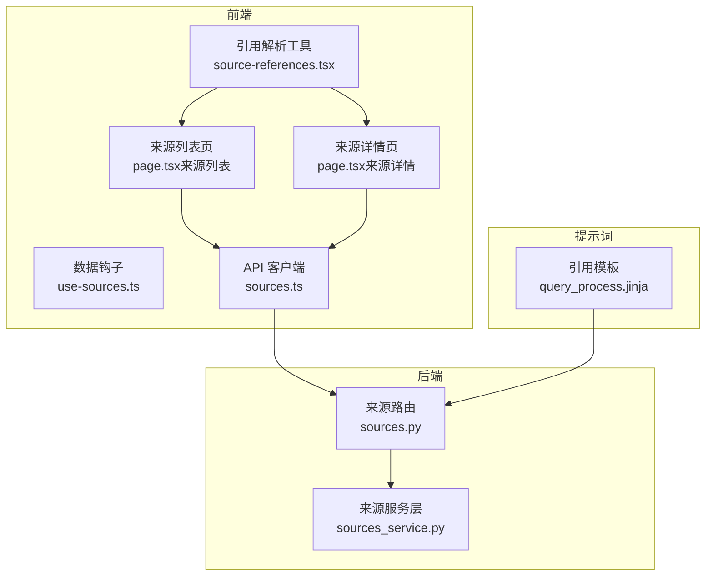
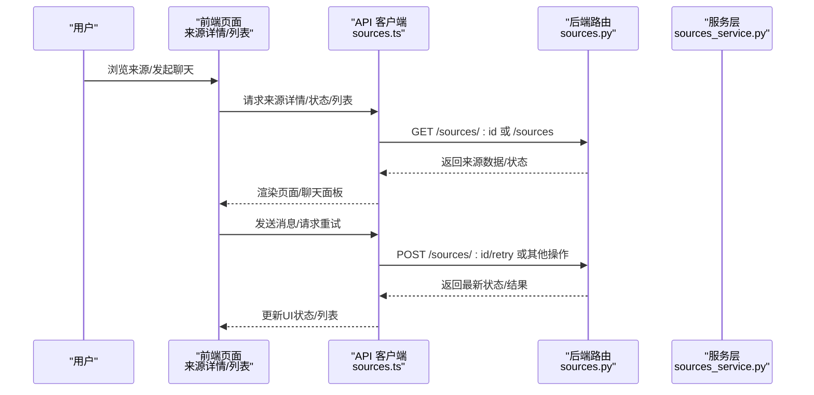
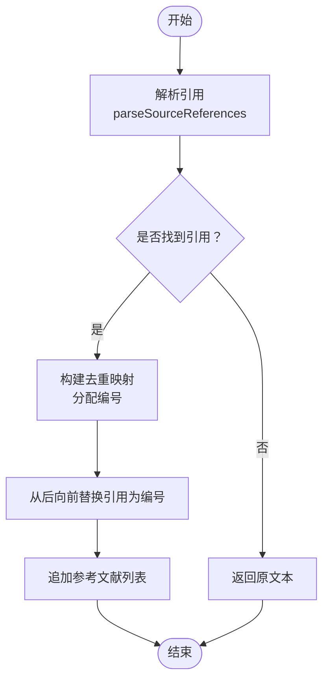
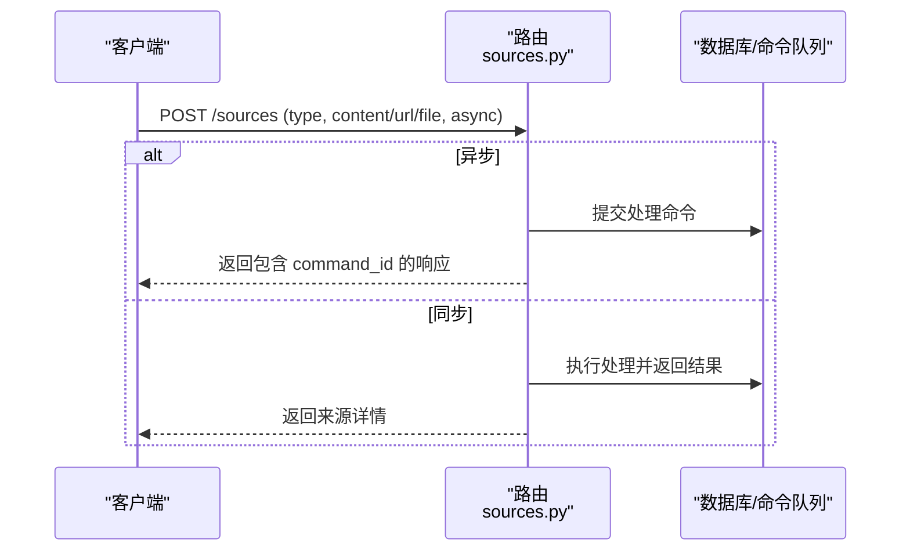
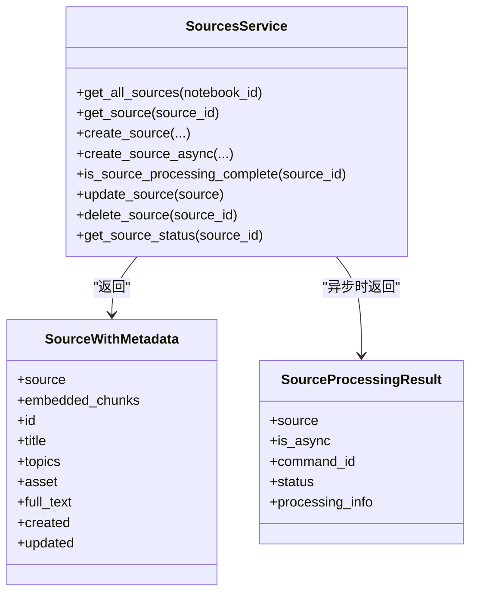
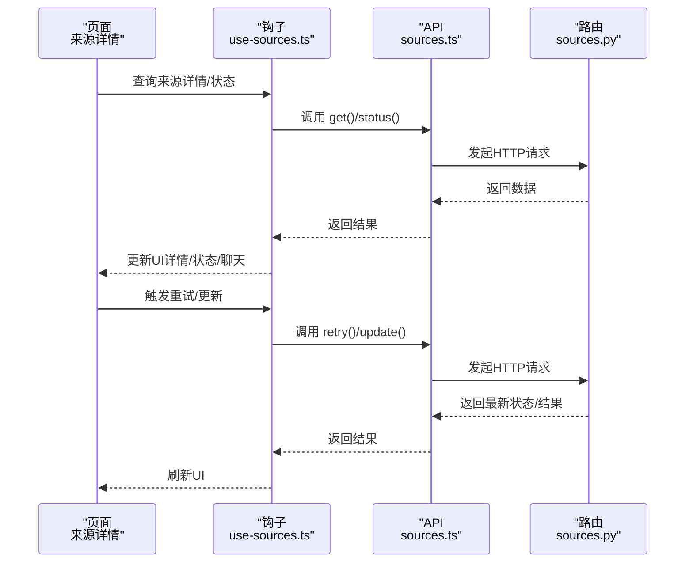
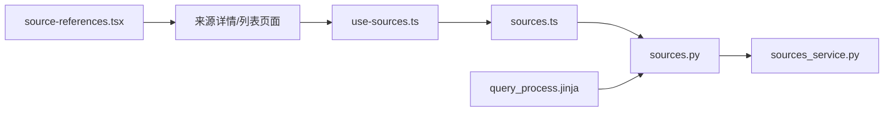

# 引用系统

<cite>
**本文档引用的文件**
- [citations.md](file://docs/3-USER-GUIDE/citations.md)
- [sources.py](file://api/routers/sources.py)
- [sources_service.py](file://api/sources_service.py)
- [source-references.tsx](file://frontend/src/lib/utils/source-references.tsx)
- [sources.ts](file://frontend/src/lib/api/sources.ts)
- [page.tsx（来源详情）](file://frontend/src/app/(dashboard)/sources/[id]/page.tsx)
- [page.tsx（来源列表）](file://frontend/src/app/(dashboard)/sources/page.tsx)
- [NotebookAssociations.tsx](file://frontend/src/components/source/NotebookAssociations.tsx)
- [NotebooksStep.tsx](file://frontend/src/components/sources/steps/NotebooksStep.tsx)
- [use-sources.ts](file://frontend/src/lib/hooks/use-sources.ts)
- [query_process.jinja](file://prompts/ask/query_process.jinja)
- [index.md（故障排除总览）](file://docs/6-TROUBLESHOOTING/index.md)
</cite>

## 目录
1. [简介](#简介)
2. [项目结构](#项目结构)
3. [核心组件](#核心组件)
4. [架构总览](#架构总览)
5. [详细组件分析](#详细组件分析)
6. [依赖关系分析](#依赖关系分析)
7. [性能考量](#性能考量)
8. [故障排除指南](#故障排除指南)
9. [结论](#结论)
10. [附录](#附录)

## 简介
本指南围绕“引用系统”展开，帮助用户理解并正确使用引用机制：从概念与重要性出发，到引用标记的显示与交互、引用验证最佳实践、引用与内容源的关系、引用管理（收藏、导出、分享）、在学术与研究中的应用价值，以及常见问题与排错方法。文档以仓库内的用户指南、后端路由与服务层、前端工具函数与页面为依据，提供可操作的步骤与可视化图示。

## 项目结构
引用系统贯穿“用户界面—API—领域模型—命令执行”的全链路：
- 用户界面负责展示来源、聊天面板与引用解析渲染；
- API 路由负责来源的增删改查、状态查询与下载；
- 服务层封装 API 调用，提供统一的数据对象；
- 前端工具函数负责将文本中的引用标记转换为可点击链接或编号引用；
- 提示词模板定义了引用标注的规范与示例。

图表来源
- [page.tsx（来源列表）](file://frontend/src/app/(dashboard)/sources/page.tsx#L1-L433)
- [page.tsx（来源详情）](file://frontend/src/app/(dashboard)/sources/[id]/page.tsx#L1-L79)
- [source-references.tsx](file://frontend/src/lib/utils/source-references.tsx#L1-L487)
- [use-sources.ts](file://frontend/src/lib/hooks/use-sources.ts#L1-L375)
- [sources.ts](file://frontend/src/lib/api/sources.ts#L1-L109)
- [sources.py](file://api/routers/sources.py#L1-L1020)
- [sources_service.py](file://api/sources_service.py#L1-L325)
- [query_process.jinja](file://prompts/ask/query_process.jinja#L1-L38)

章节来源
- [page.tsx（来源列表）](file://frontend/src/app/(dashboard)/sources/page.tsx#L1-L433)
- [page.tsx（来源详情）](file://frontend/src/app/(dashboard)/sources/[id]/page.tsx#L1-L79)
- [source-references.tsx](file://frontend/src/lib/utils/source-references.tsx#L1-L487)
- [use-sources.ts](file://frontend/src/lib/hooks/use-sources.ts#L1-L375)
- [sources.ts](file://frontend/src/lib/api/sources.ts#L1-L109)
- [sources.py](file://api/routers/sources.py#L1-L1020)
- [sources_service.py](file://api/sources_service.py#L1-L325)
- [query_process.jinja](file://prompts/ask/query_process.jinja#L1-L38)

## 核心组件
- 引用标记解析与渲染：前端工具函数负责将文本中的引用标记（如 source:abc、note:xyz、source_insight:...）解析为可点击按钮或编号引用，并支持在 Markdown 中生成带锚点的链接。
- 来源管理 API：后端提供来源的创建、更新、删除、状态查询与文件下载；支持异步处理模式与进度反馈。
- 来源服务层：封装 API 调用，返回统一的数据对象，便于前端与业务逻辑使用。
- 来源详情与列表页面：提供来源浏览、聊天会话、关联笔记本、状态刷新等能力。
- 提示词模板：定义引用标注的格式与示例，确保 AI 输出中包含可追踪的引用。

章节来源
- [source-references.tsx](file://frontend/src/lib/utils/source-references.tsx#L1-L487)
- [sources.py](file://api/routers/sources.py#L1-L1020)
- [sources_service.py](file://api/sources_service.py#L1-L325)
- [page.tsx（来源详情）](file://frontend/src/app/(dashboard)/sources/[id]/page.tsx#L1-L79)
- [page.tsx（来源列表）](file://frontend/src/app/(dashboard)/sources/page.tsx#L1-L433)
- [query_process.jinja](file://prompts/ask/query_process.jinja#L1-L38)

## 架构总览
下图展示了从用户输入到引用生成与验证的端到端流程：

图表来源
- [sources.ts](file://frontend/src/lib/api/sources.ts#L1-L109)
- [sources.py](file://api/routers/sources.py#L1-L1020)
- [sources_service.py](file://api/sources_service.py#L1-L325)
- [page.tsx（来源详情）](file://frontend/src/app/(dashboard)/sources/[id]/page.tsx#L1-L79)
- [page.tsx（来源列表）](file://frontend/src/app/(dashboard)/sources/page.tsx#L1-L433)

## 详细组件分析

### 组件一：引用标记解析与渲染（前端）
- 功能要点
  - 解析多种引用格式：source、note、source_insight；
  - 支持单/双括号、加粗等上下文包裹；
  - 将引用转换为可点击按钮或编号引用，并生成参考文献列表；
  - 提供两种渲染路径：React 节点渲染与 Markdown 链接预处理。
- 关键接口
  - parseSourceReferences：提取引用；
  - convertSourceReferences：渲染为可点击按钮；
  - convertReferencesToMarkdownLinks：预处理为 Markdown 链接；
  - convertReferencesToCompactMarkdown：生成紧凑编号引用+参考列表；
  - createReferenceLinkComponent/createCompactReferenceLinkComponent：ReactMarkdown 的链接组件。

图表来源
- [source-references.tsx](file://frontend/src/lib/utils/source-references.tsx#L46-L155)
- [source-references.tsx](file://frontend/src/lib/utils/source-references.tsx#L174-L258)
- [source-references.tsx](file://frontend/src/lib/utils/source-references.tsx#L339-L412)

章节来源
- [source-references.tsx](file://frontend/src/lib/utils/source-references.tsx#L1-L487)

### 组件二：来源管理 API（后端）
- 功能要点
  - 列表/详情：分页、排序、过滤；
  - 创建来源：支持链接、上传、文本三种类型，异步/同步处理；
  - 更新/删除：标题、主题等元数据；
  - 状态查询：处理中/完成/失败/排队；
  - 文件下载：安全路径校验与下载响应；
  - 重试处理：针对失败或卡住的任务重新排队。
- 关键路由
  - GET /sources、GET /sources/:id、POST /sources、PUT /sources/:id、POST /sources/:id/retry、GET /sources/:id/status、GET/HEAD /sources/:id/download。

图表来源
- [sources.py](file://api/routers/sources.py#L280-L552)

章节来源
- [sources.py](file://api/routers/sources.py#L152-L800)

### 组件三：来源服务层（API 客户端封装）
- 功能要点
  - 统一封装 API 调用，返回统一数据对象；
  - 支持异步处理结果增强（包含 command_id、状态、处理信息）；
  - 提供状态轮询、重试、更新、删除等常用操作。
- 关键方法
  - get_all_sources/get_source/create_source/create_source_async/is_source_processing_complete/update_source/delete_source/get_source_status。

图表来源
- [sources_service.py](file://api/sources_service.py#L66-L325)

章节来源
- [sources_service.py](file://api/sources_service.py#L1-L325)

### 组件四：来源详情与列表页面（前端）
- 功能要点
  - 来源列表：分页加载、排序、删除确认、状态刷新；
  - 来源详情：左侧展示来源内容，右侧聊天面板用于与来源对话；
  - 状态轮询：根据状态自动刷新；
  - 重试处理：失败任务可重新排队；
  - 关联笔记本：支持将来源添加/移除到多个笔记本。
- 关键交互
  - useSources/useNotebookSources：查询来源列表；
  - useSource：查询单个来源；
  - useCreateSource/useUpdateSource/useDeleteSource：CRUD；
  - useSourceStatus：状态轮询；
  - useRetrySource：重试；
  - NotebookAssociations：管理笔记本关联。

图表来源
- [page.tsx（来源详情）](file://frontend/src/app/(dashboard)/sources/[id]/page.tsx#L1-L79)
- [use-sources.ts](file://frontend/src/lib/hooks/use-sources.ts#L1-L375)
- [sources.ts](file://frontend/src/lib/api/sources.ts#L1-L109)
- [sources.py](file://api/routers/sources.py#L601-L751)

章节来源
- [page.tsx（来源详情）](file://frontend/src/app/(dashboard)/sources/[id]/page.tsx#L1-L79)
- [page.tsx（来源列表）](file://frontend/src/app/(dashboard)/sources/page.tsx#L1-L433)
- [use-sources.ts](file://frontend/src/lib/hooks/use-sources.ts#L1-L375)
- [NotebookAssociations.tsx](file://frontend/src/components/source/NotebookAssociations.tsx#L1-L168)
- [NotebooksStep.tsx](file://frontend/src/components/sources/steps/NotebooksStep.tsx#L1-L44)

### 组件五：提示词模板与引用规范
- 功能要点
  - 在提示词中明确要求 AI 回答中包含对具体文档的引用；
  - 示例展示了引用格式与标注方式；
  - 保证输出可追踪、可验证。
- 关键点
  - 引用应包含文档 ID；
  - 可配合页面上的“点击引用查看来源”的交互进行验证。

章节来源
- [query_process.jinja](file://prompts/ask/query_process.jinja#L1-L38)

## 依赖关系分析
- 前端工具函数依赖于页面与钩子，用于在渲染阶段将文本中的引用标记转换为交互元素；
- 页面通过 API 客户端与后端路由通信，路由调用服务层与命令队列；
- 服务层向上提供统一的数据对象，向下封装 API 行为；
- 提示词模板影响后端生成的引用格式，从而影响前端的解析与渲染。

图表来源
- [source-references.tsx](file://frontend/src/lib/utils/source-references.tsx#L1-L487)
- [page.tsx（来源详情）](file://frontend/src/app/(dashboard)/sources/[id]/page.tsx#L1-L79)
- [page.tsx（来源列表）](file://frontend/src/app/(dashboard)/sources/page.tsx#L1-L433)
- [use-sources.ts](file://frontend/src/lib/hooks/use-sources.ts#L1-L375)
- [sources.ts](file://frontend/src/lib/api/sources.ts#L1-L109)
- [sources.py](file://api/routers/sources.py#L1-L1020)
- [sources_service.py](file://api/sources_service.py#L1-L325)
- [query_process.jinja](file://prompts/ask/query_process.jinja#L1-L38)

章节来源
- [source-references.tsx](file://frontend/src/lib/utils/source-references.tsx#L1-L487)
- [use-sources.ts](file://frontend/src/lib/hooks/use-sources.ts#L1-L375)
- [sources.ts](file://frontend/src/lib/api/sources.ts#L1-L109)
- [sources.py](file://api/routers/sources.py#L1-L1020)
- [sources_service.py](file://api/sources_service.py#L1-L325)
- [query_process.jinja](file://prompts/ask/query_process.jinja#L1-L38)

## 性能考量
- 异步处理：创建来源时默认采用异步模式，避免阻塞 UI，支持状态轮询与进度反馈；
- 分页与缓存：来源列表使用无限滚动分页与短期缓存策略，提升响应速度；
- 自动刷新：状态查询在处理中时以固定间隔刷新，完成后停止；
- 并发控制：批量操作（如添加/移除来源到笔记本）使用并发控制与部分失败处理，保证用户体验。

章节来源
- [sources.py](file://api/routers/sources.py#L352-L426)
- [use-sources.ts](file://frontend/src/lib/hooks/use-sources.ts#L222-L247)
- [use-sources.ts](file://frontend/src/lib/hooks/use-sources.ts#L280-L340)

## 故障排除指南
- “无法连接服务器/前端无法加载”
  - 检查服务运行状态、日志、端口占用与网络连通性；
  - 参考故障排除总览中的诊断清单与快速修复指南。
- “来源上传/处理失败”
  - 确认文件格式支持、大小限制；
  - 使用“重试”功能重新排队处理；
  - 查看来源状态，确认是否仍在处理中。
- “引用不匹配/找不到引用段落”
  - 确认来源已设置为“全文内容”以便精确引用；
  - 在来源详情中点击引用，核对原始段落；
  - 如仍无法定位，尝试重新处理来源或缩小检索范围。
- “没有引用”
  - 重新提问并要求引用具体页码或段落；
  - 确保来源已加入上下文；
  - 对于 Ask 功能，确保跨来源合成时保留引用。

章节来源
- [index.md（故障排除总览）](file://docs/6-TROUBLESHOOTING/index.md#L1-L240)
- [sources.py](file://api/routers/sources.py#L691-L751)
- [use-sources.ts](file://frontend/src/lib/hooks/use-sources.ts#L249-L278)
- [citations.md](file://docs/3-USER-GUIDE/citations.md#L198-L247)

## 结论
引用系统通过“自动标注—交互验证—可追溯—可导出”的闭环，帮助用户建立可信的研究过程。前端的引用解析与渲染、后端的状态管理与异步处理、以及提示词模板对引用格式的约束，共同构成了可靠的引用基础设施。建议在学术与专业场景中坚持“先验证再使用”的原则，并充分利用“全文内容”“精确页码”“交叉核对”等最佳实践，确保研究成果的严谨性与可复现性。

## 附录
- 引用概念与重要性
  - 验证声明、查找原始上下文、捕捉幻觉、构建可信度；
  - 在不同功能模块（聊天、Ask、转换）中的引用行为差异。
- 引用标记显示与交互
  - 单击引用打开来源、高亮相关段落、支持编号引用与参考列表；
  - 在 Markdown 导出中保持链接可点击。
- 引用验证最佳实践
  - 对关键结论进行交叉验证，注意上下文与归属；
  - 使用“全文内容”与“页码引用”提高精确度；
  - 记录验证过程，形成可追溯的证据链。
- 引用与内容源的关系
  - 来源可关联至多个笔记本，支持多维组织；
  - 来源可独立聊天，便于深入讨论与验证。
- 引用管理
  - 收藏：通过笔记本关联实现；
  - 导出：Markdown/复制粘贴/PDF 等格式均保留引用；
  - 分享：通过来源链接与引用锚点实现定向分享。

章节来源
- [citations.md](file://docs/3-USER-GUIDE/citations.md#L1-L300)
- [NotebookAssociations.tsx](file://frontend/src/components/source/NotebookAssociations.tsx#L1-L168)
- [NotebooksStep.tsx](file://frontend/src/components/sources/steps/NotebooksStep.tsx#L1-L44)
- [sources.py](file://api/routers/sources.py#L601-L689)