# 技能系统用户指南

<cite>
**本文档引用的文件**
- [frontend/src/app/(dashboard)/skills/page.tsx](file://frontend/src/app/(dashboard)/skills/page.tsx)
- [frontend/src/app/(dashboard)/skills/components/CreateSkillDialog.tsx](file://frontend/src/app/(dashboard)/skills/components/CreateSkillDialog.tsx)
- [frontend/src/lib/hooks/use-skills.ts](file://frontend/src/lib/hooks/use-skills.ts)
- [frontend/src/lib/api/skills.ts](file://frontend/src/lib/api/skills.ts)
- [frontend/src/lib/api/query-client.ts](file://frontend/src/lib/api/query-client.ts)
- [frontend/src/lib/hooks/use-translation.ts](file://frontend/src/lib/hooks/use-translation.ts)
- [frontend/src/lib/hooks/use-toast.ts](file://frontend/src/lib/hooks/use-toast.ts)
- [api/routers/skills.py](file://api/routers/skills.py)
- [open_notebook/domain/skill.py](file://open_notebook/domain/skill.py)
- [open_notebook/skills/__init__.py](file://open_notebook/skills/__init__.py)
- [open_notebook/skills/base.py](file://open_notebook/skills/base.py)
- [open_notebook/skills/registry.py](file://open_notebook/skills/registry.py)
- [open_notebook/skills/runner.py](file://open_notebook/skills/runner.py)
- [open_notebook/skills/scheduler.py](file://open_notebook/skills/scheduler.py)
- [open_notebook/skills/content_crawler.py](file://open_notebook/skills/content_crawler.py)
- [open_notebook/skills/browser_base.py](file://open_notebook/skills/browser_base.py)
- [open_notebook/skills/browser_task.py](file://open_notebook/skills/browser_task.py)
- [open_notebook/skills/note_organizer.py](file://open_notebook/skills/note_organizer.py)
- [open_notebook/skills/vikki_content_ops.py](file://open_notebook/skills/vikki_content_ops.py)
- [open_notebook/domain/workflow.py](file://open_notebook/domain/workflow.py)
- [open_notebook/workflows/engine.py](file://open_notebook/workflows/engine.py)
- [open_notebook/workflows/service.py](file://open_notebook/workflows/service.py)
- [open_notebook/workflows/conversational.py](file://open_notebook/workflows/conversational.py)
- [open_notebook/workflows/templates.py](file://open_notebook/workflows/templates.py)
- [api/routers/workflows.py](file://api/routers/workflows.py)
- [api/routers/workflow_builder.py](file://api/routers/workflow_builder.py)
- [api/routers/workflow_templates.py](file://api/routers/workflow_templates.py)
</cite>

## 更新摘要
**所做更改**
- 新增工作流功能章节，涵盖工作流创建、模板使用、执行监控和故障排除
- 添加工作流引擎架构和执行流程说明
- 更新技能系统以包含工作流编排能力
- 增强用户界面以支持工作流管理
- 新增工作流模板和AI辅助创建工作流的功能
- 新增Vikki内容运营技能章节，包含疼痛点扫描、四象限分类、主题生成、内容适配、账号周期诊断、主题评估和比例监控等技能
- 新增AI辅助工作流创建功能，支持自然语言生成工作流定义
- 新增工作流模板系统，提供预定义的工作流模板

## 目录
1. [简介](#简介)
2. [现代化技术栈](#现代化技术栈)
3. [前端架构设计](#前端架构设计)
4. [TypeScript API规范](#typescript-api规范)
5. [React Query状态管理](#react-query状态管理)
6. [自定义Hooks设计](#自定义hooks设计)
7. [技能创建流程](#技能创建流程)
8. [技能管理界面](#技能管理界面)
9. [工作流功能](#工作流功能)
10. [工作流引擎架构](#工作流引擎架构)
11. [工作流模板系统](#工作流模板系统)
12. [AI辅助工作流创建](#ai辅助工作流创建)
13. [工作流执行监控](#工作流执行监控)
14. [Vikki内容运营技能](#vikki内容运营技能)
15. [项目结构](#项目结构)
16. [核心组件](#核心组件)
17. [架构总览](#架构总览)
18. [详细组件分析](#详细组件分析)
19. [依赖关系分析](#依赖关系分析)
20. [性能考虑](#性能考虑)
21. [故障排除指南](#故障排除指南)
22. [结论](#结论)

## 简介
本指南面向Open Notebook的技能系统用户，帮助您理解基于现代化React前端技术栈的技能系统工作原理、使用方法以及最佳实践。技能系统现已全面升级至React 18、Next.js App Router、TypeScript、React Query等现代技术栈，提供可重用的自动化单元，能够通过手动触发、定时调度或事件触发等方式执行内容抓取、网页自动化、笔记整理等任务。

**新增** 技能系统现已扩展为完整的工作流编排平台，支持多技能协同执行、条件判断、重试机制和执行监控等功能。系统包含Vikki内容运营技能套件，基于四象限方法论提供完整的IP内容策略解决方案。

## 现代化技术栈

### 前端技术栈概览
技能系统前端采用最新的React生态系统技术栈：

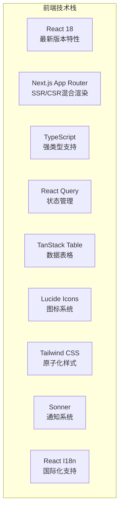

**图表来源**
- [frontend/src/app/(dashboard)/skills/page.tsx](file://frontend/src/app/(dashboard)/skills/page.tsx#L1-L15)
- [frontend/src/lib/hooks/use-skills.ts](file://frontend/src/lib/hooks/use-skills.ts#L1-L7)

### 技术特性
- **TypeScript强类型**: 完整的类型定义和接口规范
- **React Query状态管理**: 自动缓存、乐观更新、错误边界
- **自定义Hooks设计**: 业务逻辑封装和复用
- **响应式设计**: Tailwind CSS实现的现代化UI
- **国际化支持**: 多语言切换和本地化
- **错误处理**: 统一的错误边界和用户反馈

## 前端架构设计

### 页面组件结构
技能系统采用模块化的页面组件设计：

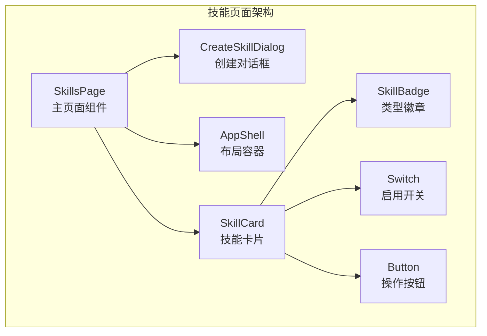

**图表来源**
- [frontend/src/app/(dashboard)/skills/page.tsx](file://frontend/src/app/(dashboard)/skills/page.tsx#L16-L189)
- [frontend/src/app/(dashboard)/skills/components/CreateSkillDialog.tsx](file://frontend/src/app/(dashboard)/skills/components/CreateSkillDialog.tsx#L19-L205)

### 组件层次结构
- **页面级别**: SkillsPage - 主要页面容器
- **对话框级别**: CreateSkillDialog - 技能创建表单
- **布局级别**: AppShell - 应用外壳和导航
- **展示级别**: SkillCard, Badge, Switch - UI组件

**章节来源**
- [frontend/src/app/(dashboard)/skills/page.tsx](file://frontend/src/app/(dashboard)/skills/page.tsx#L16-L189)
- [frontend/src/app/(dashboard)/skills/components/CreateSkillDialog.tsx](file://frontend/src/app/(dashboard)/skills/components/CreateSkillDialog.tsx#L19-L205)

## TypeScript API规范

### 类型定义体系
技能系统提供完整的TypeScript类型定义：

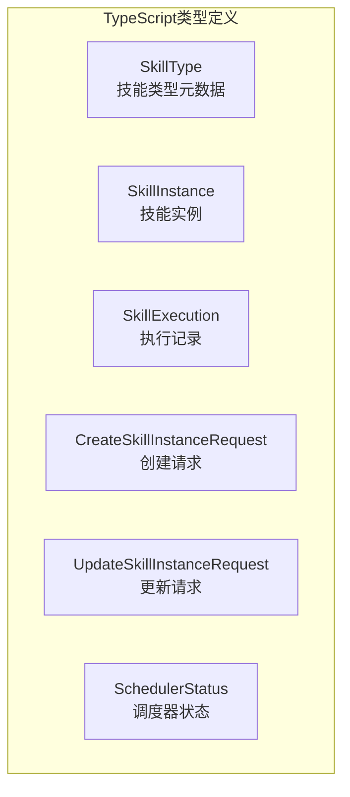

**图表来源**
- [frontend/src/lib/api/skills.ts](file://frontend/src/lib/api/skills.ts#L3-L64)

### 核心接口定义
- **SkillType**: 技能类型元数据，包含类型标识、名称和描述
- **SkillInstance**: 技能实例配置，包含参数、调度和目标笔记本
- **SkillExecution**: 执行历史记录，包含状态、时间和输出
- **SchedulerStatus**: 调度器运行状态，包含作业数量和详情

**章节来源**
- [frontend/src/lib/api/skills.ts](file://frontend/src/lib/api/skills.ts#L3-L145)

## React Query状态管理

### 查询客户端配置
技能系统使用全局的React Query客户端进行状态管理：

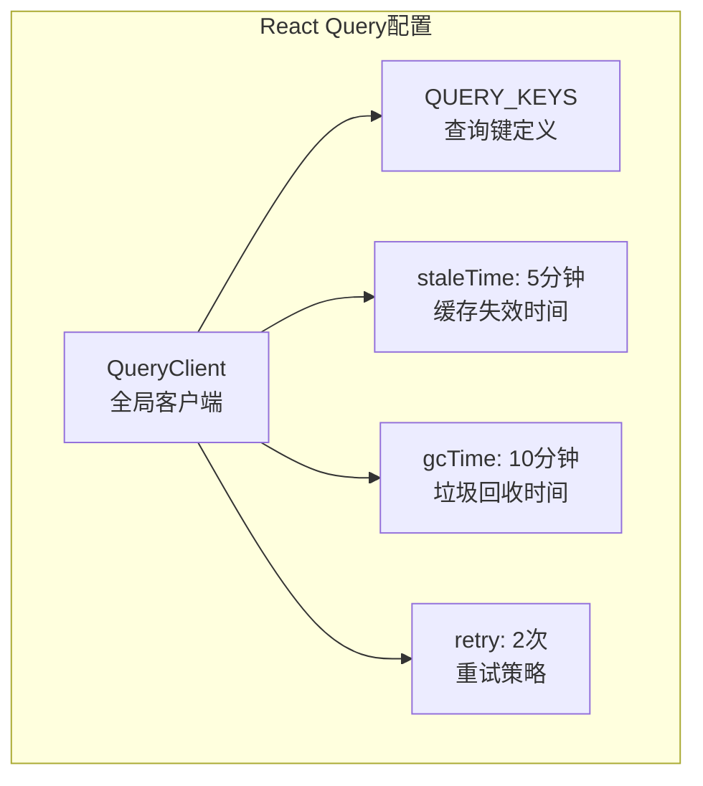

**图表来源**
- [frontend/src/lib/api/query-client.ts](file://frontend/src/lib/api/query-client.ts#L3-L15)

### 查询键设计模式
系统采用标准化的查询键命名约定：
- `['skills', 'instances']` - 技能实例列表
- `['skills', 'instances', id]` - 特定技能实例
- `['skills', 'executions']` - 执行历史列表
- `['skills', 'scheduler', 'status']` - 调度器状态

**章节来源**
- [frontend/src/lib/api/query-client.ts](file://frontend/src/lib/api/query-client.ts#L17-L42)

## 自定义Hooks设计

### Hooks分类体系
技能系统提供专门的自定义Hooks来封装业务逻辑：

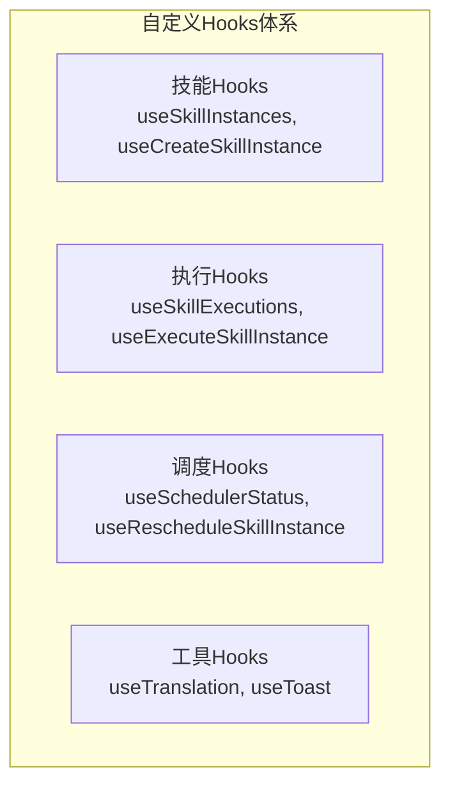

**图表来源**
- [frontend/src/lib/hooks/use-skills.ts](file://frontend/src/lib/hooks/use-skills.ts#L8-L212)

### Hook功能特性
- **useSkillInstances**: 获取技能实例列表，支持自动刷新
- **useCreateSkillInstance**: 创建技能实例，包含错误处理和缓存更新
- **useExecuteSkillInstance**: 执行技能，提供乐观更新和状态反馈
- **useSchedulerStatus**: 监控调度器状态，30秒自动刷新
- **useTranslation**: 国际化翻译，支持代理模式避免循环
- **useToast**: 统一通知系统，支持成功和错误提示

**章节来源**
- [frontend/src/lib/hooks/use-skills.ts](file://frontend/src/lib/hooks/use-skills.ts#L8-L212)
- [frontend/src/lib/hooks/use-translation.ts](file://frontend/src/lib/hooks/use-translation.ts#L15-L158)
- [frontend/src/lib/hooks/use-toast.ts](file://frontend/src/lib/hooks/use-toast.ts#L10-L26)

## 技能创建流程

### 创建向导流程
技能创建采用向导式表单设计：

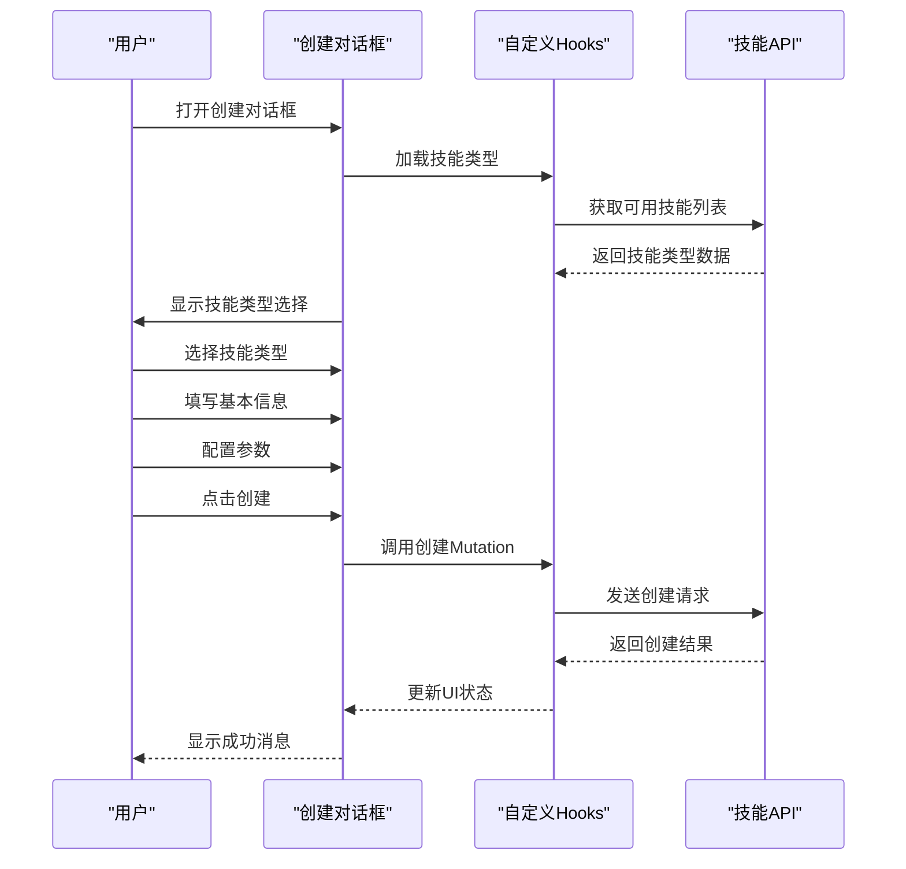

**图表来源**
- [frontend/src/app/(dashboard)/skills/components/CreateSkillDialog.tsx](file://frontend/src/app/(dashboard)/skills/components/CreateSkillDialog.tsx#L32-L51)

### 参数验证机制
- **JSON格式验证**: 对参数字段进行JSON解析验证
- **必填字段检查**: 确保名称和技能类型已填写
- **错误边界处理**: 统一捕获和显示错误信息
- **表单重置**: 成功创建后自动清空表单

**章节来源**
- [frontend/src/app/(dashboard)/skills/components/CreateSkillDialog.tsx](file://frontend/src/app/(dashboard)/skills/components/CreateSkillDialog.tsx#L32-L61)

## 技能管理界面

### 主界面布局
技能管理界面采用卡片式布局设计：

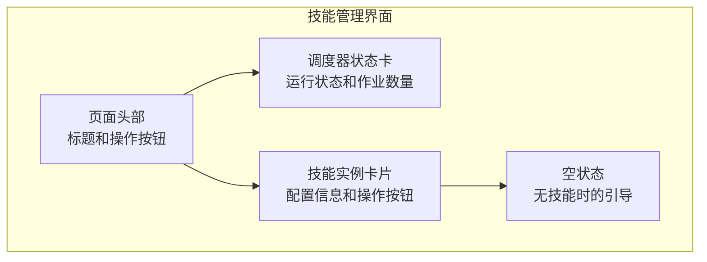

**图表来源**
- [frontend/src/app/(dashboard)/skills/page.tsx](file://frontend/src/app/(dashboard)/skills/page.tsx#L55-L189)

### 交互功能
- **技能实例列表**: 显示所有配置的技能实例
- **调度器状态**: 实时显示调度器运行状态
- **启用/禁用切换**: 动态控制技能执行
- **手动执行**: 立即触发技能执行
- **编辑功能**: 访问技能详细配置页面
- **删除操作**: 安全删除技能实例

**章节来源**
- [frontend/src/app/(dashboard)/skills/page.tsx](file://frontend/src/app/(dashboard)/skills/page.tsx#L16-L189)

## 工作流功能

### 工作流概述
工作流功能是技能系统的重要扩展，允许用户创建多步骤的自动化流程。工作流可以编排多个技能的执行顺序、设置依赖关系、条件判断和重试机制。

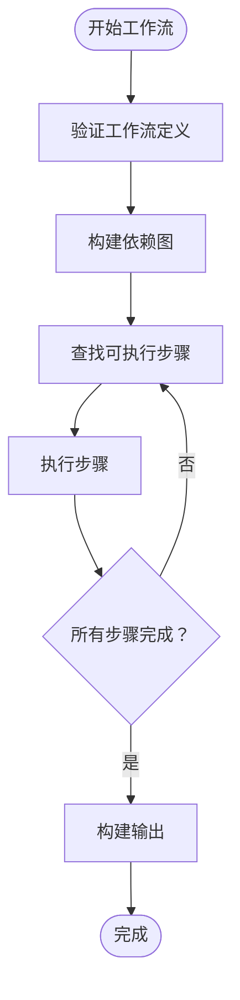

**图表来源**
- [open_notebook/workflows/engine.py](file://open_notebook/workflows/engine.py#L205-L298)

### 工作流特性
- **多技能编排**: 支持多个技能的顺序和并行执行
- **依赖管理**: 通过依赖关系确保步骤按正确顺序执行
- **条件执行**: 支持基于条件表达式的步骤执行
- **重试机制**: 可配置的失败重试和延迟
- **继续执行**: 即使某些步骤失败也能继续其他步骤
- **模板系统**: 提供预定义的工作流模板
- **AI辅助创建**: 通过自然语言生成工作流定义

**章节来源**
- [open_notebook/domain/workflow.py](file://open_notebook/domain/workflow.py#L39-L138)
- [open_notebook/workflows/engine.py](file://open_notebook/workflows/engine.py#L130-L204)

## 工作流引擎架构

### 执行引擎设计
工作流引擎负责协调多技能的执行，管理依赖关系和执行状态：

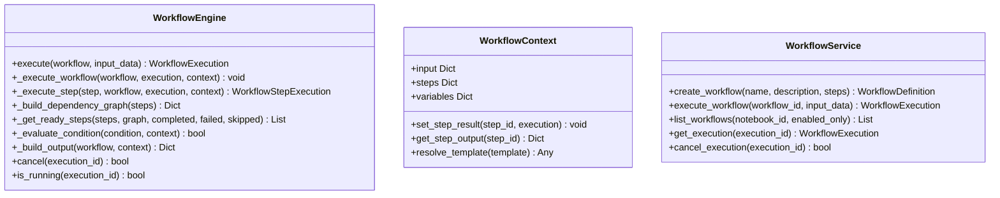

**图表来源**
- [open_notebook/workflows/engine.py](file://open_notebook/workflows/engine.py#L130-L620)
- [open_notebook/workflows/service.py](file://open_notebook/workflows/service.py#L22-L240)

### 执行流程
工作流引擎采用分阶段的执行策略：
1. **验证阶段**: 验证工作流定义的完整性和有效性
2. **依赖分析**: 构建步骤依赖图，检测循环依赖
3. **执行阶段**: 按依赖关系执行步骤，支持并行执行
4. **状态管理**: 跟踪每个步骤的执行状态和结果
5. **输出聚合**: 收集所有步骤的输出并生成最终结果

**章节来源**
- [open_notebook/workflows/engine.py](file://open_notebook/workflows/engine.py#L144-L298)

## 工作流模板系统

### 模板设计
工作流模板提供了预定义的工作流配置，用户可以直接使用或基于模板进行修改：

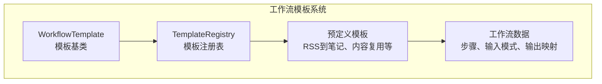

**图表来源**
- [open_notebook/workflows/templates.py](file://open_notebook/workflows/templates.py#L12-L675)

### 模板类型
系统提供多种预定义模板：

#### 内容监控模板
- **RSS到笔记管道**: 自动监控RSS源，提取文章并生成摘要笔记
- **竞争对手监控**: 监控竞争对手网站变化并生成洞察报告

#### 内容创作模板
- **内容复用管道**: 将长篇文章转换为Twitter帖子、LinkedIn文章和新闻简报
- **研究摘要管道**: 汇总一周的研究内容生成摘要报告
- **播客制作管道**: 从源内容生成播客节目

#### 组织模板
- **自动组织笔记本**: 自动标记、总结和组织笔记本中的内容
- **Vikki内容管道**: 基于四象限方法论的内容策略工作流

**章节来源**
- [open_notebook/workflows/templates.py](file://open_notebook/workflows/templates.py#L54-L634)

## AI辅助工作流创建

### 对话式工作流构建器
AI助手可以根据用户的自然语言描述生成工作流定义：

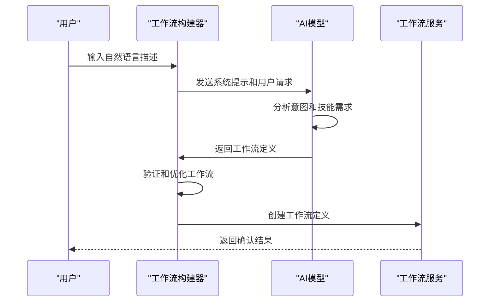

**图表来源**
- [open_notebook/workflows/conversational.py](file://open_notebook/workflows/conversational.py#L122-L183)

### AI功能特性
- **意图识别**: 识别用户的工作流意图（内容监控、内容创作、组织等）
- **技能推荐**: 根据需求推荐合适的技能组合
- **结构建议**: 提供步骤依赖和执行顺序建议
- **复杂度评估**: 评估工作流的复杂程度
- **模板匹配**: 基于描述匹配最合适的预定义模板

**章节来源**
- [open_notebook/workflows/conversational.py](file://open_notebook/workflows/conversational.py#L16-L101)
- [open_notebook/workflows/conversational.py](file://open_notebook/workflows/conversational.py#L347-L426)

## 工作流执行监控

### 执行状态跟踪
工作流执行过程中会实时跟踪每个步骤的状态和结果：

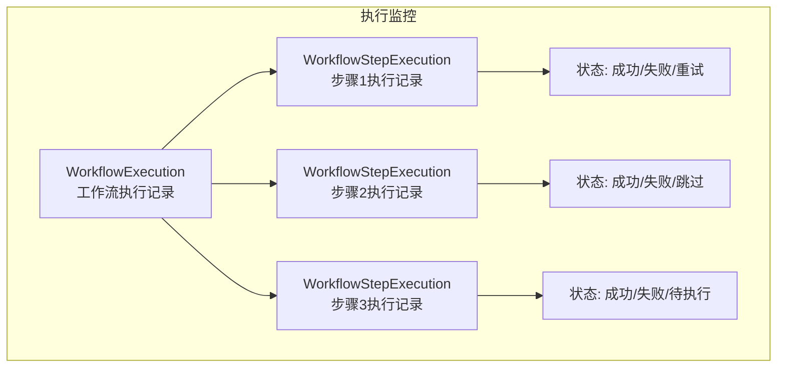

**图表来源**
- [open_notebook/domain/workflow.py](file://open_notebook/domain/workflow.py#L140-L271)

### 监控功能
- **实时状态**: 显示当前运行的工作流和步骤状态
- **执行历史**: 记录所有工作流执行的历史和结果
- **统计分析**: 提供成功率、平均执行时间等统计信息
- **错误诊断**: 详细记录失败步骤的错误信息
- **资源追踪**: 跟踪创建的源和笔记ID

**章节来源**
- [open_notebook/domain/workflow.py](file://open_notebook/domain/workflow.py#L184-L309)
- [api/routers/workflows.py](file://api/routers/workflows.py#L296-L348)

## Vikki内容运营技能

### Vikki内容运营技能概述
Vikki内容运营技能套件基于四象限方法论，提供完整的IP内容策略解决方案。该套件包含7个专门的技能，覆盖从内容发现到执行的完整流程。

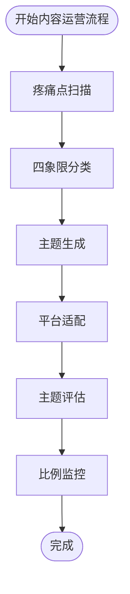

**图表来源**
- [open_notebook/skills/vikki_content_ops.py](file://open_notebook/skills/vikki_content_ops.py#L422-L480)

### 技能套件组成

#### 疼痛点扫描技能 (PainpointScannerSkill)
- **功能**: 从内容中识别即时、持续和隐藏三种类型的用户痛点
- **参数**: source_ids, note_ids, text_content, painpoint_types, min_urgency_score, max_painpoints
- **输出**: 检测到的疼痛点列表和统计信息
- **应用场景**: 内容主题挖掘、用户需求分析

#### 四象限分类技能 (QuadrantClassifierSkill)
- **功能**: 将内容主题分类到Q1-Q4四个象限框架
- **参数**: topics, content_ids, classification_mode, save_as_tags
- **输出**: 主题分类结果和象限分布
- **应用场景**: 内容策略制定、受众定位

#### 主题生成技能 (TopicGeneratorSkill)
- **功能**: 基于疼痛点和象限分析生成高ROI内容主题
- **参数**: painpoints, target_quadrations, topics_per_quadrant, industry, content_formats
- **输出**: 生成的主题列表、优先级排序和内容日历
- **应用场景**: 内容创作、营销策划

#### 内容适配技能 (ContentAdaptorSkill)
- **功能**: 将内容适配到不同社交平台和格式
- **参数**: source_content, source_note_id, target_platforms, content_style, include_cta
- **输出**: 平台优化的内容版本和建议
- **应用场景**: 多渠道内容发布、社交媒体运营

#### 账号周期诊断技能 (CycleDiagnosticianSkill)
- **功能**: 分析账号生命周期阶段并提供策略建议
- **参数**: follower_count, previous_follower_count, engagement_rate, content_history, account_age_days, platform
- **输出**: 当前周期、信心评分、策略建议
- **应用场景**: 账号运营、内容策略调整

#### 主题评估技能 (TopicEvaluatorSkill)
- **功能**: 多维度评估内容主题质量
- **参数**: topics, evaluation_dimensions, platform, competitor_content, min_overall_score, industry
- **输出**: 维度评分、总体分数、改进建议
- **应用场景**: 内容质量控制、主题筛选

#### 比例监控技能 (RatioMonitorSkill)
- **功能**: 监控内容四象限分布并提供调整建议
- **参数**: current_plan, target_ratios, account_cycle, tolerance_percent, lookahead_days, recently_published
- **输出**: 比例分析、偏差警告、调整建议
- **应用场景**: 内容平衡、策略执行监控

**章节来源**
- [open_notebook/skills/vikki_content_ops.py](file://open_notebook/skills/vikki_content_ops.py#L30-L800)
- [open_notebook/skills/vikki_content_ops.py](file://open_notebook/skills/vikki_content_ops.py#L800-L1599)
- [open_notebook/skills/vikki_content_ops.py](file://open_notebook/skills/vikki_content_ops.py#L1600-L2399)
- [open_notebook/skills/vikki_content_ops.py](file://open_notebook/skills/vikki_content_ops.py#L2400-L2621)

### Vikki内容运营工作流
系统提供完整的Vikki内容运营工作流模板，整合所有技能形成闭环：

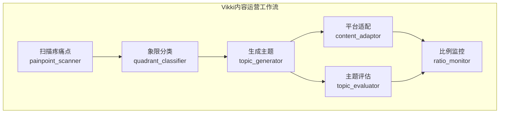

**图表来源**
- [open_notebook/workflows/templates.py](file://open_notebook/workflows/templates.py#L427-L572)

**章节来源**
- [open_notebook/workflows/templates.py](file://open_notebook/workflows/templates.py#L427-L572)

## 项目结构
技能系统主要分布在以下模块中：
- 基础框架：定义技能抽象类、上下文、结果、配置等核心概念
- 注册中心：维护技能类型到具体实现的映射
- 执行引擎：负责异步执行技能、生命周期管理、错误处理
- 调度器：基于APScheduler实现Cron表达式的定时任务管理
- 具体技能：包括RSS爬虫、浏览器自动化、笔记整理等
- **新增**: Vikki内容运营技能套件，包含7个专门的技能
- **新增**: 工作流引擎、工作流服务、工作流模板、AI构建器
- **新增**: 前端React组件、TypeScript API、React Query状态管理
- API路由：提供REST接口用于技能实例的创建、更新、执行和历史查询
- 领域模型：数据库模型用于持久化技能实例和执行历史

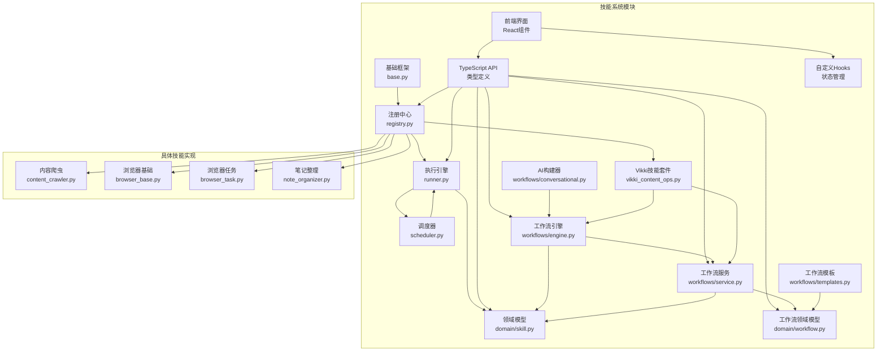

**图表来源**
- [open_notebook/skills/base.py](file://open_notebook/skills/base.py#L83-L183)
- [open_notebook/skills/registry.py](file://open_notebook/skills/registry.py#L12-L133)
- [open_notebook/skills/runner.py](file://open_notebook/skills/runner.py#L20-L250)
- [open_notebook/skills/scheduler.py](file://open_notebook/skills/scheduler.py#L19-L236)
- [api/routers/skills.py](file://api/routers/skills.py#L11-L507)
- [open_notebook/domain/workflow.py](file://open_notebook/domain/workflow.py#L1-L309)
- [open_notebook/workflows/engine.py](file://open_notebook/workflows/engine.py#L1-L620)
- [open_notebook/workflows/service.py](file://open_notebook/workflows/service.py#L1-L240)
- [open_notebook/skills/vikki_content_ops.py](file://open_notebook/skills/vikki_content_ops.py#L1-L2621)

**章节来源**
- [open_notebook/skills/__init__.py](file://open_notebook/skills/__init__.py#L1-L35)

## 核心组件
技能系统的核心组件包括：

### 技能基类（Skill）
- 定义技能的抽象接口和生命周期钩子
- 提供参数验证、执行前后钩子、统一的执行流程
- 支持手动执行、计划执行和事件触发

### 技能配置（SkillConfig）
- 存储技能实例的配置信息
- 包含技能类型、名称、描述、启用状态、Cron表达式、参数和目标笔记本ID

### 技能上下文（SkillContext）
- 传递执行时所需的运行时信息
- 包括触发类型、触发时间、笔记本ID、源ID、用户ID和参数字典

### 技能结果（SkillResult）
- 记录技能执行的结果和状态
- 包含开始时间、结束时间、输出数据、错误信息以及创建的源和笔记ID

### 工作流定义（WorkflowDefinition）
- 存储工作流的完整配置
- 包含步骤定义、输入输出模式、调度信息和目标笔记本ID

### 工作流执行（WorkflowExecution）
- 记录工作流执行的历史和状态
- 包含整体状态、触发信息、执行时间、结果和步骤执行详情

### Vikki技能套件
- **疼痛点扫描**: 识别用户痛点
- **四象限分类**: 内容主题分类
- **主题生成**: 高ROI内容主题生成
- **内容适配**: 平台优化内容
- **账号诊断**: 生命周期分析
- **主题评估**: 内容质量评估
- **比例监控**: 内容分布监控

**章节来源**
- [open_notebook/skills/base.py](file://open_notebook/skills/base.py#L17-L183)
- [open_notebook/domain/workflow.py](file://open_notebook/domain/workflow.py#L68-L138)
- [open_notebook/domain/workflow.py](file://open_notebook/domain/workflow.py#L184-L271)
- [open_notebook/skills/vikki_content_ops.py](file://open_notebook/skills/vikki_content_ops.py#L30-L2621)

## 架构总览
技能系统采用分层架构设计，各层职责清晰：

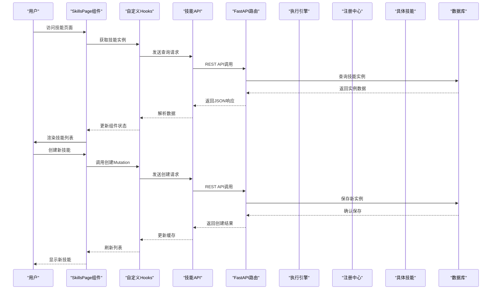

**图表来源**
- [frontend/src/app/(dashboard)/skills/page.tsx](file://frontend/src/app/(dashboard)/skills/page.tsx#L16-L41)
- [frontend/src/lib/hooks/use-skills.ts](file://frontend/src/lib/hooks/use-skills.ts#L17-L30)
- [api/routers/skills.py](file://api/routers/skills.py#L162-L201)

## 详细组件分析

### 技能注册中心（SkillRegistry）
注册中心是技能系统的核心枢纽，负责：
- 维护技能类型到类的映射表
- 提供技能注册、注销、创建和查询功能
- 支持装饰器方式的便捷注册

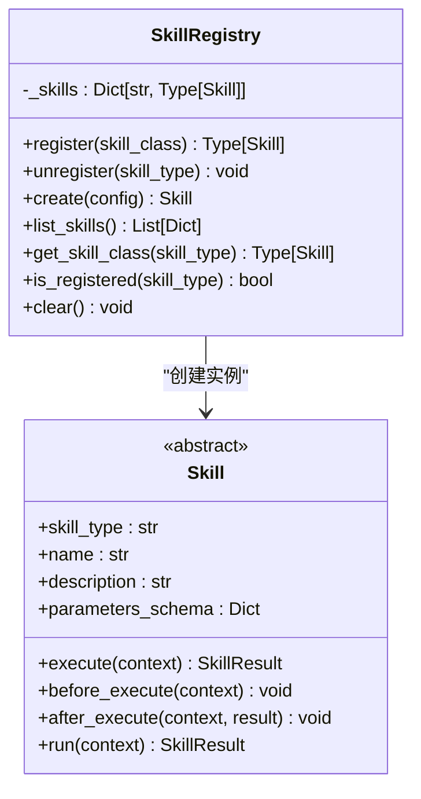

**图表来源**
- [open_notebook/skills/registry.py](file://open_notebook/skills/registry.py#L12-L133)

**章节来源**
- [open_notebook/skills/registry.py](file://open_notebook/skills/registry.py#L12-L133)

### 技能执行引擎（SkillRunner）
执行引擎负责技能的实际执行，具备以下能力：
- 支持通过技能实例ID执行和直接执行
- 管理执行生命周期，包括异常处理和日志记录
- 维护执行历史和状态跟踪
- 提供取消执行功能

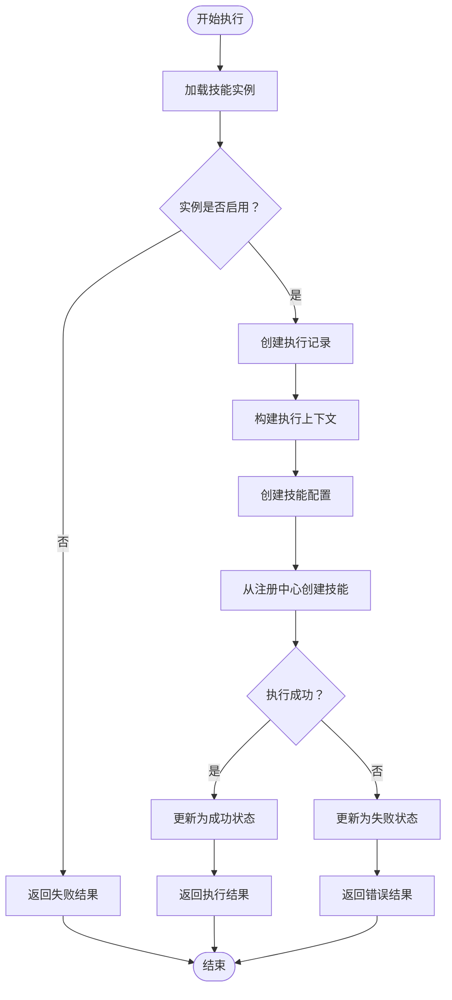

**图表来源**
- [open_notebook/skills/runner.py](file://open_notebook/skills/runner.py#L41-L150)

**章节来源**
- [open_notebook/skills/runner.py](file://open_notebook/skills/runner.py#L20-L250)

### 技能调度器（SkillScheduler）
调度器基于APScheduler实现Cron表达式的定时任务管理：
- 支持动态添加、删除和查询定时任务
- 自动加载数据库中的已启用技能实例
- 提供作业状态监控和管理

**章节来源**
- [open_notebook/skills/scheduler.py](file://open_notebook/skills/scheduler.py#L19-L236)

### 工作流服务（WorkflowService）
工作流服务提供高层的API接口，协调工作流引擎和领域模型：

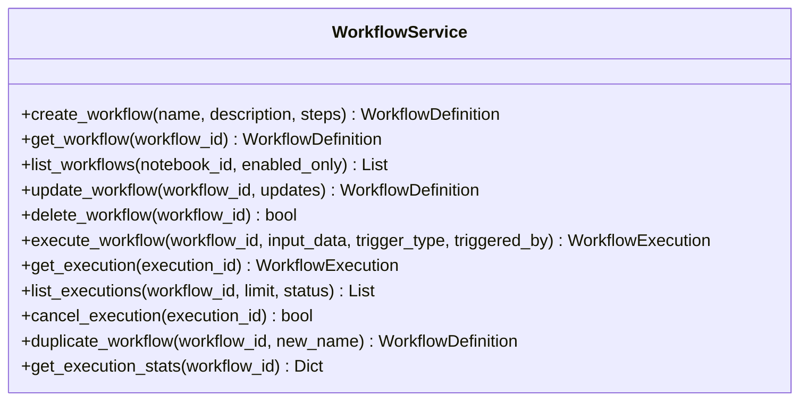

**图表来源**
- [open_notebook/workflows/service.py](file://open_notebook/workflows/service.py#L22-L240)

**章节来源**
- [open_notebook/workflows/service.py](file://open_notebook/workflows/service.py#L22-L240)

### Vikki技能套件
Vikki技能套件提供完整的IP内容运营解决方案：

#### 疼痛点扫描技能
- **规则引擎**: 基于关键词和模式识别疼痛点
- **AI增强**: 使用LangChain模型进行语义分析
- **多类型检测**: 支持即时、持续和隐藏三种类型
- **输出格式**: 结构化的疼痛点数据和统计信息

#### 四象限分类技能
- **启发式分类**: 基于关键词匹配的快速分类
- **AI精炼**: 对模糊案例进行AI二次分类
- **置信度评分**: 提供分类置信度和理由
- **内容缺口分析**: 识别内容分布不平衡

#### 主题生成技能
- **模板驱动**: 基于四象限框架的标题模板
- **AI创意**: 使用AI生成创意内容主题
- **性能预测**: 估算点击率和转化率
- **日历建议**: 提供内容发布时间建议

#### 内容适配技能
- **平台优化**: 针对不同平台的内容格式优化
- **长度控制**: 根据平台限制调整内容长度
- **风格适配**: 适应不同平台的表达风格
- **媒体建议**: 推荐适合的媒体类型

#### 账号诊断技能
- **生命周期识别**: 识别账号所处的发展阶段
- **增长分析**: 计算粉丝增长率和趋势
- **内容表现**: 分析内容表现和病毒性
- **策略建议**: 提供阶段性的内容策略

#### 主题评估技能
- **多维评分**: 交通潜力、转化潜力、可行性、差异化、平台适配
- **权重计算**: 基于维度权重计算总体分数
- **AI增强**: 对高分主题进行AI深度评估
- **改进建议**: 提供具体的优化建议

#### 比例监控技能
- **分布分析**: 计算四象限内容分布比例
- **偏差检测**: 识别与目标比例的偏差
- **健康评分**: 基于偏差程度计算健康分数
- **调整建议**: 提供具体的平衡调整建议

**章节来源**
- [open_notebook/skills/vikki_content_ops.py](file://open_notebook/skills/vikki_content_ops.py#L30-L2621)

### 具体技能实现

#### RSS内容爬虫（RssCrawlerSkill）
专门用于从RSS源抓取内容并创建源记录：
- 支持多个RSS源同时抓取
- 可配置最大条目数量和去重选项
- 自动生成源ID并链接到目标笔记本

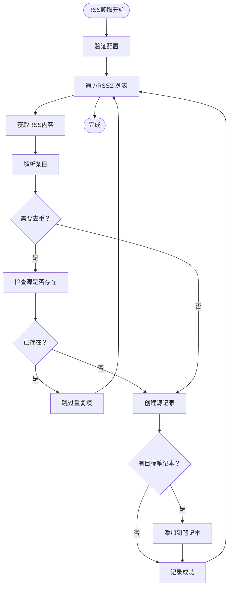

**图表来源**
- [open_notebook/skills/content_crawler.py](file://open_notebook/skills/content_crawler.py#L260-L310)

**章节来源**
- [open_notebook/skills/content_crawler.py](file://open_notebook/skills/content_crawler.py#L20-L315)

#### 浏览器自动化技能
提供基于browser-use的AI驱动浏览器自动化能力：

##### BrowserUseSkill基础类
- 封装浏览器初始化、清理和任务执行逻辑
- 集成LangChain模型进行自然语言控制
- 支持无头模式、超时设置和窗口大小配置

##### BrowserCrawlerSkill
- 使用AI智能浏览网站提取内容
- 支持跟随链接和自定义提取任务
- 适用于RSS无法获取的动态内容

##### BrowserTaskSkill
- 执行任意自然语言描述的浏览器任务
- 支持表单填写、数据提取和自动化测试
- 可配置截图保存和数据提取

##### BrowserMonitorSkill
- 监控网页变化并发送告警
- 支持价格监控、库存检查等功能
- 基于Cron表达式定期执行

**章节来源**
- [open_notebook/skills/browser_base.py](file://open_notebook/skills/browser_base.py#L17-L316)
- [open_notebook/skills/browser_task.py](file://open_notebook/skills/browser_task.py#L17-L271)

#### 笔记整理技能
提供AI驱动的笔记处理能力：

##### NoteSummarizerSkill
- 自动生成笔记摘要，支持多种摘要风格
- 可选择创建新笔记或更新现有笔记
- 集成LangChain模型进行高质量摘要生成

##### NoteTaggerSkill
- 自动为笔记和源生成标签
- 支持分类组织和主题标注
- 可配置标签类别和数量限制

**章节来源**
- [open_notebook/skills/note_organizer.py](file://open_notebook/skills/note_organizer.py#L19-L408)

## 依赖关系分析

```mermaid
graph TB
subgraph "外部依赖"
LangChain["LangChain"]
BrowserUse["browser-use"]
APScheduler["APScheduler"]
HTTPX["httpx"]
ReactQuery["React Query"]
TanStackTable["TanStack Table"]
LucideIcons["Lucide Icons"]
TailwindCSS["Tailwind CSS"]
Sonner["Sonner"]
ReactI18n["React I18n"]
end
subgraph "内部模块"
Base["base.py"]
Registry["registry.py"]
Runner["runner.py"]
Scheduler["scheduler.py"]
Domain["domain/skill.py"]
API["api/routers/skills.py"]
Frontend["frontend/src/app/(dashboard)/skills/"]
TSAPI["frontend/src/lib/api/skills.ts"]
Hooks["frontend/src/lib/hooks/"]
Workflows["open_notebook/workflows/"]
WorkflowDomain["open_notebook/domain/workflow.py"]
Vikki["open_notebook/skills/vikki_content_ops.py"]
end
subgraph "具体技能"
Crawler["content_crawler.py"]
BrowserBase["browser_base.py"]
BrowserTask["browser_task.py"]
Organizer["note_organizer.py"]
end
LangChain --> BrowserBase
LangChain --> Organizer
LangChain --> Vikki
BrowserUse --> BrowserBase
APScheduler --> Scheduler
HTTPX --> Crawler
ReactQuery --> Hooks
TanStackTable --> Frontend
LucideIcons --> Frontend
TailwindCSS --> Frontend
Sonner --> Hooks
ReactI18n --> Hooks
Base --> Registry
Registry --> Runner
Runner --> Scheduler
Runner --> Domain
Scheduler --> Runner
API --> Registry
API --> Runner
API --> Domain
TSAPI --> API
Frontend --> TSAPI
Frontend --> Hooks
Workflows --> WorkflowDomain
Workflows --> Runner
Workflows --> Registry
Workflows --> Domain
WorkflowDomain --> Domain
Vikki --> Domain
Crawler --> Domain
BrowserBase --> Domain
BrowserTask --> Domain
Organizer --> Domain
```

**图表来源**
- [open_notebook/skills/browser_base.py](file://open_notebook/skills/browser_base.py#L95-L121)
- [open_notebook/skills/note_organizer.py](file://open_notebook/skills/note_organizer.py#L115-L131)
- [open_notebook/skills/content_crawler.py](file://open_notebook/skills/content_crawler.py#L12-L13)

系统的主要依赖关系：
- **LangChain**: 提供AI模型集成和提示工程能力
- **browser-use**: 实现AI驱动的浏览器自动化
- **APScheduler**: 提供Cron表达式定时任务管理
- **httpx**: 用于HTTP请求和RSS内容获取
- **React Query**: 提供前端状态管理和缓存
- **TanStack Table**: 提供数据表格渲染
- **Lucide Icons**: 提供现代化图标系统
- **Tailwind CSS**: 提供原子化样式系统
- **Sonner**: 提供轻量级通知系统
- **React I18n**: 提供国际化支持

**章节来源**
- [open_notebook/skills/browser_base.py](file://open_notebook/skills/browser_base.py#L95-L121)
- [open_notebook/skills/note_organizer.py](file://open_notebook/skills/note_organizer.py#L115-L131)

## 性能考虑
技能系统在设计时充分考虑了性能和可扩展性：

### 异步执行
- 所有技能执行都是异步的，避免阻塞主线程
- 使用async/await模式处理I/O密集型任务
- 支持并发执行多个技能实例

### 资源管理
- 浏览器自动化技能在执行后自动清理资源
- 提供超时控制防止长时间占用
- 支持无头模式减少资源消耗

### 缓存和去重
- **前端缓存**: React Query提供智能缓存和失效策略
- **后端缓存**: 数据库查询结果缓存
- **重复数据**: RSS爬虫支持内容去重，避免重复处理
- **执行历史**: 详细的执行记录便于调试和性能分析

### 扩展性设计
- **插件化架构**: 可配置的技能注册机制
- **类型安全**: TypeScript提供编译时类型检查
- **模块化设计**: 自定义Hooks支持功能模块化
- **响应式更新**: React Query自动状态同步

### 性能优化
- **懒加载**: 组件按需加载，减少初始包大小
- **虚拟滚动**: 大数据集的高效渲染
- **防抖节流**: 输入验证和API调用优化
- **增量更新**: 乐观更新提升用户体验

### 工作流性能优化
- **并行执行**: 支持多个步骤并行执行
- **依赖图优化**: 高效的依赖关系计算
- **内存管理**: 及时清理执行上下文和中间结果
- **错误隔离**: 失败步骤不影响其他步骤执行

### Vikki技能性能优化
- **AI调用优化**: 合理控制AI模型调用频率
- **批量处理**: 支持批量内容处理和分析
- **缓存策略**: 对重复分析结果进行缓存
- **异步处理**: 长耗时任务异步执行

## 故障排除指南

### 常见问题及解决方案

#### 技能执行失败
**症状**: 技能执行返回失败状态
**可能原因**:
- 配置参数不正确
- 外部依赖不可用（如浏览器、网络）
- 权限不足

**解决步骤**:
1. 检查技能配置参数的有效性
2. 查看执行历史中的错误信息
3. 验证外部依赖的可用性
4. 检查日志输出获取详细错误信息

#### 前端状态管理问题
**症状**: React Query状态不同步或缓存异常
**可能原因**:
- 查询键配置错误
- 缓存失效策略不当
- 并发请求冲突

**解决步骤**:
1. 检查QUERY_KEYS配置的正确性
2. 验证staleTime和gcTime设置
3. 确认mutation后的缓存更新
4. 使用React Query DevTools调试

#### 浏览器自动化问题
**症状**: browser-use相关技能执行失败
**可能原因**:
- Chrome浏览器未安装或路径不正确
- LLM API密钥配置错误
- 网络连接问题

**解决步骤**:
1. 确认Chrome浏览器已正确安装
2. 检查LLM提供商配置
3. 验证网络连接稳定性
4. 尝试禁用无头模式进行调试

#### 定时任务异常
**症状**: 技能按计划执行但结果异常
**可能原因**:
- Cron表达式格式错误
- 时间同步问题
- 资源竞争导致的任务冲突

**解决步骤**:
1. 验证Cron表达式的正确性
2. 检查系统时间同步状态
3. 查看调度器状态和作业列表
4. 调整任务间隔避免重叠执行

#### 工作流执行问题
**症状**: 工作流执行失败或卡住
**可能原因**:
- 步骤依赖关系配置错误
- 条件表达式语法错误
- 技能参数模板解析失败
- 资源竞争或死锁

**解决步骤**:
1. 检查工作流定义的步骤依赖关系
2. 验证条件表达式的语法正确性
3. 确认参数模板变量引用有效
4. 查看执行历史中的错误详情
5. 使用工作流统计信息分析执行模式

#### AI工作流构建问题
**症状**: AI助手无法生成有效的工作流定义
**可能原因**:
- 用户描述不够清晰
- AI模型配置问题
- 可用技能列表为空

**解决步骤**:
1. 提供更具体和详细的工作流描述
2. 检查AI模型的可用性和配置
3. 确认技能注册中心正常工作
4. 尝试简化工作流需求重新生成

#### Vikki技能问题
**症状**: Vikki内容运营技能执行异常
**可能原因**:
- AI模型调用失败
- 输入参数格式不正确
- 内容分析结果为空
- 平台适配配置错误

**解决步骤**:
1. 检查AI模型配置和可用性
2. 验证输入参数的格式和完整性
3. 确认源内容和笔记内容存在
4. 检查平台配置和限制
5. 查看技能输出的详细日志

**章节来源**
- [open_notebook/skills/runner.py](file://open_notebook/skills/runner.py#L133-L149)
- [open_notebook/skills/scheduler.py](file://open_notebook/skills/scheduler.py#L114-L116)
- [open_notebook/workflows/engine.py](file://open_notebook/workflows/engine.py#L234-L248)
- [open_notebook/workflows/conversational.py](file://open_notebook/workflows/conversational.py#L176-L182)
- [open_notebook/skills/vikki_content_ops.py](file://open_notebook/skills/vikki_content_ops.py#L318-L394)

## 结论
Open Notebook的技能系统提供了一个强大而灵活的自动化平台，现已全面升级至现代化技术栈。通过模块化的架构设计、完善的生命周期管理、丰富的API接口以及现代化的React前端界面，用户可以轻松创建、配置和执行各种自动化任务。

**新增** 系统现已扩展为完整的工作流编排平台，支持多技能协同执行、条件判断、重试机制和执行监控等功能。工作流功能通过以下方式增强了系统的价值：

### 核心优势
- **现代化技术栈**: React 18、TypeScript、React Query等最新技术
- **强类型安全**: 编译时类型检查，减少运行时错误
- **智能状态管理**: React Query提供自动缓存和状态同步
- **优雅的用户界面**: Tailwind CSS和Lucide Icons打造现代化UI
- **国际化支持**: 完善的多语言切换机制
- **性能优化**: 懒加载、虚拟滚动、缓存策略等优化措施
- **易用性**: 直观的创建向导和操作流程
- **可扩展性**: 插件化的技能注册机制支持自定义扩展
- **可靠性**: 完善的错误处理和执行历史记录
- **可维护性**: 清晰的代码结构和类型定义
- **工作流编排**: 多技能协同执行和智能监控
- **AI辅助**: 自然语言生成工作流定义
- **模板系统**: 预定义的工作流模板加速创建过程
- **内容运营**: 完整的Vikki内容运营技能套件

### 工作流功能特色
- **多技能编排**: 支持复杂的多步骤自动化流程
- **依赖管理**: 确保步骤按正确的顺序执行
- **条件执行**: 基于业务逻辑的智能步骤控制
- **重试机制**: 提高执行的可靠性和容错性
- **执行监控**: 实时跟踪工作流状态和性能指标
- **模板系统**: 快速创建常用的工作流模式
- **AI集成**: 通过自然语言创建和优化工作流

### Vikki内容运营技能优势
- **四象限方法论**: 基于科学的内容策略框架
- **自动化程度高**: 从内容发现到执行的全流程自动化
- **AI增强**: 结合规则引擎和AI模型提供更准确的分析
- **可扩展性强**: 支持自定义技能和工作流扩展
- **可视化监控**: 提供内容分布和策略执行的可视化分析

建议用户充分利用系统的现代化特性，结合TypeScript的类型安全和React Query的状态管理，构建更加稳定和高效的工作流自动化解决方案。通过合理的工作流设计和调度策略，充分发挥Open Notebook平台的强大功能，实现从内容收集、处理到发布的完整自动化流程。

通过Vikki内容运营技能套件，用户可以建立基于数据驱动的内容运营体系，实现从用户痛点识别到内容发布的完整闭环，显著提升内容质量和运营效率。