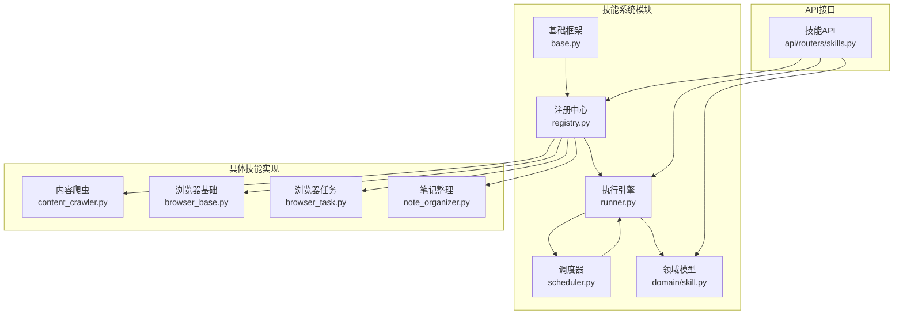
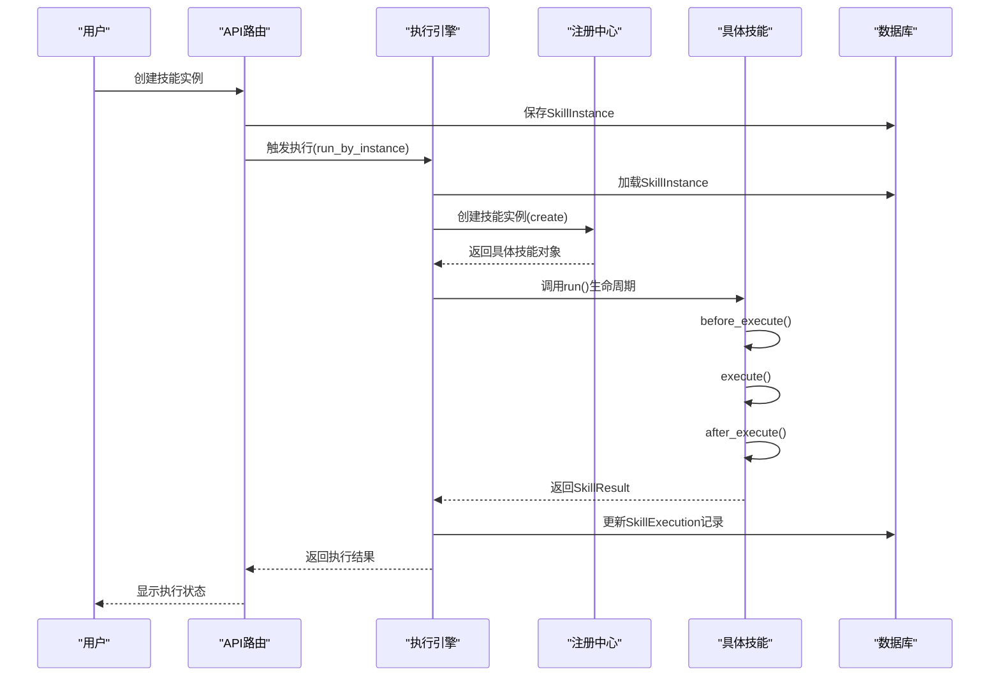
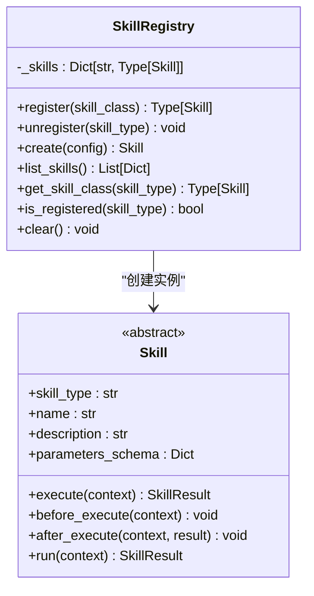
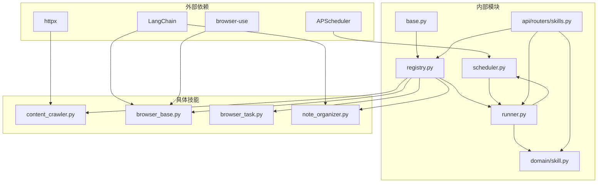

# 技能系统用户指南

<cite>
**本文档引用的文件**
- [open_notebook/skills/__init__.py](file://open_notebook/skills/__init__.py)
- [open_notebook/skills/base.py](file://open_notebook/skills/base.py)
- [open_notebook/skills/registry.py](file://open_notebook/skills/registry.py)
- [open_notebook/skills/runner.py](file://open_notebook/skills/runner.py)
- [open_notebook/skills/scheduler.py](file://open_notebook/skills/scheduler.py)
- [open_notebook/skills/content_crawler.py](file://open_notebook/skills/content_crawler.py)
- [open_notebook/skills/browser_base.py](file://open_notebook/skills/browser_base.py)
- [open_notebook/skills/browser_task.py](file://open_notebook/skills/browser_task.py)
- [open_notebook/skills/note_organizer.py](file://open_notebook/skills/note_organizer.py)
- [api/routers/skills.py](file://api/routers/skills.py)
- [open_notebook/domain/skill.py](file://open_notebook/domain/skill.py)
</cite>

## 目录
1. [简介](#简介)
2. [项目结构](#项目结构)
3. [核心组件](#核心组件)
4. [架构总览](#架构总览)
5. [详细组件分析](#详细组件分析)
6. [依赖关系分析](#依赖关系分析)
7. [性能考虑](#性能考虑)
8. [故障排除指南](#故障排除指南)
9. [结论](#结论)

## 简介
本指南面向Open Notebook的技能系统用户，帮助您理解技能系统的工作原理、使用方法以及最佳实践。技能系统基于LangChain构建，提供可重用的自动化单元，能够通过手动触发、定时调度或事件触发等方式执行内容抓取、网页自动化、笔记整理等任务。

## 项目结构
技能系统主要分布在以下模块中：
- 基础框架：定义技能抽象类、上下文、结果、配置等核心概念
- 注册中心：维护技能类型到具体实现的映射
- 执行引擎：负责异步执行技能、生命周期管理、错误处理
- 调度器：基于APScheduler实现Cron表达式的定时任务管理
- 具体技能：包括RSS爬虫、浏览器自动化、笔记整理等
- API路由：提供REST接口用于技能实例的创建、更新、执行和历史查询
- 领域模型：数据库模型用于持久化技能实例和执行历史

**图表来源**
- [open_notebook/skills/base.py](file://open_notebook/skills/base.py#L83-L183)
- [open_notebook/skills/registry.py](file://open_notebook/skills/registry.py#L12-L133)
- [open_notebook/skills/runner.py](file://open_notebook/skills/runner.py#L20-L250)
- [open_notebook/skills/scheduler.py](file://open_notebook/skills/scheduler.py#L19-L236)
- [api/routers/skills.py](file://api/routers/skills.py#L11-L507)

**章节来源**
- [open_notebook/skills/__init__.py](file://open_notebook/skills/__init__.py#L1-L35)

## 核心组件
技能系统的核心组件包括：

### 技能基类（Skill）
- 定义技能的抽象接口和生命周期钩子
- 提供参数验证、执行前后钩子、统一的执行流程
- 支持手动执行、计划执行和事件触发

### 技能配置（SkillConfig）
- 存储技能实例的配置信息
- 包含技能类型、名称、描述、启用状态、Cron表达式、参数和目标笔记本ID

### 技能上下文（SkillContext）
- 传递执行时所需的运行时信息
- 包括触发类型、触发时间、笔记本ID、源ID、用户ID和参数字典

### 技能结果（SkillResult）
- 记录技能执行的结果和状态
- 包含开始时间、结束时间、输出数据、错误信息以及创建的源和笔记ID

**章节来源**
- [open_notebook/skills/base.py](file://open_notebook/skills/base.py#L17-L183)

## 架构总览
技能系统采用分层架构设计，各层职责清晰：

**图表来源**
- [api/routers/skills.py](file://api/routers/skills.py#L162-L201)
- [open_notebook/skills/runner.py](file://open_notebook/skills/runner.py#L41-L150)
- [open_notebook/skills/registry.py](file://open_notebook/skills/registry.py#L58-L79)

## 详细组件分析

### 技能注册中心（SkillRegistry）
注册中心是技能系统的核心枢纽，负责：
- 维护技能类型到类的映射表
- 提供技能注册、注销、创建和查询功能
- 支持装饰器方式的便捷注册

**图表来源**
- [open_notebook/skills/registry.py](file://open_notebook/skills/registry.py#L12-L133)

**章节来源**
- [open_notebook/skills/registry.py](file://open_notebook/skills/registry.py#L12-L133)

### 技能执行引擎（SkillRunner）
执行引擎负责技能的实际执行，具备以下能力：
- 支持通过技能实例ID执行和直接执行
- 管理执行生命周期，包括异常处理和日志记录
- 维护执行历史和状态跟踪
- 提供取消执行功能

**图表来源**
- [open_notebook/skills/runner.py](file://open_notebook/skills/runner.py#L41-L150)

**章节来源**
- [open_notebook/skills/runner.py](file://open_notebook/skills/runner.py#L20-L250)

### 技能调度器（SkillScheduler）
调度器基于APScheduler实现Cron表达式的定时任务管理：
- 支持动态添加、删除和查询定时任务
- 自动加载数据库中的已启用技能实例
- 提供作业状态监控和管理

**章节来源**
- [open_notebook/skills/scheduler.py](file://open_notebook/skills/scheduler.py#L19-L236)

### 具体技能实现

#### RSS内容爬虫（RssCrawlerSkill）
专门用于从RSS源抓取内容并创建源记录：
- 支持多个RSS源同时抓取
- 可配置最大条目数量和去重选项
- 自动生成源ID并链接到目标笔记本

**图表来源**
- [open_notebook/skills/content_crawler.py](file://open_notebook/skills/content_crawler.py#L260-L310)

**章节来源**
- [open_notebook/skills/content_crawler.py](file://open_notebook/skills/content_crawler.py#L20-L315)

#### 浏览器自动化技能
提供基于browser-use的AI驱动浏览器自动化能力：

##### BrowserUseSkill基础类
- 封装浏览器初始化、清理和任务执行逻辑
- 集成LangChain模型进行自然语言控制
- 支持无头模式、超时设置和窗口大小配置

##### BrowserCrawlerSkill
- 使用AI智能浏览网站提取内容
- 支持跟随链接和自定义提取任务
- 适用于RSS无法获取的动态内容

##### BrowserTaskSkill
- 执行任意自然语言描述的浏览器任务
- 支持表单填写、数据提取和自动化测试
- 可配置截图保存和数据提取

##### BrowserMonitorSkill
- 监控网页变化并发送告警
- 支持价格监控、库存检查等功能
- 基于Cron表达式定期执行

**章节来源**
- [open_notebook/skills/browser_base.py](file://open_notebook/skills/browser_base.py#L17-L316)
- [open_notebook/skills/browser_task.py](file://open_notebook/skills/browser_task.py#L17-L271)

#### 笔记整理技能
提供AI驱动的笔记处理能力：

##### NoteSummarizerSkill
- 自动生成笔记摘要，支持多种摘要风格
- 可选择创建新笔记或更新现有笔记
- 集成LangChain模型进行高质量摘要生成

##### NoteTaggerSkill
- 自动为笔记和源生成标签
- 支持分类组织和主题标注
- 可配置标签类别和数量限制

**章节来源**
- [open_notebook/skills/note_organizer.py](file://open_notebook/skills/note_organizer.py#L19-L408)

## 依赖关系分析

**图表来源**
- [open_notebook/skills/browser_base.py](file://open_notebook/skills/browser_base.py#L95-L121)
- [open_notebook/skills/note_organizer.py](file://open_notebook/skills/note_organizer.py#L115-L131)
- [open_notebook/skills/content_crawler.py](file://open_notebook/skills/content_crawler.py#L12-L13)

系统的主要依赖关系：
- LangChain：提供AI模型集成和提示工程能力
- browser-use：实现AI驱动的浏览器自动化
- APScheduler：提供Cron表达式定时任务管理
- httpx：用于HTTP请求和RSS内容获取

**章节来源**
- [open_notebook/skills/browser_base.py](file://open_notebook/skills/browser_base.py#L95-L121)
- [open_notebook/skills/note_organizer.py](file://open_notebook/skills/note_organizer.py#L115-L131)

## 性能考虑
技能系统在设计时充分考虑了性能和可扩展性：

### 异步执行
- 所有技能执行都是异步的，避免阻塞主线程
- 使用async/await模式处理I/O密集型任务
- 支持并发执行多个技能实例

### 资源管理
- 浏览器自动化技能在执行后自动清理资源
- 提供超时控制防止长时间占用
- 支持无头模式减少资源消耗

### 缓存和去重
- RSS爬虫支持内容去重，避免重复处理
- 源ID生成使用哈希算法确保唯一性
- 执行历史记录便于调试和性能分析

### 扩展性设计
- 插件化的技能注册机制
- 可配置的参数模式支持灵活扩展
- 分层架构便于功能模块化

## 故障排除指南

### 常见问题及解决方案

#### 技能执行失败
**症状**：技能执行返回失败状态
**可能原因**：
- 配置参数不正确
- 外部依赖不可用（如浏览器、网络）
- 权限不足

**解决步骤**：
1. 检查技能配置参数的有效性
2. 查看执行历史中的错误信息
3. 验证外部依赖的可用性
4. 检查日志输出获取详细错误信息

#### 浏览器自动化问题
**症状**：browser-use相关技能执行失败
**可能原因**：
- Chrome浏览器未安装或路径不正确
- LLM API密钥配置错误
- 网络连接问题

**解决步骤**：
1. 确认Chrome浏览器已正确安装
2. 检查LLM提供商配置
3. 验证网络连接稳定性
4. 尝试禁用无头模式进行调试

#### 定时任务异常
**症状**：技能按计划执行但结果异常
**可能原因**：
- Cron表达式格式错误
- 时间同步问题
- 资源竞争导致的任务冲突

**解决步骤**：
1. 验证Cron表达式的正确性
2. 检查系统时间同步状态
3. 查看调度器状态和作业列表
4. 调整任务间隔避免重叠执行

**章节来源**
- [open_notebook/skills/runner.py](file://open_notebook/skills/runner.py#L133-L149)
- [open_notebook/skills/scheduler.py](file://open_notebook/skills/scheduler.py#L114-L116)

## 结论
Open Notebook的技能系统提供了一个强大而灵活的自动化平台，支持从内容抓取到智能笔记整理的多种应用场景。通过模块化的架构设计、完善的生命周期管理和丰富的API接口，用户可以轻松创建、配置和执行各种自动化任务。

系统的主要优势包括：
- **易用性**：简洁的API和直观的配置界面
- **可扩展性**：插件化的技能注册机制支持自定义扩展
- **可靠性**：完善的错误处理和执行历史记录
- **性能**：异步执行和资源管理优化

建议用户根据实际需求选择合适的技能类型，合理配置参数和调度策略，充分利用系统的监控和调试功能，以获得最佳的使用体验。