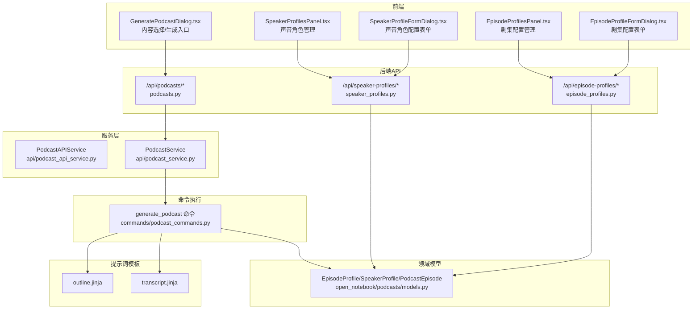
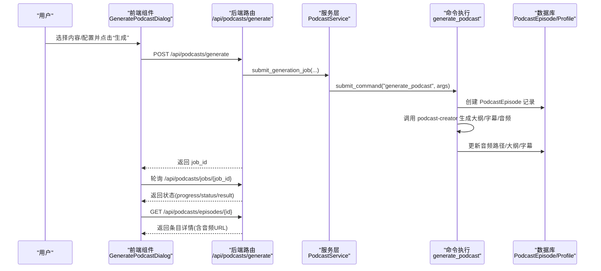
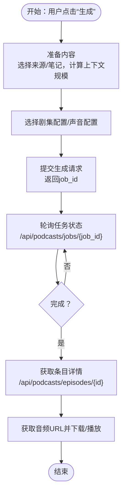
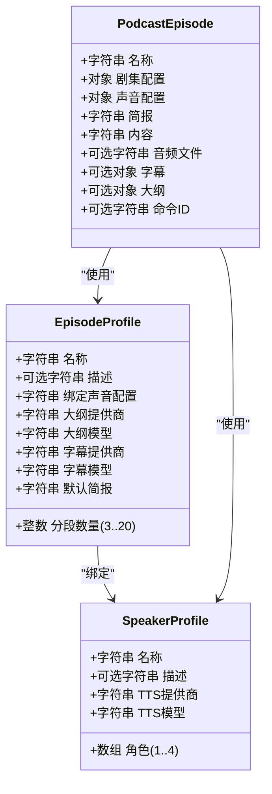
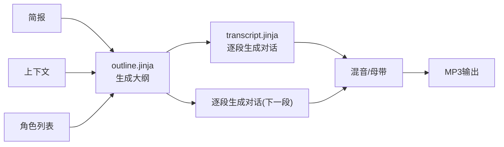
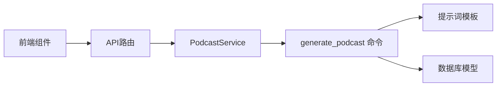

# 播客制作

<cite>
**本文引用的文件**
- [api/routers/podcasts.py](file://api/routers/podcasts.py)
- [api/podcast_service.py](file://api/podcast_service.py)
- [api/podcast_api_service.py](file://api/podcast_api_service.py)
- [commands/podcast_commands.py](file://commands/podcast_commands.py)
- [open_notebook/podcasts/models.py](file://open_notebook/podcasts/models.py)
- [prompts/podcast/outline.jinja](file://prompts/podcast/outline.jinja)
- [prompts/podcast/transcript.jinja](file://prompts/podcast/transcript.jinja)
- [docs/3-USER-GUIDE/creating-podcasts.md](file://docs/3-USER-GUIDE/creating-podcasts.md)
- [frontend/src/components/podcasts/GeneratePodcastDialog.tsx](file://frontend/src/components/podcasts/GeneratePodcastDialog.tsx)
- [frontend/src/components/podcasts/forms/EpisodeProfileFormDialog.tsx](file://frontend/src/components/podcasts/forms/EpisodeProfileFormDialog.tsx)
- [frontend/src/components/podcasts/forms/SpeakerProfileFormDialog.tsx](file://frontend/src/components/podcasts/forms/SpeakerProfileFormDialog.tsx)
- [frontend/src/components/podcasts/EpisodeProfilesPanel.tsx](file://frontend/src/components/podcasts/EpisodeProfilesPanel.tsx)
- [frontend/src/components/podcasts/SpeakerProfilesPanel.tsx](file://frontend/src/components/podcasts/SpeakerProfilesPanel.tsx)
- [api/routers/episode_profiles.py](file://api/routers/episode_profiles.py)
- [api/routers/speaker_profiles.py](file://api/routers/speaker_profiles.py)
</cite>

## 目录
1. [简介](#简介)
2. [项目结构](#项目结构)
3. [核心组件](#核心组件)
4. [架构总览](#架构总览)
5. [详细组件分析](#详细组件分析)
6. [依赖关系分析](#依赖关系分析)
7. [性能考量](#性能考量)
8. [故障排查指南](#故障排查指南)
9. [结论](#结论)
10. [附录](#附录)

## 简介
本指南面向使用“播客制作”功能的用户与维护者，系统讲解从研究内容到音频播客的完整工作流：内容准备、角色配置、TTS 设置、生成过程、质量优化、发布与分享、后续编辑与重生成，以及播客与研究内容（笔记、来源）的关联方式。文档同时提供最佳实践与常见问题解决方案。

## 项目结构
播客功能由后端 API、服务层、命令执行器、前端交互组件与提示词模板共同组成，采用“配置驱动 + 背景任务”的模式实现非阻塞生成与状态跟踪。

图表来源
- [api/routers/podcasts.py](file://api/routers/podcasts.py#L1-L234)
- [api/routers/episode_profiles.py](file://api/routers/episode_profiles.py#L1-L257)
- [api/routers/speaker_profiles.py](file://api/routers/speaker_profiles.py#L1-L217)
- [api/podcast_service.py](file://api/podcast_service.py#L1-L207)
- [api/podcast_api_service.py](file://api/podcast_api_service.py#L1-L126)
- [commands/podcast_commands.py](file://commands/podcast_commands.py#L1-L188)
- [open_notebook/podcasts/models.py](file://open_notebook/podcasts/models.py#L1-L148)
- [prompts/podcast/outline.jinja](file://prompts/podcast/outline.jinja#L1-L84)
- [prompts/podcast/transcript.jinja](file://prompts/podcast/transcript.jinja#L1-L135)

章节来源
- [api/routers/podcasts.py](file://api/routers/podcasts.py#L1-L234)
- [api/podcast_service.py](file://api/podcast_service.py#L1-L207)
- [commands/podcast_commands.py](file://commands/podcast_commands.py#L1-L188)
- [open_notebook/podcasts/models.py](file://open_notebook/podcasts/models.py#L1-L148)
- [prompts/podcast/outline.jinja](file://prompts/podcast/outline.jinja#L1-L84)
- [prompts/podcast/transcript.jinja](file://prompts/podcast/transcript.jinja#L1-L135)

## 核心组件
- 配置模型
  - 剧集配置（EpisodeProfile）：定义大纲与字幕生成的 AI 提供商/模型、默认简报、分段数量、绑定的声音配置名。
  - 声音配置（SpeakerProfile）：定义 TTS 提供商/模型与多角色（1-4人）的姓名、语音ID、背景故事、个性。
  - 播客条目（PodcastEpisode）：记录生成任务、输出路径、大纲、字幕、关联的后台命令ID。
- 服务层
  - PodcastService：提交生成任务、查询任务状态、列举/获取条目；负责校验配置、拼装命令参数并调用 surreal-commands。
  - PodcastAPIService：封装 API 客户端，用于前端直接调用剧集/声音配置的增删改查与复制。
- 前端组件
  - GeneratePodcastDialog：内容选择（来源/笔记）、剧集/声音配置选择、生成触发、进度与结果展示。
  - EpisodeProfileFormDialog / SpeakerProfileFormDialog：可视化表单，约束字段与数量，联动模型列表。
  - EpisodeProfilesPanel / SpeakerProfilesPanel：配置列表、复制/删除、使用统计。
- 命令执行
  - generate_podcast 命令：加载配置、写入条目、调用 podcast-creator 库生成大纲/字幕/音频，并持久化结果。
- 提示词模板
  - outline.jinja：根据简报与上下文生成结构化分段大纲。
  - transcript.jinja：基于大纲与上下文生成各段对话，匹配角色个性与出场顺序。

章节来源
- [open_notebook/podcasts/models.py](file://open_notebook/podcasts/models.py#L10-L148)
- [api/podcast_service.py](file://api/podcast_service.py#L33-L207)
- [api/podcast_api_service.py](file://api/podcast_api_service.py#L13-L126)
- [frontend/src/components/podcasts/GeneratePodcastDialog.tsx](file://frontend/src/components/podcasts/GeneratePodcastDialog.tsx#L1-L984)
- [frontend/src/components/podcasts/forms/EpisodeProfileFormDialog.tsx](file://frontend/src/components/podcasts/forms/EpisodeProfileFormDialog.tsx#L1-L452)
- [frontend/src/components/podcasts/forms/SpeakerProfileFormDialog.tsx](file://frontend/src/components/podcasts/forms/SpeakerProfileFormDialog.tsx#L1-L406)
- [commands/podcast_commands.py](file://commands/podcast_commands.py#L31-L188)
- [prompts/podcast/outline.jinja](file://prompts/podcast/outline.jinja#L1-L84)
- [prompts/podcast/transcript.jinja](file://prompts/podcast/transcript.jinja#L1-L135)

## 架构总览
播客生成采用“非阻塞后台任务 + 状态轮询”的模式：前端提交生成请求后立即返回任务ID，后端通过 surreal-commands 异步执行，前端可轮询任务状态或直接查看条目详情与音频链接。

图表来源
- [api/routers/podcasts.py](file://api/routers/podcasts.py#L40-L83)
- [api/podcast_service.py](file://api/podcast_service.py#L36-L138)
- [commands/podcast_commands.py](file://commands/podcast_commands.py#L49-L167)
- [open_notebook/podcasts/models.py](file://open_notebook/podcasts/models.py#L90-L148)

章节来源
- [api/routers/podcasts.py](file://api/routers/podcasts.py#L40-L83)
- [api/podcast_service.py](file://api/podcast_service.py#L36-L138)
- [commands/podcast_commands.py](file://commands/podcast_commands.py#L49-L167)

## 详细组件分析

### 组件A：生成流程与状态管理
- 内容准备
  - 前端支持在笔记本内选择来源（全文/摘要）与笔记，自动计算 token/字符数，帮助控制生成规模。
  - 支持按笔记本聚合构建上下文，避免一次性传输海量文本。
- 角色配置
  - 剧集配置绑定声音配置名；声音配置包含 TTS 提供商/模型与 1-4 个角色，每个角色有 voice_id、背景故事、个性。
- TTS 设置
  - 声音配置统一指定 TTS 提供商与模型；不同提供商音色、速度、成本差异较大，建议按用途选择。
- 生成过程
  - 后端提交命令至 surreal-commands，命令加载所有配置，调用 podcast-creator 生成大纲、字幕与音频，最终落库并返回结果。
- 结果与下载
  - 条目包含音频文件路径、字幕、大纲；前端可直接播放或下载 MP3。

图表来源
- [frontend/src/components/podcasts/GeneratePodcastDialog.tsx](file://frontend/src/components/podcasts/GeneratePodcastDialog.tsx#L556-L780)
- [api/routers/podcasts.py](file://api/routers/podcasts.py#L71-L83)
- [api/podcast_service.py](file://api/podcast_service.py#L114-L138)
- [commands/podcast_commands.py](file://commands/podcast_commands.py#L128-L167)

章节来源
- [frontend/src/components/podcasts/GeneratePodcastDialog.tsx](file://frontend/src/components/podcasts/GeneratePodcastDialog.tsx#L556-L780)
- [api/routers/podcasts.py](file://api/routers/podcasts.py#L71-L83)
- [api/podcast_service.py](file://api/podcast_service.py#L114-L138)
- [commands/podcast_commands.py](file://commands/podcast_commands.py#L128-L167)

### 组件B：配置面板与表单（剧集/声音）
- 剧集配置（EpisodeProfile）
  - 字段：名称、描述、绑定声音配置、大纲/字幕模型提供商与模型、默认简报、分段数量（3-20）。
  - 表单校验：必填项、整数范围、模型联动。
  - 列表：显示概要、默认简报预览、与声音配置关联。
- 声音配置（SpeakerProfile）
  - 字段：名称、描述、TTS 提供商/模型、角色数组（1-4），每角色含姓名、voice_id、背景故事、个性。
  - 表单校验：角色数量限制与必填字段检查。
  - 列表：显示 TTS 提供商/模型、角色卡片、使用计数与删除保护。

图表来源
- [open_notebook/podcasts/models.py](file://open_notebook/podcasts/models.py#L10-L148)

章节来源
- [frontend/src/components/podcasts/forms/EpisodeProfileFormDialog.tsx](file://frontend/src/components/podcasts/forms/EpisodeProfileFormDialog.tsx#L36-L49)
- [frontend/src/components/podcasts/forms/SpeakerProfileFormDialog.tsx](file://frontend/src/components/podcasts/forms/SpeakerProfileFormDialog.tsx#L39-L55)
- [frontend/src/components/podcasts/EpisodeProfilesPanel.tsx](file://frontend/src/components/podcasts/EpisodeProfilesPanel.tsx#L47-L52)
- [frontend/src/components/podcasts/SpeakerProfilesPanel.tsx](file://frontend/src/components/podcasts/SpeakerProfilesPanel.tsx#L47-L51)
- [open_notebook/podcasts/models.py](file://open_notebook/podcasts/models.py#L10-L148)

### 组件C：提示词与生成管线
- 大纲生成（outline.jinja）
  - 输入：简报、上下文、角色列表、分段数量。
  - 输出：结构化分段大纲（名称、描述、长度）。
- 对话生成（transcript.jinja）
  - 输入：简报、上下文、大纲、当前已生成字幕（可选）、是否为最终段。
  - 输出：该段对话（按角色出场与个性自然分配）。
- 命令执行（generate_podcast）
  - 加载所有配置，创建 PodcastEpisode 记录，调用 podcast-creator，保存音频路径、字幕、大纲。

图表来源
- [prompts/podcast/outline.jinja](file://prompts/podcast/outline.jinja#L1-L84)
- [prompts/podcast/transcript.jinja](file://prompts/podcast/transcript.jinja#L1-L135)
- [commands/podcast_commands.py](file://commands/podcast_commands.py#L128-L167)

章节来源
- [prompts/podcast/outline.jinja](file://prompts/podcast/outline.jinja#L1-L84)
- [prompts/podcast/transcript.jinja](file://prompts/podcast/transcript.jinja#L1-L135)
- [commands/podcast_commands.py](file://commands/podcast_commands.py#L128-L167)

## 依赖关系分析
- 组件耦合
  - 前端 GeneratePodcastDialog 依赖内容构建接口与剧集/声音配置列表；与 PodcastService 的交互通过 API 层。
  - PodcastService 依赖 surreal-commands 提交与查询命令状态，依赖数据库模型读写。
  - generate_podcast 命令依赖 podcast-creator 库与提示词模板，持久化 PodcastEpisode。
- 外部依赖
  - TTS 提供商（OpenAI/Google/ElevenLabs/本地）影响音色、速度与成本。
  - 提示词模板对模型输出稳定性有直接影响，需避免模型扩展思考标签导致解析失败。
- 可能的循环依赖
  - 未见直接循环导入；服务层与命令层通过命令注册机制解耦。

图表来源
- [api/routers/podcasts.py](file://api/routers/podcasts.py#L1-L234)
- [api/podcast_service.py](file://api/podcast_service.py#L1-L207)
- [commands/podcast_commands.py](file://commands/podcast_commands.py#L1-L188)
- [open_notebook/podcasts/models.py](file://open_notebook/podcasts/models.py#L1-L148)

章节来源
- [api/routers/podcasts.py](file://api/routers/podcasts.py#L1-L234)
- [api/podcast_service.py](file://api/podcast_service.py#L1-L207)
- [commands/podcast_commands.py](file://commands/podcast_commands.py#L1-L188)
- [open_notebook/podcasts/models.py](file://open_notebook/podcasts/models.py#L1-L148)

## 性能考量
- 生成时长
  - 与内容规模、模型与 TTS 成本相关；通常 5 分钟内容 3-10 分钟完成。
- 上下文控制
  - 通过前端“内容选择面板”限制来源/笔记数量与模式（摘要/全文），避免超大上下文导致生成缓慢或失败。
- 并发与批处理
  - 建议一次生成控制在 3-5 个来源以内，确保质量与速度平衡。
- 存储与IO
  - 生成目录位于数据目录下的 podcasts/episodes/{episode_name}，注意磁盘空间与权限。

章节来源
- [docs/3-USER-GUIDE/creating-podcasts.md](file://docs/3-USER-GUIDE/creating-podcasts.md#L217-L221)
- [frontend/src/components/podcasts/GeneratePodcastDialog.tsx](file://frontend/src/components/podcasts/GeneratePodcastDialog.tsx#L556-L622)
- [commands/podcast_commands.py](file://commands/podcast_commands.py#L122-L127)

## 故障排查指南
- 生成失败
  - 检查网络连接（尤其是 TTS），尝试本地 TTS 或减少来源数量。
  - 若使用 GPT-5 等使用扩展思考的模型，可能出现 JSON 解析错误，建议更换为 gpt-4o/gpt-4o-mini/gpt-4-turbo。
- 音频质量不佳
  - 尝试不同提供商/语音；缩短句子；调整口语节奏；确保背景噪声低。
- 内容缺失
  - 确认已在内容选择中勾选对应来源/笔记；检查大纲与简报；必要时更换更细致的模型。
- 角色辨识度低
  - 使用不同提供商/语音；增强角色个性差异；尝试 2/3/4 人组合。
- 删除受限
  - 声音配置被剧集配置引用时不可删除，先解除引用再删除。

章节来源
- [docs/3-USER-GUIDE/creating-podcasts.md](file://docs/3-USER-GUIDE/creating-podcasts.md#L421-L483)
- [commands/podcast_commands.py](file://commands/podcast_commands.py#L169-L187)
- [frontend/src/components/podcasts/SpeakerProfilesPanel.tsx](file://frontend/src/components/podcasts/SpeakerProfilesPanel.tsx#L84-L86)

## 结论
播客制作以“配置驱动 + 非阻塞生成”为核心，结合前端可视化配置与后端命令执行，形成从研究内容到可消费音频的高效闭环。通过合理的内容筛选、角色与 TTS 配置、提示词模板与质量优化策略，可在保证效率的同时获得高质量播客输出。

## 附录

### 播客制作操作清单（用户）
- 准备阶段
  - 确保来源已处理就绪；整理笔记；明确主题与受众。
- 内容选择
  - 在笔记本中勾选 3-5 个关键来源与分析性笔记；优先摘要/全文按需切换。
- 配置选择
  - 选择合适的剧集配置（节拍/时长/格式）；选择声音配置（提供商/模型/角色）。
- 生成与审听
  - 提交生成后轮询进度；完成后审听字幕与音频；按需导出 MP3/字幕。
- 发布与分享
  - 下载 MP3 至本地；导出字幕；生成分享链接；上传至平台。

章节来源
- [docs/3-USER-GUIDE/creating-podcasts.md](file://docs/3-USER-GUIDE/creating-podcasts.md#L7-L244)
- [frontend/src/components/podcasts/GeneratePodcastDialog.tsx](file://frontend/src/components/podcasts/GeneratePodcastDialog.tsx#L782-L800)

### 播客配置选项速览（用户）
- 剧集配置
  - 提供商/模型：大纲与字幕生成；默认简报；分段数量（3-20）。
- 声音配置
  - TTS 提供商/模型；角色数量（1-4）；每个角色的 voice_id、背景故事、个性。
- TTS 选择建议
  - 开源/本地：隐私优先，免费但音色基础。
  - Google：音质佳、多口音，性价比高。
  - OpenAI：速度快、自然度好。
  - ElevenLabs：表达力强但较慢且成本较高。

章节来源
- [docs/3-USER-GUIDE/creating-podcasts.md](file://docs/3-USER-GUIDE/creating-podcasts.md#L284-L341)
- [frontend/src/components/podcasts/forms/EpisodeProfileFormDialog.tsx](file://frontend/src/components/podcasts/forms/EpisodeProfileFormDialog.tsx#L76-L106)
- [frontend/src/components/podcasts/forms/SpeakerProfileFormDialog.tsx](file://frontend/src/components/podcasts/forms/SpeakerProfileFormDialog.tsx#L87-L108)

### 质量优化要点（用户）
- 内容聚焦：围绕单一主题，控制来源数量与长度。
- 角色差异化：声音、个性、背景应互补。
- 语速与停顿：适当放慢语速，提升清晰度。
- 音频格式：下载时选择合适码率（128/192/320 kbps）。
- 后处理：如需可进行降噪与均衡处理（外部工具）。

章节来源
- [docs/3-USER-GUIDE/creating-podcasts.md](file://docs/3-USER-GUIDE/creating-podcasts.md#L345-L417)
- [docs/3-USER-GUIDE/creating-podcasts.md](file://docs/3-USER-GUIDE/creating-podcasts.md#L421-L483)

### 发布与分享（用户）
- 下载 MP3：选择码率并保存。
- 导出字幕：便于二次编辑与可访问性。
- 分享链接：公开播客可生成可分享链接。
- 平台发布：下载 MP3 后上传至平台并完善元数据。

章节来源
- [docs/3-USER-GUIDE/creating-podcasts.md](file://docs/3-USER-GUIDE/creating-podcasts.md#L521-L569)

### 与研究内容的关联
- 笔记与来源是播客内容的“上下文”，通过前端“内容选择面板”聚合，形成结构化输入。
- 剧集配置中的“默认简报”可引导模型聚焦主题、受众与风格。
- 生成的字幕与大纲可用于二次创作、博客/文章素材与知识沉淀。

章节来源
- [frontend/src/components/podcasts/GeneratePodcastDialog.tsx](file://frontend/src/components/podcasts/GeneratePodcastDialog.tsx#L724-L780)
- [prompts/podcast/outline.jinja](file://prompts/podcast/outline.jinja#L1-L84)
- [prompts/podcast/transcript.jinja](file://prompts/podcast/transcript.jinja#L1-L135)