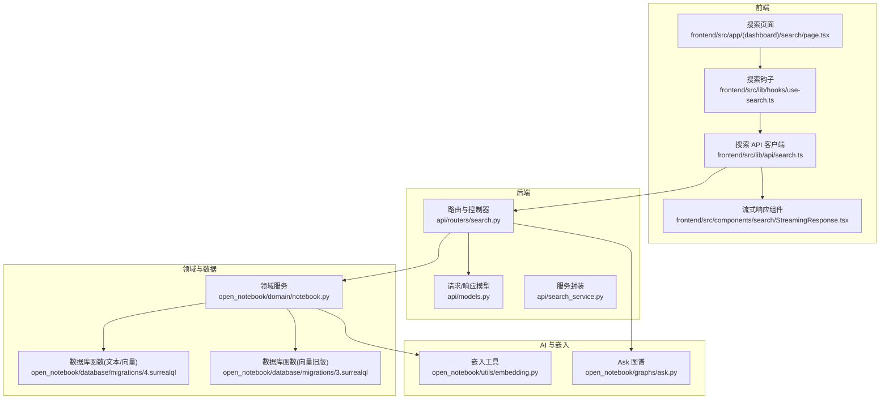
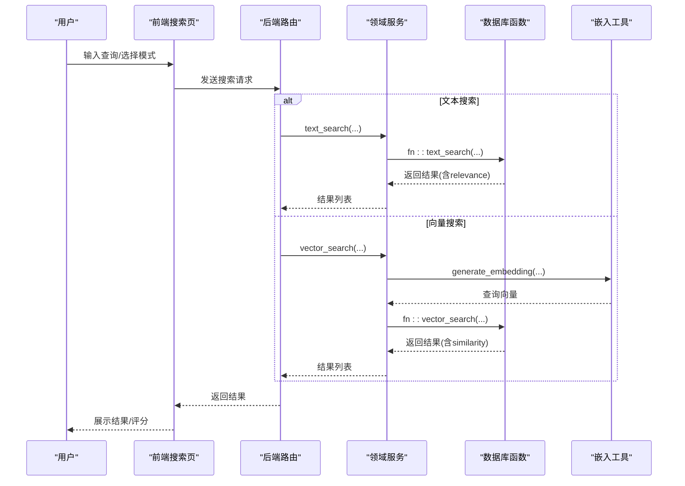
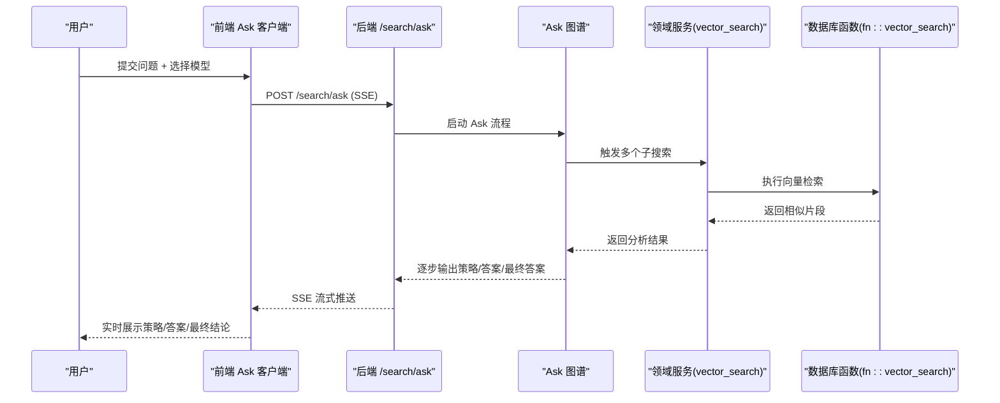
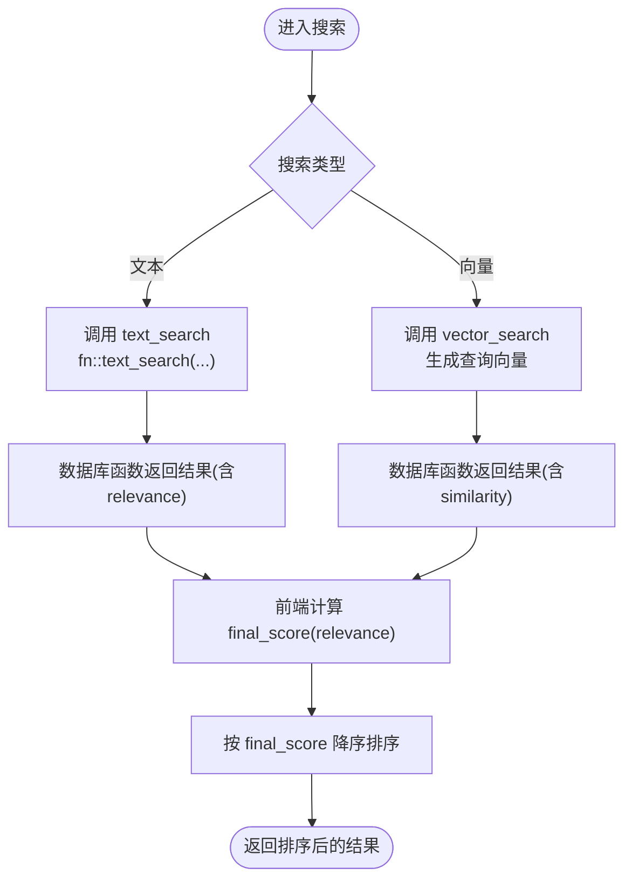
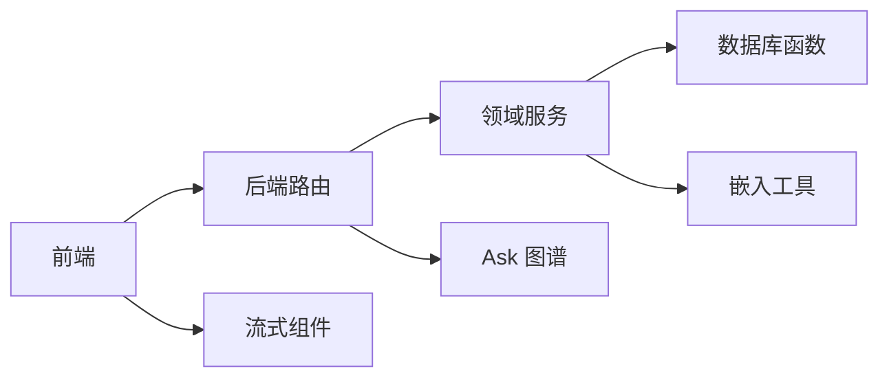

# 智能搜索

<cite>
**本文引用的文件**
- [api/routers/search.py](file://api/routers/search.py)
- [api/search_service.py](file://api/search_service.py)
- [api/models.py](file://api/models.py)
- [open_notebook/domain/notebook.py](file://open_notebook/domain/notebook.py)
- [open_notebook/graphs/ask.py](file://open_notebook/graphs/ask.py)
- [open_notebook/database/migrations/4.surrealql](file://open_notebook/database/migrations/4.surrealql)
- [open_notebook/database/migrations/3.surrealql](file://open_notebook/database/migrations/3.surrealql)
- [open_notebook/utils/embedding.py](file://open_notebook/utils/embedding.py)
- [frontend/src/app/(dashboard)/search/page.tsx](file://frontend/src/app/(dashboard)/search/page.tsx)
- [frontend/src/lib/hooks/use-search.ts](file://frontend/src/lib/hooks/use-search.ts)
- [frontend/src/components/search/StreamingResponse.tsx](file://frontend/src/components/search/StreamingResponse.tsx)
- [frontend/src/lib/api/search.ts](file://frontend/src/lib/api/search.ts)
- [docs/3-USER-GUIDE/search.md](file://docs/3-USER-GUIDE/search.md)
</cite>

## 目录
1. [简介](#简介)
2. [项目结构](#项目结构)
3. [核心组件](#核心组件)
4. [架构总览](#架构总览)
5. [详细组件分析](#详细组件分析)
6. [依赖关系分析](#依赖关系分析)
7. [性能考虑](#性能考虑)
8. [故障排查指南](#故障排查指南)
9. [结论](#结论)
10. [附录](#附录)

## 简介
本指南面向使用者与开发者，系统讲解智能搜索功能的高效用法与原理，覆盖两种搜索模式（文本搜索与向量搜索）、Ask 功能、结果排序与相关性评分、结果保存与导出、搜索历史与常用查询、性能优化与故障诊断等内容。目标是帮助你在海量知识中快速定位所需信息，并获得高质量的综合答案。

## 项目结构
智能搜索由“前端交互层 + 后端 API 层 + 领域服务层 + 数据库函数层 + 向量化工具层”构成，形成从用户输入到结果呈现的完整链路。

图表来源
- [api/routers/search.py](file://api/routers/search.py#L1-L215)
- [api/models.py](file://api/models.py#L32-L59)
- [api/search_service.py](file://api/search_service.py#L12-L59)
- [open_notebook/domain/notebook.py](file://open_notebook/domain/notebook.py#L638-L678)
- [open_notebook/database/migrations/4.surrealql](file://open_notebook/database/migrations/4.surrealql#L5-L35)
- [open_notebook/database/migrations/3.surrealql](file://open_notebook/database/migrations/3.surrealql#L36-L73)
- [open_notebook/utils/embedding.py](file://open_notebook/utils/embedding.py#L143-L208)
- [open_notebook/graphs/ask.py](file://open_notebook/graphs/ask.py#L1-L147)
- [frontend/src/app/(dashboard)/search/page.tsx](file://frontend/src/app/(dashboard)/search/page.tsx#L24-L166)
- [frontend/src/lib/hooks/use-search.ts](file://frontend/src/lib/hooks/use-search.ts#L1-L34)
- [frontend/src/lib/api/search.ts](file://frontend/src/lib/api/search.ts#L1-L63)
- [frontend/src/components/search/StreamingResponse.tsx](file://frontend/src/components/search/StreamingResponse.tsx#L1-L198)

章节来源
- [api/routers/search.py](file://api/routers/search.py#L1-L215)
- [frontend/src/app/(dashboard)/search/page.tsx](file://frontend/src/app/(dashboard)/search/page.tsx#L24-L166)

## 核心组件
- 前端搜索页面与交互
  - 负责接收用户输入、切换搜索模式、控制筛选项、展示结果与保存对话为笔记。
- 搜索钩子与 API 客户端
  - 统一处理搜索请求、结果排序与错误提示；流式 Ask 使用独立客户端。
- 后端路由与服务
  - 提供 /search 与 /search/ask 接口，校验模型可用性，调用领域服务执行搜索或 Ask 流程。
- 领域服务与数据库函数
  - 文本/向量搜索在领域层统一入口，底层通过数据库函数完成检索与聚合。
- 向量化与嵌入
  - 对长文本进行分块与均值池化，生成稳定向量以支持语义相似度检索。
- Ask 图谱
  - 自动拆解问题、并发检索、合成最终答案。

章节来源
- [frontend/src/app/(dashboard)/search/page.tsx](file://frontend/src/app/(dashboard)/search/page.tsx#L24-L166)
- [frontend/src/lib/hooks/use-search.ts](file://frontend/src/lib/hooks/use-search.ts#L1-L34)
- [frontend/src/lib/api/search.ts](file://frontend/src/lib/api/search.ts#L1-L63)
- [api/routers/search.py](file://api/routers/search.py#L17-L59)
- [api/search_service.py](file://api/search_service.py#L12-L59)
- [open_notebook/domain/notebook.py](file://open_notebook/domain/notebook.py#L638-L678)
- [open_notebook/database/migrations/4.surrealql](file://open_notebook/database/migrations/4.surrealql#L5-L35)
- [open_notebook/database/migrations/3.surrealql](file://open_notebook/database/migrations/3.surrealql#L36-L73)
- [open_notebook/utils/embedding.py](file://open_notebook/utils/embedding.py#L143-L208)
- [open_notebook/graphs/ask.py](file://open_notebook/graphs/ask.py#L1-L147)

## 架构总览
下图展示了从用户输入到结果返回的关键流程，包括文本搜索、向量搜索与 Ask 的差异路径。

图表来源
- [api/routers/search.py](file://api/routers/search.py#L17-L59)
- [open_notebook/domain/notebook.py](file://open_notebook/domain/notebook.py#L638-L678)
- [open_notebook/database/migrations/4.surrealql](file://open_notebook/database/migrations/4.surrealql#L5-L35)
- [open_notebook/database/migrations/3.surrealql](file://open_notebook/database/migrations/3.surrealql#L36-L73)
- [open_notebook/utils/embedding.py](file://open_notebook/utils/embedding.py#L143-L208)

## 详细组件分析

### 搜索模式：文本搜索 vs 向量搜索
- 文本搜索（关键词匹配）
  - 特点：命中精确词组/短语，基于相关性评分排序，速度极快。
  - 适用：需要精确匹配、特定术语、具体事实或引用时。
- 向量搜索（语义相似度）
  - 特点：将查询与内容向量计算相似度，发现概念相关但未精确出现的片段，速度较慢。
  - 适用：探索性研究、寻找近义表达、跨源关联。

章节来源
- [docs/3-USER-GUIDE/search.md](file://docs/3-USER-GUIDE/search.md#L24-L128)
- [api/routers/search.py](file://api/routers/search.py#L21-L43)
- [open_notebook/database/migrations/4.surrealql](file://open_notebook/database/migrations/4.surrealql#L5-L35)
- [open_notebook/database/migrations/3.surrealql](file://open_notebook/database/migrations/3.surrealql#L36-L73)

### Ask 功能：自动搜索与综合回答
- 工作机制
  - 问题理解 → 拆解为多个子搜索 → 并发检索 → 分析与合成 → 输出最终答案。
- 优势
  - 不仅给出检索结果，还能跨源整合、提炼要点、给出对比与总结。
- 使用场景
  - 复杂比较、跨源综述、大问题拆解与深入分析。

图表来源
- [api/routers/search.py](file://api/routers/search.py#L110-L154)
- [open_notebook/graphs/ask.py](file://open_notebook/graphs/ask.py#L78-L134)
- [open_notebook/domain/notebook.py](file://open_notebook/domain/notebook.py#L648-L678)
- [open_notebook/database/migrations/4.surrealql](file://open_notebook/database/migrations/4.surrealql#L5-L35)

章节来源
- [api/routers/search.py](file://api/routers/search.py#L110-L214)
- [open_notebook/graphs/ask.py](file://open_notebook/graphs/ask.py#L1-L147)
- [docs/3-USER-GUIDE/search.md](file://docs/3-USER-GUIDE/search.md#L169-L208)

### 搜索结果排序与相关性评分
- 文本搜索
  - 使用数据库内置评分函数，按相关性降序排列。
- 向量搜索
  - 使用余弦相似度，按 similarity 降序排列。
- 前端排序
  - 钩子会根据 relevance/similarity/score 计算统一 final_score 并排序。

图表来源
- [open_notebook/domain/notebook.py](file://open_notebook/domain/notebook.py#L638-L678)
- [open_notebook/database/migrations/4.surrealql](file://open_notebook/database/migrations/4.surrealql#L5-L35)
- [open_notebook/database/migrations/3.surrealql](file://open_notebook/database/migrations/3.surrealql#L36-L73)
- [frontend/src/lib/hooks/use-search.ts](file://frontend/src/lib/hooks/use-search.ts#L14-L26)

章节来源
- [frontend/src/lib/hooks/use-search.ts](file://frontend/src/lib/hooks/use-search.ts#L14-L26)
- [open_notebook/database/migrations/4.surrealql](file://open_notebook/database/migrations/4.surrealql#L5-L35)
- [open_notebook/database/migrations/3.surrealql](file://open_notebook/database/migrations/3.surrealql#L36-L73)

### 搜索技巧与最佳实践
- 关键词优化
  - 使用精确短语、技术术语；必要时加入同义词。
- 布尔查询与过滤
  - 在界面中启用“仅搜索源/笔记”，按需缩小范围。
- 组合策略
  - 先文本搜索缩小范围，再向量搜索补充相关片段；或先 Ask 获取整体框架，再深挖细节。
- 参考链接与上下文
  - 点击结果中的参考链接，可直接跳转到源/笔记详情。

章节来源
- [docs/3-USER-GUIDE/search.md](file://docs/3-USER-GUIDE/search.md#L211-L325)
- [frontend/src/app/(dashboard)/search/page.tsx](file://frontend/src/app/(dashboard)/search/page.tsx#L426-L459)

### Ask 的使用方法与流式体验
- 前端通过相对 URL 与 SSE 接收实时更新，包括策略推理、中间答案与最终结论。
- 支持自定义模型组合（策略模型/答案模型/最终答案模型），便于按任务特性调优。

章节来源
- [frontend/src/lib/api/search.ts](file://frontend/src/lib/api/search.ts#L11-L61)
- [frontend/src/components/search/StreamingResponse.tsx](file://frontend/src/components/search/StreamingResponse.tsx#L1-L198)
- [api/routers/search.py](file://api/routers/search.py#L110-L154)

### 结果保存、导出与进一步分析
- 保存为笔记
  - 通过“保存到笔记本”对话框，选择目标笔记本批量创建 AI 类型笔记，保留问题与答案。
- 导出与分析
  - 将 Ask 的最终答案作为素材，在聊天面板中添加到上下文，继续深入提问与交叉分析。
- 参考跳转
  - 结果中的参考链接可直接打开模态查看源/笔记/洞察详情。

章节来源
- [frontend/src/components/search/SaveToNotebooksDialog.tsx](file://frontend/src/components/search/SaveToNotebooksDialog.tsx#L42-L123)
- [frontend/src/app/(dashboard)/search/page.tsx](file://frontend/src/app/(dashboard)/search/page.tsx#L444-L459)

### 搜索历史与常用查询
- 命令面板
  - 支持在命令面板中直接发起“搜索/Ask”，并记录常用查询。
- URL 参数
  - 通过 q 与 mode 参数直接进入搜索/Ask 页面，便于快捷访问与分享。

章节来源
- [frontend/src/components/common/CommandPalette.tsx](file://frontend/src/components/common/CommandPalette.tsx#L115-L138)
- [frontend/src/app/(dashboard)/search/page.tsx](file://frontend/src/app/(dashboard)/search/page.tsx#L134-L157)

## 依赖关系分析
- 控制器依赖
  - 路由层依赖模型管理器检查嵌入模型可用性，依赖领域服务执行搜索，依赖 Ask 图谱执行综合问答。
- 领域服务依赖
  - 统一调用数据库函数完成文本/向量搜索；向量搜索前先生成查询向量。
- 嵌入工具依赖
  - 对长文本进行分块与均值池化，保证向量稳定性与一致性。
- 前端依赖
  - 搜索钩子负责结果排序与错误提示；流式组件负责渲染策略、答案与最终结论。

图表来源
- [api/routers/search.py](file://api/routers/search.py#L17-L59)
- [open_notebook/domain/notebook.py](file://open_notebook/domain/notebook.py#L638-L678)
- [open_notebook/utils/embedding.py](file://open_notebook/utils/embedding.py#L143-L208)
- [open_notebook/graphs/ask.py](file://open_notebook/graphs/ask.py#L1-L147)
- [frontend/src/lib/hooks/use-search.ts](file://frontend/src/lib/hooks/use-search.ts#L1-L34)
- [frontend/src/components/search/StreamingResponse.tsx](file://frontend/src/components/search/StreamingResponse.tsx#L1-L198)

章节来源
- [api/routers/search.py](file://api/routers/search.py#L17-L59)
- [open_notebook/domain/notebook.py](file://open_notebook/domain/notebook.py#L638-L678)
- [open_notebook/utils/embedding.py](file://open_notebook/utils/embedding.py#L143-L208)
- [open_notebook/graphs/ask.py](file://open_notebook/graphs/ask.py#L1-L147)
- [frontend/src/lib/hooks/use-search.ts](file://frontend/src/lib/hooks/use-search.ts#L1-L34)
- [frontend/src/components/search/StreamingResponse.tsx](file://frontend/src/components/search/StreamingResponse.tsx#L1-L198)

## 性能考虑
- 索引与向量
  - 确保已配置嵌入模型并完成内容向量化；长文本自动分块与均值池化，减少维度不一致影响。
- 查询优化
  - 文本搜索优先；向量搜索时尽量提供明确意图与上下文，提升召回质量。
- 结果缓存
  - 对高频查询可在应用层做轻量缓存（注意时效性与一致性）。
- 数据库函数
  - 文本/向量函数已在数据库侧完成相似度计算与聚合，避免重复拉取全量数据。

章节来源
- [open_notebook/utils/embedding.py](file://open_notebook/utils/embedding.py#L143-L208)
- [open_notebook/database/migrations/4.surrealql](file://open_notebook/database/migrations/4.surrealql#L5-L35)
- [open_notebook/database/migrations/3.surrealql](file://open_notebook/database/migrations/3.surrealql#L36-L73)

## 故障排查指南
- 无结果
  - 文本搜索：尝试向量搜索；或缩小范围（仅某源/笔记）。
  - 向量搜索：换更具体的表述；确认嵌入模型已配置。
- 结果过多
  - 缩小范围（按源过滤）；改用文本搜索；提高 minimum_score。
- 结果质量低
  - 明确意图与上下文；使用更精准术语；必要时结合 Ask 获取综合答案。
- Ask 失败
  - 确认嵌入模型可用；检查模型 ID 是否存在；查看 SSE 错误消息。

章节来源
- [docs/3-USER-GUIDE/search.md](file://docs/3-USER-GUIDE/search.md#L266-L301)
- [api/routers/search.py](file://api/routers/search.py#L21-L59)
- [frontend/src/lib/api/search.ts](file://frontend/src/lib/api/search.ts#L43-L61)

## 结论
- 文本搜索适合精确查找，向量搜索适合概念探索，Ask 适合复杂问题的自动化综合分析。
- 合理搭配三种能力，可显著提升知识检索效率与深度。
- 通过保存为笔记、导出与进一步分析，将搜索成果沉淀为个人知识资产。

## 附录
- 快速开始
  - 文本搜索：输入关键词，回车即可；适合精确事实与术语。
  - 向量搜索：输入自然语言描述，选择向量模式；适合探索与发现。
  - Ask：输入复杂问题，系统自动拆解、检索、分析并输出综合答案。
- 进阶技巧
  - 先文本搜索，再向量搜索；先 Ask，再深挖细节；将结果保存为笔记以便复用。

章节来源
- [docs/3-USER-GUIDE/search.md](file://docs/3-USER-GUIDE/search.md#L7-L476)
- [frontend/src/app/(dashboard)/search/page.tsx](file://frontend/src/app/(dashboard)/search/page.tsx#L85-L102)