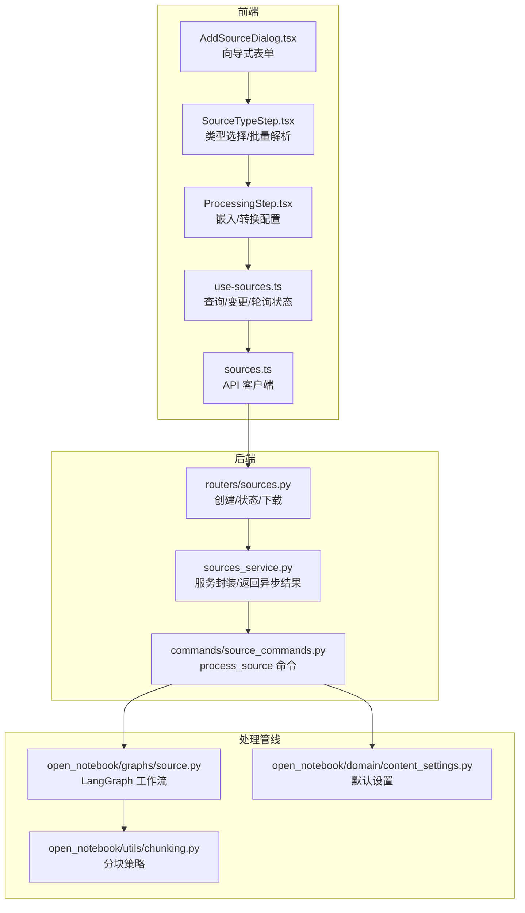
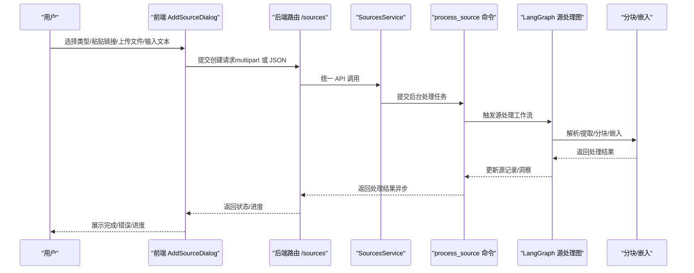
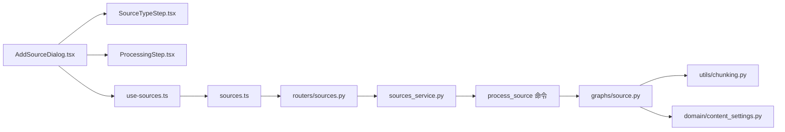

# 添加内容源

<cite>
**本文引用的文件**
- [docs/3-USER-GUIDE/adding-sources.md](file://docs/3-USER-GUIDE/adding-sources.md)
- [frontend/src/components/sources/AddSourceDialog.tsx](file://frontend/src/components/sources/AddSourceDialog.tsx)
- [frontend/src/components/sources/steps/SourceTypeStep.tsx](file://frontend/src/components/sources/steps/SourceTypeStep.tsx)
- [frontend/src/components/sources/steps/ProcessingStep.tsx](file://frontend/src/components/sources/steps/ProcessingStep.tsx)
- [frontend/src/lib/hooks/use-sources.ts](file://frontend/src/lib/hooks/use-sources.ts)
- [frontend/src/lib/api/sources.ts](file://frontend/src/lib/api/sources.ts)
- [api/routers/sources.py](file://api/routers/sources.py)
- [api/sources_service.py](file://api/sources_service.py)
- [commands/source_commands.py](file://commands/source_commands.py)
- [open_notebook/graphs/source.py](file://open_notebook/graphs/source.py)
- [open_notebook/utils/chunking.py](file://open_notebook/utils/chunking.py)
- [open_notebook/domain/content_settings.py](file://open_notebook/domain/content_settings.py)
</cite>

## 目录
1. [简介](#简介)
2. [项目结构](#项目结构)
3. [核心组件](#核心组件)
4. [架构总览](#架构总览)
5. [详细组件分析](#详细组件分析)
6. [依赖关系分析](#依赖关系分析)
7. [性能与可扩展性](#性能与可扩展性)
8. [故障排查指南](#故障排查指南)
9. [结论](#结论)
10. [附录](#附录)

## 简介
本指南面向“添加内容源”全流程，覆盖以下能力与场景：
- 支持的内容类型：PDF 文档、网页链接、音频文件、视频文件、纯文本/富文本、电子书（EPUB）、演示文稿（PPTX）等
- 添加步骤与最佳实践：逐类说明输入方式、注意事项与推荐做法
- 处理流程：上传、解析、分块、向量化、索引与洞察生成的阶段说明与状态展示
- 批量添加、断点续传、重复内容检测、分类管理、标签与元数据编辑等高级用法
- 常见问题与排障：格式不支持、大小限制、网络超时、转写失败等

## 项目结构
“添加内容源”涉及前端交互、后端路由与服务层、命令执行与图编排、以及工具库（分块、嵌入）等模块协同工作。

图表来源
- [frontend/src/components/sources/AddSourceDialog.tsx](file://frontend/src/components/sources/AddSourceDialog.tsx#L1-L635)
- [frontend/src/components/sources/steps/SourceTypeStep.tsx](file://frontend/src/components/sources/steps/SourceTypeStep.tsx#L1-L357)
- [frontend/src/components/sources/steps/ProcessingStep.tsx](file://frontend/src/components/sources/steps/ProcessingStep.tsx#L1-L127)
- [frontend/src/lib/hooks/use-sources.ts](file://frontend/src/lib/hooks/use-sources.ts#L1-L375)
- [frontend/src/lib/api/sources.ts](file://frontend/src/lib/api/sources.ts#L1-L120)
- [api/routers/sources.py](file://api/routers/sources.py#L1-L800)
- [api/sources_service.py](file://api/sources_service.py#L1-L325)
- [commands/source_commands.py](file://commands/source_commands.py#L1-L269)
- [open_notebook/graphs/source.py](file://open_notebook/graphs/source.py#L1-L168)
- [open_notebook/utils/chunking.py](file://open_notebook/utils/chunking.py#L1-L446)
- [open_notebook/domain/content_settings.py](file://open_notebook/domain/content_settings.py#L1-L26)

章节来源
- [frontend/src/components/sources/AddSourceDialog.tsx](file://frontend/src/components/sources/AddSourceDialog.tsx#L1-L635)
- [api/routers/sources.py](file://api/routers/sources.py#L1-L800)

## 核心组件
- 前端向导与表单
  - AddSourceDialog：三步向导（类型选择/批量解析、笔记本选择、处理配置），支持批量提交、进度与错误提示
  - SourceTypeStep：支持“链接/上传/文本”三种类型；批量 URL/PDF 解析与校验；标题在批量模式下自动推断
  - ProcessingStep：嵌入选项、转换器勾选、嵌入开关与默认策略提示
- 后端路由与服务
  - 路由：创建源、查询状态、重试、下载原文件等
  - 服务：统一 API 封装，区分同步/异步处理返回值
- 命令与图编排
  - process_source 命令：加载转换器、调用 content-core 提取、保存源、可选向量化、触发洞察
  - LangGraph 工作流：内容提取 → 保存 → 可选转换 → 结束
- 工具库
  - 分块：按内容类型（HTML/Markdown/Plain）智能切分，支持二次分块与重叠
  - 内容设置：默认内容引擎、嵌入选项、YouTube 语言偏好等

章节来源
- [frontend/src/components/sources/AddSourceDialog.tsx](file://frontend/src/components/sources/AddSourceDialog.tsx#L1-L635)
- [frontend/src/components/sources/steps/SourceTypeStep.tsx](file://frontend/src/components/sources/steps/SourceTypeStep.tsx#L1-L357)
- [frontend/src/components/sources/steps/ProcessingStep.tsx](file://frontend/src/components/sources/steps/ProcessingStep.tsx#L1-L127)
- [api/routers/sources.py](file://api/routers/sources.py#L1-L800)
- [api/sources_service.py](file://api/sources_service.py#L1-L325)
- [commands/source_commands.py](file://commands/source_commands.py#L1-L269)
- [open_notebook/graphs/source.py](file://open_notebook/graphs/source.py#L1-L168)
- [open_notebook/utils/chunking.py](file://open_notebook/utils/chunking.py#L1-L446)
- [open_notebook/domain/content_settings.py](file://open_notebook/domain/content_settings.py#L1-L26)

## 架构总览
从用户输入到内容可用的端到端流程如下：

图表来源
- [frontend/src/components/sources/AddSourceDialog.tsx](file://frontend/src/components/sources/AddSourceDialog.tsx#L1-L635)
- [api/routers/sources.py](file://api/routers/sources.py#L1-L800)
- [api/sources_service.py](file://api/sources_service.py#L1-L325)
- [commands/source_commands.py](file://commands/source_commands.py#L1-L269)
- [open_notebook/graphs/source.py](file://open_notebook/graphs/source.py#L1-L168)
- [open_notebook/utils/chunking.py](file://open_notebook/utils/chunking.py#L1-L446)

## 详细组件分析

### 前端：添加对话框与向导
- 三步向导
  - 步骤1：类型选择（链接/上传/文本），支持批量输入（多 URL 或多文件），自动计数与上限提示
  - 步骤2：选择笔记本（可多选），立即生效以提升体验
  - 步骤3：处理配置（是否嵌入、应用哪些转换器）
- 批量与进度
  - 批量模式下顺序提交，实时显示当前条目、完成/失败统计与百分比
  - 异步处理时，前端轮询状态接口，自动刷新直到完成或失败
- 表单验证与错误
  - 类型必填、标题对文本类型必填、URL 校验与错误列表、文件数量限制
- 本地化与可访问性
  - 使用翻译键，错误提示与状态文案本地化

章节来源
- [frontend/src/components/sources/AddSourceDialog.tsx](file://frontend/src/components/sources/AddSourceDialog.tsx#L1-L635)
- [frontend/src/components/sources/steps/SourceTypeStep.tsx](file://frontend/src/components/sources/steps/SourceTypeStep.tsx#L1-L357)
- [frontend/src/components/sources/steps/ProcessingStep.tsx](file://frontend/src/components/sources/steps/ProcessingStep.tsx#L1-L127)
- [frontend/src/lib/hooks/use-sources.ts](file://frontend/src/lib/hooks/use-sources.ts#L1-L375)

### 后端：创建与状态管理
- 创建源
  - 支持 multipart/form-data 与 JSON 两种输入；校验类型、URL/内容/文件路径、转换器存在性
  - 异步模式：先创建最小源记录，立即返回“排队中”，随后提交后台命令
  - 同步模式：在线执行并返回完整结果（兼容旧版）
- 文件上传
  - 保存到上传目录，生成唯一文件名；失败清理临时文件
- 状态与重试
  - 提供状态查询接口，轮询刷新；失败时可重试
- 下载原文件
  - 校验安全路径，仅允许下载已关联的上传文件

章节来源
- [api/routers/sources.py](file://api/routers/sources.py#L1-L800)
- [api/sources_service.py](file://api/sources_service.py#L1-L325)

### 命令与图编排：内容处理工作流
- process_source 命令
  - 加载转换器、更新源的命令引用、调用源处理图、统计嵌入块数与洞察数
- LangGraph 源处理图
  - 节点：内容提取、保存源、可选转换
  - 边：按条件触发转换，完成后结束
  - 配置：内容引擎、输出格式、语音转写模型等来自内容设置
- 转换器
  - 可为每个源单独选择多个转换器，异步触发生成洞察

章节来源
- [commands/source_commands.py](file://commands/source_commands.py#L1-L269)
- [open_notebook/graphs/source.py](file://open_notebook/graphs/source.py#L1-L168)
- [open_notebook/domain/content_settings.py](file://open_notebook/domain/content_settings.py#L1-L26)

### 分块与嵌入：向量化与索引
- 分块策略
  - 自动识别内容类型（HTML/Markdown/Plain），按类型选择合适分割器
  - 支持二次分块与重叠，确保单块不超过阈值
- 嵌入
  - 对每个分块生成向量，批量插入数据库
  - 单块时直接返回向量，多块时进行平均池化得到单一向量

章节来源
- [open_notebook/utils/chunking.py](file://open_notebook/utils/chunking.py#L1-L446)

### 用户指南要点（来自文档）
- 支持的文件类型与大小限制、处理耗时参考
- 不同类型的最佳实践与常见问题
- 元数据与组织：标题、标签、描述、搜索与上下文控制

章节来源
- [docs/3-USER-GUIDE/adding-sources.md](file://docs/3-USER-GUIDE/adding-sources.md#L1-L430)

## 依赖关系分析

图表来源
- [frontend/src/components/sources/AddSourceDialog.tsx](file://frontend/src/components/sources/AddSourceDialog.tsx#L1-L635)
- [frontend/src/components/sources/steps/SourceTypeStep.tsx](file://frontend/src/components/sources/steps/SourceTypeStep.tsx#L1-L357)
- [frontend/src/components/sources/steps/ProcessingStep.tsx](file://frontend/src/components/sources/steps/ProcessingStep.tsx#L1-L127)
- [frontend/src/lib/hooks/use-sources.ts](file://frontend/src/lib/hooks/use-sources.ts#L1-L375)
- [frontend/src/lib/api/sources.ts](file://frontend/src/lib/api/sources.ts#L1-L120)
- [api/routers/sources.py](file://api/routers/sources.py#L1-L800)
- [api/sources_service.py](file://api/sources_service.py#L1-L325)
- [commands/source_commands.py](file://commands/source_commands.py#L1-L269)
- [open_notebook/graphs/source.py](file://open_notebook/graphs/source.py#L1-L168)
- [open_notebook/utils/chunking.py](file://open_notebook/utils/chunking.py#L1-L446)
- [open_notebook/domain/content_settings.py](file://open_notebook/domain/content_settings.py#L1-L26)

## 性能与可扩展性
- 批量处理
  - 前端顺序串行提交，避免并发压力；建议每次批量不超过系统建议上限
- 分块参数
  - 可通过环境变量调整分块大小与重叠，平衡召回与性能
- 异步处理
  - 默认启用异步，UI 及时可见进度；同步模式适合小体量内容
- 嵌入与索引
  - 批量嵌入减少 API 调用次数；平均池化降低向量维度

章节来源
- [frontend/src/components/sources/AddSourceDialog.tsx](file://frontend/src/components/sources/AddSourceDialog.tsx#L1-L635)
- [open_notebook/utils/chunking.py](file://open_notebook/utils/chunking.py#L1-L446)
- [api/routers/sources.py](file://api/routers/sources.py#L1-L800)

## 故障排查指南
- 常见错误与原因
  - 不支持的文件类型：检查扩展名与内容引擎支持范围
  - 文件过大或超时：拆分文件或降低分辨率/采样率
  - 网络超时/链接无法提取：改用全文粘贴或稍后重试
  - 转写失败：提高音频质量或手动补充文本
- 排查步骤
  - 查看状态接口：确认排队/运行/完成/失败
  - 重试失败任务：触发重试接口
  - 下载原文件：核对上传路径与权限
- UI 提示
  - 前端提供批量进度、错误汇总与本地化提示

章节来源
- [docs/3-USER-GUIDE/adding-sources.md](file://docs/3-USER-GUIDE/adding-sources.md#L329-L430)
- [frontend/src/lib/hooks/use-sources.ts](file://frontend/src/lib/hooks/use-sources.ts#L222-L247)
- [api/routers/sources.py](file://api/routers/sources.py#L691-L750)

## 结论
“添加内容源”提供了从多种来源到可检索知识的完整链路：前端向导简化操作，后端路由与服务保障可靠性，命令与图编排实现可扩展处理，分块与嵌入确保高质量语义检索。配合元数据与上下文控制，用户可以高效构建个人知识体系并用于后续的检索、洞察与创作。

## 附录

### 支持的内容类型与最佳实践
- 文档类：PDF（含扫描版）、Word、PPTX、Excel、EPUB、Markdown、HTML
  - 最佳实践：清晰扫描版需 OCR；大文件建议拆分；避免加密/受保护文件
- 网页链接：文章、新闻、维基百科、Medium、Substack 等
  - 最佳实践：粘贴完整 URL；若提取失败，复制正文作为“文本”添加
- 音频/视频：MP3/WAV/M4A/OGG/FLAC、MP4/AVI/MOV/MKV/WebM
  - 最佳实践：开启语音转写；清晰录音更易准确；YouTube/播客可直接粘贴链接
- 纯文本/富文本：Markdown、HTML、TXT
  - 最佳实践：直接粘贴；如含 HTML，前端可自动识别并优先使用

章节来源
- [docs/3-USER-GUIDE/adding-sources.md](file://docs/3-USER-GUIDE/adding-sources.md#L43-L79)
- [frontend/src/components/sources/steps/SourceTypeStep.tsx](file://frontend/src/components/sources/steps/SourceTypeStep.tsx#L1-L357)

### 处理流程与状态
- 流程阶段
  - 解析：从文件/链接/文本抽取可读内容
  - 分块：按内容类型智能切分
  - 向量化：为每块生成向量并入库
  - 索引与洞察：建立可检索索引与可选洞察
- 状态指示
  - 处理中（等待 30 秒至数分钟）
  - 已就绪（可立即用于聊天/搜索）
  - 错误（查看错误原因并重试）

章节来源
- [docs/3-USER-GUIDE/adding-sources.md](file://docs/3-USER-GUIDE/adding-sources.md#L82-L106)
- [frontend/src/lib/hooks/use-sources.ts](file://frontend/src/lib/hooks/use-sources.ts#L222-L247)

### 批量添加、断点续传与重复检测
- 批量添加
  - 支持多 URL/多文件一次性提交；前端顺序处理并显示进度
- 断点续传
  - 当前实现为顺序提交；建议在网络稳定时进行小批量提交
- 重复内容检测
  - 未在前端/后端发现显式的去重逻辑；可通过元数据（标题/标签/描述）辅助管理

章节来源
- [frontend/src/components/sources/AddSourceDialog.tsx](file://frontend/src/components/sources/AddSourceDialog.tsx#L322-L383)
- [api/routers/sources.py](file://api/routers/sources.py#L352-L426)

### 分类管理、标签与元数据编辑
- 分类与组织
  - 在笔记本间移动/关联；支持多笔记本同时关联
- 标签与元数据
  - 标题、标签、描述；建议在添加后立即完善
- 上下文控制
  - 聊天时可选择“全文/摘要/排除”，控制成本与效果

章节来源
- [docs/3-USER-GUIDE/adding-sources.md](file://docs/3-USER-GUIDE/adding-sources.md#L229-L312)
- [frontend/src/lib/hooks/use-sources.ts](file://frontend/src/lib/hooks/use-sources.ts#L280-L340)